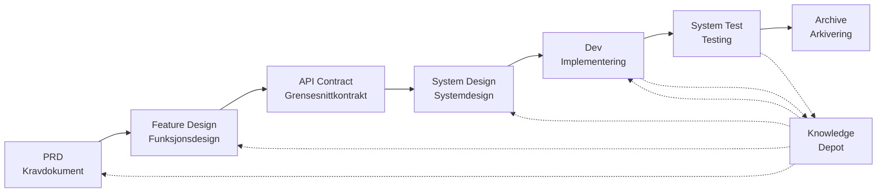

# SpecCrew - AI-drevet programvareingeniør-rammeverk

<p align="center">
  <a href="./README.md">简体中文</a> |
  <a href="./README.zh-TW.md">繁體中文</a> |
  <a href="./README.en.md">English</a> |
  <a href="./README.ko.md">한국어</a> |
  <a href="./README.de.md">Deutsch</a> |
  <a href="./README.es.md">Español</a> |
  <a href="./README.fr.md">Français</a> |
  <a href="./README.it.md">Italiano</a> |
  <a href="./README.da.md">Dansk</a> |
  <a href="./README.ja.md">日本語</a> |
  <a href="./README.pl.md">Polski</a> |
  <a href="./README.ru.md">Русский</a> |
  <a href="./README.bs.md">Bosanski</a> |
  <a href="./README.ar.md">العربية</a> |
  <a href="./README.no.md">Norsk</a> |
  <a href="./README.pt-BR.md">Português (Brasil)</a> |
  <a href="./README.th.md">ไทย</a> |
  <a href="./README.tr.md">Türkçe</a> |
  <a href="./README.uk.md">Українська</a> |
  <a href="./README.bn.md">বাংলা</a> |
  <a href="./README.el.md">Ελληνικά</a> |
  <a href="./README.vi.md">Tiếng Việt</a>
</p>

<p align="center">
  <a href="https://www.npmjs.com/package/speccrew"></a>
  <a href="https://www.npmjs.com/package/speccrew"></a>
  <a href="https://github.com/charlesmu99/speccrew/blob/main/LICENSE"></a>
</p>

> Et virtuelt AI-utviklingsteam som muliggjør rask ingeniørimplementering for ethvert programvareprosjekt

## Hva er SpecCrew?

SpecCrew er et innebygd virtuelt AI-utviklingsteam-rammeverk. Det transformerer profesjonelle programvareingeniør-arbeidsflyter (PRD → Feature Design → System Design → Dev → Test) til gjenbrukbare Agent-arbeidsflyter, og hjelper utviklingsteam å oppnå Specification-Driven Development (SDD), spesielt egnet for eksisterende prosjekter.

Ved å integrere Agenter og Skills i eksisterende prosjekter, kan team raskt initialisere prosjektdokumentasjonssystemer og virtuelle programvareteam, og implementere nye funksjoner og modifikasjoner i henhold til standard ingeniørarbeidsflyter.

---

## ✨ Nøkkelfunksjoner

### 🏭 Virtuelt Programvareteam
Ett-klikks generering av **7 profesjonelle Agent-roller** + **38 Skill-arbeidsflyter**, bygging av et komplett virtuelt programvareteam:
- **Team Leader** - Global planlegging og iterasjonshåndtering
- **Product Manager** - Kravanalyse og PRD-utdata
- **Feature Designer** - Funksjonsdesign + API-kontrakter
- **System Designer** - Systemdesign for Frontend/Backend/Mobil/Desktop
- **System Developer** - Multiplattform parallellutvikling
- **Test Manager** - Trefaset testkoordinering
- **Task Worker** - Parallell underoppgaveutførelse

### 📐 ISA-95 Sekstrinns Modellering
Basert på internasjonal **ISA-95** modelleringsmetodikk, standardisering av transformasjonen fra forretningskrav til programvaresystemer:
```
Domain Descriptions → Functions in Domains → Functions of Interest
     ↓                       ↓                      ↓
Information Flows → Categories of Information → Information Descriptions
```
- Hvert trinn tilsvarer spesifikke UML-diagrammer (use case, sekvens, klassediagrammer)
- Forretningskrav "foredles trinn for trinn" uten informasjonstap
- Uttak er direkte brukbar for utvikling

### 📚 Kunnskapsbasesystem
Trenivå kunnskapsbasearkitektur som sikrer at AI alltid jobber basert på "den eneste sannhetskilden":

| Nivå | Katalog | Innhold | Formål |
|------|---------|---------|--------|
| L1 Systemkunnskap | `knowledge/techs/` | Tech-stack, arkitektur, konvensjoner | AI forstår prosjektets tekniske grenser |
| L2 Forretningskunnskap | `knowledge/bizs/` | Modulfunksjoner, forretningsflyter, enheter | AI forstår forretningslogikk |
| L3 Iterasjonsartefakter | `iterations/iXXX/` | PRD, designdokumenter, testrapporter | Full sporbarhetskjede for gjeldende krav |

### 🔄 Firetrinns Kunnskapspipeline
**Automatisert kunnskapsproduksjonsarkitektur**, automatisk generering av forretnings/teknisk dokumentasjon fra kildekode:
```
Trinn 1: Skann kildekode → Generer modulliste
Trinn 2: Parallell analyse → Trekk ut funksjoner (multi-Worker parallelt)
Trinn 3: Parallell oppsummering → Fullfør moduloversikter (multi-Worker parallelt)
Trinn 4: Systemaggregering → Generer systempanorama
```
- Støtter **full synkronisering** og **inkrementell synkronisering** (basert på Git diff)
- En person optimaliserer, team deler

---

## 8 Kjerne-problemer Løst

### 1. AI Ignorerer Eksisterende Prosjektdokumentasjon (Kunnskapshull)
**Problem**: Eksisterende SDD- eller Vibe Coding-metoder er avhengige av at AI oppsummerer prosjekter i sanntid, noe som lett går glipp av kritisk kontekst og forårsaker utviklingsresultater som avviker fra forventninger.

**Løsning**: `knowledge/`-depotet fungerer som prosjektets "eneste kilde til sannhet", og akkumulerer arkitekturdesign, funksjonelle moduler og forretningsprosesser for å sikre at kravene holder seg på sporet fra kilden.

### 2. Direkte PRD-til-Teknisk Dokumentasjon (Innholdsutelatelse)
**Problem**: Å hoppe direkte fra PRD til detaljert design går lett glipp av kravdetaljer, noe som får implementerte funksjoner til å avvike fra kravene.

**Løsning**: Introduser **Feature Design-dokument**-fasen, som kun fokuserer på kravskjelettet uten tekniske detaljer:
- Hvilke sider og komponenter er inkludert?
- Sideoperasjonsflyter
- Backend-behandlingslogikk
- Datalagringsstruktur

Utvikling trenger kun å "fylle kjøttet" basert på den spesifikke tech-stacken, og sikrer at funksjoner vokser "tett på beinet (kravene)".

### 3. Usikker Agent-søkeomfang (Usikkerhet)
**Problem**: I komplekse prosjekter gir AI's brede søk etter kode og dokumenter usikre resultater, noe som gjør konsistens vanskelig å garantere.

**Løsning**: Klare dokumentkatalogstrukturer og maler, designet basert på hver Agents behov, implementerer **progressiv offentliggjøring og behovslastering** for å sikre determinisme.

### 4. Manglende Trinn og Oppgaver (Prosess-nedbryting)
**Problem**: Manglende fullstendig dekning av ingeniørprosessen går lett glipp av kritiske trinn, noe som gjør kvalitet vanskelig å garantere.

**Løsning**: Dekker hele programvareingeniør-livssyklusen:
```
PRD (Krav) → Feature Design (Funksjonsdesign) → API Contract (Kontrakt)
    → System Design (Systemdesign) → Dev (Utvikling) → Test (Testing)
```
- Hver fases utdata er neste fases inndata
- Hvert trinn krever menneskelig bekreftelse før fortsettelse
- Alle Agent-eksekveringer har todo-lister med selvkontroll etter fullføring

### 5. Lav Team-samarbeidseffektivitet (Kunnskap-siloer)
**Problem**: AI-programmeringserfaring er vanskelig å dele på tvers av team, noe som fører til gjentatte feil.

**Løsning**: Alle Agenter, Skills og relaterte dokumenter er versjonskontrollert med kildekode:
- Én persons optimalisering deles av teamet
- Kunnskap akkumuleres i kodebasen
- Forbedret team-samarbeidseffektivitet

### 7. Enkelt Agent-kontekst for Lang (Ytelses-flaskehals)
**Problem**: Store komplekse oppgaver overstiger enkelt Agent-kontekstvinduer, noe som forårsaker forståelsesavvik og redusert utdatakvalitet.

**Løsning**: **Sub-Agent Auto-Dispatch-mekanisme**:
- Komplekse oppgaver identifiseres automatisk og deles inn i underoppgaver
- Hver underoppgave utføres av en uavhengig sub-Agent med isolert kontekst
- Parent Agent koordinerer og aggregerer for å sikre generell konsistens
- Unngår enkelt Agent-kontekstutvidelse og sikrer utdatakvalitet

### 8. Krav-iterasjonskaos (Ledelsesvanskeligheter)
**Problem**: Flere krav blandet i samme gren påvirker hverandre, noe som gjør sporing og tilbakeføring vanskelig.

**Løsning**: **Hvert Krav som et Uavhengig Prosjekt**:
- Hvert krav oppretter en uavhengig iterasjonskatalog `iterations/iXXX-[krav-navn]/`
- Fullstendig isolasjon: dokumenter, design, kode og tester administreres uavhengig
- Rask iterasjon: liten granularitetsleveranse, rask verifisering, rask utrulling
- Fleksibel arkivering: etter fullføring, arkivering til `archive/` med klar historisk sporing

### 6. Dokumentoppdateringsforsinkelse (Kunnskaps-forråtning)
**Problem**: Dokumenter blir utdaterte etter hvert som prosjekter utvikler seg, noe som får AI til å arbeide med feil informasjon.

**Løsning**: Agenter har automatiske dokumentoppdateringsmuligheter, og synkroniserer prosjektendringer i sanntid for å holde kunnskapsbasen nøyaktig.

---

## Kjerne-arbeidsflyt



### Fasebeskrivelser

| Fase | Agent | Inndata | Utdata | Menneskelig Bekreftelse |
|------|-------|---------|--------|------------------------|
| PRD | PM | Brukerkrav | Produktkravdokument | ✅ Påkrevd |
| Feature Design | Feature Designer | PRD | Feature Design Dokument + API Kontrakt | ✅ Påkrevd |
| System Design | System Designer | Feature Spec | Frontend/Backend Design-dokumenter | ✅ Påkrevd |
| Dev | Dev | Design | Kode + Oppgaveregistreringer | ✅ Påkrevd |
| System Test | Test Manager | Dev Utdata + Feature Spec | Testtilfeller + Testkode + Testrapport + Bug-rapport | ✅ Påkrevd |

---

## Sammenligning med Eksisterende Løsninger

| Dimensjon | Vibe Coding | Ralph Loop | **SpecCrew** |
|-----------|-------------|------------|-------------|
| Dokumentavhengighet | Ignorerer eksisterende docs | Er avhengig av AGENTS.md | **Strukturert Kunnskapsbase** |
| Kravoverføring | Direkte koding | PRD → Kode | **PRD → Feature Design → System Design → Kode** |
| Menneskelig involvering | Minimal | Ved oppstart | **I hver fase** |
| Prosessfullstendighet | Svak | Middels | **Fullstendig ingeniørarbeidsflyt** |
| Team-samarbeid | Vanskelig å dele | Personlig effektivitet | **Team kunnskapsdeling** |
| Kontekststyring | Enkelt instans | Enkelt instans-løkke | **Sub-Agent auto-dispatch** |
| Iterasjonsstyring | Blandet | Oppgaveliste | **Krav som prosjekt, uavhengig iterasjon** |
| Determinisme | Lav | Middels | **Høy (progressiv offentliggjøring)** |

---

## Rask Start

### Forutsetninger

- Node.js >= 16.0.0
- Støttede IDE-er: Qoder (standard), Cursor, Claude Code

> **Merk**: Adapterne for Cursor og Claude Code er ikke testet i faktiske IDE-miljøer (implementert på kodenivå og verifisert gjennom E2E-tester, men ennå ikke testet i faktisk Cursor/Claude Code).

### 1. Installer SpecCrew

```bash
npm install -g speccrew
```

### 2. Initialiser Prosjekt

Naviger til prosjektets rotkatalog og kjør initialiseringskommandoen:

```bash
cd /path/to/your-project

# Bruker Qoder som standard
speccrew init

# Eller spesifiser IDE
speccrew init --ide qoder
speccrew init --ide cursor
speccrew init --ide claude
```

Etter initialisering vil følgende bli generert i prosjektet ditt:
- `.qoder/agents/` / `.cursor/agents/` / `.claude/agents/` — 7 Agent-rolledefinisjoner
- `.qoder/skills/` / `.cursor/skills/` / `.claude/skills/` — 38 Skill-arbeidsflyter
- `speccrew-workspace/` — Arbeidsområde (iterasjonskataloger, kunnskapsbase, dokumentmaler)
- `.speccrewrc` — SpecCrew-konfigurasjonsfil

For å oppdatere Agenter og Skills for en spesifikk IDE senere:

```bash
speccrew update --ide cursor
speccrew update --ide claude
```

### 3. Start Utviklingsarbeidsflyt

Følg standard ingeniørarbeidsflyt trinn for trinn:

1. **PRD**: Produktleder Agent analyserer krav og genererer produktkravdokument
2. **Feature Design**: Feature Designer Agent genererer feature design dokument + API kontrakt
3. **System Design**: System Designer Agent genererer system design dokumenter per plattform (frontend/backend/mobil/desktop)
4. **Dev**: System Utvikler Agent implementerer utvikling per plattform parallelt
5. **System Test**: Testleder Agent koordinerer trefase-testing (tilfelledesign → kodegenerering → utførelsesrapport)
6. **Archive**: Arkiver iterasjon

> Hver fases leveranser krever menneskelig bekreftelse før fortsettelse til neste fase.

### 4. Oppdater SpecCrew

Når en ny versjon av SpecCrew slippes, fullfør oppdateringen i to trinn:

```bash
# Step 1: Update the global CLI tool to the latest version
npm install -g speccrew@latest

# Step 2: Sync Agents and Skills in your project to the latest version
cd /path/to/your-project
speccrew update
```

> **Merk**: `npm install -g speccrew@latest` oppdaterer selve CLI-verktøyet, mens `speccrew update` oppdaterer Agent- og Skill-definisjonsfilene i prosjektet ditt. Begge trinnene er nødvendige for en fullstendig oppdatering.

### 5. Andre CLI-kommandoer

```bash
speccrew list       # List opp installerte agenter og skills
speccrew doctor     # Diagnostiser miljø og installasjonsstatus
speccrew update     # Oppdater agenter og skills til nyeste versjon
speccrew uninstall  # Avinstaller SpecCrew (--all fjerner også arbeidsområde)
```

📖 **Detaljert Guide**: Etter installasjon, sjekk [Kom-i-gang-guiden](docs/GETTING-STARTED.no.md) for fullstendig arbeidsflyt og agent-samtaleguide.

---

## Katalogstruktur

```
your-project/
├── .qoder/                          # IDE-konfigurasjonskatalog (Qoder-eksempel)
│   ├── agents/                      # 7 rolle-Agenter
│   │   ├── speccrew-team-leader.md       # Teamleder: Global planlegging og iterasjonsstyring
│   │   ├── speccrew-product-manager.md   # Produktleder: Kravanalyse og PRD
│   │   ├── speccrew-feature-designer.md  # Feature Designer: Feature Design + API Kontrakt
│   │   ├── speccrew-system-designer.md   # System Designer: System design per plattform
│   │   ├── speccrew-system-developer.md  # System Utvikler: Parallell utvikling per plattform
│   │   ├── speccrew-test-manager.md      # Testleder: Trefase-testkoordinering
│   │   └── speccrew-task-worker.md       # Oppgave-arbeider: Parallell underoppgave-utførelse
│   └── skills/                      # 38 Skills (gruppert etter funksjon)
│       ├── speccrew-pm-*/                # Produktstyring (kravanalyse, evaluering)
│       ├── speccrew-fd-*/                # Feature Design (Feature Design, API Kontrakt)
│       ├── speccrew-sd-*/                # System Design (frontend/backend/mobil/desktop)
│       ├── speccrew-dev-*/               # Utvikling (frontend/backend/mobil/desktop)
│       ├── speccrew-test-*/              # Testing (tilfelledesign/kodegenerering/utførelsesrapport)
│       ├── speccrew-knowledge-bizs-*/    # Forretningskunnskap (API-analyse/UI-analyse/modulklassifisering osv.)
│       ├── speccrew-knowledge-techs-*/   # Teknisk kunnskap (tech-stack-generering/konvensjoner/indeks osv.)
│       ├── speccrew-knowledge-graph-*/   # Kunnskapsgraf (lese/skrive/spørring)
│       └── speccrew-*/                   # Verktøy (diagnostikk/tidsstempler/arbeidsflyt osv.)
│
└── speccrew-workspace/              # Arbeidsområde (generert under initialisering)
    ├── docs/                        # Styringsdokumenter
    │   ├── configs/                 # Konfigurasjonsfiler (plattform-mapping, tech-stack-mapping osv.)
    │   ├── rules/                   # Regelkonfigurasjoner
    │   └── solutions/               # Løsningsdokumenter
    │
    ├── iterations/                  # Iterasjonsprosjekter (dynamisk generert)
    │   └── {nummer}-{type}-{navn}/
    │       ├── 00.docs/             # Originale krav
    │       ├── 01.product-requirement/ # Produktkrav
    │       ├── 02.feature-design/   # Feature design
    │       ├── 03.system-design/    # System design
    │       ├── 04.development/      # Utviklingsfase
    │       ├── 05.system-test/      # Systemtesting
    │       └── 06.delivery/         # Leveransefase
    │
    ├── iteration-archives/          # Iterasjonsarkiver
    │
    └── knowledges/                  # Kunnskapsbase
        ├── base/                    # Base/metadata
        │   ├── diagnosis-reports/   # Diagnoserapporter
        │   ├── sync-state/          # Synkroniseringsstatus
        │   └── tech-debts/          # Teknisk gjeld
        ├── bizs/                    # Forretningskunnskap
        │   └── {platform-type}/{module-name}/
        └── techs/                   # Teknisk kunnskap
            └── {platform-id}/
```

---

## Kjerne Design-prinsipper

1. **Specification-Driven**: Skriv spesifikasjoner først, og la koden "vokse" fra dem
2. **Progressiv Offentliggjøring**: Agenter starter fra minimale inngangspunkter og laster informasjon på forespørsel
3. **Menneskelig Bekreftelse**: Hver fases utdata krever menneskelig bekreftelse for å forhindre AI-avvik
4. **Kontekst-isolasjon**: Store oppgaver deles inn i små, kontekst-isolerte underoppgaver
5. **Sub-Agent-samarbeid**: Komplekse oppgaver sender automatisk Sub-Agenter for å unngå enkelt Agent-kontekstutvidelse
6. **Rask Iterasjon**: Hvert krav som uavhengig prosjekt for rask leveranse og verifisering
7. **Kunnskapsdeling**: Alle konfigurasjoner er versjonskontrollert med kildekode

---

## Brukstilfeller

### ✅ Anbefalt For
- Mellomstore til store prosjekter som krever standardiserte arbeidsflyter
- Team-samarbeid programvareutvikling
- Legacy-prosjekt ingeniør-transformasjon
- Produkter som krever langsiktig vedlikehold

### ❌ Ikke Egnet For
- Personlig rask prototype-validering
- Utforskende prosjekter med svært usikre krav
- Engangsskripter eller verktøy

---

## Mer Informasjon

- **Agent Kunnskapskart**: [speccrew-workspace/docs/agent-knowledge-map.md](./speccrew-workspace/docs/agent-knowledge-map.md)
- **npm**: https://www.npmjs.com/package/speccrew
- **GitHub**: https://github.com/charlesmu99/speccrew
- **Gitee**: https://gitee.com/amutek/speccrew
- **Qoder IDE**: https://qoder.com/

---

> **SpecCrew handler ikke om å erstatte utviklere, men om å automatisere de kjedelige delene slik at team kan fokusere på mer verdifullt arbeide.**
