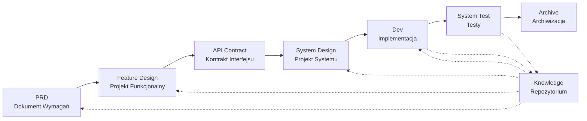

# SpecCrew - Framework Inżynierii Oprogramowania Napędzany AI

<p align="center">
  <a href="./README.md">简体中文</a> |
  <a href="./README.zh-TW.md">繁體中文</a> |
  <a href="./README.en.md">English</a> |
  <a href="./README.ko.md">한국어</a> |
  <a href="./README.de.md">Deutsch</a> |
  <a href="./README.es.md">Español</a> |
  <a href="./README.fr.md">Français</a> |
  <a href="./README.it.md">Italiano</a> |
  <a href="./README.da.md">Dansk</a> |
  <a href="./README.ja.md">日本語</a> |
  <a href="./README.pl.md">Polski</a> |
  <a href="./README.ru.md">Русский</a> |
  <a href="./README.bs.md">Bosanski</a> |
  <a href="./README.ar.md">العربية</a> |
  <a href="./README.no.md">Norsk</a> |
  <a href="./README.pt-BR.md">Português (Brasil)</a> |
  <a href="./README.th.md">ไทย</a> |
  <a href="./README.tr.md">Türkçe</a> |
  <a href="./README.uk.md">Українська</a> |
  <a href="./README.bn.md">বাংলা</a> |
  <a href="./README.el.md">Ελληνικά</a> |
  <a href="./README.vi.md">Tiếng Việt</a>
</p>

<p align="center">
  <a href="https://www.npmjs.com/package/speccrew"></a>
  <a href="https://www.npmjs.com/package/speccrew"></a>
  <a href="https://github.com/charlesmu99/speccrew/blob/main/LICENSE"></a>
</p>

> Wirtualny zespół deweloperski AI umożliwiający szybką implementację inżynieryjną dla każdego projektu software'owego

## Czym jest SpecCrew?

SpecCrew to wbudowany framework wirtualnego zespołu deweloperskiego AI. Przekształca profesjonalne workflow inżynierii software'owej (PRD → Feature Design → System Design → Dev → Test) w wielokrotnego użytku workflow Agentów, pomagając zespołom deweloperskim osiągnąć Specification-Driven Development (SDD), szczególnie odpowiedni dla istniejących projektów.

Poprzez integrację Agentów i Skilli z istniejącymi projektami, zespoły mogą szybko zainicjować systemy dokumentacji projektu i wirtualne zespoły software'owe, implementując nowe funkcje i modyfikacje zgodnie ze standardowymi workflow inżynieryjnymi.

---

## 8 Rozwiązanych Problemów Rdzeniowych

### 1. AI Ignoruje Istniejącą Dokumentację Projektu (Luka Wiedzy)
**Problem**: Istniejące metody SDD lub Vibe Coding polegają na AI podsumowującym projekty w czasie rzeczywistym, łatwo gubiąc krytyczny kontekst i powodując, że wyniki rozwoju odchodzą od oczekiwań.

**Rozwiązanie**: Repozytorium `knowledge/` służy jako "jedno źródło prawdy" projektu, akumulując projekt architektury, moduły funkcjonalne i procesy biznesowe, zapewniając, że wymagania pozostają na torze od źródła.

### 2. Bezpośrednia Dokumentacja Techniczna z PRD (Pominięcie Treści)
**Problem**: Przeskakiwanie bezpośrednio z PRD do szczegółowego projektu łatwo gubi szczegóły wymagań, powodując, że implementowane funkcje odchodzą od wymagań.

**Rozwiązanie**: Wprowadzenie fazy **Dokumentu Feature Design**, skupiającej się tylko na szkielecie wymagań bez szczegółów technicznych:
- Jakie strony i komponenty są zawarte?
- Przepływy operacji stron
- Logika przetwarzania backend
- Struktura przechowywania danych

Rozwój musi tylko "wypełnić ciało" na podstawie konkretnego tech stacku, zapewniając, że funkcje rosną "blisko kości (wymagań)".

### 3. Niepewny Zakres Wyszukiwania Agenta (Niepewność)
**Problem**: W złożonych projektach szerokie wyszukiwanie kodu i dokumentów przez AI daje niepewne wyniki, czyniąc spójność trudną do zagwarantowania.

**Rozwiązanie**: Jasne struktury katalogów dokumentów i szablony, zaprojektowane w oparciu o potrzeby każdego Agenta, implementują **stopniowe ujawnianie i ładowanie na żądanie** aby zagwarantować determinizm.

### 4. Brakujące Kroki i Zadania (Załamanie Procesu)
**Problem**: Brak pełnego pokrycia procesu inżynieryjnego łatwo gubi krytyczne kroki, czyniąc jakość trudną do zagwarantowania.

**Rozwiązanie**: Pokrycie całego cyklu życia inżynierii software'owej:
```
PRD (Wymagania) → Feature Design (Projekt Funkcjonalny) → API Contract (Kontrakt)
    → System Design (Projekt Systemu) → Dev (Rozwój) → Test (Testy)
```
- Wyjście każdej fazy jest wejściem następnej fazy
- Każdy krok wymaga ludzkiego potwierdzenia przed kontynuacją
- Wszystkie egzekucje Agentów mają listy todo z samosprawdzeniem po zakończeniu

### 5. Niska Efektywność Współpracy Zespołu (Silosy Wiedzy)
**Problem**: Doświadczenie programowania AI jest trudne do dzielenia między zespołami, prowadząc do powtarzających się błędów.

**Rozwiązanie**: Wszystkie Agenty, Skille i powiązane dokumenty są wersjonowane z kodem źródłowym:
- Optymalizacja jednej osoby jest dzielona przez zespół
- Wiedza akumuluje się w bazie kodu
- Poprawiona efektywność współpracy zespołu

### 7. Zbyt Długi Kontekst Pojedynczego Agenta (Wąskie Gardło Wydajności)
**Problem**: Duże złożone zadania przekraczają okna kontekstu pojedynczego Agenta, powodując odchylenia w zrozumieniu i spadek jakości wyjścia.

**Rozwiązanie**: **Mechanizm Auto-Dispatch Sub-Agentów**:
- Złożone zadania są automatycznie identyfikowane i dzielone na podzadania
- Każdy podzadanie jest wykonywany przez niezależnego sub-Agenta z izolowanym kontekstem
- Parent Agent koordynuje i agreguje aby zapewnić ogólną spójność
- Unika ekspansji kontekstu pojedynczego Agenta, zapewniając jakość wyjścia

### 8. Chaos Iteracji Wymagań (Trudności Zarządzania)
**Problem**: Wiele wymagań zmieszanych w tej samej gałęzi wpływa na siebie nawzajem, czyniąc śledzenie i rollback trudnym.

**Rozwiązanie**: **Każde Wymaganie jako Niezależny Projekt**:
- Każde wymaganie tworzy niezależny katalog iteracji `iterations/iXXX-[nazwa-wymagania]/`
- Pełna izolacja: dokumenty, projekt, kod i testy zarządzane niezależnie
- Szybka iteracja: dostarczanie małej granulacji, szybka weryfikacja, szybkie wdrożenie
- Elastyczne archiwizowanie: po zakończeniu, archiwizacja do `archive/` z jasną historyczną identyfikowalnością

### 6. Opóźnienie Aktualizacji Dokumentów (Rozkład Wiedzy)
**Problem**: Dokumenty stają się przestarzałe w miarę jak projekty ewoluują, powodując, że AI pracuje z nieprawidłowymi informacjami.

**Rozwiązanie**: Agenty mają automatyczne możliwości aktualizacji dokumentów, synchronizując zmiany projektu w czasie rzeczywistym aby utrzymać dokładność bazy wiedzy.

---

## Rdzenny Workflow



### Opisy Faz

| Faza | Agent | Wejście | Wyjście | Ludzkie Potwierdzenie |
|------|-------|---------|---------|----------------------|
| PRD | PM | Wymagania Użytkownika | Dokument Wymagań Produktu | ✅ Wymagane |
| Feature Design | Feature Designer | PRD | Dokument Feature Design + Kontrakt API | ✅ Wymagane |
| System Design | System Designer | Feature Spec | Dokumenty Projektu Frontend/Backend | ✅ Wymagane |
| Dev | Dev | Design | Kod + Rejestry Zadań | ✅ Wymagane |
| System Test | Test Manager | Wyjście Dev + Feature Spec | Przypadki Testowe + Kod Testowy + Raport Testowy + Raport Bugów | ✅ Wymagane |

---

## Porównanie z Istniejącymi Rozwiązaniami

| Wymiar | Vibe Coding | Ralph Loop | **SpecCrew** |
|--------|-------------|------------|-------------|
| Zależność od Dokumentów | Ignoruje istniejące docs | Polega na AGENTS.md | **Strukturalna Baza Wiedzy** |
| Transfer Wymagań | Bezpośrednie kodowanie | PRD → Kod | **PRD → Feature Design → System Design → Kod** |
| Ludzkie Zaangażowanie | Minimalne | Przy starcie | **W każdej fazie** |
| Kompletność Procesu | Słaba | Średnia | **Kompletny workflow inżynieryjny** |
| Współpraca Zespołu | Trudno dzielić | Osobista efektywność | **Dzielenie wiedzy zespołu** |
| Zarządzanie Kontekstem | Pojedyncza instancja | Pętla pojedynczej instancji | **Auto-dispatch sub-Agentów** |
| Zarządzanie Iteracją | Mieszane | Lista zadań | **Wymaganie jako projekt, niezależna iteracja** |
| Determinizm | Niski | Średni | **Wysoki (stopniowe ujawnianie)** |

---

## Szybki Start

### Wymagania Wstępne

- Node.js >= 16.0.0
- Wspierane IDE: Qoder (domyślne), Cursor, Claude Code

> **Uwaga**: Adaptery dla Cursor i Claude Code nie zostały przetestowane w rzeczywistych środowiskach IDE (zaimplementowane na poziomie kodu i zweryfikowane przez testy E2E, ale jeszcze nie przetestowane w rzeczywistym Cursor/Claude Code).

### 1. Zainstaluj SpecCrew

```bash
npm install -g speccrew
```

### 2. Zainicjuj Projekt

Nawiguj do głównego katalogu projektu i uruchom komendę inicjalizacji:

```bash
cd /path/to/your-project

# Domyślnie używa Qoder
speccrew init

# Lub określ IDE
speccrew init --ide qoder
speccrew init --ide cursor
speccrew init --ide claude
```

Po inicjalizacji w projekcie zostaną wygenerowane:
- `.qoder/agents/` / `.cursor/agents/` / `.claude/agents/` — 7 definicji ról Agentów
- `.qoder/skills/` / `.cursor/skills/` / `.claude/skills/` — 38 workflow Skilli
- `speccrew-workspace/` — Przestrzeń robocza (katalogi iteracji, baza wiedzy, szablony dokumentów)
- `.speccrewrc` — Plik konfiguracyjny SpecCrew

Aby później zaktualizować Agenty i Skille dla konkretnego IDE:

```bash
speccrew update --ide cursor
speccrew update --ide claude
```

### 3. Rozpocznij Workflow Rozwoju

Podążaj za standardowym workflow inżynieryjnym krok po kroku:

1. **PRD**: Agent Product Manager analizuje wymagania i generuje dokument wymagań produktu
2. **Feature Design**: Agent Feature Designer generuje dokument feature design + kontrakt API
3. **System Design**: Agent System Designer generuje dokumenty system design według platformy (frontend/backend/mobile/desktop)
4. **Dev**: Agent System Developer implementuje rozwój według platformy równolegle
5. **System Test**: Agent Test Manager koordynuje testowanie trójfazowe (projekt przypadków → generowanie kodu → raport egzekucji)
6. **Archive**: Zarchiwizuj iterację

> Deliverable każdej fazy wymaga ludzkiego potwierdzenia przed przejściem do następnej fazy.

### 4. Zaktualizuj SpecCrew

Gdy zostanie wydana nowa wersja SpecCrew, ukończ aktualizację w dwóch krokach:

```bash
# Step 1: Update the global CLI tool to the latest version
npm install -g speccrew@latest

# Step 2: Sync Agents and Skills in your project to the latest version
cd /path/to/your-project
speccrew update
```

> **Uwaga**: `npm install -g speccrew@latest` aktualizuje samo narzędzie CLI, podczas gdy `speccrew update` aktualizuje pliki definicji Agentów i Skilli w Twoim projekcie. Oba kroki są wymagane dla pełnej aktualizacji.

### 5. Inne Komendy CLI

```bash
speccrew list       # Wylistuj zainstalowane agenty i skille
speccrew doctor     # Zdiagnozuj środowisko i status instalacji
speccrew update     # Zaktualizuj agenty i skille do najnowszej wersji
speccrew uninstall  # Odinstaluj SpecCrew (--all usuwa też przestrzeń roboczą)
```

📖 **Szczegółowy Przewodnik**: Po instalacji, sprawdź [Przewodnik Wprowadzający](docs/GETTING-STARTED.pl.md) dla pełnego workflow i przewodnika rozmów agentów.

---

## Struktura Katalogu

```
your-project/
├── .qoder/                          # Katalog konfiguracji IDE (przykład Qoder)
│   ├── agents/                      # 7 Agentów ról
│   │   ├── speccrew-team-leader.md       # Lider Zespołu: Globalne planowanie i zarządzanie iteracją
│   │   ├── speccrew-product-manager.md   # Product Manager: Analiza wymagań i PRD
│   │   ├── speccrew-feature-designer.md  # Feature Designer: Feature Design + Kontrakt API
│   │   ├── speccrew-system-designer.md   # System Designer: System design według platformy
│   │   ├── speccrew-system-developer.md  # System Developer: Równoległy rozwój według platformy
│   │   ├── speccrew-test-manager.md      # Test Manager: Koordynacja testów trójfazowych
│   │   └── speccrew-task-worker.md       # Task Worker: Równoległa egzekucja podzadań
│   └── skills/                      # 38 Skilli (zgrupowane według funkcji)
│       ├── speccrew-pm-*/                # Zarządzanie Produktem (analiza wymagań, ewaluacja)
│       ├── speccrew-fd-*/                # Feature Design (Feature Design, Kontrakt API)
│       ├── speccrew-sd-*/                # System Design (frontend/backend/mobile/desktop)
│       ├── speccrew-dev-*/               # Rozwój (frontend/backend/mobile/desktop)
│       ├── speccrew-test-*/              # Testy (projekt przypadków/generowanie kodu/raport egzekucji)
│       ├── speccrew-knowledge-bizs-*/    # Wiedza Biznesowa (analiza API/analiza UI/klasyfikacja modułów itd.)
│       ├── speccrew-knowledge-techs-*/   # Wiedza Techniczna (generowanie tech stacku/konwencje/indeks itd.)
│       ├── speccrew-knowledge-graph-*/   # Graf Wiedzy (odczyt/zapis/zapytanie)
│       └── speccrew-*/                   # Narzędzia (diagnostyka/timestampy/workflow itd.)
│
└── speccrew-workspace/              # Przestrzeń robocza (generowana podczas inicjalizacji)
    ├── docs/                        # Dokumenty zarządcze
    │   ├── configs/                 # Pliki konfiguracyjne (mapowanie platform, mapowanie tech stacku itd.)
    │   ├── rules/                   # Konfiguracje reguł
    │   └── solutions/               # Dokumenty rozwiązań
    │
    ├── iterations/                  # Projekty iteracji (generowane dynamicznie)
    │   └── {numer}-{typ}-{nazwa}/
    │       ├── 00.docs/             # Oryginalne wymagania
    │       ├── 01.product-requirement/ # Wymagania produktu
    │       ├── 02.feature-design/   # Feature design
    │       ├── 03.system-design/    # System design
    │       ├── 04.development/      # Faza rozwoju
    │       ├── 05.system-test/      # Testy systemowe
    │       └── 06.delivery/         # Faza dostawy
    │
    ├── iteration-archives/          # Archiwa iteracji
    │
    └── knowledges/                  # Baza wiedzy
        ├── base/                    # Podstawa/metadane
        │   ├── diagnosis-reports/   # Raporty diagnostyczne
        │   ├── sync-state/          # Stan synchronizacji
        │   └── tech-debts/          # Dług techniczny
        ├── bizs/                    # Wiedza biznesowa
        │   └── {platform-type}/{module-name}/
        └── techs/                   # Wiedza techniczna
            └── {platform-id}/
```

---

## Główne Zasady Projektowania

1. **Specification-Driven**: Pisz specyfikacje najpierw, potem pozwól kodowi "wyrosnąć" z nich
2. **Stopniowe Ujawnianie**: Agenty zaczynają od minimalnych punktów wejścia, ładując informacje na żądanie
3. **Ludzkie Potwierdzenie**: Wyjście każdej fazy wymaga ludzkiego potwierdzenia aby zapobiec odchyleniom AI
4. **Izolacja Kontekstu**: Duże zadania są dzielone na małe, izolowane kontekstowo podzadania
5. **Współpraca Sub-Agentów**: Złożone zadania automatycznie dispatchują sub-Agentów aby uniknąć ekspansji kontekstu pojedynczego Agenta
6. **Szybka Iteracja**: Każde wymaganie jako niezależny projekt dla szybkiej dostawy i weryfikacji
7. **Dzielenie Wiedzy**: Wszystkie konfiguracje są wersjonowane z kodem źródłowym

---

## Przypadki Użycia

### ✅ Zalecane Dla
- Średnie do dużych projektów wymagających standaryzowanych workflow
- Rozwój software'u we współpracy zespołowej
| Transformacja inżynieryjna projektów legacy
| Produkty wymagające długoterminowego utrzymania

### ❌ Nieodpowiednie Dla
| Osobista szybka walidacja prototypu
| Projekty eksploracyjne z bardzo niepewnymi wymaganiami
| Jednorazowe skrypty lub narzędzia

---

## Więcej Informacji

- **Mapa Wiedzy Agentów**: [speccrew-workspace/docs/agent-knowledge-map.md](./speccrew-workspace/docs/agent-knowledge-map.md)
- **npm**: https://www.npmjs.com/package/speccrew
- **GitHub**: https://github.com/charlesmu99/speccrew
- **Gitee**: https://gitee.com/amutek/speccrew
- **Qoder IDE**: https://qoder.com/

---

> **SpecCrew nie ma na celu zastąpienia deweloperów, ale zautomatyzowanie nudnych części, aby zespoły mogły skupić się na bardziej wartościowej pracy.**
