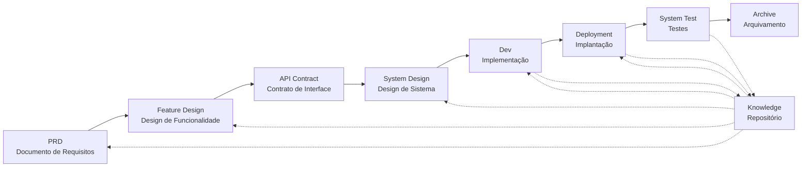

# SpecCrew - Framework de Engenharia de Software Impulsionado por IA

<p align="center">
  <a href="./README.md">简体中文</a> |
  <a href="./README.zh-TW.md">繁體中文</a> |
  <a href="./README.en.md">English</a> |
  <a href="./README.ko.md">한국어</a> |
  <a href="./README.de.md">Deutsch</a> |
  <a href="./README.es.md">Español</a> |
  <a href="./README.fr.md">Français</a> |
  <a href="./README.it.md">Italiano</a> |
  <a href="./README.da.md">Dansk</a> |
  <a href="./README.ja.md">日本語</a> |
  <a href="./README.pl.md">Polski</a> |
  <a href="./README.ru.md">Русский</a> |
  <a href="./README.bs.md">Bosanski</a> |
  <a href="./README.ar.md">العربية</a> |
  <a href="./README.no.md">Norsk</a> |
  <a href="./README.pt-BR.md">Português (Brasil)</a> |
  <a href="./README.th.md">ไทย</a> |
  <a href="./README.tr.md">Türkçe</a> |
  <a href="./README.uk.md">Українська</a> |
  <a href="./README.bn.md">বাংলা</a> |
  <a href="./README.el.md">Ελληνικά</a> |
  <a href="./README.vi.md">Tiếng Việt</a>
</p>

<p align="center">
  <a href="https://www.npmjs.com/package/speccrew"></a>
  <a href="https://www.npmjs.com/package/speccrew"></a>
  <a href="https://github.com/charlesmu99/speccrew/blob/main/LICENSE"></a>
</p>

> Uma equipe de desenvolvimento de IA virtual que permite implementação rápida de engenharia para qualquer projeto de software

## O que é SpecCrew?

SpecCrew é um framework de equipe de desenvolvimento de IA virtual incorporado. Ele transforma fluxos de trabalho de engenharia de software profissional (PRD → Feature Design → System Design → Dev → Deployment → Test) em fluxos de trabalho de Agent reutilizáveis, ajudando equipes de desenvolvimento a alcançar o Specification-Driven Development (SDD), especialmente adequado para projetos existentes.

Ao integrar Agents e Skills em projetos existentes, as equipes podem inicializar rapidamente sistemas de documentação de projetos e equipes de software virtuais, implementando novas funcionalidades e modificações seguindo fluxos de trabalho de engenharia padrão.

---

## ✨ Destaques Principais

### 🏭 Equipe de Software Virtual
Geração com um clique de **7 papéis de Agentes profissionais** + **30+ fluxos de trabalho de Skills**, construindo uma equipe de software virtual completa:
- **Team Leader** - Planejamento global e gerenciamento de iterações
- **Product Manager** - Análise de requisitos e geração de PRD
- **Feature Designer** - Design de funcionalidades + contratos API
- **System Designer** - Design de sistemas Frontend/Backend/Mobile/Desktop
- **System Developer** - Desenvolvimento paralelo multiplataforma
- **Test Manager** - Coordenação de testes em três fases
- **Task Worker** - Execução paralela de subtarefas

### 📐 Modelagem ISA-95 de Seis Estágios
Baseado na metodologia de modelagem internacional **ISA-95**, padronizando a transformação de requisitos de negócio em sistemas de software:
```
Domain Descriptions → Functions in Domains → Functions of Interest
     ↓                       ↓                      ↓
Information Flows → Categories of Information → Information Descriptions
```
- Cada estágio corresponde a diagramas UML específicos (casos de uso, sequência, classes)
- Requisitos de negócio são "refinados passo a passo", sem perda de informação
- Saídas são diretamente utilizáveis para desenvolvimento

### 📚 Sistema de Base de Conhecimento
Arquitetura de base de conhecimento de três níveis garantindo que a IA sempre trabalhe baseada na "fonte única da verdade":

| Nível | Diretório | Conteúdo | Propósito |
|-------|-----------|----------|-----------|
| L1 Conhecimento do Sistema | `knowledge/techs/` | Stack tecnológico, arquitetura, convenções | IA entende limites técnicos do projeto |
| L2 Conhecimento de Negócio | `knowledge/bizs/` | Funcionalidades de módulos, fluxos de negócio, entidades | IA entende lógica de negócio |
| L3 Artefatos de Iteração | `iterations/iXXX/` | PRD, documentos de design, relatórios de teste | Cadeia completa de rastreabilidade para requisitos atuais |

### 🔄 Pipeline de Conhecimento de Quatro Estágios
**Arquitetura de geração automatizada de conhecimento**, geração automática de documentação de negócio/técnica a partir do código-fonte:
```
Estágio 1: Escanear código-fonte → Gerar lista de módulos
Estágio 2: Análise paralela → Extrair funcionalidades (multi-Worker paralelo)
Estágio 3: Resumo paralelo → Completar visões gerais de módulos (multi-Worker paralelo)
Estágio 4: Agregação do sistema → Gerar panorama do sistema
```
- Suporta **sincronização completa** e **sincronização incremental** (baseado em Git diff)
- Uma pessoa otimiza, equipe compartilha

### 🔧 Harness Framework de Implementação Prática
**Framework de execução padronizado**, garantindo que documentos de design sejam transformados com precisão em instruções de desenvolvimento executáveis:
- **Princípio do manual de operações**: Skill é SOP, etapas são claras, contínuas e autossuficientes
- **Contrato de entrada-saída**: Interfaces claramente definidas, executadas com o rigor de pseudocódigo
- **Arquitetura de revelação progressiva**: Informações carregadas em camadas, evitando sobrecarga de contexto única
- **Delegação de sub-Agent**: Tarefas complexas divididas automaticamente, execução paralela garante qualidade

---

## 8 Problemas Principais Resolvidos

### 1. IA Ignora Documentação de Projeto Existente (Lacuna de Conhecimento)
**Problema**: Os métodos SDD ou Vibe Coding existentes dependem da IA resumindo projetos em tempo real, perdendo facilmente o contexto crítico e causando resultados de desenvolvimento que se desviam das expectativas.

**Solução**: O repositório `knowledge/` serve como a "única fonte da verdade" do projeto, acumulando design de arquitetura, módulos funcionais e processos de negócios para garantir que os requisitos permaneçam no caminho certo desde a fonte.

### 2. Documentação Técnica Direta do PRD (Omissão de Conteúdo)
**Problema**: Pular diretamente do PRD para o design detalhado perde facilmente os detalhes dos requisitos, fazendo com que as funcionalidades implementadas se desviem dos requisitos.

**Solução**: Introduzir a fase de **Documento Feature Design**, focando apenas no esqueleto dos requisitos sem detalhes técnicos:
- Quais páginas e componentes estão incluídos?
- Fluxos de operação de páginas
- Lógica de processamento backend
- Estrutura de armazenamento de dados

O desenvolvimento só precisa "preencher a carne" com base na stack tecnológica específica, garantindo que as funcionalidades cresçam "perto do osso (requisitos)".

### 3. Escopo de Busca de Agent Incerto (Incerteza)
**Problema**: Em projetos complexos, a busca ampla de código e documentos pela IA produz resultados incertos, tornando a consistência difícil de garantir.

**Solução**: Estruturas de diretórios de documentos claras e templates, projetadas com base nas necessidades de cada Agent, implementam **divulgação progressiva e carregamento sob demanda** para garantir determinismo.

### 4. Fases e Tarefas Ausentes (Rompimento de Processo)
**Problema**: A falta de cobertura completa do processo de engenharia perde facilmente fases críticas, tornando a qualidade difícil de garantir.

**Solução**: Cobrir todo o ciclo de vida da engenharia de software:
```
PRD (Requisitos) → Feature Design (Design de Funcionalidade) → API Contract (Contrato)
    → System Design (Design de Sistema) → Dev (Desenvolvimento) → Deployment (Implantação) → Test (Testes)
```
- A saída de cada fase é a entrada da próxima fase
- Cada passo requer confirmação humana antes de prosseguir
- Todas as execuções de Agent têm listas de tarefas com auto-verificação após conclusão

### 5. Baixa Eficiência de Colaboração da Equipe (Silos de Conhecimento)
**Problema**: A experiência de programação com IA é difícil de compartilhar entre equipes, levando a erros repetidos.

**Solução**: Todos os Agents, Skills e documentos relacionados são versionados com o código-fonte:
- A otimização de uma pessoa é compartilhada pela equipe
- O conhecimento se acumula na base de código
- Melhor eficiência de colaboração da equipe

### 7. Contexto de Agent Único Muito Longo (Gargalo de Performance)
**Problema**: Tarefas complexas grandes excedem as janelas de contexto de Agent único, causando desvios de entendimento e diminuição da qualidade de saída.

**Solução**: **Mecanismo de Auto-Dispatch de Sub-Agent**:
- Tarefas complexas são automaticamente identificadas e divididas em subtarefas
- Cada subtarefa é executada por um Sub-Agent independente com contexto isolado
- O Agent pai coordena e agrega para garantir consistência global
- Evita expansão de contexto de Agent único, garantindo qualidade de saída

### 8. Caos de Iteração de Requisitos (Dificuldade de Gerenciamento)
**Problema**: Múltiplos requisitos misturados no mesmo branch afetam uns aos outros, tornando rastreamento e rollback difíceis.

**Solução**: **Cada Requisito como um Projeto Independente**:
- Cada requisito cria um diretório de iteração independente `iterations/iXXX-[nome-requisito]/`
- Isolamento completo: documentos, design, código e testes gerenciados independentemente
- Iteração rápida: entrega de pequena granularidade, verificação rápida, implantação rápida
- Arquivamento flexível: após conclusão, arquivamento em `archive/` com rastreabilidade histórica clara

### 6. Atraso na Atualização de Documentos (Decaimento de Conhecimento)
**Problema**: Os documentos ficam desatualizados à medida que os projetos evoluem, fazendo a IA trabalhar com informações incorretas.

**Solução**: Os Agents têm capacidades de atualização automática de documentos, sincronizando mudanças do projeto em tempo real para manter a base de conhecimento precisa.

---

## Fluxo de Trabalho Principal



### Descrições das Fases

| Fase | Agent | Entrada | Saída | Confirmação Humana |
|------|-------|---------|-------|-------------------|
| PRD | PM | Requisitos do Usuário | Documento de Requisitos do Produto | ✅ Obrigatória |
| Feature Design | Feature Designer | PRD | Documento Feature Design + Contrato API | ✅ Obrigatória |
| System Design | System Designer | Feature Spec | Documentos de Design Frontend/Backend | ✅ Obrigatória |
| Dev | Dev | Design | Código + Registros de Tarefas | ✅ Obrigatória |
| Deployment | System Deployer | Saída Dev | Relatório de Implantação + Aplicação em Execução | ✅ Obrigatória |
| System Test | Test Manager | Saída Deployment + Feature Spec | Casos de Teste + Código de Teste + Relatório de Teste + Relatório de Bugs | ✅ Obrigatória |

---

## Comparação com Soluções Existentes

| Dimensão | Vibe Coding | Ralph Loop | **SpecCrew** |
|----------|-------------|------------|-------------|
| Dependência de Documentos | Ignora docs existentes | Depende de AGENTS.md | **Base de Conhecimento Estruturada** |
| Transferência de Requisitos | Codificação direta | PRD → Código | **PRD → Feature Design → System Design → Código** |
| Envolvimento Humano | Mínimo | Na inicialização | **Em cada fase** |
| Completude do Processo | Fraca | Média | **Fluxo de trabalho de engenharia completo** |
| Colaboração da Equipe | Difícil compartilhar | Eficiência pessoal | **Compartilhamento de conhecimento da equipe** |
| Gerenciamento de Contexto | Instância única | Loop de instância única | **Auto-dispatch de Sub-Agent** |
| Gerenciamento de Iteração | Misto | Lista de tarefas | **Requisito como projeto, iteração independente** |
| Determinismo | Baixo | Médio | **Alto (divulgação progressiva)** |

---

## Início Rápido

### Pré-requisitos

- Node.js >= 16.0.0
- IDEs suportados: Qoder (padrão), Cursor, Claude Code

> **Nota**: Os adaptadores para Cursor e Claude Code não foram testados em ambientes de IDE reais (implementados em nível de código e verificados através de testes E2E, mas ainda não testados em Cursor/Claude Code reais).

### 1. Instalar SpecCrew

```bash
npm install -g speccrew
```

### 2. Inicializar Projeto

Navegue até o diretório raiz do projeto e execute o comando de inicialização:

```bash
cd /path/to/your-project

# Usa Qoder por padrão
speccrew init

# Ou especifique o IDE
speccrew init --ide qoder
speccrew init --ide cursor
speccrew init --ide claude
```

Após a inicialização, os seguintes itens serão gerados no projeto:
- `.qoder/agents/` / `.cursor/agents/` / `.claude/agents/` — 7 definições de papéis de Agent
- `.qoder/skills/` / `.cursor/skills/` / `.claude/skills/` — 30+ fluxos de trabalho de Skill
- `speccrew-workspace/` — Espaço de trabalho (diretórios de iteração, base de conhecimento, templates de documentos)
- `.speccrewrc` — Arquivo de configuração do SpecCrew

Para atualizar Agents e Skills para um IDE específico posteriormente:

```bash
speccrew update --ide cursor
speccrew update --ide claude
```

### 3. Iniciar Fluxo de Trabalho de Desenvolvimento

Siga o fluxo de trabalho de engenharia padrão passo a passo:

1. **PRD**: O Agent Product Manager analisa requisitos e gera documento de requisitos do produto
2. **Feature Design**: O Agent Feature Designer gera documento feature design + contrato API
3. **System Design**: O Agent System Designer gera documentos system design por plataforma (frontend/backend/mobile/desktop)
4. **Dev**: O Agent System Developer implementa desenvolvimento por plataforma em paralelo
5. **Deployment**: O Agent System Deployer executa build, migração de banco de dados, inicialização de serviços e testes de fumaça
6. **System Test**: O Agent Test Manager coordena testes em três fases (design de casos → geração de código → relatório de execução)
7. **Archive**: Arquivar iteração

> Os entregáveis de cada fase requerem confirmação humana antes de prosseguir para a próxima fase.

### 4. Atualizar SpecCrew

Quando uma nova versão do SpecCrew for lançada, complete a atualização em duas etapas:

```bash
# Step 1: Update the global CLI tool to the latest version
npm install -g speccrew@latest

# Step 2: Sync Agents and Skills in your project to the latest version
cd /path/to/your-project
speccrew update
```

> **Nota**: `npm install -g speccrew@latest` atualiza a própria ferramenta CLI, enquanto `speccrew update` atualiza os arquivos de definição de Agent e Skill no seu projeto. Ambas as etapas são necessárias para uma atualização completa.

### 5. Outros Comandos CLI

```bash
speccrew list       # Listar agents e skills instalados
speccrew doctor     # Diagnosticar ambiente e status de instalação
speccrew update     # Atualizar agents e skills para a versão mais recente
speccrew uninstall  # Desinstalar SpecCrew (--all também remove o espaço de trabalho)
```

📖 **Guia Detalhado**: Após a instalação, consulte o [Guia de Introdução](docs/GETTING-STARTED.pt-BR.md) para o fluxo de trabalho completo e guia de conversação com agents.

---

## Estrutura de Diretório

```
your-project/
├── .qoder/                          # Diretório de configuração IDE (exemplo Qoder)
│   ├── agents/                      # 7 Agents de papéis
│   │   ├── speccrew-team-leader.md       # Líder da Equipe: Agendamento global e gerenciamento de iteração
│   │   ├── speccrew-product-manager.md   # Gerente de Produto: Análise de requisitos e PRD
│   │   ├── speccrew-feature-designer.md  # Feature Designer: Feature Design + Contrato API
│   │   ├── speccrew-system-designer.md   # System Designer: Design de sistema por plataforma
│   │   ├── speccrew-system-developer.md  # System Developer: Desenvolvimento paralelo por plataforma
│   │   ├── speccrew-test-manager.md      # Test Manager: Coordenação de testes em três fases
│   │   └── speccrew-task-worker.md       # Task Worker: Execução paralela de subtarefas
│   └── skills/                      # 30+ Skills (agrupadas por função)
│       ├── speccrew-pm-*/                # Gestão de Produto (análise de requisitos, avaliação)
│       ├── speccrew-fd-*/                # Feature Design (Feature Design, Contrato API)
│       ├── speccrew-sd-*/                # System Design (frontend/backend/mobile/desktop)
│       ├── speccrew-dev-*/               # Desenvolvimento (frontend/backend/mobile/desktop)
│       ├── speccrew-test-*/              # Testes (design de casos/geração de código/relatório de execução)
│       ├── speccrew-knowledge-bizs-*/    # Conhecimento de Negócios (análise de API/análise de UI/classificação de módulos etc.)
│       ├── speccrew-knowledge-techs-*/   # Conhecimento Técnico (geração de stack tech/convenções/índice etc.)
│       ├── speccrew-knowledge-graph-*/   # Grafo de Conhecimento (leitura/escrita/consulta)
│       └── speccrew-*/                   # Utilitários (diagnóstico/timestamps/workflow etc.)
│
└── speccrew-workspace/              # Espaço de trabalho (gerado durante inicialização)
    ├── docs/                        # Documentos de gerenciamento
    │   ├── configs/                 # Arquivos de configuração (mapeamento de plataforma, mapeamento de stack tech etc.)
    │   ├── rules/                   # Configurações de regras
    │   └── solutions/               # Documentos de soluções
    │
    ├── iterations/                  # Projetos de iteração (gerados dinamicamente)
    │   └── {número}-{tipo}-{nome}/
    │       ├── 00.docs/             # Requisitos originais
    │       ├── 01.product-requirement/ # Requisitos de produto
    │       ├── 02.feature-design/   # Feature design
    │       ├── 03.system-design/    # System design
    │       ├── 04.development/      # Fase de desenvolvimento
    │       ├── 05.deployment/       # Fase de implantação
    │       ├── 06.system-test/      # Testes de sistema
    │       └── 07.delivery/         # Fase de entrega
    │
    ├── iteration-archives/          # Arquivos de iteração
    │
    └── knowledges/                  # Base de conhecimento
        ├── base/                    # Base/metadados
        │   ├── diagnosis-reports/   # Relatórios de diagnóstico
        │   ├── sync-state/          # Estado de sincronização
        │   └── tech-debts/          # Dívida técnica
        ├── bizs/                    # Conhecimento de negócios
        │   └── {platform-type}/{module-name}/
        └── techs/                   # Conhecimento técnico
            └── {platform-id}/
```

---

## Princípios de Design Principais

1. **Specification-Driven**: Escreva especificações primeiro, depois deixe o código "crescer" a partir delas
2. **Divulgação Progressiva**: Os Agents começam a partir de pontos de entrada mínimos, carregando informações sob demanda
3. **Confirmação Humana**: A saída de cada fase requer confirmação humana para prevenir desvios da IA
4. **Isolamento de Contexto**: Tarefas grandes são divididas em subtarefas pequenas e isoladas por contexto
5. **Colaboração de Sub-Agent**: Tarefas complexas automaticamente fazem dispatch de Sub-Agents para evitar expansão de contexto de Agent único
6. **Iteração Rápida**: Cada requisito como um projeto independente para entrega e verificação rápidas
7. **Compartilhamento de Conhecimento**: Todas as configurações são versionadas com o código-fonte

---

## Casos de Uso

### ✅ Recomendado Para
- Projetos médios a grandes que requerem fluxos de trabalho padronizados
- Desenvolvimento de software em colaboração de equipe
- Transformação de engenharia de projetos legados
- Produtos que requerem manutenção de longo prazo

### ❌ Não Adequado Para
- Validação rápida de protótipo pessoal
- Projetos exploratórios com requisitos muito incertos
- Scripts ou ferramentas de uso único

---

## Mais Informações

- **Mapa de Conhecimento dos Agents**: [speccrew-workspace/docs/agent-knowledge-map.md](./speccrew-workspace/docs/agent-knowledge-map.md)
- **npm**: https://www.npmjs.com/package/speccrew
- **GitHub**: https://github.com/charlesmu99/speccrew
- **Gitee**: https://gitee.com/amutek/speccrew
- **Qoder IDE**: https://qoder.com/

---

> **SpecCrew não visa substituir desenvolvedores, mas automatizar as partes tediosas para que as equipes possam se concentrar em trabalho mais valioso.**
