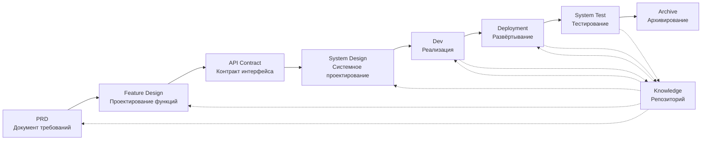

# SpecCrew - Фреймворк программной инженерии на базе ИИ

<p align="center">
  <a href="./README.md">简体中文</a> |
  <a href="./README.en.md">English</a> |
  <a href="./README.ja.md">日本語</a> |
  <a href="./README.ru.md">Русский</a> |
  <a href="./README.es.md">Español</a> |
  <a href="./README.de.md">Deutsch</a> |
  <a href="./README.fr.md">Français</a> |
  <a href="./README.pt-BR.md">Português (Brasil)</a> |
  <a href="./README.ar.md">العربية</a> |
  <a href="./README.hi.md">हिन्दी</a>
</p>

<p align="center">
  <a href="https://www.npmjs.com/package/speccrew"></a>
  <a href="https://www.npmjs.com/package/speccrew"></a>
  <a href="https://github.com/charlesmu99/speccrew/blob/main/LICENSE"></a>
</p>

> Виртуальная команда разработки на базе ИИ, обеспечивающая быструю инженерную реализацию для любого программного проекта

## Что такое SpecCrew?

SpecCrew — это встраиваемый фреймворк виртуальной команды разработки на базе ИИ. Он преобразует профессиональные рабочие процессы программной инженерии (PRD → Feature Design → System Design → Dev → Deployment → Test) в повторно используемые рабочие процессы Агентов, помогая командам разработчиков достичь разработки на основе спецификаций (SDD), особенно подходящей для существующих проектов.

Интегрируя Агентов и Навыки в существующие проекты, команды могут быстро инициализировать системы документации проекта и виртуальные программные команды, реализуя новые функции и модификации в соответствии со стандартными инженерными рабочими процессами.

---

## ✨ Ключевые особенности

### 🏭 Виртуальная команда разработки
Генерация в один клик **7 профессиональных ролей Агентов** + **30+ рабочих процессов Навыков**, создание полной виртуальной команды разработки:
- **Team Leader** - Глобальное планирование и управление итерациями
- **Product Manager** - Анализ требований и генерация PRD
- **Feature Designer** - Проектирование функций + API-контракты
- **System Designer** - Проектирование систем Frontend/Backend/Mobile/Desktop
- **System Developer** - Многоплатформенная параллельная разработка
- **Test Manager** - Координация тестирования в три этапа
- **Task Worker** - Параллельное выполнение подзадач

### 📐 Моделирование ISA-95 в шесть этапов
Основано на международной методологии моделирования **ISA-95**, стандартизация преобразования бизнес-требований в программные системы:
```
Domain Descriptions → Functions in Domains → Functions of Interest
     ↓                       ↓                      ↓
Information Flows → Categories of Information → Information Descriptions
```
- Каждый этап соответствует определенным UML-диаграммам (use case, sequence, class diagrams)
- Бизнес-требования "уточняются поэтапно", без потери информации
- Результаты непосредственно пригодны для разработки

### 📚 Система базы знаний
Трехуровневая архитектура базы знаний, гарантирующая, что ИИ всегда работает на основе "единого источника истины":

| Уровень | Каталог | Содержимое | Назначение |
|---------|---------|-----------|------------|
| L1 Системные знания | `knowledge/techs/` | Технологический стек, архитектура, соглашения | ИИ понимает технические границы проекта |
| L2 Бизнес-знания | `knowledge/bizs/` | Функции модулей, бизнес-процессы, сущности | ИИ понимает бизнес-логику |
| L3 Артефакты итераций | `iterations/iXXX/` | PRD, проектные документы, отчеты о тестировании | Полная цепочка отслеживания для текущих требований |

### 🔄 Четырехэтапный конвейер знаний
**Автоматизированная архитектура генерации знаний**, автоматическая генерация бизнес/технической документации из исходного кода:
```
Этап 1: Сканирование исходного кода → Генерация списка модулей
Этап 2: Параллельный анализ → Извлечение функций (много Worker параллельно)
Этап 3: Параллельное обобщение → Завершение обзоров модулей (много Worker параллельно)
Этап 4: Системная агрегация → Генерация панорамы системы
```
- Поддерживает **полную синхронизацию** и **инкрементальную синхронизацию** (на основе Git diff)
- Один оптимизирует, команда использует

### 🔧 Harness Практическая структура внедрения
**Стандартизированная структура исполнения**, обеспечивающая точное преобразование проектных документов в выполнимые инструкции по разработке:
- **Принцип операционного руководства**: Skill — это СОП, шаги чёткие, последовательные и самодостаточные
- **Контракт входа-выхода**: Чётко определённые интерфейсы, выполняемые так же строго, как псевдокод
- **Архитектура прогрессивного раскрытия**: Информация загружается по слоям, избегая разовой перегрузки контекста
- **Делегирование суб-Агентов**: Сложные задачи автоматически разделяются, параллельное выполнение обеспечивает качество

---

## Решение 8 ключевых проблем

### 1. ИИ игнорирует существующую документацию проекта (разрыв знаний)
**Проблема**: Существующие методы SDD или Vibe Coding полагаются на то, что ИИ резюмирует проекты в реальном времени, легко упуская критический контекст и приводя к результатам разработки, отклоняющимся от ожиданий.

**Решение**: Репозиторий `knowledge/` служит "единственным источником истины" проекта, аккумулируя архитектурный дизайн, функциональные модули и бизнес-процессы, обеспечивая соответствие требований источнику.

### 2. Прямое преобразование документации требований в техническую (пропуск содержания)
**Проблема**: Прямой переход от PRD к детальному проектированию легко упускает детали требований, приводя к тому, что реализованные функции отклоняются от требований.

**Решение**: Введение фазы **Документа Feature Design**, фокусирующейся только на каркасе требований без технических деталей:
- Какие страницы и компоненты включены?
- Потоки операций страниц
- Логика обработки бэкенда
- Структура хранения данных

Разработке нужно только "нарастить мясо" на основе конкретного технического стека, обеспечивая рост функций "близко к кости (требованиям)".

### 3. Неопределённый область поиска Агента (неопределённость)
**Проблема**: В сложных проектах широкий поиск кода и документов ИИ даёт неопределённые результаты, что затрудняет гарантирование согласованности.

**Решение**: Чёткие структуры каталогов документов и шаблоны, разработанные на основе потребностей каждого Агента, реализуют **прогрессивное раскрытие и загрузку по запросу** для обеспечения детерминизма.

### 4. Пропущенные этапы и задачи (разрыв процесса)
**Проблема**: Отсутствие полного покрытия инженерного процесса легко упускает критические шаги, что затрудняет гарантирование качества.

**Решение**: Покрытие полного жизненного цикла программной инженерии:
```
PRD (Требования) → Feature Design (Проектирование функций) → API Contract (Контракт)
    → System Design (Системное проектирование) → Dev (Разработка) → Deployment (Развёртывание) → Test (Тестирование)
```
- Выход каждой фазы является входом следующей фазы
- Каждый шаг требует человеческого подтверждения перед продолжением
- Все выполнения Агентов имеют списки задач с самопроверкой после завершения

### 5. Низкая эффективность командного сотрудничества (информационные колодцы)
**Проблема**: Опыт программирования с ИИ сложно разделять между командами, что приводит к повторным ошибкам.

**Решение**: Все Агенты, Навыки и связанные документы версионируются с исходным кодом:
- Оптимизация одного человека разделяется командой
- Знания аккумулируются в кодовой базе
- Повышается эффективность командного сотрудничества

### 7. Слишком длинный контекст единственного Агента (узкое место производительности)
**Проблема**: Большие сложные задачи превышают контекстные окна единственного Агента, вызывая отклонения в понимании и снижение качества вывода.

**Решение**: **Механизм автодиспетчеризации суб-Агентов**:
- Сложные задачи автоматически идентифицируются и разделяются на подзадачи
- Каждая подзадача выполняется независимым суб-Агентом с изолированным контекстом
- Родительский Агент координирует и агрегирует для обеспечения общей согласованности
- Избегает расширения контекста единственного Агента, обеспечивая качество вывода

### 8. Хаос итераций требований (трудности управления)
**Проблема**: Множественные требования, смешанные в одной ветке, влияют друг на друга, что затрудняет отслеживание и откат.

**Решение**: **Каждое требование как независимый проект**:
- Каждое требование создаёт независимый каталог итерации `iterations/iXXX-[имя-требования]/`
- Полная изоляция: документы, дизайн, код и тесты управляются независимо
- Быстрая итерация: доставка малой гранулярности, быстрая верификация, быстрое развёртывание
- Гибкое архивирование: после завершения архивирование в `archive/` с чёткой исторической отслеживаемостью

### 6. Запаздывание обновления документов (устаревание знаний)
**Проблема**: Документы устаревают по мере развития проектов, заставляя ИИ работать с неверной информацией.

**Решение**: Агенты имеют возможности автоматического обновления документов, синхронизируя изменения проекта в реальном времени для поддержания точности базы знаний.

---

## Основной рабочий процесс



### Описание фаз

| Фаза | Агент | Вход | Выход | Человеческое подтверждение |
|------|-------|------|-------|---------------------------|
| PRD | PM | Пользовательские требования | Документ требований продукта | ✅ Обязательно |
| Feature Design | Feature Designer | PRD | Документ Feature Design + API контракт | ✅ Обязательно |
| System Design | System Designer | Feature Spec | Документы проектирования Frontend/Backend | ✅ Обязательно |
| Dev | Dev | Design | Код + Записи задач | ✅ Обязательно |
| Deployment | System Deployer | Выход Dev | Отчёт о развёртывании + Работающее приложение | ✅ Обязательно |
| System Test | Test Manager | Выход Deployment + Feature Spec | Тест-кейсы + Тестовый код + Тестовый отчёт + Отчёт багов | ✅ Обязательно |

---

## Сравнение с существующими решениями

| Измерение | Vibe Coding | Ralph Loop | **SpecCrew** |
|-----------|-------------|------------|-------------|
| Зависимость от документов | Игнорирует существующие документы | Полагается на AGENTS.md | **Структурированная база знаний** |
| Передача требований | Прямое кодирование | PRD → Код | **PRD → Feature Design → System Design → Код** |
| Человеческое участие | Минимальное | При запуске | **На каждой фазе** |
| Полнота процесса | Слабая | Средняя | **Полный инженерный рабочий процесс** |
| Командное сотрудничество | Сложно делиться | Личная эффективность | **Разделение знаний команды** |
| Управление контекстом | Один экземпляр | Цикл одного экземпляра | **Автодиспетчеризация суб-Агентов** |
| Управление итерациями | Смешанное | Список задач | **Требование как проект, независимая итерация** |
| Детерминизм | Низкий | Средний | **Высокий (прогрессивное раскрытие)** |

---

## Быстрый старт

### Предварительные требования

- Node.js >= 16.0.0
- Поддерживаемые IDE: Qoder (по умолчанию), Cursor, Claude Code

> **Примечание**: Адаптеры для Cursor и Claude Code не тестировались в реальных средах IDE (реализованы на уровне кода и верифицированы через E2E тесты, но ещё не протестированы в реальных Cursor/Claude Code).

### 1. Установить SpecCrew

```bash
npm install -g speccrew
```

### 2. Инициализировать проект

Перейдите в корневой каталог проекта и выполните команду инициализации:

```bash
cd /path/to/your-project

# По умолчанию использует Qoder
speccrew init

# Или укажите IDE
speccrew init --ide qoder
speccrew init --ide cursor
speccrew init --ide claude
```

После инициализации в проекте будут созданы:
- `.qoder/agents/` / `.cursor/agents/` / `.claude/agents/` — 7 определений ролей Агентов
- `.qoder/skills/` / `.cursor/skills/` / `.claude/skills/` — 30+ рабочих процессов Навыков
- `speccrew-workspace/` — Рабочее пространство (каталоги итераций, база знаний, шаблоны документов)
- `.speccrewrc` — Файл конфигурации SpecCrew

Чтобы позже обновить Агентов и Навыки для конкретной IDE:

```bash
speccrew update --ide cursor
speccrew update --ide claude
```

### 3. Начать рабочий процесс разработки

Следуйте стандартному инженерному рабочему процессу шаг за шагом:

1. **PRD**: Агент Product Manager анализирует требования и генерирует документ требований продукта
2. **Feature Design**: Агент Feature Designer генерирует документ feature design + API контракт
3. **System Design**: Агент System Designer генерирует документы system design по платформам (frontend/backend/mobile/desktop)
4. **Dev**: Агент System Developer реализует разработку по платформам параллельно
5. **Deployment**: Агент System Deployer выполняет сборку, миграцию базы данных, запуск сервисов и дымовое тестирование
6. **System Test**: Агент Test Manager координирует трёхфазное тестирование (дизайн кейсов → генерация кода → отчёт выполнения)
7. **Archive**: Архивировать итерацию

> Результаты каждой фазы требуют человеческого подтверждения перед переходом к следующей фазе.

### 4. Обновить SpecCrew

Когда выходит новая версия SpecCrew, выполните обновление в два шага:

```bash
# Step 1: Update the global CLI tool to the latest version
npm install -g speccrew@latest

# Step 2: Sync Agents and Skills in your project to the latest version
cd /path/to/your-project
speccrew update
```

> **Примечание**: `npm install -g speccrew@latest` обновляет сам инструмент CLI, а `speccrew update` обновляет файлы определений Агентов и Навыков в вашем проекте. Для полного обновления необходимы оба шага.

### 5. Другие команды CLI

```bash
speccrew list       # Список установленных агентов и навыков
speccrew doctor     # Диагностика среды и статуса установки
speccrew update     # Обновление агентов и навыков до последней версии
speccrew uninstall  # Удалить SpecCrew (--all также удаляет рабочее пространство)
```

📖 **Подробное руководство**: После установки ознакомьтесь с [Руководством по началу работы](docs/GETTING-STARTED.ru.md) для полного рабочего процесса и руководства по диалогам агентов.

---

## Структура каталога

```
your-project/
├── .qoder/                          # Каталог конфигурации IDE (пример Qoder)
│   ├── agents/                      # 7 Агентов ролей
│   │   ├── speccrew-team-leader.md       # Лидер команды: Глобальное планирование и управление итерациями
│   │   ├── speccrew-product-manager.md   # Продакт-менеджер: Анализ требований и PRD
│   │   ├── speccrew-feature-designer.md  # Feature Designer: Feature Design + API контракт
│   │   ├── speccrew-system-designer.md   # System Designer: Системный дизайн по платформам
│   │   ├── speccrew-system-developer.md  # System Developer: Параллельная разработка по платформам
│   │   ├── speccrew-test-manager.md      # Test Manager: Координация трёхфазного тестирования
│   │   └── speccrew-task-worker.md       # Task Worker: Параллельное выполнение подзадач
│   └── skills/                      # 30+ Навыков (сгруппированных по функциям)
│       ├── speccrew-pm-*/                # Управление продуктом (анализ требований, оценка)
│       ├── speccrew-fd-*/                # Feature Design (Feature Design, API контракт)
│       ├── speccrew-sd-*/                # System Design (frontend/backend/mobile/desktop)
│       ├── speccrew-dev-*/               # Разработка (frontend/backend/mobile/desktop)
│       ├── speccrew-test-*/              # Тестирование (дизайн кейсов/генерация кода/отчёт выполнения)
│       ├── speccrew-knowledge-bizs-*/    # Бизнес-знания (анализ API/анализ UI/классификация модулей и т.д.)
│       ├── speccrew-knowledge-techs-*/   # Технические знания (генерация tech стека/соглашения/индекс и т.д.)
│       ├── speccrew-knowledge-graph-*/   # Граф знаний (чтение/запись/запрос)
│       └── speccrew-*/                   # Утилиты (диагностика/временные метки/рабочий процесс и т.д.)
│
└── speccrew-workspace/              # Рабочее пространство (генерируется при инициализации)
    ├── docs/                        # Управленческие документы
    │   ├── configs/                 # Конфигурационные файлы (маппинг платформ, маппинг tech стека и т.д.)
    │   ├── rules/                   # Конфигурации правил
    │   └── solutions/               # Документы решений
    │
    ├── iterations/                  # Проекты итераций (генерируются динамически)
    │   └── {номер}-{тип}-{имя}/
    │       ├── 00.docs/             # Исходные требования
    │       ├── 01.product-requirement/ # Требования продукта
    │       ├── 02.feature-design/   # Feature design
    │       ├── 03.system-design/    # System design
    │       ├── 04.development/      # Фаза разработки
    │       ├── 05.deployment/       # Фаза развёртывания
    │       ├── 06.system-test/      # Системное тестирование
    │       └── 07.delivery/         # Фаза поставки
    │
    ├── iteration-archives/          # Архивы итераций
    │
    └── knowledges/                  # База знаний
        ├── base/                    # База/метаданные
        │   ├── diagnosis-reports/   # Отчёты диагностики
        │   ├── sync-state/          # Состояние синхронизации
        │   └── tech-debts/          # Технический долг
        ├── bizs/                    # Бизнес-знания
        │   └── {platform-type}/{module-name}/
        └── techs/                   # Технические знания
            └── {platform-id}/
```

---

## Основные принципы проектирования

1. **Управление спецификациями**: Сначала пишите спецификации, затем позволяйте коду "расти" из них
2. **Прогрессивное раскрытие**: Агенты начинают с минимальных точек входа, загружая информацию по запросу
3. **Человеческое подтверждение**: Выход каждой фазы требует человеческого подтверждения для предотвращения отклонений ИИ
4. **Изоляция контекста**: Большие задачи разделяются на малые, изолированные по контексту подзадачи
5. **Сотрудничество суб-Агентов**: Сложные задачи автоматически диспетчеризируют суб-Агентов для избежания расширения контекста единственного Агента
6. **Быстрая итерация**: Каждое требование как независимый проект для быстрой поставки и верификации
7. **Разделение знаний**: Все конфигурации версионируются с исходным кодом

---

## Сценарии использования

### ✅ Рекомендуется для
- Средних и крупных проектов, требующих стандартизированных рабочих процессов
- Командной разработки программного обеспечения
- Инженерной трансформации наследованных проектов
- Продуктов, требующих долгосрочной поддержки

### ❌ Не подходит для
- Персональной быстрой валидации прототипов
- Исследовательских проектов с очень неопределёнными требованиями
- Одноразовых скриптов или инструментов

---

## Дополнительная информация

- **Карта знаний Агентов**: [speccrew-workspace/docs/agent-knowledge-map.md](./speccrew-workspace/docs/agent-knowledge-map.md)
- **npm**: https://www.npmjs.com/package/speccrew
- **GitHub**: https://github.com/charlesmu99/speccrew
- **Gitee**: https://gitee.com/amutek/speccrew
- **Qoder IDE**: https://qoder.com/

---

> **SpecCrew не заменяет разработчиков, а автоматизирует скучные части, чтобы команды могли сосредоточиться на более ценной работе.**
