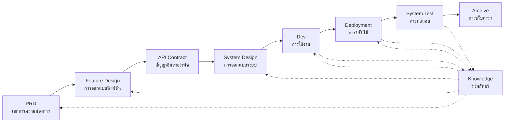

# SpecCrew - เฟรมเวิร์กวิศวกรรมซอฟต์แวร์ที่ขับเคลื่อนด้วย AI

<p align="center">
  <a href="./README.md">简体中文</a> |
  <a href="./README.zh-TW.md">繁體中文</a> |
  <a href="./README.en.md">English</a> |
  <a href="./README.ko.md">한국어</a> |
  <a href="./README.de.md">Deutsch</a> |
  <a href="./README.es.md">Español</a> |
  <a href="./README.fr.md">Français</a> |
  <a href="./README.it.md">Italiano</a> |
  <a href="./README.da.md">Dansk</a> |
  <a href="./README.ja.md">日本語</a> |
  <a href="./README.pl.md">Polski</a> |
  <a href="./README.ru.md">Русский</a> |
  <a href="./README.bs.md">Bosanski</a> |
  <a href="./README.ar.md">العربية</a> |
  <a href="./README.no.md">Norsk</a> |
  <a href="./README.pt-BR.md">Português (Brasil)</a> |
  <a href="./README.th.md">ไทย</a> |
  <a href="./README.tr.md">Türkçe</a> |
  <a href="./README.uk.md">Українська</a> |
  <a href="./README.bn.md">বাংলা</a> |
  <a href="./README.el.md">Ελληνικά</a> |
  <a href="./README.vi.md">Tiếng Việt</a>
</p>

<p align="center">
  <a href="https://www.npmjs.com/package/speccrew"></a>
  <a href="https://www.npmjs.com/package/speccrew"></a>
  <a href="https://github.com/charlesmu99/speccrew/blob/main/LICENSE"></a>
</p>

> ทีมพัฒนา AI เสมือนที่ช่วยให้การใช้งานวิศวกรรมอย่างรวดเร็วสำหรับโปรเจกต์ซอฟต์แวร์ใดๆ

## SpecCrew คืออะไร?

SpecCrew เป็นเฟรมเวิร์กทีมพัฒนา AI เสมือนแบบฝังตัว มันแปลงเวิร์กโฟลว์วิศวกรรมซอฟต์แวร์มืออาชีพ (PRD → Feature Design → System Design → Dev → Deployment → Test) เป็นเวิร์กโฟลว์ Agent ที่นำกลับมาใช้ใหม่ได้ ช่วยให้ทีมพัฒนาบรรลุ Specification-Driven Development (SDD) โดยเฉพาะเหมาะสำหรับโปรเจกต์ที่มีอยู่แล้ว

โดยการรวม Agent และ Skill เข้ากับโปรเจกต์ที่มีอยู่ ทีมสามารถเริ่มต้นระบบเอกสารโปรเจกต์และทีมซอฟต์แวร์เสมือนได้อย่างรวดเร็ว ดำเนินการเพิ่มและแก้ไขคุณสมบัติใหม่ตามเวิร์กโฟลว์วิศวกรรมมาตรฐาน

---

## ✨ จุดเด่นหลัก

### 🏭 ทีมซอฟต์แวร์เสมือน
การสร้างด้วยคลิกเดียว **7 บทบาท Agent มืออาชีพ** + **30+ เวิร์กโฟลว์ Skill** สร้างทีมซอฟต์แวร์เสมือนที่สมบูรณ์:
- **Team Leader** - การวางแผนระดับโลกและการจัดการการทำซ้ำ
- **Product Manager** - การวิเคราะห์ความต้องการและผลลัพธ์ PRD
- **Feature Designer** - การออกแบบฟีเจอร์ + สัญญา API
- **System Designer** - การออกแบบระบบ Frontend/Backend/Mobile/Desktop
- **System Developer** - การพัฒนาขนานข้ามแพลตฟอร์ม
- **Test Manager** - การประสานการทดสอบสามขั้นตอน
- **Task Worker** - การทำงานย่อยขนานกัน

### 📐 การสร้างแบบจำลอง ISA-95 หกขั้นตอน
อิงตามวิธีการสร้างแบบจำลองมาตรฐานสากล **ISA-95** การ стандарти化การแปลงความต้องการทางธุรกิจเป็นระบบซอฟต์แวร์:
```
Domain Descriptions → Functions in Domains → Functions of Interest
     ↓                       ↓                      ↓
Information Flows → Categories of Information → Information Descriptions
```
- แต่ละขั้นตอนสอดคล้องกับแผนภาพ UML เฉพาะ (use case, sequence, class)
- ความต้องการทางธุรกิจ "ถูกกลั่นกรองทีละขั้นตอน" โดยไม่สูญเสียข้อมูล
- ผลลัพธ์สามารถนำไปใช้ในการพัฒนาได้โดยตรง

### 📚 ระบบฐานความรู้
สถาปัตยกรรมฐานความรู้สามชั้นที่รับรองว่า AI ทำงานอิงตาม "แหล่งความจริงเดียว" เสมอ:

| ชั้น | ไดเรกทอรี | เนื้อหา | วัตถุประสงค์ |
|------|-----------|---------|-------------|
| L1 ความรู้ระบบ | `knowledge/techs/` | Stack เทคโนโลยี, สถาปัตยกรรม, ข้อตกลง | AI เข้าใจขอบเขตทางเทคนิคของโปรเจกต์ |
| L2 ความรู้ธุรกิจ | `knowledge/bizs/` | ฟังก์ชันโมดูล, การไหลทางธุรกิจ, เอนทิตี | AI เข้าใจตรรกะทางธุรกิจ |
| L3 สิ่งซ้ำการทำซ้ำ | `iterations/iXXX/` | PRD, เอกสารการออกแบบ, รายงานการทดสอบ | โซ่การติดตามที่สมบูรณ์สำหรับความต้องการปัจจุบัน |

### 🔄 ไปป์ไลน์ความรู้สี่ขั้นตอน
**สถาปัตยกรรมการสร้างความรู้โดยอัตโนมัติ** การสร้างเอกสารธุรกิจ/เทคนิคโดยอัตโนมัติจากรหัสต้นฉบับ:
```
ขั้นตอนที่ 1: สแกนรหัสต้นฉบับ → สร้างรายการโมดูล
ขั้นตอนที่ 2: การวิเคราะห์ขนาน → สกัดฟีเจอร์ (multi-Worker ขนาน)
ขั้นตอนที่ 3: การสรุปขนาน → ทำให้ภาพรวมโมดูลสมบูรณ์ (multi-Worker ขนาน)
ขั้นตอนที่ 4: การรวมระบบ → สร้างภาพพาโนรามาของระบบ
```
- รองรับ **การซิงค์แบบเต็ม** และ **การซิงค์แบบเพิ่ม** (อิงตาม Git diff)
- คนเดียวปรับปรุง ทีมแชร์

### 🔧 Harness กรอบการลงมือปฏิบัติจริง
**กรอบการดำเนินการมาตรฐาน** เพื่อให้แน่ใจว่าเอกสารการออกแบบถูกแปลงเป็นคำสั่งพัฒนาที่ปฏิบัติได้อย่างแม่นยำ:
- **หลักคู่มือการดำเนินการ**: Skill คือ SOP ขั้นตอนชัดเจน ต่อเนื่อง และครบถ้วนในตัวเอง
- **สัญญาอินพุต-เอาต์พุต**: กำหนดอินเทอร์เฟซชัดเจน ปฏิบัติอย่างเคร่งครัดเหมือน pseudocode
- **สถาปัตยกรรมการเปิดเผยแบบก้าวหน้า**: โหลดข้อมูลแบบเลเยอร์ หลีกเลี่ยงการโหลดบริบทมากเกินไปในครั้งเดียว
- **การมอบหมาย Sub-Agent**: แยกงานอัตโนมัติสำหรับงานที่ซับซ้อน ดำเนินการแบบขนานเพื่อรับประกันคุณภาพ

---

## แก้ปัญหาหลัก 8 ประการ

### 1. AI เพิกเฉยต่อเอกสารโปรเจกต์ที่มีอยู่ (ช่องว่างความรู้)
**ปัญหา**: เมธอด SDD หรือ Vibe Coding ที่มีอยู่พึ่งพา AI สรุปโปรเจกต์แบบเรียลไทม์ ซึ่งมักพลาดบริบทสำคัญ ทำให้ผลลัพธ์การพัฒนาเบี่ยงเบนจากความคาดหวัง

**แนวทางแก้ไข**: รีโพสิทอรี `knowledge/` ทำหน้าที่เป็น "แหล่งความจริงเดียว" ของโปรเจกต์ สะสมการออกแบบสถาปัตยกรรม โมดูลฟังก์ชัน และกระบวนการทางธุรกิจ เพื่อให้มั่นใจว่าความต้องการยังคงอยู่ในแนวทางจากแหล่งที่มา

### 2. เอกสารทางเทคนิคโดยตรงจาก PRD (การละเว้นเนื้อหา)
**ปัญหา**: การข้ามจาก PRD ไปยังการออกแบบโดยละเอียดโดยตรงมักพลาดรายละเอียดความต้องการ ทำให้ฟังก์ชันที่ใช้งานเบี่ยงเบนจากความต้องการ

**แนวทางแก้ไข**: แนะนำเฟส **เอกสาร Feature Design** โดยเน้นเฉพาะโครงสร้างความต้องการโดยไม่มีรายละเอียดทางเทคนิค:
- มีหน้าและคอมโพเนนต์ใดบ้าง?
- โฟลว์การดำเนินการของหน้า
- ตรรกะการประมวลผลแบ็กเอนด์
- โครงสร้างการจัดเก็บข้อมูล

การพัฒนาเพียงแค่ต้อง "เติมเนื้อ" ตามเทคสแต็กเฉพาะ ทำให้มั่นใจว่าฟังก์ชันเติบโต "ใกล้กระดูก (ความต้องการ)"

### 3. ขอบเขตการค้นหา Agent ไม่แน่นอน (ความไม่แน่นอน)
**ปัญหา**: ในโปรเจกต์ที่ซับซ้อน การค้นหาโค้ดและเอกสารอย่างกว้างขวางโดย AI ให้ผลลัพธ์ที่ไม่แน่นอน ทำให้ความสอดคล้องรับประกันได้ยาก

**แนวทางแก้ไข**: โครงสร้างไดเรกทอรีเอกสารและเทมเพลตที่ชัดเจน ออกแบบตามความต้องการของแต่ละ Agent ใช้ **การเปิดเผยแบบก้าวหน้าและการโหลดตามความต้องการ** เพื่อรับประกันดีเทอร์มินิซึม

### 4. ขาดขั้นตอนและงาน (การขาดตอนของกระบวนการ)
**ปัญหา**: การขาดความครอบคลุมกระบวนการวิศวกรรมอย่างสมบูรณ์มักพลาดขั้นตอนสำคัญ ทำให้คุณภาพรับประกันได้ยาก

**แนวทางแก้ไข**: ครอบคลุมวงจรชีวิตวิศวกรรมซอฟต์แวร์ทั้งหมด:
```
PRD (ความต้องการ) → Feature Design (การออกแบบฟังก์ชัน) → API Contract (สัญญา)
    → System Design (การออกแบบระบบ) → Dev (การพัฒนา) → Test (การทดสอบ)
```
- เอาต์พุตของแต่ละเฟสเป็นอินพุตของเฟสถัดไป
- แต่ละขั้นตอนต้องการการยืนยันจากมนุษย์ก่อนดำเนินการต่อ
- การดำเนินการ Agent ทั้งหมดมีรายการ todo พร้อมการตรวจสอบตัวเองหลังเสร็จสิ้น

### 5. ประสิทธิภาพการทำงานร่วมกันของทีมต่ำ (ไซโลความรู้)
**ปัญหา**: ประสบการณ์การเขียนโปรแกรม AI แบ่งปันระหว่างทีมได้ยาก นำไปสู่ข้อผิดพลาดซ้ำๆ

**แนวทางแก้ไข**: Agent, Skill และเอกสารที่เกี่ยวข้องทั้งหมดถูกควบคุมเวอร์ชันด้วยโค้ดต้นฉบับ:
- การเพิ่มประสิทธิภาพของคนหนึ่งแบ่งปันโดยทีม
- ความรู้สะสมในฐานโค้ด
- ประสิทธิภาพการทำงานร่วมกันของทีมเพิ่มขึ้น

### 7. บริบท Agent เดี่ยวยาวเกินไป (คอขวดประสิทธิภาพ)
**ปัญหา**: งานซับซ้อนขนาดใหญ่เกินหน้าต่างบริบท Agent เดี่ยว ทำให้เกิดการเบี่ยงเบนความเข้าใจและลดคุณภาพเอาต์พุต

**แนวทางแก้ไข**: **กลไก Auto-Dispatch Sub-Agent**:
- งานซับซ้อนถูกระบุโดยอัตโนมัติและแบ่งเป็นงานย่อย
- แต่ละงานย่อยดำเนินการโดย Sub-Agent อิสระพร้อมบริบทแยก
- Parent Agent ประสานและรวบรวมเพื่อรับประกันความสอดคล้องโดยรวม
- หลีกเลี่ยงการขยายบริบท Agent เดี่ยว รับประกันคุณภาพเอาต์พุต

### 8. ความโกลาหลในการวนซ้ำความต้องการ (ความยากลำบากในการจัดการ)
**ปัญหา**: ความต้องการหลายอย่างผสมในสาขาเดียวกันมีผลกระทบต่อกัน ทำให้ติดตามและย้อนกลับยาก

**แนวทางแก้ไข**: **แต่ละความต้องการเป็นโปรเจกต์อิสระ**:
- แต่ละความต้องการสร้างไดเรกทอรีวนซ้ำอิสระ `iterations/iXXX-[ชื่อความต้องการ]/`
- การแยกโดยสมบูรณ์: เอกสาร, การออกแบบ, โค้ด และการทดสอบจัดการอย่างอิสระ
- การวนซ้ำอย่างรวดเร็ว: การส่งมอบแบบละเอียดเล็กน้อง, การตรวจสอบอย่างรวดเร็ว, การปรับใช้อย่างรวดเร็ว
- การเก็บถาวรที่ยืดหยุ่น: หลังเสร็จสิ้น เก็บถาวรใน `archive/` พร้อมการติดตามประวัติที่ชัดเจน

### 6. การอัปเดตเอกสารล่าช้า (การเสื่อมสภาพของความรู้)
**ปัญหา**: เอกสารล้าสมัยเมื่อโปรเจกต์พัฒนา ทำให้ AI ทำงานด้วยข้อมูลที่ไม่ถูกต้อง

**แนวทางแก้ไข**: Agent มีความสามารถอัปเดตเอกสารอัตโนมัติ ซิงโครไนซ์การเปลี่ยนแปลงโปรเจกต์แบบเรียลไทม์เพื่อรักษาความถูกต้องของฐานความรู้

---

## เวิร์กโฟลว์หลัก



### คำอธิบายแต่ละเฟส

| เฟส | Agent | อินพุต | เอาต์พุต | การยืนยันจากมนุษย์ |
|------|-------|--------|---------|-------------------|
| PRD | PM | ความต้องการผู้ใช้ | เอกสารความต้องการผลิตภัณฑ์ | ✅ จำเป็น |
| Feature Design | Feature Designer | PRD | เอกสาร Feature Design + สัญญา API | ✅ จำเป็น |
| System Design | System Designer | Feature Spec | เอกสารการออกแบบ Frontend/Backend | ✅ จำเป็น |
| Dev | Dev | Design | โค้ด + บันทึกงาน | ✅ จำเป็น |
| Deployment | System Deployer | เอาต์พุต Dev | รายงานการปรับใช้ + แอปพลิเคชันที่ทำงาน | ✅ จำเป็น |
| System Test | Test Manager | เอาต์พุต Deployment + Feature Spec | เคสทดสอบ + โค้ดทดสอบ + รายงานการทดสอบ + รายงาน Bug | ✅ จำเป็น |

---

## การเปรียบเทียบกับโซลูชันที่มีอยู่

| มิติ | Vibe Coding | Ralph Loop | **SpecCrew** |
|------|-------------|------------|-------------|
| การพึ่งพาเอกสาร | เพิกเฉยเอกสารที่มีอยู่ | พึ่งพา AGENTS.md | **ฐานความรู้แบบโครงสร้าง** |
| การถ่ายโอนความต้องการ | เขียนโค้ดโดยตรง | PRD → โค้ด | **PRD → Feature Design → System Design → โค้ด** |
| การมีส่วนร่วมของมนุษย์ | น้อยที่สุด | ตอนเริ่มต้น | **ในทุกเฟส** |
| ความสมบูรณ์ของกระบวนการ | อ่อนแอ | ปานกลาง | **เวิร์กโฟลว์วิศวกรรมที่สมบูรณ์** |
| การทำงานร่วมกันของทีม | แชร์ยาก | ประสิทธิภาพส่วนบุคคล | **การแชร์ความรู้ของทีม** |
| การจัดการบริบท | อินสแตนซ์เดียว | ลูปอินสแตนซ์เดียว | **Auto-dispatch Sub-Agent** |
| การจัดการวนซ้ำ | ผสม | รายการงาน | **ความต้องการเป็นโปรเจกต์, วนซ้ำอิสระ** |
| ดีเทอร์มินิซึม | ต่ำ | ปานกลาง | **สูง (การเปิดเผยแบบก้าวหน้า)** |

---

## เริ่มต้นอย่างรวดเร็ว

### ข้อกำหนดเบื้องต้น

- Node.js >= 16.0.0
- IDE ที่รองรับ: Qoder (ค่าเริ่มต้น), Cursor, Claude Code

> **หมายเหตุ**: อะแดปเตอร์สำหรับ Cursor และ Claude Code ยังไม่ได้ทดสอบในสภาพแวดล้อม IDE จริง (ใช้งานในระดับโค้ดและตรวจสอบผ่านการทดสอบ E2E แต่ยังไม่ได้ทดสอบใน Cursor/Claude Code จริง)

### 1. ติดตั้ง SpecCrew

```bash
npm install -g speccrew
```

### 2. เริ่มต้นโปรเจกต์

ไปที่ไดเรกทอรีรากของโปรเจกต์และรันคำสั่งเริ่มต้น:

```bash
cd /path/to/your-project

# ใช้ Qoder เป็นค่าเริ่มต้น
speccrew init

# หรือระบุ IDE
speccrew init --ide qoder
speccrew init --ide cursor
speccrew init --ide claude
```

หลังจากการเริ่มต้น สิ่งต่อไปนี้จะถูกสร้างในโปรเจกต์ของคุณ:
- `.qoder/agents/` / `.cursor/agents/` / `.claude/agents/` — นิยามบทบาท Agent 7 ตัว
- `.qoder/skills/` / `.cursor/skills/` / `.claude/skills/` — เวิร์กโฟลว์ Skill 30+ ตัว
- `speccrew-workspace/` — พื้นที่ทำงาน (ไดเรกทอรีวนซ้ำ, ฐานความรู้, เทมเพลตเอกสาร)
- `.speccrewrc` — ไฟล์การกำหนดค่า SpecCrew

เพื่ออัปเดต Agent และ Skill สำหรับ IDE เฉพาะภายหลัง:

```bash
speccrew update --ide cursor
speccrew update --ide claude
```

### 3. เริ่มเวิร์กโฟลว์การพัฒนา

ทำตามเวิร์กโฟลว์วิศวกรรมมาตรฐานทีละขั้นตอน:

1. **PRD**: Agent Product Manager วิเคราะห์ความต้องการและสร้างเอกสารความต้องการผลิตภัณฑ์
2. **Feature Design**: Agent Feature Designer สร้างเอกสาร Feature Design + สัญญา API
3. **System Design**: Agent System Designer สร้างเอกสาร System Design ตามแพลตฟอร์ม (frontend/backend/moble/desktop)
4. **Dev**: Agent System Developer ใช้งานการพัฒนาตามแพลตฟอร์มแบบขนาน
5. **Deployment**: Agent System Deployer ดำเนินการ build, database migration, service startup และ smoke test
6. **System Test**: Agent Test Manager ประสานการทดสอบสามเฟส (การออกแบบเคส → การสร้างโค้ด → รายงานการดำเนินการ)
7. **Archive**: เก็บถาวรการวนซ้ำ

> ผลลัพธ์ของแต่ละเฟสต้องการการยืนยันจากมนุษย์ก่อนดำเนินการต่อไปยังเฟสถัดไป

### 4. อัปเดต SpecCrew

เมื่อมีการเปิดตัว SpecCrew เวอร์ชันใหม่ ให้ทำการอัปเดตให้เสร็จสิ้นใน 2 ขั้นตอน:

```bash
# Step 1: Update the global CLI tool to the latest version
npm install -g speccrew@latest

# Step 2: Sync Agents and Skills in your project to the latest version
cd /path/to/your-project
speccrew update
```

> **หมายเหตุ**: `npm install -g speccrew@latest` อัปเดตเครื่องมือ CLI เอง ในขณะที่ `speccrew update` อัปเดตไฟล์กำหนด Agent และ Skill ในโปรเจกต์ของคุณ ต้องใช้ทั้งสองขั้นตอนสำหรับการอัปเดตที่สมบูรณ์

### 5. คำสั่ง CLI อื่นๆ

```bash
speccrew list       # แสดงรายการ agent และ skill ที่ติดตั้ง
speccrew doctor     # วินิจฉัยสภาพแวดล้อมและสถานะการติดตั้ง
speccrew update     # อัปเดต agent และ skill เป็นเวอร์ชันล่าสุด
speccrew uninstall  # ถอนการติดตั้ง SpecCrew (--all ลบพื้นที่ทำงานด้วย)
```

📖 **คู่มือโดยละเอียด**: หลังการติดตั้ง ดู [คู่มือเริ่มต้น](docs/GETTING-STARTED.th.md) สำหรับเวิร์กโฟลว์เต็มรูปแบบและคู่มือการสนทนา Agent

---

## ข้อมูลเพิ่มเติม

- **แผนที่ความรู้ Agent**: [speccrew-workspace/docs/agent-knowledge-map.md](./speccrew-workspace/docs/agent-knowledge-map.md)
- **npm**: https://www.npmjs.com/package/speccrew
- **GitHub**: https://github.com/charlesmu99/speccrew
- **Gitee**: https://gitee.com/amutek/speccrew
- **Qoder IDE**: https://qoder.com/

---

> **SpecCrew ไม่ได้มีจุดประสงค์เพื่อแทนที่นักพัฒนา แต่เพื่อทำให้ส่วนที่น่าเบื่อเป็นอัตโนมัติ เพื่อให้ทีมสามารถมุ่งเน้นไปที่งานที่มีคุณค่ามากขึ้น**
