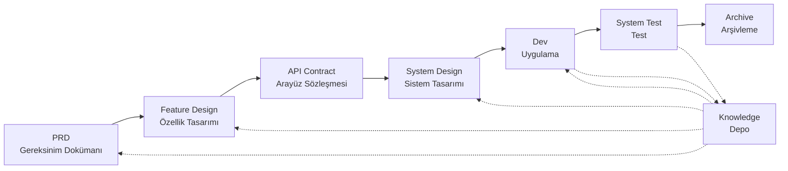

# SpecCrew - AI Destekli Yazılım Mühendisliği Çerçevesi

<p align="center">
  <a href="./README.md">简体中文</a> |
  <a href="./README.zh-TW.md">繁體中文</a> |
  <a href="./README.en.md">English</a> |
  <a href="./README.ko.md">한국어</a> |
  <a href="./README.de.md">Deutsch</a> |
  <a href="./README.es.md">Español</a> |
  <a href="./README.fr.md">Français</a> |
  <a href="./README.it.md">Italiano</a> |
  <a href="./README.da.md">Dansk</a> |
  <a href="./README.ja.md">日本語</a> |
  <a href="./README.pl.md">Polski</a> |
  <a href="./README.ru.md">Русский</a> |
  <a href="./README.bs.md">Bosanski</a> |
  <a href="./README.ar.md">العربية</a> |
  <a href="./README.no.md">Norsk</a> |
  <a href="./README.pt-BR.md">Português (Brasil)</a> |
  <a href="./README.th.md">ไทย</a> |
  <a href="./README.tr.md">Türkçe</a> |
  <a href="./README.uk.md">Українська</a> |
  <a href="./README.bn.md">বাংলা</a> |
  <a href="./README.el.md">Ελληνικά</a> |
  <a href="./README.vi.md">Tiếng Việt</a>
</p>

<p align="center">
  <a href="https://www.npmjs.com/package/speccrew"></a>
  <a href="https://www.npmjs.com/package/speccrew"></a>
  <a href="https://github.com/charlesmu99/speccrew/blob/main/LICENSE"></a>
</p>

> Herhangi bir yazılım projesi için hızlı mühendislik uygulaması sağlayan sanal bir AI geliştirme ekibi

## SpecCrew Nedir?

SpecCrew, gömülü bir sanal AI geliştirme ekibi çerçevesidir. Profesyonel yazılım mühendisliği iş akışlarını (PRD → Feature Design → System Design → Dev → Test) yeniden kullanılabilir Agent iş akışlarına dönüştürerek geliştirme ekiplerinin Specification-Driven Development (SDD) elde etmesine yardımcı olur ve özellikle mevcut projeler için uygundur.

Mevcut projelere Agent'ları ve Skill'leri entegre ederek, ekipler proje dokümantasyon sistemlerini ve sanal yazılım ekiplerini hızla başlatabilir ve standart mühendislik iş akışlarını takip ederek yeni özellikleri ve modifikasyonları adım adım uygulayabilir.

---

## ✨ Ana Özellikler

### 🏭 Sanal Yazılım Ekibi
Tek tıkla **7 profesyonel Agent rolü** + **30+ Skill iş akışı** oluşturma, eksiksiz bir sanal yazılım ekibi oluşturma:
- **Team Leader** - Global planlama ve iterasyon yönetimi
- **Product Manager** - Gereksinim analizi ve PRD çıktısı
- **Feature Designer** - Özellik tasarımı + API sözleşmeleri
- **System Designer** - Frontend/Backend/Mobil/Desktop sistem tasarımı
- **System Developer** - Çoklu platform paralel geliştirme
- **Test Manager** - Üç aşamalı test koordinasyonu
- **Task Worker** - Alt görev paralel yürütme

### 📐 ISA-95 Altı Aşamalı Modelleme
Uluslararası **ISA-95** modelleme metodolojisine dayalı, iş gereksinimlerinden yazılım sistemlerine dönüşümün standartlaştırılması:
```
Domain Descriptions → Functions in Domains → Functions of Interest
     ↓                       ↓                      ↓
Information Flows → Categories of Information → Information Descriptions
```
- Her aşama belirli UML diyagramlarına karşılık gelir (use case, sequence, class)
- İş gereksinimleri "adım adım rafine edilir", bilgi kaybı olmadan
- Çıktılar geliştirme için doğrudan kullanılabilir

### 📚 Bilgi Tabanı Sistemi
AI'nın her zaman "tek gerçek kaynağına" dayanarak çalışmasını sağlayan üç katmanlı bilgi tabanı mimarisi:

| Katman | Dizin | İçerik | Amaç |
|--------|-------|--------|------|
| L1 Sistem Bilgisi | `knowledge/techs/` | Tech stack, mimari, sözleşmeler | AI projenin teknik sınırlarını anlar |
| L2 İş Bilgisi | `knowledge/bizs/` | Modül işlevleri, iş akışları, varlıklar | AI iş mantığını anlar |
| L3 İterasyon Eserleri | `iterations/iXXX/` | PRD, tasarım belgeleri, test raporları | Mevcut gereksinimler için eksiksiz izlenebilirlik zinciri |

### 🔄 Dört Aşamalı Bilgi Hattı
**Otomatik bilgi üretimi mimarisi**, kaynak koddan iş/teknik dokümantasyonun otomatik olarak oluşturulması:
```
Aşama 1: Kaynak kod tarama → Modül listesi oluşturma
Aşama 2: Paralel analiz → Özellik çıkarma (çoklu Worker paralel)
Aşama 3: Paralel özetleme → Modül görünümlerini tamamlama (çoklu Worker paralel)
Aşama 4: Sistem agregasyonu → Sistem panoraması oluşturma
```
- **Tam senkronizasyon** ve **artımlı senkronizasyon** destekler (Git diff tabanlı)
- Bir kişi optimize eder, ekip paylaşır

### 🔧 Harness Pratik Uygulama Çerçevesi
**Standartlaştırılmış yürütme çerçevesi**, tasarım belgelerinin yürütülebilir geliştirme talimatlarına hassas bir şekilde dönüştürülmesini sağlar:
- **Operasyonel kılavuz ilkesi**: Skill bir SOP'dur, adımlar net, ardışık ve kendi kendine yeten
- **Girdi-çıktı sözleşmesi**: Arayüzleri açıkça tanımlar, pseudocode gibi titizlikle yürütür
- **Aşamalı açıklama mimarisi**: Bilgileri katmanlı yükler, tek seferde bağlam aşırı yüklenmesini önler
- **Alt Agent delege etme**: Karmaşık görevleri otomatik böler, paralel yürütme kaliteyi güvence altına alır

---

## Çözülen 8 Temel Sorun

### 1. AI Mevcut Proje Dokümantasyonunu Görmezden Gelir (Bilgi Boşluğu)
**Problem**: Mevcut SDD veya Vibe Coding yöntemleri, AI'nın projeleri gerçek zamanlı özetlemesine dayanır, bu da kritik içeriğin kolayca kaçırılmasına ve geliştirme sonuçlarının beklentilerden sapmasına neden olur.

**Çözüm**: `knowledge/` deposu projenin "tek doğruluk kaynağı" olarak hizmet eder, mimari tasarımı, işlevsel modülleri ve iş süreçlerini biriktirerek gereksinimlerin kaynaktan itibaren yolda kalmasını sağlar.

### 2. PRD'den Doğrudan Teknik Dokümantasyon (İçerik Atlama)
**Problem**: PRD'den doğrudan detaylı tasarıma atlamak, gereksinim detaylarını kolayca kaçırır ve uygulanan özelliklerin gereksinimlerden sapmasına neden olur.

**Çözüm**: Teknik detaylar olmadan yalnızca gereksinim iskeletine odaklanan **Feature Design Dokümanı** aşamasını tanıtın:
- Hangi sayfalar ve bileşenler dahil?
- Sayfa operasyon akışları
- Backend işleme mantığı
- Veri depolama yapısı

Geliştirme, belirli teknoloji yığınına dayalı olarak sadece "eti doldurmak" zorundadır ve özelliklerin "kemiklere (gereksinimlere) yakın" büyümesini sağlar.

### 3. Belirsiz Agent Arama Kapsamı (Belirsizlik)
**Problem**: Karmaşık projelerde, AI'nın geniş kod ve doküman araması belirsiz sonuçlar verir ve tutarlılığı garanti etmeyi zorlaştırır.

**Çözüm**: Her Agent'ın ihtiyaçlarına göre tasarlanmış net doküman dizin yapıları ve şablonlar, determinizmi garanti etmek için **aşamalı açıklama ve talep üzerine yükleme** uygular.

### 4. Eksik Aşamalar ve Görevler (Süreç Kopukluğu)
**Problem**: Eksik mühendislik süreci kapsamı kritik adımları kolayca kaçırır ve kaliteyi garanti etmeyi zorlaştırır.

**Çözüm**: Yazılım mühendisliği yaşam döngüsünün tamamını kapsar:
```
PRD (Gereksinimler) → Feature Design (Özellik Tasarımı) → API Contract (Sözleşme)
    → System Design (Sistem Tasarımı) → Dev (Geliştirme) → Test (Test)
```
- Her aşamanın çıktısı bir sonraki aşamanın girdisidir
- Her adım devam etmeden önce insan onayı gerektirir
- Tüm Agent yürütmelerinin tamamlanma sonrası kendi kendini kontrol eden todo listeleri vardır

### 5. Düşük Takım İşbirliği Verimliliği (Bilgi Siloları)
**Problem**: AI programlama deneyimi takımlar arasında paylaşılması zor olduğundan, tekrarlanan hatalara yol açar.

**Çözüm**: Tüm Agent'lar, Skill'ler ve ilgili dokümanlar kaynak koduyla birlikte versiyon kontrol edilir:
- Bir kişinin optimizasyonu takım tarafından paylaşılır
- Bilgi kod tabanında birikir
- Takım işbirliği verimliliği artar

### 7. Tek Agent Bağlamı Çok Uzun (Performans Darboğazı)
**Problem**: Büyük karmaşık görevler tek Agent bağlam pencerelerini aşar, anlama sapmalarına ve çıktı kalitesinin düşmesine neden olur.

**Çözüm**: **Sub-Agent Otomatik Dispatch Mekanizması**:
- Karmaşık görevler otomatik olarak tanımlanır ve alt görevlere bölünür
- Her alt görev, izole bağlam ile bağımsız bir Sub-Agent tarafından yürütülür
- Parent Agent koordine eder ve birleştirerek genel tutarlılığı sağlar
- Tek Agent bağlam genişlemesini önler ve çıktı kalitesini garanti eder

### 8. Gereksinim İterasyon Kaosu (Yönetim Zorluğu)
**Problem**: Aynı dalda karıştırılan birden fazla gereksinim birbirini etkiler, takip ve geri alma işlemlerini zorlaştırır.

**Çözüm**: **Her Gereksinim Bir Bağımsız Proje Olarak**:
- Her gereksinim bağımsız bir iterasyon dizini oluşturur `iterations/iXXX-[gereksinim-adı]/`
- Tam izolasyon: dokümanlar, tasarım, kod ve testler bağımsız yönetilir
- Hızlı iterasyon: küçük parçalı teslimat, hızlı doğrulama, hızlı dağıtım
- Esnek arşivleme: tamamlandıktan sonra, net tarihsel izlenebilirlikle `archive/` altında arşivlenir

### 6. Doküman Güncelleme Gecikmesi (Bilgi Çürümesi)
**Problem**: Projeler geliştikçe dokümanlar eskir ve AI yanlış bilgiyle çalışır.

**Çözüm**: Agent'lar otomatik doküman güncelleme yeteneklerine sahiptir, proje değişikliklerini gerçek zamanlı senkronize ederek bilgi tabanının doğruluğunu korur.

---

## Temel İş Akışı



### Aşama Açıklamaları

| Aşama | Agent | Girdi | Çıktı | İnsan Onayı |
|-------|-------|-------|-------|-------------|
| PRD | PM | Kullanıcı Gereksinimleri | Ürün Gereksinim Dokümanı | ✅ Gerekli |
| Feature Design | Feature Designer | PRD | Feature Design Dokümanı + API Sözleşmesi | ✅ Gerekli |
| System Design | System Designer | Feature Spec | Frontend/Backend Tasarım Dokümanları | ✅ Gerekli |
| Dev | Dev | Design | Kod + Görev Kayıtları | ✅ Gerekli |
| System Test | Test Manager | Dev Çıktısı + Feature Spec | Test Senaryoları + Test Kodu + Test Raporu + Bug Raporu | ✅ Gerekli |

---

## Mevcut Çözümlerle Karşılaştırma

| Boyut | Vibe Coding | Ralph Loop | **SpecCrew** |
|-------|-------------|------------|-------------|
| Doküman Bağımlılığı | Mevcut dokümanları görmezden gelir | AGENTS.md'e bağımlı | **Yapılandırılmış Bilgi Tabanı** |
| Gereksinim Transferi | Doğrudan kodlama | PRD → Kod | **PRD → Feature Design → System Design → Kod** |
| İnsan Katılımı | Minimal | Başlangıçta | **Her aşamada** |
| Süreç Tamlığı | Zayıf | Orta | **Tam mühendislik iş akışı** |
| Takım İşbirliği | Paylaşım zor | Kişisel verimlilik | **Takım bilgi paylaşımı** |
| Bağlam Yönetimi | Tek örnek | Tek örnek döngüsü | **Sub-Agent otomatik dispatch** |
| İterasyon Yönetimi | Karışık | Görev listesi | **Gereksinim proje olarak, bağımsız iterasyon** |
| Determinizm | Düşük | Orta | **Yüksek (aşamalı açıklama)** |

---

## Hızlı Başlangıç

### Önkoşullar

- Node.js >= 16.0.0
- Desteklenen IDE'ler: Qoder (varsayılan), Cursor, Claude Code

> **Not**: Cursor ve Claude Code için adaptörler gerçek IDE ortamlarında test edilmemiştir (kod seviyesinde uygulanmış ve E2E testleri ile doğrulanmış, ancak gerçek Cursor/Claude Code'da henüz test edilmemiştir).

### 1. SpecCrew'ü Kurun

```bash
npm install -g speccrew
```

### 2. Projeyi Başlatın

Projenizin kök dizinine gidin ve başlatma komutunu çalıştırın:

```bash
cd /path/to/your-project

# Varsayılan olarak Qoder kullanır
speccrew init

# Veya IDE belirtin
speccrew init --ide qoder
speccrew init --ide cursor
speccrew init --ide claude
```

Başlatmadan sonra projenizde şu dosyalar oluşturulacaktır:
- `.qoder/agents/` / `.cursor/agents/` / `.claude/agents/` — 7 Agent rol tanımı
- `.qoder/skills/` / `.cursor/skills/` / `.claude/skills/` — 30+ Skill iş akışı
- `speccrew-workspace/` — Çalışma alanı (iterasyon dizinleri, bilgi tabanı, doküman şablonları)
- `.speccrewrc` — SpecCrew yapılandırma dosyası

Daha sonra belirli bir IDE için Agent'ları ve Skill'leri güncellemek için:

```bash
speccrew update --ide cursor
speccrew update --ide claude
```

### 3. Geliştirme İş Akışını Başlatın

Standart mühendislik iş akışını adım adım takip edin:

1. **PRD**: Product Manager Agent gereksinimleri analiz eder ve ürün gereksinim dokümanı oluşturur
2. **Feature Design**: Feature Designer Agent feature design dokümanı + API sözleşmesi oluşturur
3. **System Design**: System Designer Agent platformlara göre sistem tasarım dokümanları oluşturur (frontend/backend/mobile/desktop)
4. **Dev**: System Developer Agent platformlara göre paralel geliştirme uygular
5. **System Test**: Test Manager Agent üç aşamalı test koordine eder (senaryo tasarımı → kod üretimi → yürütme raporu)
6. **Archive**: İterasyonu arşivle

> Her aşamanın teslim edilebilirleri bir sonraki aşamaya geçmeden önce insan onayı gerektirir.

### 4. SpecCrew'ü Güncelle

SpecCrew'un yeni bir sürümü yayınlandığında, güncellemeyi iki adımda tamamlayın:

```bash
# Step 1: Update the global CLI tool to the latest version
npm install -g speccrew@latest

# Step 2: Sync Agents and Skills in your project to the latest version
cd /path/to/your-project
speccrew update
```

> **Not**: `npm install -g speccrew@latest` CLI aracının kendisini güncellerken, `speccrew update` projenizdeki Agent ve Skill tanım dosyalarını günceller. Tam bir güncelleme için her iki adım da gereklidir.

### 5. Diğer CLI Komutları

```bash
speccrew list       # Yüklü agent'ları ve skill'leri listele
speccrew doctor     # Ortamı ve kurulum durumunu teşhis et
speccrew update     # Agent'ları ve skill'leri en son sürüme güncelle
speccrew uninstall  # SpecCrew'ü kaldır (--all çalışma alanını da siler)
```

📖 **Detaylı Kılavuz**: Kurulumdan sonra, tam iş akışı ve Agent konuşma kılavuzu için [Başlangıç Kılavuzu](docs/GETTING-STARTED.tr.md)'na bakın.

---

## Daha Fazla Bilgi

- **Agent Bilgi Haritası**: [speccrew-workspace/docs/agent-knowledge-map.md](./speccrew-workspace/docs/agent-knowledge-map.md)
- **npm**: https://www.npmjs.com/package/speccrew
- **GitHub**: https://github.com/charlesmu99/speccrew
- **Gitee**: https://gitee.com/amutek/speccrew
- **Qoder IDE**: https://qoder.com/

---

> **SpecCrew geliştiricilerin yerini almayı değil, sıkıcı kısımları otomatikleştirerek ekiplerin daha değerli işlere odaklanmasını sağlar.**
