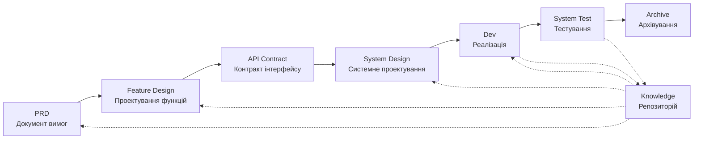

# SpecCrew - AI-орієнтований фреймворк програмної інженерії

<p align="center">
  <a href="./README.md">简体中文</a> |
  <a href="./README.zh-TW.md">繁體中文</a> |
  <a href="./README.en.md">English</a> |
  <a href="./README.ko.md">한국어</a> |
  <a href="./README.de.md">Deutsch</a> |
  <a href="./README.es.md">Español</a> |
  <a href="./README.fr.md">Français</a> |
  <a href="./README.it.md">Italiano</a> |
  <a href="./README.da.md">Dansk</a> |
  <a href="./README.ja.md">日本語</a> |
  <a href="./README.pl.md">Polski</a> |
  <a href="./README.ru.md">Русский</a> |
  <a href="./README.bs.md">Bosanski</a> |
  <a href="./README.ar.md">العربية</a> |
  <a href="./README.no.md">Norsk</a> |
  <a href="./README.pt-BR.md">Português (Brasil)</a> |
  <a href="./README.th.md">ไทย</a> |
  <a href="./README.tr.md">Türkçe</a> |
  <a href="./README.uk.md">Українська</a> |
  <a href="./README.bn.md">বাংলা</a> |
  <a href="./README.el.md">Ελληνικά</a> |
  <a href="./README.vi.md">Tiếng Việt</a>
</p>

<p align="center">
  <a href="https://www.npmjs.com/package/speccrew"></a>
  <a href="https://www.npmjs.com/package/speccrew"></a>
  <a href="https://github.com/charlesmu99/speccrew/blob/main/LICENSE"></a>
</p>

> Віртуальна команда розробки на базі ШІ, що забезпечує швидку інженерну реалізацію для будь-якого програмного проекту

## Що таке SpecCrew?

SpecCrew — це вбудований фреймворк віртуальної команди розробки на базі ШІ. Він перетворює професійні робочі процеси програмної інженерії (PRD → Feature Design → System Design → Dev → Test) у багаторазові робочі процеси Агентів, допомагаючи командам розробників досягти Specification-Driven Development (SDD), особливо підходить для існуючих проектів.

Інтегруючи Агентів та Навички в існуючі проекти, команди можуть швидко ініціалізувати системи документації проекту та віртуальні програмні команди, реалізуючи нові функції та модифікації відповідно до стандартних інженерних робочих процесів.

---

## ✨ Ключові особливості

### 🏭 Віртуальна команда розробки
Генерація одним кліком **7 професійних ролей Агентів** + **30+ робочих процесів Навичок**, створення повної віртуальної команди розробки:
- **Team Leader** - Глобальне планування та управління ітераціями
- **Product Manager** - Аналіз вимог та генерація PRD
- **Feature Designer** - Проектування функцій + API-контракти
- **System Designer** - Проектування систем Frontend/Backend/Mobile/Desktop
- **System Developer** - Багатоплатформна паралельна розробка
- **Test Manager** - Координація тестування в три етапи
- **Task Worker** - Паралельне виконання підзадач

### 📐 Моделювання ISA-95 в шість етапів
Базовано на міжнародній методології моделювання **ISA-95**, стандартизація перетворення бізнес-вимог в програмні системи:
```
Domain Descriptions → Functions in Domains → Functions of Interest
     ↓                       ↓                      ↓
Information Flows → Categories of Information → Information Descriptions
```
- Кожен етап відповідає певним UML-діаграмам (use case, sequence, class diagrams)
- Бізнес-вимоги "уточнюються поетапно", без втрати інформації
- Результати безпосередньо придатні для розробки

### 📚 Система бази знань
Трирівнева архітектура бази знань, що гарантує, що ШІ завжди працює на основі "єдиного джерела істини":

| Рівень | Каталог | Вміст | Призначення |
|--------|---------|-------|-------------|
| L1 Системні знання | `knowledge/techs/` | Технологічний стек, архітектура, угоди | ШІ розуміє технічні межі проекту |
| L2 Бізнес-знання | `knowledge/bizs/` | Функції модулів, бізнес-процеси, сутності | ШІ розуміє бізнес-логіку |
| L3 Артефакти ітерацій | `iterations/iXXX/` | PRD, проектні документи, звіти про тестування | Повний ланцюжок відстеження для поточних вимог |

### 🔄 Чотириетапний конвеєр знань
**Автоматизована архітектура генерації знань**, автоматична генерація бізнес/технічної документації з вихідного коду:
```
Етап 1: Сканування вихідного коду → Генерація списку модулів
Етап 2: Паралельний аналіз → Вилучення функцій (багато Worker паралельно)
Етап 3: Паралельне узагальнення → Завершення оглядів модулів (багато Worker паралельно)
Етап 4: Системна агрегація → Генерація панорами системи
```
- Підтримує **повну синхронізацію** та **інкрементальну синхронізацію** (на основі Git diff)
- Один оптимізує, команда використовує

### 🔧 Harness Практична структура впровадження
**Стандартизована структура виконання**, що забезпечує точне перетворення проектних документів у виконувані інструкції з розробки:
- **Принцип операційного посібника**: Навичка — це SOP, кроки чіткі, послідовні та самодостатні
- **Контракт введення-виведення**: Чітке визначення інтерфейсів, суворе виконання як pseudocode
- **Архітектура прогресивного розкриття**: Шаруватезавантаження інформації, уникнення одноразового перевантаження контексту
- **Делегування суб-Агентів**: Автоматичний поділ складних завдань, паралельне виконання гарантує якість

---

## Вирішення 8 ключових проблем

### 1. ШІ ігнорує існуючу документацію проекту (розрив знань)
**Проблема**: Існуючі методи SDD або Vibe Coding покладаються на те, що ШІ резюмує проекти в реальному часі, легко пропускаючи критичний контекст і призводячи до результатів розробки, що відхиляються від очікувань.

**Рішення**: Репозиторій `knowledge/` служить "єдиним джерелом істини" проекту, накопичуючи архітектурний дизайн, функціональні модулі та бізнес-процеси, забезпечуючи відповідність вимог джерелу.

### 2. Пряма технічна документація з PRD (пропуск змісту)
**Проблема**: Прямий перехід від PRD до детального проектування легко пропускає деталі вимог, призводячи до того, що реалізовані функції відхиляються від вимог.

**Рішення**: Впровадження фази **Документа Feature Design**, що фокусується лише на скелеті вимог без технічних деталей:
- Які сторінки та компоненти включені?
- Потоки операцій сторінок
- Логіка обробки бекенду
- Структура зберігання даних

Розробка повинна лише "наростити м'ясо" на основі конкретного технічного стеку, забезпечуючи зростання функцій "близько до кісток (вимог)".

### 3. Невизначена область пошуку Агента (невизначеність)
**Проблема**: У складних проектах широкий пошук коду та документів ШІ дає невизначені результати, що ускладнює гарантування узгодженості.

**Рішення**: Чіткі структури каталогів документів та шаблони, розроблені на основі потреб кожного Агента, реалізують **прогресивне розкриття та завантаження за запитом** для забезпечення детермінізму.

### 4. Пропущені етапи та завдання (розрив процесу)
**Проблема**: Відсутність повного охоплення інженерного процесу легко пропускає критичні кроки, що ускладнює гарантування якості.

**Рішення**: Охоплення повного життєвого циклу програмної інженерії:
```
PRD (Вимоги) → Feature Design (Проектування функцій) → API Contract (Контракт)
    → System Design (Системне проектування) → Dev (Розробка) → Test (Тестування)
```
- Вихід кожної фази є входом наступної фази
- Кожен крок потребує людського підтвердження перед продовженням
- Всі виконання Агентів мають списки todo з самоперевіркою після завершення

### 5. Низька ефективність командної співпраці (інформаційні силоси)
**Проблема**: Досвід програмування з ШІ важко розділяти між командами, що призводить до повторних помилок.

**Рішення**: Всі Агенти, Навички та пов'язані документи версіонуються з вихідним кодом:
- Оптимізація однієї людини розділяється командою
- Знання накопичуються в кодовій базі
- Підвищується ефективність командної співпраці

### 7. Занадто довгий контекст одного Агента (вузьке місце продуктивності)
**Проблема**: Великі складні завдання перевищують контекстні вікна одного Агента, викликаючи відхилення в розумінні та зниження якості виходу.

**Рішення**: **Механізм автодиспетчеризації суб-Агентів**:
- Складні завдання автоматично ідентифікуються та розділяються на підзавдання
- Кожне підзавдання виконується незалежним суб-Агентом з ізольованим контекстом
- Батьківський Агент координує та агрегує для забезпечення загальної узгодженості
- Уникає розширення контексту одного Агента, забезпечуючи якість виходу

### 8. Хаос ітерації вимог (труднощі управління)
**Проблема**: Кілька вимог, змішаних в одній гілці, впливають одна на одну, що ускладнює відстеження та відкат.

**Рішення**: **Кожна вимога як незалежний проект**:
- Кожна вимога створює незалежний каталог ітерації `iterations/iXXX-[ім'я-вимоги]/`
- Повна ізоляція: документи, дизайн, код та тести керуються незалежно
- Швидка ітерація: доставка малої гранулярності, швидка верифікація, швидке розгортання
- Гнучке архівування: після завершення, архівування в `archive/` з чіткою історичною відстежуваністю

### 6. Затримка оновлення документів (старіння знань)
**Проблема**: Документи застарівають по мірі розвитку проектів, змушуючи ШІ працювати з невірною інформацією.

**Рішення**: Агенти мають можливості автоматичного оновлення документів, синхронізуючи зміни проекту в реальному часі для підтримки точності бази знань.

---

## Основний робочий процес



### Опис фаз

| Фаза | Агент | Вхід | Вихід | Людське підтвердження |
|------|-------|------|-------|----------------------|
| PRD | PM | Користувацькі вимоги | Документ вимог продукту | ✅ Обов'язково |
| Feature Design | Feature Designer | PRD | Документ Feature Design + API контракт | ✅ Обов'язково |
| System Design | System Designer | Feature Spec | Документи проектування Frontend/Backend | ✅ Обов'язково |
| Dev | Dev | Design | Код + Записи завдань | ✅ Обов'язково |
| System Test | Test Manager | Вихід Dev + Feature Spec | Тест-кейси + Тестовий код + Тестовий звіт + Звіт багів | ✅ Обов'язково |

---

## Порівняння з існуючими рішеннями

| Вимір | Vibe Coding | Ralph Loop | **SpecCrew** |
|-------|-------------|------------|-------------|
| Залежність від документів | Ігнорує існуючі документи | Покладається на AGENTS.md | **Структурована база знань** |
| Передача вимог | Пряме кодування | PRD → Код | **PRD → Feature Design → System Design → Код** |
| Людська участь | Мінімальна | При запуску | **На кожній фазі** |
| Повнота процесу | Слабка | Середня | **Повний інженерний робочий процес** |
| Командна співпраця | Важко ділитися | Особиста ефективність | **Розділення знань команди** |
| Управління контекстом | Один екземпляр | Цикл одного екземпляра | **Автодиспетчеризація суб-Агентів** |
| Управління ітерацією | Змішане | Список завдань | **Вимога як проект, незалежна ітерація** |
| Детермінізм | Низький | Середній | **Високий (прогресивне розкриття)** |

---

## Швидкий старт

### Передумови

- Node.js >= 16.0.0
- Підтримувані IDE: Qoder (за замовчуванням), Cursor, Claude Code

> **Примітка**: Адаптери для Cursor та Claude Code не тестувалися в реальних середовищах IDE (реалізовані на рівні коду та верифіковані через E2E тести, але ще не протестовані в реальних Cursor/Claude Code).

### 1. Встановити SpecCrew

```bash
npm install -g speccrew
```

### 2. Ініціалізувати проект

Перейдіть до кореневого каталогу проекту та виконайте команду ініціалізації:

```bash
cd /path/to/your-project

# За замовчуванням використовує Qoder
speccrew init

# Або вкажіть IDE
speccrew init --ide qoder
speccrew init --ide cursor
speccrew init --ide claude
```

Після ініціалізації в проекті будуть створені:
- `.qoder/agents/` / `.cursor/agents/` / `.claude/agents/` — 7 визначень ролей Агентів
- `.qoder/skills/` / `.cursor/skills/` / `.claude/skills/` — 30+ робочих процесів Навичок
- `speccrew-workspace/` — Робочий простір (каталоги ітерацій, база знань, шаблони документів)
- `.speccrewrc` — Файл конфігурації SpecCrew

Щоб пізніше оновити Агентів та Навички для конкретного IDE:

```bash
speccrew update --ide cursor
speccrew update --ide claude
```

### 3. Почати робочий процес розробки

Дотримуйтесь стандартного інженерного робочого процесу крок за кроком:

1. **PRD**: Агент Product Manager аналізує вимоги та генерує документ вимог продукту
2. **Feature Design**: Агент Feature Designer генерує документ feature design + API контракт
3. **System Design**: Агент System Designer генерує документи system design за платформами (frontend/backend/mobile/desktop)
4. **Dev**: Агент System Developer реалізує розробку за платформами паралельно
5. **System Test**: Агент Test Manager координує трифазне тестування (дизайн кейсів → генерація коду → звіт виконання)
6. **Archive**: Архівувати ітерацію

> Результати кожної фази потребують людського підтвердження перед переходом до наступної фази.

### 4. Оновити SpecCrew

Коли виходить нова версія SpecCrew, виконайте оновлення у два кроки:

```bash
# Step 1: Update the global CLI tool to the latest version
npm install -g speccrew@latest

# Step 2: Sync Agents and Skills in your project to the latest version
cd /path/to/your-project
speccrew update
```

> **Примітка**: `npm install -g speccrew@latest` оновлює сам інструмент CLI, а `speccrew update` оновлює файли визначень Агентів та Навичок у вашому проекті. Для повного оновлення необхідні обидва кроки.

### 5. Інші CLI команди

```bash
speccrew list       # Список встановлених агентів та навичок
speccrew doctor     # Діагностика середовища та статусу встановлення
speccrew update     # Оновлення агентів та навичок до останньої версії
speccrew uninstall  # Видалити SpecCrew (--all також видаляє робочий простір)
```

📖 **Детальний посібник**: Після встановлення ознайомтесь з [Посібником початку роботи](docs/GETTING-STARTED.uk.md) для повного робочого процесу та посібника діалогів агентів.

---

## Більше інформації

- **Карта знань Агентів**: [speccrew-workspace/docs/agent-knowledge-map.md](./speccrew-workspace/docs/agent-knowledge-map.md)
- **npm**: https://www.npmjs.com/package/speccrew
- **GitHub**: https://github.com/charlesmu99/speccrew
- **Gitee**: https://gitee.com/amutek/speccrew
- **Qoder IDE**: https://qoder.com/

---

> **SpecCrew не має на меті замінити розробників, а автоматизувати нудні частини, щоб команди могли зосередитися на більш цінній роботі.**