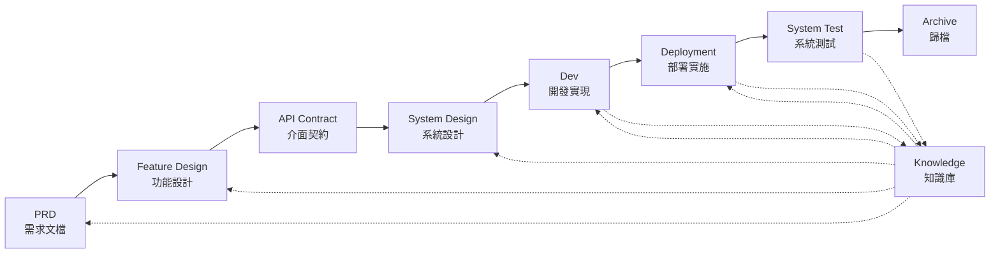

# SpecCrew - AI 驅動的軟體工程化框架

<p align="center">
  <a href="./README.md">简体中文</a> |
  <a href="./README.zh-TW.md">繁體中文</a> |
  <a href="./README.en.md">English</a> |
  <a href="./README.ko.md">한국어</a> |
  <a href="./README.de.md">Deutsch</a> |
  <a href="./README.es.md">Español</a> |
  <a href="./README.fr.md">Français</a> |
  <a href="./README.it.md">Italiano</a> |
  <a href="./README.da.md">Dansk</a> |
  <a href="./README.ja.md">日本語</a> |
  <a href="./README.pl.md">Polski</a> |
  <a href="./README.ru.md">Русский</a> |
  <a href="./README.bs.md">Bosanski</a> |
  <a href="./README.ar.md">العربية</a> |
  <a href="./README.no.md">Norsk</a> |
  <a href="./README.pt-BR.md">Português (Brasil)</a> |
  <a href="./README.th.md">ไทย</a> |
  <a href="./README.tr.md">Türkçe</a> |
  <a href="./README.uk.md">Українська</a> |
  <a href="./README.bn.md">বাংলা</a> |
  <a href="./README.el.md">Ελληνικά</a> |
  <a href="./README.vi.md">Tiếng Việt</a>
</p>

<p align="center">
  <a href="https://www.npmjs.com/package/speccrew"></a>
  <a href="https://www.npmjs.com/package/speccrew"></a>
  <a href="https://github.com/charlesmu99/speccrew/blob/main/LICENSE"></a>
</p>

> 讓任何軟體專案快速實現工程化落地的虛擬 AI 開發團隊

## 什麼是 SpecCrew？

SpecCrew 是一套嵌入式的虛擬 AI 開發團隊框架。它將專業的軟體工程流程（PRD → Feature Design → System Design → Dev → Deployment → Test）轉化為可複用的 Agent 工作流，幫助開發團隊實現規範驅動開發（SDD），特別適合已有專案。

通過將 Agent 和 Skill 整合到現有專案，即可快速初始化專案文檔體系和虛擬軟體團隊，按照標準工程流程分步實現功能的新增和修改。

---

## ✨ 核心亮點

### 🏭 虛擬軟體團隊
一鍵生成 **7 個專業 Agent 角色** + **30+ 個 Skill 工作流**，構建完整虛擬軟體團隊：
- **Team Leader** - 全域排程與迭代管理
- **Product Manager** - 需求分析與 PRD 輸出
- **Feature Designer** - 功能設計 + API 契約
- **System Designer** - 前端/後端/行動端/桌面端系統設計
- **System Developer** - 多端並行開發
- **Test Manager** - 三階段測試協調
- **Task Worker** - 子任務並行執行

### 📐 ISA-95 六段式建模
基於國際標準 **ISA-95** 建模方法論，實現業務需求到軟體系統的標準化轉化：
```
Domain Descriptions → Functions in Domains → Functions of Interest
     ↓                       ↓                      ↓
Information Flows → Categories of Information → Information Descriptions
```
- 每個階段對應明確的 UML 圖（用例圖、序列圖、類圖等）
- 業務需求「逐級細化」，無資訊丢失
- 輸出物可直接用於開發

### 📚 知識庫體系
三層次知識庫架構，確保 AI 始終基於「事實來源」工作：

| 層級 | 目錄 | 內容 | 作用 |
|------|------|------|------|
| L1 系統知識 | `knowledge/techs/` | 技術棧、架構、開發規約 | AI 理解專案技術邊界 |
| L2 業務知識 | `knowledge/bizs/` | 模組功能、業務流程、實體關係 | AI 理解業務邏輯 |
| L3 迭代產物 | `iterations/iXXX/` | PRD、設計文檔、測試報告 | 當前需求完整追溯鏈 |

### 🔄 四階段知識流水線
**自動化知識生成架構**，從原始碼自動生成業務/技術文檔：
```
Stage 1: 掃描原始碼 → 生成模組清單
Stage 2: 並行分析 → 提取功能特性（多 Worker 並行）
Stage 3: 並行匯總 → 完善模組概覽（多 Worker 並行）
Stage 4: 系統聚合 → 生成系統全景圖
```
- 支援 **全量同步** 和 **增量同步**（基於 Git diff）
- 一人優化，團隊共享

### 🔧 Harness 實戰落地框架
**標準化執行框架**，確保設計文檔精準轉化為可執行的開發指令：
- **操作手冊原則**：Skill 即 SOP，步驟清晰、連續、自包含
- **輸入輸出契約**：明確定義介面，像偽代碼一樣嚴謹執行
- **逐級披露架構**：資訊分層載入，避免一次性上下文過載
- **子 Agent 委派**：複雜任務自動拆分，並行執行確保品質

---

## 解決 8 個核心問題

### 1. AI 忽略現有專案文檔（知識斷層）
**問題**：現有 SDD 或 Vibe Coding 方法依賴 AI 即時總結專案，容易遺漏關鍵上下文，導致開發結果偏離預期。

**解決**：`knowledge/` 知識庫作為專案的「事實來源」，沉澱架構設計、功能模組、業務流程等核心資訊，確保需求源頭不偏差。

### 2. 需求文檔直接轉技術文檔（內容遺漏）
**問題**：從 PRD 直接跳到詳細設計，容易遺漏需求細節，開發出的功能與需求脫節。

**解決**：增加 **Feature Design 文檔**環節，不考慮技術細節，只聚焦需求骨架：
- 包含哪些頁面和元件？
- 頁面操作流程
- 後端處理邏輯
- 資料儲存結構

開發階段只需基於特定技術棧「填肉」，確保功能「貼著骨頭（需求）」生長。

### 3. Agent 搜尋範圍不確定（不確定性）
**問題**：複雜專案中，AI 大範圍搜尋程式碼和文檔，結果不確定，難以保證一致性。

**解決**：明確的文檔目錄結構和模板，基於每個 Agent 所需內容設計，實現 **逐級披露、按需載入**，確保確定性。

### 4. 環節缺失、任務遺漏（流程斷裂）
**問題**：缺乏完整的工程流程覆蓋，容易遺漏關鍵步驟，品質難以保證。

**解決**：覆蓋軟體工程全環節：
```
PRD（需求）→ Feature Design（功能設計）→ API Contract（契約）
    → System Design（系統設計）→ Dev（開發）→ Deployment（部署）→ Test（測試）
```
- 每個環節產出物是下一環節的輸入
- 每步需人工確認後方可執行
- 所有 Agent 執行都有 todo 清單，完成後自檢

### 5. 團隊協作效率低（知識孤島）
**問題**：AI 程式設計經驗難以在團隊間共享，重複踩坑。

**解決**：所有 Agents、Skills 和相關文檔與原始碼一起進入 Git 版本管控：
- 一人優化，團隊共享
- 知識沉澱在程式碼庫中
- 提升團隊協同效率

### 7. 單 Agent 上下文過長（效能瓶頸）
**問題**：大型複雜任務超出單 Agent 上下文視窗，導致理解偏差、輸出品質下降。

**解決**：**子 Agent 自動調派機制**：
- 複雜任務自動識別並拆分為子任務
- 每個子任務由獨立子 Agent 執行，上下文隔離
- 父 Agent 協調彙總，確保整體一致性
- 避免單 Agent 上下文膨脹，保障輸出品質

### 8. 需求迭代混亂（管理困難）
**問題**：多個需求混雜在同一分支，相互影響，難以追蹤和回滾。

**解決**：**每個需求作為獨立專案**：
- 每個需求建立獨立迭代目錄 `iterations/iXXX-[需求名]/`
- 完整隔離：文檔、設計、程式碼、測試獨立管理
- 快速迭代：小粒度交付，快速驗證，快速上線
- 靈活歸檔：完成後歸檔至 `archive/`，歷史清晰可追溯

### 6. 文檔更新滯後（知識腐化）
**問題**：專案演進後文檔過時，AI 基於錯誤資訊工作。

**解決**：Agent 具有自動更新文檔的能力，即時同步專案變化，保持知識庫即時準確。

---

## 核心工作流程



### 各階段說明

| 階段 | Agent | 輸入 | 輸出 | 人工確認 |
|------|-------|------|------|----------|
| PRD | PM | 使用者需求 | 產品需求文檔 | ✅ 必需 |
| Feature Design | Feature Designer | PRD | 功能設計文檔 + 介面契約 | ✅ 必需 |
| System Design | System Designer | Feature Spec | 前端/後端設計文檔 | ✅ 必需 |
| Dev | Dev | Design | 程式碼 + 任務記錄 | ✅ 必需 |
| Deployment | System Deployer | Dev 產出 | 部署報告 + 運行應用 | ✅ 必需 |
| System Test | Test Manager | Deployment 產出 + Feature Spec | 測試案例 + 測試程式碼 + 測試報告 + Bug 報告 | ✅ 必需 |

---

## 與現有方案對比

| 維度 | Vibe Coding | Ralph 循環 | **SpecCrew** |
|------|-------------|------------|-------------|
| 文檔依賴 | 忽略現有文檔 | 依賴 AGENTS.md | **結構化知識庫** |
| 需求傳遞 | 直接編碼 | PRD → 程式碼 | **PRD → Feature Design → System Design → 程式碼** |
| 人工介入 | ❌ | 啟動時 | **每階段確認** |
| 流程完整性 | ❌ | 中等 | **完整工程流程** |
| 團隊協作 | 難共享 | 個人效率 | **團隊知識共享** |
| 上下文管理 | 單實例 | 單實例循環 | **子 Agent 自動調派** |
| 迭代管理 | 混雜 | 任務列表 | **需求即專案，獨立迭代** |
| 確定性 | ❌ | 中等 | **高（逐級披露）** |

---

## 快速開始

### 前置條件

- Node.js >= 16.0.0
- 支援的 IDE：Qoder（預設）、Cursor、Claude Code

> **注意**：Cursor 和 Claude Code 的適配尚未在實際 IDE 環境中測試（程式碼層面已實現並通過 E2E 驗證，但未在真實 Cursor/Claude Code 中實測）。

### 1. 安裝 SpecCrew

```bash
npm install -g speccrew
```

### 2. 初始化專案

進入你的專案根目錄，執行初始化命令：

```bash
cd /path/to/your-project

# 預設使用 Qoder
speccrew init

# 或指定 IDE
speccrew init --ide qoder
speccrew init --ide cursor
speccrew init --ide claude
```

初始化完成後，專案中會生成：
- `.qoder/agents/` / `.cursor/agents/` / `.claude/agents/` — 7 個 Agent 角色定義
- `.qoder/skills/` / `.cursor/skills/` / `.claude/skills/` — 30+ 個 Skill 工作流
- `speccrew-workspace/` — 工作區（迭代目錄、知識庫、文檔模板）
- `.speccrewrc` — SpecCrew 配置檔案

後續如需更新指定 IDE 的 Agents 和 Skills：

```bash
speccrew update --ide cursor
speccrew update --ide claude
```

### 3. 開始開發流程

按照標準工程流程逐步推進：

1. **PRD**：由產品經理 Agent 分析需求，生成產品需求文檔
2. **Feature Design**：由功能設計師 Agent 生成功能設計文檔 + API 契約
3. **System Design**：由系統設計師 Agent 按端（前端/後端/移動端/桌面端）生成系統設計文檔
4. **Dev**：由系統開發者 Agent 按端並行實現開發
5. **Deployment**：由系統部署者 Agent 執行構建、資料庫遷移、服務啟動和煙霧測試
6. **System Test**：由測試管理員 Agent 協調三階段測試（案例設計 → 程式碼生成 → 執行報告）
7. **Archive**：歸檔迭代

> 每個階段產出物需人工確認後方可進入下一階段。

### 4. 更新 SpecCrew

當 SpecCrew 發布新版本時，請分兩步完成更新：

```bash
# Step 1: Update the global CLI tool to the latest version
npm install -g speccrew@latest

# Step 2: Sync Agents and Skills in your project to the latest version
cd /path/to/your-project
speccrew update
```

> **注意**：`npm install -g speccrew@latest` 更新 CLI 工具本身，而 `speccrew update` 更新專案中的 Agent 和 Skill 定義檔案。完整更新需要兩個步驟都執行。

### 5. 其他 CLI 命令

```bash
speccrew list       # 列出已安裝的 agents 和 skills
speccrew doctor     # 診斷環境和安裝狀態
speccrew update     # 更新 agents 和 skills 到最新版本
speccrew uninstall  # 解除安裝 SpecCrew（--all 同時刪除工作區）
```

📖 **詳細使用指南**：安裝完成後，查看 [快速開始文檔](docs/GETTING-STARTED.zh-TW.md) 了解完整的工作流程和各 Agent 對話指南。

---

## 目錄結構

```
your-project/
├── .qoder/                          # IDE 配置目錄（Qoder 範例）
│   ├── agents/                      # 7 個角色 Agent
│   │   ├── speccrew-team-leader.md       # 團隊領導：全局調度與迭代管理
│   │   ├── speccrew-product-manager.md   # 產品經理：需求分析與 PRD
│   │   ├── speccrew-feature-designer.md  # 功能設計師：Feature Design + API 契約
│   │   ├── speccrew-system-designer.md   # 系統設計師：按端生成系統設計
│   │   ├── speccrew-system-developer.md  # 系統開發者：按端並行開發
│   │   ├── speccrew-test-manager.md      # 測試管理員：三階段測試協調
│   │   └── speccrew-task-worker.md       # 任務工人：並行子任務執行
│   └── skills/                      # 30+ 個 Skill（按職能分組）
│       ├── speccrew-pm-*/                # 產品管理（需求分析、需求評估）
│       ├── speccrew-fd-*/                # 功能設計（Feature Design、API 契約）
│       ├── speccrew-sd-*/                # 系統設計（前端/後端/移動端/桌面端）
│       ├── speccrew-dev-*/               # 開發實現（前端/後端/移動端/桌面端）
│       ├── speccrew-test-*/              # 測試（案例設計/程式碼生成/執行報告）
│       ├── speccrew-knowledge-bizs-*/    # 業務知識庫（API分析/UI分析/模組分類等）
│       ├── speccrew-knowledge-techs-*/   # 技術知識庫（技術棧生成/規約/索引等）
│       ├── speccrew-knowledge-graph-*/   # 知識圖譜（讀寫查詢）
│       └── speccrew-*/                   # 工具類（診斷/時間戳/工作流等）
│
└── speccrew-workspace/              # 工作區（初始化時生成）
    ├── docs/                        # 管理性文檔
    │   ├── configs/                 # 配置檔案（平台映射、技術棧映射等）
    │   ├── rules/                   # 規則配置
    │   └── solutions/               # 解決方案文檔
    │
    ├── iterations/                  # 迭代專案（動態生成）
    │   └── {序號}-{類型}-{名稱}/
    │       ├── 00.docs/             # 原始需求文檔
    │       ├── 01.product-requirement/ # 產品需求文檔
    │       ├── 02.feature-design/   # 功能設計
    │       ├── 03.system-design/    # 系統設計
    │       ├── 04.development/      # 開發階段
    │       ├── 05.deployment/       # 部署階段
    │       ├── 06.system-test/      # 系統測試
    │       └── 07.delivery/         # 交付階段
    │
    ├── iteration-archives/          # 迭代歸檔
    │
    └── knowledges/                  # 知識庫
        ├── base/                    # 基礎/元資料
        │   ├── diagnosis-reports/   # 診斷報告
        │   ├── sync-state/          # 同步狀態
        │   └── tech-debts/          # 技術債
        ├── bizs/                    # 業務知識
        │   └── {platform-type}/{module-name}/
        └── techs/                   # 技術知識
            └── {platform-id}/
```

---

## 核心設計原則

1. **規範驅動**：先寫規範，再由規範「長出」程式碼
2. **逐級披露**：Agent 從最小入口開始，按需獲取資訊
3. **人工確認**：每階段產出需人工確認，避免 AI 跑偏
4. **上下文隔離**：大任務拆分為小粒度、上下文隔離的子任務
5. **子 Agent 協作**：複雜任務自動調派子 Agent，避免單 Agent 上下文膨脹
6. **快速迭代**：每個需求作為獨立專案，快速交付、快速驗證
7. **知識共享**：所有配置與原始碼一起 Git 管控

---

## 適用場景

### ✅ 推薦使用
- 需要規範流程的中大型專案
- 團隊協作的軟體開發
- 遺留專案的工程化改造
- 需要長期維護的產品

### ❌ 不太適合
- 個人快速原型驗證
- 探索性、需求極不確定的專案
- 一次性腳本或工具

---

## 更多資訊

- **Agent 知識地圖**: [speccrew-workspace/docs/agent-knowledge-map.md](./speccrew-workspace/docs/agent-knowledge-map.md)
- **npm**: https://www.npmjs.com/package/speccrew
- **GitHub**: https://github.com/charlesmu99/speccrew
- **Gitee**: https://gitee.com/amutek/speccrew
- **Qoder IDE**: https://qoder.com/

---

> **SpecCrew 不是取代開發者，而是自動化那些枯燥的部分，讓團隊能專注於更有價值的工作。**
