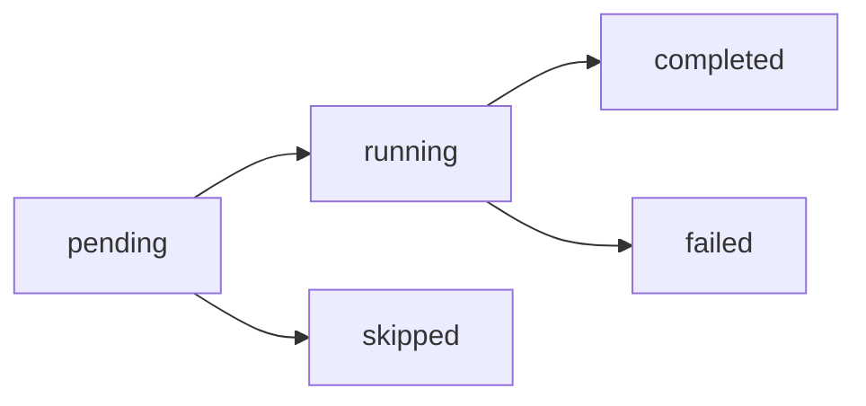

# ai-xml-flow 积木类型参考

## 1. 概述

ai-xml-flow 采用 **Blockly 积木模型 + BPMN 语义分类** 的混合设计理念：

- **Blockly 积木模型**：所有操作统一为 `<block>` 积木，堆叠即顺序，无需显式连线；分支/循环/异常使用 C 型积木包裹内部内容；所有参数统一为 `<field>` 子节点
- **BPMN 语义分类**：积木的 `type` 属性借鉴 BPMN 2.0 术语，保留业务流程语义

这一设计将旧方案的 14 种节点类型精简为 **9 种积木类型**，降低 36% 记忆成本，同时通过内联 Schema 注释实现 LLM 自解释性。

---

## 2. 九种积木类型速查表

### 2.1 input — 输入积木

| 项目 | 说明 |
|------|------|
| **BPMN 对应** | Start Event with Data Input |
| **Blockly 对应** | Hat Block（顶部带"帽子"的起始块） |
| **用途** | 定义工作流的输入参数，对应函数签名中的参数列表。必须放在 workflow 的第一个 block 位置 |

**关键属性：**

| 属性 | 类型 | 必填 | 说明 |
|------|------|------|------|
| `type` | string | 是 | 固定值 `input` |
| `id` | string | 是 | 积木唯一标识 |
| `desc` | string | 是 | 自然语言描述 |
| `status` | enum | 否 | 执行状态 |

**子节点规则：** 包含多个 `<field>`，每个 field 表示一个输入参数：

| field 属性 | 类型 | 必填 | 说明 |
|------------|------|------|------|
| `name` | string | 是 | 参数名 |
| `required` | boolean | 否 | 是否必填，默认 true |
| `default` | string | 否 | 默认值（当 required=false 时使用） |
| `type` | string | 否 | 参数类型提示（string/number/array/object/boolean） |
| `desc` | string | 否 | 参数描述 |

> input block 中的 field 会自动成为 workflow 作用域的变量，无需额外声明。

**XML 示例：**

```xml
<block type="input" id="I1" desc="工作流输入参数">
  <field name="source_path" required="true" type="string" desc="源码根目录路径"/>
  <field name="platform_id" required="true" type="string" desc="平台标识，如 web-vue"/>
  <field name="knowledge_dir" required="false" type="string"
         default="${workspace}/knowledges/bizs" desc="知识库输出目录"/>
</block>
```

---

### 2.2 output — 输出积木

| 项目 | 说明 |
|------|------|
| **BPMN 对应** | End Event with Data Output |
| **Blockly 对应** | Cap Block（底部带"盖子"的结束块） |
| **用途** | 定义工作流的输出结果，对应函数返回值。必须放在 workflow 的最后一个 block 位置 |

**关键属性：**

| 属性 | 类型 | 必填 | 说明 |
|------|------|------|------|
| `type` | string | 是 | 固定值 `output` |
| `id` | string | 是 | 积木唯一标识 |
| `desc` | string | 是 | 自然语言描述 |
| `status` | enum | 否 | 执行状态 |

**子节点规则：** 包含多个 `<field>`，每个 field 表示一个输出值：

| field 属性 | 类型 | 必填 | 说明 |
|------------|------|------|------|
| `name` | string | 是 | 输出名 |
| `from` | string | 是 | 数据来源变量引用 |
| `type` | string | 否 | 类型提示（string/number/array/object/boolean） |
| `desc` | string | 否 | 输出描述 |

**XML 示例：**

```xml
<block type="output" id="O1" desc="工作流输出结果">
  <field name="matched_modules" from="${matcherResult.matched_modules}"
         type="array" desc="匹配到的模块列表"/>
  <field name="execution_path" from="${executionPath}"
         type="string" desc="执行路径 A 或 B"/>
  <field name="success" from="${validationResult.valid}"
         type="boolean" desc="工作流是否成功完成"/>
</block>
```

---

### 2.3 task — 任务积木

| 项目 | 说明 |
|------|------|
| **BPMN 对应** | Task |
| **用途** | 执行具体动作，是最基本的执行积木 |

**关键属性：**

| 属性 | 类型 | 必填 | 说明 |
|------|------|------|------|
| `type` | string | 是 | 固定值 `task` |
| `id` | string | 是 | 积木唯一标识 |
| `action` | enum | 是 | 动作类型（见下表） |
| `desc` | string | 是 | 积木描述（自然语言说明做什么） |
| `timeout` | number | 否 | 超时时间（秒） |
| `status` | enum | 否 | 执行状态 |

**动作类型：**

| action | 用途 | 必需字段 |
|--------|------|----------|
| `run-skill` | 调用 Skill | `<field name="skill">` |
| `run-script` | 执行脚本命令 | `<field name="command">` |
| `dispatch-to-worker` | 分发任务给 Worker | `<field name="agent">` |

**子节点规则：** 可以包含多个 `<field>` 定义参数和输出。

**XML 示例：**

```xml
<!-- 调用 Skill -->
<block type="task" id="B1" action="run-skill" desc="执行模块匹配 Skill">
  <field name="skill">speccrew-knowledge-module-matcher</field>
  <field name="source_path" value="${source.path}"/>
  <field name="platform_id" value="${platform.id}"/>
  <field name="output" var="matcherResult"/>
</block>

<!-- 执行脚本 -->
<block type="task" id="B2" action="run-script" desc="检查知识库目录状态">
  <field name="command">node scripts/check-knowledge.js</field>
  <field name="arg">--dir</field>
  <field name="arg">${knowledgeDir}</field>
  <field name="output" var="knowledgeStatus" from="${knowledgeDir}/status.json"/>
</block>

<!-- 分发 Worker -->
<block type="task" id="B3" action="dispatch-to-worker" desc="Dispatch Worker 执行分析任务">
  <field name="agent">speccrew-task-worker</field>
  <field name="skill_path">${task.analyzer_skill}/SKILL.md</field>
  <field name="context">{
    "module": "${task.module}",
    "platform_id": "${task.platform_id}",
    "output_path": "${output.dir}/${task.module}/${task.fileName}.md"
  }</field>
  <field name="output" var="dispatchResult"/>
</block>
```

---

### 2.4 gateway — 网关积木

| 项目 | 说明 |
|------|------|
| **BPMN 对应** | Gateway（XOR / AND） |
| **用途** | 条件分支和门禁检查 |

**关键属性：**

| 属性 | 类型 | 必填 | 说明 |
|------|------|------|------|
| `type` | string | 是 | 固定值 `gateway` |
| `id` | string | 是 | 积木唯一标识 |
| `mode` | enum | 是 | 网关模式（见下表） |
| `test` | string | 条件 | 条件表达式（guard 模式必填） |
| `fail-action` | enum | 否 | 失败动作（guard 模式，见下表） |
| `desc` | string | 是 | 积木描述 |
| `status` | enum | 否 | 执行状态 |

**网关模式：**

| mode | BPMN 对应 | 说明 |
|------|-----------|------|
| `exclusive` | XOR Gateway | 排他网关，走第一个匹配的 branch |
| `guard` | — | 门禁模式，test 不通过则执行 fail-action |
| `parallel` | AND Gateway | 并行网关，所有 branch 同时执行 |

**fail-action 选项：**

| fail-action | 说明 |
|-------------|------|
| `stop` | 终止工作流 |
| `retry` | 重试当前积木 |
| `skip` | 跳过当前积木继续执行 |
| `fallback` | 跳转到指定的 fallback 积木 |

**子节点规则：** 包含多个 `<branch>` 子节点（exclusive/parallel 模式），或 `<field>` 子节点（guard 模式）。

**XML 示例：**

```xml
<!-- 排他网关 -->
<block type="gateway" id="G1" mode="exclusive" desc="根据检测结果选择执行路径">
  <branch test="${knowledgeStatus.exists} == true" name="增量更新">
    <block type="task" id="B1" action="run-skill" desc="执行增量同步">
      <field name="skill">speccrew-knowledge-incremental-sync</field>
    </block>
  </branch>
  <branch test="${executionPath} == 'B'" name="全量初始化">
    <block type="task" id="B2" action="run-skill" desc="执行全量初始化">
      <field name="skill">speccrew-knowledge-full-init</field>
    </block>
  </branch>
  <branch default="true" name="兜底">
    <block type="event" action="log" level="error" desc="未知路径">未知执行路径</block>
  </branch>
</block>

<!-- 门禁模式 -->
<block type="gateway" id="G2" mode="guard"
        test="${matcherResult.matched_modules.length} > 0"
        fail-action="stop"
        desc="验证模块匹配结果：必须至少匹配一个模块">
  <field name="message">模块匹配失败：未找到匹配的模块，请检查源码路径和平台配置</field>
</block>

<!-- 并行网关 -->
<block type="gateway" id="G3" mode="parallel" desc="并行执行多个分析任务">
  <branch name="分析用户模块">
    <block type="task" id="B1" action="dispatch-to-worker" desc="分析用户模块">
      <field name="agent">speccrew-analyzer</field>
      <field name="module">user</field>
    </block>
  </branch>
  <branch name="分析订单模块">
    <block type="task" id="B2" action="dispatch-to-worker" desc="分析订单模块">
      <field name="agent">speccrew-analyzer</field>
      <field name="module">order</field>
    </block>
  </branch>
</block>
```

---

### 2.5 loop — 循环积木

| 项目 | 说明 |
|------|------|
| **BPMN 对应** | Activity（Multi-Instance） |
| **用途** | 遍历集合逐个执行，使用 C 型积木包裹循环体 |

**关键属性：**

| 属性 | 类型 | 必填 | 说明 |
|------|------|------|------|
| `type` | string | 是 | 固定值 `loop` |
| `id` | string | 是 | 积木唯一标识 |
| `over` | string | 是 | 遍历的集合变量（如 `${tasks}`） |
| `as` | string | 是 | 当前项变量名 |
| `where` | string | 否 | 过滤条件 |
| `parallel` | boolean | 否 | 是否并行执行，默认 false |
| `max-concurrency` | number | 否 | 最大并发数（并行时有效） |
| `desc` | string | 是 | 积木描述 |
| `status` | enum | 否 | 执行状态 |

**子节点规则：** 循环体内可以包含任意 `<block>` 积木，通过 `${as}` 引用当前项（as 指定的变量名）。

**XML 示例：**

```xml
<block type="loop" id="L1" over="${tasks}" as="task"
        where="${task.status} == 'pending'"
        parallel="true" max-concurrency="5"
        desc="遍历任务清单，逐个 dispatch Worker 执行分析">

  <block type="event" action="log" level="info" desc="记录 dispatch">Dispatching task: ${task.name}</block>

  <block type="task" action="dispatch-to-worker" timeout="300"
          desc="Dispatch Worker 执行任务: ${task.name}">
    <field name="agent">speccrew-task-worker</field>
    <field name="skill_path">${task.analyzer_skill}/SKILL.md</field>
    <field name="context">{
      "module": "${task.module}",
      "platform_id": "${task.platform_id}",
      "output_path": "${knowledgeDir}/${task.module}/${task.fileName}.md"
    }</field>
  </block>

  <block type="task" action="run-script" desc="更新任务状态为 completed">
    <field name="command">node scripts/update-progress.js update-task</field>
    <field name="arg">--task-id</field>
    <field name="arg">${task.id}</field>
    <field name="arg">--status</field>
    <field name="arg">completed</field>
  </block>

</block>
```

---

### 2.6 event — 事件积木

| 项目 | 说明 |
|------|------|
| **BPMN 对应** | Event（Intermediate / Boundary） |
| **用途** | 日志输出、用户确认、信号发送 |

**关键属性：**

| 属性 | 类型 | 必填 | 说明 |
|------|------|------|------|
| `type` | string | 是 | 固定值 `event` |
| `id` | string | 是 | 积木唯一标识 |
| `action` | enum | 是 | 事件动作：`log` / `confirm` / `signal` |
| `level` | enum | 否 | 日志级别（log 动作）：`debug` / `info` / `warn` / `error` |
| `title` | string | 否 | 确认框标题（confirm 动作） |
| `name` | string | 否 | 信号名称（signal 动作） |
| `desc` | string | 是 | 积木描述 |
| `status` | enum | 否 | 执行状态 |

**三种动作类型：**

| action | 用途 | 说明 |
|--------|------|------|
| `log` | 日志输出 | 输出信息给用户，文本内容为日志消息，支持变量插值 |
| `confirm` | 用户确认 | 暂停等待用户确认（替代旧方案的 HARD STOP），包含 `<on-confirm>` 和 `<on-cancel>` 子节点 |
| `signal` | 信号发送 | 发送信号给外部系统 |

**子节点规则：**

- **log**：文本内容为日志消息，支持变量插值
- **confirm**：包含 `<field name="preview">`（预览内容）、`<on-confirm>`（确认后执行）、`<on-cancel>`（取消后执行）
- **signal**：包含 `<field>` 定义信号参数

**XML 示例：**

```xml
<!-- 日志事件 -->
<block type="event" id="E1" action="log" level="info" desc="记录执行进度">
  开始执行知识库初始化，检测到 ${modules.count} 个模块
</block>

<!-- 确认事件（HARD STOP） -->
<block type="event" id="E2" action="confirm"
        title="确认模块匹配结果" type="yesno"
        desc="等待用户确认模块匹配结果">
  <field name="preview">
匹配到 ${matcherResult.matched_modules.length} 个模块：
- ${matcherResult.matched_modules[0].module_name} (置信度: ${matcherResult.matched_modules[0].confidence})
是否继续执行知识库初始化？
  </field>
  <on-confirm>
    <block type="event" action="log" level="info" desc="用户确认">用户确认，继续执行</block>
    <field name="matcherConfirmed" value="true"/>
  </on-confirm>
  <on-cancel>
    <block type="event" action="log" level="warn" desc="用户取消">用户取消，终止工作流</block>
    <field name="workflow.status" value="cancelled"/>
  </on-cancel>
</block>

<!-- 信号事件 -->
<block type="event" id="E3" action="signal" name="phase-complete" desc="发送阶段完成信号">
  <field name="phase">1.2B</field>
  <field name="result">success</field>
</block>
```

---

### 2.7 error-handler — 异常处理积木

| 项目 | 说明 |
|------|------|
| **BPMN 对应** | Error Handler / Boundary Event |
| **用途** | 错误恢复机制，使用 C 型积木包裹 try/catch/finally |

**关键属性：**

| 属性 | 类型 | 必填 | 说明 |
|------|------|------|------|
| `type` | string | 是 | 固定值 `error-handler` |
| `id` | string | 是 | 积木唯一标识 |
| `desc` | string | 是 | 积木描述 |
| `status` | enum | 否 | 执行状态 |

**子节点规则：**

| 子节点 | 必填 | 说明 |
|--------|------|------|
| `<try>` | 是 | 内部包含正常执行逻辑 |
| `<catch>` | 否 | 捕获异常，可包含 `error-type` 属性过滤异常类型；可定义多个 catch，按顺序匹配 |
| `<finally>` | 否 | 最终执行逻辑，无论是否异常都会执行 |

> catch 中可通过 `${error.message}`、`${error.taskId}` 等引用异常信息。

**XML 示例：**

```xml
<block type="error-handler" id="EH1" desc="Worker dispatch 批量执行异常处理">
  <try>
    <block type="loop" id="L1" over="${tasks}" as="task" desc="遍历任务执行">
      <block type="task" action="dispatch-to-worker" desc="Dispatch Worker">
        <field name="agent">speccrew-task-worker</field>
        <field name="skill_path">${task.skill_path}</field>
      </block>
    </block>
  </try>
  <catch error-type="dispatch_timeout">
    <block type="event" action="log" level="error" desc="记录超时错误">
      Worker dispatch timeout: ${error.taskId}
    </block>
    <block type="task" action="run-script" desc="更新任务失败状态">
      <field name="command">node scripts/update-progress.js update-task</field>
      <field name="arg">--task-id</field>
      <field name="arg">${error.taskId}</field>
      <field name="arg">--status</field>
      <field name="arg">failed</field>
    </block>
  </catch>
  <catch>
    <block type="event" action="log" level="error" desc="记录未知错误">
      Unexpected error: ${error.message}
    </block>
  </catch>
  <finally>
    <block type="event" action="log" level="info" desc="记录完成">Batch dispatch completed</block>
    <block type="task" action="run-script" desc="写入检查点">
      <field name="command">node scripts/update-progress.js write-checkpoint</field>
      <field name="arg">--checkpoint</field>
      <field name="arg">batch_dispatch</field>
    </block>
  </finally>
</block>
```

---

### 2.8 checkpoint — 检查点积木

| 项目 | 说明 |
|------|------|
| **对应原则** | Harness 原则 7（检查点与恢复）和原则 20（清单驱动执行） |
| **用途** | 显式标记工作流的关键里程碑，支持断点续执时自动识别恢复点 |

**关键属性：**

| 属性 | 类型 | 必填 | 说明 |
|------|------|------|------|
| `type` | string | 是 | 固定值 `checkpoint` |
| `id` | string | 是 | 积木唯一标识 |
| `name` | string | 是 | 检查点名称（用于持久化文件中的 key） |
| `desc` | string | 是 | 自然语言描述 |
| `status` | enum | 否 | 执行状态 |

**子节点：** `<field>` 定义检查点参数：

| field name | 必填 | 说明 |
|------------|------|------|
| `file` | 是 | 检查点持久化的目标文件路径 |
| `verify` | 否 | 验证条件表达式（通过才标记 passed） |
| `passed` | 否 | 直接标记通过（与 verify 二选一） |

**执行语义：**

1. 评估 verify 条件（如果有）
2. 条件通过 → 将 `{name, passed: true, timestamp}` 写入目标文件
3. 条件不通过 → 标记 `passed: false`
4. 断点续执时，系统扫描所有 checkpoint block，跳过已 passed 的部分

**XML 示例：**

```xml
<!-- 简单检查点：直接标记通过 -->
<block type="checkpoint" id="CP1" name="matcher_completed" desc="模块匹配完成">
  <field name="file" value="${progressFile}"/>
  <field name="passed" value="true"/>
</block>

<!-- 带验证的检查点：条件通过才标记 -->
<block type="checkpoint" id="CP2" name="tasks_initialized" desc="任务清单初始化完成">
  <field name="file" value="${progressFile}"/>
  <field name="verify" value="${tasks.length} > 0"/>
</block>

<!-- 阶段完成检查点 -->
<block type="checkpoint" id="CP3" name="phase_1_complete" desc="Phase 1 全部完成">
  <field name="file" value="${progressFile}"/>
  <field name="verify" value="${counts.pending} == 0 &amp;&amp; ${counts.failed} == 0"/>
</block>
```

---

### 2.9 rule — 规则声明积木

| 项目 | 说明 |
|------|------|
| **对应原则** | Harness 原则 12（上下文管理 — 关键规则就近重复）和原则 14（否定清单 — FORBIDDEN 模式） |
| **用途** | 在执行流程中显式声明约束规则，确保 LLM 在执行关键步骤时"看到"约束 |

**关键属性：**

| 属性 | 类型 | 必填 | 说明 |
|------|------|------|------|
| `type` | string | 是 | 固定值 `rule` |
| `id` | string | 是 | 积木唯一标识 |
| `level` | enum | 是 | 规则级别（见下表） |
| `desc` | string | 是 | 自然语言描述 |
| `scope` | string | 否 | 受管控的 block ID 列表（逗号分隔） |

**规则级别：**

| level | 说明 |
|-------|------|
| `forbidden` | 禁止事项（否定清单） |
| `mandatory` | 强制事项（必须执行） |
| `note` | 提示事项（思维指引） |

**子节点：** 多个 `<field name="text">` 定义规则条目。

**执行语义：**

- rule block 是**声明型积木**，不执行动作，而是声明约束
- LLM 执行到 rule block 时，必须将其内容加载到当前上下文的"活跃约束"中
- rule block 管控其后的 block，直到 sequence 结束或遇到下一个同 scope 的 rule

**放置原则（就近声明）：**

- rule block 放在它管控的步骤**前面**
- 支持三重保障：同一规则可以在 Phase 开头、关键步骤前、Phase 结尾三个位置放置 rule block

**XML 示例：**

```xml
<!-- FORBIDDEN 规则 -->
<block type="rule" id="R1" level="forbidden" desc="Phase 4 内容约束">
  <field name="text">DO NOT generate Sub-PRDs yourself — MUST dispatch Workers</field>
  <field name="text">DO NOT use create_file to manually create progress JSON</field>
  <field name="text">DO NOT fabricate timestamps — let scripts generate them</field>
</block>

<!-- MANDATORY 规则（HARD GATE） -->
<block type="rule" id="R2" level="mandatory" desc="HARD GATE: 禁止跳过 Steps B2-B5" scope="B2,B3,B4,B5">
  <field name="text">matcher 输出是后续步骤的输入，不是最终结果</field>
  <field name="text">必须逐步执行 B2→B3→B4→B5，不得跳转到后续 Phase</field>
</block>

<!-- NOTE 提示（思维指引） -->
<block type="rule" id="R3" level="note" desc="ISA-95 Stage 2 思维指引">
  <field name="text">从业务活动分解功能，而非从技术实现分解</field>
  <field name="text">关注"做什么"而非"怎么做"</field>
</block>
```

**三重保障模式（Triple Enforcement）：**

```xml
<sequence name="Phase 4: Sub-PRD 生成">
  <!-- 位置 1：Phase 开头声明 -->
  <block type="rule" id="R-P4-1" level="mandatory" desc="Phase 4 强制规则">
    <field name="text">MUST dispatch Workers for Sub-PRD generation</field>
  </block>

  <block type="task" id="B10" action="run-script" desc="初始化调度任务">...</block>

  <!-- 位置 2：关键步骤前重复 -->
  <block type="rule" id="R-P4-2" level="forbidden" desc="dispatch 前再次提醒">
    <field name="text">DO NOT generate Sub-PRDs yourself</field>
  </block>

  <block type="loop" id="L1" over="${tasks}" as="task">
    <block type="task" action="dispatch-to-worker" desc="分发 Worker">...</block>
  </block>

  <!-- 位置 3：Phase 结尾验证 -->
  <block type="checkpoint" id="CP-P4" name="phase4_complete" desc="Phase 4 完成">
    <field name="file" value="${progressFile}"/>
    <field name="verify" value="${counts.pending} == 0"/>
  </block>
</sequence>
```

---

## 3. AGENT.xml 与 SKILL.xml 的积木使用差异

### 3.1 编排权层级差异

| 方面 | AGENT.xml | SKILL.xml |
|------|-----------|-----------|
| **定位** | Agent 级工作流 | Skill 级工作流 |
| **编排权层级** | 多 Phase、编排权、Worker 调度 | 单一技能的执行步骤、输入输出、错误处理 |
| **典型场景** | PM Agent 的 Phase 1 → Phase 2 → Phase 3 | 模块匹配 Skill、代码分析 Skill |

### 3.2 积木类型使用差异

| 积木类型 | AGENT.xml 中的用法 | SKILL.xml 中的用法 |
|----------|-------------------|-------------------|
| `input` | 定义多 Phase 共享的输入参数（如 workspace、platform_id） | 定义单一技能的输入参数 |
| `output` | 输出跨 Phase 的汇总结果 | 输出单一技能的执行结果 |
| `task` | 可使用全部三种 action（run-skill / run-script / **dispatch-to-worker**） | 主要使用 run-skill 和 run-script，**不使用 dispatch-to-worker** |
| `gateway` | 多分支路径选择（Path A/B/C）、Phase 间门禁 | 简单条件判断和输入校验 |
| `loop` | 遍历任务清单批量 dispatch Worker | 遍历文件列表、配置项等 |
| `event` | 阶段进度播报、用户确认关键决策 | 日志输出为主，较少使用 confirm |
| `error-handler` | 包裹 Worker 批量 dispatch 的异常处理 | 包裹单一 Skill 执行的异常处理 |
| `checkpoint` | 标记 Phase 完成状态，支持跨 Phase 断点续执 | 标记技能关键步骤完成，通常较少使用 |
| `rule` | Phase 级强制规则、FORBIDDEN 清单 | 技能内部的约束和提示 |

### 3.3 典型组合模式差异

**AGENT.xml 典型模式：**

```
input → [rule] → sequence(检测) → gateway(选路) → sequence(Path A/B)
  → [rule] → loop(dispatch Workers) → error-handler(包裹 loop) → checkpoint → output
```

**SKILL.xml 典型模式：**

```
input → task(run-skill/run-script) → task(run-script) → gateway(校验) → output
```

### 3.4 编排权关键约束

- `action="dispatch-to-worker"` 只是声明意图，实际 dispatch 由 Agent 执行
- Skill 只描述"做什么"，Agent 负责"调度执行"
- 编排权只在 Agent 层，SKILL.xml 中不出现 dispatch 指令

---

## 4. 变量系统速查

### 4.1 变量引用语法

| 语法 | 说明 | 示例 |
|------|------|------|
| `${var}` | 简单变量 | `${platform}` |
| `${obj.prop}` | 对象属性 | `${matcherResult.matched_modules.length}` |
| `${arr[0]}` | 数组索引 | `${matcherResult.matched_modules[0].module_name}` |
| `${arr.length}` | 数组长度 | `${tasks.length}` |

### 4.2 三层作用域

| 作用域 | 范围 | 生命周期 | 声明方式 |
|--------|------|----------|----------|
| `workflow` | 整个工作流 | 工作流执行期间 | `<field scope="workflow">` 或 input block 中的 field |
| `sequence` | 当前顺序容器 | 容器执行期间 | `<field scope="sequence">` |
| `block` | 当前积木 | 积木执行期间 | `<field scope="block">` 或输出绑定 |

**作用域示例：**

```xml
<workflow id="example">
  <field name="globalVar" value="global" scope="workflow"/>

  <sequence id="S1">
    <field name="sequenceVar" value="seq1" scope="sequence"/>

    <block type="task" action="run-skill" desc="执行任务">
      <field name="output" var="blockVar"/>
      <!-- 可访问: globalVar, sequenceVar, blockVar -->
    </block>
  </sequence>

  <sequence id="S2">
    <!-- 可访问: globalVar -->
    <!-- 无法访问: sequenceVar (属于 S1), blockVar -->
  </sequence>
</workflow>
```

### 4.3 内置变量

| 变量名 | 说明 | 示例值 |
|--------|------|--------|
| `${workspace}` | 工作空间根目录 | `/d/dev/project` |
| `${platform}` | 当前平台标识 | `web-vue` |
| `${timestamp}` | 当前时间戳 | `2026-04-14T10:30:00.000+08:00` |
| `${workflow.id}` | 当前工作流 ID | `pm-phase-1` |
| `${workflow.status}` | 当前工作流状态 | `running` |
| `${sequence.id}` | 当前顺序容器 ID | `1.2` |
| `${block.id}` | 当前积木 ID | `1.2.1` |

### 4.4 变量声明和引用示例

```xml
<!-- 通过 input block 自动声明变量 -->
<block type="input" id="I1" desc="输入参数">
  <field name="workspace" required="true" type="string" desc="工作空间"/>
  <!-- 自动声明: ${workspace} 可在整个工作流中使用 -->
</block>

<!-- 通过 field 声明全局变量 -->
<field name="knowledgeDir" value="${workspace}/knowledges/bizs" scope="workflow"/>

<!-- 通过 task 输出绑定变量 -->
<block type="task" action="run-skill" desc="执行模块匹配">
  <field name="skill">speccrew-knowledge-module-matcher</field>
  <field name="output" var="matcherResult"/>
  <!-- matcherResult 可在后续积木中通过 ${matcherResult} 引用 -->
</block>

<!-- 引用变量 -->
<block type="event" action="log" level="info" desc="输出结果">
  匹配到 ${matcherResult.matched_modules.length} 个模块
</block>
```

---

## 5. 条件表达式语法

条件表达式用于 gateway 的 `test` 属性、branch 的 `test` 属性、checkpoint 的 `verify` 属性。

### 5.1 支持的运算符

| 运算符 | 说明 | 示例 |
|--------|------|------|
| `==` | 等于 | `${executionPath} == 'A'` |
| `!=` | 不等于 | `${status} != 'failed'` |
| `>` | 大于 | `${matcherResult.matched_modules.length} > 0` |
| `<` | 小于 | `${counts.pending} < 5` |
| `>=` | 大于等于 | `${progress} >= 100` |
| `<=` | 小于等于 | `${retryCount} <= 3` |
| `&&` | 逻辑与 | `${counts.pending} == 0 && ${counts.failed} == 0` |
| `\|\|` | 逻辑或 | `${status} == 'completed' \|\| ${status} == 'skipped'` |
| `in` | 包含于 | `${platform} in ['web-vue', 'web-react']` |

> **注意**：在 XML 中，`&&` 需要转义为 `&amp;&amp;`。

### 5.2 表达式示例

```xml
<!-- 简单比较 -->
<block type="gateway" mode="guard" test="${knowledgeStatus.exists} == true" .../>

<!-- 数值比较 -->
<block type="gateway" mode="guard" test="${matcherResult.matched_modules.length} > 0" .../>

<!-- 逻辑与（注意 XML 转义） -->
<block type="gateway" mode="guard"
        test="${counts.pending} == 0 &amp;&amp; ${counts.failed} == 0" .../>

<!-- branch 条件 -->
<branch test="${executionPath} == 'A'" name="增量更新">

<!-- checkpoint 验证 -->
<block type="checkpoint" name="tasks_initialized">
  <field name="verify" value="${tasks.length} > 0"/>
</block>
```

---

## 6. 状态流转

### 6.1 五种状态

| 状态 | 说明 |
|------|------|
| `pending` | 等待执行 |
| `running` | 正在执行 |
| `completed` | 执行完成 |
| `failed` | 执行失败 |
| `skipped` | 被跳过（条件不满足或依赖失败） |

### 6.2 状态流转规则



**流转说明：**

| 起始状态 → 目标状态 | 触发条件 |
|---------------------|----------|
| `pending` → `running` | 积木开始执行 |
| `running` → `completed` | 积木执行成功 |
| `running` → `failed` | 积木执行失败 |
| `pending` → `skipped` | 条件不满足（如 guard 门禁 fail-action=skip、分支未命中、loop where 过滤无匹配） |

### 6.3 状态持久化

状态保存在积木的 `status` 属性中，同时同步到 JSON 进度文件：

```xml
<workflow id="phase-1" status="running">
  <sequence id="S1" status="completed">
    <block type="task" id="B1" status="completed" action="run-script" desc="检查知识库"/>
  </sequence>
  <sequence id="S2" status="running">
    <block type="task" id="B2" status="running" action="run-skill" desc="模块匹配"/>
  </sequence>
</workflow>
```

### 6.4 断点续执

中断后从上次位置恢复，跳过所有 `completed` 状态的积木：

```xml
<workflow id="phase-1" status="resuming">
  <!-- 已完成，跳过 -->
  <sequence id="S1" status="completed">
    <block type="task" id="B1" status="completed" desc="已完成"/>
  </sequence>

  <!-- 从第一个非 completed 积木继续 -->
  <sequence id="S2" status="running">
    <block type="task" id="B2" status="completed" desc="已完成"/>
    <block type="task" id="B3" status="pending" resume-point="true" desc="从这里继续"/>
  </sequence>
</workflow>
```

---

## 7. 最佳实践与反例

### 7.1 推荐的工作流设计模式

**1. 函数签名模式：** 始终在 workflow 开头放 input block，结尾放 output block

```xml
<workflow id="my-workflow" status="pending">
  <block type="input" id="I1" desc="输入参数">...</block>
  <sequence id="S1">...</sequence>
  <block type="output" id="O1" desc="输出结果">...</block>
</workflow>
```

**2. 门禁保护模式：** 关键步骤前使用 guard 网关保护

```xml
<block type="gateway" id="G1" mode="guard"
        test="${matcherResult.matched_modules.length} > 0"
        fail-action="stop" desc="验证匹配结果">
  <field name="message">未匹配到任何模块</field>
</block>
```

**3. 就近规则声明模式：** 在关键步骤前放置 rule block

```xml
<block type="rule" id="R1" level="forbidden" desc="dispatch 前提醒">
  <field name="text">DO NOT generate Sub-PRDs yourself</field>
</block>
<block type="loop" id="L1" over="${tasks}" as="task">...</block>
```

**4. 异常保护模式：** 对可能失败的操作使用 error-handler 包裹

```xml
<block type="error-handler" id="EH1" desc="异常处理">
  <try>
    <block type="task" action="dispatch-to-worker" desc="分发 Worker">...</block>
  </try>
  <catch error-type="dispatch_timeout">
    <block type="event" action="log" level="error">Timeout: ${error.taskId}</block>
  </catch>
  <finally>
    <block type="event" action="log" level="info">Completed</block>
  </finally>
</block>
```

**5. 检查点续执模式：** 在关键里程碑放置 checkpoint

```xml
<block type="checkpoint" id="CP1" name="matcher_completed" desc="模块匹配完成">
  <field name="file" value="${progressFile}"/>
  <field name="verify" value="${matcherResult.matched_modules.length} > 0"/>
</block>
```

### 7.2 常见错误和反例

**反例 1：缺少 input/output 定义**

```xml
<!-- 错误：没有 input/output，工作流像"黑盒" -->
<workflow id="bad-example" status="pending">
  <sequence id="S1">
    <block type="task" action="run-skill" desc="执行任务">...</block>
  </sequence>
</workflow>
```

**反例 2：guard 网关缺少 fail-action**

```xml
<!-- 错误：guard 模式没有指定 fail-action，行为不确定 -->
<block type="gateway" id="G1" mode="guard" test="${result} == true" desc="验证">
  <field name="message">验证失败</field>
</block>
```

**反例 3：rule 放在受管控步骤之后**

```xml
<!-- 错误：rule 放在步骤之后，LLM 执行时已看不到约束 -->
<block type="task" id="B1" action="dispatch-to-worker" desc="分发 Worker">...</block>
<block type="rule" id="R1" level="forbidden" desc="事后约束（无效）">
  <field name="text">DO NOT generate Sub-PRDs yourself</field>
</block>
```

**反例 4：loop 中缺少状态更新**

```xml
<!-- 错误：loop 中没有更新任务状态，无法追踪进度 -->
<block type="loop" id="L1" over="${tasks}" as="task" desc="遍历任务">
  <block type="task" action="dispatch-to-worker" desc="分发">
    <field name="agent">worker</field>
  </block>
  <!-- 缺少状态更新步骤 -->
</block>
```

**反例 5：过度嵌套**

```xml
<!-- 错误：多层嵌套导致可读性差，LLM 容易跳过内部步骤 -->
<block type="error-handler">
  <try>
    <block type="loop" over="${items}" as="item">
      <block type="error-handler">
        <try>
          <block type="loop" over="${subItems}" as="sub">...</block>
        </try>
        <catch>...</catch>
      </block>
    </block>
  </try>
  <catch>...</catch>
</block>
```

### 7.3 性能和可维护性建议

| 建议 | 说明 |
|------|------|
| **3 步以内不使用 XML** | 简单 Skill 用 Markdown 即可，XML 增加复杂度无收益 |
| **每个 Phase 3-5 个检查点** | 太少影响断点续执粒度，太多增加维护成本 |
| **使用内联 Schema 注释** | 每个 workflow 顶部必须包含 Block Types 注释，帮助 LLM 理解 |
| **积木 ID 按顺序编排** | 使用层级命名（如 B1.2B.1），便于追踪和调试 |
| **优先使用 verify 而非 passed** | 带验证条件的 checkpoint 更可靠，避免人为错误标记 |
| **避免跨 sequence 变量引用** | 变量尽量在 workflow 级声明，减少作用域陷阱 |
| **XML 中转义特殊字符** | `&` → `&amp;`，`<` → `&lt;`，`>` → `&gt;` |
| **复杂工作流拆分为多文件** | 每个 Phase 独立一个 XML 文件，避免单文件过长 |
