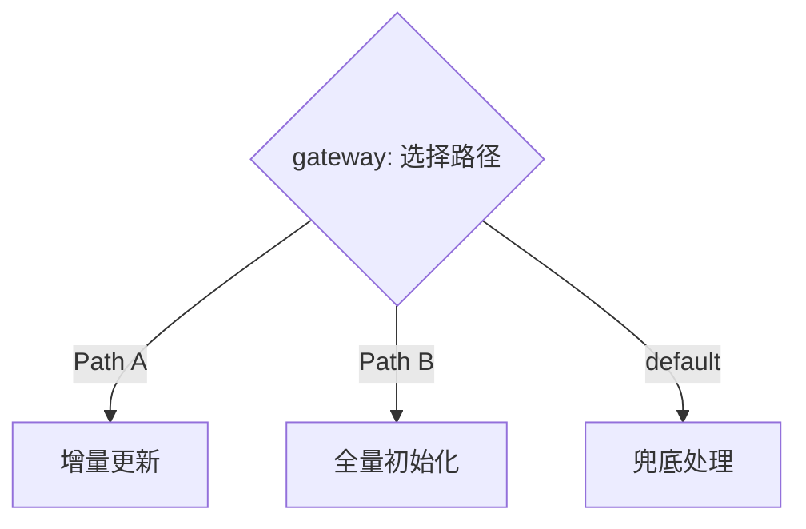

# ai-xml-flow 可视化编辑器设计文档

## 1. 编辑器定位与概述

### 1.1 核心定位

可视化编辑器是 ai-xml-flow 的**可选增值功能**，不是核心依赖。

- **XML 文本格式是权威**：可视化编辑器只是辅助工具，所有功能均可通过文本编辑完成
- **可选而非必需**：用户可以选择性地通过可视化页面查看、编辑或新建 AGENT.xml / SKILL.xml
- **降低设计门槛**：为不熟悉 XML 语法的用户提供直观的拖拽式工作流设计体验

### 1.2 目标用户

| 用户类型 | 使用场景 | 价值 |
|----------|----------|------|
| Agent/Skill 设计者 | 可视化查看复杂工作流结构 | 理解流程走向，降低认知负担 |
| 工作流初学者 | 拖拽组装新的工作流 | 无需记忆 XML 语法即可创建工作流 |
| 调试人员 | 查看工作流执行状态 | 通过颜色/标记直观了解执行进度 |

### 1.3 与核心产出物的关系

```
ai-xml-flow 产出物
├── 标准格式规范（核心）     ← 权威来源
├── 配套 Skill（核心）       ← 文本生成
├── 可视化编辑器（可选）     ← 本文档
│   ├── 查看模式：XML → Blockly + Mermaid
│   ├── 编辑模式：Blockly ↔ XML 双向同步
│   └── 新建模式：Blockly → XML 导出
```

---

## 2. 三种使用模式

### 2.1 模式总览

| 模式 | 输入 | 输出 | 核心操作 |
|------|------|------|----------|
| **查看模式** | AGENT.xml / SKILL.xml | Blockly 积木视图 + Mermaid 流程图 | 只读浏览 |
| **编辑模式** | AGENT.xml / SKILL.xml | 修改后的 XML | 拖拽修改、属性编辑 |
| **新建模式** | 空白画布或模板 | 新的 AGENT.xml / SKILL.xml | 拖拽组装、导出文件 |

### 2.2 查看模式

**目标**：帮助用户直观理解现有工作流的结构和逻辑。

**交互流程**：

```
用户操作                            系统响应
─────────                          ────────
1. 点击「导入 XML」               → 弹出文件选择器 / 粘贴框
2. 选择 AGENT.xml 或 SKILL.xml    → 解析 XML，构建积木树
3. —                              → 画布区渲染 Blockly 积木视图
4. —                              → 预览面板同步渲染 Mermaid 流程图
5. 点击积木                       → 属性面板显示该积木的详细属性（只读）
6. 切换到「Mermaid」标签页        → 显示完整流程图
7. 切换到「XML 源码」标签页       → 显示格式化的 XML 源码（语法高亮）
8. 缩放 / 平移画布                → 调整视图范围
9. 折叠 / 展开序列容器            → 管理视图复杂度
```

**查看模式特性**：
- 所有积木和属性面板均为只读状态
- 支持按状态着色（completed 绿色 / running 蓝色 / failed 红色 / pending 灰色 / skipped 黄色）
- 支持按积木类型筛选显示
- 支持搜索积木（按 ID 或描述）

### 2.3 编辑模式

**目标**：允许用户在可视化界面中修改现有工作流，实时同步到 XML。

**交互流程**：

```
用户操作                            系统响应
─────────                          ────────
1. 导入现有 XML                    → 解析并渲染为可编辑的积木视图
2. 拖拽积木调整顺序               → 实时更新 XML 预览
3. 点击积木打开属性面板           → 显示可编辑的属性字段
4. 修改属性值（如 desc、action）  → 实时同步到 XML 和 Mermaid
5. 从积木面板拖入新积木           → 在指定位置插入新积木
6. 右键积木 → 删除               → 移除积木，更新 XML
7. 拖入 C 型积木包裹已有积木     → 自动调整嵌套关系
8. 点击「验证」按钮               → 运行验证器，显示错误/警告
9. 点击「导出 XML」               → 生成并下载修改后的 XML 文件
```

**编辑模式特性**：
- 实时双向同步：积木操作 → XML 更新 → Mermaid 更新
- 操作可撤销/重做（Undo/Redo，最多 50 步）
- 修改前自动保存快照，支持回退到任意历史状态
- 退出编辑模式时提示保存未提交的更改

### 2.4 新建模式

**目标**：从零开始创建工作流，或基于模板快速搭建。

**交互流程**：

```
用户操作                               系统响应
─────────                             ────────
1. 选择「新建工作流」                → 弹出创建向导
2. 选择类型：AGENT.xml / SKILL.xml   → 设定工作流模板框架
3a. 选择「空白画布」                 → 创建空工作流（仅含 input + output 骨架）
3b. 选择「从模板开始」               → 加载选定模板的积木视图
4. 拖拽积木到画布                    → 从积木面板选择类型并拖入
5. 配置积木属性                      → 在属性面板填写属性
6. 堆叠积木形成执行顺序              → 从上到下自动形成顺序
7. 使用 C 型积木包裹分支/循环体      → 拖入 gateway/loop/error-handler
8. 点击「验证」检查工作流完整性      → 显示验证结果
9. 点击「导出」→ 选择格式           → 生成 AGENT.xml 或 SKILL.xml
```

**新建模式特性**：
- 内置模板库：简单 Skill 模板、复杂 Agent 模板、循环调度模板等
- 积木面板按 BPMN 语义分类，便于查找
- 拖入 input 积木时自动置于画布顶部，拖入 output 积木时自动置于底部
- 自动生成积木 ID（可手动修改）
- 导出时自动插入内联 Schema 注释

---

## 3. Blockly 自定义积木定义规范

### 3.1 积木分类体系

九种积木按 BPMN 语义分为四大类：

| 分类 | 积木类型 | 颜色系 | 说明 |
|------|----------|--------|------|
| **事件类** | `input`, `output` | 🟢 绿色系 (#4CAF50) | 工作流的起点和终点 |
| **活动类** | `task`, `loop` | 🔵 蓝色系 (#2196F3) | 执行动作和循环结构 |
| **控制类** | `gateway`, `event` | 🟡 橙色系 (#FF9800) | 流程控制和事件处理 |
| **保障类** | `error-handler`, `checkpoint`, `rule` | 🔴 红色系 (#F44336) | 错误恢复、里程碑和约束 |

### 3.2 input — 输入积木

| 属性 | 值 |
|------|-----|
| **Blockly 形状** | Hat Block（顶部带"帽子"的起始块） |
| **颜色** | #4CAF50（绿色 120） |
| **BPMN 对应** | Start Event with Data Input |
| **输入槽位** | 无上连接点（起始积木） |
| **输出槽位** | 底部连接点（连接后续积木） |
| **嵌套规则** | 不可嵌套其他积木 |

**属性面板字段**：

| 字段 | 类型 | 必填 | 说明 |
|------|------|------|------|
| `id` | 文本输入 | 是 | 积木唯一标识，默认自动生成 |
| `desc` | 文本输入 | 是 | 积木描述 |
| **参数列表** | 动态表格 | — | 可增删的 field 列表 |
| ↳ `name` | 文本输入 | 是 | 参数名 |
| ↳ `required` | 下拉选择 | 否 | 是否必填（默认 true） |
| ↳ `type` | 下拉选择 | 否 | 类型提示（string/number/array/object/boolean） |
| ↳ `default` | 文本输入 | 否 | 默认值 |
| ↳ `desc` | 文本输入 | 否 | 参数描述 |

**Blockly 积木可视化**：

```
┌──────────────────────────────────┐
│ 🟢 input  [id: I1]              │  ← Hat 顶部
│ ─────────────────────────────── │
│ 📋 source_path  (string) ✱      │  ← 必填参数
│ 📋 platform_id  (string) ✱      │
│ 📋 knowledge_dir (string) ○      │  ← 可选参数（有默认值）
├──────────────────────────────────┤
│              ▼                   │  ← 底部连接点
└──────────────────────────────────┘
```

### 3.3 output — 输出积木

| 属性 | 值 |
|------|-----|
| **Blockly 形状** | Cap Block（底部带"盖子"的结束块） |
| **颜色** | #4CAF50（绿色 120） |
| **BPMN 对应** | End Event with Data Output |
| **输入槽位** | 顶部连接点（连接前序积木） |
| **输出槽位** | 无下连接点（终止积木） |
| **嵌套规则** | 不可嵌套其他积木 |

**属性面板字段**：

| 字段 | 类型 | 必填 | 说明 |
|------|------|------|------|
| `id` | 文本输入 | 是 | 积木唯一标识 |
| `desc` | 文本输入 | 是 | 积木描述 |
| **输出列表** | 动态表格 | — | 可增删的 field 列表 |
| ↳ `name` | 文本输入 | 是 | 输出名 |
| ↳ `from` | 文本输入 | 是 | 数据来源变量引用 |
| ↳ `type` | 下拉选择 | 否 | 类型提示 |
| ↳ `desc` | 文本输入 | 否 | 输出描述 |

### 3.4 task — 任务积木

| 属性 | 值 |
|------|-----|
| **Blockly 形状** | Statement Block（标准语句块） |
| **颜色** | #2196F3（蓝色 210） |
| **BPMN 对应** | Task |
| **输入槽位** | 顶部连接点 |
| **输出槽位** | 底部连接点 |
| **嵌套规则** | 不可嵌套其他积木 |

**属性面板字段**：

| 字段 | 类型 | 必填 | 说明 |
|------|------|------|------|
| `id` | 文本输入 | 是 | 积木唯一标识 |
| `action` | 下拉选择 | 是 | 动作类型：run-skill / run-script / dispatch-to-worker |
| `desc` | 文本输入 | 是 | 积木描述 |
| `timeout` | 数字输入 | 否 | 超时时间（秒） |
| **参数列表** | 动态表格 | — | 根据 action 动态变化 |

**action 字段联动**：

| action 值 | 动态显示字段 |
|-----------|-------------|
| `run-skill` | `skill`（Skill 名称文本输入）+ 通用参数列表 |
| `run-script` | `command`（命令文本输入）+ `arg`（参数列表） |
| `dispatch-to-worker` | `agent`（Worker 名称）+ `skill_path` + `context`（JSON 编辑器） |

**Blockly 积木可视化**：

```
┌──────────────────────────────────┐
│              ▲                   │  ← 顶部连接点
├──────────────────────────────────┤
│ 🔵 task  [id: B1]               │
│ ─────────────────────────────── │
│ 🔧 run-skill                    │
│ 📋 skill: module-matcher        │
│ 📋 source_path: ${source.path}  │
│ 📤 output → matcherResult       │
├──────────────────────────────────┤
│              ▼                   │  ← 底部连接点
└──────────────────────────────────┘
```

### 3.5 gateway — 网关积木

| 属性 | 值 |
|------|-----|
| **Blockly 形状** | C 型 Statement Block（带多个内部插槽） |
| **颜色** | #FF9800（橙色 40） |
| **BPMN 对应** | Gateway（XOR / AND） |
| **输入槽位** | 顶部连接点 |
| **输出槽位** | 底部连接点 |
| **嵌套规则** | 包含多个 `<branch>` 插槽，每个插槽可堆叠积木 |

**属性面板字段**：

| 字段 | 类型 | 必填 | 说明 |
|------|------|------|------|
| `id` | 文本输入 | 是 | 积木唯一标识 |
| `mode` | 下拉选择 | 是 | exclusive / guard / parallel |
| `desc` | 文本输入 | 是 | 积木描述 |
| `test` | 文本输入 | 条件 | 条件表达式（guard 模式必填） |
| `fail-action` | 下拉选择 | 否 | stop / retry / skip / fallback（guard 模式） |
| **分支列表** | 动态列表 | — | 可增删的 branch 列表 |

**分支字段**：

| 字段 | 类型 | 必填 | 说明 |
|------|------|------|------|
| `test` | 文本输入 | 否 | 分支条件（exclusive 模式必填） |
| `name` | 文本输入 | 否 | 分支名称 |
| `default` | 复选框 | 否 | 是否为兜底分支 |

**mode 字段联动**：

| mode 值 | 面板变化 |
|---------|---------|
| `exclusive` | 显示分支条件编辑器，隐藏 `test` 和 `fail-action` |
| `guard` | 显示 `test` 条件输入和 `fail-action` 下拉，隐藏分支编辑器 |
| `parallel` | 隐藏 `test`、`fail-action` 和分支条件，仅显示分支名称 |

**Blockly 积木可视化（exclusive 模式）**：

```
┌──────────────────────────────────┐
│              ▲                   │
├──────────────────────────────────┤
│ 🟡 gateway  [id: G1]            │
│ 🔀 exclusive                    │
│ ┌─── branch: 增量更新 ────────┐ │
│ │ test: ${executionPath}=='A' │ │
│ │  ┌─────────────────────┐    │ │
│ │  │ (可堆叠子积木)       │    │ │
│ │  └─────────────────────┘    │ │
│ └─────────────────────────────┘ │
│ ┌─── branch: 全量初始化 ──────┐ │
│ │ test: ${executionPath}=='B' │ │
│ │  ┌─────────────────────┐    │ │
│ │  │ (可堆叠子积木)       │    │ │
│ │  └─────────────────────┘    │ │
│ └─────────────────────────────┘ │
├──────────────────────────────────┤
│              ▼                   │
└──────────────────────────────────┘
```

### 3.6 loop — 循环积木

| 属性 | 值 |
|------|-----|
| **Blockly 形状** | C 型 Statement Block（单个内部插槽） |
| **颜色** | #2196F3（蓝色 210） |
| **BPMN 对应** | Activity（循环活动） |
| **输入槽位** | 顶部连接点 |
| **输出槽位** | 底部连接点 |
| **嵌套规则** | 循环体内可堆叠任意类型积木 |

**属性面板字段**：

| 字段 | 类型 | 必填 | 说明 |
|------|------|------|------|
| `id` | 文本输入 | 是 | 积木唯一标识 |
| `over` | 文本输入 | 是 | 遍历的集合变量（如 `${tasks}`） |
| `as` | 文本输入 | 是 | 当前项变量名 |
| `where` | 文本输入 | 否 | 过滤条件 |
| `parallel` | 复选框 | 否 | 是否并行执行（默认 false） |
| `max-concurrency` | 数字输入 | 否 | 最大并发数（并行时有效） |
| `desc` | 文本输入 | 是 | 积木描述 |

**Blockly 积木可视化**：

```
┌──────────────────────────────────┐
│              ▲                   │
├──────────────────────────────────┤
│ 🔵 loop  [id: L1]               │
│ 🔄 over: ${tasks}  as: task     │
│ ┌──────────────────────────────┐ │
│ │     (循环体 — 可堆叠子积木)   │ │
│ │                              │ │
│ └──────────────────────────────┘ │
├──────────────────────────────────┤
│              ▼                   │
└──────────────────────────────────┘
```

### 3.7 event — 事件积木

| 属性 | 值 |
|------|-----|
| **Blockly 形状** | Statement Block（标准语句块），confirm 动作时为 C 型 |
| **颜色** | #FF9800（橙色 40） |
| **BPMN 对应** | Event（Intermediate / Boundary） |
| **输入槽位** | 顶部连接点 |
| **输出槽位** | 底部连接点 |
| **嵌套规则** | confirm 动作时包含 on-confirm 和 on-cancel 插槽 |

**属性面板字段**：

| 字段 | 类型 | 必填 | 说明 |
|------|------|------|------|
| `id` | 文本输入 | 是 | 积木唯一标识 |
| `action` | 下拉选择 | 是 | log / confirm / signal |
| `level` | 下拉选择 | 否 | debug / info / warn / error（log 动作） |
| `desc` | 文本输入 | 是 | 积木描述 |
| **内容** | 多行文本 | — | 积木文本内容（支持变量引用） |

**action 字段联动**：

| action 值 | 面板变化 |
|-----------|---------|
| `log` | 显示 `level` 下拉和内容文本框 |
| `confirm` | 显示 `title`、`type`、`preview` 文本框 + on-confirm/on-cancel 子积木区域 |
| `signal` | 显示 `name` 文本框 + 参数列表 |

**日志级别颜色标记**：

| 级别 | 积木边框颜色 | 用途 |
|------|-------------|------|
| `debug` | 灰色 | 调试信息 |
| `info` | 蓝色 | 一般信息 |
| `warn` | 黄色 | 警告信息 |
| `error` | 红色 | 错误信息 |

### 3.8 error-handler — 异常处理积木

| 属性 | 值 |
|------|-----|
| **Blockly 形状** | C 型 Statement Block（三个内部插槽：try / catch / finally） |
| **颜色** | #F44336（红色 0） |
| **BPMN 对应** | Error Handler（自定义扩展） |
| **输入槽位** | 顶部连接点 |
| **输出槽位** | 底部连接点 |
| **嵌套规则** | try 插槽可堆叠任意积木；catch 插槽可多个（支持 error-type 过滤）；finally 插槽可选 |

**属性面板字段**：

| 字段 | 类型 | 必填 | 说明 |
|------|------|------|------|
| `id` | 文本输入 | 是 | 积木唯一标识 |
| `desc` | 文本输入 | 是 | 积木描述 |
| **try 块** | 子画布 | 是 | 正常执行逻辑 |
| **catch 列表** | 动态列表 | 是 | 可增删的 catch 块 |
| ↳ `error-type` | 文本输入 | 否 | 异常类型过滤 |
| **finally 块** | 子画布 | 否 | 最终执行逻辑 |

**Blockly 积木可视化**：

```
┌──────────────────────────────────┐
│              ▲                   │
├──────────────────────────────────┤
│ 🔴 error-handler  [id: EH1]     │
│ ┌─── try ────────────────────┐  │
│ │  (正常执行逻辑子积木)       │  │
│ └────────────────────────────┘  │
│ ┌─── catch [dispatch_timeout] ┐  │
│ │  (超时异常处理子积木)       │  │
│ └────────────────────────────┘  │
│ ┌─── catch [*] ──────────────┐  │
│ │  (兜底异常处理子积木)       │  │
│ └────────────────────────────┘  │
│ ┌─── finally ────────────────┐  │
│ │  (最终执行逻辑子积木)       │  │
│ └────────────────────────────┘  │
├──────────────────────────────────┤
│              ▼                   │
└──────────────────────────────────┘
```

### 3.9 checkpoint — 检查点积木

| 属性 | 值 |
|------|-----|
| **Blockly 形状** | Statement Block（标准语句块） |
| **颜色** | #F44336（红色 0） |
| **BPMN 对应** | 自定义扩展（里程碑标记） |
| **输入槽位** | 顶部连接点 |
| **输出槽位** | 底部连接点 |
| **嵌套规则** | 不可嵌套其他积木 |

**属性面板字段**：

| 字段 | 类型 | 必填 | 说明 |
|------|------|------|------|
| `id` | 文本输入 | 是 | 积木唯一标识 |
| `name` | 文本输入 | 是 | 检查点名称（持久化 key） |
| `desc` | 文本输入 | 是 | 自然语言描述 |
| `file` | 文本输入 | 是 | 持久化目标文件路径 |
| `verify` | 文本输入 | 否 | 验证条件表达式（与 passed 二选一） |
| `passed` | 复选框 | 否 | 直接标记通过（与 verify 二选一） |

**Blockly 积木可视化**：

```
┌──────────────────────────────────┐
│              ▲                   │
├──────────────────────────────────┤
│ 🔴 checkpoint  [id: CP1]        │
│ 🏁 matcher_completed            │
│ 📋 file: ${progressFile}        │
│ ✅ verify: ${tasks.length} > 0  │
├──────────────────────────────────┤
│              ▼                   │
└──────────────────────────────────┘
```

### 3.10 rule — 规则声明积木

| 属性 | 值 |
|------|-----|
| **Blockly 形状** | Statement Block（标准语句块） |
| **颜色** | #F44336（红色 0） |
| **BPMN 对应** | 自定义扩展（约束声明） |
| **输入槽位** | 顶部连接点 |
| **输出槽位** | 底部连接点 |
| **嵌套规则** | 不可嵌套其他积木 |

**属性面板字段**：

| 字段 | 类型 | 必填 | 说明 |
|------|------|------|------|
| `id` | 文本输入 | 是 | 积木唯一标识 |
| `level` | 下拉选择 | 是 | forbidden / mandatory / note |
| `desc` | 文本输入 | 是 | 自然语言描述 |
| `scope` | 文本输入 | 否 | 受管控的 block ID 列表（逗号分隔） |
| **规则条目** | 动态列表 | 是 | 可增删的 field name="text" 列表 |

**级别视觉标记**：

| 级别 | 积木边框 | 图标 | 含义 |
|------|---------|------|------|
| `forbidden` | 红色粗边框 | 🚫 | 禁止事项 |
| `mandatory` | 橙色粗边框 | ⚠️ | 强制事项 |
| `note` | 蓝色虚线边框 | 💡 | 提示事项 |

**Blockly 积木可视化**：

```
┌──────────────────────────────────┐
│              ▲                   │
├──────────────────────────────────┤
│ 🔴 rule  [id: R1]               │
│ 🚫 forbidden — Phase 4 内容约束  │
│ ─────────────────────────────── │
│ ❌ DO NOT generate Sub-PRDs     │
│ ❌ DO NOT fabricate timestamps  │
├──────────────────────────────────┤
│              ▼                   │
└──────────────────────────────────┘
```

### 3.11 积木形状速查表

| 积木类型 | 形状 | 颜色 | 连接方式 | 是否 C 型 |
|----------|------|------|----------|-----------|
| `input` | Hat Block | 🟢 #4CAF50 | 仅底部输出 | 否 |
| `output` | Cap Block | 🟢 #4CAF50 | 仅顶部输入 | 否 |
| `task` | Statement | 🔵 #2196F3 | 顶部+底部 | 否 |
| `gateway` | C-Statement | 🟡 #FF9800 | 顶部+底部 | 是（多插槽） |
| `loop` | C-Statement | 🔵 #2196F3 | 顶部+底部 | 是（单插槽） |
| `event` | Statement/C | 🟡 #FF9800 | 顶部+底部 | confirm 时是 |
| `error-handler` | C-Statement | 🔴 #F44336 | 顶部+底部 | 是（三插槽） |
| `checkpoint` | Statement | 🔴 #F44336 | 顶部+底部 | 否 |
| `rule` | Statement | 🔴 #F44336 | 顶部+底部 | 否 |

---

## 4. 积木与 XML 的双向映射规则

### 4.1 Blockly → XML 转换

#### 4.1.1 转换流程

```
Blockly 工作区
    │
    ▼
遍历积木树（深度优先）
    │
    ▼
每个积木 → 生成对应 XML 元素
    │
    ▼
拼装完整 XML 文档
    │
    ▼
插入内联 Schema 注释
    │
    ▼
格式化输出（缩进、换行）
```

#### 4.1.2 转换规则

**基本积木 → XML 元素**：

```
Blockly 积木                          XML 输出
─────────────                        ─────────
Statement Block (type="task")   →   <block type="task" id="B1" action="run-skill" desc="...">
                                       <field name="skill">...</field>
                                     </block>

Hat Block (type="input")        →   <block type="input" id="I1" desc="...">
                                       <field name="source_path" required="true" type="string"/>
                                     </block>

C 型 Block (type="loop")        →   <block type="loop" id="L1" over="${tasks}" as="task" desc="...">
                                       <!-- 循环体子积木转换 -->
                                     </block>
```

**积木堆叠顺序 → XML 子节点顺序**：

Blockly 积木从上到下堆叠，直接映射为 XML 中同级 `<block>` 元素的顺序：

```xml
<sequence id="S1">
  <!-- 画布中从上到下第 1 个积木 -->
  <block type="task" id="B1" ...>...</block>
  <!-- 画布中从上到下第 2 个积木 -->
  <block type="task" id="B2" ...>...</block>
  <!-- 画布中从上到下第 3 个积木 -->
  <block type="event" id="E1" ...>...</block>
</sequence>
```

**C 型积木 → XML 嵌套结构**：

```
┌─ loop ─────────────────────┐       <block type="loop" id="L1" over="${tasks}" as="task">
│  ┌─ task ───────────────┐  │  →      <block type="task" action="dispatch-to-worker" ...>
│  │  dispatch-to-worker   │  │  →        <field name="agent">...</field>
│  └──────────────────────┘  │  →      </block>
│  ┌─ task ───────────────┐  │  →      <block type="task" action="run-script" ...>
│  │  run-script           │  │  →        <field name="command">...</field>
│  └──────────────────────┘  │  →      </block>
└────────────────────────────┘       </block>
```

**gateway 分支 → XML branch 元素**：

```
┌─ gateway (exclusive) ─────────────────┐
│  ┌─ branch: 增量更新 ──────────────┐  │
│  │  test: ${executionPath} == 'A'   │  │  →  <branch test="${executionPath} == 'A'" name="增量更新">
│  │  ┌─ event (log) ──────────────┐ │  │  →    <block type="event" action="log" ...>...</block>
│  │  └────────────────────────────┘ │  │  →  </branch>
│  └─────────────────────────────────┘  │
│  ┌─ branch: 全量初始化 ────────────┐  │
│  │  default: true                   │  │  →  <branch default="true" name="全量初始化">
│  │  ...                             │  │  →  </branch>
│  └─────────────────────────────────┘  │
└───────────────────────────────────────┘
```

**error-handler → XML try/catch/finally**：

```
┌─ error-handler ──────────────────┐
│  ┌─ try ──────────────────────┐  │  →  <try>
│  │  (子积木)                   │  │  →    <block ...>...</block>
│  └────────────────────────────┘  │  →  </try>
│  ┌─ catch [timeout] ──────────┐  │  →  <catch error-type="dispatch_timeout">
│  │  (子积木)                   │  │  →    <block ...>...</block>
│  └────────────────────────────┘  │  →  </catch>
│  ┌─ finally ──────────────────┐  │  →  <finally>
│  │  (子积木)                   │  │  →    <block ...>...</block>
│  └────────────────────────────┘  │  →  </finally>
└──────────────────────────────────┘
```

#### 4.1.3 ID 生成策略

新建积木时自动生成 ID，规则如下：

| 积木类型 | ID 前缀 | 示例 |
|----------|---------|------|
| input | `I` | I1, I2 |
| output | `O` | O1, O2 |
| task | `B` | B1, B2, B3 |
| gateway | `G` | G1, G2 |
| loop | `L` | L1, L2 |
| event | `E` | E1, E2 |
| error-handler | `EH` | EH1, EH2 |
| checkpoint | `CP` | CP1, CP2 |
| rule | `R` | R1, R2 |

ID 编号自动递增，用户可在属性面板中手动修改。导出前自动检测 ID 唯一性。

### 4.2 XML → Blockly 转换

#### 4.2.1 转换流程

```
XML 文件
    │
    ▼
XML Parser（@ai-xml-flow/core parser）
    │
    ▼
结构化 JSON（积木树）
    │
    ▼
递归遍历 JSON 构建 Blockly 积木
    │
    ▼
设置积木属性和字段
    │
    ▼
建立积木间的连接关系
    │
    ▼
渲染到 Blockly 工作区
```

#### 4.2.2 转换规则

**XML 元素 → Blockly 积木**：

| XML 元素 | Blockly 操作 |
|----------|-------------|
| `<block type="input">` | 创建 Hat Block，设置 desc 和 field 列表 |
| `<block type="output">` | 创建 Cap Block，设置 desc 和 field 列表 |
| `<block type="task">` | 创建 Statement Block，设置 action、desc、field 列表 |
| `<block type="gateway">` | 创建 C-Statement Block，根据 mode 设置分支 |
| `<block type="loop">` | 创建 C-Statement Block，设置 over、as、where |
| `<block type="event">` | 创建 Statement/C-Block，根据 action 设置内容 |
| `<block type="error-handler">` | 创建 C-Statement Block，构建 try/catch/finally |
| `<block type="checkpoint">` | 创建 Statement Block，设置 name、verify |
| `<block type="rule">` | 创建 Statement Block，设置 level、text 列表 |
| `<sequence>` | 创建分组容器（背景色区分） |
| `<branch>` | 在 gateway 内创建子插槽 |
| `<field>` | 添加到属性面板的参数列表 |

**积木连接重建**：

```
<sequence id="S1">
  <block type="task" id="B1" .../>
  <block type="task" id="B2" .../>
  <block type="event" id="E1" .../>
</sequence>

→ B1 的底部连接点 → B2 的顶部连接点
→ B2 的底部连接点 → E1 的顶部连接点
```

**状态着色**：

导入时读取每个积木的 `status` 属性，在积木上叠加状态色带：

| status | 色带颜色 | 位置 |
|--------|---------|------|
| `completed` | 🟢 绿色 | 积木左侧竖条 |
| `running` | 🔵 蓝色 | 积木左侧竖条 + 脉冲动画 |
| `failed` | 🔴 红色 | 积木左侧竖条 + 错误图标 |
| `pending` | ⚪ 灰色 | 积木左侧竖条 |
| `skipped` | 🟡 黄色 | 积木左侧竖条 |

### 4.3 实时同步机制

#### 4.3.1 同步架构

```
┌─────────────────────────────────────────────────┐
│                  同步引擎                         │
│                                                   │
│  ┌──────────┐    事件驱动    ┌──────────────────┐ │
│  │  Blockly  │ ────────────→ │  XML Model       │ │
│  │  工作区   │ ←──────────── │  (内存中的 AST)   │ │
│  └──────────┘    模型更新    └──────────────────┘ │
│       │                           │               │
│       │                           │               │
│       ▼                           ▼               │
│  ┌──────────┐              ┌──────────────────┐  │
│  │  积木视图  │              │  XML 源码预览     │  │
│  │  (实时)   │              │  (实时)           │  │
│  └──────────┘              └──────────────────┘  │
│                                   │               │
│                                   ▼               │
│                            ┌──────────────────┐  │
│                            │  Mermaid 预览     │  │
│                            │  (防抖 500ms)     │  │
│                            └──────────────────┘  │
└─────────────────────────────────────────────────┘
```

#### 4.3.2 同步策略

| 源 | 目标 | 触发方式 | 延迟 | 说明 |
|----|------|----------|------|------|
| Blockly → XML Model | 事件监听 | 即时 | 监听 Blockly 的 `change` 事件 |
| XML Model → XML 源码 | 模型变更 | 即时 | AST 序列化为 XML 字符串 |
| XML Model → Mermaid | 模型变更 | 防抖 500ms | 避免频繁重新渲染 |
| XML Model → Blockly | 外部导入 | 一次性 | 导入 XML 文件时全量重建 |

#### 4.3.3 冲突处理

编辑模式下，用户可能在 Blockly 画布和 XML 源码面板同时编辑：

- **以最后修改为准**：采用 Last-Write-Wins 策略
- **XML 源码编辑 → 解析 → 更新 Blockly**：源码面板失焦时触发解析
- **Blockly 编辑 → 更新 XML 源码**：实时更新，源码面板只读锁定（当前积木编辑期间）
- **解析失败时回退**：XML 源码语法错误时，保持 Blockly 不变，显示错误提示

---

## 5. 编辑器组件架构

### 5.1 整体布局

```
┌───────────────────────────────────────────────────────────────────┐
│  工具栏：模式切换 | 文件操作 | 验证 | 撤销/重做 | 导出           │
├──────────┬──────────────────────────────────┬─────────────────────┤
│          │                                  │                     │
│  积木面板  │         画布区                    │    属性/预览面板     │
│          │                                  │                     │
│ ┌──────┐ │  ┌──────────────────────────┐   │  ┌───────────────┐  │
│ │事件类 │ │  │                          │   │  │ 属性面板       │  │
│ │ input │ │  │    Blockly Workspace     │   │  │ (积木属性编辑) │  │
│ │output │ │  │                          │   │  └───────────────┘  │
│ ├──────┤ │  │    (WorkflowCanvas)       │   │  ┌───────────────┐  │
│ │活动类 │ │  │                          │   │  │ 预览面板       │  │
│ │ task  │ │  │                          │   │  │ [XML] [Mermaid]│  │
│ │ loop  │ │  └──────────────────────────┘   │  └───────────────┘  │
│ ├──────┤ │                                  │                     │
│ │控制类 │ │                                  │                     │
│ │gateway│ │                                  │                     │
│ │ event │ │                                  │                     │
│ ├──────┤ │                                  │                     │
│ │保障类 │ │                                  │                     │
│ │  eh   │ │                                  │                     │
│ │  cp   │ │                                  │                     │
│ │ rule  │ │                                  │                     │
│ └──────┘ │                                  │                     │
│          │                                  │                     │
├──────────┴──────────────────────────────────┴─────────────────────┤
│  状态栏：工作流 ID | 积木总数 | 状态统计 | 当前模式               │
└───────────────────────────────────────────────────────────────────┘
```

### 5.2 WorkflowCanvas（画布区）

**职责**：承载 Blockly 工作区，管理积木的拖拽、堆叠和渲染。

**核心功能**：
- Blockly Workspace 初始化和配置
- 积木拖拽交互（从积木面板拖入、画布内移动、调整嵌套）
- 画布缩放和平移
- 序列容器的折叠/展开
- 积木选中状态管理
- 状态色带渲染（completed/running/failed 等）

**关键配置**：

```typescript
interface CanvasConfig {
  // Blockly 工作区配置
  gridSpacing: number;        // 网格间距，默认 20
  snapToGrid: boolean;        // 吸附网格，默认 true
  zoomControls: boolean;      // 缩放控件，默认 true
  trashcan: boolean;          // 垃圾桶，默认 true
  maxBlocks: number;          // 最大积木数，默认 Infinity
  readOnly: boolean;          // 只读模式（查看模式）
  
  // 自定义渲染
  showStatusBand: boolean;    // 显示状态色带
  showSequenceGroup: boolean; // 显示序列分组背景
  compactMode: boolean;       // 紧凑模式（折叠描述文字）
}
```

### 5.3 BlockPalette（积木面板）

**职责**：按分类展示可用的积木类型，支持拖拽到画布。

**分类结构**：

```
📦 积木面板
├── 🟢 事件类
│   ├── input（输入参数）
│   └── output（输出结果）
├── 🔵 活动类
│   ├── task（执行任务）
│   │   ├── 🔧 run-skill
│   │   ├── 💻 run-script
│   │   └── 👥 dispatch-to-worker
│   └── loop（循环遍历）
├── 🟡 控制类
│   ├── gateway（条件网关）
│   │   ├── 🔀 exclusive
│   │   ├── 🛡️ guard
│   │   └── ⚡ parallel
│   └── event（事件）
│       ├── 📝 log
│       ├── ❓ confirm
│       └── 📢 signal
└── 🔴 保障类
    ├── error-handler（异常处理）
    ├── checkpoint（检查点）
    └── rule（规则声明）
        ├── 🚫 forbidden
        ├── ⚠️ mandatory
        └── 💡 note
```

**交互特性**：
- 拖拽积木到画布自动放置
- 点击积木显示简要说明 Tooltip
- 搜索框快速定位积木类型
- 最近使用的积木置顶显示

### 5.4 PropertiesPanel（属性面板）

**职责**：显示和编辑选中积木的属性和字段。

**面板结构**：

```
┌────────────────────────────┐
│ 📋 属性面板                 │
│ ────────────────────────── │
│ 积木类型: task              │  ← 只读标识
│ 积木 ID:  [B1___________]  │  ← 可编辑
│ ────────────────────────── │
│ 基本属性                    │
│  action:  [run-skill  ▼]   │  ← 下拉选择
│  desc:    [执行模块匹配___] │  ← 文本输入
│  timeout: [___________]    │  ← 数字输入
│ ────────────────────────── │
│ 参数列表                    │
│ ┌──────────────────────┐   │
│ │ name      │ value     │   │  ← 动态表格
│ │ skill     │ matcher   │   │
│ │ source    │ ${path}   │   │
│ │ output→   │ result    │   │
│ └──────────────────────┘   │
│ [+ 添加参数]  [🗑️ 删除]    │
│ ────────────────────────── │
│ 变量引用检查                │
│ ✅ ${source.path} — 已声明  │
│ ⚠️ ${result.count} — 未声明 │
└────────────────────────────┘
```

**属性面板特性**：
- 根据积木类型动态生成字段
- action/mode 等枚举字段使用下拉选择
- 变量引用实时校验（引用未声明变量时警告）
- 支持 JSON 编辑器（用于 dispatch context 等复杂字段）
- 修改即时同步到画布和 XML

### 5.5 PreviewPanel（预览面板）

**职责**：实时显示 XML 源码和 Mermaid 流程图。

**双标签页设计**：

```
┌────────────────────────────┐
│ [XML 源码] [Mermaid 流程图] │  ← 标签切换
│ ────────────────────────── │
│                            │
│  XML 源码视图：             │
│  ┌──────────────────────┐  │
│  │ <workflow id="..."   │  │  ← 语法高亮
│  │   status="pending">  │  │
│  │   <block type="input"│  │  ← 行号显示
│  │     id="I1"          │  │
│  │     desc="...">      │  │
│  │     <field name="..."│  │
│  │       required="true"│  │
│  │       type="string"/>│  │
│  │   </block>           │  │
│  │ </workflow>          │  │
│  └──────────────────────┘  │
│  [📋 复制] [⬇️ 下载]       │
│                            │
│  Mermaid 视图：             │
│  ┌──────────────────────┐  │
│  │ graph TD             │  │  ← 渲染后的流程图
│  │   Start → S1 → G1   │  │
│  │   G1 →|A| PathA     │  │
│  │   G1 →|B| PathB     │  │
│  └──────────────────────┘  │
│  [⬇️ 导出 SVG] [⬇️ 导出 MD]│
└────────────────────────────┘
```

**XML 源码视图特性**：
- 语法高亮（标签、属性、值、注释分色）
- 行号显示
- 点击源码行跳转到对应积木（高亮选中）
- 编辑模式下支持直接编辑 XML 源码
- 复制和下载功能

**Mermaid 流程图视图特性**：
- 自动从 XML Model 生成 Mermaid 语法
- 使用 Mermaid.js 渲染为 SVG
- 支持导出为 SVG 文件或 Markdown
- 点击流程图节点跳转到对应积木
- 防抖 500ms 更新（避免频繁重渲染）

### 5.6 组件间通信机制

#### 5.6.1 状态管理

采用 React Context + useReducer 管理全局状态：

```typescript
interface EditorState {
  // 模式
  mode: 'view' | 'edit' | 'create';
  
  // 工作流模型
  workflowModel: WorkflowModel | null;
  
  // 选中的积木
  selectedBlockId: string | null;
  
  // 画布状态
  canvasZoom: number;
  canvasScroll: { x: number; y: number };
  
  // 历史记录（撤销/重做）
  undoStack: WorkflowModel[];
  redoStack: WorkflowModel[];
  
  // 验证结果
  validationResults: ValidationResult[];
  
  // 面板状态
  activePreviewTab: 'xml' | 'mermaid';
  propertiesCollapsed: boolean;
}
```

#### 5.6.2 事件流

```
BlockPalette                    WorkflowCanvas
    │                               │
    │ drag-start                    │ block-change
    │                               │ block-select
    │                               │ block-delete
    │         ┌──────────┐          │
    │────────→│  Editor  │←─────────│
    │         │  Store   │          │
    │←────────│(Context) │─────────→│
    │         └──────────┘          │
    │                               │
    │         PropertiesPanel       PreviewPanel
    │             │                     │
    │             │ field-change        │ xml-click
    │             │ attribute-change    │ node-click
    │             │                     │
    │             └─────────────────────┘
```

**核心事件**：

| 事件 | 源 | 目标 | 数据 |
|------|-----|------|------|
| `BLOCK_ADD` | BlockPalette / Canvas | Store | 新积木的类型和位置 |
| `BLOCK_REMOVE` | Canvas | Store | 被删除积木的 ID |
| `BLOCK_UPDATE` | PropertiesPanel | Store | 修改的属性键值对 |
| `BLOCK_SELECT` | Canvas | PropertiesPanel | 选中的积木 ID |
| `BLOCK_REORDER` | Canvas | Store | 积木新位置 |
| `WORKFLOW_IMPORT` | 工具栏 | Store | 导入的 XML 内容 |
| `WORKFLOW_EXPORT` | 工具栏 | Store | 导出格式 |
| `VALIDATE` | 工具栏 | Store | — |
| `UNDO` / `REDO` | 工具栏 | Store | — |

### 5.7 技术栈

| 技术 | 版本 | 用途 |
|------|------|------|
| React | 18.x | UI 框架 |
| Blockly | 10.x | 可视化积木引擎 |
| Ant Design | 5.x | UI 组件库 |
| Vite | 5.x | 构建工具 |
| @ai-xml-flow/core | — | XML 解析/验证/渲染 |
| Mermaid.js | 10.x | 流程图渲染 |
| Monaco Editor | 0.45+ | XML 源码编辑器（可选） |
| Zustand | 4.x | 状态管理（替代 Context，更轻量） |
| Immer | 10.x | 不可变数据更新 |

---

## 6. 嵌入式部署方案

### 6.1 部署模式

#### 6.1.1 独立部署模式

编辑器作为独立 Web 应用运行，用户通过浏览器访问。

```
┌──────────────────────────────────┐
│        ai-xml-flow-editor         │
│         (独立 Web 应用)            │
│                                    │
│  ┌────────────────────────────┐  │
│  │     完整编辑器界面           │  │
│  │  (工具栏 + 画布 + 面板)     │  │
│  └────────────────────────────┘  │
│                                    │
│  Vite Dev Server / Nginx / CDN    │
└──────────────────────────────────┘
```

**适用场景**：独立使用、演示、教学

**访问方式**：`https://editor.ai-xml-flow.dev`

#### 6.1.2 嵌入模式

编辑器作为 Web Component 嵌入到第三方应用中。

```
┌──────────────────────────────────────────┐
│            第三方应用                      │
│                                            │
│  ┌──────────────────────────────────────┐ │
│  │  <ai-xml-flow-editor                  │ │
│  │    mode="edit"                        │ │
│  │    xml-source="..."                   │ │
│  │    on-export="handleExport"           │ │
│  │  />                                   │ │
│  │                                       │ │
│  │  ┌─────────────────────────────────┐ │ │
│  │  │     编辑器渲染区域               │ │ │
│  │  └─────────────────────────────────┘ │ │
│  └──────────────────────────────────────┘ │
│                                            │
│  应用自身的 UI 框架和路由                    │
└──────────────────────────────────────────┘
```

**适用场景**：IDE 插件、平台管理后台、文档系统

### 6.2 Web Component 封装

#### 6.2.1 自定义元素定义

```html
<ai-xml-flow-editor
  mode="view | edit | create"
  xml-source="string (XML 内容)"
  xml-url="string (XML 文件 URL)"
  locale="zh-CN | en-US | ..."
  theme="light | dark"
  readonly="boolean"
  hide-palette="boolean"
  hide-preview="boolean"
  on-import="function"
  on-export="function"
  on-validate="function"
  on-change="function"
></ai-xml-flow-editor>
```

#### 6.2.2 属性说明

| 属性 | 类型 | 默认值 | 说明 |
|------|------|--------|------|
| `mode` | string | `'view'` | 编辑器模式：view / edit / create |
| `xml-source` | string | `''` | 直接传入的 XML 内容 |
| `xml-url` | string | `''` | XML 文件的 URL（fetch 加载） |
| `locale` | string | `'zh-CN'` | 界面语言 |
| `theme` | string | `'light'` | 主题：light / dark |
| `readonly` | boolean | `false` | 是否只读（覆盖 mode 设置） |
| `hide-palette` | boolean | `false` | 隐藏积木面板 |
| `hide-preview` | boolean | `false` | 隐藏预览面板 |

#### 6.2.3 事件接口

| 事件名 | 触发时机 | 事件数据 |
|--------|---------|----------|
| `import` | 导入 XML 成功 | `{ xml: string, workflowId: string }` |
| `export` | 导出 XML | `{ xml: string, format: 'agent' \| 'skill' }` |
| `validate` | 验证完成 | `{ valid: boolean, errors: [], warnings: [] }` |
| `change` | 工作流内容变更 | `{ xml: string, changedBlockId: string }` |
| `select` | 积木被选中 | `{ blockId: string, blockType: string }` |
| `error` | 发生错误 | `{ message: string, code: string }` |

### 6.3 API 接口

#### 6.3.1 编程式 API

```typescript
interface AiXmlFlowEditor extends HTMLElement {
  // 导入 XML
  importXml(xml: string): Promise<ImportResult>;
  
  // 通过 URL 导入
  importFromUrl(url: string): Promise<ImportResult>;
  
  // 导出为 XML
  exportXml(format?: 'agent' | 'skill'): string;
  
  // 导出为 Mermaid
  exportMermaid(): string;
  
  // 验证当前工作流
  validate(): ValidationResult;
  
  // 获取/设置模式
  getMode(): EditorMode;
  setMode(mode: EditorMode): void;
  
  // 获取工作流 JSON
  getWorkflowModel(): WorkflowModel;
  
  // 选中指定积木
  selectBlock(blockId: string): void;
  
  // 获取当前 XML（不含状态属性）
  getCleanXml(): string;
  
  // 重置为空白画布
  reset(): void;
  
  // 撤销/重做
  undo(): void;
  redo(): void;
}
```

#### 6.3.2 类型定义

```typescript
interface ImportResult {
  success: boolean;
  workflowId: string;
  blockCount: number;
  sequenceCount: number;
  errors: string[];
}

interface ValidationResult {
  valid: boolean;
  errors: ValidationIssue[];
  warnings: ValidationIssue[];
}

interface ValidationIssue {
  type: string;
  blockId?: string;
  attribute?: string;
  message: string;
}

type EditorMode = 'view' | 'edit' | 'create';
```

### 6.4 构建与打包

#### 6.4.1 独立应用构建

```bash
# 开发
cd packages/editor
npm run dev          # Vite dev server, http://localhost:5173

# 构建
npm run build        # 输出到 dist/

# 预览构建结果
npm run preview
```

#### 6.4.2 Web Component 构建

```bash
# 构建 Web Component
npm run build:wc     # 输出 ai-xml-flow-editor.js
```

**产物**：

```
dist/
├── ai-xml-flow-editor.js      # Web Component 入口（含样式）
├── ai-xml-flow-editor.css     # 可选：提取的样式文件
└── ai-xml-flow-editor.d.ts    # TypeScript 类型声明
```

**使用方式**：

```html
<!-- 第三方应用中引入 -->
<script src="https://unpkg.com/@ai-xml-flow/editor/dist/ai-xml-flow-editor.js"></script>

<ai-xml-flow-editor
  mode="edit"
  xml-source="<workflow id='demo'>...</workflow>"
></ai-xml-flow-editor>

<script>
  const editor = document.querySelector('ai-xml-flow-editor');
  editor.addEventListener('export', (e) => {
    console.log('导出的 XML:', e.detail.xml);
  });
</script>
```

#### 6.4.3 npm 包发布

```
@ai-xml-flow/editor
├── dist/
│   ├── ai-xml-flow-editor.js       # Web Component 产物
│   ├── ai-xml-flow-editor.css
│   └── ai-xml-flow-editor.d.ts
├── lib/
│   ├── index.js                     # React 组件入口
│   ├── WorkflowCanvas.js
│   ├── BlockPalette.js
│   ├── PropertiesPanel.js
│   ├── PreviewPanel.js
│   └── types.d.ts
└── package.json
```

**两种消费方式**：

```javascript
// 方式 1：作为 React 组件使用
import { Editor } from '@ai-xml-flow/editor';

function App() {
  return <Editor mode="edit" xmlSource={xmlString} onExport={handleExport} />;
}

// 方式 2：作为 Web Component 使用
import '@ai-xml-flow/editor/wc';
```

---

## 附录 A：Mermaid 渲染规则

### 积木 → Mermaid 节点映射

| 积木类型 | Mermaid 节点形状 | 示例 |
|----------|-----------------|------|
| `input` | `([input: ...])` 圆角矩形 | `I1([input: 工作流输入])` |
| `output` | `([output: ...])` 圆角矩形 | `O1([output: 工作流输出])` |
| `task` | `[task: ...]` 矩形 | `B1[task: 模块匹配]` |
| `gateway` | `{gateway: ...}` 菱形 | `G1{gateway: 选择路径}` |
| `loop` | `[[loop: ...]]` 子图 | `L1[[loop: 遍历任务]]` |
| `event` | `(event: ...)` 圆角 | `E1(event: 记录进度)` |
| `error-handler` | `{{eh: ...}}` 六边形 | `EH1{{eh: 异常处理}}` |
| `checkpoint` | `[/cp: .../]` 平行四边形 | `CP1[/cp: 匹配完成/]` |
| `rule` | `>rule: ...]` 旗帜形 | `R1>rule: 内容约束]` |

### 分支连线标注



---

## 附录 B：验证规则清单

| 验证项 | 对应积木 | 级别 | 说明 |
|--------|---------|------|------|
| input 位置 | input | error | 必须为工作流第一个 block |
| output 位置 | output | error | 必须为工作流最后一个 block |
| 必填属性检查 | 所有 | error | id、type、desc 等必填属性 |
| action 有效性 | task | error | action 必须为 run-skill/run-script/dispatch-to-worker |
| mode 有效性 | gateway | error | mode 必须为 exclusive/guard/parallel |
| guard 必须有 test | gateway | error | guard 模式必须填写 test 属性 |
| over 必须为变量引用 | loop | error | over 必须是 `${...}` 格式 |
| level 有效性 | rule | error | level 必须为 forbidden/mandatory/note |
| 积木 ID 唯一性 | 所有 | error | 同一工作流内 ID 不可重复 |
| field name 必填 | field | error | 每个 field 必须有 name 属性 |
| 内联 Schema 完整性 | workflow | error | 顶部必须包含 Block Types 注释 |
| 变量引用有效性 | 所有 | warning | `${var}` 引用的变量是否已声明 |
| checkpoint 完整性 | checkpoint | warning | 建议包含 verify 条件 |
| rule 就近声明 | rule | warning | 建议 rule 放在受管控步骤前面 |
