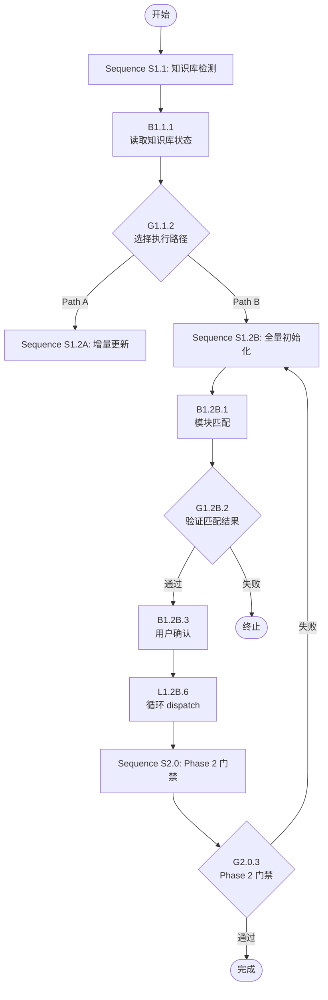

# XML 工作流方案设计文档（Blockly 积木体系）

## 1. 概述

### 1.1 为什么要引入 XML 工作流

speccrew 项目当前的 Agent 和 Skill 定义采用纯 Markdown 格式。在复杂工作流中（如 PM Agent 的 Phase 1 知识库初始化），存在以下痛点：

| 痛点 | 具体表现 | 影响 |
|------|---------|------|
| **层次不清** | 步骤嵌套深时，LLM 按 `##` 标题跳转忽略 `####` 嵌套步骤 | 跳过关键子步骤 |
| **节点类型过多** | 旧方案定义 14 种节点类型，记忆成本高，LLM 易混淆 | 误用节点类型 |
| **连线复杂** | 传统流程图需定义连线关系，增加理解负担 | 结构混乱 |
| **条件分支模糊** | Path A/B 靠自然语言描述，LLM 理解不稳定 | 走错分支 |
| **进度追踪分离** | 依赖外部 JSON（DISPATCH-PROGRESS.json），与工作流定义分离 | 状态不一致 |

### 1.2 设计理念

本方案采用 **Blockly 积木模型 + BPMN 语义分类** 的混合设计：

#### Blockly 积木模型

借鉴 Google Blockly 可视化编程的核心理念：

- **统一积木形态**：所有操作统一为 `<block>` 积木，无需记忆 14 种节点类型
- **堆叠即顺序**：积木从上到下堆叠，自然形成执行顺序，无显式连线
- **C 型积木包裹**：分支、循环、异常处理使用 C 型积木包裹内部内容
- **字段即参数**：所有参数统一为 `<field>` 子节点，语法一致

#### BPMN 语义分类

积木的 `type` 属性借鉴 BPMN 2.0 术语，保留业务流程语义：

| BPMN 概念 | 积木类型 | 用途 |
|-----------|----------|------|
| Start Event | `input` | 工作流输入参数（调用者提供） |
| End Event | `output` | 工作流输出结果（执行完成返回） |
| Task | `task` | 执行动作（调用 Skill/脚本/Worker） |
| Gateway | `gateway` | 条件分支/门禁检查 |
| Event | `event` | 日志/确认/信号 |
| Activity | `loop` | 循环遍历 |
| Error Handler | `error-handler` | 异常处理 |

#### LLM 自解释性

每个工作流顶部包含内联 Schema 注释，帮助 LLM 理解积木类型：

```xml
<workflow id="example" status="pending">
  <!--
  == Block Types ==
  input   : 工作流输入参数，调用者必须提供（required=必填, default=默认值）
  output  : 工作流输出结果，执行完成后返回（from=数据来源变量）
  task    : 执行动作（action: run-skill | run-script | dispatch-to-worker）
  gateway : 条件分支/门禁（mode: exclusive=走第一个匹配 | guard=不通过则停止 | parallel=全部并行）
  loop    : 遍历集合逐个执行（over=集合, as=当前项）
  event   : 日志/确认/信号（action: log | confirm | signal）
  error-handler : 异常处理（try > catch > finally）
  checkpoint : 持久化里程碑（name=检查点名, verify=验证条件）
  rule    : 约束声明（level: forbidden=禁止 | mandatory=强制 | note=提示, 就近放在受管控步骤前）
  == Field ==
  field   : 参数/变量/输出（name=参数名, var=绑定变量, value=值）
  -->
  ...
</workflow>
```

### 1.3 设计目标

1. **降低 LLM 认知负担**：统一的积木形态 + 内联 Schema，LLM 无需查阅外部文档
2. **提升执行准确率**：结构化 XML 标签让 LLM 明确识别执行边界
3. **人类可维护性**：Markdown 与 XML 混合，保留人类可读性
4. **进度可追踪**：状态直接嵌入积木属性，与工作流定义统一

### 1.4 混合模式

采用 **Markdown + XML** 混合模式：

- **Markdown**：负责说明描述、业务背景、约束规则
- **XML**：负责执行逻辑、控制流、状态管理

```markdown
## Phase 1: 知识库初始化

> 本阶段负责检测和初始化知识库。根据检测结果选择 Path A（增量）或 Path B（全量）。

<workflow id="phase-1-knowledge-init" status="pending">
  <!--
  == Block Types ==
  input   : 工作流输入参数
  output  : 工作流输出结果
  task    : 执行动作
  gateway : 条件分支/门禁
  loop    : 循环遍历
  event   : 日志/确认
  error-handler : 异常处理
  checkpoint : 持久化里程碑
  rule    : 约束声明
  -->
  <block type="input" id="I1" desc="工作流输入参数">
    <field name="workspace" required="true" type="string" desc="工作空间根目录"/>
    <field name="knowledgeDir" required="false" type="string" default="${workspace}/knowledges/bizs" desc="知识库目录"/>
  </block>
  <sequence id="S1" name="知识库检测">
    <block type="task" id="B1" action="run-script" desc="扫描知识库目录结构">
      <field name="command">node scripts/check-knowledge.js --dir ./knowledges</field>
      <field name="output" var="knowledgeStatus"/>
    </block>
    <block type="gateway" id="G1" mode="exclusive" desc="根据检测结果选择执行路径">
      <branch test="${knowledgeStatus.exists} == true" name="增量更新">
        <block type="event" action="log" level="info" desc="记录路径选择">知识库已存在，进入 Path A</block>
        <field name="executionPath" value="A"/>
      </branch>
      <branch default="true" name="全量初始化">
        <block type="event" action="log" level="info" desc="记录路径选择">知识库不存在，进入 Path B</block>
        <field name="executionPath" value="B"/>
      </branch>
    </block>
  </sequence>
</workflow>
```

### 1.5 适用范围

| 场景 | 是否使用 XML 工作流 | 原因 |
|------|-------------------|------|
| Agent 定义中的复杂工作流段落 | ✅ 推荐 | 多 Phase、多分支、循环执行 |
| Skill 中的多步骤执行流程 | ✅ 推荐 | 需要追踪执行状态 |
| 简单 3 步以内的 Skill | ❌ 不需要 | 增加复杂度无收益 |
| 单次执行无需追踪的任务 | ❌ 不需要 | 清单开销大于收益 |

---

## 2. 积木类型定义

### 2.1 工作流容器 `<workflow>`

顶层容器，包含所有执行积木。

**属性列表：**

| 属性 | 类型 | 必填 | 说明 |
|------|------|------|------|
| `id` | string | 是 | 工作流唯一标识 |
| `status` | enum | 否 | 执行状态：pending / running / completed / failed / skipped |
| `version` | string | 否 | 工作流版本号 |
| `desc` | string | 否 | 工作流描述（简写自 description） |

**子节点规则：**
- 必须包含内联 Schema 注释（帮助 LLM 理解积木类型）
- 必须包含至少一个 `<sequence>` 或 `<block>`
- 可以包含 `<field>` 声明全局变量

**示例：**

```xml
<workflow id="pm-phase-1-knowledge-init" 
          status="pending"
          version="2.0"
          desc="PM Agent Phase 1: 知识库初始化">
  <!--
  == Block Types ==
  input   : 工作流输入参数（required=必填, default=默认值）
  output  : 工作流输出结果（from=数据来源变量）
  task    : 执行动作（action: run-skill | run-script | dispatch-to-worker）
  gateway : 条件分支/门禁（mode: exclusive | guard | parallel）
  loop    : 遍历集合逐个执行
  event   : 日志/确认/信号
  error-handler : 异常处理
  == Field ==
  field   : 参数/变量/输出
  -->
  <field name="workspace" value="${workspace.root}"/>
  <field name="platform" value="${input.platform}"/>
  <sequence id="S1" name="知识库检测">
    <!-- 积木内容 -->
  </sequence>
</workflow>
```

### 2.2 顺序容器 `<sequence>`

对应 Agent 的 Phase 或逻辑分组，可嵌套。

**属性列表：**

| 属性 | 类型 | 必填 | 说明 |
|------|------|------|------|
| `id` | string | 是 | 顺序容器唯一标识 |
| `name` | string | 否 | 容器名称 |
| `status` | enum | 否 | 执行状态 |
| `required` | boolean | 否 | 是否必须执行，默认 true |

**子节点规则：**
- 可以包含多个 `<block>`（任意类型）
- 可以包含嵌套的 `<sequence>`
- 从上到下依次执行

**示例：**

```xml
<sequence id="S1.2" name="知识库初始化 Path B" status="pending">
  <block type="task" id="B1" action="run-skill" desc="执行模块匹配">
    <!-- 积木内容 -->
  </block>
  <block type="task" id="B2" action="run-skill" desc="初始化任务清单">
    <!-- 积木内容 -->
  </block>
</sequence>
```

### 2.3 输入积木 `<block type="input">`

定义工作流的输入参数，对应 BPMN Start Event (with data) 和 Blockly Hat Block。

**概念对应：**
- **BPMN**：Start Event with Data Input
- **Blockly**：Hat Block（顶部带"帽子"的起始块）

**功能：**
- 定义工作流的输入参数，类似函数签名
- 必须放在 workflow 的第一个 block 位置
- 调用者必须提供 required=true 的参数

**属性列表：**

| 属性 | 类型 | 必填 | 说明 |
|------|------|------|------|
| `type` | string | 是 | 固定值 `input` |
| `id` | string | 是 | 积木唯一标识 |
| `desc` | string | 是 | 自然语言描述 |
| `status` | enum | 否 | 执行状态 |

**子节点规则：**
- 包含多个 `<field>`，每个 field 表示一个输入参数
- field 属性：
  - `name`：参数名（必填）
  - `required`：是否必填，默认 true
  - `default`：默认值（当 required=false 时使用）
  - `type`：参数类型提示（string/number/array/object/boolean）
  - `desc`：参数描述

**示例：**

```xml
<block type="input" id="I1" desc="工作流输入参数">
  <field name="source_path" required="true" type="string" desc="源码根目录路径"/>
  <field name="platform_id" required="true" type="string" desc="平台标识，如 web-vue"/>
  <field name="knowledge_dir" required="false" type="string" default="${workspace}/knowledges/bizs" desc="知识库输出目录"/>
</block>
```

**自动变量声明：**

input block 中的 field 会自动成为 workflow 作用域的变量，无需额外声明：

```xml
<block type="input" id="I1" desc="输入参数">
  <field name="workspace" required="true" type="string" desc="工作空间"/>
  <!-- 自动声明: ${workspace} 可在整个工作流中使用 -->
</block>

<sequence id="S1">
  <block type="task" action="run-script" desc="使用输入参数">
    <field name="command">echo ${workspace}</field>
    <!-- ${workspace} 来自 input block -->
  </block>
</sequence>
```

### 2.4 输出积木 `<block type="output">`

定义工作流的输出结果，对应 BPMN End Event (with data) 和 Blockly Cap Block。

**概念对应：**
- **BPMN**：End Event with Data Output
- **Blockly**：Cap Block（底部带"盖子"的结束块）

**功能：**
- 定义工作流的输出结果，类似函数返回值
- 必须放在 workflow 的最后一个 block 位置
- 执行完成后返回给调用者

**属性列表：**

| 属性 | 类型 | 必填 | 说明 |
|------|------|------|------|
| `type` | string | 是 | 固定值 `output` |
| `id` | string | 是 | 积木唯一标识 |
| `desc` | string | 是 | 自然语言描述 |
| `status` | enum | 否 | 执行状态 |

**子节点规则：**
- 包含多个 `<field>`，每个 field 表示一个输出值
- field 属性：
  - `name`：输出名（必填）
  - `from`：数据来源变量引用（必填）
  - `type`：类型提示（string/number/array/object/boolean）
  - `desc`：输出描述

**示例：**

```xml
<block type="output" id="O1" desc="工作流输出结果">
  <field name="matched_modules" from="${matcherResult.matched_modules}" type="array" desc="匹配到的模块列表"/>
  <field name="execution_path" from="${executionPath}" type="string" desc="执行路径 A 或 B"/>
  <field name="success" from="${validationResult.valid}" type="boolean" desc="工作流是否成功完成"/>
</block>
```

**函数签名风格：**

input + output 组合使用，让工作流像函数一样清晰：

```xml
<workflow id="knowledge-init" status="pending">
  <!-- "函数签名"：输入 -->
  <block type="input" id="I1" desc="输入参数">
    <field name="source_path" required="true" type="string" desc="源码路径"/>
    <field name="platform_id" required="true" type="string" desc="平台标识"/>
  </block>
  
  <!-- 执行逻辑 -->
  <sequence id="S1">...</sequence>
  
  <!-- "函数返回值"：输出 -->
  <block type="output" id="O1" desc="输出结果">
    <field name="matched_modules" from="${matcherResult.matched_modules}" type="array"/>
  </block>
</workflow>
```

### 2.5 任务积木 `<block type="task">`

最基本的执行积木，执行一个具体动作。

**属性列表：**

| 属性 | 类型 | 必填 | 说明 |
|------|------|------|------|
| `type` | string | 是 | 固定值 `task` |
| `id` | string | 是 | 积木唯一标识 |
| `action` | enum | 是 | 动作类型：run-skill / run-script / dispatch-to-worker |
| `status` | enum | 否 | 执行状态 |
| `desc` | string | 是 | 积木描述（自然语言说明做什么） |
| `timeout` | number | 否 | 超时时间（秒） |

**动作类型说明：**

| action | 用途 | 必需字段 |
|--------|------|----------|
| `run-skill` | 调用 Skill | `<field name="skill">` |
| `run-script` | 执行脚本命令 | `<field name="command">` |
| `dispatch-to-worker` | 分发任务给 Worker | `<field name="agent">` |

**子节点规则：**
- 可以包含多个 `<field>` 定义参数和输出

**示例：调用 Skill**

```xml
<block type="task" id="B1" action="run-skill" status="pending" desc="执行模块匹配 Skill">
  <field name="skill">speccrew-knowledge-module-matcher</field>
  <field name="source_path" value="${source.path}"/>
  <field name="platform_id" value="${platform.id}"/>
  <field name="output" var="matcherResult"/>
</block>
```

**示例：执行脚本**

```xml
<block type="task" id="B2" action="run-script" status="pending" desc="检查知识库目录状态">
  <field name="command">node scripts/check-knowledge.js</field>
  <field name="arg">--dir</field>
  <field name="arg">${knowledgeDir}</field>
  <field name="output" var="knowledgeStatus" from="${knowledgeDir}/status.json"/>
</block>
```

**示例：分发 Worker**

```xml
<block type="task" id="B3" action="dispatch-to-worker" status="pending" desc="Dispatch Worker 执行分析任务">
  <field name="agent">speccrew-task-worker</field>
  <field name="skill_path">${task.analyzer_skill}/SKILL.md</field>
  <field name="context">{
    "module": "${task.module}",
    "platform_id": "${task.platform_id}",
    "output_path": "${output.dir}/${task.module}/${task.fileName}.md"
  }</field>
  <field name="output" var="dispatchResult"/>
</block>
```

### 2.6 网关积木 `<block type="gateway">`

条件分支和门禁检查，借鉴 BPMN Gateway 概念。

**属性列表：**

| 属性 | 类型 | 必填 | 说明 |
|------|------|------|------|
| `type` | string | 是 | 固定值 `gateway` |
| `id` | string | 是 | 积木唯一标识 |
| `mode` | enum | 是 | 网关模式：exclusive / guard / parallel |
| `test` | string | 条件 | 条件表达式（guard 模式必填） |
| `fail-action` | enum | 否 | 失败动作（guard 模式）：stop / retry / skip / fallback |
| `desc` | string | 是 | 积木描述 |
| `status` | enum | 否 | 执行状态 |

**网关模式说明：**

| mode | BPMN 对应 | 说明 |
|------|-----------|------|
| `exclusive` | XOR Gateway | 排他网关，走第一个匹配的 branch |
| `guard` | - | 门禁模式，test 不通过则执行 fail-action |
| `parallel` | AND Gateway | 并行网关，所有 branch 同时执行 |

#### 2.6.1 排他网关模式（exclusive）

走第一个匹配的 branch，使用 C 型积木包裹分支内容：

```xml
<block type="gateway" id="G1" mode="exclusive" desc="根据检测结果选择执行路径">
  <branch test="${executionPath} == 'A'" name="增量更新">
    <block type="task" id="B1" action="run-skill" desc="执行增量同步">
      <field name="skill">speccrew-knowledge-incremental-sync</field>
      <field name="knowledge_dir" value="${knowledgeDir}"/>
    </block>
  </branch>
  <branch test="${executionPath} == 'B'" name="全量初始化">
    <block type="task" id="B2" action="run-skill" desc="执行全量初始化">
      <field name="skill">speccrew-knowledge-full-init</field>
    </block>
  </branch>
  <branch default="true" name="兜底">
    <block type="event" action="log" level="error" desc="未知执行路径">未知执行路径，终止工作流</block>
  </branch>
</block>
```

#### 2.6.2 门禁模式（guard）

替代旧方案的 `<gate>` 节点，test 不通过则执行 fail-action：

```xml
<block type="gateway" id="G2" mode="guard" 
        test="${matcherResult.matched_modules.length} > 0" 
        fail-action="stop" 
        desc="验证模块匹配结果：必须至少匹配一个模块">
  <field name="message">模块匹配失败：未找到匹配的模块，请检查源码路径和平台配置</field>
</block>
```

**fail-action 选项：**

| fail-action | 说明 |
|-------------|------|
| `stop` | 终止工作流 |
| `retry` | 重试当前积木 |
| `skip` | 跳过当前积木继续执行 |
| `fallback` | 跳转到指定的 fallback 积木 |

#### 2.6.3 并行网关模式（parallel）

所有 branch 同时执行：

```xml
<block type="gateway" id="G3" mode="parallel" desc="并行执行多个分析任务">
  <branch name="分析用户模块">
    <block type="task" id="B1" action="dispatch-to-worker" desc="分析用户模块">
      <field name="agent">speccrew-analyzer</field>
      <field name="module">user</field>
    </block>
  </branch>
  <branch name="分析订单模块">
    <block type="task" id="B2" action="dispatch-to-worker" desc="分析订单模块">
      <field name="agent">speccrew-analyzer</field>
      <field name="module">order</field>
    </block>
  </branch>
</block>
```

### 2.7 循环积木 `<block type="loop">`

遍历集合逐个执行，使用 C 型积木包裹循环体。

**属性列表：**

| 属性 | 类型 | 必填 | 说明 |
|------|------|------|------|
| `type` | string | 是 | 固定值 `loop` |
| `id` | string | 是 | 积木唯一标识 |
| `over` | string | 是 | 遍历的集合变量（`${tasks}`） |
| `as` | string | 是 | 当前项变量名 |
| `where` | string | 否 | 过滤条件 |
| `parallel` | boolean | 否 | 是否并行执行，默认 false |
| `max-concurrency` | number | 否 | 最大并发数（并行时有效） |
| `desc` | string | 是 | 积木描述 |
| `status` | enum | 否 | 执行状态 |

**子节点规则：**
- 循环体内可以包含任意 `<block>` 积木
- 通过 `${as}` 引用当前项（as 指定的变量名）

**示例：**

```xml
<block type="loop" id="L1" over="${tasks}" as="task" 
        where="${task.status} == 'pending'" 
        parallel="true" max-concurrency="5"
        desc="遍历任务清单，逐个 dispatch Worker 执行分析">
  
  <block type="event" action="log" level="info" desc="记录 dispatch 开始">Dispatching task: ${task.name}</block>
  
  <block type="task" id="dispatch-${task.id}" action="dispatch-to-worker" 
          wait-for-completion="true" timeout="300"
          desc="Dispatch Worker 执行任务: ${task.name}">
    <field name="agent">speccrew-task-worker</field>
    <field name="skill_path">${task.analyzer_skill}/SKILL.md</field>
    <field name="context">{
      "module": "${task.module}",
      "platform_id": "${task.platform_id}",
      "output_path": "${knowledgeDir}/${task.module}/${task.fileName}.md"
    }</field>
  </block>
  
  <block type="task" action="run-script" desc="更新任务状态为 completed">
    <field name="command">node scripts/update-progress.js update-task</field>
    <field name="arg">--file</field>
    <field name="arg">${progressFile}</field>
    <field name="arg">--task-id</field>
    <field name="arg">${task.id}</field>
    <field name="arg">--status</field>
    <field name="arg">completed</field>
  </block>
  
</block>
```

### 2.8 事件积木 `<block type="event">`

日志输出、用户确认、信号发送，借鉴 BPMN Event 概念。

**属性列表：**

| 属性 | 类型 | 必填 | 说明 |
|------|------|------|------|
| `type` | string | 是 | 固定值 `event` |
| `id` | string | 是 | 积木唯一标识 |
| `action` | enum | 是 | 事件动作：log / confirm / signal |
| `level` | enum | 否 | 日志级别（log 动作）：debug / info / warn / error |
| `desc` | string | 是 | 积木描述 |
| `status` | enum | 否 | 执行状态 |

#### 2.8.1 日志事件（log）

输出信息给用户：

```xml
<block type="event" id="E1" action="log" level="info" desc="记录执行进度">
  开始执行知识库初始化，检测到 ${modules.count} 个模块
</block>

<block type="event" action="log" level="error" desc="记录错误信息">
  模块匹配失败：${matcherResult.error}
</block>
```

#### 2.8.2 确认事件（confirm）

暂停等待用户确认（替代旧方案的 HARD STOP）：

```xml
<block type="event" id="E2" action="confirm" 
        title="确认模块匹配结果" 
        type="yesno"
        desc="等待用户确认模块匹配结果">
  <field name="preview">
匹配到 ${matcherResult.matched_modules.length} 个模块：
- ${matcherResult.matched_modules[0].module_name} (置信度: ${matcherResult.matched_modules[0].confidence})
是否继续执行知识库初始化？
  </field>
  <on-confirm>
    <block type="event" action="log" level="info" desc="用户确认">用户确认，继续执行</block>
    <field name="matcherConfirmed" value="true"/>
  </on-confirm>
  <on-cancel>
    <block type="event" action="log" level="warn" desc="用户取消">用户取消，终止工作流</block>
    <field name="workflow.status" value="cancelled"/>
  </on-cancel>
</block>
```

#### 2.8.3 信号事件（signal）

发送信号给外部系统：

```xml
<block type="event" id="E3" action="signal" name="phase-complete" desc="发送阶段完成信号">
  <field name="phase">1.2B</field>
  <field name="result">success</field>
</block>
```

### 2.9 异常处理积木 `<block type="error-handler">`

错误恢复机制，使用 C 型积木包裹 try/catch/finally。

**属性列表：**

| 属性 | 类型 | 必填 | 说明 |
|------|------|------|------|
| `type` | string | 是 | 固定值 `error-handler` |
| `id` | string | 是 | 积木唯一标识 |
| `desc` | string | 是 | 积木描述 |
| `status` | enum | 否 | 执行状态 |

**子节点规则：**
- `<try>` 内部包含正常执行逻辑
- `<catch>` 捕获异常，可以包含 `error-type` 属性过滤异常类型
- `<finally>` 最终执行逻辑（可选）

**示例：**

```xml
<block type="error-handler" id="EH1" desc="Worker dispatch 批量执行异常处理">
  <try>
    <block type="loop" id="L1" over="${tasks}" as="task" desc="遍历任务执行">
      <block type="task" action="dispatch-to-worker" desc="Dispatch Worker">
        <field name="agent">speccrew-task-worker</field>
        <field name="skill_path">${task.skill_path}</field>
      </block>
    </block>
  </try>
  <catch error-type="dispatch_timeout">
    <block type="event" action="log" level="error" desc="记录超时错误">
      Worker dispatch timeout: ${error.taskId}
    </block>
    <block type="task" action="run-script" desc="更新任务失败状态">
      <field name="command">node scripts/update-progress.js update-task</field>
      <field name="arg">--task-id</field>
      <field name="arg">${error.taskId}</field>
      <field name="arg">--status</field>
      <field name="arg">failed</field>
    </block>
  </catch>
  <catch>
    <block type="event" action="log" level="error" desc="记录未知错误">
      Unexpected error: ${error.message}
    </block>
  </catch>
  <finally>
    <block type="event" action="log" level="info" desc="记录完成">Batch dispatch completed</block>
    <block type="task" action="run-script" desc="写入检查点">
      <field name="command">node scripts/update-progress.js write-checkpoint</field>
      <field name="arg">--checkpoint</field>
      <field name="arg">batch_dispatch</field>
    </block>
  </finally>
</block>
```

### 2.10 检查点积木 `<block type="checkpoint">`

对应 Harness 原则 7（检查点与恢复）和原则 20（清单驱动执行）。显式标记工作流的关键里程碑，支持断点续执时自动识别恢复点。

**属性列表：**

| 属性 | 类型 | 必填 | 说明 |
|------|------|------|------|
| `type` | string | 是 | 固定值 `checkpoint` |
| `id` | string | 是 | 积木唯一标识 |
| `name` | string | 是 | 检查点名称（用于持久化文件中的 key） |
| `desc` | string | 是 | 自然语言描述 |
| `status` | enum | 否 | 执行状态 |

**子节点：** `<field>` 定义检查点参数
- `file`：检查点持久化的目标文件路径
- `verify`：验证条件表达式（可选，通过才标记 passed）
- `passed`：直接标记通过（与 verify 二选一）

**执行语义：**
1. 评估 verify 条件（如果有）
2. 条件通过 → 将 `{name, passed: true, timestamp}` 写入目标文件
3. 条件不通过 → 标记 `passed: false`
4. 断点续执时，系统扫描所有 checkpoint block，跳过已 passed 的部分

**示例：**

```xml
<!-- 简单检查点：直接标记通过 -->
<block type="checkpoint" id="CP1" name="matcher_completed" desc="模块匹配完成">
  <field name="file" value="${progressFile}"/>
  <field name="passed" value="true"/>
</block>

<!-- 带验证的检查点：条件通过才标记 -->
<block type="checkpoint" id="CP2" name="tasks_initialized" desc="任务清单初始化完成">
  <field name="file" value="${progressFile}"/>
  <field name="verify" value="${tasks.length} > 0"/>
</block>

<!-- 阶段完成检查点 -->
<block type="checkpoint" id="CP3" name="phase_1_complete" desc="Phase 1 全部完成">
  <field name="file" value="${progressFile}"/>
  <field name="verify" value="${counts.pending} == 0 &amp;&amp; ${counts.failed} == 0"/>
</block>
```

**断点续执时的行为：**

```xml
<workflow id="example" status="resuming">
  <block type="checkpoint" id="CP1" name="step_a_done" status="completed"/>  <!-- 已通过，跳过 -->
  <block type="task" id="B1" status="completed"/>                            <!-- 已完成，跳过 -->
  
  <block type="checkpoint" id="CP2" name="step_b_done" status="pending"/>    <!-- 未通过，从这里恢复 -->
  <block type="task" id="B2" status="pending"/>                              <!-- 从这里继续执行 -->
</workflow>
```

### 2.11 规则声明积木 `<block type="rule">`

对应 Harness 原则 12（上下文管理 — 关键规则就近重复）和原则 14（否定清单 — FORBIDDEN 模式）。在执行流程中显式声明约束规则，确保 LLM 在执行关键步骤时"看到"约束。

**属性列表：**

| 属性 | 类型 | 必填 | 说明 |
|------|------|------|------|
| `type` | string | 是 | 固定值 `rule` |
| `id` | string | 是 | 积木唯一标识 |
| `level` | enum | 是 | 规则级别：`forbidden`（禁止）/ `mandatory`（强制）/ `note`（提示） |
| `desc` | string | 是 | 自然语言描述 |
| `scope` | string | 否 | 受管控的 block ID 列表（逗号分隔） |

**子节点：** 多个 `<field name="text">` 定义规则条目

**执行语义：**
- rule block 是**声明型积木**，不执行动作，而是声明约束
- LLM 执行到 rule block 时，必须将其内容加载到当前上下文的"活跃约束"中
- rule block 管控其后的 block，直到 sequence 结束或遇到下一个同 scope 的 rule

**放置原则（就近声明）：**
- rule block 放在它管控的步骤**前面**
- 对应 Harness 原则 12："关键规则就近重复，不仅放在文件末尾"
- 支持三重保障：同一规则可以在多个位置放置 rule block

**示例：**

```xml
<!-- FORBIDDEN 规则 -->
<block type="rule" id="R1" level="forbidden" desc="Phase 4 内容约束">
  <field name="text">DO NOT generate Sub-PRDs yourself — MUST dispatch Workers</field>
  <field name="text">DO NOT use create_file to manually create progress JSON</field>
  <field name="text">DO NOT fabricate timestamps — let scripts generate them</field>
</block>

<!-- MANDATORY 规则（HARD GATE） -->
<block type="rule" id="R2" level="mandatory" desc="HARD GATE: 禁止跳过 Steps B2-B5" scope="B2,B3,B4,B5">
  <field name="text">matcher 输出是后续步骤的输入，不是最终结果</field>
  <field name="text">必须逐步执行 B2→B3→B4→B5，不得跳转到后续 Phase</field>
</block>

<!-- NOTE 提示（思维指引） -->
<block type="rule" id="R3" level="note" desc="ISA-95 Stage 2 思维指引">
  <field name="text">从业务活动分解功能，而非从技术实现分解</field>
  <field name="text">关注"做什么"而非"怎么做"</field>
</block>
```

**三重保障模式（Triple Enforcement）：**

```xml
<sequence name="Phase 4: Sub-PRD 生成">
  <!-- 位置 1：Phase 开头声明 -->
  <block type="rule" id="R-P4-1" level="mandatory" desc="Phase 4 强制规则">
    <field name="text">MUST dispatch Workers for Sub-PRD generation</field>
  </block>
  
  <block type="task" id="B10" action="run-script" desc="初始化调度任务">...</block>
  
  <!-- 位置 2：关键步骤前重复 -->
  <block type="rule" id="R-P4-2" level="forbidden" desc="dispatch 前再次提醒">
    <field name="text">DO NOT generate Sub-PRDs yourself</field>
  </block>
  
  <block type="loop" id="L1" over="${tasks}" as="task">
    <block type="task" action="dispatch-to-worker" desc="分发 Worker">...</block>
  </block>
  
  <!-- 位置 3：Phase 结尾验证 -->
  <block type="checkpoint" id="CP-P4" name="phase4_complete" desc="Phase 4 完成">
    <field name="file" value="${progressFile}"/>
    <field name="verify" value="${counts.pending} == 0"/>
  </block>
</sequence>
```

### 2.12 字段节点 `<field>`

统一参数/变量/输出定义，借鉴 Blockly field 概念。

**属性列表：**

| 属性 | 类型 | 必填 | 说明 |
|------|------|------|------|
| `name` | string | 条件 | 参数名或变量名 |
| `value` | string | 条件 | 参数值（支持变量引用） |
| `var` | string | 条件 | 输出绑定变量名 |
| `from` | string | 否 | 输出来源（文件路径或表达式） |
| `scope` | enum | 否 | 作用域：workflow / sequence / block |

**使用场景：**

| 场景 | 语法 |
|------|------|
| 声明变量 | `<field name="workspace" value="${workspace.root}"/>` |
| 传递参数 | `<field name="source_path" value="${source.path}"/>` |
| 输出绑定 | `<field name="output" var="matcherResult"/>` |
| 循环计数 | `<field name="index" var="i"/>` |

**示例：**

```xml
<!-- 全局变量声明（workflow 级别） -->
<workflow id="example" status="pending">
  <field name="workspace" value="${workspace.root}" scope="workflow"/>
  <field name="platform" value="${input.platform}" scope="workflow"/>
  
  <!-- 传递参数给 Skill -->
  <block type="task" action="run-skill" desc="调用模块匹配 Skill">
    <field name="skill">speccrew-knowledge-module-matcher</field>
    <field name="source_path" value="${source.path}"/>
    <field name="platform_id" value="${platform.id}"/>
    <field name="output" var="matcherResult"/>
  </block>
  
  <!-- 后续使用输出变量 -->
  <block type="event" action="log" level="info" desc="输出匹配结果">
    匹配到 ${matcherResult.matched_modules.length} 个模块
  </block>
</workflow>
```

---

## 3. 变量系统

### 3.1 变量声明和引用语法

**变量引用格式：** `${varName}` 或 `${object.property}`

```xml
<!-- 简单变量 -->
<field name="platform" value="web-vue"/>
<block type="event" action="log" level="info" desc="输出平台">当前平台: ${platform}</block>

<!-- 对象属性 -->
<field name="matcherResult" value="${file:./matcher-result.json}"/>
<block type="event" action="log" level="info" desc="输出模块数">
  匹配模块数: ${matcherResult.matched_modules.length}
</block>

<!-- 数组索引 -->
<block type="event" action="log" level="info" desc="输出第一个模块">
  第一个模块: ${matcherResult.matched_modules[0].module_name}
</block>
```

### 3.2 变量作用域

| 作用域 | 范围 | 生命周期 | 声明方式 |
|--------|------|----------|----------|
| `workflow` | 整个工作流 | 工作流执行期间 | `<field scope="workflow">` |
| `sequence` | 当前顺序容器 | 容器执行期间 | `<field scope="sequence">` |
| `block` | 当前积木 | 积木执行期间 | `<field scope="block">` 或输出绑定 |

```xml
<workflow id="example">
  <field name="globalVar" value="global" scope="workflow"/>
  
  <sequence id="S1">
    <field name="sequenceVar" value="seq1" scope="sequence"/>
    
    <block type="task" action="run-skill" desc="执行任务">
      <field name="output" var="blockVar"/>
      <!-- 可以访问: globalVar, sequenceVar, blockVar -->
    </block>
  </sequence>
  
  <sequence id="S2">
    <!-- 可以访问: globalVar -->
    <!-- 无法访问: sequenceVar (属于 S1), blockVar -->
  </sequence>
</workflow>
```

### 3.3 内置变量

| 变量名 | 说明 | 示例值 |
|--------|------|--------|
| `${workspace}` | 工作空间根目录 | `/d/dev/project` |
| `${platform}` | 当前平台标识 | `web-vue` |
| `${timestamp}` | 当前时间戳 | `2026-04-14T10:30:00.000+08:00` |
| `${workflow.id}` | 当前工作流 ID | `pm-phase-1` |
| `${workflow.status}` | 当前工作流状态 | `running` |
| `${sequence.id}` | 当前顺序容器 ID | `1.2` |
| `${block.id}` | 当前积木 ID | `1.2.1` |

### 3.4 积木输出绑定到变量

```xml
<block type="task" id="B1" action="run-skill" desc="执行模块匹配 Skill">
  <field name="skill">speccrew-knowledge-module-matcher</field>
  <field name="source_path" value="${source.path}"/>
  <field name="output" var="matcherResult"/>
</block>

<block type="gateway" id="G1" mode="guard" 
        test="${matcherResult.matched_modules.length} > 0" 
        fail-action="stop"
        desc="验证匹配结果">
  <field name="message">未匹配到任何模块</field>
</block>
```

---

## 4. 状态管理

### 4.1 积木状态流转

```
pending → running → completed
   ↓         ↓
skipped   failed
```

**状态定义：**

| 状态 | 说明 |
|------|------|
| `pending` | 等待执行 |
| `running` | 正在执行 |
| `completed` | 执行完成 |
| `failed` | 执行失败 |
| `skipped` | 被跳过（条件不满足或依赖失败） |

### 4.2 状态持久化

状态保存在积木的 `status` 属性中，同时同步到 JSON 文件：

```xml
<workflow id="phase-1" status="running">
  <!--
  == Block Types ==
  input   : 工作流输入参数
  output  : 工作流输出结果
  task    : 执行动作
  gateway : 条件分支/门禁
  loop    : 循环遍历
  event   : 日志/确认
  error-handler : 异常处理
  checkpoint : 持久化里程碑
  rule    : 约束声明
  -->
  <sequence id="S1" status="completed">
    <block type="task" id="B1" status="completed" action="run-script" desc="检查知识库"/>
    <block type="task" id="B2" status="completed" action="run-script" desc="读取状态"/>
  </sequence>
  <sequence id="S2" status="running">
    <block type="task" id="B3" status="completed" action="run-skill" desc="模块匹配"/>
    <block type="task" id="B4" status="running" action="run-skill" desc="初始化任务">
      <!-- 正在执行 -->
    </block>
  </sequence>
</workflow>
```

对应的 `WORKFLOW-PROGRESS.json`：

```json
{
  "workflow_id": "phase-1",
  "status": "running",
  "sequences": {
    "S1": { "status": "completed", "completed_at": "2026-04-14T10:30:00.000+08:00" },
    "S2": { "status": "running", "started_at": "2026-04-14T10:35:00.000+08:00" }
  },
  "blocks": {
    "B1": { "status": "completed" },
    "B2": { "status": "completed" },
    "B3": { "status": "completed" },
    "B4": { "status": "running" }
  }
}
```

### 4.3 断点续执

中断后从上次位置恢复：

```xml
<workflow id="phase-1" status="resuming">
  <!--
  == Block Types ==
  input   : 工作流输入参数
  output  : 工作流输出结果
  task    : 执行动作
  gateway : 条件分支/门禁
  loop    : 循环遍历
  event   : 日志/确认
  error-handler : 异常处理
  checkpoint : 持久化里程碑
  rule    : 约束声明
  -->
  <!-- 状态为 completed 的积木会被跳过 -->
  <sequence id="S1" status="completed">
    <block type="task" id="B1" status="completed" action="run-script" desc="已完成"/>
  </sequence>
  
  <!-- 从第一个非 completed 积木继续 -->
  <sequence id="S2" status="running">
    <block type="task" id="B2" status="completed" action="run-skill" desc="已完成"/>
    <block type="task" id="B3" status="pending" resume-point="true" action="run-skill" desc="从这里继续">
      <!-- 从这里继续执行 -->
    </block>
  </sequence>
</workflow>
```

### 4.4 状态查询

LLM 通过脚本查询当前工作流状态：

```bash
# 查询整个工作流状态
node workflow-status.js get --workflow-id phase-1

# 查询特定积木状态
node workflow-status.js get --block-id B3 --file workflow.xml

# 查询进度摘要
node workflow-status.js summary --file workflow.xml
```

---

## 5. 完整示例：PM Agent Phase 1 知识库初始化

```xml
<?xml version="1.0" encoding="UTF-8"?>
<workflow id="pm-phase-1-knowledge-init" 
          version="2.0"
          status="pending"
          desc="PM Agent Phase 1: 知识库检测与初始化（Blockly 积木体系）">
  
  <!--
  == Block Types ==
  input   : 工作流输入参数（required=必填, default=默认值）
  output  : 工作流输出结果（from=数据来源变量）
  task    : 执行动作（action: run-skill | run-script | dispatch-to-worker）
  gateway : 条件分支/门禁（mode: exclusive=走第一个匹配 | guard=不通过则停止 | parallel=全部并行）
  loop    : 遍历集合逐个执行（over=集合, as=当前项）
  event   : 日志/确认/信号（action: log | confirm | signal）
  error-handler : 异常处理（try > catch > finally）
  checkpoint : 持久化里程碑（name=检查点名, verify=验证条件）
  rule    : 约束声明（level: forbidden=禁止 | mandatory=强制 | note=提示, 就近放在受管控步骤前）
  == Field ==
  field   : 参数/变量/输出（name=参数名, var=绑定变量, value=值）
  -->
  
  <!-- ==================== 输入参数定义 ==================== -->
  <block type="input" id="I1" desc="工作流输入参数">
    <field name="workspace" required="true" type="string" desc="工作空间根目录"/>
    <field name="source_path" required="true" type="string" desc="源码根目录路径"/>
    <field name="platform_id" required="true" type="string" desc="平台标识"/>
  </block>
  
  <!-- ==================== 全局变量声明 ==================== -->
  <field name="workspace" value="${workspace.root}" scope="workflow"/>
  <field name="knowledgeDir" value="${workspace}/knowledges/bizs" scope="workflow"/>
  <field name="progressFile" value="${knowledgeDir}/DISPATCH-PROGRESS.json" scope="workflow"/>
  <field name="matcherResultFile" value="${knowledgeDir}/matcher-result.json" scope="workflow"/>
  <field name="executionPath" value="" scope="workflow"/>
  <field name="modules" value="[]" scope="workflow"/>
  <field name="tasks" value="[]" scope="workflow"/>

  <!-- ==================== Sequence 1.1: 知识库检测 ==================== -->
  <sequence id="S1.1" name="知识库检测" status="pending" desc="检测知识库是否存在，决定执行 Path A 或 Path B">
    
    <block type="task" id="B1.1.1" action="run-script" status="pending" desc="读取知识库目录状态">
      <field name="command">node scripts/check-knowledge.js</field>
      <field name="arg">--dir</field>
      <field name="arg">${knowledgeDir}</field>
      <field name="arg">--output</field>
      <field name="arg">${knowledgeDir}/status.json</field>
      <field name="output" var="knowledgeStatus" from="${knowledgeDir}/status.json"/>
    </block>
    
    <block type="gateway" id="G1.1.2" mode="exclusive" status="pending" desc="根据检测结果选择执行路径">
      <branch test="${knowledgeStatus.exists} == true &amp;&amp; ${knowledgeStatus.hasModules} == true" name="增量更新">
        <block type="event" action="log" level="info" desc="记录路径选择">知识库已存在且包含模块，进入 Path A（增量更新）</block>
        <field name="executionPath" value="A"/>
      </branch>
      <branch default="true" name="全量初始化">
        <block type="event" action="log" level="info" desc="记录路径选择">知识库不存在或为空，进入 Path B（全量初始化）</block>
        <field name="executionPath" value="B"/>
      </branch>
    </block>
    
  </sequence>

  <!-- ==================== Sequence 1.2A: 增量更新 ==================== -->
  <sequence id="S1.2A" name="知识库增量更新" status="pending" desc="执行增量更新流程">
    
    <block type="gateway" id="G1.2A.0" mode="guard" 
            test="${executionPath} == 'A'" 
            fail-action="skip"
            desc="Path A 入口门禁">
      <field name="message">非 Path A，跳过此 Sequence</field>
    </block>
    
    <block type="task" id="B1.2A.1" action="run-skill" status="pending" desc="扫描知识库变更">
      <field name="skill">speccrew-knowledge-incremental-sync</field>
      <field name="knowledge_dir" value="${knowledgeDir}"/>
      <field name="source_path" value="${source.path}"/>
      <field name="output" var="syncResult"/>
    </block>
    
    <block type="gateway" id="G1.2A.2" mode="guard" 
            test="${syncResult.success} == true" 
            fail-action="stop"
            desc="验证同步结果">
      <field name="message">知识库同步失败: ${syncResult.error}</field>
    </block>
    
    <block type="task" id="B1.2A.3" action="run-script" status="pending" desc="验证知识库完整性">
      <field name="command">node scripts/validate-knowledge.js</field>
      <field name="arg">--dir</field>
      <field name="arg">${knowledgeDir}</field>
    </block>
    
    <block type="event" action="log" level="info" desc="记录完成">Path A（增量更新）执行完成</block>
    
  </sequence>

  <!-- ==================== Sequence 1.2B: 全量初始化 ==================== -->
  <sequence id="S1.2B" name="知识库全量初始化" status="pending" desc="执行全量初始化流程">
    
    <block type="gateway" id="G1.2B.0" mode="guard" 
            test="${executionPath} == 'B'" 
            fail-action="skip"
            desc="Path B 入口门禁">
      <field name="message">非 Path B，跳过此 Sequence</field>
    </block>
    
    <!-- Step 1: 模块匹配 -->
    <block type="task" id="B1.2B.1" action="run-skill" status="pending" desc="执行模块匹配 Skill">
      <field name="skill">speccrew-knowledge-module-matcher</field>
      <field name="source_path" value="${source.path}"/>
      <field name="platform_id" value="${platform.id}"/>
      <field name="output_path" value="${matcherResultFile}"/>
      <field name="output" var="matcherResult" from="${matcherResultFile}"/>
    </block>
    
    <!-- HARD GATE: 验证匹配结果 -->
    <block type="gateway" id="G1.2B.2" mode="guard" 
            test="${matcherResult.matched_modules.length} > 0" 
            fail-action="stop"
            desc="验证模块匹配结果：必须至少匹配一个模块">
      <field name="message">模块匹配失败：未找到匹配的模块，请检查源码路径和平台配置</field>
    </block>
    
    <!-- Checkpoint: 模块匹配完成 -->
    <block type="checkpoint" id="CP1" name="matcher_completed" desc="模块匹配完成">
      <field name="file" value="${progressFile}"/>
      <field name="verify" value="${matcherResult.matched_modules.length} > 0"/>
    </block>
    
    <!-- 用户确认匹配结果 -->
    <block type="event" id="E1.2B.3" action="confirm" 
            title="确认模块匹配结果" 
            type="yesno"
            status="pending"
            desc="等待用户确认模块匹配结果">
      <field name="preview">
匹配到 ${matcherResult.matched_modules.length} 个模块：
<loop over="${matcherResult.matched_modules}" as="module">
- ${module.module_name} (置信度: ${module.confidence})
</loop>
是否继续执行知识库初始化？
      </field>
      <on-confirm>
        <block type="event" action="log" level="info" desc="用户确认">用户确认模块匹配结果，继续执行</block>
        <field name="matcherConfirmed" value="true"/>
      </on-confirm>
      <on-cancel>
        <block type="event" action="log" level="warn" desc="用户取消">用户取消，终止工作流</block>
        <field name="workflow.status" value="cancelled"/>
      </on-cancel>
    </block>
    
    <!-- Step 2: 初始化任务清单 -->
    <block type="task" id="B1.2B.4" action="run-script" status="pending" desc="初始化知识库分析任务清单">
      <field name="command">node scripts/update-progress.js init-knowledge-tasks</field>
      <field name="arg">--file</field>
      <field name="arg">${progressFile}</field>
      <field name="arg">--matcher-result</field>
      <field name="arg">${matcherResultFile}</field>
      <field name="arg">--features-dir</field>
      <field name="arg">${workspace}/knowledges/techs</field>
      <field name="output" var="initResult"/>
    </block>
    
    <!-- 读取任务清单 -->
    <block type="task" id="B1.2B.5" action="run-script" status="pending" desc="读取生成的任务清单">
      <field name="command">node scripts/update-progress.js read</field>
      <field name="arg">--file</field>
      <field name="arg">${progressFile}</field>
      <field name="output" var="taskList"/>
    </block>
    <field name="tasks" value="${taskList.tasks}"/>
    <block type="event" action="log" level="info" desc="输出任务数">生成 ${tasks.length} 个分析任务</block>
    
    <!-- Rule: dispatch 前强制规则 -->
    <block type="rule" id="R1" level="mandatory" desc="HARD GATE: 必须逐个 dispatch，禁止跳过">
      <field name="text">必须遍历所有 pending 任务逐个 dispatch Worker</field>
      <field name="text">禁止跳过 dispatch 直接进入汇总步骤</field>
    </block>
    
    <!-- Step 3: 循环 dispatch Workers（带异常处理） -->
    <block type="error-handler" id="EH1.2B.6" status="pending" desc="Worker dispatch 批量执行异常处理">
      <try>
        <block type="loop" id="L1.2B.6" over="${tasks}" as="task" 
                where="${task.status} == 'pending'" 
                parallel="true" max-concurrency="5"
                status="pending"
                desc="遍历任务清单，逐个 dispatch Worker 执行分析">
          
          <block type="event" action="log" level="info" desc="记录 dispatch">Dispatching task: ${task.name}</block>
          
          <block type="task" action="dispatch-to-worker" 
                  wait-for-completion="true" timeout="300"
                  desc="Dispatch Worker 执行任务: ${task.name}">
            <field name="agent">speccrew-task-worker</field>
            <field name="skill_path">${task.analyzer_skill}/SKILL.md</field>
            <field name="context">{
              "module": "${task.module}",
              "platform_id": "${task.platform_id}",
              "file_name": "${task.fileName}",
              "source_path": "${task.sourcePath}",
              "output_path": "${knowledgeDir}/${task.module}/${task.fileName}.md"
            }</field>
          </block>
          
          <!-- 更新任务状态为 completed -->
          <block type="task" action="run-script" desc="更新任务状态">
            <field name="command">node scripts/update-progress.js update-task</field>
            <field name="arg">--file</field>
            <field name="arg">${progressFile}</field>
            <field name="arg">--task-id</field>
            <field name="arg">${task.id}</field>
            <field name="arg">--status</field>
            <field name="arg">completed</field>
          </block>
          
        </block>
      </try>
      <catch error-type="dispatch_timeout">
        <block type="event" action="log" level="error" desc="记录超时">Worker dispatch timeout: ${error.taskId}</block>
        <block type="task" action="run-script" desc="更新任务失败状态">
          <field name="command">node scripts/update-progress.js update-task</field>
          <field name="arg">--file</field>
          <field name="arg">${progressFile}</field>
          <field name="arg">--task-id</field>
          <field name="arg">${error.taskId}</field>
          <field name="arg">--status</field>
          <field name="arg">failed</field>
          <field name="arg">--error</field>
          <field name="arg">timeout</field>
        </block>
      </catch>
      <catch>
        <block type="event" action="log" level="error" desc="记录错误">Dispatch error: ${error.message}</block>
      </catch>
      <finally>
        <block type="event" action="log" level="info" desc="记录完成">Dispatch loop completed</block>
        <block type="task" action="run-script" desc="更新计数">
          <field name="command">node scripts/update-progress.js update-counts</field>
          <field name="arg">--file</field>
          <field name="arg">${progressFile}</field>
        </block>
      </finally>
    </block>
    
    <!-- Checkpoint: 所有 Worker 任务完成 -->
    <block type="checkpoint" id="CP2" name="dispatch_complete" desc="所有 Worker 任务完成">
      <field name="file" value="${progressFile}"/>
      <field name="verify" value="${counts.pending} == 0 &amp;&amp; ${counts.failed} == 0"/>
    </block>
    
    <!-- Step 4: 汇总分析结果 -->
    <block type="task" id="B1.2B.7" action="run-skill" status="pending" desc="汇总所有 Worker 的分析结果">
      <field name="skill">speccrew-knowledge-bizs-summarize</field>
      <field name="knowledge_dir" value="${knowledgeDir}"/>
      <field name="output_path" value="${knowledgeDir}/summary.json"/>
      <field name="output" var="summaryResult"/>
    </block>
    
    <!-- Step 5: 验证初始化结果 -->
    <block type="task" id="B1.2B.8" action="run-script" status="pending" desc="验证知识库初始化结果">
      <field name="command">node scripts/validate-knowledge.js</field>
      <field name="arg">--dir</field>
      <field name="arg">${knowledgeDir}</field>
      <field name="arg">--expect-modules</field>
      <field name="arg">${matcherResult.matched_modules.length}</field>
      <field name="output" var="validationResult"/>
    </block>
    
    <block type="gateway" id="G1.2B.9" mode="guard" 
            test="${validationResult.valid} == true" 
            fail-action="retry"
            desc="验证知识库初始化完整性">
      <field name="message">知识库验证失败: ${validationResult.errors}</field>
    </block>
    
    <block type="event" action="log" level="info" desc="记录完成">Path B（全量初始化）执行完成，共初始化 ${tasks.length} 个特征</block>
    
  </sequence>

  <!-- ==================== Sequence 2.0: Phase 2 入口门禁检查 ==================== -->
  <sequence id="S2.0" name="Phase 2 入口检查" status="pending" desc="程序化验证 Phase 1 完成状态，替代传统 HARD GATE">
    
    <block type="task" id="B2.0.1" action="run-script" status="pending" desc="读取 DISPATCH-PROGRESS.json 验证 Phase 1 完成状态">
      <field name="command">node scripts/update-progress.js read</field>
      <field name="arg">--file</field>
      <field name="arg">${progressFile}</field>
      <field name="arg">--summary</field>
      <field name="output" var="progressSummary"/>
    </block>
    
    <block type="gateway" id="G2.0.2" mode="exclusive" status="pending" desc="根据进度决定进入 Phase 2 或回退">
      <branch test="${progressSummary.counts.pending} == 0 &amp;&amp; ${progressSummary.counts.failed} == 0" name="允许进入 Phase 2">
        <block type="event" action="log" level="info" desc="记录进度">Phase 1 所有任务已完成，允许进入 Phase 2</block>
        <block type="task" action="run-script" desc="写入检查点">
          <field name="command">node scripts/update-progress.js write-checkpoint</field>
          <field name="arg">--file</field>
          <field name="arg">${progressFile}</field>
          <field name="arg">--checkpoint</field>
          <field name="arg">phase_1_complete</field>
          <field name="arg">--passed</field>
          <field name="arg">true</field>
        </block>
      </branch>
      <branch test="${progressSummary.counts.pending} > 0" name="回退继续执行">
        <block type="event" action="log" level="warn" desc="记录警告">
          Phase 1 有 ${progressSummary.counts.pending} 个任务待处理，回退继续执行
        </block>
        <field name="workflow.resumePoint" value="S1.2B"/>
      </branch>
      <branch default="true" name="处理失败任务">
        <block type="event" action="log" level="error" desc="记录错误">
          Phase 1 有 ${progressSummary.counts.failed} 个任务失败，需要处理
        </block>
        <field name="workflow.resumePoint" value="S1.2B"/>
      </branch>
    </block>
    
    <block type="gateway" id="G2.0.3" mode="guard" 
            test="${progressSummary.counts.pending} == 0 &amp;&amp; ${progressSummary.counts.failed} == 0" 
            fail-action="stop"
            desc="Phase 2 入口门禁：必须完成所有 Phase 1 任务">
      <field name="message">Phase 1 未完成，禁止进入 Phase 2</field>
    </block>
    
  </sequence>

  <!-- ==================== 工作流完成 ==================== -->
  <block type="task" id="B-final" action="run-script" status="pending" desc="更新工作流完成状态">
    <field name="command">node scripts/update-progress.js update-workflow</field>
    <field name="arg">--file</field>
    <field name="arg">${workspace}/WORKFLOW-PROGRESS.json</field>
    <field name="arg">--stage</field>
    <field name="arg">phase_1</field>
    <field name="arg">--status</field>
    <field name="arg">completed</field>
  </block>
  <block type="event" action="log" level="info" desc="记录完成">PM Agent Phase 1 工作流执行完成</block>
  
  <!-- Checkpoint: Phase 1 全部完成 -->
  <block type="checkpoint" id="CP3" name="phase_1_complete" desc="Phase 1 知识库初始化全部完成">
    <field name="file" value="${progressFile}"/>
    <field name="passed" value="true"/>
  </block>

  <!-- ==================== 输出结果定义 ==================== -->
  <block type="output" id="O1" desc="工作流输出结果">
    <field name="execution_path" from="${executionPath}" type="string" desc="实际执行路径 A 或 B"/>
    <field name="task_count" from="${tasks.length}" type="number" desc="处理的任务总数"/>
    <field name="success" from="${workflow.status} == 'completed'" type="boolean" desc="工作流是否成功完成"/>
  </block>

</workflow>
```

---

## 6. 解析脚本设计

### 6.1 workflow-parser.js

**功能：** 解析 XML 工作流，输出结构化 JSON

**命令示例：**

```bash
node workflow-parser.js parse --file workflow.xml
node workflow-parser.js parse --file workflow.xml --output workflow.json
node workflow-parser.js extract --file workflow.xml --sequence S1.2
node workflow-parser.js validate --file workflow.xml
```

**输入格式：**

- XML 工作流文件路径

**输出格式：**

```json
{
  "success": true,
  "data": {
    "workflow": {
      "id": "pm-phase-1-knowledge-init",
      "version": "2.0",
      "status": "pending",
      "desc": "PM Agent Phase 1: 知识库检测与初始化",
      "fields": [
        { "name": "workspace", "value": "${workspace.root}", "scope": "workflow" }
      ],
      "sequences": [
        {
          "id": "S1.1",
          "name": "知识库检测",
          "status": "pending",
          "blocks": [
            {
              "id": "B1.1.1",
              "type": "task",
              "action": "run-script",
              "status": "pending",
              "desc": "读取知识库目录状态",
              "fields": [
                { "name": "command", "value": "node scripts/check-knowledge.js" },
                { "name": "output", "var": "knowledgeStatus" }
              ]
            },
            {
              "id": "G1.1.2",
              "type": "gateway",
              "mode": "exclusive",
              "status": "pending",
              "desc": "根据检测结果选择执行路径",
              "branches": [
                {
                  "test": "${knowledgeStatus.exists} == true",
                  "name": "增量更新",
                  "blocks": []
                },
                {
                  "default": true,
                  "name": "全量初始化",
                  "blocks": []
                }
              ]
            }
          ]
        }
      ]
    }
  }
}
```

**核心逻辑：**

1. 使用 XML 解析器（如 `xml2js`）解析输入文件
2. 识别并提取内联 Schema 注释（验证 Block Types）
3. 递归遍历所有 `<block>` 积木，构建积木树
4. 提取属性、`<field>` 子节点、文本内容
5. 验证积木结构完整性（必填属性、子节点规则）
6. 输出结构化 JSON

### 6.2 workflow-status.js

**功能：** 查询/更新积木状态

**命令示例：**

```bash
# 查询整个工作流状态
node workflow-status.js get --file workflow.xml

# 查询特定积木状态
node workflow-status.js get --file workflow.xml --block-id B3

# 更新积木状态
node workflow-status.js set --file workflow.xml --block-id B3 --status completed

# 查询进度摘要
node workflow-status.js summary --file workflow.xml

# 获取恢复点
node workflow-status.js resume-point --file workflow.xml
```

**输入格式：**

- XML 工作流文件路径
- 积木 ID（可选）
- 状态值（更新时）

**输出格式：**

```json
{
  "success": true,
  "data": {
    "blockId": "B3",
    "type": "task",
    "action": "run-skill",
    "status": "running",
    "startedAt": "2026-04-14T10:35:00.000+08:00",
    "parent": "S1.2B",
    "children": [],
    "progress": {
      "total": 10,
      "completed": 5,
      "pending": 3,
      "failed": 0,
      "running": 2
    }
  }
}
```

**核心逻辑：**

1. 解析 XML 文件，定位目标积木
2. 读取或修改积木的 `status` 属性
3. 同步更新 JSON 进度文件
4. 计算进度统计信息

### 6.3 workflow-validator.js

**功能：** 校验工作流定义的完整性

**命令示例：**

```bash
node workflow-validator.js --file workflow.xml
node workflow-validator.js --file workflow.xml --strict
node workflow-validator.js --file workflow.xml --check-refs
```

**校验项目：**

| 校验项 | 说明 | 级别 |
|--------|------|------|
| 内联 Schema | 是否包含 Block Types 注释 | error |
| 必填属性 | id、type、desc 等必填属性是否存在 | error |
| 积木结构 | 子节点是否符合规则 | error |
| 变量引用 | `${var}` 引用的变量是否已声明 | warning |
| 积木引用 | fallback-to 等引用的积木是否存在 | error |
| 条件表达式 | test 属性语法是否正确 | warning |
| 重复 ID | 积木 ID 是否唯一 | error |
| 类型一致性 | type 属性是否为有效值 | error |

**输出格式：**

```json
{
  "success": true,
  "data": {
    "valid": false,
    "errors": [
      {
        "type": "missing-attribute",
        "block": "B1.2.1",
        "attribute": "desc",
        "message": "Block must have 'desc' attribute"
      }
    ],
    "warnings": [
      {
        "type": "undefined-variable",
        "block": "B1.2.2",
        "variable": "unknownVar",
        "message": "Variable 'unknownVar' is not defined"
      }
    ]
  }
}
```

**核心逻辑：**

1. 解析 XML 文件，提取内联 Schema 注释
2. 验证 Schema 注释包含所有 Block Types
3. 遍历所有积木，根据类型检查必填属性
4. 检查子节点规则（如 gateway 必须包含 branch）
5. 收集变量声明和引用，检查未定义变量
6. 检查积木 ID 唯一性
7. 验证条件表达式语法

### 6.4 workflow-renderer.js（可选）

**功能：** 将 XML 渲染为 Mermaid 流程图

**命令示例：**

```bash
node workflow-renderer.js --file workflow.xml --output diagram.md
node workflow-renderer.js --file workflow.xml --sequence S1.2 --output sequence-diagram.md
```

**输出格式（Mermaid）：**



**核心逻辑：**

1. 解析 XML 文件，构建积木树
2. 将积木转换为 Mermaid 语法
3. 处理 gateway 分支（菱形节点）
4. 处理 loop 结构（子图）
5. 输出 Markdown 格式的 Mermaid 图表

---

## 7. 与现有系统集成

### 7.1 Agent 定义中嵌入 XML 工作流

采用 Markdown + XML 混合模式：

```markdown
# PM Agent - Phase 1: 知识库初始化

## 概述

本阶段负责检测和初始化知识库...

## 执行流程

<workflow id="pm-phase-1" status="pending">
  <!--
  == Block Types ==
  input   : 工作流输入参数
  output  : 工作流输出结果
  task    : 执行动作
  gateway : 条件分支/门禁
  loop    : 循环遍历
  event   : 日志/确认
  error-handler : 异常处理
  checkpoint : 持久化里程碑
  rule    : 约束声明
  -->
  <!-- XML 工作流定义 -->
</workflow>

## 详细说明

### Sequence S1.1: 知识库检测

详细说明...

### Sequence S1.2B: 全量初始化

详细说明...

## 约束规则

- FORBIDDEN: 跳过 gateway 门禁检查
- MANDATORY: 使用脚本更新进度
```

### 7.2 Skill 定义中嵌入 XML 工作流

```markdown
# Skill: speccrew-knowledge-module-matcher

## 输入

- `source_path`: 源码路径
- `platform_id`: 平台标识

## 输出

- `matched_modules`: 匹配模块列表

## 执行流程

<workflow id="module-matcher" status="pending">
  <!--
  == Block Types ==
  input   : 工作流输入参数
  output  : 工作流输出结果
  task    : 执行动作
  gateway : 条件分支/门禁
  -->
  <!-- 输入参数：像函数签名一样清晰 -->
  <block type="input" id="I1" desc="模块匹配输入参数">
    <field name="source_path" required="true" type="string" desc="源码路径"/>
    <field name="platform_id" required="true" type="string" desc="平台标识"/>
  </block>
  <sequence id="S1" name="模块匹配">
    <block type="task" id="B1" action="run-script" desc="扫描源码目录">
      <field name="command">find ${source_path} -name '*.java' -o -name '*.vue'</field>
      <field name="output" var="sourceFiles"/>
    </block>
    <block type="task" id="B2" action="run-script" desc="匹配模块">
      <!-- ... -->
    </block>
  </sequence>
  <!-- 输出结果：像函数返回值一样清晰 -->
  <block type="output" id="O1" desc="模块匹配输出结果">
    <field name="matched_modules" from="${sourceFiles.matched}" type="array" desc="匹配模块列表"/>
  </block>
</workflow>

## 输出格式

```json
{
  "matched_modules": [
    {"module_name": "user", "confidence": "high"}
  ]
}
```
```

### 7.3 与 DISPATCH-PROGRESS.json 的关系

**统一方案（推荐）：**

XML 工作流状态与 DISPATCH-PROGRESS.json 统一存储：

```json
{
  "stage": "knowledge_initialization",
  "workflow_xml": "pm-phase-1.xml",
  "created_at": "2026-04-14T10:00:00.000+08:00",
  "updated_at": "2026-04-14T10:30:00.000+08:00",
  "workflow_status": {
    "id": "pm-phase-1",
    "status": "running",
    "current_sequence": "S1.2B",
    "current_block": "B1.2B.5"
  },
  "counts": {
    "total": 156,
    "pending": 100,
    "in_progress": 5,
    "completed": 50,
    "failed": 1
  },
  "tasks": [
    {"id": "ki-web-vue-user-UserController", "status": "completed"}
  ],
  "checkpoints": {
    "matcher_completed": {"passed": true},
    "tasks_initialized": {"passed": true}
  }
}
```

### 7.4 与 update-progress.js 的关系

`update-progress.js` 扩展支持 XML 工作流：

```bash
# 初始化工作流
node update-progress.js init-workflow --file WORKFLOW-PROGRESS.json --workflow-xml phase-1.xml

# 更新积木状态
node update-progress.js update-block --file WORKFLOW-PROGRESS.json --block-id B1.2.1 --status completed

# 获取恢复点
node update-progress.js resume-point --file WORKFLOW-PROGRESS.json
```

### 7.5 IDE 适配器（Qoder/Cursor/Claude）对 XML 的处理

| IDE | 处理方式 |
|-----|----------|
| **Qoder** | 原生支持 XML 工作流，提供可视化编辑 |
| **Cursor** | 通过插件解析 XML，高亮显示 |
| **Claude** | 在 Agent 定义中嵌入 XML，Claude 解析执行 |

**Claude 处理示例：**

```markdown
When executing workflow:
1. Read the inline Schema comment to understand Block Types
2. Parse the XML workflow block
3. Identify current execution point by status attributes
4. Execute pending blocks in order (top to bottom)
5. Update status attributes after each block
6. Use workflow-status.js to persist state
```

---

## 8. 迁移策略

### 8.1 渐进式迁移方案

```
Phase 1: 试点（2 周）
  └── PM Agent Phase 1 知识库初始化（旧节点 → 新积木）
  
Phase 2: 扩展（4 周）
  ├── PM Agent 其他 Phase
  ├── Feature Designer Agent
  └── System Developer Agent
  
Phase 3: 全面（4 周）
  ├── 所有复杂 Agent
  └── 复杂 Skill
  
Phase 4: 优化（持续）
  └── 工具链完善、可视化编辑器
```

### 8.2 优先级排序

| 优先级 | 目标 | 原因 |
|--------|------|------|
| P0 | PM Agent Phase 1 | 痛点最明显，流程最复杂 |
| P1 | PM Agent Phase 5（Sub-PRD dispatch） | 循环执行，需要追踪 |
| P2 | Feature Designer Agent | 多平台并行设计 |
| P3 | System Developer Agent | 多模块系统开发 |
| P4 | 其他 Skill | 按需迁移 |

### 8.3 节点映射速查表

| 旧节点 | 新积木 | 说明 |
|--------|--------|------|
| `<workflow>` | `<workflow>` | 保留顶层容器 |
| `<phase>` | `<sequence>` | 顺序容器，可嵌套 |
| `<step type="action/read/write/validate">` | `<block type="task">` | 统一为 Task 积木 |
| `<skill-call>` | `<block type="task" action="run-skill">` | 合并为 task 的 action 属性 |
| `<script-call>` | `<block type="task" action="run-script">` | 合并为 task 的 action 属性 |
| `<dispatch>` | `<block type="task" action="dispatch-to-worker">` | 合并为 task 的 action 属性 |
| `<condition>` + `<gate>` | `<block type="gateway">` | 统一为 Gateway 积木 |
| `<loop>` | `<block type="loop">` | 循环积木（C 型块） |
| `<log>` + `<confirm>` | `<block type="event">` | BPMN 事件积木 |
| `<try>` + `<catch>` | `<block type="error-handler">` | 异常处理积木（C 型块） |
| `<set>` + `<output>` + `<variables>` + `<param>` | `<field>` | 统一为 Blockly field 概念 |
| `<checkpoint>` | `<block type="checkpoint">` | 持久化里程碑，支持断点续执 |
| `<rule>` | `<block type="rule">` | 约束声明，就近管控执行步骤 |

### 8.4 兼容期：新旧格式并存

**兼容策略：**

1. **双格式支持**：Agent 同时支持旧节点格式和新积木格式
2. **自动检测**：通过 `<block>` 标签识别新格式
3. **优先级**：新积木格式优先于旧节点格式

```markdown
## 执行流程

<!-- 如果存在新积木格式，优先使用 -->
<workflow id="phase-1" status="pending">
  <!--
  == Block Types ==
  input   : 工作流输入参数
  output  : 工作流输出结果
  task    : 执行动作
  gateway : 条件分支/门禁
  -->
  <sequence id="S1">...</sequence>
</workflow>

<!-- 兼容：旧节点格式（新格式不存在时使用） -->
<workflow id="phase-1-old" status="pending">
  <phase id="1.1">...</phase>
</workflow>
```

### 8.5 迁移完成标准

| 检查项 | 标准 |
|--------|------|
| 覆盖率 | 所有 P0/P1 Agent 完成迁移 |
| 成功率 | LLM 执行成功率 > 95% |
| 跳过率 | 积木跳过率 < 2% |
| 工具链 | 解析/验证/状态管理工具可用 |
| 文档 | 迁移指南和最佳实践完成 |

---

## 9. 风险评估

### 9.1 LLM 对积木体系的理解准确率

| 风险 | 可能性 | 影响 | 缓解措施 |
|--------|--------|------|----------|
| 积木类型理解错误 | 低 | 高 | 内联 Schema 注释帮助 LLM 理解 |
| 属性值理解偏差 | 中 | 中 | 使用枚举值而非自由文本 |
| 嵌套结构混乱 | 低 | 高 | C 型积木包裹，结构清晰 |
| 变量引用错误 | 中 | 中 | 内置变量校验；提供变量提示 |
| 忽略内联 Schema | 低 | 高 | Schema 注释位置固定，格式规范 |

**实测计划：**

1. 准备 10 个典型工作流场景
2. 分别用旧节点格式和新积木格式测试
3. 对比执行准确率、积木跳过率
4. 收集 LLM 理解错误的案例

### 9.2 "LLM 自解释性"策略的风险

| 风险 | 说明 | 缓解措施 |
|--------|------|----------|
| Schema 注释被忽略 | LLM 可能跳过注释直接解析 XML | 注释位置固定在 workflow 开头 |
| Schema 注释不完整 | 开发者可能忘记更新 Schema | 验证器检查 Schema 完整性 |
| Schema 与实际不符 | Schema 描述与积木定义不一致 | 验证器对比 Schema 与实际类型 |

**最佳实践：**

```xml
<workflow id="example" status="pending">
  <!-- Schema 注释必须紧跟 workflow 开头 -->
  <!--
  == Block Types ==
  input   : 工作流输入参数（required=必填, default=默认值）
  output  : 工作流输出结果（from=数据来源变量）
  task    : 执行动作（action: run-skill | run-script | dispatch-to-worker）
  gateway : 条件分支/门禁（mode: exclusive | guard | parallel）
  loop    : 遍历集合逐个执行（over=集合, as=当前项）
  event   : 日志/确认/信号（action: log | confirm | signal）
  error-handler : 异常处理（try > catch > finally）
  checkpoint : 持久化里程碑（name=检查点名, verify=验证条件）
  rule    : 约束声明（level: forbidden=禁止 | mandatory=强制 | note=提示, 就近放在受管控步骤前）
  == Field ==
  field   : 参数/变量/输出（name=参数名, var=绑定变量, value=值）
  -->
  <!-- 积木定义 -->
</workflow>
```

### 9.3 积木体系 vs 旧节点体系对比

| 方面 | 旧节点体系（14 种） | 新积木体系（9 种） | 改进 |
|--------|-------------------|-------------------|------|
| 节点类型 | 14 种 | 9 种 | 降低 36% 记忆成本 |
| 参数传递 | `<param>` `<output>` `<set>` | 统一 `<field>` | 语法一致 |
| 条件分支 | `<condition>` + `<gate>` | `<block type="gateway">` | 统一概念 |
| 循环结构 | `<loop>` | `<block type="loop">` | C 型包裹更清晰 |
| 异常处理 | `<try>` | `<block type="error-handler">` | C 型包裹更清晰 |
| 自解释性 | 需外部文档 | 内联 Schema | LLM 无需查文档 |

### 9.4 学习成本

| 角色 | 学习成本 | 说明 |
|--------|----------|------|
| Agent 开发者 | 低 | 只需记忆 9 种积木类型 |
| Skill 开发者 | 低 | 简单 Skill 无需 XML |
| LLM 执行 | 低 | 内联 Schema 降低理解难度 |
| 维护人员 | 低 | 积木概念直观，易于理解 |

**降低学习成本措施：**

1. 提供 XML 模板和代码片段
2. 开发可视化积木编辑器
3. 编写详细的迁移指南
4. 提供在线验证工具

### 9.5 工具链开发工作量

| 工具 | 工作量 | 优先级 |
|--------|--------|--------|
| workflow-parser.js（适配积木） | 3 天 | P0 |
| workflow-status.js（适配积木） | 2 天 | P0 |
| workflow-validator.js（含 Schema 验证） | 3 天 | P0 |
| workflow-renderer.js | 2 天 | P1 |
| update-progress.js 扩展 | 2 天 | P0 |
| IDE 插件 | 5 天 | P2 |
| 可视化积木编辑器 | 10 天 | P3 |

**总计：约 27 人天**

---

## 附录 A：XML Schema 定义（XSD）

```xml
<?xml version="1.0" encoding="UTF-8"?>
<xs:schema xmlns:xs="http://www.w3.org/2001/XMLSchema">
  
  <!-- 根元素：workflow -->
  <xs:element name="workflow">
    <xs:complexType>
      <xs:sequence>
        <!-- 内联 Schema 注释位置 -->
        <xs:any minOccurs="0" maxOccurs="1" processContents="skip"/>
        <!-- field 和 sequence/block -->
        <xs:choice maxOccurs="unbounded">
          <xs:element ref="field"/>
          <xs:element ref="sequence"/>
          <xs:element ref="block"/>
        </xs:choice>
      </xs:sequence>
      <xs:attribute name="id" type="xs:string" use="required"/>
      <xs:attribute name="version" type="xs:string"/>
      <xs:attribute name="status" type="statusType"/>
      <xs:attribute name="desc" type="xs:string"/>
    </xs:complexType>
  </xs:element>
  
  <!-- 状态类型枚举 -->
  <xs:simpleType name="statusType">
    <xs:restriction base="xs:string">
      <xs:enumeration value="pending"/>
      <xs:enumeration value="running"/>
      <xs:enumeration value="completed"/>
      <xs:enumeration value="failed"/>
      <xs:enumeration value="skipped"/>
    </xs:restriction>
  </xs:simpleType>
  
  <!-- 顺序容器：sequence -->
  <xs:element name="sequence">
    <xs:complexType>
      <xs:sequence>
        <xs:choice maxOccurs="unbounded">
          <xs:element ref="field"/>
          <xs:element ref="sequence"/>
          <xs:element ref="block"/>
        </xs:choice>
      </xs:sequence>
      <xs:attribute name="id" type="xs:string" use="required"/>
      <xs:attribute name="name" type="xs:string"/>
      <xs:attribute name="status" type="statusType"/>
      <xs:attribute name="desc" type="xs:string"/>
      <xs:attribute name="required" type="xs:boolean"/>
    </xs:complexType>
  </xs:element>
  
  <!-- 积木：block -->
  <xs:element name="block">
    <xs:complexType>
      <xs:sequence>
        <xs:choice maxOccurs="unbounded" minOccurs="0">
          <xs:element ref="field"/>
          <xs:element ref="branch"/>
          <xs:element ref="try"/>
          <xs:element ref="catch"/>
          <xs:element ref="finally"/>
          <xs:element ref="on-confirm"/>
          <xs:element ref="on-cancel"/>
          <xs:element ref="block"/>
        </xs:choice>
      </xs:sequence>
      <xs:attribute name="id" type="xs:string" use="required"/>
      <xs:attribute name="type" type="blockType" use="required"/>
      <xs:attribute name="action" type="actionType"/>
      <xs:attribute name="mode" type="gatewayMode"/>
      <xs:attribute name="status" type="statusType"/>
      <xs:attribute name="desc" type="xs:string" use="required"/>
      <xs:attribute name="test" type="xs:string"/>
      <xs:attribute name="fail-action" type="failActionType"/>
      <xs:attribute name="over" type="xs:string"/>
      <xs:attribute name="as" type="xs:string"/>
      <xs:attribute name="where" type="xs:string"/>
      <xs:attribute name="parallel" type="xs:boolean"/>
      <xs:attribute name="max-concurrency" type="xs:integer"/>
      <xs:attribute name="level" type="logLevelType"/>
      <xs:attribute name="name" type="xs:string"/>
      <xs:attribute name="title" type="xs:string"/>
      <xs:attribute name="timeout" type="xs:integer"/>
      <xs:attribute name="wait-for-completion" type="xs:boolean"/>
      <xs:attribute name="resume-point" type="xs:boolean"/>
    </xs:complexType>
  </xs:element>
  
  <!-- 积木类型枚举 -->
  <xs:simpleType name="blockType">
    <xs:restriction base="xs:string">
      <xs:enumeration value="task"/>
      <xs:enumeration value="gateway"/>
      <xs:enumeration value="loop"/>
      <xs:enumeration value="event"/>
      <xs:enumeration value="error-handler"/>
    </xs:restriction>
  </xs:simpleType>
  
  <!-- 动作类型枚举 -->
  <xs:simpleType name="actionType">
    <xs:restriction base="xs:string">
      <xs:enumeration value="run-skill"/>
      <xs:enumeration value="run-script"/>
      <xs:enumeration value="dispatch-to-worker"/>
      <xs:enumeration value="log"/>
      <xs:enumeration value="confirm"/>
      <xs:enumeration value="signal"/>
    </xs:restriction>
  </xs:simpleType>
  
  <!-- 网关模式枚举 -->
  <xs:simpleType name="gatewayMode">
    <xs:restriction base="xs:string">
      <xs:enumeration value="exclusive"/>
      <xs:enumeration value="guard"/>
      <xs:enumeration value="parallel"/>
    </xs:restriction>
  </xs:simpleType>
  
  <!-- 失败动作枚举 -->
  <xs:simpleType name="failActionType">
    <xs:restriction base="xs:string">
      <xs:enumeration value="stop"/>
      <xs:enumeration value="retry"/>
      <xs:enumeration value="skip"/>
      <xs:enumeration value="fallback"/>
    </xs:restriction>
  </xs:simpleType>
  
  <!-- 日志级别枚举 -->
  <xs:simpleType name="logLevelType">
    <xs:restriction base="xs:string">
      <xs:enumeration value="debug"/>
      <xs:enumeration value="info"/>
      <xs:enumeration value="warn"/>
      <xs:enumeration value="error"/>
    </xs:restriction>
  </xs:simpleType>
  
  <!-- 字段：field -->
  <xs:element name="field">
    <xs:complexType mixed="true">
      <xs:attribute name="name" type="xs:string"/>
      <xs:attribute name="value" type="xs:string"/>
      <xs:attribute name="var" type="xs:string"/>
      <xs:attribute name="from" type="xs:string"/>
      <xs:attribute name="scope" type="scopeType"/>
    </xs:complexType>
  </xs:element>
  
  <!-- 作用域枚举 -->
  <xs:simpleType name="scopeType">
    <xs:restriction base="xs:string">
      <xs:enumeration value="workflow"/>
      <xs:enumeration value="sequence"/>
      <xs:enumeration value="block"/>
    </xs:restriction>
  </xs:simpleType>
  
  <!-- 分支：branch -->
  <xs:element name="branch">
    <xs:complexType>
      <xs:sequence>
        <xs:choice maxOccurs="unbounded" minOccurs="0">
          <xs:element ref="field"/>
          <xs:element ref="block"/>
        </xs:choice>
      </xs:sequence>
      <xs:attribute name="name" type="xs:string"/>
      <xs:attribute name="test" type="xs:string"/>
      <xs:attribute name="default" type="xs:boolean"/>
    </xs:complexType>
  </xs:element>
  
  <!-- 异常处理元素 -->
  <xs:element name="try">
    <xs:complexType>
      <xs:sequence>
        <xs:choice maxOccurs="unbounded" minOccurs="0">
          <xs:element ref="block"/>
        </xs:choice>
      </xs:sequence>
    </xs:complexType>
  </xs:element>
  
  <xs:element name="catch">
    <xs:complexType>
      <xs:sequence>
        <xs:choice maxOccurs="unbounded" minOccurs="0">
          <xs:element ref="block"/>
        </xs:choice>
      </xs:sequence>
      <xs:attribute name="error-type" type="xs:string"/>
    </xs:complexType>
  </xs:element>
  
  <xs:element name="finally">
    <xs:complexType>
      <xs:sequence>
        <xs:choice maxOccurs="unbounded" minOccurs="0">
          <xs:element ref="block"/>
        </xs:choice>
      </xs:sequence>
    </xs:complexType>
  </xs:element>
  
  <!-- 确认事件元素 -->
  <xs:element name="on-confirm">
    <xs:complexType>
      <xs:sequence>
        <xs:choice maxOccurs="unbounded" minOccurs="0">
          <xs:element ref="block"/>
          <xs:element ref="field"/>
        </xs:choice>
      </xs:sequence>
    </xs:complexType>
  </xs:element>
  
  <xs:element name="on-cancel">
    <xs:complexType>
      <xs:sequence>
        <xs:choice maxOccurs="unbounded" minOccurs="0">
          <xs:element ref="block"/>
          <xs:element ref="field"/>
        </xs:choice>
      </xs:sequence>
    </xs:complexType>
  </xs:element>
  
</xs:schema>
```

---

## 附录 B：快速参考卡片

### 积木类型速查

| 积木类型 | 用途 | 关键属性 |
|----------|------|----------|
| `<block type="input">` | 工作流输入参数 | required, default, desc |
| `<block type="output">` | 工作流输出结果 | from, desc |
| `<block type="task">` | 执行动作 | action, desc |
| `<block type="gateway">` | 条件分支/门禁 | mode, test, desc |
| `<block type="loop">` | 循环遍历 | over, as, desc |
| `<block type="event">` | 日志/确认 | action, level, desc |
| `<block type="error-handler">` | 异常处理 | desc |
| `<block type="checkpoint">` | 持久化里程碑 | name, verify, file, desc |
| `<block type="rule">` | 约束声明 | level (forbidden/mandatory/note), scope, desc |

### 容器类型速查

| 容器 | 用途 | 关键属性 |
|------|------|----------|
| `<workflow>` | 工作流顶层容器 | id, status |
| `<sequence>` | 顺序容器（可嵌套） | id, name, status |

### 字段类型速查

| 字段用途 | 语法 |
|----------|------|
| 声明变量 | `<field name="varName" value="value"/>` |
| 传递参数 | `<field name="paramName" value="${var}"/>` |
| 输出绑定 | `<field name="output" var="resultVar"/>` |

### 网关模式速查

| 模式 | 用途 | 示例 |
|------|------|------|
| `exclusive` | 排他分支（走第一个匹配） | `mode="exclusive"` |
| `guard` | 门禁检查（不通过则停止） | `mode="guard" test="..." fail-action="stop"` |
| `parallel` | 并行执行（所有分支同时） | `mode="parallel"` |

### 变量引用速查

| 语法 | 说明 |
|------|------|
| `${var}` | 简单变量 |
| `${obj.prop}` | 对象属性 |
| `${arr[0]}` | 数组索引 |
| `${arr.length}` | 数组长度 |
| `${workflow.id}` | 内置变量 |

### 条件表达式速查

| 操作符 | 说明 |
|--------|------|
| `==` | 等于 |
| `!=` | 不等于 |
| `>`, `<` | 大于/小于 |
| `&&` | 逻辑与 |
| `\|\|` | 逻辑或 |
| `in` | 包含于 |

### 动作类型速查

| action | 用途 | 必需字段 |
|--------|------|----------|
| `run-skill` | 调用 Skill | `<field name="skill">` |
| `run-script` | 执行脚本 | `<field name="command">` |
| `dispatch-to-worker` | 分发 Worker | `<field name="agent">` |
| `log` | 输出日志 | level 属性 |
| `confirm` | 用户确认 | title 属性 |
| `signal` | 发送信号 | name 属性 |

---

## 附录 C：新旧语法对比示例

### 示例 1：调用 Skill

**旧语法：**
```xml
<step id="1.2.1" type="action" status="pending">
  <description>执行模块匹配 Skill</description>
  <skill-call name="speccrew-knowledge-module-matcher">
    <param name="source_path" value="${source.path}"/>
    <param name="platform_id" value="${platform.id}"/>
  </skill-call>
  <output var="matcherResult"/>
</step>
```

**新语法：**
```xml
<block type="task" id="B1" action="run-skill" status="pending" desc="执行模块匹配 Skill">
  <field name="skill">speccrew-knowledge-module-matcher</field>
  <field name="source_path" value="${source.path}"/>
  <field name="platform_id" value="${platform.id}"/>
  <field name="output" var="matcherResult"/>
</block>
```

### 示例 2：条件分支

**旧语法：**
```xml
<condition test="${knowledgeStatus.exists} == true">
  <then>
    <log level="info">知识库已存在</log>
    <set var="executionPath" value="A"/>
  </then>
  <else>
    <log level="info">知识库不存在</log>
    <set var="executionPath" value="B"/>
  </else>
</condition>
```

**新语法：**
```xml
<block type="gateway" id="G1" mode="exclusive" desc="根据检测结果选择路径">
  <branch test="${knowledgeStatus.exists} == true" name="已存在">
    <block type="event" action="log" level="info" desc="记录">知识库已存在</block>
    <field name="executionPath" value="A"/>
  </branch>
  <branch default="true" name="不存在">
    <block type="event" action="log" level="info" desc="记录">知识库不存在</block>
    <field name="executionPath" value="B"/>
  </branch>
</block>
```

### 示例 3：门禁检查

**旧语法：**
```xml
<gate id="gate-1.2.0" test="${matcherResult.matched_modules.length} > 0" level="hard" fail-action="stop">
  <description>验证模块匹配结果</description>
  <message>模块匹配失败</message>
</gate>
```

**新语法：**
```xml
<block type="gateway" id="G1" mode="guard" 
        test="${matcherResult.matched_modules.length} >0" 
        fail-action="stop" 
        desc="验证模块匹配结果">
  <field name="message">模块匹配失败</field>
</block>
```

### 示例 4：循环

**旧语法：**
```xml
<loop over="${tasks}" as="task" where="${task.status} == 'pending'">
  <step id="dispatch-${task.id}" type="action">
    <description>Dispatch task: ${task.name}</description>
    <dispatch agent="speccrew-task-worker">
      <param name="skill_path" value="${task.skill_path}"/>
    </dispatch>
  </step>
</loop>
```

**新语法：**
```xml
<block type="loop" id="L1" over="${tasks}" as="task" 
        where="${task.status} == 'pending'" 
        desc="遍历任务执行">
  <block type="event" action="log" level="info" desc="记录">Dispatch task: ${task.name}</block>
  <block type="task" action="dispatch-to-worker" desc="Dispatch Worker">
    <field name="agent">speccrew-task-worker</field>
    <field name="skill_path">${task.skill_path}</field>
  </block>
</block>
```

### 示例 5：异常处理

**旧语法：**
```xml
<try id="try-dispatch">
  <loop over="${tasks}" as="task">
    <dispatch agent="speccrew-task-worker">
      <param name="skill_path" value="${task.skill_path}"/>
    </dispatch>
  </loop>
  <catch error-type="dispatch_timeout">
    <log level="error">Timeout: ${error.taskId}</log>
  </catch>
</try>
```

**新语法：**
```xml
<block type="error-handler" id="EH1" desc="Dispatch 异常处理">
  <try>
    <block type="loop" over="${tasks}" as="task" desc="遍历执行">
      <block type="task" action="dispatch-to-worker" desc="Dispatch Worker">
        <field name="agent">speccrew-task-worker</field>
        <field name="skill_path">${task.skill_path}</field>
      </block>
    </block>
  </try>
  <catch error-type="dispatch_timeout">
    <block type="event" action="log" level="error" desc="记录超时">Timeout: ${error.taskId}</block>
  </catch>
</block>
```

---

## 附录 D：示例文件索引

| 文件 | 说明 |
|------|------|
| `examples/pm-phase-1-blockly.xml` | PM Agent Phase 1 完整示例（Blockly 积木体系） |
| `examples/module-matcher-blockly.xml` | 模块匹配 Skill 示例 |
| `examples/loop-dispatch.xml` | 循环 dispatch 示例 |
| `examples/gateway-branch.xml` | 网关分支示例 |
| `examples/error-handler.xml` | 异常处理示例 |
