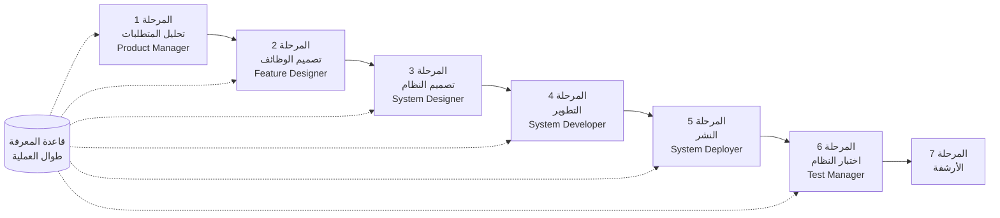

# دليل البدء السريع لـ SpecCrew

<p align="center">
  <a href="./GETTING-STARTED.md">简体中文</a> |
  <a href="./GETTING-STARTED.en.md">English</a> |
  <a href="./GETTING-STARTED.ja.md">日本語</a> |
  <a href="./GETTING-STARTED.ru.md">Русский</a> |
  <a href="./GETTING-STARTED.es.md">Español</a> |
  <a href="./GETTING-STARTED.de.md">Deutsch</a> |
  <a href="./GETTING-STARTED.fr.md">Français</a> |
  <a href="./GETTING-STARTED.pt-BR.md">Português (Brasil)</a> |
  <a href="./GETTING-STARTED.ar.md">العربية</a> |
  <a href="./GETTING-STARTED.hi.md">हिन्दी</a>
</p>

تساعدك هذه الوثيقة على الفهم السريع لكيفية استخدام فريق Agent الخاص بـ SpecCrew لإكمال التطوير الكامل من المتطلبات إلى التسليم وفق عمليات الهندسة القياسية.

---

## 1. المتطلبات المسبقة

### تثبيت SpecCrew

```bash
npm install -g speccrew
```

### تهيئة المشروع

```bash
speccrew init --ide qoder
```

بيئات التطوير المدعومة: `qoder`, `cursor`, `claude`, `codex`

### بنية الدليل بعد التهيئة

```
.
├── .qoder/
│   ├── agents/          # ملفات تعريف Agent
│   └── skills/          # ملفات تعريف Skill
├── speccrew-workspace/  # مساحة العمل
│   ├── docs/            # التكوينات، القواعد، القوالب، الحلول
│   ├── iterations/      # التكرارات الجارية حالياً
│   ├── iteration-archives/  # التكرارات المؤرشفة
│   └── knowledges/      # قاعدة المعرفة
│       ├── base/        # المعلومات الأساسية (تقارير التشخيص، الديون التقنية)
│       ├── bizs/        # قاعدة معرفة الأعمال
│       └── techs/       # قاعدة المعرفة التقنية
```

### مرجع سريع لأوامر CLI

| الأمر | الوصف |
|------|------|
| `speccrew list` | سرد جميع Agents و Skills المتاحة |
| `speccrew doctor` | التحقق من سلامة التثبيت |
| `speccrew update` | تحديث تكوين المشروع إلى أحدث إصدار |
| `speccrew uninstall` | إلغاء تثبيت SpecCrew |

---

## 2. البدء السريع في 5 دقائق بعد التثبيت

بعد تشغيل `speccrew init`، اتبع هذه الخطوات للدخول بسرعة في حالة العمل:

### الخطوة 1: اختر بيئة التطوير الخاصة بك

| بيئة التطوير | أمر التهيئة | سيناريو التطبيق |
|-----|-----------|----------|
| **Qoder** (موصى به) | `speccrew init --ide qoder` | أوركسترا كامل للوكلاء، عمال متوازيون |
| **Cursor** | `speccrew init --ide cursor` | سير العمل القائم على Composer |
| **Claude Code** | `speccrew init --ide claude` | تطوير CLI أولاً |
| **Codex** | `speccrew init --ide codex` | تكامل نظام OpenAI البيئي |

### الخطوة 2: تهيئة قاعدة المعرفة (موصى به)

بالنسبة للمشاريع ذات الكود المصدري الموجود، يوصى بتهيئة قاعدة المعرفة أولاً حتى يفهم الوكلاء قاعدة الكود الخاصة بك:

```
/speccrew-team-leader تهيئة قاعدة المعرفة التقنية
```

ثم:

```
/speccrew-team-leader تهيئة قاعدة معرفة الأعمال
```

### الخطوة 3: ابدأ مهمتك الأولى

```
/speccrew-product-manager لدي متطلب جديد: [صف متطلبك الوظيفي]
```

> **نصيحة**: إذا لم تكن متأكداً مما يجب فعله، فقط قل `/speccrew-team-leader ساعدني على البدء` — سيكتشف Team Leader حالة مشروعك تلقائياً ويرشدك.

---

## 3. شجرة القرار السريع

غير متأكد مما يجب فعله؟ ابحث عن السيناريو الخاص بك أدناه:

- **لدي متطلب وظيفي جديد**
  → `/speccrew-product-manager لدي متطلب جديد: [صف متطلبك الوظيفي]`

- **أريد مسح معرفة المشروع الموجود**
  → `/speccrew-team-leader تهيئة قاعدة المعرفة التقنية`
  → ثم: `/speccrew-team-leader تهيئة قاعدة معرفة الأعمال`

- **أريد متابعة العمل السابق**
  → `/speccrew-team-leader ما هو التقدم الحالي؟`

- **أريد التحقق من حالة صحة النظام**
  → تشغيل في الطرفية: `speccrew doctor`

- **لست متأكداً مما يجب فعله**
  → `/speccrew-team-leader ساعدني على البدء`
  → سيكتشف Team Leader حالة مشروعك تلقائياً ويرشدك

---

## 4. مرجع سريع للوكلاء

| الدور | Agent | المسؤوليات | مثال على الأمر |
|------|-------|-----------------|-----------------|
| قائد الفريق | `/speccrew-team-leader` | تنقل المشروع، تهيئة قاعدة المعرفة، التحقق من الحالة | "ساعدني على البدء" |
| مدير المنتج | `/speccrew-product-manager` | تحليل المتطلبات، إنشاء PRD | "لدي متطلب جديد: ..." |
| مصمم الوظائف | `/speccrew-feature-designer` | تحليل الوظائف، تصميم المواصفات، عقود API | "ابدأ تصميم الوظائف للتكرار X" |
| مصمم النظام | `/speccrew-system-designer` | تصميم الهندسة المعمارية، التصميم التفصيلي للمنصة | "ابدأ تصميم النظام للتكرار X" |
| مطور النظام | `/speccrew-system-developer` | تنسيق التطوير، إنشاء الكود | "ابدأ التطوير للتكرار X" |
| مدير الاختبار | `/speccrew-test-manager` | تخطيط الاختبار، تصميم الحالات، التنفيذ | "ابدأ الاختبار للتكرار X" |

> **ملاحظة**: لا تحتاج إلى تذكر جميع الوكلاء. فقط تحدث مع `/speccrew-team-leader` وسيقوم بتوجيه طلبك إلى الوكيل المناسب.

---

## 5. نظرة عامة على سير العمل

### مخطط التدفق الكامل



### المبادئ الأساسية

1. **تبعية المراحل**: مخرجات كل مرحلة هي مدخلات المرحلة التالية
2. **تأكيد نقطة التفتيش**: كل مرحلة لها نقطة تأكيد تتطلب موافقة المستخدم قبل المتابعة إلى المرحلة التالية
3. **مدعوم بقاعدة المعرفة**: قاعدة المعرفة تعمل طوال العملية بأكملها، وتوفر السياق لجميع المراحل

---

## 6. الخطوة صفر: تهيئة قاعدة المعرفة

قبل بدء عملية الهندسة الرسمية، تحتاج إلى تهيئة قاعدة معرفة المشروع.

### 6.1 تهيئة قاعدة المعرفة التقنية

**مثال على المحادثة**:
```
/speccrew-team-leader تهيئة قاعدة المعرفة التقنية
```

**عملية من ثلاث مراحل**:
1. اكتشاف المنصة — تحديد المنصات التقنية في المشروع
2. إنشاء الوثائق التقنية — إنشاء وثائق المواصفات التقنية لكل منصة
3. إنشاء الفهرس — إنشاء فهرس قاعدة المعرفة

**المخرج**:
```
speccrew-workspace/knowledges/techs/{platform-id}/
├── tech-stack.md          # تعريف مكدس التقنية
├── architecture.md        # اتفاقيات الهندسة المعمارية
├── dev-spec.md            # مواصفات التطوير
├── test-spec.md           # مواصفات الاختبار
└── INDEX.md               # ملف الفهرس
```

### 6.2 تهيئة قاعدة معرفة الأعمال

**مثال على المحادثة**:
```
/speccrew-team-leader تهيئة قاعدة معرفة الأعمال
```

**عملية من أربع مراحل**:
1. جرد الوظائف — مسح الكود لتحديد جميع الوظائف
2. تحليل الوظائف — تحليل منطق الأعمال لكل وظيفة
3. ملخص الوحدة — تلخيص الوظائف حسب الوحدة
4. ملخص النظام — إنشاء نظرة عامة على الأعمال على مستوى النظام

**المخرج**:
```
speccrew-workspace/knowledges/bizs/
├── {platform-type}/
│   └── {module-name}/
│       └── feature-spec.md
└── system-overview.md
```

---

## 7. دليل المحادثة مرحلة بمرحلة

### 7.1 المرحلة 1: تحليل المتطلبات (Product Manager)

**كيفية البدء**:
```
/speccrew-product-manager لدي متطلب جديد: [صف متطلبك]
```

**سير عمل Agent**:
1. اقرأ نظرة عامة على النظام لفهم الوحدات الموجودة
2. حلل متطلبات المستخدم
3. أنشئ وثيقة PRD منظمة

**المخرج**:
```
iterations/{رقم}-{نوع}-{اسم}/01.product-requirement/
├── [feature-name]-prd.md           # وثيقة متطلبات المنتج
└── [feature-name]-bizs-modeling.md # نمذجة الأعمال (للمتطلبات المعقدة)
```

**قائمة مراجعة التأكيد**:
- [ ] هل وصف المتطلب يعكس بدقة نية المستخدم؟
- [ ] هل قواعد الأعمال كاملة؟
- [ ] هل نقاط التكامل مع الأنظمة الموجودة واضحة؟
- [ ] هل معايير الق acceptance قابلة للقياس؟

---

### 7.2 المرحلة 2: تصميم الوظائف (Feature Designer)

**كيفية البدء**:
```
/speccrew-feature-designer ابدأ تصميم الوظائف
```

**سير عمل Agent**:
1. تحديد موقع وثيقة PRD المؤكدة تلقائياً
2. تحميل قاعدة معرفة الأعمال
3. إنشاء تصميم الوظيفة (بما في ذلك wireframes UI، تدفقات التفاعل، تعريفات البيانات، عقود API)
4. لعدة PRDs، استخدم Task Worker للتصميم المتوازي

**المخرج**:
```
iterations/{iter}/02.feature-design/
└── [feature-name]-feature-spec.md  # وثيقة تصميم الوظيفة
```

**قائمة مراجعة التأكيد**:
- [ ] هل جميع سيناريوهات المستخدم مغطاة؟
- [ ] هل تدفقات التفاعل واضحة؟
- [ ] هل تعريفات حقول البيانات كاملة؟
- [ ] هل معالجة الاستثناءات شاملة؟

---

### 7.3 المرحلة 3: تصميم النظام (System Designer)

**كيفية البدء**:
```
/speccrew-system-designer ابدأ تصميم النظام
```

**سير عمل Agent**:
1. تحديد موقع Feature Spec و API Contract
2. تحميل قاعدة المعرفة التقنية (مكدس التقنية، الهندسة المعمارية، المواصفات لكل منصة)
3. **Checkpoint A**: تقييم الإطار — تحليل الفجوات التقنية، توصية أطر جديدة (إذا لزم الأمر)، انتظار تأكيد المستخدم
4. إنشاء DESIGN-OVERVIEW.md
5. استخدام Task Worker للتوزيع المتوازي للتصميم لكل منصة (frontend/backend/mobile/desktop)
6. **Checkpoint B**: تأكيد مشترك — عرض ملخص جميع تصاميم المنصات، انتظار تأكيد المستخدم

**المخرج**:
```
iterations/{iter}/03.system-design/
├── DESIGN-OVERVIEW.md              # نظرة عامة على التصميم
├── {platform-id}/
│   ├── INDEX.md                    # فهرس تصميم المنصة
│   └── {module}-design.md          # تصميم الوحدة على مستوى pseudocode
```

**قائمة مراجعة التأكيد**:
- [ ] هل يستخدم pseudocode بناء الإطار الفعلي؟
- [ ] هل عقود API عبر المنصات متسقة؟
- [ ] هل استراتيجية معالجة الأخطاء موحدة؟

---

### 7.4 المرحلة 4: التطوير (System Developer)

**كيفية البدء**:
```
/speccrew-system-developer ابدأ التطوير
```

**سير عمل Agent**:
1. اقرأ وثائق تصميم النظام
2. تحميل المعرفة التقنية لكل منصة
3. **Checkpoint A**: الفحص المسبق للبيئة — التحقق من إصدارات runtime، التبعيات، توفر الخدمات؛ انتظار حل المستخدم إذا فشل
4. استخدام Task Worker للتوزيع المتوازي للتطوير لكل منصة
5. فحص التكامل: محاذاة عقد API، اتساق البيانات
6. إخراج تقرير التسليم

**المخرج**:
```
# يتم كتابة الكود المصدري في دليل المصدر الفعلي للمشروع
iterations/{iter}/04.development/
├── {platform-id}/
│   └── tasks/                      # سجلات مهمة التطوير
└── delivery-report.md
```

**قائمة مراجعة التأكيد**:
- [ ] هل البيئة جاهزة؟
- [ ] هل مشاكل التكامل ضمن النطاق المقبول؟
- [ ] هل الكود يتوافق مع مواصفات التطوير؟

---

### 7.5 المرحلة 5: النشر (System Deployer)

**كيفية البدء**:
```
/speccrew-system-deployer ابدأ النشر
```

**سير عمل Agent**:
1. التحقق من اكتمال مرحلة التطوير (Stage Gate)
2. تحميل قاعدة المعرفة التقنية (تكوين البناء، تكوين هجرة قاعدة البيانات، أوامر تشغيل الخدمة)
3. **Checkpoint**: فحص مسبق للبيئة — التحقق من أدوات البناء، إصدارات runtime، توفر التبعيات
4. تنفيذ مهارات النشر بالتسلسل: البناء (Build) → هجرة قاعدة البيانات (Migrate) → تشغيل الخدمة (Startup) → الاختبار الدخاني (Smoke Test)
5. إخراج تقرير النشر

> 💡 **نصيحة**: للمشاريع بدون قاعدة بيانات، يتم تخطي خطوة الهجرة تلقائياً؛ للتطبيقات العميلة (سطح المكتب/المحمول)، يتم استخدام وضع التحقق من العملية بدلاً من فحص الصحة HTTP.

**المخرج**:
```
iterations/{iter}/05.deployment/
├── {platform-id}/
│   ├── deployment-plan.md          # خطة النشر
│   └── deployment-log.md           # سجل تنفيذ النشر
└── deployment-report.md            # تقرير اكتمال النشر
```

**قائمة مراجعة التأكيد**:
- [ ] هل تم البناء بنجاح؟
- [ ] هل تم تنفيذ جميع سكربتات هجرة قاعدة البيانات بنجاح (إن وجدت)؟
- [ ] هل تم تشغيل التطبيق واجتاز فحص الصحة؟
- [ ] هل اجتاز الاختبار الدخاني بالكامل؟

---

### 7.6 المرحلة 6: اختبار النظام (Test Manager)

**كيفية البدء**:
```
/speccrew-test-manager ابدأ الاختبار
```

**عملية الاختبار من ثلاث مراحل**:

| المرحلة | الوصف | Checkpoint |
|-------|-------------|------------|
| تصميم حالات الاختبار | إنشاء حالات اختبار بناءً على PRD و Feature Spec | A: عرض إحصائيات تغطية الحالات ومصفوفة التتبع، انتظار تأكيد المستخدم على التغطية الكافية |
| إنشاء كود الاختبار | إنشاء كود اختبار قابل للتنفيذ | B: عرض ملفات الاختبار التي تم إنشاؤها وتخطيط الحالات، انتظار تأكيد المستخدم |
| تنفيذ الاختبار وإعداد تقارير الأخطاء | تنفيذ الاختبارات تلقائياً وإنشاء التقارير | لا شيء (تنفيذ تلقائي) |

**المخرج**:
```
iterations/{iter}/06.system-test/
├── cases/
│   └── {platform-id}/              # وثائق حالات الاختبار
├── code/
│   └── {platform-id}/              # خطة كود الاختبار
├── reports/
│   └── test-report-{date}.md       # تقرير الاختبار
└── bugs/
    └── BUG-{id}-{title}.md         # تقارير الأخطاء (ملف واحد لكل خطأ)
```

**قائمة مراجعة التأكيد**:
- [ ] هل تغطية الحالات كاملة؟
- [ ] هل كود الاختبار قابل للتشغيل؟
- [ ] هل تقييم شدة الخطأ دقيق؟

---

### 7.7 المرحلة 7: الأرشفة

يتم أرشفة التكرارات تلقائياً بعد الاكتمال:

```
speccrew-workspace/iteration-archives/
└── {رقم}-{نوع}-{اسم}-{تاريخ}/
    ├── 01.product-requirement/
    ├── 02.feature-design/
    ├── 03.system-design/
    ├── 04.development/
    ├── 05.deployment/
    └── 06.system-test/
```

---

## 8. نظرة عامة على قاعدة المعرفة

### 8.1 قاعدة معرفة الأعمال (bizs)

**الغرض**: تخزين أوصاف وظائف أعمال المشروع، تقسيمات الوحدات، خصائص API

**بنية الدليل**:
```
knowledges/bizs/
├── {platform-type}/
│   └── {module-name}/
│       └── feature-spec.md
└── system-overview.md
```

**سيناريوهات الاستخدام**: Product Manager, Feature Designer

### 8.2 قاعدة المعرفة التقنية (techs)

**الغرض**: تخزين مكدس تقنية المشروع، اتفاقيات الهندسة المعمارية، مواصفات التطوير، مواصفات الاختبار

**بنية الدليل**:
```
knowledges/techs/{platform-id}/
├── tech-stack.md
├── architecture.md
├── dev-spec.md
├── test-spec.md
└── INDEX.md
```

**سيناريوهات الاستخدام**: System Designer, System Developer, Test Manager

---

## 9. إدارة تقدم سير العمل

يتبع فريق SpecCrew الافتراضي آلية بوابة مرحلة صارمة حيث يجب تأكيد كل مرحلة من قبل المستخدم قبل الانتقال إلى المرحلة التالية. كما يدعم التنفيذ القابل للاستئناف — عند إعادة التشغيل بعد الانقطاع، يستمر تلقائياً من حيث توقف.

### 9.1 ملفات التقدم ذات الطبقات الثلاث

يحافظ سير العمل تلقائياً على ثلاثة أنواع من ملفات تقدم JSON، الموجودة في دليل التكرار:

| الملف | الموقع | الغرض |
|------|----------|---------|
| `WORKFLOW-PROGRESS.json` | `iterations/{iter}/` | يسجل حالة كل مرحلة من pipeline |
| `.checkpoints.json` | تحت كل دليل مرحلة | يسجل حالة تأكيد checkpoint للمستخدم |
| `DISPATCH-PROGRESS.json` | تحت كل دليل مرحلة | يسجل التقدم بنداً بنداً للمهام المتوازية (متعدد المنصات/متعدد الوحدات) |

### 9.2 تدفق حالة المرحلة

تتبع كل مرحلة تدفق الحالة هذا:

```
pending → in_progress → completed → confirmed
```

- **pending**: لم يبدأ بعد
- **in_progress**: قيد التنفيذ
- **completed**: اكتمل تنفيذ Agent، في انتظار تأكيد المستخدم
- **confirmed**: أكد المستخدم عبر checkpoint النهائي، يمكن بدء المرحلة التالية

### 9.3 التنفيذ القابل للاستئناف

عند إعادة تشغيل Agent لمرحلة:

1. **فحص upstream تلقائي**: التحقق مما إذا كانت المرحلة السابقة مؤكدة، يمنع ويطلب إذا لم تكن كذلك
2. **استعادة Checkpoint**: يقرأ `.checkpoints.json`، يتخطى checkpoints التي تم اجتيازها، يستمر من آخر نقطة انقطاع
3. **استعادة المهام المتوازية**: يقرأ `DISPATCH-PROGRESS.json`، يعيد تنفيذ المهام ذات الحالة `pending` أو `failed` فقط، يتخطى المهام `completed`

### 9.4 عرض التقدم الحالي

عرض حالة panorama للـ pipeline عبر Agent Team Leader:

```
/speccrew-team-leader عرض تقدم التكرار الحالي
```

سيقرأ Team Leader ملفات التقدم ويعرض نظرة عامة على الحالة مشابهة لـ:

```
Pipeline Status: i001-user-management
  01 PRD:            ✅ Confirmed
  02 Feature Design: 🔄 In Progress (Checkpoint A passed)
  03 System Design:  ⏳ Pending
  04 Development:    ⏳ Pending
  05 Deployment:     ⏳ Pending
  06 System Test:    ⏳ Pending
```

### 9.5 التوافق مع الإصدارات السابقة

آلية ملف التقدم متوافقة تماماً مع الإصدارات السابقة — إذا لم تكن ملفات التقدم موجودة (مثل المشاريع القديمة أو التكرارات الجديدة)، فسينفذ جميع Agents بشكل طبيعي وفقاً للمنطق الأصلي.

---

## 10. الأسئلة الشائعة (FAQ)

### س1: ماذا أفعل إذا لم يعمل Agent كما هو متوقع؟

1. تشغيل `speccrew doctor` للتحقق من سلامة التثبيت
2. تأكيد تهيئة قاعدة المعرفة
3. تأكيد وجود مخرجات المرحلة السابقة في دليل التكرار الحالي

### س2: كيف أتخطى مرحلة؟

**غير مستحسن** — مخرجات كل مرحلة هي مدخلات المرحلة التالية.

إذا كنت يجب أن تتخطى، قم يدوياً بإعداد مستند الإدخال للمرحلة المقابلة وتأكد من أنه يتوافق مع مواصفات التنسيق.

### س3: كيف أتعامل مع متطلبات متعددة متوازية؟

أنشئ أدلة تكرار مستقلة لكل متطلب:
```
iterations/
├── 001-feature-xxx/
├── 002-feature-yyy/
└── 003-feature-zzz/
```

كل تكرار معزول تماماً ولا يؤثر على الآخرين.

### س4: كيف أحدث إصدار SpecCrew؟

يتطلب التحديث خطوتين:

```bash
# الخطوة 1: تحديث أداة CLI العالمية
npm install -g speccrew@latest

# الخطوة 2: مزامنة Agents و Skills في دليل مشروعك
cd /path/to/your-project
speccrew update
```

- `npm install -g speccrew@latest`: يحدث أداة CLI نفسها (قد تتضمن الإصدارات الجديدة تعريفات Agent/Skill جديدة، إصلاحات الأخطاء، إلخ)
- `speccrew update`: يزامن ملفات تعريف Agent و Skill في مشروعك إلى أحدث إصدار
- `speccrew update --ide cursor`: يحدث التكوين لبيئة تطوير محددة فقط

> **ملاحظة**: كلتا الخطوتين مطلوبتان. تشغيل `speccrew update` فقط لن يحدث أداة CLI نفسها؛ تشغيل `npm install` فقط لن يحدث ملفات المشروع.

### س5: `speccrew update` يظهر إصدار جديد متاح لكن `npm install -g speccrew@latest` لا يزال يثبت الإصدار القديم؟

هذا عادة ما يكون بسبب ذاكرة التخزين المؤقت لـ npm. الحل:

```bash
# مسح ذاكرة التخزين المؤقت لـ npm وإعادة التثبيت
npm cache clean --force
npm install -g speccrew@latest

# التحقق من الإصدار
npm list -g speccrew
```

إذا لم ينجح ذلك بعد، حاول التثبيت برقم إصدار محدد:
```bash
npm install -g speccrew@0.5.6
```

### س6: كيف أعرض التكرارات التاريخية؟

بعد الأرشفة، اعرض في `speccrew-workspace/iteration-archives/`، منظمة بتنسيق `{رقم}-{نوع}-{اسم}-{تاريخ}/`.

### س7: هل تحتاج قاعدة المعرفة إلى تحديثات منتظمة؟

إعادة التهيئة مطلوبة في الحالات التالية:
- تغييرات كبيرة في بنية المشروع
- ترقية أو استبدال مكدس التقنية
- إضافة/إزالة وحدات الأعمال

---

## 11. مرجع سريع

### مرجع سريع لبدء Agent

| المرحلة | Agent | محادثة البدء |
|-------|-------|-------------------|
| التهيئة | Team Leader | `/speccrew-team-leader تهيئة قاعدة المعرفة التقنية` |
| تحليل المتطلبات | Product Manager | `/speccrew-product-manager لدي متطلب جديد: [وصف]` |
| تصميم الوظائف | Feature Designer | `/speccrew-feature-designer ابدأ تصميم الوظائف` |
| تصميم النظام | System Designer | `/speccrew-system-designer ابدأ تصميم النظام` |
| التطوير | System Developer | `/speccrew-system-developer ابدأ التطوير` |
| النشر | System Deployer | `/speccrew-system-deployer ابدأ النشر` |
| اختبار النظام | Test Manager | `/speccrew-test-manager ابدأ الاختبار` |

### قائمة مراجعة Checkpoint

| المرحلة | عدد Checkpoints | عناصر التحقق الرئيسية |
|-------|----------------------|-----------------|
| تحليل المتطلبات | 1 | دقة المتطلب، اكتمال قاعدة الأعمال، قابلية قياس معايير القبول |
| تصميم الوظائف | 1 | تغطية السيناريو، وضوح التفاعل، اكتمال البيانات، معالجة الاستثناءات |
| تصميم النظام | 2 | أ: تقييم الإطار؛ ب: بناء pseudocode، اتساق عبر المنصات، معالجة الأخطاء |
| التطوير | 1 | أ: جاهزية البيئة، مشاكل التكامل، مواصفات الكود |
| النشر | 1 | نجاح البناء، اكتمال الهجرة، تشغيل الخدمة، اجتياز الاختبار الدخاني |
| اختبار النظام | 2 | أ: تغطية الحالات؛ ب: قابلية تشغيل كود الاختبار |

### مرجع سريع لمسارات المخرجات

| المرحلة | دليل الإخراج | تنسيق الملف |
|-------|-----------------|-------------|
| تحليل المتطلبات | `iterations/{iter}/01.product-requirement/` | `[name]-prd.md`, `[name]-bizs-modeling.md` |
| تصميم الوظائف | `iterations/{iter}/02.feature-design/` | `[name]-feature-spec.md` |
| تصميم النظام | `iterations/{iter}/03.system-design/` | `DESIGN-OVERVIEW.md`, `{platform}/INDEX.md`, `{platform}/{module}-design.md` |
| التطوير | `iterations/{iter}/04.development/` | الكود المصدري + `delivery-report.md` |
| النشر | `iterations/{iter}/05.deployment/` | `deployment-plan.md`, `deployment-log.md`, `deployment-report.md` |
| اختبار النظام | `iterations/{iter}/06.system-test/` | `cases/`, `code/`, `reports/`, `bugs/` |
| الأرشفة | `iteration-archives/{iter}-{date}/` | نسخة تكرار كاملة |

---

## الخطوات التالية

1. قم بتشغيل `speccrew init --ide qoder` لتهيئة مشروعك
2. نفذ الخطوة صفر: تهيئة قاعدة المعرفة
3. تقدم مرحلة بمرحلة وفقاً لسير العمل، استمتع بتجربة التطوير المدعومة بالمواصفات!
