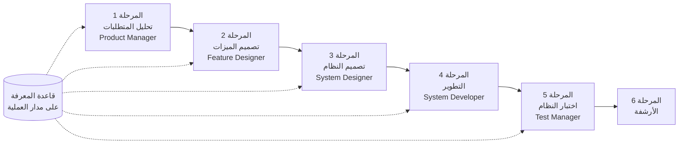

<div dir="rtl">

<p align="center">
  <a href="./GETTING-STARTED.md">简体中文</a> |
  <a href="./GETTING-STARTED.zh-TW.md">繁體中文</a> |
  <a href="./GETTING-STARTED.en.md">English</a> |
  <a href="./GETTING-STARTED.ko.md">한국어</a> |
  <a href="./GETTING-STARTED.de.md">Deutsch</a> |
  <a href="./GETTING-STARTED.es.md">Español</a> |
  <a href="./GETTING-STARTED.fr.md">Français</a> |
  <a href="./GETTING-STARTED.it.md">Italiano</a> |
  <a href="./GETTING-STARTED.da.md">Dansk</a> |
  <a href="./GETTING-STARTED.ja.md">日本語</a> |
  <a href="./GETTING-STARTED.ar.md">العربية</a>
</p>

# دليل البدء السريع لـ SpecCrew

يساعدك هذا المستند على فهم كيفية استخدام فريق وكلاء SpecCrew لإكمال دورة التطوير الكاملة من المتطلبات إلى التسليم باتباع عمليات الهندسة القياسية.

---

## 1. المتطلبات الأساسية

### تثبيت SpecCrew

```bash
npm install -g speccrew
```

### تهيئة المشروع

```bash
speccrew init --ide qoder
```

بيئات التطوير المدعومة: `qoder`، `cursor`، `claude`، `codex`

### هيكل الدليل بعد التهيئة

```
.
├── .qoder/
│   ├── agents/          # ملفات تعريف الوكلاء
│   └── skills/          # ملفات تعريف المهارات
├── speccrew-workspace/  # مساحة العمل
│   ├── docs/            # التكوينات والقواعد والقوالب والحلول
│   ├── iterations/      # التكرارات الجارية حالياً
│   ├── iteration-archives/  # التكرارات المؤرشفة
│   └── knowledges/      # قاعدة المعرفة
│       ├── base/        # المعلومات الأساسية (تقارير التشخيص والديون التقنية)
│       ├── bizs/        # قاعدة المعرفة التجارية
│       └── techs/       # قاعدة المعرفة التقنية
```

### مرجع سريع لأوامر CLI

| الأمر | الوصف |
|-------|--------|
| `speccrew list` | عرض جميع الوكلاء والمهارات المتاحة |
| `speccrew doctor` | التحقق من سلامة التثبيت |
| `speccrew update` | تحديث تكوين المشروع إلى أحدث إصدار |
| `speccrew uninstall` | إلغاء تثبيت SpecCrew |

---

## 2. نظرة عامة على سير العمل

### مخطط التدفق الكامل



### المبادئ الأساسية

1. **تبعيات المراحل**: مخرجات كل مرحلة هي مدخلات للمرحلة التالية
2. **تأكيد نقطة التحقق**: تحتوي كل مرحلة على نقطة تأكيد تتطلب موافقة المستخدم قبل المتابعة إلى المرحلة التالية
3. **الاعتماد على قاعدة المعرفة**: تعمل قاعدة المعرفة طوال العملية بأكملها، مما يوفر السياق لجميع المراحل

---

## 3. تهيئة قاعدة المعرفة

قبل بدء عملية الهندسة الرسمية، تحتاج إلى تهيئة قاعدة معرفة المشروع.

### 3.1 تهيئة قاعدة المعرفة التقنية

**مثال على المحادثة**:
```
@speccrew-team-leader تهيئة قاعدة المعرفة التقنية
```

**عملية من ثلاث مراحل**:
1. اكتشاف المنصة — تحديد المنصات التقنية في المشروع
2. إنشاء الوثائق التقنية — إنشاء مستندات المواصفات التقنية لكل منصة
3. إنشاء الفهرس — إنشاء فهرس قاعدة المعرفة

**المخرجات**:
```
speccrew-workspace/knowledges/techs/{platform-id}/
├── tech-stack.md          # تعريف المكدس التقني
├── architecture.md        # اتفاقيات الهندسة المعمارية
├── dev-spec.md            # مواصفات التطوير
├── test-spec.md           # مواصفات الاختبار
└── INDEX.md               # ملف الفهرس
```

### 3.2 تهيئة قاعدة المعرفة التجارية

**مثال على المحادثة**:
```
@speccrew-team-leader تهيئة قاعدة المعرفة التجارية
```

**عملية من أربع مراحل**:
1. جرد الميزات — مسح الكود لتحديد جميع الميزات الوظيفية
2. تحليل الميزات — تحليل المنطق التجاري لكل ميزة
3. تلخيص الوحدة — تلخيص الميزات حسب الوحدة
4. تلخيص النظام — إنشاء نظرة عامة على الأعمال على مستوى النظام

**المخرجات**:
```
speccrew-workspace/knowledges/bizs/
├── {platform-type}/
│   └── {module-name}/
│       └── feature-spec.md
└── system-overview.md
```

---

## 4. دليل المحادثة المرحلي

### 4.1 المرحلة 1: تحليل المتطلبات (Product Manager)

**كيفية البدء**:
```
@speccrew-product-manager لدي متطلب جديد: [صف متطلبك]
```

**سير عمل الوكيل**:
1. قراءة نظرة عامة على النظام لفهم الوحدات الموجودة
2. تحليل متطلبات المستخدم
3. إنشاء مستند PRD منظم

**المخرجات**:
```
iterations/{رقم}-{نوع}-{اسم}/01.product-requirement/
├── [feature-name]-prd.md           # مستند متطلبات المنتج
└── [feature-name]-bizs-modeling.md # النمذجة التجارية (للمتطلبات المعقدة)
```

**قائمة التحقق للتأكيد**:
- [ ] هل يعكس وصف المتطلب نية المستخدم بدقة؟
- [ ] هل القواعد التجارية كاملة؟
- [ ] هل نقاط التكامل مع الأنظمة الموجودة واضحة؟
- [ ] هل معايير القبول قابلة للقياس؟

---

### 4.2 المرحلة 2: تصميم الميزات (Feature Designer)

**كيفية البدء**:
```
@speccrew-feature-designer بدء تصميم الميزات
```

**سير عمل الوكيل**:
1. تحديد موقع مستند PRD المؤكد تلقائياً
2. تحميل قاعدة المعرفة التجارية
3. إنشاء تصميم الميزات (بما في ذلك مخططات wireframe للواجهة، وتدفقات التفاعل، وتعريفات البيانات، وعقود API)
4. لـ PRDs متعددة، استخدام Task Worker للتصميم المتوازي

**المخرجات**:
```
iterations/{iter}/02.feature-design/
└── [feature-name]-feature-spec.md  # مستند تصميم الميزات
```

**قائمة التحقق للتأكيد**:
- [ ] هل جميع سيناريوهات المستخدم مغطاة؟
- [ ] هل تدفقات التفاعل واضحة؟
- [ ] هل تعريفات حقول البيانات كاملة؟
- [ ] هل معالجة الاستثناءات شاملة؟

---

### 4.3 المرحلة 3: تصميم النظام (System Designer)

**كيفية البدء**:
```
@speccrew-system-designer بدء تصميم النظام
```

**سير عمل الوكيل**:
1. تحديد موقع Feature Spec و API Contract
2. تحميل قاعدة المعرفة التقنية (المكدس التقني، والهندسة المعمارية، والمواصفات لكل منصة)
3. **نقطة التحقق أ**: تقييم الإطار — تحليل الفجوات التقنية، وتوصية أطر عمل جديدة (إذا لزم الأمر)، والانتظار لتأكيد المستخدم
4. إنشاء DESIGN-OVERVIEW.md
5. استخدام Task Worker للتوزيع المتوازي للتصميم لكل منصة (الواجهة الأمامية/الخلفية/الجوال/سطح المكتب)
6. **نقطة التحقق ب**: التأكيد المشترك — عرض ملخص جميع تصاميم المنصات، والانتظار لتأكيد المستخدم

**المخرجات**:
```
iterations/{iter}/03.system-design/
├── DESIGN-OVERVIEW.md              # نظرة عامة على التصميم
├── {platform-id}/
│   ├── INDEX.md                    # فهرس تصميم المنصة
│   └── {module}-design.md          # تصميم الوحدة على مستوى الشيفرة الوهمية
```

**قائمة التحقق للتأكيد**:
- [ ] هل تستخدم الشيفرة الوهمية بناء جملة إطار العمل الفعلي؟
- [ ] هل عقود API متعددة المنصات متسقة؟
- [ ] هل استراتيجية معالجة الأخطاء موحدة؟

---

### 4.4 المرحلة 4: تنفيذ التطوير (System Developer)

**كيفية البدء**:
```
@speccrew-system-developer بدء التطوير
```

**سير عمل الوكيل**:
1. قراءة مستندات تصميم النظام
2. تحميل المعرفة التقنية لكل منصة
3. **نقطة التحقق أ**: الفحص المسبق للبيئة — التحقق من إصدارات وقت التشغيل والتبعيات وتوفر الخدمات؛ الانتظار لحل المستخدم في حالة الفشل
4. استخدام Task Worker للتوزيع المتوازي للتطوير لكل منصة
5. التحقق من التكامل: محاذاة عقود API، واتساق البيانات
6. إخراج تقرير التسليم

**المخرجات**:
```
# كتابة الكود المصدري في دليل الكود المصدري الفعلي للمشروع
iterations/{iter}/04.development/
├── {platform-id}/
│   └── tasks/                      # سجلات مهام التطوير
└── delivery-report.md
```

**قائمة التحقق للتأكيد**:
- [ ] هل البيئة جاهزة؟
- [ ] هل مشاكل التكامل ضمن النطاق المقبول؟
- [ ] هل الكود يتوافق مع مواصفات التطوير؟

---

### 4.5 المرحلة 5: اختبار النظام (Test Manager)

**كيفية البدء**:
```
@speccrew-test-manager بدء الاختبار
```

**عملية الاختبار من ثلاث مراحل**:

| المرحلة | الوصف | نقطة التحقق |
|---------|--------|-------------|
| تصميم حالات الاختبار | إنشاء حالات اختبار بناءً على PRD و Feature Spec | أ: عرض إحصائيات تغطية الحالات ومصفوفة التتبع، والانتظار لتأكيد المستخدم على التغطية الكافية |
| إنشاء كود الاختبار | إنشاء كود اختبار قابل للتنفيذ | ب: عرض ملفات الاختبار المنشأة وتعيين الحالات، والانتظار لتأكيد المستخدم |
| تنفيذ الاختبار وتقرير الأخطاء | تنفيذ الاختبارات تلقائياً وإنشاء التقارير | لا شيء (تنفيذ تلقائي) |

**المخرجات**:
```
iterations/{iter}/05.system-test/
├── cases/
│   └── {platform-id}/              # مستندات حالات الاختبار
├── code/
│   └── {platform-id}/              # خطة كود الاختبار
├── reports/
│   └── test-report-{date}.md       # تقرير الاختبار
└── bugs/
    └── BUG-{id}-{title}.md         # تقارير الأخطاء (ملف واحد لكل خطأ)
```

**قائمة التحقق للتأكيد**:
- [ ] هل تغطية الحالات كاملة؟
- [ ] هل كود الاختبار قابل للتشغيل؟
- [ ] هل تقييم خطورة الأخطاء دقيق؟

---

### 4.6 المرحلة 6: الأرشفة

يتم أرشفة التكرارات تلقائياً عند اكتمالها:

```
speccrew-workspace/iteration-archives/
└── {رقم}-{نوع}-{اسم}-{تاريخ}/
    ├── 01.product-requirement/
    ├── 02.feature-design/
    ├── 03.system-design/
    ├── 04.development/
    └── 05.system-test/
```

---

## 5. نظرة عامة على قاعدة المعرفة

### 5.1 قاعدة المعرفة التجارية (bizs)

**الغرض**: تخزين أوصاف الوظائف التجارية للمشروع، وتقسيم الوحدات، وخصائص API

**هيكل الدليل**:
```
knowledges/bizs/
├── {platform-type}/
│   └── {module-name}/
│       └── feature-spec.md
└── system-overview.md
```

**سيناريوهات الاستخدام**: Product Manager، Feature Designer

### 5.2 قاعدة المعرفة التقنية (techs)

**الغرض**: تخزين المكدس التقني للمشروع، واتفاقيات الهندسة المعمارية، ومواصفات التطوير، ومواصفات الاختبار

**هيكل الدليل**:
```
knowledges/techs/{platform-id}/
├── tech-stack.md
├── architecture.md
├── dev-spec.md
├── test-spec.md
└── INDEX.md
```

**سيناريوهات الاستخدام**: System Designer، System Developer، Test Manager

---

## 6. إدارة تقدم سير العمل

يتبع الفريق الافتراضي SpecCrew آلية بوابة مرحلية صارمة حيث يجب تأكيد كل مرحلة من قبل المستخدم قبل المتابعة إلى المرحلة التالية. كما يدعم التنفيذ القابل للاستئناف — عند إعادة التشغيل بعد الانقطاع، يستمر تلقائياً من حيث توقف.

### 6.1 ملفات التقدم ثلاثية الطبقات

يحافظ سير العمل تلقائياً على ثلاثة أنواع من ملفات تقدم JSON، موجودة في دليل التكرار:

| الملف | الموقع | الغرض |
|-------|--------|--------|
| `WORKFLOW-PROGRESS.json` | `iterations/{iter}/` | يسجل حالة كل مرحلة من مراحل خط الأنابيب |
| `.checkpoints.json` | تحت كل دليل مرحلة | يسجل حالة تأكيد نقطة التحقق من المستخدم |
| `DISPATCH-PROGRESS.json` | تحت كل دليل مرحلة | يسجل التقدم بند لكل بند للمهام المتوازية (متعددة المنصات/الوحدات) |

### 6.2 تدفق حالة المرحلة

تتبع كل مرحلة تدفق الحالة هذا:

```
pending → in_progress → completed → confirmed
```

- **pending**: لم يبدأ بعد
- **in_progress**: قيد التنفيذ حالياً
- **completed**: اكتمل تنفيذ الوكيل، في انتظار تأكيد المستخدم
- **confirmed**: أكد المستخدم عبر نقطة التحقق النهائية، يمكن بدء المرحلة التالية

### 6.3 التنفيذ القابل للاستئناف

عند إعادة تشغيل وكيل لمرحلة:

1. **التحقق التلقائي من المنبع**: يتحقق مما إذا كانت المرحلة السابقة مؤكدة، ويحظر ويطالب إذا لم تكن كذلك
2. **استعادة نقطة التحقق**: يقرأ `.checkpoints.json`، يتخطى نقاط التحقق المتجاوزة، يستمر من نقطة الانقطاع الأخيرة
3. **استعادة المهمة المتوازية**: يقرأ `DISPATCH-PROGRESS.json`، يعيد تنفيذ المهام ذات الحالة `pending` أو `failed` فقط، يتخطى المهام `completed`

### 6.4 عرض التقدم الحالي

عرض حالة بانوراما خط الأنابيب عبر وكيل قائد الفريق:

```
@speccrew-team-leader عرض تقدم التكرار الحالي
```

سيقرأ قائد الفريق ملفات التقدم ويعرض نظرة عامة على الحالة مشابهة لـ:

```
Pipeline Status: i001-user-management
  01 PRD:            ✅ Confirmed
  02 Feature Design: 🔄 In Progress (Checkpoint A passed)
  03 System Design:  ⏳ Pending
  04 Development:    ⏳ Pending
  05 System Test:    ⏳ Pending
```

### 6.5 التوافق العكسي

آلية ملفات التقدم متوافقة تماماً مع الإصدارات السابقة — إذا لم تكن ملفات التقدم موجودة (مثلاً في المشاريع القديمة أو التكرارات الجديدة)، سيقوم جميع الوكلاء بالتنفيذ بشكل طبيعي وفقاً للمنطق الأصلي.

---

## 7. الأسئلة الشائعة (FAQ)

### س1: ماذا أفعل إذا لم يعمل الوكيل كما هو متوقع؟

1. قم بتشغيل `speccrew doctor` للتحقق من سلامة التثبيت
2. تأكد من تهيئة قاعدة المعرفة
3. تأكد من وجود مخرجات المرحلة السابقة في دليل التكرار الحالي

### س2: كيف يمكنني تخطي مرحلة معينة؟

**غير موصى به** — مخرجات كل مرحلة هي مدخلات للمرحلة التالية.

إذا كان يجب عليك التخطي، قم بإعداد مستند الإدخال للمرحلة المقابلة يدوياً وتأكد من أنه يتبع مواصفات التنسيق.

### س3: كيفية التعامل مع متطلبات متعددة بالتوازي؟

أنشئ أدلة تكرار مستقلة لكل متطلب:
```
iterations/
├── 001-feature-xxx/
├── 002-feature-yyy/
└── 003-feature-zzz/
```

كل تكرار معزول تماماً ولا يؤثر على الآخرين.

### س4: كيفية تحديث إصدار SpecCrew؟

يتم التحديث على خطوتين:

```bash
# الخطوة 1: تحديث أداة CLI العامة
npm install -g speccrew@latest

# الخطوة 2: مزامنة Agents و Skills في دليل المشروع
cd /path/to/your-project
speccrew update
```

- `npm install -g speccrew@latest`: تحديث أداة CLI نفسها (قد تحتوي النسخة الجديدة على تعريفات Agent/Skill جديدة، إصلاحات أخطاء، إلخ)
- `speccrew update`: مزامنة ملفات تعريف Agent و Skill في المشروع إلى أحدث إصدار
- `speccrew update --ide cursor`: تحديث تكوين IDE المحدد فقط

> **ملاحظة**: يجب تنفيذ الخطوتين. تنفيذ `speccrew update` فقط لن يحدث أداة CLI نفسها؛ وتنفيذ `npm install` فقط لن يحدث الملفات في المشروع.

### س5: يظهر `speccrew update` إصدارًا جديدًا لكن بعد التثبيت لا يزال الإصدار القديم؟

عادةً ما يكون بسبب ذاكرة التخزين المؤقت npm. الحل:

```bash
npm cache clean --force
npm install -g speccrew@latest
npm list -g speccrew
```

إذا لم يعمل، حدد رقم الإصدار:
```bash
npm install -g speccrew@0.5.6
```

### س6: كيفية عرض التكرارات التاريخية؟

بعد الأرشفة، عرض في `speccrew-workspace/iteration-archives/`، منظم بتنسيق `{رقم}-{نوع}-{اسم}-{تاريخ}/`.

### س7: هل تحتاج قاعدة المعرفة إلى تحديثات دورية؟

مطلوب إعادة التهيئة في الحالات التالية:
- تغييرات كبيرة في هيكل المشروع
- ترقية أو استبدال المكدس التقني
- إضافة/حذف وحدات تجارية

---

## 8. مرجع سريع

### مرجع سريع لبدء الوكلاء

| المرحلة | الوكيل | محادثة البدء |
|---------|--------|--------------|

| التهيئة | Team Leader | `@speccrew-team-leader تهيئة قاعدة المعرفة التقنية` |
| تحليل المتطلبات | Product Manager | `@speccrew-product-manager لدي متطلب جديد: [الوصف]` |
| تصميم الميزات | Feature Designer | `@speccrew-feature-designer بدء تصميم الميزات` |
| تصميم النظام | System Designer | `@speccrew-system-designer بدء تصميم النظام` |
| التطوير | System Developer | `@speccrew-system-developer بدء التطوير` |
| اختبار النظام | Test Manager | `@speccrew-test-manager بدء الاختبار` |

### قائمة التحقق لنقاط التحقق

| المرحلة | عدد نقاط التحقق | عناصر التحقق الرئيسية |
|---------|-----------------|----------------------|
| تحليل المتطلبات | 1 | دقة المتطلبات، اكتمال القواعد التجارية، قابلية قياس معايير القبول |
| تصميم الميزات | 1 | تغطية السيناريوهات، وضوح التفاعل، اكتمال البيانات، معالجة الاستثناءات |
| تصميم النظام | 2 | أ: تقييم الإطار؛ ب: بناء جملة الشيفرة الوهمية، الاتساق عبر المنصات، معالجة الأخطاء |
| التطوير | 1 | أ: جاهزية البيئة، مشاكل التكامل، مواصفات الكود |
| اختبار النظام | 2 | أ: تغطية الحالات؛ ب: قابلية تشغيل كود الاختبار |

### مرجع سريع لمسارات المخرجات

| المرحلة | دليل الإخراج | تنسيق الملف |
|---------|-------------|-------------|
| تحليل المتطلبات | `iterations/{iter}/01.product-requirement/` | `[name]-prd.md`، `[name]-bizs-modeling.md` |
| تصميم الميزات | `iterations/{iter}/02.feature-design/` | `[name]-feature-spec.md` |
| تصميم النظام | `iterations/{iter}/03.system-design/` | `DESIGN-OVERVIEW.md`، `{platform}/INDEX.md`، `{platform}/{module}-design.md` |
| التطوير | `iterations/{iter}/04.development/` | الكود المصدري + `delivery-report.md` |
| اختبار النظام | `iterations/{iter}/05.system-test/` | `cases/`، `code/`، `reports/`، `bugs/` |
| الأرشفة | `iteration-archives/{iter}-{تاريخ}/` | نسخة كاملة من التكرار |

---

## الخطوات التالية

1. قم بتشغيل `speccrew init --ide qoder` لتهيئة مشروعك
2. نفذ تهيئة قاعدة المعرفة
3. تقدم عبر كل مرحلة باتباع سير العمل، واستمتع بتجربة التطوير المستندة إلى المواصفات!

</div>
