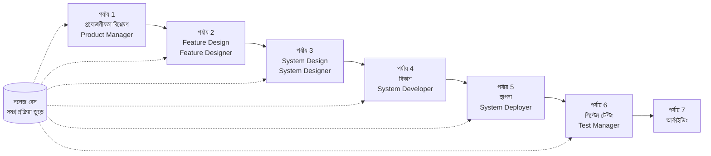

# SpecCrew দ্রুত শুরু করার নির্দেশিকা

<p align="center">
  <a href="./GETTING-STARTED.md">简体中文</a> |
  <a href="./GETTING-STARTED.zh-TW.md">繁體中文</a> |
  <a href="./GETTING-STARTED.en.md">English</a> |
  <a href="./GETTING-STARTED.ko.md">한국어</a> |
  <a href="./GETTING-STARTED.de.md">Deutsch</a> |
  <a href="./GETTING-STARTED.es.md">Español</a> |
  <a href="./GETTING-STARTED.fr.md">Français</a> |
  <a href="./GETTING-STARTED.it.md">Italiano</a> |
  <a href="./GETTING-STARTED.da.md">Dansk</a> |
  <a href="./GETTING-STARTED.ja.md">日本語</a> |
  <a href="./GETTING-STARTED.ar.md">العربية</a>
</p>

এই নথিটি আপনাকে দ্রুত বুঝতে সাহায্য করে কিভাবে প্রয়োজনীয়তা থেকে ডেলিভারি পর্যন্ত সম্পূর্ণ বিকাশ সম্পন্ন করতে স্ট্যান্ডার্ড ইঞ্জিনিয়ারিং প্রক্রিয়া অনুযায়ী SpecCrew এজেন্ট টিম ব্যবহার করতে হয়।

---

## 1. প্রাকশর্ত

### SpecCrew ইনস্টলেশন

```bash
npm install -g speccrew
```

### প্রকল্প আরম্ভকরণ

```bash
speccrew init --ide qoder
```

সমর্থিত IDE: `qoder`, `cursor`, `claude`, `codex`

### আরম্ভকরণের পরে ডিরেক্টরি কাঠামো

```
.
├── .qoder/
│   ├── agents/          # Agents সংজ্ঞা ফাইল
│   └── skills/          # Skills সংজ্ঞা ফাইল
├── speccrew-workspace/  # Workspace
│   ├── docs/            # কনফিগারেশন, নিয়ম, টেমপ্লেট, সমাধান
│   ├── iterations/      # চলমান ইটারেশন
│   ├── iteration-archives/  # আর্কাইভ করা ইটারেশন
│   └── knowledges/      # নলেজ বেস
│       ├── base/        # মৌলিক তথ্য (ডায়াগনোস্টিক রিপোর্ট, টেকনিক্যাল ঋণ)
│       ├── bizs/        # ব্যবসায়িক নলেজ বেস
│       └── techs/       # টেকনিক্যাল নলেজ বেস
```

### CLI কমান্ড দ্রুত রেফারেন্স

| কমান্ড | বিবরণ |
|------|------|
| `speccrew list` | সমস্ত উপলব্ধ Agents এবং Skills তালিকা |
| `speccrew doctor` | ইনস্টলেশন অখণ্ডতা পরীক্ষা |
| `speccrew update` | প্রকল্প কনফিগারেশন সর্বশেষ সংস্করণে আপডেট |
| `speccrew uninstall` | SpecCrew আনইনস্টল |

---

## 2. ইনস্টলেশনের পরে 5 মিনিটে দ্রুত শুরু

`speccrew init` চালানোর পরে, দ্রুত কাজের অবস্থায় প্রবেশ করতে এই পদক্ষেপগুলি অনুসরণ করুন:

### ধাপ 1: আপনার IDE নির্বাচন করুন

| IDE | আরম্ভকরণ কমান্ড | প্রয়োগের দৃশ্যপট |
|-----|-----------|----------|
| **Qoder** (সুপারিশকৃত) | `speccrew init --ide qoder` | সম্পূর্ণ এজেন্ট অর্কেস্ট্রেশন, সমান্তরাল ওয়ার্কার |
| **Cursor** | `speccrew init --ide cursor` | Composer-ভিত্তিক ওয়ার্কফ্লো |
| **Claude Code** | `speccrew init --ide claude` | CLI-first বিকাশ |
| **Codex** | `speccrew init --ide codex` | OpenAI ইকোসিস্টেম ইন্টিগ্রেশন |

### ধাপ 2: নলেজ বেস আরম্ভকরণ (সুপারিশকৃত)

বিদ্যমান সোর্স কোড সহ প্রকল্পগুলির জন্য, এজেন্টগুলি আপনার কোডবেস বোঝার জন্য প্রথমে নলেজ বেস আরম্ভ করার সুপারিশ করা হয়:

```
@speccrew-team-leader টেকনিক্যাল নলেজ বেস আরম্ভ করুন
```

তারপর:

```
@speccrew-team-leader ব্যবসায়িক নলেজ বেস আরম্ভ করুন
```

### ধাপ 3: আপনার প্রথম কাজ শুরু করুন

```
@speccrew-product-manager আমার একটি নতুন প্রয়োজনীয়তা আছে: [আপনার ফাংশনাল প্রয়োজনীয়তা বর্ণনা করুন]
```

> **পরামর্শ**: যদি নিশ্চিত না হন কী করতে হবে, শুধু বলুন `@speccrew-team-leader আমাকে শুরু করতে সাহায্য করুন` — Team Leader স্বয়ংক্রিয়ভাবে আপনার প্রকল্পের স্থিতি সনাক্ত করবে এবং আপনাকে নির্দেশনা দেবে।

---

## 3. দ্রুত সিদ্ধান্ত গাছ

নিশ্চিত নন কী করতে হবে? নীচে আপনার দৃশ্যপট খুঁজুন:

- **আমার একটি নতুন ফাংশনাল প্রয়োজনীয়তা আছে**
  → `@speccrew-product-manager আমার একটি নতুন প্রয়োজনীয়তা আছে: [আপনার ফাংশনাল প্রয়োজনীয়তা বর্ণনা করুন]`

- **আমি বিদ্যমান প্রকল্পের নলেজ স্ক্যান করতে চাই**
  → `@speccrew-team-leader টেকনিক্যাল নলেজ বেস আরম্ভ করুন`
  → তারপর: `@speccrew-team-leader ব্যবসায়িক নলেজ বেস আরম্ভ করুন`

- **আমি আগের কাজ চালিয়ে যেতে চাই**
  → `@speccrew-team-leader বর্তমান অগ্রগতি কী?`

- **আমি সিস্টেমের স্বাস্থ্যের স্থিতি পরীক্ষা করতে চাই**
  → টার্মিনালে চালান: `speccrew doctor`

- **আমি নিশ্চিত নই কী করতে হবে**
  → `@speccrew-team-leader আমাকে শুরু করতে সাহায্য করুন`
  → Team Leader স্বয়ংক্রিয়ভাবে আপনার প্রকল্পের স্থিতি সনাক্ত করবে এবং আপনাকে নির্দেশনা দেবে

---

## 4. এজেন্ট দ্রুত রেফারেন্স

| ভূমিকা | Agent | দায়িত্ব | কমান্ড উদাহরণ |
|------|-------|-----------------|-----------------|
| টিম লিডার | `@speccrew-team-leader` | প্রকল্প নেভিগেশন, নলেজ বেস আরম্ভ, স্থিতি পরীক্ষা | "আমাকে শুরু করতে সাহায্য করুন" |
| প্রোডাক্ট ম্যানেজার | `@speccrew-product-manager` | প্রয়োজনীয়তা বিশ্লেষণ, PRD জেনারেশন | "আমার একটি নতুন প্রয়োজনীয়তা আছে: ..." |
| ফিচার ডিজাইনার | `@speccrew-feature-designer` | ফিচার বিশ্লেষণ, স্পেসিফিকেশন ডিজাইন, API চুক্তি | "ইটারেশন X এর জন্য ফিচার ডিজাইন শুরু করুন" |
| সিস্টেম ডিজাইনার | `@speccrew-system-designer` | আর্কিটেকচার ডিজাইন, প্ল্যাটফর্ম বিস্তারিত ডিজাইন | "ইটারেশন X এর জন্য সিস্টেম ডিজাইন শুরু করুন" |
| সিস্টেম ডেভেলপার | `@speccrew-system-developer` | বিকাশ সমন্বয়, কোড জেনারেশন | "ইটারেশন X এর জন্য বিকাশ শুরু করুন" |
| টেস্ট ম্যানেজার | `@speccrew-test-manager` | টেস্টিং পরিকল্পনা, কেস ডিজাইন, এক্সিকিউশন | "ইটারেশন X এর জন্য টেস্টিং শুরু করুন" |

> **নোট**: আপনার সমস্ত এজেন্ট মনে রাখতে হবে না। শুধু `@speccrew-team-leader` এর সাথে কথা বলুন এবং এটি আপনার অনুরোধ সঠিক এজেন্টের কাছে রাউট করবে।

---

## 5. ওয়ার্কফ্লো ওভারভিউ

### সম্পূর্ণ ফ্লো ডায়াগ্রাম



### মূল নীতি

1. **পর্যায় নির্ভরতা**: প্রতিটি পর্যায়ের আউটপুট হল পরবর্তী পর্যায়ের জন্য ইনপুট
2. **চেকপয়েন্ট নিশ্চিতকরণ**: প্রতিটি পর্যায়ে একটি নিশ্চিতকরণ বিন্দু থাকে যা পরবর্তী পর্যায়ে যাওয়ার আগে ব্যবহারকারীর অনুমোদন প্রয়োজন
3. **নলেজ বেস চালিত**: নলেজ বেস সমগ্র প্রক্রিয়া জুড়ে চলে, সমস্ত পর্যায়ের জন্য প্রসঙ্গ প্রদান করে

---

## 6. শূন্য ধাপ: নলেজ বেস আরম্ভকরণ

আনুষ্ঠানিক ইঞ্জিনিয়ারিং প্রক্রিয়া শুরু করার আগে, আপনাকে প্রকল্পের নলেজ বেস আরম্ভ করতে হবে।

### 6.1 টেকনিক্যাল নলেজ বেস আরম্ভকরণ

**কথোপকথন উদাহরণ**:
```
@speccrew-team-leader টেকনিক্যাল নলেজ বেস আরম্ভ করুন
```

**তিন-পর্যায় প্রক্রিয়া**:
1. প্ল্যাটফর্ম সনাক্তকরণ — প্রকল্পে টেকনিক্যাল প্ল্যাটফর্ম শনাক্তকরণ
2. টেকনিক্যাল ডকুমেন্টেশন জেনারেশন — প্রতিটি প্ল্যাটফর্মের জন্য টেকনিক্যাল স্পেসিফিকেশন ডকুমেন্ট জেনারেট করুন
3. ইনডেক্স জেনারেশন — নলেজ বেস ইনডেক্স প্রতিষ্ঠা

**আউটপুট**:
```
speccrew-workspace/knowledges/techs/{platform-id}/
├── tech-stack.md          # টেকনোলজি স্ট্যাক সংজ্ঞা
├── architecture.md        # আর্কিটেকচার কনভেনশন
├── dev-spec.md            # বিকাশ স্পেসিফিকেশন
├── test-spec.md           # টেস্টিং স্পেসিফিকেশন
└── INDEX.md               # ইনডেক্স ফাইল
```

### 6.2 ব্যবসায়িক নলেজ বেস আরম্ভকরণ

**কথোপকথন উদাহরণ**:
```
@speccrew-team-leader ব্যবসায়িক নলেজ বেস আরম্ভ করুন
```

**চার-পর্যায় প্রক্রিয়া**:
1. ফিচার ইনভেন্টরি — সমস্ত ফিচার শনাক্ত করতে কোড স্ক্যান করুন
2. ফিচার বিশ্লেষণ — প্রতিটি ফিচারের জন্য ব্যবসায়িক যুক্তি বিশ্লেষণ
3. মডিউল সংক্ষিপ্তকরণ — মডিউল অনুযায়ী ফিচার সংক্ষিপ্তকরণ
4. সিস্টেম সংক্ষিপ্তকরণ — সিস্টেম-স্তরের ব্যবসায়িক ওভারভিউ তৈরি করুন

**আউটপুট**:
```
speccrew-workspace/knowledges/bizs/
├── {platform-type}/
│   └── {module-name}/
│       └── feature-spec.md
└── system-overview.md
```

---

[ধাপ 7-11 সহ সমস্ত বিভাগ চালিয়ে যান...]
