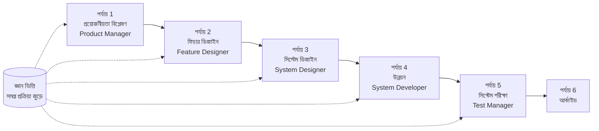

# SpecCrew - দ্রুত শুরু করার নির্দেশিকা

<p align="center">
  <a href="./GETTING-STARTED.md">简体中文</a> |
  <a href="./GETTING-STARTED.zh-TW.md">繁體中文</a> |
  <a href="./GETTING-STARTED.en.md">English</a> |
  <a href="./GETTING-STARTED.ko.md">한국어</a> |
  <a href="./GETTING-STARTED.de.md">Deutsch</a> |
  <a href="./GETTING-STARTED.es.md">Español</a> |
  <a href="./GETTING-STARTED.fr.md">Français</a> |
  <a href="./GETTING-STARTED.it.md">Italiano</a> |
  <a href="./GETTING-STARTED.da.md">Dansk</a> |
  <a href="./GETTING-STARTED.ja.md">日本語</a> |
  <a href="./GETTING-STARTED.ar.md">العربية</a> |
  <a href="./GETTING-STARTED.bn.md">বাংলা</a>
</p>

এই নথিটি আপনাকে SpecCrew এজেন্ট টিম কীভাবে ব্যবহার করে প্রয়োজনীয়তা থেকে ডেলিভারি পর্যন্ত সম্পূর্ণ উন্নয়ন চক্র সম্পন্ন করতে সাহায্য করে, মানক ইঞ্জিনিয়ারিং প্রক্রিয়া অনুসরণ করে।

---

## 1. প্রাকশর্ত

### SpecCrew ইনস্টল করুন

```bash
npm install -g speccrew
```

### প্রজেক্ট শুরু করুন

```bash
speccrew init --ide qoder
```

সমর্থিত IDE: `qoder`, `cursor`, `claude`, `codex`

### শুরু করার পরে ডিরেক্টরি কাঠামো

```
.
├── .qoder/
│   ├── agents/          # এজেন্ট সংজ্ঞা ফাইল
│   └── skills/          # স্কিল সংজ্ঞা ফাইল
├── speccrew-workspace/  # ওয়ার্কস্পেস
│   ├── docs/            # কনফিগারেশন, নিয়ম, টেমপ্লেট, সমাধান
│   ├── iterations/      # বর্তমান ইটারেশন
│   ├── iteration-archives/  # আর্কাইভ করা ইটারেশন
│   └── knowledges/      # জ্ঞান ভিত্তি
│       ├── base/        # মূল তথ্য (ডায়াগনস্টিক রিপোর্ট, প্রযুক্তিগত ঋণ)
│       ├── bizs/        # ব্যবসায়িক জ্ঞান ভিত্তি
│       └── techs/       # প্রযুক্তিগত জ্ঞান ভিত্তি
```

### CLI কমান্ড দ্রুত রেফারেন্স

| কমান্ড | বিবরণ |
|---------|-------------|
| `speccrew list` | উপলব্ধ সমস্ত এজেন্ট এবং স্কিল তালিকাভুক্ত করুন |
| `speccrew doctor` | ইনস্টলেশনের অখণ্ডতা পরীক্ষা করুন |
| `speccrew update` | প্রজেক্ট কনফিগারেশন সর্বশেষ সংস্করণে আপডেট করুন |
| `speccrew uninstall` | SpecCrew আনইনস্টল করুন |

---

## 2. ওয়ার্কফ্লো ওভারভিউ

### সম্পূর্ণ ফ্লো ডায়াগ্রাম



### মূল নীতিমালা

1. **পর্যায় নির্ভরতা**: প্রতিটি পর্যায়ের আউটপুট পরবর্তী পর্যায়ের ইনপুট
2. **চেকপয়েন্ট নিশ্চিতকরণ**: প্রতিটি পর্যায়ে একটি নিশ্চিতকরণ বিন্দু আছে যা চালিয়ে যাওয়ার আগে ব্যবহারকারীর অনুমোদন প্রয়োজন
3. **জ্ঞান ভিত্তি চালিত**: জ্ঞান ভিত্তি সমগ্র প্রক্রিয়া জুড়ে প্রবাহিত হয়, সমস্ত পর্যায়ের জন্য প্রসঙ্গ প্রদান করে

---

## 3. শূন্য পদক্ষেপ: প্রজেক্ট ডায়াগনস্টিক্স এবং জ্ঞান ভিত্তি শুরু করা

আনুষ্ঠানিক ইঞ্জিনিয়ারিং প্রক্রিয়া শুরু করার আগে, আপনাকে প্রজেক্টের জ্ঞান ভিত্তি শুরু করতে হবে।

### 3.1 প্রজেক্ট ডায়াগনস্টিক্স

**কথোপকথন উদাহরণ**:
```
@speccrew-team-leader প্রজেক্ট ডায়াগনস্টিক্স
```

**এজেন্ট কী করবে**:
- প্রজেক্ট কাঠামো স্ক্যান করুন
- প্রযুক্তি স্ট্যাক সনাক্ত করুন
- ব্যবসায়িক মডিউল চিহ্নিত করুন

**ডেলিভারেবল**:
```
speccrew-workspace/knowledges/base/diagnosis-reports/diagnosis-report-{date}.md
```

### 3.2 প্রযুক্তিগত জ্ঞান ভিত্তি শুরু করা

**কথোপকথন উদাহরণ**:
```
@speccrew-team-leader প্রযুক্তিগত জ্ঞান ভিত্তি শুরু করুন
```

**তিন-পর্যায় প্রক্রিয়া**:
1. প্ল্যাটফর্ম সনাক্তকরণ — প্রজেক্টে প্রযুক্তি প্ল্যাটফর্ম চিহ্নিত করুন
2. প্রযুক্তিগত ডকুমেন্টেশন তৈরি — প্রতিটি প্ল্যাটফর্মের জন্য প্রযুক্তিগত স্পেসিফিকেশন নথি তৈরি করুন
3. সূচক তৈরি — জ্ঞান ভিত্তি সূচক প্রতিষ্ঠা করুন

**ডেলিভারেবল**:
```
speccrew-workspace/knowledges/techs/{platform-id}/
├── tech-stack.md          # প্রযুক্তি স্ট্যাক সংজ্ঞা
├── architecture.md        # আর্কিটেকচার সম্মেলন
├── dev-spec.md            # উন্নয়ন স্পেসিফিকেশন
├── test-spec.md           # পরীক্ষার স্পেসিফিকেশন
└── INDEX.md               # সূচক ফাইল
```

### 3.3 ব্যবসায়িক জ্ঞান ভিত্তি শুরু করা

**কথোপকথন উদাহরণ**:
```
@speccrew-team-leader ব্যবসায়িক জ্ঞান ভিত্তি শুরু করুন
```

**চার-পর্যায় প্রক্রিয়া**:
1. ফিচার ইনভেন্টরি — সমস্ত ফিচার চিহ্নিত করতে কোড স্ক্যান করুন
2. ফিচার বিশ্লেষণ — প্রতিটি ফিচারের ব্যবসায়িক যুক্তি বিশ্লেষণ করুন
3. মডিউল সারসংক্ষেপ — মডিউল অনুযায়ী ফিচার সারসংক্ষেপ করুন
4. সিস্টেম সারসংক্ষেপ — সিস্টেম স্তরে ব্যবসায়িক ওভারভিউ তৈরি করুন

**ডেলিভারেবল**:
```
speccrew-workspace/knowledges/bizs/
├── {platform-type}/
│   └── {module-name}/
│       └── feature-spec.md
└── system-overview.md
```

---

## 4. পর্যায়-ক্রমিক কথোপকথন নির্দেশিকা

### 4.1 পর্যায় 1: প্রয়োজনীয়তা বিশ্লেষণ (Product Manager)

**কীভাবে শুরু করবেন**:
```
@speccrew-product-manager আমার একটি নতুন প্রয়োজনীয়তা আছে: [আপনার প্রয়োজনীয়তা বর্ণনা করুন]
```

**এজেন্ট ওয়ার্কফ্লো**:
1. বিদ্যমান মডিউল বোঝার জন্য সিস্টেম ওভারভিউ পড়ুন
2. ব্যবহারকারীর প্রয়োজনীয়তা বিশ্লেষণ করুন
3. কাঠামোগত PRD নথি তৈরি করুন

**ডেলিভারেবল**:
```
iterations/{নম্বর}-{টাইপ}-{নাম}/01.product-requirement/
├── [feature-name]-prd.md           # প্রোডাক্ট রিকোয়ারমেন্ট ডকুমেন্ট
└── [feature-name]-bizs-modeling.md # ব্যবসায়িক মডেলিং (জটিল প্রয়োজনীয়তার জন্য)
```

**নিশ্চিতকরণ চেকলিস্ট**:
- [ ] প্রয়োজনীয়তার বিবরণ ব্যবহারকারীর উদ্দেশ্য সঠিকভাবে প্রতিফলিত করে?
- [ ] ব্যবসায়িক নিয়ম সম্পূর্ণ?
- [ ] বিদ্যমান সিস্টেমের সাথে ইন্টিগ্রেশন পয়েন্ট স্পষ্ট?
- [ ] গ্রহণযোগ্যতার মান পরিমাপযোগ্য?

---

### 4.2 পর্যায় 2: ফিচার ডিজাইন (Feature Designer)

**কীভাবে শুরু করবেন**:
```
@speccrew-feature-designer ফিচার ডিজাইন শুরু করুন
```

**এজেন্ট ওয়ার্কফ্লো**:
1. স্বয়ংক্রিয়ভাবে নিশ্চিত করা PRD নথি খুঁজুন
2. ব্যবসায়িক জ্ঞান ভিত্তি লোড করুন
3. ফিচার ডিজাইন তৈরি করুন (UI ওয়্যারফ্রেম, ইন্টারঅ্যাকশন ফ্লো, ডেটা সংজ্ঞা, API কন্ট্রাক্ট সহ)
4. একাধিক PRD এর জন্য সমান্তরাল ডিজাইনের জন্য Task Worker ব্যবহার করুন

**ডেলিভারেবল**:
```
iterations/{iter}/02.feature-design/
└── [feature-name]-feature-spec.md  # ফিচার ডিজাইন ডকুমেন্ট
```

**নিশ্চিতকরণ চেকলিস্ট**:
- [ ] সমস্ত ব্যবহারকারী পরিস্থিতি কভার করা হয়েছে?
- [ ] ইন্টারঅ্যাকশন ফ্লো স্পষ্ট?
- [ ] ডেটা ফিল্ড সংজ্ঞা সম্পূর্ণ?
- [ ] ব্যতিক্রম পরিচালনা ব্যাপক?

---

### 4.3 পর্যায় 3: সিস্টেম ডিজাইন (System Designer)

**কীভাবে শুরু করবেন**:
```
@speccrew-system-designer সিস্টেম ডিজাইন শুরু করুন
```

**এজেন্ট ওয়ার্কফ্লো**:
1. Feature Spec এবং API Contract খুঁজুন
2. প্রযুক্তিগত জ্ঞান ভিত্তি লোড করুন (প্রযুক্তি স্ট্যাক, আর্কিটেকচার, প্রতিটি প্ল্যাটফর্মের স্পেসিফিকেশন)
3. **চেকপয়েন্ট A**: ফ্রেমওয়ার্ক মূল্যায়ন — প্রযুক্তিগত ফাঁক বিশ্লেষণ, নতুন ফ্রেমওয়ার্ক সুপারিশ (প্রয়োজনে), ব্যবহারকারীর নিশ্চিতকরণের জন্য অপেক্ষা করুন
4. DESIGN-OVERVIEW.md তৈরি করুন
5. প্রতিটি প্ল্যাটফর্মের জন্য সমান্তরাল ডিজাইন ডিসপ্যাচের জন্য Task Worker ব্যবহার করুন (frontend/backend/mobile/desktop)
6. **চেকপয়েন্ট B**: যৌথ নিশ্চিতকরণ — সমস্ত প্ল্যাটফর্ম ডিজাইনের সারসংক্ষেপ দেখান, ব্যবহারকারীর নিশ্চিতকরণের জন্য অপেক্ষা করুন

**ডেলিভারেবল**:
```
iterations/{iter}/03.system-design/
├── DESIGN-OVERVIEW.md              # ডিজাইন ওভারভিউ
├── {platform-id}/
│   ├── INDEX.md                    # প্ল্যাটফর্ম ডিজাইন সূচক
│   └── {module}-design.md          # সিউডোকোড স্তরে মডিউল ডিজাইন
```

**নিশ্চিতকরণ চেকলিস্ট**:
- [ ] সিউডোকোড বাস্তব ফ্রেমওয়ার্ক সিনট্যাক্স ব্যবহার করে?
- [ ] ক্রস-প্ল্যাটফর্ম API কন্ট্রাক্ট সামঞ্জস্যপূর্ণ?
- [ ] ত্রুটি পরিচালনা কৌশল ঐক্যবদ্ধ?

---

### 4.4 পর্যায় 4: উন্নয়ন বাস্তবায়ন (System Developer)

**কীভাবে শুরু করবেন**:
```
@speccrew-system-developer উন্নয়ন শুরু করুন
```

**এজেন্ট ওয়ার্কফ্লো**:
1. সিস্টেম ডিজাইন নথি পড়ুন
2. প্রতিটি প্ল্যাটফর্মের জন্য প্রযুক্তিগত জ্ঞান লোড করুন
3. **চেকপয়েন্ট A**: পরিবেশ প্রি-ভেরিফিকেশন — রানটাইম সংস্করণ, নির্ভরতা, পরিষেবা প্রাপ্যতা যাচাই করুন; ব্যর্থ হলে ব্যবহারকারীর সমাধানের জন্য অপেক্ষা করুন
4. প্রতিটি প্ল্যাটফর্মের জন্য সমান্তরাল উন্নয়ন ডিসপ্যাচের জন্য Task Worker ব্যবহার করুন
5. ইন্টিগ্রেশন যাচাইকরণ: API কন্ট্রাক্ট প্রান্তিককরণ, ডেটা সামঞ্জস্য
6. ডেলিভারি রিপোর্ট আউটপুট করুন

**ডেলিভারেবল**:
```
# সোর্স কোড প্রকৃত প্রজেক্ট সোর্স কোড ডিরেক্টরিতে লেখা হয়
iterations/{iter}/04.development/
├── {platform-id}/
│   └── tasks/                      # উন্নয়ন টাস্ক রেকর্ড
└── delivery-report.md
```

**নিশ্চিতকরণ চেকলিস্ট**:
- [ ] পরিবেশ প্রস্তুত?
- [ ] ইন্টিগ্রেশন সমস্যা গ্রহণযোগ্য পরিসরে?
- [ ] কোড উন্নয়ন স্পেসিফিকেশন মেনে চলে?

---

### 4.5 পর্যায় 5: সিস্টেম পরীক্ষা (Test Manager)

**কীভাবে শুরু করবেন**:
```
@speccrew-test-manager পরীক্ষা শুরু করুন
```

**তিন-পর্যায় পরীক্ষা প্রক্রিয়া**:

| পর্যায় | বিবরণ | চেকপয়েন্ট |
|------|----------|-------------------|
| পরীক্ষার কেস ডিজাইন | PRD এবং Feature Spec এর উপর ভিত্তি করে পরীক্ষার কেস তৈরি করুন | A: কেস কভারেজ পরিসংখ্যান এবং ট্রেসেবিলিটি ম্যাট্রিক্স দেখান, পর্যাপ্ত কভারেজের জন্য ব্যবহারকারীর নিশ্চিতকরণের জন্য অপেক্ষা করুন |
| পরীক্ষার কোড তৈরি | এক্সিকিউটেবল পরীক্ষার কোড তৈরি করুন | B: তৈরি করা পরীক্ষার ফাইল এবং কেস ম্যাপিং দেখান, ব্যবহারকারীর নিশ্চিতকরণের জন্য অপেক্ষা করুন |
| পরীক্ষা সম্পাদন এবং বাগ রিপোর্ট | স্বয়ংক্রিয়ভাবে পরীক্ষা সম্পাদন এবং রিপোর্ট তৈরি করুন | নেই (স্বয়ংক্রিয় সম্পাদন) |

**ডেলিভারেবল**:
```
iterations/{iter}/05.system-test/
├── cases/
│   └── {platform-id}/              # পরীক্ষার কেস নথি
├── code/
│   └── {platform-id}/              # পরীক্ষার কোড পরিকল্পনা
├── reports/
│   └── test-report-{date}.md       # পরীক্ষার রিপোর্ট
└── bugs/
    └── BUG-{id}-{title}.md         # বাগ রিপোর্ট (প্রতিটি বাগের জন্য একটি ফাইল)
```

**নিশ্চিতকরণ চেকলিস্ট**:
- [ ] কেস কভারেজ সম্পূর্ণ?
- [ ] পরীক্ষার কোড এক্সিকিউটেবল?
- [ ] বাগ গুরুত্ব মূল্যায়ন সঠিক?

---

### 4.6 পর্যায় 6: আর্কাইভিং

ইটারেশন সম্পন্ন হলে স্বয়ংক্রিয়ভাবে আর্কাইভ করা হয়:

```
speccrew-workspace/iteration-archives/
└── {নম্বর}-{টাইপ}-{নাম}-{তারিখ}/
    ├── 01.product-requirement/
    ├── 02.feature-design/
    ├── 03.system-design/
    ├── 04.development/
    └── 05.system-test/
```

---

## 5. জ্ঞান ভিত্তি ওভারভিউ

### 5.1 ব্যবসায়িক জ্ঞান ভিত্তি (bizs)

**উদ্দেশ্য**: প্রজেক্টের ব্যবসায়িক ফাংশন বিবরণ, মডিউল বিভাজন, API বৈশিষ্ট্য সংরক্ষণ করুন

**ডিরেক্টরি কাঠামো**:
```
knowledges/bizs/
├── {platform-type}/
│   └── {module-name}/
│       └── feature-spec.md
└── system-overview.md
```

**ব্যবহারের পরিস্থিতি**: Product Manager, Feature Designer

### 5.2 প্রযুক্তিগত জ্ঞান ভিত্তি (techs)

**উদ্দেশ্য**: প্রজেক্টের প্রযুক্তি স্ট্যাক, আর্কিটেকচার সম্মেলন, উন্নয়ন স্পেসিফিকেশন, পরীক্ষার স্পেসিফিকেশন সংরক্ষণ করুন

**ডিরেক্টরি কাঠামো**:
```
knowledges/techs/{platform-id}/
├── tech-stack.md
├── architecture.md
├── dev-spec.md
├── test-spec.md
└── INDEX.md
```

**ব্যবহারের পরিস্থিতি**: System Designer, System Developer, Test Manager

---

## 6. প্রায়শই জিজ্ঞাসিত প্রশ্ন (FAQ)

### প্র১: এজেন্ট প্রত্যাশিতভাবে কাজ না করলে কী করবেন?

1. ইনস্টলেশনের অখণ্ডতা পরীক্ষা করতে `speccrew doctor` চালান
2. জ্ঞান ভিত্তি শুরু করা হয়েছে তা নিশ্চিত করুন
3. পূর্ববর্তী পর্যায়ের ডেলিভারেবল বর্তমান ইটারেশন ডিরেক্টরিতে存在 তা নিশ্চিত করুন

### প্র২: একটি পর্যায় কীভাবে এড়িয়ে যাবেন?

**সুপারিশ করা হয় না** — প্রতিটি পর্যায়ের আউটপুট পরবর্তী পর্যায়ের ইনপুট।

এড়াতে হলে, সংশ্লিষ্ট পর্যায়ের ইনপুট নথি ম্যানুয়ালি প্রস্তুত করুন এবং এটি ফরম্যাট স্পেসিফিকেশন মেনে চলে তা নিশ্চিত করুন।

### প্র৩: একাধিক সমান্তরাল প্রয়োজনীয়তা কীভাবে পরিচালনা করবেন?

প্রতিটি প্রয়োজনীয়তার জন্য স্বতন্ত্র ইটারেশন ডিরেক্টরি তৈরি করুন:
```
iterations/
├── 001-feature-xxx/
├── 002-feature-yyy/
└── 003-feature-zzz/
```

প্রতিটি ইটারেশন সম্পূর্ণ বিচ্ছিন্ন এবং অন্যদের প্রভাবিত করে না।

### প্র৪: SpecCrew সংস্করণ কীভাবে আপডেট করবেন?

আপডেট দুটি ধাপে সম্পন্ন হয়:

```bash
# ধাপ ১: গ্লোবাল CLI টুল আপডেট করুন
npm install -g speccrew@latest

# ধাপ ২: প্রজেক্ট ডিরেক্টরিতে Agents এবং Skills সিঙ্ক করুন
cd /path/to/your-project
speccrew update
```

- `npm install -g speccrew@latest`: CLI টুল নিজেই আপডেট করে (নতুন সংস্করণে নতুন Agent/Skill সংজ্ঞা, বাগ ফিক্স ইত্যাদি থাকতে পারে)
- `speccrew update`: প্রজেক্টের Agent এবং Skill সংজ্ঞা ফাইলগুলি সর্বশেষ সংস্করণে সিঙ্ক করে
- `speccrew update --ide cursor`: শুধুমাত্র নির্দিষ্ট IDE এর কনফিগারেশন আপডেট করে

> **নোট**: উভয় ধাপই সম্পাদন করতে হবে। শুধুমাত্র `speccrew update` চালালে CLI টুল আপডেট হবে না; শুধুমাত্র `npm install` চালালে প্রজেক্টের ফাইলগুলি আপডেট হবে না।

### প্র৫: ঐতিহাসিক ইটারেশন কীভাবে দেখবেন?

আর্কাইভ করার পরে, `speccrew-workspace/iteration-archives/` এ দেখুন, `{নম্বর}-{টাইপ}-{নাম}-{তারিখ}/` ফরম্যাটে সংগঠিত।

### প্র৬: জ্ঞান ভিত্তির নিয়মিত আপডেট প্রয়োজন?

নিম্নলিখিত পরিস্থিতিতে পুনরায় শুরু করা প্রয়োজন:
- প্রজেক্ট কাঠামোতে উল্লেখযোগ্য পরিবর্তন
- প্রযুক্তি স্ট্যাক আপডেট বা প্রতিস্থাপন
- ব্যবসায়িক মডিউল যোগ/অপসারণ

---

## 7. দ্রুত রেফারেন্স

### এজেন্ট শুরু করার দ্রুত রেফারেন্স

| পর্যায় | এজেন্ট | শুরুর কথোপকথন |
|------|-------|-------------------|
| ডায়াগনস্টিক্স | Team Leader | `@speccrew-team-leader প্রজেক্ট ডায়াগনস্টিক্স` |
| শুরু করা | Team Leader | `@speccrew-team-leader প্রযুক্তিগত জ্ঞান ভিত্তি শুরু করুন` |
| প্রয়োজনীয়তা বিশ্লেষণ | Product Manager | `@speccrew-product-manager আমার একটি নতুন প্রয়োজনীয়তা আছে: [বিবরণ]` |
| ফিচার ডিজাইন | Feature Designer | `@speccrew-feature-designer ফিচার ডিজাইন শুরু করুন` |
| সিস্টেম ডিজাইন | System Designer | `@speccrew-system-designer সিস্টেম ডিজাইন শুরু করুন` |
| উন্নয়ন | System Developer | `@speccrew-system-developer উন্নয়ন শুরু করুন` |
| সিস্টেম পরীক্ষা | Test Manager | `@speccrew-test-manager পরীক্ষা শুরু করুন` |

### চেকপয়েন্ট চেকলিস্ট

| পর্যায় | চেকপয়েন্ট সংখ্যা | মূল যাচাইকরণ উপাদান |
|------|------------------------|------------------------|
| প্রয়োজনীয়তা বিশ্লেষণ | 1 | প্রয়োজনীয়তা নির্ভুলতা, ব্যবসায়িক নিয়ম সম্পূর্ণতা, গ্রহণযোগ্যতার মান পরিমাপযোগ্যতা |
| ফিচার ডিজাইন | 1 | পরিস্থিতি কভারেজ, ইন্টারঅ্যাকশন স্বচ্ছতা, ডেটা সম্পূর্ণতা, ব্যতিক্রম পরিচালনা |
| সিস্টেম ডিজাইন | 2 | A: ফ্রেমওয়ার্ক মূল্যায়ন; B: সিউডোকোড সিনট্যাক্স, ক্রস-প্ল্যাটফর্ম সামঞ্জস্য, ত্রুটি পরিচালনা |
| উন্নয়ন | 1 | A: পরিবেশ প্রস্তুতি, ইন্টিগ্রেশন সমস্যা, কোড স্পেসিফিকেশন |
| সিস্টেম পরীক্ষা | 2 | A: কেস কভারেজ; B: পরীক্ষার কোড এক্সিকিউটেবিলিটি |

### ডেলিভারেবল পথ দ্রুত রেফারেন্স

| পর্যায় | আউটপুট ডিরেক্টরি | ফাইল ফরম্যাট |
|------|------------------|-------------|
| প্রয়োজনীয়তা বিশ্লেষণ | `iterations/{iter}/01.product-requirement/` | `[name]-prd.md`, `[name]-bizs-modeling.md` |
| ফিচার ডিজাইন | `iterations/{iter}/02.feature-design/` | `[name]-feature-spec.md` |
| সিস্টেম ডিজাইন | `iterations/{iter}/03.system-design/` | `DESIGN-OVERVIEW.md`, `{platform}/INDEX.md`, `{platform}/{module}-design.md` |
| উন্নয়ন | `iterations/{iter}/04.development/` | সোর্স কোড + `delivery-report.md` |
| সিস্টেম পরীক্ষা | `iterations/{iter}/05.system-test/` | `cases/`, `code/`, `reports/`, `bugs/` |
| আর্কাইভিং | `iteration-archives/{iter}-{তারিখ}/` | ইটারেশনের সম্পূর্ণ কপি |

---

## পরবর্তী পদক্ষেপ

1. আপনার প্রজেক্ট শুরু করতে `speccrew init --ide qoder` চালান
2. শূন্য পদক্ষেপ সম্পাদন করুন: প্রজেক্ট ডায়াগনস্টিক্স এবং জ্ঞান ভিত্তি শুরু করা
3. ওয়ার্কফ্লো অনুসরণ করে প্রতিটি পর্যায়ের মধ্যে এগিয়ে যান, স্পেসিফিকেশন-চালিত উন্নয়ন অভিজ্ঞতা উপভোগ করুন!
