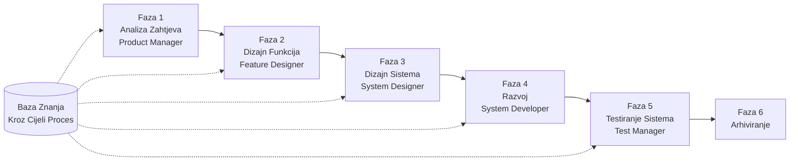

# SpecCrew - Vodič za Brzi Početak

<p align="center">
  <a href="./GETTING-STARTED.md">简体中文</a> |
  <a href="./GETTING-STARTED.zh-TW.md">繁體中文</a> |
  <a href="./GETTING-STARTED.en.md">English</a> |
  <a href="./GETTING-STARTED.ko.md">한국어</a> |
  <a href="./GETTING-STARTED.de.md">Deutsch</a> |
  <a href="./GETTING-STARTED.es.md">Español</a> |
  <a href="./GETTING-STARTED.fr.md">Français</a> |
  <a href="./GETTING-STARTED.it.md">Italiano</a> |
  <a href="./GETTING-STARTED.da.md">Dansk</a> |
  <a href="./GETTING-STARTED.ja.md">日本語</a> |
  <a href="./GETTING-STARTED.ar.md">العربية</a> |
  <a href="./GETTING-STARTED.bs.md">Bosanski</a>
</p>

Ovaj dokument vam pomaže da brzo razumijete kako koristiti SpecCrew Agent tim za završetak punog ciklusa razvoja od zahtjeva do isporuke, prateći standardne inženjerske procese.

---

## 1. Preduslovi

### Instalacija SpecCrew

```bash
npm install -g speccrew
```

### Inicijalizacija Projekta

```bash
speccrew init --ide qoder
```

Podržani IDE-ovi: `qoder`, `cursor`, `claude`, `codex`

### Struktura Direktorija Nakon Inicijalizacije

```
.
├── .qoder/
│   ├── agents/          # Fajlovi definicije Agenata
│   └── skills/          # Fajlovi definicije Sposobnosti
├── speccrew-workspace/  # Radni prostor
│   ├── docs/            # Konfiguracije, pravila, šabloni, rješenja
│   ├── iterations/      # Trenutne iteracije
│   ├── iteration-archives/  # Arhivirane iteracije
│   └── knowledges/      # Baza znanja
│       ├── base/        # Osnovne informacije (dijagnostički izvještaji, tehnički dugovi)
│       ├── bizs/        # Poslovna baza znanja
│       └── techs/       # Tehnička baza znanja
```

### CLI Komanda Brza Referenca

| Komanda | Opis |
|---------|-------------|
| `speccrew list` | Lista svih dostupnih Agenata i Sposobnosti |
| `speccrew doctor` | Provjerite integritet instalacije |
| `speccrew update` | Ažurirajte konfiguraciju projekta na najnoviju verziju |
| `speccrew uninstall` | Deinstalirajte SpecCrew |

---

## 2. Pregled Radnog Toka

### Potpuni Dijagram Toka



### Osnovni Principi

1. **Ovisnosti Faza**: Izlaz svake faze je ulaz za sljedeću fazu
2. **Potvrda Kontrolne Tačke**: Svaka faza ima tačku potvrde koja zahtijeva odobrenje korisnika prije nastavka
3. **Pokretano Bazom Znanja**: Baza znanja prolazi kroz cijeli proces, pružajući kontekst za sve faze

---

## 3. Nulti Korak: Dijagnostika Projekta i Inicijalizacija Baze Znanja

Prije pokretanja formalnog inženjerskog procesa, morate inicijalizirati bazu znanja projekta.

### 3.1 Dijagnostika Projekta

**Primjer Razgovora**:
```
@speccrew-team-leader dijagnosticiraj projekt
```

**Šta će Agent Uraditi**:
- Skeniranje strukture projekta
- Otkrivanje tehnološkog steka
- Identifikacija poslovnih modula

**Isporuka**:
```
speccrew-workspace/knowledges/base/diagnosis-reports/diagnosis-report-{date}.md
```

### 3.2 Inicijalizacija Tehničke Baze Znanja

**Primjer Razgovora**:
```
@speccrew-team-leader inicijaliziraj tehničku bazu znanja
```

**Trofazni Proces**:
1. Otkrivanje Platforme — Identifikacija tehnoloških platformi u projektu
2. Generisanje Tehničke Dokumentacije — Generisanje dokumenata tehničkih specifikacija za svaku platformu
3. Generisanje Indeksa — Uspostavljanje indeksa baze znanja

**Isporuka**:
```
speccrew-workspace/knowledges/techs/{platform-id}/
├── tech-stack.md          # Definicija tehnološkog steka
├── architecture.md        # Arhitektonske konvencije
├── dev-spec.md            # Specifikacije razvoja
├── test-spec.md           # Specifikacije testiranja
└── INDEX.md               # Fajl indeksa
```

### 3.3 Inicijalizacija Poslovne Baze Znanja

**Primjer Razgovora**:
```
@speccrew-team-leader inicijaliziraj poslovnu bazu znanja
```

**Četverofazni Proces**:
1. Inventar Funkcija — Skeniranje koda za identifikaciju svih funkcija
2. Analiza Funkcija — Analiza poslovne logike svake funkcije
3. Sažetak Modula — Sumiranje funkcija po modulima
4. Sažetak Sistema — Generisanje poslovnog pregleda na nivou sistema

**Isporuka**:
```
speccrew-workspace/knowledges/bizs/
├── {platform-type}/
│   └── {module-name}/
│       └── feature-spec.md
└── system-overview.md
```

---

## 4. Vodič za Razgovor Fazu po Fazu

### 4.1 Faza 1: Analiza Zahtjeva (Product Manager)

**Kako Početi**:
```
@speccrew-product-manager imam novi zahtjev: [opišite svoj zahtjev]
```

**Radni Tok Agenta**:
1. Pročitajte pregled sistema da razumijete postojeće module
2. Analizirajte zahtjeve korisnika
3. Generišite strukturirani PRD dokument

**Isporuka**:
```
iterations/{broj}-{tip}-{ime}/01.product-requirement/
├── [feature-name]-prd.md           # Dokument Zahtjeva Proizvoda
└── [feature-name]-bizs-modeling.md # Poslovno modeliranje (za složene zahtjeve)
```

**Kontrolna Lista Potvrde**:
- [ ] Da li opis zahtjeva tačno odražava namjeru korisnika?
- [ ] Da li su poslovna pravila kompletna?
- [ ] Da li su integracione tačke sa postojećim sistemima jasne?
- [ ] Da li su kriteriji prihvatanja mjerljivi?

---

### 4.2 Faza 2: Dizajn Funkcija (Feature Designer)

**Kako Početi**:
```
@speccrew-feature-designer započni dizajn funkcija
```

**Radni Tok Agenta**:
1. Automatski locirajte potvrđeni PRD dokument
2. Učitajte poslovnu bazu znanja
3. Generišite dizajn funkcija (uključujući UI wireframe-ove, tokove interakcije, definicije podataka, API ugovore)
4. Za više PRD-ova, koristite Task Worker za paralelni dizajn

**Isporuka**:
```
iterations/{iter}/02.feature-design/
└── [feature-name]-feature-spec.md  # Dokument dizajna funkcija
```

**Kontrolna Lista Potvrde**:
- [ ] Da li su svi korisnički scenariji pokriveni?
- [ ] Da li su tokovi interakcije jasni?
- [ ] Da li su definicije polja podataka kompletne?
- [ ] Da li je rukovanje izuzecima sveobuhvatno?

---

### 4.3 Faza 3: Dizajn Sistema (System Designer)

**Kako Početi**:
```
@speccrew-system-designer započni dizajn sistema
```

**Radni Tok Agenta**:
1. Locirajte Feature Spec i API Contract
2. Učitajte tehničku bazu znanja (tehnološki stek, arhitektura, specifikacije za svaku platformu)
3. **Kontrolna Tačka A**: Evaluacija Okvira — Analiza tehničkih praznina, preporuka novih okvira (ako je potrebno), čekanje potvrde korisnika
4. Generišite DESIGN-OVERVIEW.md
5. Koristite Task Worker za paralelnu distribuciju dizajna za svaku platformu (frontend/backend/mobile/desktop)
6. **Kontrolna Tačka B**: Zajednička Potvrda — Prikažite sažetak svih dizajna platformi, čekajte potvrdu korisnika

**Isporuka**:
```
iterations/{iter}/03.system-design/
├── DESIGN-OVERVIEW.md              # Pregled dizajna
├── {platform-id}/
│   ├── INDEX.md                    # Indeks dizajna platforme
│   └── {module}-design.md          # Dizajn modula na nivou pseudokoda
```

**Kontrolna Lista Potvrde**:
- [ ] Da li pseudokod koristi stvarnu sintaksu okvira?
- [ ] Da li su cross-platform API ugovori konzistentni?
- [ ] Da li je strategija rukovanja greškama ujedinjena?

---

### 4.4 Faza 4: Implementacija Razvoja (System Developer)

**Kako Početi**:
```
@speccrew-system-developer započni razvoj
```

**Radni Tok Agenta**:
1. Pročitajte dokumente dizajna sistema
2. Učitajte tehničko znanje za svaku platformu
3. **Kontrolna Tačka A**: Pred-verifikacija Okruženja — Verifikacija runtime verzija, zavisnosti, dostupnosti usluga; ako ne uspije, čekanje rješenja korisnika
4. Koristite Task Worker za paralelnu distribuciju razvoja za svaku platformu
5. Verifikacija integracije: Poravnanje API ugovora, konzistentnost podataka
6. Izlaz izvještaj o isporuci

**Isporuka**:
```
# Izvorni kod se piše u stvarni direktorij izvornog koda projekta
iterations/{iter}/04.development/
├── {platform-id}/
│   └── tasks/                      # Zapisi razvojnih zadataka
└── delivery-report.md
```

**Kontrolna Lista Potvrde**:
- [ ] Da li je okruženje spremno?
- [ ] Da li su integracioni problemi u prihvatljivom opsegu?
- [ ] Da li kod prati specifikacije razvoja?

---

### 4.5 Faza 5: Testiranje Sistema (Test Manager)

**Kako Početi**:
```
@speccrew-test-manager započni testiranje
```

**Trofazni Proces Testiranja**:

| Faza | Opis | Kontrolna Tačka |
|------|------|-------------------|
| Dizajn Test Slučajeva | Generisanje test slučajeva na osnovu PRD i Feature Spec | A: Prikažite statistiku pokrivenosti slučajeva i matricu sljedivosti, čekajte potvrdu korisnika o dovoljnoj pokrivenosti |
| Generisanje Test Koda | Generisanje izvršnog test koda | B: Prikažite generisane test fajlove i mapiranje slučajeva, čekajte potvrdu korisnika |
| Izvršavanje Testa i Izvještaj o Greškama | Automatsko izvršavanje testova i generisanje izvještaja | Nema (automatsko izvršavanje) |

**Isporuka**:
```
iterations/{iter}/05.system-test/
├── cases/
│   └── {platform-id}/              # Dokumenti test slučajeva
├── code/
│   └── {platform-id}/              # Plan test koda
├── reports/
│   └── test-report-{date}.md       # Izvještaj o testiranju
└── bugs/
    └── BUG-{id}-{title}.md         # Izvještaji o greškama (jedan fajl po grešci)
```

**Kontrolna Lista Potvrde**:
- [ ] Da li je pokrivenost slučajeva kompletna?
- [ ] Da li je test kod izvršiv?
- [ ] Da li je procjena ozbiljnosti grešaka tačna?

---

### 4.6 Faza 6: Arhiviranje

Iteracije se automatski arhiviraju kada se završe:

```
speccrew-workspace/iteration-archives/
└── {broj}-{tip}-{ime}-{datum}/
    ├── 01.product-requirement/
    ├── 02.feature-design/
    ├── 03.system-design/
    ├── 04.development/
    └── 05.system-test/
```

---

## 5. Pregled Baze Znanja

### 5.1 Poslovna Baza Znanja (bizs)

**Svrha**: Čuvanje opisa poslovnih funkcija projekta, podjela modula, API karakteristika

**Struktura Direktorija**:
```
knowledges/bizs/
├── {platform-type}/
│   └── {module-name}/
│       └── feature-spec.md
└── system-overview.md
```

**Scenariji Korištenja**: Product Manager, Feature Designer

### 5.2 Tehnička Baza Znanja (techs)

**Svrha**: Čuvanje tehnološkog steka projekta, arhitektonskih konvencija, specifikacija razvoja, specifikacija testiranja

**Struktura Direktorija**:
```
knowledges/techs/{platform-id}/
├── tech-stack.md
├── architecture.md
├── dev-spec.md
├── test-spec.md
└── INDEX.md
```

**Scenariji Korištenja**: System Designer, System Developer, Test Manager

---

## 6. Upravljanje Napretkom Radnog Toka

Virtuelni tim SpecCrew slijedi strog mehanizam faznih kapija, gdje svaka faza mora biti potvrđena od strane korisnika prije prelaska na sljedeću. Takođe podržava nastavljivu izvršnost — kada se ponovo pokrene nakon prekida, automatski nastavlja odakle je stao.

### 6.1 Trostruki Fajlovi Napretka

Radni tok automatski održava tri tipa JSON fajlova napretka, lociranih u direktoriju iteracije:

| Fajl | Lokacija | Svrha |
|------|----------|---------|
| `WORKFLOW-PROGRESS.json` | `iterations/{iter}/` | Bilježi status svake faze pipeline-a |
| `.checkpoints.json` | Ispod svakog direktorija faze | Bilježi status korisničke potvrde kontrolnih tačaka |
| `DISPATCH-PROGRESS.json` | Ispod svakog direktorija faze | Bilježi napredak tačka-po-tačka za paralelne zadatke (multi-platforma/multi-modul) |

### 6.2 Tok Statusa Faze

Svaka faza slijedi ovaj tok statusa:

```
pending → in_progress → completed → confirmed
```

- **pending**: Još nije započeto
- **in_progress**: Trenutno se izvršava
- **completed**: Izvršavanje Agenta završeno, čeka se korisnička potvrda
- **confirmed**: Korisnik potvrdio kroz konačnu kontrolnu tačku, sljedeća faza može započeti

### 6.3 Nastavljiva Izvršnost

Kada se Agent ponovo pokrene za fazu:

1. **Automatska uzvodna provjera**: Verificira da li je prethodna faza potvrđena, blokira i obavještava ako nije
2. **Oporavak kontrolnih tačaka**: Čita `.checkpoints.json`, preskače prođene kontrolne tačke, nastavlja od posljednje tačke prekida
3. **Oporavak paralelnih zadataka**: Čita `DISPATCH-PROGRESS.json`, ponovo izvršava samo zadatke sa `pending` ili `failed` statusom, preskače `completed` zadatke

### 6.4 Pregled Trenutnog Napretka

Prikaži status panorame pipeline-a kroz Team Leader Agent:

```
@speccrew-team-leader prikaži trenutni napredak iteracije
```

Team Leader će pročitati fajlove napretka i prikazati pregled statusa sličan:

```
Pipeline Status: i001-user-management
  01 PRD:            ✅ Potvrđeno
  02 Feature Design: 🔄 U toku (Kontrolna tačka A prođena)
  03 System Design:  ⏳ Na čekanju
  04 Development:    ⏳ Na čekanju
  05 System Test:    ⏳ Na čekanju
```

### 6.5 Unazad Kompatibilnost

Mehanizam fajlova napretka je potpuno unazad kompatibilan — ako fajlovi napretka ne postoje (npr. u starijim projektima ili novim iteracijama), svi Agenti će se normalno izvršavati u skladu sa originalnom logikom.

---

## 7. Često Postavljana Pitanja (FAQ)

### P1: Šta uraditi ako Agent ne radi kako se očekuje?

1. Pokrenite `speccrew doctor` da provjerite integritet instalacije
2. Potvrdite da je baza znanja inicijalizirana
3. Potvrdite da isporuka prethodne faze postoji u trenutnom direktoriju iteracije

### P2: Kako preskočiti fazu?

**Ne preporučuje se** — Izlaz svake faze je ulaz za sljedeću fazu.

Ako morate preskočiti, ručno pripremite ulazni dokument odgovarajuće faze i provjerite da prati specifikacije formata.

### P3: Kako upravljati višestrukim paralelnim zahtjevima?

Kreirajte nezavisne direktorije iteracija za svaki zahtjev:
```
iterations/
├── 001-feature-xxx/
├── 002-feature-yyy/
└── 003-feature-zzz/
```

Svaka iteracija je potpuno izolirana i ne utiče na druge.

### P4: Kako ažurirati verziju SpecCrew?

Ažuriranje se vrši u dva koraka:

```bash
# Korak 1: Ažurirajte globalni CLI alat
npm install -g speccrew@latest

# Korak 2: Sinhronizirajte Agente i Skill-ove u direktoriju projekta
cd /path/to/your-project
speccrew update
```

- `npm install -g speccrew@latest`: Ažurira sam CLI alat (nova verzija može sadržavati nove definicije Agent/Skill, ispravke bugova, itd.)
- `speccrew update`: Sinhronizira datoteke definicija Agenta i Skilla u projektu na najnoviju verziju
- `speccrew update --ide cursor`: Ažurira samo konfiguraciju navedenog IDE-a

> **Napomena**: Obje korake treba izvršiti. Samo izvršavanje `speccrew update` neće ažurirati sam CLI alat; samo izvršavanje `npm install` neće ažurirati datoteke u projektu.

### P5: Kako pogledati historijske iteracije?

Nakon arhiviranja, pogledajte u `speccrew-workspace/iteration-archives/`, organizirano u formatu `{broj}-{tip}-{ime}-{datum}/`.

### P6: Da li baza znanja treba redovno ažuriranje?

Ponovna inicijalizacija je potrebna u sljedećim situacijama:
- Značajne promjene u strukturi projekta
- Ažuriranje ili zamjena tehnološkog steka
- Dodavanje/uklanjanje poslovnih modula

---

## 8. Brza Referenca

### Brza Referenca Pokretanja Agenata

| Faza | Agent | Početni Razgovor |
|------|-------|-------------------|
| Dijagnostika | Team Leader | `@speccrew-team-leader dijagnosticiraj projekt` |
| Inicijalizacija | Team Leader | `@speccrew-team-leader inicijaliziraj tehničku bazu znanja` |
| Analiza Zahtjeva | Product Manager | `@speccrew-product-manager imam novi zahtjev: [opis]` |
| Dizajn Funkcija | Feature Designer | `@speccrew-feature-designer započni dizajn funkcija` |
| Dizajn Sistema | System Designer | `@speccrew-system-designer započni dizajn sistema` |
| Razvoj | System Developer | `@speccrew-system-developer započni razvoj` |
| Testiranje Sistema | Test Manager | `@speccrew-test-manager započni testiranje` |

### Kontrolna Lista Kontrolnih Tačaka

| Faza | Broj Kontrolnih Tačaka | Ključni Elementi Verifikacije |
|------|------------------------|--------------------------------|
| Analiza Zahtjeva | 1 | Tačnost zahtjeva, kompletnost poslovnih pravila, mjerljivost kriterija prihvatanja |
| Dizajn Funkcija | 1 | Pokrivenost scenarija, jasnoća interakcije, kompletnost podataka, rukovanje izuzecima |
| Dizajn Sistema | 2 | A: Evaluacija okvira; B: Sintaksa pseudokoda, cross-platform konzistentnost, rukovanje greškama |
| Razvoj | 1 | A: Spremnost okruženja, integracioni problemi, specifikacije koda |
| Testiranje Sistema | 2 | A: Pokrivenost slučajeva; B: Izvršivost test koda |

### Brza Referenca Putanja Isporuke

| Faza | Izlazni Direktorij | Format Fajla |
|------|------------------|-------------|
| Analiza Zahtjeva | `iterations/{iter}/01.product-requirement/` | `[name]-prd.md`, `[name]-bizs-modeling.md` |
| Dizajn Funkcija | `iterations/{iter}/02.feature-design/` | `[name]-feature-spec.md` |
| Dizajn Sistema | `iterations/{iter}/03.system-design/` | `DESIGN-OVERVIEW.md`, `{platform}/INDEX.md`, `{platform}/{module}-design.md` |
| Razvoj | `iterations/{iter}/04.development/` | Izvorni kod + `delivery-report.md` |
| Testiranje Sistema | `iterations/{iter}/05.system-test/` | `cases/`, `code/`, `reports/`, `bugs/` |
| Arhiviranje | `iteration-archives/{iter}-{datum}/` | Potpuna kopija iteracije |

---

## Sljedeći Koraci

1. Pokrenite `speccrew init --ide qoder` da inicijalizirate svoj projekt
2. Izvršite Nulti Korak: Dijagnostika Projekta i Inicijalizacija Baze Znanja
3. Napredujte kroz svaku fazu prateći radni tok, uživajte u iskustvu razvoja vođenog specifikacijama!
