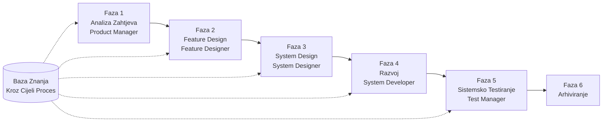

# SpecCrew Vodič za Brzi Početak

<p align="center">
  <a href="./GETTING-STARTED.md">简体中文</a> |
  <a href="./GETTING-STARTED.zh-TW.md">繁體中文</a> |
  <a href="./GETTING-STARTED.en.md">English</a> |
  <a href="./GETTING-STARTED.ko.md">한국어</a> |
  <a href="./GETTING-STARTED.de.md">Deutsch</a> |
  <a href="./GETTING-STARTED.es.md">Español</a> |
  <a href="./GETTING-STARTED.fr.md">Français</a> |
  <a href="./GETTING-STARTED.it.md">Italiano</a> |
  <a href="./GETTING-STARTED.da.md">Dansk</a> |
  <a href="./GETTING-STARTED.ja.md">日本語</a> |
  <a href="./GETTING-STARTED.ar.md">العربية</a>
</p>

Ovaj dokument vam pomaže da brzo razumijete kako koristiti SpecCrew Agent tim za završetak kompletnog razvoja od zahtjeva do isporuke prema standardnim inženjerskim procesima.

---

## 1. Preduvjeti

### Instalacija SpecCrew

```bash
npm install -g speccrew
```

### Inicijalizacija Projekta

```bash
speccrew init --ide qoder
```

Podržani IDE-ovi: `qoder`, `cursor`, `claude`, `codex`

### Struktura Direktorija Nakon Inicijalizacije

```
.
├── .qoder/
│   ├── agents/          # Datoteke definicije Agents
│   └── skills/          # Datoteke definicije Skills
├── speccrew-workspace/  # Workspace
│   ├── docs/            # Konfiguracije, pravila, šabloni, rješenja
│   ├── iterations/      # Trenutne iteracije
│   ├── iteration-archives/  # Arhivirane iteracije
│   └── knowledges/      # Baza znanja
│       ├── base/        # Osnovne informacije (dijagnostički izvještaji, tehnički dug)
│       ├── bizs/        # Poslovna baza znanja
│       └── techs/       # Tehnička baza znanja
```

### Brzi Pregled CLI Komandi

| Komanda | Opis |
|------|------|
| `speccrew list` | Lista svih dostupnih Agents i Skills |
| `speccrew doctor` | Provjera integriteta instalacije |
| `speccrew update` | Ažuriranje konfiguracije projekta na najnoviju verziju |
| `speccrew uninstall` | Deinstalacija SpecCrew |

---

## 2. Brzi Početak za 5 Minuta Nakon Instalacije

Nakon pokretanja `speccrew init`, slijedite ove korake za brzi ulazak u radno stanje:

### Korak 1: Odaberite Vaš IDE

| IDE | Komanda Inicijalizacije | Scenario Primjene |
|-----|-----------|----------|
| **Qoder** (Preporučeno) | `speccrew init --ide qoder` | Potpuna orkestracija agenata, paralelni workeri |
| **Cursor** | `speccrew init --ide cursor` | Workflows bazirani na Composer |
| **Claude Code** | `speccrew init --ide claude` | CLI-first razvoj |
| **Codex** | `speccrew init --ide codex` | Integracija OpenAI ekosistema |

### Korak 2: Inicijalizacija Baze Znanja (Preporučeno)

Za projekte sa postojećim izvornim kodom, preporučuje se prvo inicijalizacija baze znanja kako bi agenti razumjeli vašu kôd bazu:

```
@speccrew-team-leader inicijalizuj tehničku bazu znanja
```

Zatim:

```
@speccrew-team-leader inicijalizuj poslovnu bazu znanja
```

### Korak 3: Započnite Vaš Prvi Zadatak

```
@speccrew-product-manager Imam novi zahtjev: [opišite vaš funkcionalni zahtjev]
```

> **Savjet**: Ako niste sigurni šta raditi, samo recite `@speccrew-team-leader pomozite mi da počnem` — Team Leader će automatski detektovati status vašeg projekta i voditi vas.

---

## 3. Brzo Stablo Odlučivanja

Niste sigurni šta raditi? Pronađite vaš scenario ispod:

- **Imam novi funkcionalni zahtjev**
  → `@speccrew-product-manager Imam novi zahtjev: [opišite vaš funkcionalni zahtjev]`

- **Želim skenirati znanje postojećeg projekta**
  → `@speccrew-team-leader inicijalizuj tehničku bazu znanja`
  → Zatim: `@speccrew-team-leader inicijalizuj poslovnu bazu znanja`

- **Želim nastaviti prethodni rad**
  → `@speccrew-team-leader koji je trenutni napredak?`

- **Želim provjeriti zdravstveno stanje sistema**
  → Pokrenuti u terminalu: `speccrew doctor`

- **Nisam siguran šta raditi**
  → `@speccrew-team-leader pomozite mi da počnem`
  → Team Leader će automatski detektovati status vašeg projekta i voditi vas

---

## 4. Brzi Pregled Agenata

| Uloga | Agent | Odgovornosti | Primjer Komande |
|------|-------|-----------------|-----------------|
| Vođa Tima | `@speccrew-team-leader` | Navigacija projektom, inicijalizacija baze znanja, provjera statusa | "Pomozite mi da počnem" |
| Menadžer Proizvoda | `@speccrew-product-manager` | Analiza zahtjeva, generisanje PRD | "Imam novi zahtjev: ..." |
| Dizajner Funkcija | `@speccrew-feature-designer` | Analiza funkcija, dizajn specifikacija, API ugovori | "Započni dizajn funkcija za iteraciju X" |
| Sistemski Dizajner | `@speccrew-system-designer` | Dizajn arhitekture, detaljni dizajn platforme | "Započni sistemski dizajn za iteraciju X" |
| Sistemski Programer | `@speccrew-system-developer` | Koordinacija razvoja, generisanje koda | "Započni razvoj za iteraciju X" |
| Menadžer Testiranja | `@speccrew-test-manager` | Planiranje testiranja, dizajn slučajeva, izvršenje | "Započni testiranje za iteraciju X" |

> **Napomena**: Ne trebate pamtiti sve agente. Samo razgovarajte sa `@speccrew-team-leader` i on će usmjeriti vaš zahtjev pravom agentu.

---

## 5. Pregled Radnog Procesa

### Kompletni Dijagram Toka



### Osnovni Principi

1. **Ovisnosti Faza**: Rezultat svake faze je ulaz za sljedeću fazu
2. **Potvrda Checkpointa**: Svaka faza ima tačku potvrde koja zahtijeva odobrenje korisnika prije prelaska na sljedeću fazu
3. **Vođeno Bazom Znanja**: Baza znanja prolazi kroz cijeli proces, pružajući kontekst za sve faze

---

## 6. Korak Nula: Inicijalizacija Baze Znanja

Prije pokretanja formalnog inženjerskog procesa, morate inicijalizovati bazu znanja projekta.

### 6.1 Inicijalizacija Tehničke Baze Znanja

**Primjer Razgovora**:
```
@speccrew-team-leader inicijalizuj tehničku bazu znanja
```

**Trofazni Proces**:
1. Detekcija Platforme — Identifikacija tehničkih platformi u projektu
2. Generisanje Tehničke Dokumentacije — Generisanje dokumenata tehničkih specifikacija za svaku platformu
3. Generisanje Indeksa — Uspostavljanje indeksa baze znanja

**Rezultat**:
```
speccrew-workspace/knowledges/techs/{platform-id}/
├── tech-stack.md          # Definicija tehnološkog steka
├── architecture.md        # Arhitektonske konvencije
├── dev-spec.md            # Specifikacije razvoja
├── test-spec.md           # Specifikacije testiranja
└── INDEX.md               # Datoteka indeksa
```

### 6.2 Inicijalizacija Poslovne Baze Znanja

**Primjer Razgovora**:
```
@speccrew-team-leader inicijalizuj poslovnu bazu znanja
```

**Četverofazni Proces**:
1. Inventar Funkcija — Skeniranje koda za identifikaciju svih funkcija
2. Analiza Funkcija — Analiza poslovne logike za svaku funkciju
3. Sažetak Modula — Sažetak funkcija po modulu
4. Sistemski Sažetak — Generisanje poslovnog pregleda na nivou sistema

**Rezultat**:
```
speccrew-workspace/knowledges/bizs/
├── {platform-type}/
│   └── {module-name}/
│       └── feature-spec.md
└── system-overview.md
```

---

[ Nastavak sa svim sekcijama 7-11... ]
