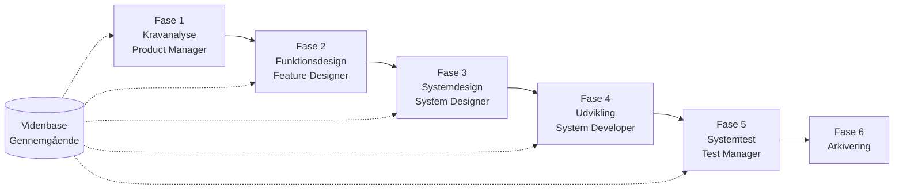

# SpecCrew Kom godt i gang-guide

<p align="center">
  <a href="./GETTING-STARTED.md">简体中文</a> |
  <a href="./GETTING-STARTED.zh-TW.md">繁體中文</a> |
  <a href="./GETTING-STARTED.en.md">English</a> |
  <a href="./GETTING-STARTED.ko.md">한국어</a> |
  <a href="./GETTING-STARTED.de.md">Deutsch</a> |
  <a href="./GETTING-STARTED.es.md">Español</a> |
  <a href="./GETTING-STARTED.fr.md">Français</a> |
  <a href="./GETTING-STARTED.it.md">Italiano</a> |
  <a href="./GETTING-STARTED.da.md">Dansk</a> |
  <a href="./GETTING-STARTED.ja.md">日本語</a> |
  <a href="./GETTING-STARTED.ar.md">العربية</a>
</p>

Dette dokument hjælper dig med hurtigt at forstå, hvordan du bruger SpecCrew's agent-team til trin for trin at gennemføre komplet udvikling fra krav til levering i henhold til standardiserede ingeniørarbejdsgange.

---

## 1. Forberedelse

### Installer SpecCrew

```bash
npm install -g speccrew
```

### Initialiser projekt

```bash
speccrew init --ide qoder
```

Understøttede IDE'er: `qoder`, `cursor`, `claude`, `codex`

### Mappestruktur efter initialisering

```
.
├── .qoder/
│   ├── agents/          # Agent definitionsfiler
│   └── skills/          # Skill definitionsfiler
├── speccrew-workspace/  # Arbejdsområde
│   ├── docs/            # Konfiguration, regler, skabeloner, løsninger
│   ├── iterations/      # Igangværende iterationer
│   ├── iteration-archives/  # Arkiverede iterationer
│   └── knowledges/      # Videnbase
│       ├── base/        # Basisinformation (diagnoserapporter, teknisk gæld)
│       ├── bizs/        # Forretningsvidenbase
│       └── techs/       # Teknisk videnbase
```

### CLI-kommando hurtigreference

| Kommando | Beskrivelse |
|------|------|
| `speccrew list` | List alle tilgængelige agenter og skills |
| `speccrew doctor` | Tjek installationsfuldstændighed |
| `speccrew update` | Opdater projektkonfiguration til seneste version |
| `speccrew uninstall` | Afinstaller SpecCrew |

---

## 2. Arbejdsgangsoverblik

### Komplet flowdiagram



### Kerneprincipper

1. **Faseafhængighed**: Hver fases output er input til næste fase
2. **Checkpoint-bekræftelse**: Hver fase har bekræftelsespunkter, brugerbekræftelse kræves før næste fase
3. **Videnbasedrevet**: Videnbasen bruges gennemgående til at levere kontekst til alle faser

---

## 3. Trin 0: Projekt Diagnose og Videnbase Initialisering

Før du starter den formelle ingeniørarbejdsgang, skal du initialisere projektvidenbasen.

### 3.1 Projekt Diagnose

**Dialogeksempel**:
```
@speccrew-team-leader diagnosticer projekt
```

**Hvad agenten gør**:
- Scanner projektstruktur
- Detekterer teknologistak
- Identificerer forretningsmoduler

**Output**:
```
speccrew-workspace/knowledges/base/diagnosis-reports/diagnosis-report-{date}.md
```

### 3.2 Teknisk Videnbase Initialisering

**Dialogeksempel**:
```
@speccrew-team-leader initialiser teknisk videnbase
```

**3-trins proces**:
1. Platformsdetektion — Identificer tekniske platforme i projektet
2. Teknisk dokumentgeneration — Generer tekniske specifikationsdokumenter for hver platform
3. Indeksgeneration — Byg videnbaseindeks

**Output**:
```
speccrew-workspace/knowledges/techs/{platform-id}/
├── tech-stack.md          # Teknologistakdefinition
├── architecture.md        # Arkitekturaftaler
├── dev-spec.md            # Udviklingsspecifikation
├── test-spec.md           # Tests specifikation
└── INDEX.md               # Indeksfil
```

### 3.3 Forretningsvidenbase Initialisering

**Dialogeksempel**:
```
@speccrew-team-leader initialiser forretningsvidenbase
```

**4-trins proces**:
1. Funktionsoversigt — Scan kode for at identificere alle funktioner
2. Funktionsanalyse — Analyser forretningslogik for hver funktion
3. Modulopsummering — Opsummer funktioner efter modul
4. Systemopsummering — Generer systemniveau forretningsoverblik

**Output**:
```
speccrew-workspace/knowledges/bizs/
├── {platform-type}/
│   └── {module-name}/
│       └── feature-spec.md
└── system-overview.md
```

---

## 4. Fase-for-Fase Dialogguide

### 4.1 Fase 1: Kravanalyse (Product Manager)

**Sådan startes**:
```
@speccrew-product-manager Jeg har et nyt krav: [beskriv dit krav]
```

**Agent arbejdsgang**:
1. Læs systemoversigt for at forstå eksisterende moduler
2. Analyser brugerkrav
3. Generer struktureret PRD-dokument

**Output**:
```
iterations/{sekvens}-{type}-{navn}/01.product-requirement/
├── [feature-name]-prd.md           # Produktkravdokument
└── [feature-name]-bizs-modeling.md # Forretningsmodellering (for komplekse krav)
```

**Bekræftelsespunkter**:
- [ ] Beskriver kravene præcist brugerens hensigt
- [ ] Er forretningsregler komplette
- [ ] Er integrationspunkter med eksisterende system tydelige
- [ ] Er acceptkriterier målbare

---

### 4.2 Fase 2: Funktionsdesign (Feature Designer)

**Sådan startes**:
```
@speccrew-feature-designer start funktionsdesign
```

**Agent arbejdsgang**:
1. Find automatisk bekræftet PRD-dokument
2. Indlæs forretningsvidenbase
3. Generer funktionsdesign (inkl. UI-wireframes, interaktionsflow, datadefinition, API-kontrakt)
4. Ved flere PRD'er, parallelt design via Task Worker

**Output**:
```
iterations/{iter}/02.feature-design/
└── [feature-name]-feature-spec.md  # Funktionsdesigndokument
```

**Bekræftelsespunkter**:
- [ ] Er alle brugerscenarier dækket
- [ ] Er interaktionsflowet klart
- [ ] Er datafeltdefinitioner komplette
- [ ] Er undtagelseshåndtering korrekt

---

### 4.3 Fase 3: Systemdesign (System Designer)

**Sådan startes**:
```
@speccrew-system-designer start systemdesign
```

**Agent arbejdsgang**:
1. Find Feature Spec og API-kontrakt
2. Indlæs teknisk videnbase (teknologistak, arkitektur, specifikationer for hver ende)
3. **Checkpoint A**: Framework-evaluering — Analyser teknologiforskelle, anbefal nye frameworks (hvis nødvendigt), vent på brugerbekræftelse
4. Generer DESIGN-OVERVIEW.md
5. Parallel dispatch af design for hver ende via Task Worker (frontend/backend/mobil/desktop)
6. **Checkpoint B**: Fælles bekræftelse — Vis designoversigt for alle platforme, vent på brugerbekræftelse

**Output**:
```
iterations/{iter}/03.system-design/
├── DESIGN-OVERVIEW.md              # Designoversigt
├── {platform-id}/
│   ├── INDEX.md                    # Designindeks for hver platform
│   └── {module}-design.md          # Moduldesign på pseudokode-niveau
```

**Bekræftelsespunkter**:
- [ ] Bruger pseudokoden faktisk framework-syntaks
- [ ] Er API-kontrakter på tværs af ender konsistente
- [ ] Er fejlhåndteringsstrategier ensartede

---

### 4.4 Fase 4: Udviklingsimplementering (System Developer)

**Sådan startes**:
```
@speccrew-system-developer start udvikling
```

**Agent arbejdsgang**:
1. Læs systemdesigndokumenter
2. Indlæs teknisk viden for hver ende
3. **Checkpoint A**: Miljø-precheck — Tjek runtime-versioner, afhængigheder, service tilgængelighed, vent på brugerløsning ved fejl
4. Parallel dispatch af udvikling for hver ende via Task Worker
5. Integrationstjek: API-kontraktjustering, datakonsistens
6. Output leverancerapport

**Output**:
```
# Kildekode skrives til projektets faktiske kildekodemappe
iterations/{iter}/04.development/
├── {platform-id}/
│   └── tasks/                      # Udviklingsopgaveoptegnelser
└── delivery-report.md
```

**Bekræftelsespunkter**:
- [ ] Er miljøet klar
- [ ] Er integrationsproblemer inden for acceptabelt område
- [ ] Overholder kode udviklingsspecifikationen

---

### 4.5 Fase 5: Systemtest (Test Manager)

**Sådan startes**:
```
@speccrew-test-manager start test
```

**3-trins testproces**:

| Fase | Beskrivelse | Checkpoint |
|------|------|------------|
| Testcasdesign | Generer testcases baseret på PRD og Feature Spec | A: Vis case dækningsstatistik og sporingsmatrix, vent på brugerbekræftelse |
| Testkodegeneration | Generer eksekverbar testkode | B: Vis genererede testfiler og casemapping, vent på brugerbekræftelse |
| Testudførelse og bug-rapport | Kør test automatisk, generer rapport | Ingen (automatisk udførelse) |

**Output**:
```
iterations/{iter}/05.system-test/
├── cases/
│   └── {platform-id}/              # Testcasedokumenter
├── code/
│   └── {platform-id}/              # Testkodeplan
├── reports/
│   └── test-report-{date}.md       # Testrapport
└── bugs/
    └── BUG-{id}-{title}.md         # Bug-rapport (én fil pr. bug)
```

**Bekræftelsespunkter**:
- [ ] Er casedækningen komplet
- [ ] Er testkoden køreklar
- [ ] Er bug-alvorlighedsbedømmelse præcis

---

### 4.6 Fase 6: Arkivering

Automatisk arkivering efter iterationen er fuldført:

```
speccrew-workspace/iteration-archives/
└── {sekvens}-{type}-{navn}-{dato}/
    ├── 01.product-requirement/
    ├── 02.feature-design/
    ├── 03.system-design/
    ├── 04.development/
    └── 05.system-test/
```

---

## 5. Videnbasebeskrivelse

### 5.1 Forretningsvidenbase (bizs)

**Formål**: Gem projektets forretningsfunktionsbeskrivelser, modulopdeling, API-karakteristika

**Mappestruktur**:
```
knowledges/bizs/
├── {platform-type}/
│   └── {module-name}/
│       └── feature-spec.md
└── system-overview.md
```

**Brugsscenarier**: Product Manager, Feature Designer

### 5.2 Teknisk Videnbase (techs)

**Formål**: Gem projektets teknologistak, arkitekturaftaler, udviklingsspecifikationer, tests specifikationer

**Mappestruktur**:
```
knowledges/techs/{platform-id}/
├── tech-stack.md
├── architecture.md
├── dev-spec.md
├── test-spec.md
└── INDEX.md
```

**Brugsscenarier**: System Designer, System Developer, Test Manager

---

## 6. Ofte Stillede Spørgsmål (FAQ)

### Q1: Hvad hvis agenten ikke fungerer som forventet?

1. Kør `speccrew doctor` for at tjekke installationsfuldstændighed
2. Bekræft at videnbasen er initialiseret
3. Bekræft at der er output fra forrige fase i nuværende iterationsmappe

### Q2: Hvordan springer jeg en fase over?

**Anbefales ikke at springe over**, hver fases output er input til næste fase.

Hvis det er nødvendigt, skal du manuelt forberede inputdokumenter for den pågældende fase og sikre, at formatet overholder specifikationen.

### Q3: Hvordan håndteres flere krav parallelt?

Opret uafhængig iterationsmappe for hvert krav:
```
iterations/
├── 001-feature-xxx/
├── 002-feature-yyy/
└── 003-feature-zzz/
```

Hver iteration er fuldstændig isoleret og påvirker ikke hinanden.

### Q4: Hvordan opdateres SpecCrew-versionen?

- **Global opdatering**: `npm update -g speccrew`
- **Projekt opdatering**: Kør `speccrew update` i projektmappe

### Q5: Hvordan vises historiske iterationer?

Efter arkivering, se i `speccrew-workspace/iteration-archives/`, organiseret efter `{sekvens}-{type}-{navn}-{dato}/` format.

### Q6: Skal videnbasen opdateres regelmæssigt?

Følgende situationer kræver re-initialisering:
- Projektstruktur ændres væsentligt
- Teknologistak opgraderes eller udskiftes
- Forretningsmoduler tilføjes/slettes

---

## 7. Hurtigreference

### Agent Start Hurtigreferencetabel

| Fase | Agent | Startdialog |
|------|-------|----------|
| Diagnose | Team Leader | `@speccrew-team-leader diagnosticer projekt` |
| Initialisering | Team Leader | `@speccrew-team-leader initialiser teknisk videnbase` |
| Kravanalyse | Product Manager | `@speccrew-product-manager Jeg har et nyt krav: [beskrivelse]` |
| Funktionsdesign | Feature Designer | `@speccrew-feature-designer start funktionsdesign` |
| Systemdesign | System Designer | `@speccrew-system-designer start systemdesign` |
| Udvikling | System Developer | `@speccrew-system-developer start udvikling` |
| Systemtest | Test Manager | `@speccrew-test-manager start test` |

### Checkpoint Tjekliste

| Fase | Antal Checkpoints | Nøglekontrolpunkter |
|------|-----------------|------------|
| Kravanalyse | 1 | Kravnøjagtighed, forretningsreglers fuldstændighed, acceptkriteriers målbarehed |
| Funktionsdesign | 1 | Scenariedækning, interaktionsklarhed, datafuldstændighed, undtagelseshåndtering |
| Systemdesign | 2 | A: Framework-evaluering; B: Pseudokode syntaks, cross-ender konsistens, fejlhåndtering |
| Udvikling | 1 | A: Miljø klar, integrationsproblemer, kode specifikation |
| Systemtest | 2 | A: Casedækning; B: Testkode køreklarhed |

### Output Sti Hurtigreference

| Fase | Output Mappe | Filformat |
|------|----------|----------|
| Kravanalyse | `iterations/{iter}/01.product-requirement/` | `[name]-prd.md`, `[name]-bizs-modeling.md` |
| Funktionsdesign | `iterations/{iter}/02.feature-design/` | `[name]-feature-spec.md` |
| Systemdesign | `iterations/{iter}/03.system-design/` | `DESIGN-OVERVIEW.md`, `{platform}/INDEX.md`, `{platform}/{module}-design.md` |
| Udvikling | `iterations/{iter}/04.development/` | Kildekode + `delivery-report.md` |
| Systemtest | `iterations/{iter}/05.system-test/` | `cases/`, `code/`, `reports/`, `bugs/` |
| Arkivering | `iteration-archives/{iter}-{date}/` | Komplet iterationskopi |

---

## Næste Skridt

1. Kør `speccrew init --ide qoder` for at initialisere dit projekt
2. Udfør trin 0: Projekt Diagnose og Videnbase Initialisering
3. Følg arbejdsgangen fase for fase og nyd specifikationsdrevet udvikling!
