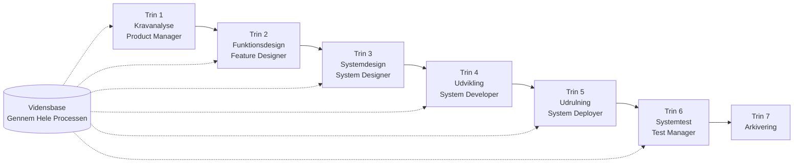

# SpecCrew Hurtig Start Guide

<p align="center">
  <a href="./GETTING-STARTED.md">简体中文</a> |
  <a href="./GETTING-STARTED.zh-TW.md">繁體中文</a> |
  <a href="./GETTING-STARTED.en.md">English</a> |
  <a href="./GETTING-STARTED.ko.md">한국어</a> |
  <a href="./GETTING-STARTED.de.md">Deutsch</a> |
  <a href="./GETTING-STARTED.es.md">Español</a> |
  <a href="./GETTING-STARTED.fr.md">Français</a> |
  <a href="./GETTING-STARTED.it.md">Italiano</a> |
  <a href="./GETTING-STARTED.da.md">Dansk</a> |
  <a href="./GETTING-STARTED.ja.md">日本語</a> |
  <a href="./GETTING-STARTED.ar.md">العربية</a>
</p>

Dette dokument hjælper dig med hurtigt at forstå, hvordan du bruger SpecCrews Agent-team til at fuldføre den komplette udvikling fra krav til levering efter standard engineering-processer.

---

## 1. Forudsætninger

### Installer SpecCrew

```bash
npm install -g speccrew
```

### Initialiser Projekt

```bash
speccrew init --ide qoder
```

Understøttede IDE'er: `qoder`, `cursor`, `claude`, `codex`

### Mappestruktur Efter Initialisering

```
.
├── .qoder/
│   ├── agents/          # Agent definitionsfiler
│   └── skills/          # Skill definitionsfiler
├── speccrew-workspace/  # Workspace
│   ├── docs/            # Konfigurationer, regler, skabeloner, løsninger
│   ├── iterations/      # Nuværende kørende iterationer
│   ├── iteration-archives/  # Arkiverede iterationer
│   └── knowledges/      # Vidensbase
│       ├── base/        # Basisinformation (diagnoserapporter, teknisk gæld)
│       ├── bizs/        # Forretningsvidensbase
│       └── techs/       # Teknisk vidensbase
```

### CLI Kommando Hurtig Reference

| Kommando | Beskrivelse |
|------|------|
| `speccrew list` | List alle tilgængelige Agenter og Skills |
| `speccrew doctor` | Kontroller installationsintegritet |
| `speccrew update` | Opdater projektkonfiguration til nyeste version |
| `speccrew uninstall` | Afinstaller SpecCrew |

---

## 2. Hurtig Start på 5 Minutter Efter Installation

Efter kørsel af `speccrew init`, følg disse trin for hurtigt at komme i arbejdstilstand:

### Trin 1: Vælg Din IDE

| IDE | Initialiseringskommando | Anvendelsesscenarie |
|-----|-----------|----------|
| **Qoder** (Anbefalet) | `speccrew init --ide qoder` | Fuld agent-orkestrering, parallelle workers |
| **Cursor** | `speccrew init --ide cursor` | Composer-baserede workflows |
| **Claude Code** | `speccrew init --ide claude` | CLI-først udvikling |
| **Codex** | `speccrew init --ide codex` | OpenAI økosystemintegration |

### Trin 2: Initialiser Vidensbase (Anbefalet)

For projekter med eksisterende kildekode anbefales det at initialisere vidensbasen først, så agenter forstår din kodebase:

```
@speccrew-team-leader initialiser teknisk vidensbase
```

Derefter:

```
@speccrew-team-leader initialiser forretningsvidensbase
```

### Trin 3: Start Din Første Opgave

```
@speccrew-product-manager Jeg har et nyt krav: [beskriv dit funktionskrav]
```

> **Tip**: Hvis du er usikker på hvad du skal gøre, sig blot `@speccrew-team-leader hjælp mig med at komme i gang` — Team Leader vil automatisk registrere din projektstatus og vejlede dig.

---

## 3. Hurtigt Beslutningstræ

Usikker på hvad du skal gøre? Find dit scenarie nedenfor:

- **Jeg har et nyt funktionskrav**
  → `@speccrew-product-manager Jeg har et nyt krav: [beskriv dit funktionskrav]`

- **Jeg vil scanne eksisterende projektviden**
  → `@speccrew-team-leader initialiser teknisk vidensbase`
  → Derefter: `@speccrew-team-leader initialiser forretningsvidensbase`

- **Jeg vil fortsætte tidligere arbejde**
  → `@speccrew-team-leader hvad er den aktuelle fremgang?`

- **Jeg vil kontrollere systemets sundhedstilstand**
  → Kør i terminal: `speccrew doctor`

- **Jeg er usikker på hvad jeg skal gøre**
  → `@speccrew-team-leader hjælp mig med at komme i gang`
  → Team Leader vil automatisk registrere din projektstatus og vejlede dig

---

## 4. Agent Hurtig Reference

| Rolle | Agent | Ansvarsområder | Kommandoeksempel |
|------|-------|-----------------|-----------------|
| Teamleder | `@speccrew-team-leader` | Projektnavigation, vidensbaseinitialisering, statuskontrol | "Hjælp mig med at komme i gang" |
| Produktchef | `@speccrew-product-manager` | Kravanalyse, PRD-generering | "Jeg har et nyt krav: ..." |
| Funktionsdesigner | `@speccrew-feature-designer` | Funktionsanalyse, specifikationsdesign, API-kontrakter | "Start funktionsdesign for iteration X" |
| Systemdesigner | `@speccrew-system-designer` | Arkitekturdesign, platformsdetaljeret design | "Start systemdesign for iteration X" |
| Systemudvikler | `@speccrew-system-developer` | Udviklingskoordinering, kodegenerering | "Start udvikling for iteration X" |
| Testchef | `@speccrew-test-manager` | Testplanlægning, casestudier, udførelse | "Start test for iteration X" |

> **Bemærk**: Du behøver ikke huske alle agenter. Bare tal med `@speccrew-team-leader`, og den vil rute din anmodning til den rigtige agent.

---

## 5. Workflow Oversigt

### Komplet Flowdiagram



### Kerneprincipper

1. **Trinafhængigheder**: Hvert trins resultat er input til næste trin
2. **Checkpoint-bekræftelse**: Hvert trin har et bekræftelsespunkt, der kræver brugergodkendelse før fortsættelse til næste trin
3. **Vidensbase-drevet**: Vidensbasen kører gennem hele processen og giver kontekst til alle trin

---

## 6. Trin Nul: Vidensbaseinitialisering

Før du starter den formelle engineering-proces, skal du initialisere projektets vidensbase.

### 6.1 Teknisk Vidensbaseinitialisering

**Samtaleeksempel**:
```
@speccrew-team-leader initialiser teknisk vidensbase
```

**Tre-faset proces**:
1. Platformdetektering — Identificer tekniske platforme i projektet
2. Teknisk dokumentgeneration — Generer tekniske specifikationsdokumenter for hver platform
3. Indexgeneration — Etabler vidensbaseindex

**Resultat**:
```
speccrew-workspace/knowledges/techs/{platform-id}/
├── tech-stack.md          # Teknologi-stack-definition
├── architecture.md        # Arkitekturkonventioner
├── dev-spec.md            # Udviklingsspecifikationer
├── test-spec.md           # Tests specifikationer
└── INDEX.md               # Indexfil
```

### 6.2 Forretningsvidensbaseinitialisering

**Samtaleeksempel**:
```
@speccrew-team-leader initialiser forretningsvidensbase
```

**Fire-faset proces**:
1. Funktionsliste — Scan kode for at identificere alle funktioner
2. Funktionsanalyse — Analyser forretningslogik for hver funktion
3. Modulopsummering — Opsummer funktioner efter modul
4. Systemopsummering — Generer systemniveau forretningsoverblik

**Resultat**:
```
speccrew-workspace/knowledges/bizs/
├── {platform-type}/
│   └── {module-name}/
│       └── feature-spec.md
└── system-overview.md
```

---

## 7. Trin-for-Trin Samtaleguide

### 7.1 Trin 1: Kravanalyse (Product Manager)

**Sådan startes**:
```
@speccrew-product-manager Jeg har et nyt krav: [beskriv dit krav]
```

**Agent Workflow**:
1. Læs systemoversigt for at forstå eksisterende moduler
2. Analyser brugers krav
3. Generer struktureret PRD-dokument

**Resultat**:
```
iterations/{nummer}-{type}-{navn}/01.product-requirement/
├── [feature-name]-prd.md           # Produktkravdokument
└── [feature-name]-bizs-modeling.md # Forretningsmodellering (for komplekse krav)
```

**Bekræftelsespunkter**:
- [ ] Beskriver kravet nøjagtigt brugerens hensigt?
- [ ] Er forretningsregler komplette?
- [ ] Er integrationspunkter med eksisterende systemer klare?
- [ ] Er acceptkriterier målbare?

---

### 7.2 Trin 2: Funktionsdesign (Feature Designer)

**Sådan startes**:
```
@speccrew-feature-designer start funktionsdesign
```

**Agent Workflow**:
1. Automatisk lokalisering af bekræftet PRD-dokument
2. Indlæs forretningsvidensbase
3. Generer funktionsdesign (inklusive UI-wireframes, interaktionsflows, datadefinitioner, API-kontrakter)
4. For flere PRD'er, brug Task Worker til parallelt design

**Resultat**:
```
iterations/{iter}/02.feature-design/
└── [feature-name]-feature-spec.md  # Funktionsdesign-dokument
```

**Bekræftelsespunkter**:
- [ ] Er alle brugerscenarier dækket?
- [ ] Er interaktionsflows klare?
- [ ] Er datafeltdefinitioner komplette?
- [ ] Er undtagelseshåndtering omfattende?

---

### 7.3 Trin 3: Systemdesign (System Designer)

**Sådan startes**:
```
@speccrew-system-designer start systemdesign
```

**Agent Workflow**:
1. Lokaliser Feature Spec og API Contract
2. Indlæs teknisk vidensbase (teknologi-stack, arkitektur, specifikationer for hver platform)
3. **Checkpoint A**: Framework-evaluering — Analyser tekniske kløfter, anbefal nye frameworks (hvis nødvendigt), vent på brugerbekræftelse
4. Generer DESIGN-OVERVIEW.md
5. Brug Task Worker til parallelt at distribuere design for hver platform (frontend/backend/mobil/desktop)
6. **Checkpoint B**: Fælles bekræftelse — Vis resume af alle platformdesign, vent på brugerbekræftelse

**Resultat**:
```
iterations/{iter}/03.system-design/
├── DESIGN-OVERVIEW.md              # Designoversigt
├── {platform-id}/
│   ├── INDEX.md                    # Platformdesignindex
│   └── {module}-design.md          # Pseudokode-niveau moduldesign
```

**Bekræftelsespunkter**:
- [ ] Bruger pseudokoden faktisk frameworks syntaks?
- [ ] Er cross-platform API-kontrakter konsistente?
- [ ] Er fejlhåndteringsstrategi ensartet?

---

### 7.4 Trin 4: Udvikling (System Developer)

**Sådan startes**:
```
@speccrew-system-developer start udvikling
```

**Agent Workflow**:
1. Læs systemdesigndokumenter
2. Indlæs teknisk viden for hver platform
3. **Checkpoint A**: Miljøforhåndskontrol — Kontroller runtime-versioner, afhængigheder, servicetilgængelighed; vent på brugerløsning hvis det fejler
4. Brug Task Worker til parallelt at distribuere udvikling for hver platform
5. Integrationskontrol: API-kontraktjustering, datakonsistens
6. Output leveringsrapport

**Resultat**:
```
# Kildekode skrives til projektets faktiske kildemappe
iterations/{iter}/04.development/
├── {platform-id}/
│   └── tasks/                      # Udviklingsopgaveregistre
└── delivery-report.md
```

**Bekræftelsespunkter**:
- [ ] Er miljøet klar?
- [ ] Er integrationsproblemer inden for acceptabelt område?
- [ ] Overholder koden udviklingsspecifikationerne?

---

### 7.5 Trin 5: Udrulning (System Deployer)

**Sådan startes**:
```
@speccrew-system-deployer start udrulning
```

**Agent Workflow**:
1. Verificer at udviklingsfasen er fuldført (Stage Gate)
2. Indlæs teknisk vidensbase (build-konfiguration, database-migreringskonfiguration, servicestart-kommandoer)
3. **Checkpoint**: Miljøforhåndskontrol — Verificer build-værktøjer, runtime-versioner, afhængighedstilgængelighed
4. Udfør udrulningsskills i rækkefølge: Build → Database-migrering → Servicestart → Smoke Test
5. Output udrulningsrapport

> 💡 **Tip**: For projekter uden database springes migreringstrinnet automatisk over; for klient-applikationer (desktop/mobil) bruges proces-verifikationsmode i stedet for HTTP-sundhedstjek.

**Resultat**:
```
iterations/{iter}/05.deployment/
├── {platform-id}/
│   ├── deployment-plan.md          # Udrulningsplan
│   └── deployment-log.md           # Udrulnings-eksekveringslog
└── deployment-report.md            # Udrulnings-fuldførelsesrapport
```

**Bekræftelsespunkter**:
- [ ] Er bygningen fuldført succesfuldt?
- [ ] Er alle database-migreringsskripter udført succesfuldt (hvis relevant)?
- [ ] Er applikationen startet og bestået sundhedstjek?
- [ ] Er alle smoke tests bestået?

---

### 7.6 Trin 6: Systemtest (Test Manager)

**Sådan startes**:
```
@speccrew-test-manager start test
```

**Tre-faset testproces**:

| Fase | Beskrivelse | Checkpoint |
|-------|-------------|------------|
| Testcasedesign | Generer testcases baseret på PRD og Feature Spec | A: Vis testcase-dækningsstatistik og sporbarhedsmatrix, vent på brugerbekræftelse af tilstrækkelig dækning |
| Testkodegenerering | Generer eksekverbar testkode | B: Vis genererede testfiler og casemapping, vent på brugerbekræftelse |
| Testudførelse og Bug-rapportering | Kør automatisk tests og generer rapporter | Ingen (automatisk udførelse) |

**Resultat**:
```
iterations/{iter}/06.system-test/
├── cases/
│   └── {platform-id}/              # Testcasedokumenter
├── code/
│   └── {platform-id}/              # Testkodeplan
├── reports/
│   └── test-report-{date}.md       # Testrapport
└── bugs/
    └── BUG-{id}-{title}.md         # Bug-rapporter (én fil pr. bug)
```

**Bekræftelsespunkter**:
- [ ] Er casedækning komplet?
- [ ] Er testkode kørbar?
- [ ] Er bug-alvorlighedsvurdering præcis?

---

### 7.7 Trin 7: Arkivering

Iterationer arkiveres automatisk efter fuldførelse:

```
speccrew-workspace/iteration-archives/
└── {nummer}-{type}-{navn}-{dato}/
    ├── 01.product-requirement/
    ├── 02.feature-design/
    ├── 03.system-design/
    ├── 04.development/
    ├── 05.deployment/
    └── 06.system-test/
```

---

## 8. Vidensbase Oversigt

### 8.1 Forretningsvidensbase (bizs)

**Formål**: Gem projektets forretningsfunktionsbeskrivelser, modulopdelinger, API-karakteristika

**Mappestruktur**:
```
knowledges/bizs/
├── {platform-type}/
│   └── {module-name}/
│       └── feature-spec.md
└── system-overview.md
```

**Anvendelsesscenarier**: Product Manager, Feature Designer

### 8.2 Teknisk Vidensbase (techs)

**Formål**: Gem projektets teknologi-stack, arkitekturkonventioner, udviklingsspecifikationer, tests specifikationer

**Mappestruktur**:
```
knowledges/techs/{platform-id}/
├── tech-stack.md
├── architecture.md
├── dev-spec.md
├── test-spec.md
└── INDEX.md
```

**Anvendelsesscenarier**: System Designer, System Developer, Test Manager

---

## 9. Workflow Fremskridtshåndtering

SpecCrew virtuelle team følger en streng fase-gating-mekanisme, hvor hver fase skal bekræftes af brugeren, før den går videre til næste. Den understøtter også genoptagelig udførelse — når den genstartes efter afbrydelse, fortsætter den automatisk fra hvor den slap.

### 9.1 Tre-lags Fremskridtsfiler

Workflowet vedligeholder automatisk tre typer JSON-fremskridtsfiler, placeret i iterationsmappen:

| Fil | Placering | Formål |
|------|----------|---------|
| `WORKFLOW-PROGRESS.json` | `iterations/{iter}/` | Registrerer status for hver pipeline-fase |
| `.checkpoints.json` | Under hver fasemappe | Registrerer brugercheckpoint-bekræftelsesstatus |
| `DISPATCH-PROGRESS.json` | Under hver fasemappe | Registrerer element-for-element fremskridt for parallelle opgaver (multi-platform/multi-modul) |

### 9.2 Fasestatus Flow

Hver fase følger denne status flow:

```
pending → in_progress → completed → confirmed
```

- **pending**: Endnu ikke startet
- **in_progress**: Under udførelse
- **completed**: Agent-udførelse fuldført, venter på brugerbekræftelse
- **confirmed**: Bruger bekræftet via endeligt checkpoint, næste fase kan starte

### 9.3 Genoptagelig Udførelse

Når du genstarter en Agent for en fase:

1. **Automatisk upstream-kontrol**: Verificerer om forrige fase er bekræftet, blokerer og prompter hvis ikke
2. **Checkpoint-genopretning**: Læser `.checkpoints.json`, springer beståede checkpoints over, fortsætter fra sidste afbrydelsespunkt
3. **Parallelle opgave-genopretning**: Læser `DISPATCH-PROGRESS.json`, genudfører kun opgaver med `pending` eller `failed` status, springer `completed` opgaver over

### 9.4 Se Nuværende Fremskridt

Se pipeline-panoramastatus via Team Leader Agent:

```
@speccrew-team-leader se nuværende iterationsfremskridt
```

Team Leader vil læse fremskridtsfilerne og vise en statusoversigt svarende til:

```
Pipeline Status: i001-user-management
  01 PRD:            ✅ Confirmed
  02 Feature Design: 🔄 In Progress (Checkpoint A passed)
  03 System Design:  ⏳ Pending
  04 Development:    ⏳ Pending
  05 Deployment:     ⏳ Pending
  06 System Test:    ⏳ Pending
```

### 9.5 Bagudkompatibilitet

Fremskridtsfil-mekanismen er fuldt bagudkompatibel — hvis fremskridtsfiler ikke eksisterer (f.eks. i ældre projekter eller nye iterationer), vil alle Agenter køre normalt ifølge den oprindelige logik.

---

## 10. Ofte Stillede Spørgsmål (FAQ)

### S1: Hvad gør jeg hvis Agenten ikke fungerer som forventet?

1. Kør `speccrew doctor` for at kontrollere installationsintegritet
2. Bekræft at vidensbasen er blevet initialiseret
3. Bekræft at resultatet fra forrige fase findes i den aktuelle iterationsmappe

### S2: Hvordan springer jeg en fase over?

**Anbefales ikke** — Hver fases output er input til næste fase.

Hvis du skal springe over, skal du manuelt forberede inputdokumentet for den tilsvarende fase og sikre, at det overholder formatspecifikationerne.

### S3: Hvordan håndterer jeg flere parallelle krav?

Opret uafhængige iterationsmapper for hvert krav:
```
iterations/
├── 001-feature-xxx/
├── 002-feature-yyy/
└── 003-feature-zzz/
```

Hver iteration er fuldstændigt isoleret og påvirker ikke andre.

### S4: Hvordan opdaterer jeg SpecCrew-versionen?

Opdatering kræver to trin:

```bash
# Trin 1: Opdater det globale CLI-værktøj
npm install -g speccrew@latest

# Trin 2: Synkroniser Agenter og Skills i din projektmappe
cd /path/to/your-project
speccrew update
```

- `npm install -g speccrew@latest`: Opdaterer CLI-værktøjet selv (nye versioner kan indeholde nye Agent/Skill-definitioner, fejlrettelser osv.)
- `speccrew update`: Synkroniserer Agent- og Skill-definitions filer i dit projekt til nyeste version
- `speccrew update --ide cursor`: Opdaterer kun konfiguration for specifik IDE

> **Bemærk**: Begge trin er påkrævet. Kun at køre `speccrew update` vil ikke opdatere CLI-værktøjet selv; kun at køre `npm install` vil ikke opdatere projektfiler.

### S5: `speccrew update` viser ny version tilgængelig men `npm install -g speccrew@latest` installerer stadig den gamle version?

Dette skyldes normalt npm-cache. Løsning:

```bash
# Ryd npm-cache og geninstaller
npm cache clean --force
npm install -g speccrew@latest

# Verificer version
npm list -g speccrew
```

Hvis det stadig ikke virker, prøv at installere med specifikt versionsnummer:
```bash
npm install -g speccrew@0.5.6
```

### S6: Hvordan ser jeg historiske iterationer?

Efter arkivering, se i `speccrew-workspace/iteration-archives/`, organiseret efter `{nummer}-{type}-{navn}-{dato}/` format.

### S7: Skal vidensbasen opdateres regelmæssigt?

Geninitialisering er påkrævet i følgende situationer:
- Større ændringer i projektstruktur
- Teknologi-stack-opgradering eller udskiftning
- Tilføjelse/fjernelse af forretningsmoduler

---

## 11. Hurtig Reference

### Agent Start Hurtig Reference

| Fase | Agent | Start Samtale |
|-------|-------|-------------------|
| Initialisering | Team Leader | `@speccrew-team-leader initialiser teknisk vidensbase` |
| Kravanalyse | Product Manager | `@speccrew-product-manager Jeg har et nyt krav: [beskrivelse]` |
| Funktionsdesign | Feature Designer | `@speccrew-feature-designer start funktionsdesign` |
| Systemdesign | System Designer | `@speccrew-system-designer start systemdesign` |
| Udvikling | System Developer | `@speccrew-system-developer start udvikling` |
| Udrulning | System Deployer | `@speccrew-system-deployer start udrulning` |
| Systemtest | Test Manager | `@speccrew-test-manager start test` |

### Checkpoint Tjekliste

| Fase | Antal Checkpoints | Vigtige Kontrolpunkter |
|-------|----------------------|-----------------|
| Kravanalyse | 1 | Kravnøjagtighed, forretningsregelkomplethed, acceptkriteriemålbarhed |
| Funktionsdesign | 1 | Scenariedækning, interaktionsklarhed, datakomplethed, undtagelseshåndtering |
| Systemdesign | 2 | A: Framework-evaluering; B: Pseudokode syntaks, cross-platform konsistens, fejlhåndtering |
| Udvikling | 1 | A: Miljøklarhed, integrationsproblemer, kodespecifikationer |
| Udrulning | 1 | Build-succes, migreringsfuldførelse, servicestart, smoke test bestået |
| Systemtest | 2 | A: Casedækning; B: Testkode-kørbarhed |

### Resultatsti Hurtig Reference

| Fase | Output-mappe | Filformat |
|-------|-----------------|-------------|
| Kravanalyse | `iterations/{iter}/01.product-requirement/` | `[name]-prd.md`, `[name]-bizs-modeling.md` |
| Funktionsdesign | `iterations/{iter}/02.feature-design/` | `[name]-feature-spec.md` |
| Systemdesign | `iterations/{iter}/03.system-design/` | `DESIGN-OVERVIEW.md`, `{platform}/INDEX.md`, `{platform}/{module}-design.md` |
| Udvikling | `iterations/{iter}/04.development/` | Kildekode + `delivery-report.md` |
| Udrulning | `iterations/{iter}/05.deployment/` | `deployment-plan.md`, `deployment-log.md`, `deployment-report.md` |
| Systemtest | `iterations/{iter}/06.system-test/` | `cases/`, `code/`, `reports/`, `bugs/` |
| Arkivering | `iteration-archives/{iter}-{date}/` | Komplet iterationskopi |

---

## Næste Trin

1. Kør `speccrew init --ide qoder` for at initialisere dit projekt
2. Udfør Trin Nul: Vidensbaseinitialisering
3. Gå frem fase for fase ifølge workflowet, nyd den specifikationsdrevne udviklingsoplevelse!
