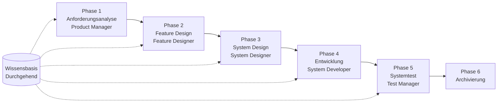

# SpecCrew Schnellstart-Leitfaden

<p align="center">
  <a href="./GETTING-STARTED.md">简体中文</a> |
  <a href="./GETTING-STARTED.zh-TW.md">繁體中文</a> |
  <a href="./GETTING-STARTED.en.md">English</a> |
  <a href="./GETTING-STARTED.ko.md">한국어</a> |
  <a href="./GETTING-STARTED.de.md">Deutsch</a> |
  <a href="./GETTING-STARTED.es.md">Español</a> |
  <a href="./GETTING-STARTED.fr.md">Français</a> |
  <a href="./GETTING-STARTED.it.md">Italiano</a> |
  <a href="./GETTING-STARTED.da.md">Dansk</a> |
  <a href="./GETTING-STARTED.ja.md">日本語</a> |
  <a href="./GETTING-STARTED.ar.md">العربية</a>
</p>

Dieses Dokument hilft Ihnen, schnell zu verstehen, wie Sie das Agent-Team von SpecCrew verwenden, um den vollständigen Entwicklungszyklus von Anforderungen bis zur Lieferung nach Standard-Engineering-Prozessen abzuschließen.

---

## 1. Vorbereitung

### SpecCrew installieren

```bash
npm install -g speccrew
```

### Projekt initialisieren

```bash
speccrew init --ide qoder
```

Unterstützte IDEs: `qoder`, `cursor`, `claude`, `codex`

### Verzeichnisstruktur nach Initialisierung

```
.
├── .qoder/
│   ├── agents/          # Agent-Definitionsdateien
│   └── skills/          # Skill-Definitionsdateien
├── speccrew-workspace/  # Workspace
│   ├── docs/            # Konfigurationen, Regeln, Vorlagen, Lösungen
│   ├── iterations/      # Aktuelle laufende Iterationen
│   ├── iteration-archives/  # Archivierte Iterationen
│   └── knowledges/      # Wissensbasis
│       ├── base/        # Basisinformationen (Diagnoseberichte, Tech-Schulden)
│       ├── bizs/        # Geschäftswissen-Basis
│       └── techs/       # Technisches Wissen-Basis
```

### CLI-Befehl-Kurzanleitung

| Befehl | Beschreibung |
|------|------|
| `speccrew list` | Alle verfügbaren Agents und Skills auflisten |
| `speccrew doctor` | Installationsintegrität prüfen |
| `speccrew update` | Projektkonfiguration auf neueste Version aktualisieren |
| `speccrew uninstall` | SpecCrew deinstallieren |

---

## 2. Schnellstart in 5 Minuten nach der Installation

Nach dem Ausführen von `speccrew init`, folgen Sie diesen Schritten, um schnell in den Arbeitszustand zu gelangen:

### Schritt 1: Wählen Sie Ihre IDE

| IDE | Initialisierungsbefehl | Anwendungsszenario |
|-----|-----------|----------|
| **Qoder** (Empfohlen) | `speccrew init --ide qoder` | Vollständige Agent-Orchestrierung, parallele Worker |
| **Cursor** | `speccrew init --ide cursor` | Composer-basierte Workflows |
| **Claude Code** | `speccrew init --ide claude` | CLI-first Entwicklung |
| **Codex** | `speccrew init --ide codex` | OpenAI-Ökosystem-Integration |

### Schritt 2: Wissensbasis initialisieren (Empfohlen)

Für Projekte mit bestehendem Quellcode wird empfohlen, zuerst die Wissensbasis zu initialisieren, damit Agents Ihre Codebasis verstehen:

```
@speccrew-team-leader technische Wissensbasis initialisieren
```

Dann:

```
@speccrew-team-leader Geschäftswissen-Basis initialisieren
```

### Schritt 3: Starten Sie Ihre erste Aufgabe

```
@speccrew-product-manager Ich habe eine neue Anforderung: [beschreiben Sie Ihre Funktionsanforderung]
```

> **Tipp**: Wenn Sie unsicher sind, was zu tun ist, sagen Sie einfach `@speccrew-team-leader hilf mir beim Start` — der Team Leader erkennt automatisch Ihren Projektstatus und führt Sie.

---

## 3. Schnellentscheidungsbaum

Unsicher, was zu tun ist? Finden Sie Ihr Szenario unten:

- **Ich habe eine neue Funktionsanforderung**
  → `@speccrew-product-manager Ich habe eine neue Anforderung: [beschreiben Sie Ihre Funktionsanforderung]`

- **Ich möchte existentes Projekt-Wissen scannen**
  → `@speccrew-team-leader technische Wissensbasis initialisieren`
  → Dann: `@speccrew-team-leader Geschäftswissen-Basis initialisieren`

- **Ich möchte frühere Arbeit fortsetzen**
  → `@speccrew-team-leader Was ist der aktuelle Fortschritt?`

- **Ich möchte den Systemgesundheitszustand prüfen**
  → Im Terminal ausführen: `speccrew doctor`

- **Ich bin unsicher, was zu tun ist**
  → `@speccrew-team-leader hilf mir beim Start`
  → Der Team Leader erkennt automatisch Ihren Projektstatus und führt Sie

---

## 4. Agent-Schnellreferenz

| Rolle | Agent | Verantwortlichkeiten | Beispielbefehl |
|------|-------|-----------------|-----------------|
| Teamleiter | `@speccrew-team-leader` | Projektnavigation, Wissensbasis-Initialisierung, Statusprüfung | "Hilf mir beim Start" |
| Produktmanager | `@speccrew-product-manager` | Anforderungsanalyse, PRD-Generierung | "Ich habe eine neue Anforderung: ..." |
| Feature-Designer | `@speccrew-feature-designer` | Feature-Analyse, Spezifikationsdesign, API-Verträge | "Starte Feature-Design für Iteration X" |
| Systemdesigner | `@speccrew-system-designer` | Architekturdesign, plattformspezifisches Design | "Starte Systemdesign für Iteration X" |
| Systementwickler | `@speccrew-system-developer` | Entwicklungskoordination, Codegenerierung | "Starte Entwicklung für Iteration X" |
| Testmanager | `@speccrew-test-manager` | Testplanung, Falldesign, Ausführung | "Starte Test für Iteration X" |

> **Hinweis**: Sie müssen sich nicht alle Agents merken. Sprechen Sie einfach mit `@speccrew-team-leader` und er leitet Ihre Anfrage an den richtigen Agent weiter.

---

## 5. Workflow-Übersicht

### Vollständiges Flussdiagramm



### Kernprinzipien

1. **Phasenabhängigkeiten**: Die Liefergegenstände jeder Phase sind die Eingabe für die nächste Phase
2. **Checkpoint-Bestätigung**: Jede Phase hat einen Bestätigungspunkt, der Benutzerzustimmung vor dem Fortfahren zur nächsten Phase erfordert
3. **Wissensbasis-getrieben**: Die Wissensbasis läuft durch den gesamten Prozess und bietet Kontext für alle Phasen

---

## 6. Schritt Null: Wissensbasis-Initialisierung

Bevor Sie den formellen Engineering-Prozess starten, müssen Sie die Projektwissensbasis initialisieren.

### 6.1 Technische Wissensbasis-Initialisierung

**Konversationsbeispiel**:
```
@speccrew-team-leader technische Wissensbasis initialisieren
```

**Drei-Phasen-Prozess**:
1. Plattformerkennung — Identifizieren technischer Plattformen im Projekt
2. Technische Dokumentengenerierung — Generieren technischer Spezifikationsdokumente für jede Plattform
3. Indexgenerierung — Erstellen des Wissensbasis-Index

**Liefergegenstand**:
```
speccrew-workspace/knowledges/techs/{platform-id}/
├── tech-stack.md          # Technologie-Stack-Definition
├── architecture.md        # Architekturkonventionen
├── dev-spec.md            # Entwicklungsspezifikationen
├── test-spec.md           # Testspezifikationen
└── INDEX.md               # Indexdatei
```

### 6.2 Geschäftswissen-Basis-Initialisierung

**Konversationsbeispiel**:
```
@speccrew-team-leader Geschäftswissen-Basis initialisieren
```

**Vier-Phasen-Prozess**:
1. Feature-Inventar — Code scannen, um alle Funktionsmerkmale zu identifizieren
2. Feature-Analyse — Geschäftslogik für jedes Feature analysieren
3. Modulzusammenfassung — Features nach Modul zusammenfassen
4. Systemzusammenfassung — Systemweite Geschäftsübersicht generieren

**Liefergegenstand**:
```
speccrew-workspace/knowledges/bizs/
├── {platform-type}/
│   └── {module-name}/
│       └── feature-spec.md
└── system-overview.md
```

---

## 7. Phasenweiser Konversationsleitfaden

### 7.1 Phase 1: Anforderungsanalyse (Product Manager)

**So starten Sie**:
```
@speccrew-product-manager Ich habe eine neue Anforderung: [beschreiben Sie Ihre Anforderung]
```

**Agent-Workflow**:
1. Systemübersicht lesen, um bestehende Module zu verstehen
2. Benutzeranforderungen analysieren
3. Strukturiertes PRD-Dokument generieren

**Liefergegenstand**:
```
iterations/{nummer}-{typ}-{name}/01.product-requirement/
├── [feature-name]-prd.md           # Produktanforderungsdokument
└── [feature-name]-bizs-modeling.md # Geschäftsmodellierung (bei komplexen Anforderungen)
```

**Bestätigungs-Checkliste**:
- [ ] Beschreibt die Anforderung genau die Benutzerabsicht?
- [ ] Sind Geschäftsregeln vollständig?
- [ ] Sind Integrationspunkte mit bestehenden Systemen klar?
- [ ] Sind Akzeptanzkriterien messbar?

---

### 7.2 Phase 2: Feature-Design (Feature Designer)

**So starten Sie**:
```
@speccrew-feature-designer Feature-Design starten
```

**Agent-Workflow**:
1. Bestätigtes PRD-Dokument automatisch lokalisieren
2. Geschäftswissen-Basis laden
3. Feature-Design generieren (inkl. UI-Wireframes, Interaktionsflüsse, Datendefinitionen, API-Verträge)
4. Bei mehreren PRDs Task Worker für paralleles Design verwenden

**Liefergegenstand**:
```
iterations/{iter}/02.feature-design/
└── [feature-name]-feature-spec.md  # Feature-Design-Dokument
```

**Bestätigungs-Checkliste**:
- [ ] Sind alle Benutzerszenarien abgedeckt?
- [ ] Sind Interaktionsflüsse klar?
- [ ] Sind Datenfelddefinitionen vollständig?
- [ ] Ist Ausnahmebehandlung umfassend?

---

### 7.3 Phase 3: Systemdesign (System Designer)

**So starten Sie**:
```
@speccrew-system-designer Systemdesign starten
```

**Agent-Workflow**:
1. Feature Spec und API Contract lokalisieren
2. Technische Wissensbasis laden (Tech-Stack, Architektur, Spezifikationen für jede Plattform)
3. **Checkpoint A**: Framework-Evaluierung — Technische Lücken analysieren, neue Frameworks empfehlen (falls erforderlich), auf Benutzerbestätigung warten
4. DESIGN-OVERVIEW.md generieren
5. Task Worker verwenden, um Design für jede Plattform parallel zu verteilen (Frontend/Backend/Mobil/Desktop)
6. **Checkpoint B**: Gemeinsame Bestätigung — Zusammenfassung aller Plattformdesigns anzeigen, auf Benutzerbestätigung warten

**Liefergegenstand**:
```
iterations/{iter}/03.system-design/
├── DESIGN-OVERVIEW.md              # Designübersicht
├── {platform-id}/
│   ├── INDEX.md                    # Plattformdesign-Index
│   └── {module}-design.md          # Pseudocode-Level-Moduldesign
```

**Bestätigungs-Checkliste**:
- [ ] Verwendet der Pseudocode tatsächliche Framework-Syntax?
- [ ] Sind plattformübergreifende API-Verträge konsistent?
- [ ] Ist Fehlerbehandlungsstrategie einheitlich?

---

### 7.4 Phase 4: Entwicklungsimplementierung (System Developer)

**So starten Sie**:
```
@speccrew-system-developer Entwicklung starten
```

**Agent-Workflow**:
1. Systemdesigndokumente lesen
2. Technisches Wissen für jede Plattform laden
3. **Checkpoint A**: Umgebungsvorabprüfung — Runtime-Versionen, Abhängigkeiten, Dienstverfügbarkeit prüfen; bei Fehler auf Benutzerlösung warten
4. Task Worker verwenden, um Entwicklung für jede Plattform parallel zu verteilen
5. Integrationsprüfung: API-Vertragsabgleich, Datenkonsistenz
6. Lieferbericht ausgeben

**Liefergegenstand**:
```
# Quellcode wird in das tatsächliche Projektquellverzeichnis geschrieben
iterations/{iter}/04.development/
├── {platform-id}/
│   └── tasks/                      # Entwicklungsaufzeichungen
└── delivery-report.md
```

**Bestätigungs-Checkliste**:
- [ ] Ist die Umgebung bereit?
- [ ] Liegen Integrationsprobleme im akzeptablen Bereich?
- [ ] Entspricht der Code den Entwicklungsspezifikationen?

---

### 7.5 Phase 5: Systemtest (Test Manager)

**So starten Sie**:
```
@speccrew-test-manager Test starten
```

**Drei-Phasen-Testprozess**:

| Phase | Beschreibung | Checkpoint |
|-------|-------------|------------|
| Testfalldesign | Testfälle basierend auf PRD und Feature Spec generieren | A: Fallabdeckungsstatistik und Rückverfolgbarkeitsmatrix anzeigen, auf Benutzerbestätigung ausreichender Abdeckung warten |
| Testcodegenerierung | Ausführbaren Testcode generieren | B: Generierte Testdateien und Fallzuordnung anzeigen, auf Benutzerbestätigung warten |
| Testausführung und Bug-Bericht | Tests automatisch ausführen und Berichte generieren | Keine (automatische Ausführung) |

**Liefergegenstand**:
```
iterations/{iter}/05.system-test/
├── cases/
│   └── {platform-id}/              # Testfalldokumente
├── code/
│   └── {platform-id}/              # Testcode-Plan
├── reports/
│   └── test-report-{date}.md       # Testbericht
└── bugs/
    └── BUG-{id}-{title}.md         # Bug-Berichte (eine Datei pro Bug)
```

**Bestätigungs-Checkliste**:
- [ ] Ist Fallabdeckung vollständig?
- [ ] Ist Testcode ausführbar?
- [ ] Ist Bug-Schweregradbewertung genau?

---

### 7.6 Phase 6: Archivierung

Iterationen werden nach Abschluss automatisch archiviert:

```
speccrew-workspace/iteration-archives/
└── {nummer}-{typ}-{name}-{datum}/
    ├── 01.product-requirement/
    ├── 02.feature-design/
    ├── 03.system-design/
    ├── 04.development/
    └── 05.system-test/
```

---

## 8. Wissensbasis-Übersicht

### 8.1 Geschäftswissen-Basis (bizs)

**Zweck**: Speicherung von Projektgeschäftsfunktionsbeschreibungen, Modulaufteilungen, API-Merkmalen

**Verzeichnisstruktur**:
```
knowledges/bizs/
├── {platform-type}/
│   └── {module-name}/
│       └── feature-spec.md
└── system-overview.md
```

**Verwendungsszenarien**: Product Manager, Feature Designer

### 8.2 Technische Wissensbasis (techs)

**Zweck**: Speicherung von Projekttechnologie-Stack, Architekturkonventionen, Entwicklungsspezifikationen, Testspezifikationen

**Verzeichnisstruktur**:
```
knowledges/techs/{platform-id}/
├── tech-stack.md
├── architecture.md
├── dev-spec.md
├── test-spec.md
└── INDEX.md
```

**Verwendungsszenarien**: System Designer, System Developer, Test Manager

---

## 9. Workflow-Fortschrittsverwaltung

Das SpecCrew-Virtual-Team folgt einem strengen Stage-Gating-Mechanismus, bei dem jede Phase vom Benutzer bestätigt werden muss, bevor sie zur nächsten übergeht. Es unterstützt auch die Wiederaufnahme der Ausführung — beim Neustart nach Unterbrechung wird automatisch von der letzten Position fortgefahren.

### 9.1 Drei-Schichten-Fortschrittsdateien

Der Workflow verwaltet automatisch drei Arten von JSON-Fortschrittsdateien, die sich im Iterationsverzeichnis befinden:

| Datei | Speicherort | Zweck |
|------|----------|---------|
| `WORKFLOW-PROGRESS.json` | `iterations/{iter}/` | Zeichnet den Status jeder Pipeline-Phase auf |
| `.checkpoints.json` | Unter jedem Phasenverzeichnis | Zeichnet Benutzer-Checkpoint-Bestätigungsstatus auf |
| `DISPATCH-PROGRESS.json` | Unter jedem Phasenverzeichnis | Zeichnet Element-für-Element-Fortschritt für parallele Aufgaben (Multi-Plattform/Multi-Modul) auf |

### 9.2 Phasenstatus-Fluss

Jede Phase folgt diesem Statusfluss:

```
pending → in_progress → completed → confirmed
```

- **pending**: Noch nicht gestartet
- **in_progress**: Derzeit in Ausführung
- **completed**: Agent-Ausführung abgeschlossen, wartet auf Benutzerbestätigung
- **confirmed**: Benutzer hat durch finalen Checkpoint bestätigt, nächste Phase kann starten

### 9.3 Wiederaufnahme der Ausführung

Beim Neustart eines Agents für eine Phase:

1. **Automatische Upstream-Prüfung**: Überprüft, ob die vorherige Phase bestätigt ist, blockiert und fragt, wenn nicht
2. **Checkpoint-Wiederherstellung**: Liest `.checkpoints.json`, übersprungene Checkpoints, setzt von letztem Unterbrechungspunkt fort
3. **Parallele Aufgaben-Wiederherstellung**: Liest `DISPATCH-PROGRESS.json`, führt nur Aufgaben mit Status `pending` oder `failed` erneut aus, überspringt `completed` Aufgaben

### 9.4 Aktuellen Fortschritt anzeigen

Zeigen Sie den Pipeline-Panorama-Status durch den Team Leader Agent:

```
@speccrew-team-leader aktuellen Iterationsfortschritt anzeigen
```

Der Team Leader liest die Fortschrittsdateien und zeigt eine Statusübersicht ähnlich wie:

```
Pipeline Status: i001-user-management
  01 PRD:            ✅ Confirmed
  02 Feature Design: 🔄 In Progress (Checkpoint A passed)
  03 System Design:  ⏳ Pending
  04 Development:    ⏳ Pending
  05 System Test:    ⏳ Pending
```

### 9.5 Abwärtskompatibilität

Der Fortschrittsdatei-Mechanismus ist vollständig abwärtskompatibel — wenn Fortschrittsdateien nicht existieren (z.B. in Legacy-Projekten oder neuen Iterationen), führen alle Agents normal gemäß der ursprünglichen Logik aus.

---

## 10. Häufig gestellte Fragen (FAQ)

### F1: Was tun, wenn der Agent nicht wie erwartet funktioniert?

1. `speccrew doctor` ausführen, um Installationsintegrität zu prüfen
2. Bestätigen, dass die Wissensbasis initialisiert wurde
3. Bestätigen, dass der Liefergegenstand der vorherigen Phase im aktuellen Iterationsverzeichnis existiert

### F2: Wie überspringe ich eine Phase?

**Nicht empfohlen** — Die Ausgabe jeder Phase ist die Eingabe für die nächste Phase.

Wenn Sie unbedingt überspringen müssen, bereiten Sie manuell das Eingabedokument der entsprechenden Phase vor und stellen Sie sicher, dass es den Formatspezifikationen entspricht.

### F3: Wie handhabe ich mehrere parallele Anforderungen?

Erstellen Sie für jede Anforderung unabhängige Iterationsverzeichnisse:
```
iterations/
├── 001-feature-xxx/
├── 002-feature-yyy/
└── 003-feature-zzz/
```

Jede Iteration ist vollständig isoliert und beeinflusst andere nicht.

### F4: Wie aktualisiere ich die SpecCrew-Version?

Die Aktualisierung erfordert zwei Schritte:

```bash
# Schritt 1: Globales CLI-Tool aktualisieren
npm install -g speccrew@latest

# Schritt 2: Agents und Skills im Projektverzeichnis synchronisieren
cd /path/to/your-project
speccrew update
```

- `npm install -g speccrew@latest`: Aktualisiert das CLI-Tool selbst (neue Versionen können neue Agent/Skill-Definitionen, Bug-Fixes usw. enthalten)
- `speccrew update`: Synchronisiert Agent- und Skill-Definitionsdateien in Ihrem Projekt auf die neueste Version
- `speccrew update --ide cursor`: Aktualisiert nur die Konfiguration für eine bestimmte IDE

> **Hinweis**: Beide Schritte sind erforderlich. Das nur `speccrew update` auszuführen, aktualisiert nicht das CLI-Tool selbst; das nur `npm install` auszuführen, aktualisiert nicht die Projektdateien.

### F5: `speccrew update` zeigt neue Version verfügbar, aber `npm install -g speccrew@latest` installiert immer noch die alte Version?

Dies wird normalerweise durch npm-Cache verursacht. Lösung:

```bash
# npm-Cache leeren und neu installieren
npm cache clean --force
npm install -g speccrew@latest

# Version überprüfen
npm list -g speccrew
```

Wenn es immer noch nicht funktioniert, versuchen Sie die Installation mit einer bestimmten Versionsnummer:
```bash
npm install -g speccrew@0.5.6
```

### F6: Wie zeige ich historische Iterationen an?

Nach der Archivierung in `speccrew-workspace/iteration-archives/` anzeigen, organisiert nach `{nummer}-{typ}-{name}-{datum}/` Format.

### F7: Muss die Wissensbasis regelmäßig aktualisiert werden?

Eine Neuinitialisierung ist in folgenden Situationen erforderlich:
- Wesentliche Änderungen an der Projektstruktur
- Technologie-Stack-Upgrade oder -Austausch
- Hinzufügen/Entfernen von Geschäftsmodulen

---

## 11. Schnellreferenz

### Agent-Start-Schnellreferenz

| Phase | Agent | Start-Konversation |
|-------|-------|-------------------|
| Initialisierung | Team Leader | `@speccrew-team-leader technische Wissensbasis initialisieren` |
| Anforderungsanalyse | Product Manager | `@speccrew-product-manager Ich habe eine neue Anforderung: [Beschreibung]` |
| Feature-Design | Feature Designer | `@speccrew-feature-designer Feature-Design starten` |
| Systemdesign | System Designer | `@speccrew-system-designer Systemdesign starten` |
| Entwicklung | System Developer | `@speccrew-system-developer Entwicklung starten` |
| Systemtest | Test Manager | `@speccrew-test-manager Test starten` |

### Checkpoint-Checkliste

| Phase | Anzahl Checkpoints | Wichtige Prüfpunkte |
|-------|----------------------|-----------------|
| Anforderungsanalyse | 1 | Anforderungsgenauigkeit, Geschäftsregelvollständigkeit, Akzeptanzkriterien-Messbarkeit |
| Feature-Design | 1 | Szenarioabdeckung, Interaktionsklarheit, Datenvollständigkeit, Ausnahmebehandlung |
| Systemdesign | 2 | A: Framework-Evaluierung; B: Pseudocode-Syntax, plattformübergreifende Konsistenz, Fehlerbehandlung |
| Entwicklung | 1 | A: Umgebungsbereitschaft, Integrationsprobleme, Code-Spezifikationen |
| Systemtest | 2 | A: Fallabdeckung; B: Testcode-Ausführbarkeit |

### Liefergegenstand-Pfad-Schnellreferenz

| Phase | Ausgabeverzeichnis | Dateiformat |
|-------|-----------------|-------------|
| Anforderungsanalyse | `iterations/{iter}/01.product-requirement/` | `[name]-prd.md`, `[name]-bizs-modeling.md` |
| Feature-Design | `iterations/{iter}/02.feature-design/` | `[name]-feature-spec.md` |
| Systemdesign | `iterations/{iter}/03.system-design/` | `DESIGN-OVERVIEW.md`, `{platform}/INDEX.md`, `{platform}/{module}-design.md` |
| Entwicklung | `iterations/{iter}/04.development/` | Quellcode + `delivery-report.md` |
| Systemtest | `iterations/{iter}/05.system-test/` | `cases/`, `code/`, `reports/`, `bugs/` |
| Archivierung | `iteration-archives/{iter}-{date}/` | Vollständige Iterationskopie |

---

## Nächste Schritte

1. Führen Sie `speccrew init --ide qoder` aus, um Ihr Projekt zu initialisieren
2. Führen Sie Schritt Null aus: Wissensbasis-Initialisierung
3. Arbeiten Sie sich durch den Workflow Phase für Phase vor und genießen Sie das spezifikationsgetriebene Entwicklungserlebnis!
