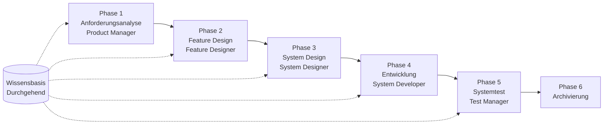

# SpecCrew Schnellstart-Leitfaden

<p align="center">
  <a href="./GETTING-STARTED.md">简体中文</a> |
  <a href="./GETTING-STARTED.zh-TW.md">繁體中文</a> |
  <a href="./GETTING-STARTED.en.md">English</a> |
  <a href="./GETTING-STARTED.ko.md">한국어</a> |
  <a href="./GETTING-STARTED.de.md">Deutsch</a> |
  <a href="./GETTING-STARTED.es.md">Español</a> |
  <a href="./GETTING-STARTED.fr.md">Français</a> |
  <a href="./GETTING-STARTED.it.md">Italiano</a> |
  <a href="./GETTING-STARTED.da.md">Dansk</a> |
  <a href="./GETTING-STARTED.ja.md">日本語</a> |
  <a href="./GETTING-STARTED.ar.md">العربية</a>
</p>

Dieses Dokument hilft Ihnen, schnell zu verstehen, wie Sie das Agent-Team von SpecCrew verwenden, um den vollständigen Entwicklungszyklus von Anforderungen bis zur Lieferung nach Standard-Engineering-Prozessen abzuschließen.

---

## 1. Vorbereitung

### SpecCrew installieren

```bash
npm install -g speccrew
```

### Projekt initialisieren

```bash
speccrew init --ide qoder
```

Unterstützte IDEs: `qoder`, `cursor`, `claude`, `codex`

### Verzeichnisstruktur nach Initialisierung

```
.
├── .qoder/
│   ├── agents/          # Agent-Definitionsdateien
│   └── skills/          # Skill-Definitionsdateien
├── speccrew-workspace/  # Workspace
│   ├── docs/            # Konfigurationen, Regeln, Vorlagen, Lösungen
│   ├── iterations/      # Aktuelle laufende Iterationen
│   ├── iteration-archives/  # Archivierte Iterationen
│   └── knowledges/      # Wissensbasis
│       ├── base/        # Basisinformationen (Diagnoseberichte, Tech-Schulden)
│       ├── bizs/        # Geschäftswissen-Basis
│       └── techs/       # Technisches Wissen-Basis
```

### CLI-Befehl-Kurzanleitung

| Befehl | Beschreibung |
|---------|-------------|
| `speccrew list` | Alle verfügbaren Agents und Skills auflisten |
| `speccrew doctor` | Installationsintegrität prüfen |
| `speccrew update` | Projektkonfiguration auf neueste Version aktualisieren |
| `speccrew uninstall` | SpecCrew deinstallieren |

---

## 2. Workflow-Übersicht

### Vollständiges Flussdiagramm



### Kernprinzipien

1. **Phasenabhängigkeiten**: Die Liefergegenstände jeder Phase sind die Eingabe für die nächste Phase
2. **Checkpoint-Bestätigung**: Jede Phase hat einen Bestätigungspunkt, der Benutzerzustimmung vor dem Fortfahren zur nächsten Phase erfordert
3. **Wissensbasis-getrieben**: Die Wissensbasis läuft durch den gesamten Prozess und bietet Kontext für alle Phasen

---

## 3. Schritt Null: Projektdiagnose und Wissensbasis-Initialisierung

Bevor Sie den formellen Engineering-Prozess starten, müssen Sie die Projektwissensbasis initialisieren.

### 3.1 Projektdiagnose

**Konversationsbeispiel**:
```
@speccrew-team-leader Projekt diagnostizieren
```

**Was der Agent tun wird**:
- Projektstruktur scannen
- Technologie-Stack erkennen
| Geschäftsmodule identifizieren

**Liefergegenstand**:
```
speccrew-workspace/knowledges/base/diagnosis-reports/diagnosis-report-{date}.md
```

### 3.2 Technische Wissensbasis-Initialisierung

**Konversationsbeispiel**:
```
@speccrew-team-leader technische Wissensbasis initialisieren
```

**Dreiphasiger Prozess**:
1. Plattform-Erkennung — Technologieplattformen im Projekt identifizieren
2. Technische Dokumentation-Generierung — Technische Spezifikationsdokumente für jede Plattform generieren
3. Index-Generierung — Wissensbasis-Index erstellen

**Liefergegenstand**:
```
speccrew-workspace/knowledges/techs/{platform-id}/
├── tech-stack.md          # Technologie-Stack-Definition
├── architecture.md        # Architekturkonventionen
├── dev-spec.md            # Entwicklungsspezifikationen
├── test-spec.md           # Testspezifikationen
└── INDEX.md               # Indexdatei
```

### 3.3 Geschäftswissen-Basis-Initialisierung

**Konversationsbeispiel**:
```
@speccrew-team-leader Geschäftswissen-Basis initialisieren
```

**Vierphasiger Prozess**:
1. Feature-Inventur — Code scannen um alle funktionalen Features zu identifizieren
2. Feature-Analyse — Geschäftslogik für jedes Feature analysieren
3. Modul-Zusammenfassung — Features nach Modul zusammenfassen
4. System-Zusammenfassung — System-Level-Geschäftsübersicht generieren

**Liefergegenstand**:
```
speccrew-workspace/knowledges/bizs/
├── {platform-type}/
│   └── {module-name}/
│       └── feature-spec.md
└── system-overview.md
```

---

## 4. Phasenweiser Konversationsleitfaden

### 4.1 Phase 1: Anforderungsanalyse (Product Manager)

**Wie zu starten**:
```
@speccrew-product-manager Ich habe eine neue Anforderung: [beschreiben Sie Ihre Anforderung]
```

**Agent-Workflow**:
1. Systemübersicht lesen um existierende Module zu verstehen
2. Benutzeranforderungen analysieren
3. Strukturiertes PRD-Dokument generieren

**Liefergegenstand**:
```
iterations/{nummer}-{typ}-{name}/01.product-requirement/
├── [feature-name]-prd.md           # Produktanforderungsdokument
└── [feature-name]-bizs-modeling.md # Geschäftsmodellierung (für komplexe Anforderungen)
```

**Bestätigungs-Checkliste**:
- [ ] Beschreibt die Anforderung Benutzerabsichten genau?
- [ ] Sind Geschäftsregeln vollständig?
- [ ] Sind Integrationspunkte mit bestehenden Systemen klar?
- [ ] Sind Akzeptanzkriterien messbar?

---

### 4.2 Phase 2: Feature Design (Feature Designer)

**Wie zu starten**:
```
@speccrew-feature-designer Feature Design starten
```

**Agent-Workflow**:
1. Bestätigtes PRD-Dokument automatisch lokalisieren
2. Geschäftswissen-Basis laden
3. Feature Design generieren (einschließlich UI-Wireframes, Interaktionsflüsse, Datendefinitionen, API-Verträge)
4. Für mehrere PRDs Task Worker für paralleles Design verwenden

**Liefergegenstand**:
```
iterations/{iter}/02.feature-design/
└── [feature-name]-feature-spec.md  # Feature Design Dokument
```

**Bestätigungs-Checkliste**:
- [ ] Sind alle Benutzerszenarien abgedeckt?
- [ ] Sind Interaktionsflüsse klar?
- [ ] Sind Datenfelddefinitionen vollständig?
- [ ] Ist Ausnahmebehandlung umfassend?

---

### 4.3 Phase 3: System Design (System Designer)

**Wie zu starten**:
```
@speccrew-system-designer System Design starten
```

**Agent-Workflow**:
1. Feature Spec und API Contract lokalisieren
2. Technische Wissensbasis laden (Tech-Stack, Architektur, Spezifikationen für jede Plattform)
3. **Checkpoint A**: Framework-Evaluierung — Technische Lücken analysieren, neue Frameworks empfehlen (falls benötigt), auf Benutzerbestätigung warten
4. DESIGN-OVERVIEW.md generieren
5. Task Worker verwenden um Design für jede Plattform parallel zu dispatchen (Frontend/Backend/Mobile/Desktop)
6. **Checkpoint B**: Gemeinsame Bestätigung — Zusammenfassung aller Plattform-Designs anzeigen, auf Benutzerbestätigung warten

**Liefergegenstand**:
```
iterations/{iter}/03.system-design/
├── DESIGN-OVERVIEW.md              # Design-Übersicht
├── {platform-id}/
│   ├── INDEX.md                    # Plattform-Design-Index
│   └── {module}-design.md          # Pseudocode-Level Modul-Design
```

**Bestätigungs-Checkliste**:
- [ ] Verwendet der Pseudocode tatsächliche Framework-Syntax?
- [ ] Sind plattformübergreifende API-Verträge konsistent?
- [ ] Ist Fehlerbehandlungsstrategie vereinheitlicht?

---

### 4.4 Phase 4: Entwicklungsimplementierung (System Developer)

**Wie zu starten**:
```
@speccrew-system-developer Entwicklung starten
```

**Agent-Workflow**:
1. System Design Dokumente lesen
2. Technisches Wissen für jede Plattform laden
3. **Checkpoint A**: Umgebungsvorprüfung — Runtime-Versionen, Abhängigkeiten, Dienstverfügbarkeit prüfen; bei Fehlschlag auf Benutzerlösung warten
4. Task Worker verwenden um Entwicklung für jede Plattform parallel zu dispatchen
5. Integrationsprüfung: API-Vertragsausrichtung, Datenkonsistenz
6. Lieferbericht ausgeben

**Liefergegenstand**:
```
# Quellcode in tatsächliches Projekt-Quellverzeichnis geschrieben
iterations/{iter}/04.development/
├── {platform-id}/
│   └── tasks/                      # Entwicklungsaufgabenprotokolle
└── delivery-report.md
```

**Bestätigungs-Checkliste**:
- [ ] Ist die Umgebung bereit?
- [ ] Sind Integrationsprobleme im akzeptablen Bereich?
- [ ] Entspricht der Code den Entwicklungsspezifikationen?

---

### 4.5 Phase 5: Systemtest (Test Manager)

**Wie zu starten**:
```
@speccrew-test-manager Test starten
```

**Dreiphasiger Testprozess**:

| Phase | Beschreibung | Checkpoint |
|-------|-------------|------------|
| Testfall-Design | Testfälle basierend auf PRD und Feature Spec generieren | A: Fall-Abdeckungsstatistiken und Rückverfolgbarkeitsmatrix anzeigen, auf Benutzerbestätigung ausreichender Abdeckung warten |
| Testcode-Generierung | Ausführbaren Testcode generieren | B: Generierte Testdateien und Fall-Mapping anzeigen, auf Benutzerbestätigung warten |
| Testausführung und Bug-Reporting | Tests automatisch ausführen und Berichte generieren | Keiner (automatische Ausführung) |

**Liefergegenstand**:
```
iterations/{iter}/05.system-test/
├── cases/
│   └── {platform-id}/              # Testfall-Dokumente
├── code/
│   └── {platform-id}/              # Testcode-Plan
├── reports/
│   └── test-report-{date}.md       # Testbericht
└── bugs/
    └── BUG-{id}-{title}.md         # Bug-Berichte (eine Datei pro Bug)
```

**Bestätigungs-Checkliste**:
- [ ] Ist Fall-Abdeckung vollständig?
- [ ] Ist Testcode ausführbar?
- [ ] Ist Bug-Schweregrad-Bewertung genau?

---

### 4.6 Phase 6: Archivierung

Iterationen werden bei Abschluss automatisch archiviert:

```
speccrew-workspace/iteration-archives/
└── {nummer}-{typ}-{name}-{date}/
    ├── 01.product-requirement/
    ├── 02.feature-design/
    ├── 03.system-design/
    ├── 04.development/
    └── 05.system-test/
```

---

## 5. Wissensbasis-Übersicht

### 5.1 Geschäftswissen-Basis (bizs)

**Zweck**: Projekt-Geschäftsfunktionsbeschreibungen, Modulaufteilungen, API-Merkmale speichern

**Verzeichnisstruktur**:
```
knowledges/bizs/
├── {platform-type}/
│   └── {module-name}/
│       └── feature-spec.md
└── system-overview.md
```

**Verwendungsszenarien**: Product Manager, Feature Designer

### 5.2 Technische Wissensbasis (techs)

**Zweck**: Projekt-Technologie-Stack, Architekturkonventionen, Entwicklungsspezifikationen, Testspezifikationen speichern

**Verzeichnisstruktur**:
```
knowledges/techs/{platform-id}/
├── tech-stack.md
├── architecture.md
├── dev-spec.md
├── test-spec.md
└── INDEX.md
```

**Verwendungsszenarien**: System Designer, System Developer, Test Manager

---

## 6. Häufig gestellte Fragen (FAQ)

### Q1: Was wenn der Agent nicht wie erwartet funktioniert?

1. `speccrew doctor` ausführen um Installationsintegrität zu prüfen
2. Bestätigen dass die Wissensbasis initialisiert wurde
3. Bestätigen dass die Liefergegenstände der vorherigen Phase im aktuellen Iterationsverzeichnis existieren

### Q2: Wie eine Phase überspringen?

**Nicht empfohlen** — Die Ausgabe jeder Phase ist die Eingabe für die nächste Phase.

Wenn Sie überspringen müssen, bereiten Sie das Eingabedokument der entsprechenden Phase manuell vor und stellen Sie sicher dass es den Formatspezifikationen entspricht.

### Q3: Wie mehrere parallele Anforderungen handhaben?

Erstellen Sie unabhängige Iterationsverzeichnisse für jede Anforderung:
```
iterations/
├── 001-feature-xxx/
├── 002-feature-yyy/
└── 003-feature-zzz/
```

Jede Iteration ist vollständig isoliert und beeinflusst andere nicht.

### Q4: Wie SpecCrew-Version aktualisieren?

- **Globales Update**: `npm update -g speccrew`
- **Projekt-Update**: `speccrew update` im Projektverzeichnis ausführen

### Q5: Wie historische Iterationen ansehen?

Nach Archivierung in `speccrew-workspace/iteration-archives/` ansehen, organisiert nach `{nummer}-{typ}-{name}-{date}/` Format.

### Q6: Muss die Wissensbasis regelmäßig aktualisiert werden?

Neuinitialisierung ist in folgenden Situationen erforderlich:
- Große Änderungen an der Projektstruktur
- Technologie-Stack-Upgrade oder -Austausch
| Hinzufügen/Entfernen von Geschäftsmodulen

---

## 7. Kurzreferenz

### Agent-Start-Kurzreferenz

| Phase | Agent | Start-Konversation |
|-------|-------|-------------------|
| Diagnose | Team Leader | `@speccrew-team-leader Projekt diagnostizieren` |
| Initialisierung | Team Leader | `@speccrew-team-leader technische Wissensbasis initialisieren` |
| Anforderungsanalyse | Product Manager | `@speccrew-product-manager Ich habe eine neue Anforderung: [Beschreibung]` |
| Feature Design | Feature Designer | `@speccrew-feature-designer Feature Design starten` |
| System Design | System Designer | `@speccrew-system-designer System Design starten` |
| Entwicklung | System Developer | `@speccrew-system-developer Entwicklung starten` |
| Systemtest | Test Manager | `@speccrew-test-manager Test starten` |

### Checkpoint-Checkliste

| Phase | Anzahl Checkpoints | Wichtige Prüfpunkte |
|-------|----------------------|-----------------|
| Anforderungsanalyse | 1 | Anforderungsgenauigkeit, Geschäftsregelvollständigkeit, Akzeptanzkriterien-Messbarkeit |
| Feature Design | 1 | Szenario-Abdeckung, Interaktionsklarheit, Datenvollständigkeit, Ausnahmebehandlung |
| System Design | 2 | A: Framework-Evaluierung; B: Pseudocode-Syntax, plattformübergreifende Konsistenz, Fehlerbehandlung |
| Entwicklung | 1 | A: Umgebungsbereitschaft, Integrationsprobleme, Code-Spezifikationen |
| Systemtest | 2 | A: Fall-Abdeckung; B: Testcode-Ausführbarkeit |

### Liefergegenstand-Pfad-Kurzreferenz

| Phase | Ausgabeverzeichnis | Dateiformat |
|-------|-----------------|-------------|
| Anforderungsanalyse | `iterations/{iter}/01.product-requirement/` | `[name]-prd.md`, `[name]-bizs-modeling.md` |
| Feature Design | `iterations/{iter}/02.feature-design/` | `[name]-feature-spec.md` |
| System Design | `iterations/{iter}/03.system-design/` | `DESIGN-OVERVIEW.md`, `{platform}/INDEX.md`, `{platform}/{module}-design.md` |
| Entwicklung | `iterations/{iter}/04.development/` | Quellcode + `delivery-report.md` |
| Systemtest | `iterations/{iter}/05.system-test/` | `cases/`, `code/`, `reports/`, `bugs/` |
| Archivierung | `iteration-archives/{iter}-{date}/` | Vollständige Iterationskopie |

---

## Nächste Schritte

1. `speccrew init --ide qoder` ausführen um Ihr Projekt zu initialisieren
2. Schritt Null ausführen: Projektdiagnose und Wissensbasis-Initialisierung
3. Durchlaufen Sie jede Phase nach dem Workflow und genießen Sie die specification-driven Entwicklungserfahrung!
