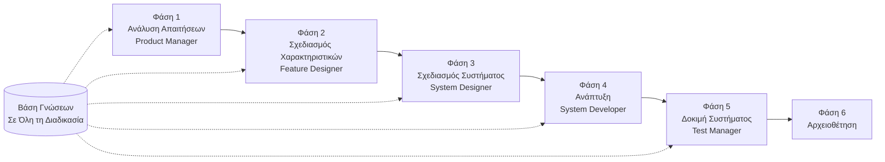

# SpecCrew - Οδηγός Γρήγορης Εκκίνησης

<p align="center">
  <a href="./GETTING-STARTED.md">简体中文</a> |
  <a href="./GETTING-STARTED.zh-TW.md">繁體中文</a> |
  <a href="./GETTING-STARTED.en.md">English</a> |
  <a href="./GETTING-STARTED.ko.md">한국어</a> |
  <a href="./GETTING-STARTED.de.md">Deutsch</a> |
  <a href="./GETTING-STARTED.es.md">Español</a> |
  <a href="./GETTING-STARTED.fr.md">Français</a> |
  <a href="./GETTING-STARTED.it.md">Italiano</a> |
  <a href="./GETTING-STARTED.da.md">Dansk</a> |
  <a href="./GETTING-STARTED.ja.md">日本語</a> |
  <a href="./GETTING-STARTED.ar.md">العربية</a> |
  <a href="./GETTING-STARTED.el.md">Ελληνικά</a>
</p>

Αυτό το έγγραφο σας βοηθά να κατανοήσετε γρήγορα πώς να χρησιμοποιήσετε την ομάδα Agent του SpecCrew για να ολοκληρώσετε τον πλήρη κύκλο ανάπτυξης από τις απαιτήσεις έως την παράδοση, ακολουθώντας τυπικές διαδικασίες μηχανικής.

---

## 1. Προαπαιτούμενα

### Εγκατάσταση SpecCrew

```bash
npm install -g speccrew
```

### Αρχικοποίηση Έργου

```bash
speccrew init --ide qoder
```

Υποστηριζόμενα IDE: `qoder`, `cursor`, `claude`, `codex`

### Δομή Καταλόγων Μετά την Αρχικοποίηση

```
.
├── .qoder/
│   ├── agents/          # Αρχεία ορισμού Agent
│   └── skills/          # Αρχεία ορισμού Skill
├── speccrew-workspace/  # Χώρος εργασίας
│   ├── docs/            # Διαμορφώσεις, κανόνες, πρότυπα, λύσεις
│   ├── iterations/      # Τρέχουσες επαναλήψεις
│   ├── iteration-archives/  # Αρχειοθετημένες επαναλήψεις
│   └── knowledges/      # Βάση γνώσεων
│       ├── base/        # Βασικές πληροφορίες (διαγνωστικές αναφορές, τεχνικά χρέη)
│       ├── bizs/        # Επιχειρησιακή βάση γνώσεων
│       └── techs/       # Τεχνική βάση γνώσεων
```

### Αναφορά Εντολών CLI

| Εντολή | Περιγραφή |
|---------|-------------|
| `speccrew list` | Λίστα όλων των διαθέσιμων Agent και Skill |
| `speccrew doctor` | Έλεγχος ακεραιότητας εγκατάστασης |
| `speccrew update` | Ενημέρωση διαμόρφωσης έργου στην τελευταία έκδοση |
| `speccrew uninstall` | Απεγκατάσταση SpecCrew |

---

## 2. Επισκόπηση Ροής Εργασίας

### Πλήρες Διάγραμμα Ροής



### Βασικές Αρχές

1. **Εξαρτήσεις Φάσεων**: Η έξοδος κάθε φάσης είναι η είσοδος για την επόμενη φάση
2. **Επιβεβαίωση Σημείου Ελέγχου**: Κάθε φάση έχει ένα σημείο επιβεβαίωσης που απαιτεί έγκριση χρήστη πριν συνεχίσει
3. **Οδηγούμενη από Βάση Γνώσεων**: Η βάση γνώσεων διατρέχει όλη τη διαδικασία, παρέχοντας контекστό για όλες τις φάσεις

---

## 3. Αρχικοποίηση Βάσης Γνώσεων

Πριν ξεκινήσετε την επίσημη διαδικασία μηχανικής, πρέπει να αρχικοποιήσετε τη βάση γνώσεων του έργου.

### 3.1 Αρχικοποίηση Τεχνικής Βάσης Γνώσεων

**Παράδειγμα Διαλόγου**:
```
@speccrew-team-leader αρχικοποίηση τεχνικής βάσης γνώσεων
```

**Τριφασική Διαδικασία**:
1. Ανίχνευση Πλατφόρμας — Αναγνώριση τεχνολογικών πλατφορμών στο έργο
2. Δημιουργία Τεχνικής Τεκμηρίωσης — Δημιουργία εγγράφων τεχνικών προδιαγραφών για κάθε πλατφόρμα
3. Δημιουργία Ευρετηρίου — Δημιουργία ευρετηρίου βάσης γνώσεων

**Παραδοτέο**:
```
speccrew-workspace/knowledges/techs/{platform-id}/
├── tech-stack.md          # Ορισμός τεχνολογικής στοίβας
├── architecture.md        # Συμβάσεις αρχιτεκτονικής
├── dev-spec.md            # Προδιαγραφές ανάπτυξης
├── test-spec.md           # Προδιαγραφές δοκιμής
└── INDEX.md               # Αρχείο ευρετηρίου
```

### 3.2 Αρχικοποίηση Επιχειρησιακής Βάσης Γνώσεων

**Παράδειγμα Διαλόγου**:
```
@speccrew-team-leader αρχικοποίηση επιχειρησιακής βάσης γνώσεων
```

**Τετραφασική Διαδικασία**:
1. Απογραφή Χαρακτηριστικών — Σάρωση κώδικα για αναγνώριση όλων των χαρακτηριστικών
2. Ανάλυση Χαρακτηριστικών — Ανάλυση επιχειρησιακής λογικής κάθε χαρακτηριστικού
3. Σύνοψη Μονάδας — Σύνοψη χαρακτηριστικών ανά μονάδα
4. Σύνοψη Συστήματος — Δημιουργία επιχειρησιακής επισκόπησης σε επίπεδο συστήματος

**Παραδοτέο**:
```
speccrew-workspace/knowledges/bizs/
├── {platform-type}/
│   └── {module-name}/
│       └── feature-spec.md
└── system-overview.md
```

---

## 4. Οδηγός Διαλόγου Φάση προς Φάση

### 4.1 Φάση 1: Ανάλυση Απαιτήσεων (Product Manager)

**Πώς να Ξεκινήσετε**:
```
@speccrew-product-manager έχω μια νέα απαίτηση: [περιγράψτε την απαίτησή σας]
```

**Ροή Εργασίας Agent**:
1. Διαβάστε την επισκόπηση συστήματος για να κατανοήσετε τις υπάρχουσες μονάδες
2. Αναλύστε τις απαιτήσεις χρήστη
3. Δημιουργήστε δομημένο έγγραφο PRD

**Παραδοτέο**:
```
iterations/{αριθμός}-{τύπος}-{όνομα}/01.product-requirement/
├── [feature-name]-prd.md           # Έγγραφο Απαιτήσεων Προϊόντος
└── [feature-name]-bizs-modeling.md # Επιχειρησιακή μοντελοποίηση (για σύνθετες απαιτήσεις)
```

**Λίστα Ελέγχου Επιβεβαίωσης**:
- [ ] Η περιγραφή απαίτησης αντικατοπτρίζει με ακρίβεια την πρόθεση του χρήστη;
- [ ] Οι επιχειρησιακοί κανόνες είναι πλήρεις;
- [ ] Τα σημεία ενσωμάτωσης με υπάρχοντα συστήματα είναι ξεκάθαρα;
- [ ] Τα κριτήρια αποδοχής είναι μετρήσιμα;

---

### 4.2 Φάση 2: Σχεδιασμός Χαρακτηριστικών (Feature Designer)

**Πώς να Ξεκινήσετε**:
```
@speccrew-feature-designer έναρξη σχεδιασμού χαρακτηριστικών
```

**Ροή Εργασίας Agent**:
1. Εντοπίστε αυτόματα το επιβεβαιωμένο έγγραφο PRD
2. Φορτώστε την επιχειρησιακή βάση γνώσεων
3. Δημιουργήστε σχεδιασμό χαρακτηριστικών (συμπεριλαμβανομένων UI wireframes, ροών αλληλεπίδρασης, ορισμών δεδομένων, συμβολαίων API)
4. Για πολλαπλά PRD, χρησιμοποιήστε Task Worker για παράλληλο σχεδιασμό

**Παραδοτέο**:
```
iterations/{iter}/02.feature-design/
└── [feature-name]-feature-spec.md  # Έγγραφο σχεδιασμού χαρακτηριστικών
```

**Λίστα Ελέγχου Επιβεβαίωσης**:
- [ ] Όλα τα σενάρια χρήστη καλύπτονται;
- [ ] Οι ροές αλληλεπίδρασης είναι ξεκάθαρες;
- [ ] Οι ορισμοί πεδίων δεδομένων είναι πλήρεις;
- [ ] Ο χειρισμός εξαιρέσεων είναι περιεκτικός;

---

### 4.3 Φάση 3: Σχεδιασμός Συστήματος (System Designer)

**Πώς να Ξεκινήσετε**:
```
@speccrew-system-designer έναρξη σχεδιασμού συστήματος
```

**Ροή Εργασίας Agent**:
1. Εντοπίστε Feature Spec και API Contract
2. Φορτώστε την τεχνική βάση γνώσεων (τεχνολογική στοίβα, αρχιτεκτονική, προδιαγραφές για κάθε πλατφόρμα)
3. **Σημείο Ελέγχου A**: Αξιολόγηση Πλαισίου — Ανάλυση τεχνικών κενών, σύσταση νέων πλαισίων (εάν χρειάζεται), αναμονή επιβεβαίωσης χρήστη
4. Δημιουργήστε DESIGN-OVERVIEW.md
5. Χρησιμοποιήστε Task Worker για παράλληλη αποστολή σχεδιασμού για κάθε πλατφόρμα (frontend/backend/mobile/desktop)
6. **Σημείο Ελέγχου B**: Κοινή Επιβεβαίωση — Εμφάνιση σύνοψης όλων των σχεδιασμών πλατφόρμας, αναμονή επιβεβαίωσης χρήστη

**Παραδοτέο**:
```
iterations/{iter}/03.system-design/
├── DESIGN-OVERVIEW.md              # Επισκόπηση σχεδιασμού
├── {platform-id}/
│   ├── INDEX.md                    # Ευρετήριο σχεδιασμού πλατφόρμας
│   └── {module}-design.md          # Σχεδιασμός μονάδας σε επίπεδο ψευδοκώδικα
```

**Λίστα Ελέγχου Επιβεβαίωσης**:
- [ ] Ο ψευδοκώδικας χρησιμοποιεί πραγματική σύνταξη πλαισίου;
- [ ] Τα διαπλατφορμικά συμβόλαια API είναι συνεπή;
- [ ] Η στρατηγική χειρισμού σφαλμάτων είναι ενοποιημένη;

---

### 4.4 Φάση 4: Υλοποίηση Ανάπτυξης (System Developer)

**Πώς να Ξεκινήσετε**:
```
@speccrew-system-developer έναρξη ανάπτυξης
```

**Ροή Εργασίας Agent**:
1. Διαβάστε τα έγγραφα σχεδιασμού συστήματος
2. Φορτώστε τεχνικές γνώσεις για κάθε πλατφόρμα
3. **Σημείο Ελέγχου A**: Προ-Επαλήθευση Περιβάλλοντος — Επαλήθευση εκδόσεων runtime, εξαρτήσεων, διαθεσιμότητας υπηρεσιών; εάν αποτύχει, αναμονή επίλυσης χρήστη
4. Χρησιμοποιήστε Task Worker για παράλληλη αποστολή ανάπτυξης για κάθε πλατφόρμα
5. Επαλήθευση ενσωμάτωσης: Στοίχιση συμβολαίων API, συνέπεια δεδομένων
6. Έξοδος αναφοράς παράδοσης

**Παραδοτέο**:
```
# Ο πηγαίος κώδικας γράφεται στον πραγματικό κατάλογο πηγαίου κώδικα του έργου
iterations/{iter}/04.development/
├── {platform-id}/
│   └── tasks/                      # Αρχεία εργασιών ανάπτυξης
└── delivery-report.md
```

**Λίστα Ελέγχου Επιβεβαίωσης**:
- [ ] Το περιβάλλον είναι έτοιμο;
- [ ] Τα προβλήματα ενσωμάτωσης είναι σε αποδεκτό εύρος;
- [ ] Ο κώδικας συμμορφώνεται με τις προδιαγραφές ανάπτυξης;

---

### 4.5 Φάση 5: Δοκιμή Συστήματος (Test Manager)

**Πώς να Ξεκινήσετε**:
```
@speccrew-test-manager έναρξη δοκιμής
```

**Τριφασική Διαδικασία Δοκιμής**:

| Φάση | Περιγραφή | Σημείο Ελέγχου |
|------|----------|-------------------|
| Σχεδιασμός Περιπτώσεων Δοκιμής | Δημιουργία περιπτώσεων δοκιμής βάσει PRD και Feature Spec | A: Εμφάνιση στατιστικών κάλυψης περιπτώσεων και πίνακα ιχνηλασιμότητας, αναμονή επιβεβαίωσης χρήστη επαρκούς κάλυψης |
| Δημιουργία Κώδικα Δοκιμής | Δημιουργία εκτελέσιμου κώδικα δοκιμής | B: Εμφάνιση δημιουργημένων αρχείων δοκιμής και αντιστοίχισης περιπτώσεων, αναμονή επιβεβαίωσης χρήστη |
| Εκτέλεση Δοκιμής και Αναφορά Σφαλμάτων | Αυτόματη εκτέλεση δοκιμών και δημιουργία αναφορών | Κανένα (αυτόματη εκτέλεση) |

**Παραδοτέο**:
```
iterations/{iter}/05.system-test/
├── cases/
│   └── {platform-id}/              # Έγγραφα περιπτώσεων δοκιμής
├── code/
│   └── {platform-id}/              # Σχέδιο κώδικα δοκιμής
├── reports/
│   └── test-report-{date}.md       # Αναφορά δοκιμής
└── bugs/
    └── BUG-{id}-{title}.md         # Αναφορές σφαλμάτων (ένα αρχείο ανά σφάλμα)
```

**Λίστα Ελέγχου Επιβεβαίωσης**:
- [ ] Η κάλυψη περιπτώσεων είναι πλήρης;
- [ ] Ο κώδικας δοκιμής είναι εκτελέσιμος;
- [ ] Η αξιολόγηση σοβαρότητας σφαλμάτων είναι ακριβής;

---

### 4.6 Φάση 6: Αρχειοθέτηση

Οι επαναλήψεις αρχειοθετούνται αυτόματα όταν ολοκληρωθούν:

```
speccrew-workspace/iteration-archives/
└── {αριθμός}-{τύπος}-{όνομα}-{ημερομηνία}/
    ├── 01.product-requirement/
    ├── 02.feature-design/
    ├── 03.system-design/
    ├── 04.development/
    └── 05.system-test/
```

---

## 5. Επισκόπηση Βάσης Γνώσεων

### 5.1 Επιχειρησιακή Βάση Γνώσεων (bizs)

**Σκοπός**: Αποθήκευση περιγραφών επιχειρησιακών λειτουργιών έργου, διαιρέσεων μονάδων, χαρακτηριστικών API

**Δομή Καταλόγων**:
```
knowledges/bizs/
├── {platform-type}/
│   └── {module-name}/
│       └── feature-spec.md
└── system-overview.md
```

**Σενάρια Χρήσης**: Product Manager, Feature Designer

### 5.2 Τεχνική Βάση Γνώσεων (techs)

**Σκοπός**: Αποθήκευση τεχνολογικής στοίβας έργου, συμβάσεων αρχιτεκτονικής, προδιαγραφών ανάπτυξης, προδιαγραφών δοκιμής

**Δομή Καταλόγων**:
```
knowledges/techs/{platform-id}/
├── tech-stack.md
├── architecture.md
├── dev-spec.md
├── test-spec.md
└── INDEX.md
```

**Σενάρια Χρήσης**: System Designer, System Developer, Test Manager

---

## 6. Διαχείριση Προόδου Ροής Εργασίας

Η εικονική ομάδα SpecCrew ακολουθεί έναν αυστηρό μηχανισμό πύλης σταδίων όπου κάθε φάση πρέπει να επιβεβαιωθεί από τον χρήστη πριν προχωρήσει στην επόμενη. Υποστηρίζει επίσης εκτέλεση με συνέχιση — κατά την επανεκκίνηση μετά από διακοπή, συνεχίζει αυτόματα από εκεί που σταμάτησε.

### 6.1 Αρχεία Προόδου Τριών Επιπέδων

Η ροή εργασίας διατηρεί αυτόματα τρία είδη αρχείων προόδου JSON, που βρίσκονται στον κατάλογο επανάληψης:

| Αρχείο | Τοποθεσία | Σκοπός |
|--------|-----------|--------|
| `WORKFLOW-PROGRESS.json` | `iterations/{iter}/` | Καταγράφει την κατάσταση κάθε σταδίου αγωγού |
| `.checkpoints.json` | Κάτω από κάθε κατάλογο φάσης | Καταγράφει την κατάσταση επιβεβαίωσης σημείου ελέγχου χρήστη |
| `DISPATCH-PROGRESS.json` | Κάτω από κάθε κατάλογο φάσης | Καταγράφει την πρόοδο ανά αντικείμενο για παράλληλες εργασίες (πολλαπλές πλατφόρμες/πολλαπλές μονάδες) |

### 6.2 Ροή Κατάστασης Σταδίου

Κάθε φάση ακολουθεί αυτή τη ροή κατάστασης:

```
pending → in_progress → completed → confirmed
```

- **pending**: Δεν έχει ξεκινήσει ακόμα
- **in_progress**: Εκτελείται επί του παρόντος
- **completed**: Η εκτέλεση του Agent ολοκληρώθηκε, αναμονή επιβεβαίωσης χρήστη
- **confirmed**: Ο χρήστης επιβεβαίωσε μέσω του τελικού σημείου ελέγχου, η επόμενη φάση μπορεί να ξεκινήσει

### 6.3 Εκτέλεση με Συνέχιση

Κατά την επανεκκίνηση ενός Agent για μια φάση:

1. **Αυτόματος έλεγχος ανάντη**: Επαληθεύει αν η προηγούμενη φάση έχει επιβεβαιωθεί, μπλοκάρει και προτρέπει αν όχι
2. **Ανάκτηση σημείου ελέγχου**: Διαβάζει το `.checkpoints.json`, παρακάμπτει τα περασμένα σημεία ελέγχου, συνεχίζει από το τελευταίο σημείο διακοπής
3. **Ανάκτηση παράλληλης εργασίας**: Διαβάζει το `DISPATCH-PROGRESS.json`, επαναεκτελεί μόνο εργασίες με κατάσταση `pending` ή `failed`, παρακάμπτει τις εργασίες `completed`

### 6.4 Προβολή Τρέχουσας Προόδου

Προβολή της κατάστασης πανοράματος αγωγού μέσω του Team Leader Agent:

```
@speccrew-team-leader προβολή προόδου τρέχουσας επανάληψης
```

Ο Team Leader θα διαβάσει τα αρχεία προόδου και θα εμφανίσει μια επισκόπηση κατάστασης παρόμοια με:

```
Pipeline Status: i001-user-management
  01 PRD:            ✅ Confirmed
  02 Feature Design: 🔄 In Progress (Checkpoint A passed)
  03 System Design:  ⏳ Pending
  04 Development:    ⏳ Pending
  05 System Test:    ⏳ Pending
```

### 6.5 Οπίσθια Συμβατότητα

Ο μηχανισμός αρχείων προόδου είναι πλήρως συμβατός προς τα πίσω — αν τα αρχεία προόδου δεν υπάρχουν (π.χ. σε παλιά έργα ή νέες επαναλήψεις), όλοι οι Agents θα εκτελούνται κανονικά σύμφωνα με την αρχική λογική.

---

## 7. Συχνές Ερωτήσεις (FAQ)

### Ε1: Τι να κάνω αν ο Agent δεν λειτουργεί όπως αναμένεται;

1. Εκτελέστε `speccrew doctor` για να ελέγξετε την ακεραιότητα της εγκατάστασης
2. Επιβεβαιώστε ότι η βάση γνώσεων έχει αρχικοποιηθεί
3. Επιβεβαιώστε ότι το παραδοτέο της προηγούμενης φάσης υπάρχει στον τρέχοντα κατάλογο επανάληψης

### Ε2: Πώς να παραλείψω μια φάση;

**Δεν συνιστάται** — Η έξοδος κάθε φάσης είναι η είσοδος για την επόμενη φάση.

Εάν πρέπει να παραλείψετε, προετοιμάστε χειροκίνητα το έγγραφο εισόδου της αντίστοιχης φάσης και βεβαιωθείτε ότι συμμορφώνεται με τις προδιαγραφές μορφής.

### Ε3: Πώς να χειριστώ πολλαπλές παράλληλες απαιτήσεις;

Δημιουργήστε ανεξάρτητους καταλόγους επανάληψης για κάθε απαίτηση:
```
iterations/
├── 001-feature-xxx/
├── 002-feature-yyy/
└── 003-feature-zzz/
```

Κάθε επανάληψη είναι πλήρως απομονωμένη και δεν επηρεάζει τις άλλες.

### Ε4: Πώς να ενημερώσω την έκδοση SpecCrew;

Η ενημέρωση γίνεται σε δύο βήματα:

```bash
# Βήμα 1: Ενημερώστε το καθολικό εργαλείο CLI
npm install -g speccrew@latest

# Βήμα 2: Συγχρονίστε τους Agents και Skills στον κατάλογο του έργου
cd /path/to/your-project
speccrew update
```

- `npm install -g speccrew@latest`: Ενημερώνει το ίδιο το εργαλείο CLI (η νέα έκδοση μπορεί να περιέχει νέους ορισμούς Agent/Skill, διορθώσεις σφαλμάτων κλπ.)
- `speccrew update`: Συγχρονίζει τα αρχεία ορισμών Agent και Skill στο έργο στην πιο πρόσφατη έκδοση
- `speccrew update --ide cursor`: Ενημερώνει μόνο τη διαμόρφωση του καθορισμένου IDE

> **Σημείωση**: Και τα δύο βήματα πρέπει να εκτελεστούν. Η εκτέλεση μόνο του `speccrew update` δεν θα ενημερώσει το ίδιο το εργαλείο CLI· η εκτέλεση μόνο του `npm install` δεν θα ενημερώσει τα αρχεία στο έργο.

### Ε5: `speccrew update` εμφανίζει νέα έκδοση αλλά μετά την εγκατάσταση είναι ακόμα παλιά;

Συνήθως οφείλεται στην ενδιάμεση μνήμη npm. Λύση:

```bash
npm cache clean --force
npm install -g speccrew@latest
npm list -g speccrew
```

Αν εξακολουθεί να μην λειτουργεί, καθορίστε τον αριθμό έκδοσης:
```bash
npm install -g speccrew@0.5.6
```

### Ε6: Πώς να δω ιστορικές επαναλήψεις;

Μετά την αρχειοθέτηση, δείτε στο `speccrew-workspace/iteration-archives/`, οργανωμένο σε μορφή `{αριθμός}-{τύπος}-{όνομα}-{ημερομηνία}/`.

### Ε7: Η βάση γνώσεων χρειάζεται τακτική ενημέρωση;

Απαιτείται επανεκκίνηση στις ακόλουθες καταστάσεις:
- Σημαντικές αλλαγές στη δομή του έργου
- Ενημέρωση ή αντικατάσταση τεχνολογικής στοίβας
- Προσθήκη/αφαίρεση επιχειρησιακών μονάδων

---

## 8. Γρήγορη Αναφορά

### Γρήγορη Αναφορά Εκκίνησης Agent

| Φάση | Agent | Διάλογος Εκκίνησης |
|------|-------|-------------------|

| Αρχικοποίηση | Team Leader | `@speccrew-team-leader αρχικοποίηση τεχνικής βάσης γνώσεων` |
| Ανάλυση Απαιτήσεων | Product Manager | `@speccrew-product-manager έχω μια νέα απαίτηση: [περιγραφή]` |
| Σχεδιασμός Χαρακτηριστικών | Feature Designer | `@speccrew-feature-designer έναρξη σχεδιασμού χαρακτηριστικών` |
| Σχεδιασμός Συστήματος | System Designer | `@speccrew-system-designer έναρξη σχεδιασμού συστήματος` |
| Ανάπτυξη | System Developer | `@speccrew-system-developer έναρξη ανάπτυξης` |
| Δοκιμή Συστήματος | Test Manager | `@speccrew-test-manager έναρξη δοκιμής` |

### Λίστα Ελέγχου Σημείων Ελέγχου

| Φάση | Αριθμός Σημείων Ελέγχου | Βασικά Στοιχεία Επαλήθευσης |
|------|------------------------|------------------------|
| Ανάλυση Απαιτήσεων | 1 | Ακρίβεια απαίτησης, πληρότητα επιχειρησιακών κανόνων, μετρησιμότητα κριτηρίων αποδοχής |
| Σχεδιασμός Χαρακτηριστικών | 1 | Κάλυψη σεναρίων, σαφήνεια αλληλεπίδρασης, πληρότητα δεδομένων, χειρισμός εξαιρέσεων |
| Σχεδιασμός Συστήματος | 2 | A: Αξιολόγηση πλαισίου; B: Σύνταξη ψευδοκώδικα, διαπλατφορμική συνέπεια, χειρισμός σφαλμάτων |
| Ανάπτυξη | 1 | A: Ετοιμότητα περιβάλλοντος, προβλήματα ενσωμάτωσης, προδιαγραφές κώδικα |
| Δοκιμή Συστήματος | 2 | A: Κάλυψη περιπτώσεων; B: Εκτελεσιμότητα κώδικα δοκιμής |

### Γρήγορη Αναφορά Διαδρομών Παραδοτέων

| Φάση | Κατάλογος Εξόδου | Μορφή Αρχείου |
|------|------------------|-------------|
| Ανάλυση Απαιτήσεων | `iterations/{iter}/01.product-requirement/` | `[name]-prd.md`, `[name]-bizs-modeling.md` |
| Σχεδιασμός Χαρακτηριστικών | `iterations/{iter}/02.feature-design/` | `[name]-feature-spec.md` |
| Σχεδιασμός Συστήματος | `iterations/{iter}/03.system-design/` | `DESIGN-OVERVIEW.md`, `{platform}/INDEX.md`, `{platform}/{module}-design.md` |
| Ανάπτυξη | `iterations/{iter}/04.development/` | Πηγαίος κώδικας + `delivery-report.md` |
| Δοκιμή Συστήματος | `iterations/{iter}/05.system-test/` | `cases/`, `code/`, `reports/`, `bugs/` |
| Αρχειοθέτηση | `iteration-archives/{iter}-{ημερομηνία}/` | Πλήρες αντίγραφο επανάληψης |

---

## Επόμενα Βήματα

1. Εκτελέστε `speccrew init --ide qoder` για να αρχικοποιήσετε το έργο σας
2. Εκτελέστε την Αρχικοποίηση Βάσης Γνώσεων
3. Προχωρήστε μέσα από κάθε φάση ακολουθώντας τη ροή εργασίας, απολαμβάνοντας την εμπειρία ανάπτυξης που καθοδηγείται από προδιαγραφές!
