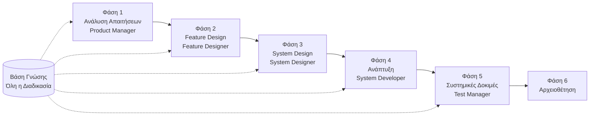

# Οδηγός Γρήγορης Εκκίνησης SpecCrew

<p align="center">
  <a href="./GETTING-STARTED.md">简体中文</a> |
  <a href="./GETTING-STARTED.zh-TW.md">繁體中文</a> |
  <a href="./GETTING-STARTED.en.md">English</a> |
  <a href="./GETTING-STARTED.ko.md">한국어</a> |
  <a href="./GETTING-STARTED.de.md">Deutsch</a> |
  <a href="./GETTING-STARTED.es.md">Español</a> |
  <a href="./GETTING-STARTED.fr.md">Français</a> |
  <a href="./GETTING-STARTED.it.md">Italiano</a> |
  <a href="./GETTING-STARTED.da.md">Dansk</a> |
  <a href="./GETTING-STARTED.ja.md">日本語</a> |
  <a href="./GETTING-STARTED.ar.md">العربية</a>
</p>

Αυτό το έγγραφο σας βοηθά να κατανοήσετε γρήγορα πώς να χρησιμοποιήσετε την ομάδα Agent του SpecCrew για να ολοκληρώσετε την πλήρη ανάπτυξη από τις απαιτήσεις έως την παράδοση σύμφωνα με τυπικές διαδικασίες μηχανικής.

---

## 1. Προαπαιτούμενα

### Εγκατάσταση SpecCrew

```bash
npm install -g speccrew
```

### Αρχικοποίηση Έργου

```bash
speccrew init --ide qoder
```

Υποστηριζόμενα IDE: `qoder`, `cursor`, `claude`, `codex`

### Δομή Καταλόγων Μετά την Αρχικοποίηση

```
.
├── .qoder/
│   ├── agents/          # Αρχεία ορισμού Agents
│   └── skills/          # Αρχεία ορισμού Skills
├── speccrew-workspace/  # Workspace
│   ├── docs/            # Διαμορφώσεις, κανόνες, πρότυπα, λύσεις
│   ├── iterations/      # Τρέχουσες επαναλήψεις
│   ├── iteration-archives/  # Αρχειοθετημένες επαναλήψεις
│   └── knowledges/      # Βάση γνώσεων
│       ├── base/        # Βασικές πληροφορίες (εκθέσεις διάγνωσης, τεχνικό χρέος)
│       ├── bizs/        # Επιχειρηματική βάση γνώσεων
│       └── techs/       # Τεχνική βάση γνώσεων
```

### Γρήγορη Αναφορά Εντολών CLI

| Εντολή | Περιγραφή |
|------|------|
| `speccrew list` | Λίστα όλων των διαθέσιμων Agents και Skills |
| `speccrew doctor` | Έλεγχος ακεραιότητας εγκατάστασης |
| `speccrew update` | Ενημέρωση διαμόρφωσης έργου στην τελευταία έκδοση |
| `speccrew uninstall` | Απεγκατάσταση SpecCrew |

---

## 2. Γρήγορη Εκκίνηση σε 5 Λεπτά Μετά την Εγκατάσταση

Μετά την εκτέλεση `speccrew init`, ακολουθήστε αυτά τα βήματα για γρήγορη μετάβαση σε κατάσταση εργασίας:

### Βήμα 1: Επιλέξτε το IDE σας

| IDE | Εντολή Αρχικοποίησης | Σενάριο Εφαρμογής |
|-----|-----------|----------|
| **Qoder** (Συνιστάται) | `speccrew init --ide qoder` | Πλήρης ενορχήστρωση agents, παράλληλοι workers |
| **Cursor** | `speccrew init --ide cursor` | Ροές εργασίας βασισμένες σε Composer |
| **Claude Code** | `speccrew init --ide claude` | Ανάπτυξη CLI-first |
| **Codex** | `speccrew init --ide codex` | Ενσωμάτωση οικοσυστήματος OpenAI |

### Βήμα 2: Αρχικοποίηση Βάσης Γνώσεων (Συνιστάται)

Για έργα με υπάρχοντα πηγαίο κώδικα, συνιστάται η αρχικοποίηση της βάσης γνώσεων πρώτα ώστε οι agents να κατανοήσουν τη βάση κώδικά σας:

```
@speccrew-team-leader αρχικοποίηση τεχνικής βάσης γνώσεων
```

Στη συνέχεια:

```
@speccrew-team-leader αρχικοποίηση επιχειρηματικής βάσης γνώσεων
```

### Βήμα 3: Ξεκινήστε την Πρώτη σας Εργασία

```
@speccrew-product-manager Έχω μια νέα απαίτηση: [περιγράψτε τη λειτουργική απαίτησή σας]
```

> **Συμβουλή**: Αν δεν είστε σίγουροι τι να κάνετε, απλά πείτε `@speccrew-team-leader βοηθήστε με να ξεκινήσω` — ο Team Leader θα ανιχνεύσει αυτόματα την κατάσταση του έργου σας και θα σας καθοδηγήσει.

---

## 3. Γρήγορο Δέντρο Αποφάσεων

Δεν είστε σίγουροι τι να κάνετε; Βρείτε το σενάριό σας παρακάτω:

- **Έχω μια νέα λειτουργική απαίτηση**
  → `@speccrew-product-manager Έχω μια νέα απαίτηση: [περιγράψτε τη λειτουργική απαίτησή σας]`

- **Θέλω να σαρώσω τη γνώση υπάρχοντος έργου**
  → `@speccrew-team-leader αρχικοποίηση τεχνικής βάσης γνώσεων`
  → Στη συνέχεια: `@speccrew-team-leader αρχικοποίηση επιχειρηματικής βάσης γνώσεων`

- **Θέλω να συνεχίσω την προηγούμενη εργασία**
  → `@speccrew-team-leader ποια είναι η τρέχουσα πρόοδος;`

- **Θέλω να ελέγξω την κατάσταση υγείας του συστήματος**
  → Εκτέλεση στο τερματικό: `speccrew doctor`

- **Δεν είμαι σίγουρος τι να κάνω**
  → `@speccrew-team-leader βοηθήστε με να ξεκινήσω`
  → Ο Team Leader θα ανιχνεύσει αυτόματα την κατάσταση του έργου σας και θα σας καθοδηγήσει

---

## 4. Γρήγορη Αναφορά Agents

| Ρόλος | Agent | Ευθύνες | Παράδειγμα Εντολής |
|------|-------|-----------------|-----------------|
| Αρχηγός Ομάδας | `@speccrew-team-leader` | Πλοήγηση έργου, αρχικοποίηση βάσης γνώσης, έλεγχος κατάστασης | "Βοηθήστε με να ξεκινήσω" |
| Διαχειριστής Προϊόντος | `@speccrew-product-manager` | Ανάλυση απαιτήσεων, δημιουργία PRD | "Έχω μια νέα απαίτηση: ..." |
| Σχεδιαστής Λειτουργιών | `@speccrew-feature-designer` | Ανάλυση λειτουργιών, σχεδιασμός προδιαγραφών, συμβάσεις API | "Έναρξη σχεδιασμού λειτουργιών για επανάληψη X" |
| Σχεδιαστής Συστήματος | `@speccrew-system-designer` | Σχεδιασμός αρχιτεκτονικής, λεπτομερής σχεδιασμός πλατφόρμας | "Έναρξη σχεδιασμού συστήματος για επανάληψη X" |
| Προγραμματιστής Συστήματος | `@speccrew-system-developer` | Συντονισμός ανάπτυξης, δημιουργία κώδικα | "Έναρξη ανάπτυξης για επανάληψη X" |
| Διαχειριστής Δοκιμών | `@speccrew-test-manager` | Σχεδιασμός δοκιμών, σχεδιασμός περιπτώσεων, εκτέλεση | "Έναρξη δοκιμών για επανάληψη X" |

> **Σημείωση**: Δεν χρειάζεται να θυμάστε όλους τους agents. Απλά μιλήστε με `@speccrew-team-leader` και θα δρομολογήσει το αίτημά σας στον σωστό agent.

---

## 5. Επισκόπηση Ροής Εργασίας

### Πλήρες Διάγραμμα Ροής



### Βασικές Αρχές

1. **Εξαρτήσεις Φάσεων**: Το παράγωγο κάθε φάσης είναι η είσοδος για την επόμενη φάση
2. **Επιβεβαίωση Checkpoint**: Κάθε φάση έχει σημείο επιβεβαίωσης που απαιτεί έγκριση χρήστη πριν προχωρήσει στην επόμενη φάση
3. **Οδηγούμενο από Βάση Γνώσης**: Η βάση γνώσης διατρέχει όλη τη διαδικασία, παρέχοντας_context για όλες τις φάσεις

---

## 6. Βήμα Μηδέν: Αρχικοποίηση Βάσης Γνώσης

Πριν ξεκινήσετε την επίσημη διαδικασία μηχανικής, πρέπει να αρχικοποιήσετε τη βάση γνώσης του έργου.

### 6.1 Αρχικοποίηση Τεχνικής Βάσης Γνώσης

**Παράδειγμα Συνομιλίας**:
```
@speccrew-team-leader αρχικοποίηση τεχνικής βάσης γνώσης
```

**Τριφασική Διαδικασία**:
1. Ανίχνευση Πλατφόρμας — Αναγνώριση τεχνικών πλατφορμών στο έργο
2. Δημιουργία Τεχνικής Τεκμηρίωσης — Δημιουργία εγγράφων τεχνικών προδιαγραφών για κάθε πλατφόρμα
3. Δημιουργία Ευρετηρίου — Δημιουργία ευρετηρίου βάσης γνώσης

**Παράγωγο**:
```
speccrew-workspace/knowledges/techs/{platform-id}/
├── tech-stack.md          # Ορισμός τεχνολογικού stack
├── architecture.md        # Αρχιτεκτονικές συμβάσεις
├── dev-spec.md            # Προδιαγραφές ανάπτυξης
├── test-spec.md           # Προδιαγραφές δοκιμών
└── INDEX.md               # Αρχείο ευρετηρίου
```

### 6.2 Αρχικοποίηση Επιχειρηματικής Βάσης Γνώσης

**Παράδειγμα Συνομιλίας**:
```
@speccrew-team-leader αρχικοποίηση επιχειρηματικής βάσης γνώσης
```

**Τετραφασική Διαδικασία**:
1. Καταγραφή Λειτουργιών — Σάρωση κώδικα για αναγνώριση όλων των λειτουργιών
2. Ανάλυση Λειτουργιών — Ανάλυση επιχειρηματικής λογικής για κάθε λειτουργία
3. Σύνοψη Ενότητας — Σύνοψη λειτουργιών ανά ενότητα
4. Συνοπτική Παρουσίαση Συστήματος — Δημιουργία επιχειρηματικής επισκόπησης σε επίπεδο συστήματος

**Παράγωγο**:
```
speccrew-workspace/knowledges/bizs/
├── {platform-type}/
│   └── {module-name}/
│       └── feature-spec.md
└── system-overview.md
```

---

## 7. Οδηγός Συνομιλίας Ανά Φάση

### 7.1 Φάση 1: Ανάλυση Απαιτήσεων (Product Manager)

**Πώς να ξεκινήσετε**:
```
@speccrew-product-manager Έχω μια νέα απαίτηση: [περιγράψτε την απαίτησή σας]
```

**Ροή Εργασίας Agent**:
1. Διαβάστε την επισκόπηση συστήματος για κατανόηση υπαρχόντων ενοτήτων
2. Αναλύστε τις απαιτήσεις χρήστη
3. Δημιουργήστε δομημένο έγγραφο PRD

**Παράγωγο**:
```
iterations/{αριθμός}-{τύπος}-{όνομα}/01.product-requirement/
├── [feature-name]-prd.md           # Έγγραφο Απαιτήσεων Προϊόντος
└── [feature-name]-bizs-modeling.md # Επιχειρηματική μοντελοποίηση (για σύνθετες απαιτήσεις)
```

**Λίστα Ελέγχου Επιβεβαίωσης**:
- [ ] Η περιγραφή απαίτησης αντικατοπτρίζει ακριβώς την πρόθεση του χρήστη;
- [ ] Οι επιχειρηματικοί κανόνες είναι πλήρεις;
- [ ] Τα σημεία ενσωμάτωσης με υπάρχοντα συστήματα είναι ξεκάθαρα;
- [ ] Τα κριτήρια αποδοχής είναι μετρήσιμα;

---

### 7.2 Φάση 2: Feature Design (Feature Designer)

**Πώς να ξεκινήσετε**:
```
@speccrew-feature-designer έναρξη feature design
```

**Ροή Εργασίας Agent**:
1. Αυτόματος εντοπισμός επιβεβαιωμένου εγγράφου PRD
2. Φόρτωση επιχειρηματικής βάσης γνώσης
3. Δημιουργία feature design (συμπεριλαμβανομένων UI wireframes, ροών αλληλεπίδρασης, ορισμών δεδομένων, συμβάσεων API)
4. Για πολλαπλά PRD, χρησιμοποιήστε Task Worker για παράλληλο σχεδιασμό

**Παράγωγο**:
```
iterations/{iter}/02.feature-design/
└── [feature-name]-feature-spec.md  # Έγγραφο feature design
```

**Λίστα Ελέγχου Επιβεβαίωσης**:
- [ ] Όλα τα σενάρια χρήστη καλύπτονται;
- [ ] Οι ροές αλληλεπίδρασης είναι ξεκάθαρες;
- [ ] Οι ορισμοί πεδίων δεδομένων είναι πλήρεις;
- [ ] Η διαχείριση εξαιρέσεων είναι περιεκτική;

---

### 7.3 Φάση 3: System Design (System Designer)

**Πώς να ξεκινήσετε**:
```
@speccrew-system-designer έναρξη system design
```

**Ροή Εργασίας Agent**:
1. Εντοπισμός Feature Spec και API Contract
2. Φόρτωση τεχνικής βάσης γνώσης (τεχνολογικό stack, αρχιτεκτονική, προδιαγραφές για κάθε πλατφόρμα)
3. **Checkpoint A**: Αξιολόγηση Framework — Ανάλυση τεχνικών κενών, σύσταση νέων frameworks (εάν απαιτείται), αναμονή επιβεβαίωσης χρήστη
4. Δημιουργία DESIGN-OVERVIEW.md
5. Χρήση Task Worker για παράλληλη διανομή σχεδιασμού για κάθε πλατφόρμα (frontend/backend/mobile/desktop)
6. **Checkpoint B**: Κοινή Επιβεβαίωση — Εμφάνιση σύνοψης όλων των σχεδιασμών πλατφορμών, αναμονή επιβεβαίωσης χρήστη

**Παράγωγο**:
```
iterations/{iter}/03.system-design/
├── DESIGN-OVERVIEW.md              # Επισκόπηση σχεδιασμού
├── {platform-id}/
│   ├── INDEX.md                    # Ευρετήριο σχεδιασμού πλατφόρμας
│   └── {module}-design.md          # Σχεδιασμός ενότητας επιπέδου ψευδοκώδικα
```

**Λίστα Ελέγχου Επιβεβαίωσης**:
- [ ] Ο ψευδοκώδικας χρησιμοποιεί την πραγματική σύνταξη framework;
- [ ] Οι δια-πλατφορμικές συμβάσεις API είναι συνεπείς;
- [ ] Η στρατηγική διαχείρισης σφαλμάτων είναι ενοποιημένη;

---

### 7.4 Φάση 4: Ανάπτυξη (System Developer)

**Πώς να ξεκινήσετε**:
```
@speccrew-system-developer έναρξη ανάπτυξης
```

**Ροή Εργασίας Agent**:
1. Ανάγνωση εγγράφων σχεδιασμού συστήματος
2. Φόρτωση τεχνικών γνώσεων για κάθε πλατφόρμα
3. **Checkpoint A**: Προ-έλεγχος Περιβάλλοντος — Έλεγχος εκδόσεων runtime, εξαρτήσεων, διαθεσιμότητας υπηρεσιών; αναμονή επίλυσης χρήστη εάν αποτύχει
4. Χρήση Task Worker για παράλληλη διανομή ανάπτυξης για κάθε πλατφόρμα
5. Έλεγχος ενσωμάτωσης: στοίχιση συμβάσεων API, συνέπεια δεδομένων
6. Έξοδος αναφοράς παράδοσης

**Παράγωγο**:
```
# Ο πηγαίος κώδικας γράφεται στον πραγματικό κατάλογο πηγαίου κώδικα του έργου
iterations/{iter}/04.development/
├── {platform-id}/
│   └── tasks/                      # Καταγραφές εργασιών ανάπτυξης
└── delivery-report.md
```

**Λίστα Ελέγχου Επιβεβαίωσης**:
- [ ] Το περιβάλλον είναι έτοιμο;
- [ ] Τα προβλήματα ενσωμάτωσης είναι σε αποδεκτό εύρος;
- [ ] Ο κώδικας συμμορφώνεται με τις προδιαγραφές ανάπτυξης;

---

### 7.5 Φάση 5: Συστημικές Δοκιμές (Test Manager)

**Πώς να ξεκινήσετε**:
```
@speccrew-test-manager έναρξη δοκιμών
```

**Τριφασική Διαδικασία Δοκιμών**:

| Φάση | Περιγραφή | Checkpoint |
|-------|-------------|------------|
| Σχεδιασμός Περιπτώσεων Δοκιμής | Δημιουργία περιπτώσεων δοκιμής βάσει PRD και Feature Spec | A: Εμφάνιση στατιστικών κάλυψης περιπτώσεων και πίνακα ιχνηλασιμότητας, αναμονή επιβεβαίωσης χρήστη επαρκούς κάλυψης |
| Δημιουργία Κώδικα Δοκιμής | Δημιουργία εκτελέσιμου κώδικα δοκιμής | B: Εμφάνιση δημιουργημένων αρχείων δοκιμής και αντιστοίχισης περιπτώσεων, αναμονή επιβεβαίωσης χρήστη |
| Εκτέλεση Δοκιμών και Αναφορά Σφαλμάτων | Αυτόματη εκτέλεση δοκιμών και δημιουργία αναφορών | Καμία (αυτόματη εκτέλεση) |

**Παράγωγο**:
```
iterations/{iter}/05.system-test/
├── cases/
│   └── {platform-id}/              # Έγγραφα περιπτώσεων δοκιμής
├── code/
│   └── {platform-id}/              # Σχέδιο κώδικα δοκιμής
├── reports/
│   └── test-report-{date}.md       # Αναφορά δοκιμής
└── bugs/
    └── BUG-{id}-{title}.md         # Αναφορές σφαλμάτων (ένα αρχείο ανά σφάλμα)
```

**Λίστα Ελέγχου Επιβεβαίωσης**:
- [ ] Η κάλυψη περιπτώσεων είναι πλήρης;
- [ ] Ο κώδικας δοκιμής είναι εκτελέσιμος;
- [ ] Η αξιολόγηση σοβαρότητας σφαλμάτων είναι ακριβής;

---

### 7.6 Φάση 6: Αρχειοθέτηση

Οι επαναλήψεις αρχειοθετούνται αυτόματα μετά την ολοκλήρωση:

```
speccrew-workspace/iteration-archives/
└── {αριθμός}-{τύπος}-{όνομα}-{ημερομηνία}/
    ├── 01.product-requirement/
    ├── 02.feature-design/
    ├── 03.system-design/
    ├── 04.development/
    └── 05.system-test/
```

---

## 8. Επισκόπηση Βάσης Γνώσης

### 8.1 Επιχειρηματική Βάση Γνώσης (bizs)

**Σκοπός**: Αποθήκευση περιγραφών επιχειρηματικών λειτουργιών έργου, διαιρέσεων ενοτήτων, χαρακτηριστικών API

**Δομή Καταλόγων**:
```
knowledges/bizs/
├── {platform-type}/
│   └── {module-name}/
│       └── feature-spec.md
└── system-overview.md
```

**Σενάρια Χρήσης**: Product Manager, Feature Designer

### 8.2 Τεχνική Βάση Γνώσης (techs)

**Σκοπός**: Αποθήκευση τεχνολογικού stack έργου, αρχιτεκτονικών συμβάσεων, προδιαγραφών ανάπτυξης, προδιαγραφών δοκιμών

**Δομή Καταλόγων**:
```
knowledges/techs/{platform-id}/
├── tech-stack.md
├── architecture.md
├── dev-spec.md
├── test-spec.md
└── INDEX.md
```

**Σενάρια Χρήσης**: System Designer, System Developer, Test Manager

---

## 9. Διαχείριση Προόδου Ροής Εργασίας

Η εικονική ομάδα SpecCrew ακολουθεί αυστηρό μηχανισμό stage-gating όπου κάθε φάση πρέπει να επιβεβαιωθεί από τον χρήστη πριν προχωρήσει στην επόμενη. Υποστηρίζει επίσης επανεκκινήσιμη εκτέλεση — όταν επανεκκινείται μετά από διακοπή, συνεχίζει αυτόματα από όπου σταμάτησε.

### 9.1 Τριών Επιπέδων Αρχεία Προόδου

Η ροή εργασίας διατηρεί αυτόματα τρεις τύπους αρχείων προόδου JSON, που βρίσκονται στον κατάλογο επανάληψης:

| Αρχείο | Τοποθεσία | Σκοπός |
|------|----------|---------|
| `WORKFLOW-PROGRESS.json` | `iterations/{iter}/` | Καταγράφει την κατάσταση κάθε φάσης pipeline |
| `.checkpoints.json` | Κάτω από κάθε κατάλογο φάσης | Καταγράφει την κατάσταση επιβεβαίωσης checkpoint χρήστη |
| `DISPATCH-PROGRESS.json` | Κάτω από κάθε κατάλογο φάσης | Καταγράφει την πρόοδο ανά στοιχείο για παράλληλες εργασίες (multi-platform/multi-module) |

### 9.2 Ροή Κατάστασης Φάσης

Κάθε φάση ακολουθεί αυτή τη ροή κατάστασης:

```
pending → in_progress → completed → confirmed
```

- **pending**: Δεν έχει ξεκινήσει ακόμη
- **in_progress**: Σε εκτέλεση
- **completed**: Η εκτέλεση agent ολοκληρώθηκε, αναμονή επιβεβαίωσης χρήστη
- **confirmed**: Ο χρήστης επιβεβαίωσε μέσω τελικού checkpoint, η επόμενη φάση μπορεί να ξεκινήσει

### 9.3 Επανεκκινήσιμη Εκτέλεση

Κατά την επανεκκίνηση Agent για φάση:

1. **Αυτόματος έλεγχος upstream**: Επαληθεύει εάν η προηγούμενη φάση έχει επιβεβαιωθεί, μπλοκάρει και ζητά εάν όχι
2. **Ανάκτηση Checkpoint**: Διαβάζει `.checkpoints.json`, παρακάμπτει περασμένα checkpoints, συνεχίζει από το τελευταίο σημείο διακοπής
3. **Ανάκτηση Παράλληλων Εργασιών**: Διαβάζει `DISPATCH-PROGRESS.json`, επανεκτελεί μόνο εργασίες με κατάσταση `pending` ή `failed`, παρακάμπτει εργασίες `completed`

### 9.4 Προβολή Τρέχουσας Προόδου

Προβολή κατάστασης panorama pipeline μέσω Agent Team Leader:

```
@speccrew-team-leader προβολή τρέχουσας προόδου επανάληψης
```

Ο Team Leader θα διαβάσει τα αρχεία προόδου και θα εμφανίζει επισκόπηση κατάστασης παρόμοια με:

```
Pipeline Status: i001-user-management
  01 PRD:            ✅ Confirmed
  02 Feature Design: 🔄 In Progress (Checkpoint A passed)
  03 System Design:  ⏳ Pending
  04 Development:    ⏳ Pending
  05 System Test:    ⏳ Pending
```

### 9.5 Πίσω Συμβατότητα

Ο μηχανισμός αρχείων προόδου είναι πλήρως πίσω συμβατός — εάν τα αρχεία προόδου δεν υπάρχουν (π.χ. σε legacy έργα ή νέες επαναλήψεις), όλοι οι Agents θα εκτελούνται κανονικά σύμφωνα με την αρχική λογική.

---

## 10. Συχνές Ερωτήσεις (FAQ)

### Ε1: Τι κάνω εάν ο Agent δεν λειτουργεί όπως αναμενόταν;

1. Εκτελέστε `speccrew doctor` για έλεγχο ακεραιότητας εγκατάστασης
2. Επιβεβαιώστε ότι η βάση γνώσης έχει αρχικοποιηθεί
3. Επιβεβαιώστε ότι το παράγωγο της προηγούμενης φάσης υπάρχει στον τρέχοντα κατάλογο επανάληψης

### Ε2: Πώς παραλείπω μια φάση;

**Δεν συνιστάται** — Η έξοδος κάθε φάσης είναι η είσοδος για την επόμενη φάση.

Εάν πρέπει να παραλείψετε, προετοιμάστε χειροκίνητα το έγγραφο εισόδου της αντίστοιχης φάσης και βεβαιωθείτε ότι συμμορφώνεται με τις προδιαγραφές μορφής.

### Ε3: Πώς χειρίζομαι πολλαπλές παράλληλες απαιτήσεις;

Δημιουργήστε ανεξάρτητους καταλόγους επανάληψης για κάθε απαίτηση:
```
iterations/
├── 001-feature-xxx/
├── 002-feature-yyy/
└── 003-feature-zzz/
```

Κάθε επανάληψη είναι πλήρως απομονωμένη και δεν επηρεάζει τις άλλες.

### Ε4: Πώς ενημερώνω την έκδοση SpecCrew;

Η ενημέρωση απαιτεί δύο βήματα:

```bash
# Βήμα 1: Ενημέρωση παγκόσμιου εργαλείου CLI
npm install -g speccrew@latest

# Βήμα 2: Συγχρονισμός Agents και Skills στον κατάλογο έργου σας
cd /path/to/your-project
speccrew update
```

- `npm install -g speccrew@latest`: Ενημερώνει το ίδιο το εργαλείο CLI (νέες εκδόσεις μπορεί να περιλαμβάνουν νέους ορισμούς Agent/Skill, διορθώσεις σφαλμάτων κ.λπ.)
- `speccrew update`: Συγχρονίζει τα αρχεία ορισμού Agent και Skill του έργου σας στην τελευταία έκδοση
- `speccrew update --ide cursor`: Ενημερώνει τη διαμόρφωση μόνο για συγκεκριμένο IDE

> **Σημείωση**: Και τα δύο βήματα απαιτούνται. Η εκτέλεση μόνο `speccrew update` δεν θα ενημερώσει το ίδιο το εργαλείο CLI· η εκτέλεση μόνο `npm install` δεν θα ενημερώσει τα αρχεία του έργου.

### Ε5: Το `speccrew update` δείχνει νέα έκδοση διαθέσιμη αλλά το `npm install -g speccrew@latest` εξακολουθεί να εγκαθιστά την παλιά έκδοση;

Αυτό συνήθως προκαλείται από την κρυφή μνήμη npm. Λύση:

```bash
# Εκκαθάριση κρυφής μνήμης npm και επανεγκατάσταση
npm cache clean --force
npm install -g speccrew@latest

# Επαλήθευση έκδοσης
npm list -g speccrew
```

Εάν εξακολουθεί να μην λειτουργεί, δοκιμάστε εγκατάσταση με συγκεκριμένο αριθμό έκδοσης:
```bash
npm install -g speccrew@0.5.6
```

### Ε6: Πώς προβάλλω ιστορικές επαναλήψεις;

Μετά την αρχειοθέτηση, προβολή σε `speccrew-workspace/iteration-archives/`, οργανωμένο ανά μορφή `{αριθμός}-{τύπος}-{όνομα}-{ημερομηνία}/`.

### Ε7: Χρειάζεται η βάση γνώσης τακτικές ενημερώσεις;

Επαναρχικοποίηση απαιτείται στις ακόλουθες καταστάσεις:
- Σημαντικές αλλαγές στη δομή του έργου
- Αναβάθμιση ή αντικατάσταση τεχνολογικού stack
- Προσθήκη/αφαίρεση επιχειρηματικών ενοτήτων

---

## 11. Γρήγορη Αναφορά

### Γρήγορη Αναφορά Εκκίνησης Agents

| Φάση | Agent | Συνομιλία Εκκίνησης |
|-------|-------|-------------------|
| Αρχικοποίηση | Team Leader | `@speccrew-team-leader αρχικοποίηση τεχνικής βάσης γνώσης` |
| Ανάλυση Απαιτήσεων | Product Manager | `@speccrew-product-manager Έχω μια νέα απαίτηση: [περιγραφή]` |
| Feature Design | Feature Designer | `@speccrew-feature-designer έναρξη feature design` |
| System Design | System Designer | `@speccrew-system-designer έναρξη system design` |
| Ανάπτυξη | System Developer | `@speccrew-system-developer έναρξη ανάπτυξης` |
| Συστημικές Δοκιμές | Test Manager | `@speccrew-test-manager έναρξη δοκιμών` |

### Λίστα Ελέγχου Checkpoint

| Φάση | Αριθμός Checkpoint | Βασικά Στοιχεία Ελέγχου |
|-------|----------------------|-----------------|
| Ανάλυση Απαιτήσεων | 1 | Ακρίβεια απαιτήσεων, πληρότητα επιχειρηματικών κανόνων, μετρησιμότητα κριτηρίων αποδοχής |
| Feature Design | 1 | Κάλυψη σεναρίων, σαφήνεια αλληλεπίδρασης, πληρότητα δεδομένων, διαχείριση εξαιρέσεων |
| System Design | 2 | A: Αξιολόγηση framework; B: Σύνταξη ψευδοκώδικα, δια-πλατφορμική συνέπεια, διαχείριση σφαλμάτων |
| Ανάπτυξη | 1 | A: Ετοιμότητα περιβάλλοντος, προβλήματα ενσωμάτωσης, προδιαγραφές κώδικα |
| Συστημικές Δοκιμές | 2 | A: Κάλυψη περιπτώσεων; B: Εκτελεσιμότητα κώδικα δοκιμής |

### Γρήγορη Αναφορά Διαδρομών Παραγώγων

| Φάση | Κατάλογος Εξόδου | Μορφή Αρχείου |
|-------|-----------------|-------------|
| Ανάλυση Απαιτήσεων | `iterations/{iter}/01.product-requirement/` | `[name]-prd.md`, `[name]-bizs-modeling.md` |
| Feature Design | `iterations/{iter}/02.feature-design/` | `[name]-feature-spec.md` |
| System Design | `iterations/{iter}/03.system-design/` | `DESIGN-OVERVIEW.md`, `{platform}/INDEX.md`, `{platform}/{module}-design.md` |
| Ανάπτυξη | `iterations/{iter}/04.development/` | Πηγαίος κώδικας + `delivery-report.md` |
| Συστημικές Δοκιμές | `iterations/{iter}/05.system-test/` | `cases/`, `code/`, `reports/`, `bugs/` |
| Αρχειοθέτηση | `iteration-archives/{iter}-{date}/` | Πλήρες αντίγραφο επανάληψης |

---

## Επόμενα Βήματα

1. Εκτελέστε `speccrew init --ide qoder` για αρχικοποίηση του έργου σας
2. Εκτελέστε Βήμα Μηδέν: Αρχικοποίηση Βάσης Γνώσης
3. Προχωρήστε φάση ανά φάση σύμφωνα με τη ροή εργασίας, απολαύστε την εμπειρία ανάπτυξης βάσει προδιαγραφών!
