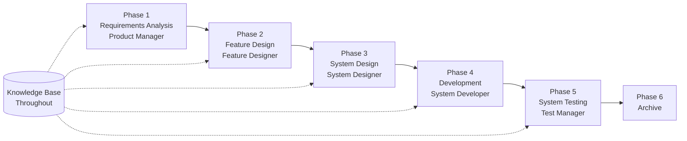

# SpecCrew Quick Start Guide

<p align="center">
  <a href="./GETTING-STARTED.md">简体中文</a> |
  <a href="./GETTING-STARTED.zh-TW.md">繁體中文</a> |
  <a href="./GETTING-STARTED.en.md">English</a> |
  <a href="./GETTING-STARTED.ko.md">한국어</a> |
  <a href="./GETTING-STARTED.de.md">Deutsch</a> |
  <a href="./GETTING-STARTED.es.md">Español</a> |
  <a href="./GETTING-STARTED.fr.md">Français</a> |
  <a href="./GETTING-STARTED.it.md">Italiano</a> |
  <a href="./GETTING-STARTED.da.md">Dansk</a> |
  <a href="./GETTING-STARTED.ja.md">日本語</a> |
  <a href="./GETTING-STARTED.ar.md">العربية</a>
</p>

This document helps you quickly understand how to use SpecCrew's Agent team to complete the full development cycle from requirements to delivery following standard engineering processes.

---

## 1. Prerequisites

### Install SpecCrew

```bash
npm install -g speccrew
```

### Initialize Project

```bash
speccrew init --ide qoder
```

Supported IDEs: `qoder`, `cursor`, `claude`, `codex`

### Directory Structure After Initialization

```
.
├── .qoder/
│   ├── agents/          # Agent definition files
│   └── skills/          # Skill definition files
├── speccrew-workspace/  # Workspace
│   ├── docs/            # Configurations, rules, templates, solutions
│   ├── iterations/      # Current ongoing iterations
│   ├── iteration-archives/  # Archived iterations
│   └── knowledges/      # Knowledge base
│       ├── base/        # Basic info (diagnosis reports, tech debts)
│       ├── bizs/        # Business knowledge base
│       └── techs/       # Technical knowledge base
```

### CLI Command Quick Reference

| Command | Description |
|---------|-------------|
| `speccrew list` | List all available Agents and Skills |
| `speccrew doctor` | Check installation integrity |
| `speccrew update` | Update project configuration to the latest version |
| `speccrew uninstall` | Uninstall SpecCrew |

---

## 2. Workflow Overview

### Complete Flowchart



### Core Principles

1. **Phase Dependencies**: Each phase's deliverable is the input for the next phase
2. **Checkpoint Confirmation**: Each phase has a confirmation point that requires user approval before proceeding to the next phase
3. **Knowledge Base Driven**: The knowledge base runs throughout the entire process, providing context for all phases

---

## 3. Step Zero: Project Diagnosis and Knowledge Base Initialization

Before starting the formal engineering process, you need to initialize the project knowledge base.

### 3.1 Project Diagnosis

**Conversation Example**:
```
@speccrew-team-leader diagnose project
```

**What the Agent Will Do**:
- Scan project structure
- Detect technology stack
- Identify business modules

**Deliverable**:
```
speccrew-workspace/knowledges/base/diagnosis-reports/diagnosis-report-{date}.md
```

### 3.2 Technical Knowledge Base Initialization

**Conversation Example**:
```
@speccrew-team-leader initialize technical knowledge base
```

**Three-Phase Process**:
1. Platform Detection — Identify technical platforms in the project
2. Technical Documentation Generation — Generate technical specification documents for each platform
3. Index Generation — Establish knowledge base index

**Deliverable**:
```
speccrew-workspace/knowledges/techs/{platform-id}/
├── tech-stack.md          # Technology stack definition
├── architecture.md        # Architecture conventions
├── dev-spec.md            # Development specifications
├── test-spec.md           # Testing specifications
└── INDEX.md               # Index file
```

### 3.3 Business Knowledge Base Initialization

**Conversation Example**:
```
@speccrew-team-leader initialize business knowledge base
```

**Four-Phase Process**:
1. Feature Inventory — Scan code to identify all functional features
2. Feature Analysis — Analyze business logic for each feature
3. Module Summary — Summarize features by module
4. System Summary — Generate system-level business overview

**Deliverable**:
```
speccrew-workspace/knowledges/bizs/
├── {platform-type}/
│   └── {module-name}/
│       └── feature-spec.md
└── system-overview.md
```

---

## 4. Phase-by-Phase Conversation Guide

### 4.1 Phase 1: Requirements Analysis (Product Manager)

**How to Start**:
```
@speccrew-product-manager I have a new requirement: [describe your requirement]
```

**Agent Workflow**:
1. Read system overview to understand existing modules
2. Analyze user requirements
3. Generate structured PRD document

**Deliverable**:
```
iterations/{number}-{type}-{name}/01.product-requirement/
├── [feature-name]-prd.md           # Product Requirements Document
└── [feature-name]-bizs-modeling.md # Business modeling (for complex requirements)
```

**Confirmation Checklist**:
- [ ] Does the requirement description accurately reflect user intent?
- [ ] Are business rules complete?
- [ ] Are integration points with existing systems clear?
- [ ] Are acceptance criteria measurable?

---

### 4.2 Phase 2: Feature Design (Feature Designer)

**How to Start**:
```
@speccrew-feature-designer start feature design
```

**Agent Workflow**:
1. Automatically locate the confirmed PRD document
2. Load business knowledge base
3. Generate feature design (including UI wireframes, interaction flows, data definitions, API contracts)
4. For multiple PRDs, use Task Worker for parallel design

**Deliverable**:
```
iterations/{iter}/02.feature-design/
└── [feature-name]-feature-spec.md  # Feature design document
```

**Confirmation Checklist**:
- [ ] Are all user scenarios covered?
- [ ] Are interaction flows clear?
- [ ] Are data field definitions complete?
- [ ] Is exception handling comprehensive?

---

### 4.3 Phase 3: System Design (System Designer)

**How to Start**:
```
@speccrew-system-designer start system design
```

**Agent Workflow**:
1. Locate Feature Spec and API Contract
2. Load technical knowledge base (tech stack, architecture, specifications for each platform)
3. **Checkpoint A**: Framework Evaluation — Analyze technical gaps, recommend new frameworks (if needed), wait for user confirmation
4. Generate DESIGN-OVERVIEW.md
5. Use Task Worker to parallel dispatch design for each platform (frontend/backend/mobile/desktop)
6. **Checkpoint B**: Joint Confirmation — Display summary of all platform designs, wait for user confirmation

**Deliverable**:
```
iterations/{iter}/03.system-design/
├── DESIGN-OVERVIEW.md              # Design overview
├── {platform-id}/
│   ├── INDEX.md                    # Platform design index
│   └── {module}-design.md          # Pseudocode-level module design
```

**Confirmation Checklist**:
- [ ] Does the pseudocode use actual framework syntax?
- [ ] Are cross-platform API contracts consistent?
- [ ] Is error handling strategy unified?

---

### 4.4 Phase 4: Development Implementation (System Developer)

**How to Start**:
```
@speccrew-system-developer start development
```

**Agent Workflow**:
1. Read system design documents
2. Load technical knowledge for each platform
3. **Checkpoint A**: Environment Pre-check — Check runtime versions, dependencies, service availability; wait for user resolution if failed
4. Use Task Worker to parallel dispatch development for each platform
5. Integration check: API contract alignment, data consistency
6. Output delivery report

**Deliverable**:
```
# Source code written to actual project source directory
iterations/{iter}/04.development/
├── {platform-id}/
│   └── tasks/                      # Development task records
└── delivery-report.md
```

**Confirmation Checklist**:
- [ ] Is the environment ready?
- [ ] Are integration issues within acceptable range?
- [ ] Does the code comply with development specifications?

---

### 4.5 Phase 5: System Testing (Test Manager)

**How to Start**:
```
@speccrew-test-manager start testing
```

**Three-Phase Testing Process**:

| Phase | Description | Checkpoint |
|-------|-------------|------------|
| Test Case Design | Generate test cases based on PRD and Feature Spec | A: Display case coverage statistics and traceability matrix, wait for user confirmation of sufficient coverage |
| Test Code Generation | Generate executable test code | B: Display generated test files and case mapping, wait for user confirmation |
| Test Execution and Bug Reporting | Automatically execute tests and generate reports | None (automatic execution) |

**Deliverable**:
```
iterations/{iter}/05.system-test/
├── cases/
│   └── {platform-id}/              # Test case documents
├── code/
│   └── {platform-id}/              # Test code plan
├── reports/
│   └── test-report-{date}.md       # Test report
└── bugs/
    └── BUG-{id}-{title}.md         # Bug reports (one file per bug)
```

**Confirmation Checklist**:
- [ ] Is case coverage complete?
- [ ] Is test code runnable?
- [ ] Is bug severity assessment accurate?

---

### 4.6 Phase 6: Archive

Iterations are automatically archived upon completion:

```
speccrew-workspace/iteration-archives/
└── {number}-{type}-{name}-{date}/
    ├── 01.product-requirement/
    ├── 02.feature-design/
    ├── 03.system-design/
    ├── 04.development/
    └── 05.system-test/
```

---

## 5. Knowledge Base Overview

### 5.1 Business Knowledge Base (bizs)

**Purpose**: Store project business function descriptions, module divisions, API characteristics

**Directory Structure**:
```
knowledges/bizs/
├── {platform-type}/
│   └── {module-name}/
│       └── feature-spec.md
└── system-overview.md
```

**Usage Scenarios**: Product Manager, Feature Designer

### 5.2 Technical Knowledge Base (techs)

**Purpose**: Store project technology stack, architecture conventions, development specifications, testing specifications

**Directory Structure**:
```
knowledges/techs/{platform-id}/
├── tech-stack.md
├── architecture.md
├── dev-spec.md
├── test-spec.md
└── INDEX.md
```

**Usage Scenarios**: System Designer, System Developer, Test Manager

---

## 6. Frequently Asked Questions (FAQ)

### Q1: What if the Agent doesn't work as expected?

1. Run `speccrew doctor` to check installation integrity
2. Confirm the knowledge base has been initialized
3. Confirm the previous phase's deliverable exists in the current iteration directory

### Q2: How to skip a phase?

**Not recommended** — Each phase's output is the input for the next phase.

If you must skip, manually prepare the corresponding phase's input document and ensure it follows the format specifications.

### Q3: How to handle multiple parallel requirements?

Create independent iteration directories for each requirement:
```
iterations/
├── 001-feature-xxx/
├── 002-feature-yyy/
└── 003-feature-zzz/
```

Each iteration is completely isolated and does not affect others.

### Q4: How to update SpecCrew version?

Update requires two steps:

```bash
# Step 1: Update the global CLI tool
npm install -g speccrew@latest

# Step 2: Sync Agents and Skills in your project directory
cd /path/to/your-project
speccrew update
```

- `npm install -g speccrew@latest`: Updates the CLI tool itself (new versions may include new Agent/Skill definitions, bug fixes, etc.)
- `speccrew update`: Syncs Agent and Skill definition files in your project to the latest version
- `speccrew update --ide cursor`: Updates configuration for a specific IDE only

> **Note**: Both steps are required. Running only `speccrew update` will not update the CLI tool itself; running only `npm install` will not update project files.

### Q5: How to view historical iterations?

After archiving, view in `speccrew-workspace/iteration-archives/`, organized by `{number}-{type}-{name}-{date}/` format.

### Q6: Does the knowledge base need regular updates?

Re-initialization is required in the following situations:
- Major changes to project structure
- Technology stack upgrade or replacement
- Addition/removal of business modules

---

## 7. Quick Reference

### Agent Start Quick Reference

| Phase | Agent | Start Conversation |
|-------|-------|-------------------|
| Diagnosis | Team Leader | `@speccrew-team-leader diagnose project` |
| Initialization | Team Leader | `@speccrew-team-leader initialize technical knowledge base` |
| Requirements Analysis | Product Manager | `@speccrew-product-manager I have a new requirement: [description]` |
| Feature Design | Feature Designer | `@speccrew-feature-designer start feature design` |
| System Design | System Designer | `@speccrew-system-designer start system design` |
| Development | System Developer | `@speccrew-system-developer start development` |
| System Testing | Test Manager | `@speccrew-test-manager start testing` |

### Checkpoint Checklist

| Phase | Number of Checkpoints | Key Check Items |
|-------|----------------------|-----------------|
| Requirements Analysis | 1 | Requirement accuracy, business rule completeness, acceptance criteria measurability |
| Feature Design | 1 | Scenario coverage, interaction clarity, data completeness, exception handling |
| System Design | 2 | A: Framework evaluation; B: Pseudocode syntax, cross-platform consistency, error handling |
| Development | 1 | A: Environment readiness, integration issues, code specifications |
| System Testing | 2 | A: Case coverage; B: Test code runnability |

### Deliverable Path Quick Reference

| Phase | Output Directory | File Format |
|-------|-----------------|-------------|
| Requirements Analysis | `iterations/{iter}/01.product-requirement/` | `[name]-prd.md`, `[name]-bizs-modeling.md` |
| Feature Design | `iterations/{iter}/02.feature-design/` | `[name]-feature-spec.md` |
| System Design | `iterations/{iter}/03.system-design/` | `DESIGN-OVERVIEW.md`, `{platform}/INDEX.md`, `{platform}/{module}-design.md` |
| Development | `iterations/{iter}/04.development/` | Source code + `delivery-report.md` |
| System Testing | `iterations/{iter}/05.system-test/` | `cases/`, `code/`, `reports/`, `bugs/` |
| Archive | `iteration-archives/{iter}-{date}/` | Complete iteration copy |

---

## Next Steps

1. Run `speccrew init --ide qoder` to initialize your project
2. Execute Step Zero: Project Diagnosis and Knowledge Base Initialization
3. Progress through each phase following the workflow, enjoying the specification-driven development experience!
