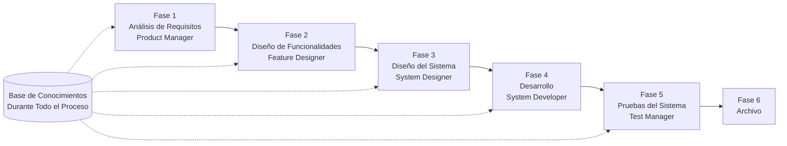

# Guía de Inicio Rápido de SpecCrew

<p align="center">
  <a href="./GETTING-STARTED.md">简体中文</a> |
  <a href="./GETTING-STARTED.zh-TW.md">繁體中文</a> |
  <a href="./GETTING-STARTED.en.md">English</a> |
  <a href="./GETTING-STARTED.ko.md">한국어</a> |
  <a href="./GETTING-STARTED.de.md">Deutsch</a> |
  <a href="./GETTING-STARTED.es.md">Español</a> |
  <a href="./GETTING-STARTED.fr.md">Français</a> |
  <a href="./GETTING-STARTED.it.md">Italiano</a> |
  <a href="./GETTING-STARTED.da.md">Dansk</a> |
  <a href="./GETTING-STARTED.ja.md">日本語</a> |
  <a href="./GETTING-STARTED.ar.md">العربية</a>
</p>

Este documento le ayuda a comprender rápidamente cómo usar el equipo de Agentes de SpecCrew para completar el ciclo completo de desarrollo desde los requisitos hasta la entrega siguiendo procesos de ingeniería estándar.

---

## 1. Requisitos Previos

### Instalar SpecCrew

```bash
npm install -g speccrew
```

### Inicializar Proyecto

```bash
speccrew init --ide qoder
```

IDEs soportados: `qoder`, `cursor`, `claude`, `codex`

### Estructura de Directorios Después de la Inicialización

```
.
├── .qoder/
│   ├── agents/          # Archivos de definición de Agentes
│   └── skills/          # Archivos de definición de Skills
├── speccrew-workspace/  # Espacio de trabajo
│   ├── docs/            # Configuraciones, reglas, plantillas, soluciones
│   ├── iterations/      # Iteraciones en curso
│   ├── iteration-archives/  # Iteraciones archivadas
│   └── knowledges/      # Base de conocimientos
│       ├── base/        # Información básica (informes de diagnóstico, deudas técnicas)
│       ├── bizs/        # Base de conocimientos de negocio
│       └── techs/       # Base de conocimientos técnica
```

### Referencia Rápida de Comandos CLI

| Comando | Descripción |
|---------|-------------|
| `speccrew list` | Listar todos los Agentes y Skills disponibles |
| `speccrew doctor` | Verificar integridad de la instalación |
| `speccrew update` | Actualizar configuración del proyecto a la última versión |
| `speccrew uninstall` | Desinstalar SpecCrew |

---

## 2. Visión General del Flujo de Trabajo

### Diagrama de Flujo Completo



### Principios Fundamentales

1. **Dependencias de Fases**: El entregable de cada fase es la entrada para la siguiente fase
2. **Confirmación de Checkpoint**: Cada fase tiene un punto de confirmación que requiere aprobación del usuario antes de proceder a la siguiente fase
3. **Impulsado por Base de Conocimientos**: La base de conocimientos se ejecuta durante todo el proceso, proporcionando contexto para todas las fases

---

## 3. Paso Cero: Inicialización de la Base de Conocimientos

Antes de comenzar el proceso formal de ingeniería, necesita inicializar la base de conocimientos del proyecto.

### 3.1 Inicialización de la Base de Conocimientos Técnica

**Ejemplo de Conversación**:
```
@speccrew-team-leader inicializar base de conocimientos técnica
```

**Proceso de Tres Fases**:
1. Detección de Plataforma — Identificar plataformas técnicas en el proyecto
2. Generación de Documentación Técnica — Generar documentos de especificación técnica para cada plataforma
3. Generación de Índice — Establecer índice de la base de conocimientos

**Entregable**:
```
speccrew-workspace/knowledges/techs/{platform-id}/
├── tech-stack.md          # Definición del stack tecnológico
├── architecture.md        # Convenciones de arquitectura
├── dev-spec.md            # Especificaciones de desarrollo
├── test-spec.md           # Especificaciones de pruebas
└── INDEX.md               # Archivo de índice
```

### 3.2 Inicialización de la Base de Conocimientos de Negocio

**Ejemplo de Conversación**:
```
@speccrew-team-leader inicializar base de conocimientos de negocio
```

**Proceso de Cuatro Fases**:
1. Inventario de Funcionalidades — Escanear código para identificar todas las funcionalidades
2. Análisis de Funcionalidades — Analizar la lógica de negocio de cada funcionalidad
3. Resumen por Módulo — Resumir funcionalidades por módulo
4. Resumen del Sistema — Generar visión general del negocio a nivel de sistema

**Entregable**:
```
speccrew-workspace/knowledges/bizs/
├── {platform-type}/
│   └── {module-name}/
│       └── feature-spec.md
└── system-overview.md
```

---

## 4. Guía de Conversación Fase por Fase

### 4.1 Fase 1: Análisis de Requisitos (Product Manager)

**Cómo Comenzar**:
```
@speccrew-product-manager tengo un nuevo requisito: [describa su requisito]
```

**Flujo de Trabajo del Agente**:
1. Leer visión general del sistema para entender módulos existentes
2. Analizar requisitos del usuario
3. Generar documento PRD estructurado

**Entregable**:
```
iterations/{número}-{tipo}-{nombre}/01.product-requirement/
├── [feature-name]-prd.md           # Documento de Requisitos del Producto
└── [feature-name]-bizs-modeling.md # Modelado de negocio (para requisitos complejos)
```

**Lista de Verificación de Confirmación**:
- [ ] ¿La descripción del requisito refleja con precisión la intención del usuario?
- [ ] ¿Las reglas de negocio están completas?
- [ ] ¿Los puntos de integración con sistemas existentes están claros?
- [ ] ¿Los criterios de aceptación son medibles?

---

### 4.2 Fase 2: Diseño de Funcionalidades (Feature Designer)

**Cómo Comenzar**:
```
@speccrew-feature-designer iniciar diseño de funcionalidades
```

**Flujo de Trabajo del Agente**:
1. Localizar automáticamente el documento PRD confirmado
2. Cargar base de conocimientos de negocio
3. Generar diseño de funcionalidades (incluyendo wireframes UI, flujos de interacción, definiciones de datos, contratos API)
4. Para múltiples PRDs, usar Task Worker para diseño paralelo

**Entregable**:
```
iterations/{iter}/02.feature-design/
└── [feature-name]-feature-spec.md  # Documento de diseño de funcionalidades
```

**Lista de Verificación de Confirmación**:
- [ ] ¿Están cubiertos todos los escenarios de usuario?
- [ ] ¿Los flujos de interacción son claros?
- [ ] ¿Las definiciones de campos de datos están completas?
- [ ] ¿El manejo de excepciones es completo?

---

### 4.3 Fase 3: Diseño del Sistema (System Designer)

**Cómo Comenzar**:
```
@speccrew-system-designer iniciar diseño del sistema
```

**Flujo de Trabajo del Agente**:
1. Localizar Feature Spec y API Contract
2. Cargar base de conocimientos técnica (stack tecnológico, arquitectura, especificaciones para cada plataforma)
3. **Checkpoint A**: Evaluación de Framework — Analizar brechas técnicas, recomendar nuevos frameworks (si es necesario), esperar confirmación del usuario
4. Generar DESIGN-OVERVIEW.md
5. Usar Task Worker para despacho paralelo de diseño para cada plataforma (frontend/backend/móvil/escritorio)
6. **Checkpoint B**: Confirmación Conjunta — Mostrar resumen de todos los diseños de plataforma, esperar confirmación del usuario

**Entregable**:
```
iterations/{iter}/03.system-design/
├── DESIGN-OVERVIEW.md              # Visión general del diseño
├── {platform-id}/
│   ├── INDEX.md                    # Índice de diseño de plataforma
│   └── {module}-design.md          # Diseño de módulo a nivel de pseudocódigo
```

**Lista de Verificación de Confirmación**:
- [ ] ¿El pseudocódigo usa sintaxis de framework real?
- [ ] ¿Los contratos API multiplataforma son consistentes?
- [ ] ¿La estrategia de manejo de errores es unificada?

---

### 4.4 Fase 4: Implementación de Desarrollo (System Developer)

**Cómo Comenzar**:
```
@speccrew-system-developer iniciar desarrollo
```

**Flujo de Trabajo del Agente**:
1. Leer documentos de diseño del sistema
2. Cargar conocimientos técnicos para cada plataforma
3. **Checkpoint A**: Pre-verificación de Ambiente — Verificar versiones de runtime, dependencias, disponibilidad de servicios; esperar resolución del usuario si falla
4. Usar Task Worker para despacho paralelo de desarrollo para cada plataforma
5. Verificación de integración: Alineación de contratos API, consistencia de datos
6. Generar informe de entrega

**Entregable**:
```
# Código fuente escrito en el directorio de código fuente real del proyecto
iterations/{iter}/04.development/
├── {platform-id}/
│   └── tasks/                      # Registros de tareas de desarrollo
└── delivery-report.md
```

**Lista de Verificación de Confirmación**:
- [ ] ¿Está listo el ambiente?
- [ ] ¿Los problemas de integración están dentro del rango aceptable?
- [ ] ¿El código cumple con las especificaciones de desarrollo?

---

### 4.5 Fase 5: Pruebas del Sistema (Test Manager)

**Cómo Comenzar**:
```
@speccrew-test-manager iniciar pruebas
```

**Proceso de Pruebas de Tres Fases**:

| Fase | Descripción | Checkpoint |
|------|-------------|------------|
| Diseño de Casos de Prueba | Generar casos de prueba basados en PRD y Feature Spec | A: Mostrar estadísticas de cobertura de casos y matriz de trazabilidad, esperar confirmación del usuario de cobertura suficiente |
| Generación de Código de Prueba | Generar código de prueba ejecutable | B: Mostrar archivos de prueba generados y mapeo de casos, esperar confirmación del usuario |
| Ejecución de Pruebas e Informe de Bugs | Ejecutar pruebas automáticamente y generar informes | Ninguno (ejecución automática) |

**Entregable**:
```
iterations/{iter}/05.system-test/
├── cases/
│   └── {platform-id}/              # Documentos de casos de prueba
├── code/
│   └── {platform-id}/              # Plan de código de prueba
├── reports/
│   └── test-report-{date}.md       # Informe de pruebas
└── bugs/
    └── BUG-{id}-{title}.md         # Informes de bugs (un archivo por bug)
```

**Lista de Verificación de Confirmación**:
- [ ] ¿La cobertura de casos es completa?
- [ ] ¿El código de prueba es ejecutable?
- [ ] ¿La evaluación de severidad de bugs es precisa?

---

### 4.6 Fase 6: Archivo

Las iteraciones se archivan automáticamente al completarse:

```
speccrew-workspace/iteration-archives/
└── {número}-{tipo}-{nombre}-{fecha}/
    ├── 01.product-requirement/
    ├── 02.feature-design/
    ├── 03.system-design/
    ├── 04.development/
    └── 05.system-test/
```

---

## 5. Visión General de la Base de Conocimientos

### 5.1 Base de Conocimientos de Negocio (bizs)

**Propósito**: Almacenar descripciones de funciones de negocio del proyecto, divisiones de módulos, características API

**Estructura de Directorios**:
```
knowledges/bizs/
├── {platform-type}/
│   └── {module-name}/
│       └── feature-spec.md
└── system-overview.md
```

**Escenarios de Uso**: Product Manager, Feature Designer

### 5.2 Base de Conocimientos Técnica (techs)

**Propósito**: Almacenar stack tecnológico del proyecto, convenciones de arquitectura, especificaciones de desarrollo, especificaciones de pruebas

**Estructura de Directorios**:
```
knowledges/techs/{platform-id}/
├── tech-stack.md
├── architecture.md
├── dev-spec.md
├── test-spec.md
└── INDEX.md
```

**Escenarios de Uso**: System Designer, System Developer, Test Manager

---

## 6. Gestión del Progreso del Workflow

El equipo virtual de SpecCrew sigue un estricto mecanismo de validación por etapas donde cada fase debe ser confirmada por el usuario antes de proceder a la siguiente. También soporta ejecución reanudable — al reiniciar después de una interrupción, continúa automáticamente desde donde se detuvo.

### 6.1 Archivos de Progreso de Tres Niveles

El workflow mantiene automáticamente tres tipos de archivos de progreso JSON, ubicados en el directorio de iteración:

| Archivo | Ubicación | Propósito |
|---------|-----------|----------|
| `WORKFLOW-PROGRESS.json` | `iterations/{iter}/` | Registra el estado de cada etapa del pipeline |
| `.checkpoints.json` | Bajo cada directorio de fase | Registra el estado de confirmación de checkpoints del usuario |
| `DISPATCH-PROGRESS.json` | Bajo cada directorio de fase | Registra el progreso elemento por elemento para tareas paralelas (multiplataforma/multimódulo) |

### 6.2 Flujo de Estado de las Etapas

Cada fase sigue este flujo de estado:

```
pending → in_progress → completed → confirmed
```

- **pending**: Aún no iniciado
- **in_progress**: Actualmente en ejecución
- **completed**: Ejecución del Agent completada, esperando confirmación del usuario
- **confirmed**: Confirmado por el usuario a través del checkpoint final, la siguiente fase puede iniciar

### 6.3 Ejecución Reanudable

Al reiniciar un Agent para una fase:

1. **Verificación automática ascendente**: Verifica si la fase anterior está confirmada, bloquea y notifica si no lo está
2. **Recuperación de checkpoints**: Lee `.checkpoints.json`, omite los checkpoints superados, continúa desde el último punto de interrupción
3. **Recuperación de tareas paralelas**: Lee `DISPATCH-PROGRESS.json`, solo reejecuta tareas con estado `pending` o `failed`, omite tareas `completed`

### 6.4 Ver el Progreso Actual

Ver el estado panorámico del pipeline a través del Agent Team Leader:

```
@speccrew-team-leader ver progreso de iteración actual
```

El Team Leader leerá los archivos de progreso y mostrará un resumen de estado similar a:

```
Pipeline Status: i001-user-management
  01 PRD:            ✅ Confirmed
  02 Feature Design: 🔄 In Progress (Checkpoint A passed)
  03 System Design:  ⏳ Pending
  04 Development:    ⏳ Pending
  05 System Test:    ⏳ Pending
```

### 6.5 Compatibilidad hacia atrás

El mecanismo de archivos de progreso es completamente retrocompatible — si los archivos de progreso no existen (por ejemplo, en proyectos heredados o nuevas iteraciones), todos los Agents se ejecutarán normalmente según la lógica original.

---

## 7. Preguntas Frecuentes (FAQ)

### P1: ¿Qué hacer si el Agente no funciona como se espera?

1. Ejecute `speccrew doctor` para verificar la integridad de la instalación
2. Confirme que la base de conocimientos ha sido inicializada
3. Confirme que el entregable de la fase anterior existe en el directorio de iteración actual

### P2: ¿Cómo omitir una fase?

**No recomendado** — El resultado de cada fase es la entrada para la siguiente fase.

Si debe omitir, prepare manualmente el documento de entrada de la fase correspondiente y asegúrese de que siga las especificaciones de formato.

### P3: ¿Cómo manejar múltiples requisitos en paralelo?

Cree directorios de iteración independientes para cada requisito:
```
iterations/
├── 001-feature-xxx/
├── 002-feature-yyy/
└── 003-feature-zzz/
```

Cada iteración está completamente aislada y no afecta a las demás.

### P4: ¿Cómo actualizar la versión de SpecCrew?

La actualización se realiza en dos pasos:

```bash
# Paso 1: Actualizar la herramienta CLI global
npm install -g speccrew@latest

# Paso 2: Sincronizar Agents y Skills en el directorio del proyecto
cd /path/to/your-project
speccrew update
```

- `npm install -g speccrew@latest`: Actualiza la herramienta CLI en sí (la nueva versión puede contener nuevas definiciones de Agent/Skill, correcciones de errores, etc.)
- `speccrew update`: Sincroniza los archivos de definición de Agent y Skill en el proyecto a la última versión
- `speccrew update --ide cursor`: Actualiza solo la configuración del IDE especificado

> **Nota**: Ambos pasos deben ejecutarse. Ejecutar solo `speccrew update` no actualizará la herramienta CLI en sí; ejecutar solo `npm install` no actualizará los archivos en el proyecto.

### P5: ¿`speccrew update` muestra nueva versión disponible pero `npm install -g speccrew@latest` sigue instalando la versión anterior?

Esto suele ser causado por la caché de npm. Solución:

```bash
# Limpiar caché de npm y reinstalar
npm cache clean --force
npm install -g speccrew@latest

# Verificar versión
npm list -g speccrew
```

Si aún no funciona, intente instalar con un número de versión específico:
```bash
npm install -g speccrew@0.5.6
```

### P6: ¿Cómo ver iteraciones históricas?

Después de archivar, consulte en `speccrew-workspace/iteration-archives/`, organizado en formato `{número}-{tipo}-{nombre}-{fecha}/`.

### P7: ¿La base de conocimientos necesita actualizaciones regulares?

Se requiere reinicialización en las siguientes situaciones:
- Cambios importantes en la estructura del proyecto
- Actualización o reemplazo del stack tecnológico
- Adición/eliminación de módulos de negocio

---

## 8. Referencia Rápida

### Referencia Rápida de Inicio de Agentes

| Fase | Agente | Conversación de Inicio |
|------|--------|------------------------|
| Inicialización | Team Leader | `@speccrew-team-leader inicializar base de conocimientos técnica` |
| Análisis de Requisitos | Product Manager | `@speccrew-product-manager tengo un nuevo requisito: [descripción]` |
| Diseño de Funcionalidades | Feature Designer | `@speccrew-feature-designer iniciar diseño de funcionalidades` |
| Diseño del Sistema | System Designer | `@speccrew-system-designer iniciar diseño del sistema` |
| Desarrollo | System Developer | `@speccrew-system-developer iniciar desarrollo` |
| Pruebas del Sistema | Test Manager | `@speccrew-test-manager iniciar pruebas` |

### Lista de Verificación de Checkpoints

| Fase | Número de Checkpoints | Elementos Clave de Verificación |
|------|----------------------|--------------------------------|
| Análisis de Requisitos | 1 | Precisión de requisitos, completitud de reglas de negocio, mensurabilidad de criterios de aceptación |
| Diseño de Funcionalidades | 1 | Cobertura de escenarios, claridad de interacción, completitud de datos, manejo de excepciones |
| Diseño del Sistema | 2 | A: Evaluación de framework; B: Sintaxis de pseudocódigo, consistencia multiplataforma, manejo de errores |
| Desarrollo | 1 | A: Preparación del ambiente, problemas de integración, especificaciones de código |
| Pruebas del Sistema | 2 | A: Cobertura de casos; B: Ejecutabilidad del código de prueba |

### Referencia Rápida de Rutas de Entregables

| Fase | Directorio de Salida | Formato de Archivo |
|------|---------------------|-------------------|
| Análisis de Requisitos | `iterations/{iter}/01.product-requirement/` | `[name]-prd.md`, `[name]-bizs-modeling.md` |
| Diseño de Funcionalidades | `iterations/{iter}/02.feature-design/` | `[name]-feature-spec.md` |
| Diseño del Sistema | `iterations/{iter}/03.system-design/` | `DESIGN-OVERVIEW.md`, `{platform}/INDEX.md`, `{platform}/{module}-design.md` |
| Desarrollo | `iterations/{iter}/04.development/` | Código fuente + `delivery-report.md` |
| Pruebas del Sistema | `iterations/{iter}/05.system-test/` | `cases/`, `code/`, `reports/`, `bugs/` |
| Archivo | `iteration-archives/{iter}-{fecha}/` | Copia completa de la iteración |

---

## Próximos Pasos

1. Ejecute `speccrew init --ide qoder` para inicializar su proyecto
2. Ejecute el Paso Cero: Inicialización de la Base de Conocimientos
3. Avance a través de cada fase siguiendo el flujo de trabajo, ¡disfrutando de la experiencia de desarrollo impulsada por especificaciones!
