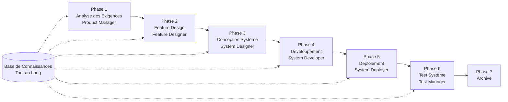

# Guide de Démarrage Rapide SpecCrew

<p align="center">
  <a href="./GETTING-STARTED.md">简体中文</a> |
  <a href="./GETTING-STARTED.zh-TW.md">繁體中文</a> |
  <a href="./GETTING-STARTED.en.md">English</a> |
  <a href="./GETTING-STARTED.ko.md">한국어</a> |
  <a href="./GETTING-STARTED.de.md">Deutsch</a> |
  <a href="./GETTING-STARTED.es.md">Español</a> |
  <a href="./GETTING-STARTED.fr.md">Français</a> |
  <a href="./GETTING-STARTED.it.md">Italiano</a> |
  <a href="./GETTING-STARTED.da.md">Dansk</a> |
  <a href="./GETTING-STARTED.ja.md">日本語</a> |
  <a href="./GETTING-STARTED.ar.md">العربية</a>
</p>

Ce document vous aide à comprendre rapidement comment utiliser l'équipe Agent de SpecCrew pour compléter le développement complet des exigences à la livraison selon des processus d'ingénierie standard.

---

## 1. Préparation

### Installer SpecCrew

```bash
npm install -g speccrew
```

### Initialiser le Projet

```bash
speccrew init --ide qoder
```

IDEs supportés : `qoder`, `cursor`, `claude`, `codex`

### Structure de Répertoire Après Initialisation

```
.
├── .qoder/
│   ├── agents/          # Fichiers de définition Agent
│   └── skills/          # Fichiers de définition Skill
├── speccrew-workspace/  # Espace de travail
│   ├── docs/            # Configurations, règles, modèles, solutions
│   ├── iterations/      # Itérations en cours
│   ├── iteration-archives/  # Itérations archivées
│   └── knowledges/      # Base de connaissances
│       ├── base/        # Informations de base (rapports de diagnostic, dettes techniques)
│       ├── bizs/        # Base de connaissances métier
│       └── techs/       # Base de connaissances techniques
```

### Référence Rapide des Commandes CLI

| Commande | Description |
|------|------|
| `speccrew list` | Lister tous les Agents et Skills disponibles |
| `speccrew doctor` | Vérifier l'intégrité de l'installation |
| `speccrew update` | Mettre à jour la configuration du projet vers la dernière version |
| `speccrew uninstall` | Désinstaller SpecCrew |

---

## 2. Démarrage Rapide en 5 Minutes Après l'Installation

Après avoir exécuté `speccrew init`, suivez ces étapes pour entrer rapidement en état de travail :

### Étape 1 : Choisissez Votre IDE

| IDE | Commande d'Initialisation | Scénario d'Application |
|-----|-----------|----------|
| **Qoder** (Recommandé) | `speccrew init --ide qoder` | Orchestration complète des agents, workers parallèles |
| **Cursor** | `speccrew init --ide cursor` | Workflows basés sur Composer |
| **Claude Code** | `speccrew init --ide claude` | Développement CLI-first |
| **Codex** | `speccrew init --ide codex` | Intégration écosystème OpenAI |

### Étape 2 : Initialiser la Base de Connaissances (Recommandé)

Pour les projets avec du code source existant, il est recommandé d'initialiser d'abord la base de connaissances pour que les agents comprennent votre base de code :

```
@speccrew-team-leader initialiser la base de connaissances techniques
```

Puis :

```
@speccrew-team-leader initialiser la base de connaissances métier
```

### Étape 3 : Commencez Votre Première Tâche

```
@speccrew-product-manager J'ai une nouvelle exigence : [décrivez votre exigence fonctionnelle]
```

> **Astuce** : Si vous ne savez pas quoi faire, dites simplement `@speccrew-team-leader aidez-moi à démarrer` — le Team Leader détectera automatiquement l'état de votre projet et vous guidera.

---

## 3. Arbre de Décision Rapide

Vous ne savez pas quoi faire ? Trouvez votre scénario ci-dessous :

- **J'ai une nouvelle exigence fonctionnelle**
  → `@speccrew-product-manager J'ai une nouvelle exigence : [décrivez votre exigence fonctionnelle]`

- **Je veux scanner les connaissances du projet existant**
  → `@speccrew-team-leader initialiser la base de connaissances techniques`
  → Puis : `@speccrew-team-leader initialiser la base de connaissances métier`

- **Je veux continuer le travail précédent**
  → `@speccrew-team-leader quelle est la progression actuelle ?`

- **Je veux vérifier l'état de santé du système**
  → Exécuter dans le terminal : `speccrew doctor`

- **Je ne sais pas quoi faire**
  → `@speccrew-team-leader aidez-moi à démarrer`
  → Le Team Leader détectera automatiquement l'état de votre projet et vous guidera

---

## 4. Référence Rapide des Agents

| Rôle | Agent | Responsabilités | Exemple de Commande |
|------|-------|-----------------|-----------------|
| Chef d'Équipe | `@speccrew-team-leader` | Navigation projet, initialisation base de connaissances, vérification statut | "Aidez-moi à démarrer" |
| Chef de Produit | `@speccrew-product-manager` | Analyse des exigences, génération PRD | "J'ai une nouvelle exigence : ..." |
| Concepteur de Fonctionnalités | `@speccrew-feature-designer` | Analyse fonctionnelle, conception de spécifications, contrats API | "Démarrer la conception de fonctionnalités pour l'itération X" |
| Concepteur Système | `@speccrew-system-designer` | Conception d'architecture, conception détaillée par plateforme | "Démarrer la conception système pour l'itération X" |
| Développeur Système | `@speccrew-system-developer` | Coordination développement, génération de code | "Démarrer le développement pour l'itération X" |
| Responsable Test | `@speccrew-test-manager` | Planification test, conception de cas, exécution | "Démarrer les tests pour l'itération X" |

> **Note** : Vous n'avez pas besoin de mémoriser tous les agents. Parlez simplement à `@speccrew-team-leader` et il routera votre demande vers le bon agent.

---

## 5. Aperçu du Flux de Travail

### Diagramme de Flux Complet



### Principes Clés

1. **Dépendances de Phase** : Les livrables de chaque phase sont l'entrée de la phase suivante
2. **Confirmation de Point de Contrôle** : Chaque phase a un point de confirmation qui nécessite l'approbation de l'utilisateur avant de passer à la phase suivante
3. **Piloté par la Base de Connaissances** : La base de connaissances parcourt tout le processus, fournissant le contexte pour toutes les phases

---

## 6. Étape Zéro : Initialisation de la Base de Connaissances

Avant de commencer le processus d'ingénierie formel, vous devez initialiser la base de connaissances du projet.

### 6.1 Initialisation de la Base de Connaissances Techniques

**Exemple de Conversation** :
```
@speccrew-team-leader initialiser la base de connaissances techniques
```

**Processus en Trois Phases** :
1. Détection de Plateforme — Identifier les plateformes technologiques dans le projet
2. Génération de Documentation Technique — Générer des documents de spécification technique pour chaque plateforme
3. Génération d'Index — Établir l'index de la base de connaissances

**Livrable** :
```
speccrew-workspace/knowledges/techs/{platform-id}/
├── tech-stack.md          # Définition de la pile technologique
├── architecture.md        # Conventions d'architecture
├── dev-spec.md            # Spécifications de développement
├── test-spec.md           # Spécifications de test
└── INDEX.md               # Fichier d'index
```

### 6.2 Initialisation de la Base de Connaissances Métier

**Exemple de Conversation** :
```
@speccrew-team-leader initialiser la base de connaissances métier
```

**Processus en Quatre Phases** :
1. Inventaire des Fonctionnalités — Scanner le code pour identifier toutes les fonctionnalités
2. Analyse des Fonctionnalités — Analyser la logique métier pour chaque fonctionnalité
3. Résumé par Module — Résumer les fonctionnalités par module
4. Résumé Système — Générer une vue d'ensemble métier au niveau système

**Livrable** :
```
speccrew-workspace/knowledges/bizs/
├── {platform-type}/
│   └── {module-name}/
│       └── feature-spec.md
└── system-overview.md
```

---

## 7. Guide de Conversation Phase par Phase

### 7.1 Phase 1 : Analyse des Exigences (Product Manager)

**Comment Démarrer** :
```
@speccrew-product-manager J'ai une nouvelle exigence : [décrivez votre exigence]
```

**Flux de Travail de l'Agent** :
1. Lire la vue d'ensemble du système pour comprendre les modules existants
2. Analyser les exigences utilisateur
3. Générer un document PRD structuré

**Livrable** :
```
iterations/{numéro}-{type}-{nom}/01.product-requirement/
├── [feature-name]-prd.md           # Document de Product Requirements
└── [feature-name]-bizs-modeling.md # Modélisation métier (pour exigences complexes)
```

**Liste de Vérification de Confirmation** :
- [ ] La description des exigences reflète-t-elle précisément l'intention utilisateur ?
- [ ] Les règles métier sont-elles complètes ?
- [ ] Les points d'intégration avec les systèmes existants sont-ils clairs ?
- [ ] Les critères d'acceptation sont-ils mesurables ?

---

### 7.2 Phase 2 : Feature Design (Feature Designer)

**Comment Démarrer** :
```
@speccrew-feature-designer démarrer la conception de fonctionnalités
```

**Flux de Travail de l'Agent** :
1. Localiser automatiquement le document PRD confirmé
2. Charger la base de connaissances métier
3. Générer la conception de fonctionnalité (incluant wireframes UI, flux d'interaction, définitions de données, contrats API)
4. Pour plusieurs PRD, utiliser Task Worker pour conception parallèle

**Livrable** :
```
iterations/{iter}/02.feature-design/
└── [feature-name]-feature-spec.md  # Document de conception de fonctionnalité
```

**Liste de Vérification de Confirmation** :
- [ ] Tous les scénarios utilisateur sont-ils couverts ?
- [ ] Les flux d'interaction sont-ils clairs ?
- [ ] Les définitions de champs de données sont-elles complètes ?
- [ ] La gestion des exceptions est-elle complète ?

---

### 7.3 Phase 3 : System Design (System Designer)

**Comment Démarrer** :
```
@speccrew-system-designer démarrer la conception système
```

**Flux de Travail de l'Agent** :
1. Localiser Feature Spec et API Contract
2. Charger la base de connaissances techniques (pile technologique, architecture, spécifications pour chaque plateforme)
3. **Checkpoint A** : Évaluation du Framework — Analyser les écarts techniques, recommander de nouveaux frameworks (si nécessaire), attendre la confirmation utilisateur
4. Générer DESIGN-OVERVIEW.md
5. Utiliser Task Worker pour distribuer parallèlement la conception pour chaque plateforme (frontend/backend/mobile/desktop)
6. **Checkpoint B** : Confirmation Conjointe — Afficher le résumé de toutes les conceptions de plateforme, attendre la confirmation utilisateur

**Livrable** :
```
iterations/{iter}/03.system-design/
├── DESIGN-OVERVIEW.md              # Vue d'ensemble de la conception
├── {platform-id}/
│   ├── INDEX.md                    # Index de conception par plateforme
│   └── {module}-design.md          # Conception de module niveau pseudocode
```

**Liste de Vérification de Confirmation** :
- [ ] Le pseudocode utilise-t-il la syntaxe réelle du framework ?
- [ ] Les contrats API cross-plateforme sont-ils cohérents ?
- [ ] La stratégie de gestion d'erreurs est-elle unifiée ?

---

### 7.4 Phase 4 : Développement (System Developer)

**Comment Démarrer** :
```
@speccrew-system-developer démarrer le développement
```

**Flux de Travail de l'Agent** :
1. Lire les documents de conception système
2. Charger les connaissances techniques pour chaque plateforme
3. **Checkpoint A** : Pré-vérification Environnement — Vérifier les versions runtime, dépendances, disponibilité des services; attendre la résolution utilisateur si échec
4. Utiliser Task Worker pour distribuer parallèlement le développement pour chaque plateforme
5. Vérification d'intégration : alignement des contrats API, cohérence des données
6. Produire le rapport de livraison

**Livrable** :
```
# Le code source est écrit dans le répertoire source réel du projet
iterations/{iter}/04.development/
├── {platform-id}/
│   └── tasks/                      # Enregistrements de tâches de développement
└── delivery-report.md
```

**Liste de Vérification de Confirmation** :
- [ ] L'environnement est-il prêt ?
- [ ] Les problèmes d'intégration sont-ils dans une plage acceptable ?
- [ ] Le code est-il conforme aux spécifications de développement ?

---

### 7.5 Phase 5 : Déploiement (System Deployer)

**Comment Démarrer** :
```
@speccrew-system-deployer démarrer le déploiement
```

**Flux de Travail de l'Agent** :
1. Vérifier que la phase de développement est terminée (Stage Gate)
2. Charger la base de connaissances technique (configuration de build, configuration de migration de base de données, commandes de démarrage de service)
3. **Checkpoint** : Pré-vérification Environnement — Vérifier les outils de build, les versions runtime, la disponibilité des dépendances
4. Exécuter les compétences de déploiement en séquence : Build → Migrate → Startup → Smoke Test
5. Produire le rapport de déploiement

> 💡 **Astuce** : Pour les projets sans base de données, l'étape de migration est automatiquement ignorée ; pour les applications clientes (desktop/mobile), le mode de vérification de processus est utilisé à la place des vérifications de santé HTTP.

**Livrable** :
```
iterations/{iter}/05.deployment/
├── {platform-id}/
│   ├── deployment-plan.md          # Plan de déploiement
│   └── deployment-log.md           # Journal d'exécution du déploiement
└── deployment-report.md            # Rapport d'achèvement du déploiement
```

**Liste de Vérification de Confirmation** :
- [ ] Le build est-il terminé avec succès ?
- [ ] Tous les scripts de migration de base de données ont-ils été exécutés avec succès (si applicable) ?
- [ ] L'application démarre-t-elle normalement et passe-t-elle les vérifications de santé ?
- [ ] Tous les tests de fumée sont-ils passés ?

---

### 7.6 Phase 6 : Test Système (Test Manager)

**Comment Démarrer** :
```
@speccrew-test-manager démarrer les tests
```

**Processus de Test en Trois Phases** :

| Phase | Description | Checkpoint |
|-------|-------------|------------|
| Conception de Cas de Test | Générer des cas de test basés sur PRD et Feature Spec | A : Afficher les statistiques de couverture de cas et la matrice de traçabilité, attendre la confirmation utilisateur de couverture suffisante |
| Génération de Code de Test | Générer du code de test exécutable | B : Afficher les fichiers de test générés et le mappage de cas, attendre la confirmation utilisateur |
| Exécution de Test et Rapport de Bugs | Exécuter automatiquement les tests et générer des rapports | Aucun (exécution automatique) |

**Livrable** :
```
iterations/{iter}/06.system-test/
├── cases/
│   └── {platform-id}/              # Documents de cas de test
├── code/
│   └── {platform-id}/              # Plan de code de test
├── reports/
│   └── test-report-{date}.md       # Rapport de test
└── bugs/
    └── BUG-{id}-{title}.md         # Rapports de bug (un fichier par bug)
```

**Liste de Vérification de Confirmation** :
- [ ] La couverture de cas est-elle complète ?
- [ ] Le code de test est-il exécutable ?
- [ ] L'évaluation de la sévérité des bugs est-elle précise ?

---

### 7.7 Phase 7 : Archivage

Les itérations sont automatiquement archivées après achèvement :

```
speccrew-workspace/iteration-archives/
└── {numéro}-{type}-{nom}-{date}/
    ├── 01.product-requirement/
    ├── 02.feature-design/
    ├── 03.system-design/
    ├── 04.development/
    ├── 05.deployment/
    └── 06.system-test/
```

---

## 8. Aperçu de la Base de Connaissances

### 8.1 Base de Connaissances Métier (bizs)

**Objectif** : Stocker les descriptions de fonctionnalités métier du projet, divisions de modules, caractéristiques API

**Structure de Répertoire** :
```
knowledges/bizs/
├── {platform-type}/
│   └── {module-name}/
│       └── feature-spec.md
└── system-overview.md
```

**Scénarios d'Utilisation** : Product Manager, Feature Designer

### 8.2 Base de Connaissances Techniques (techs)

**Objectif** : Stocker la pile technologique du projet, conventions d'architecture, spécifications de développement, spécifications de test

**Structure de Répertoire** :
```
knowledges/techs/{platform-id}/
├── tech-stack.md
├── architecture.md
├── dev-spec.md
├── test-spec.md
└── INDEX.md
```

**Scénarios d'Utilisation** : System Designer, System Developer, Test Manager

---

## 9. Gestion de la Progression du Workflow

L'équipe virtuelle SpecCrew suit un mécanisme strict de passage de phases où chaque phase doit être confirmée par l'utilisateur avant de passer à la suivante. Elle supporte également l'exécution rejouable — lorsqu'elle est redémarrée après interruption, elle continue automatiquement depuis l'endroit où elle s'est arrêtée.

### 9.1 Trois Couches de Fichiers de Progression

Le workflow maintient automatiquement trois types de fichiers JSON de progression, situés dans le répertoire d'itération :

| Fichier | Emplacement | Objectif |
|------|----------|---------|
| `WORKFLOW-PROGRESS.json` | `iterations/{iter}/` | Enregistre le statut de chaque étape du pipeline |
| `.checkpoints.json` | Sous chaque répertoire de phase | Enregistre le statut de confirmation des checkpoints utilisateur |
| `DISPATCH-PROGRESS.json` | Sous chaque répertoire de phase | Enregistre la progression item par item pour les tâches parallèles (multi-plateforme/multi-module) |

### 9.2 Flux de Statut de Phase

Chaque phase suit ce flux de statut :

```
pending → in_progress → completed → confirmed
```

- **pending** : Pas encore démarré
- **in_progress** : En cours d'exécution
- **completed** : Exécution de l'agent terminée, en attente de confirmation utilisateur
- **confirmed** : Utilisateur confirmé via le checkpoint final, la phase suivante peut démarrer

### 9.3 Exécution Rejouable

Lors du redémarrage d'un Agent pour une phase :

1. **Vérification automatique en amont** : Vérifie si la phase précédente est confirmée, bloque et invite si non
2. **Récupération de Checkpoint** : Lit `.checkpoints.json`, saute les checkpoints passés, continue depuis le dernier point d'interruption
3. **Récupération de Tâches Parallèles** : Lit `DISPATCH-PROGRESS.json`, ne ré-exécute que les tâches avec statut `pending` ou `failed`, saute les tâches `completed`

### 9.4 Voir la Progression Actuelle

Voir le statut panoramique du pipeline via l'Agent Team Leader :

```
@speccrew-team-leader voir la progression actuelle de l'itération
```

Le Team Leader lira les fichiers de progression et affichera un aperçu du statut similaire à :

```
Pipeline Status: i001-user-management
  01 PRD:            ✅ Confirmed
  02 Feature Design: 🔄 In Progress (Checkpoint A passed)
  03 System Design:  ⏳ Pending
  04 Development:    ⏳ Pending
  05 Deployment:     ⏳ Pending
  06 System Test:    ⏳ Pending
```

### 9.5 Compatibilité Descendante

Le mécanisme de fichier de progression est entièrement rétrocompatible — si les fichiers de progression n'existent pas (par ex. dans les projets hérités ou nouvelles itérations), tous les Agents s'exécuteront normalement selon la logique originale.

---

## 10. Questions Fréquemment Posées (FAQ)

### Q1 : Que faire si l'Agent ne fonctionne pas comme prévu ?

1. Exécuter `speccrew doctor` pour vérifier l'intégrité de l'installation
2. Confirmer que la base de connaissances a été initialisée
3. Confirmer que le livrable de la phase précédente existe dans le répertoire d'itération actuel

### Q2 : Comment sauter une phase ?

**Non recommandé** — La sortie de chaque phase est l'entrée de la phase suivante.

Si vous devez absolument sauter, préparez manuellement le document d'entrée de la phase correspondante et assurez-vous qu'il respecte les spécifications de format.

### Q3 : Comment gérer plusieurs exigences parallèles ?

Créez des répertoires d'itération indépendants pour chaque exigence :
```
iterations/
├── 001-feature-xxx/
├── 002-feature-yyy/
└── 003-feature-zzz/
```

Chaque itération est complètement isolée et n'affecte pas les autres.

### Q4 : Comment mettre à jour la version de SpecCrew ?

La mise à jour nécessite deux étapes :

```bash
# Étape 1 : Mettre à jour l'outil CLI global
npm install -g speccrew@latest

# Étape 2 : Synchroniser les Agents et Skills dans votre répertoire projet
cd /path/to/your-project
speccrew update
```

- `npm install -g speccrew@latest` : Met à jour l'outil CLI lui-même (les nouvelles versions peuvent inclure de nouvelles définitions Agent/Skill, corrections de bugs, etc.)
- `speccrew update` : Synchronise les fichiers de définition Agent et Skill de votre projet vers la dernière version
- `speccrew update --ide cursor` : Met à jour la configuration pour un IDE spécifique uniquement

> **Note** : Les deux étapes sont requises. Exécuter uniquement `speccrew update` ne mettra pas à jour l'outil CLI lui-même ; exécuter uniquement `npm install` ne mettra pas à jour les fichiers projet.

### Q5 : `speccrew update` indique qu'une nouvelle version est disponible mais `npm install -g speccrew@latest` installe toujours l'ancienne version ?

Ceci est généralement causé par le cache npm. Solution :

```bash
# Nettoyer le cache npm et réinstaller
npm cache clean --force
npm install -g speccrew@latest

# Vérifier la version
npm list -g speccrew
```

Si cela ne fonctionne toujours pas, essayez d'installer avec un numéro de version spécifique :
```bash
npm install -g speccrew@0.5.6
```

### Q6 : Comment voir les itérations historiques ?

Après archivage, voir dans `speccrew-workspace/iteration-archives/`, organisé par format `{numéro}-{type}-{nom}-{date}/`.

### Q7 : La base de connaissances doit-elle être mise à jour régulièrement ?

Une ré-initialisation est requise dans les situations suivantes :
- Changements majeurs dans la structure du projet
- Mise à jour ou remplacement de la pile technologique
- Ajout/suppression de modules métier

---

## 11. Référence Rapide

### Référence Rapide de Démarrage des Agents

| Phase | Agent | Conversation de Démarrage |
|-------|-------|-------------------|
| Initialisation | Team Leader | `@speccrew-team-leader initialiser la base de connaissances techniques` |
| Analyse des Exigences | Product Manager | `@speccrew-product-manager J'ai une nouvelle exigence : [description]` |
| Feature Design | Feature Designer | `@speccrew-feature-designer démarrer la conception de fonctionnalités` |
| Conception Système | System Designer | `@speccrew-system-designer démarrer la conception système` |
| Développement | System Developer | `@speccrew-system-developer démarrer le développement` |
| Déploiement | System Deployer | `@speccrew-system-deployer démarrer le déploiement` |
| Test Système | Test Manager | `@speccrew-test-manager démarrer les tests` |

### Liste de Vérification des Checkpoints

| Phase | Nombre de Checkpoints | Éléments de Vérification Clés |
|-------|----------------------|-----------------|
| Analyse des Exigences | 1 | Exactitude des exigences, complétude des règles métier, mesurabilité des critères d'acceptation |
| Feature Design | 1 | Couverture de scénario, clarté d'interaction, complétude des données, gestion des exceptions |
| Conception Système | 2 | A : Évaluation du framework ; B : Syntaxe pseudocode, cohérence cross-plateforme, gestion d'erreurs |
| Développement | 1 | A : Préparation environnement, problèmes d'intégration, spécifications de code |
| Déploiement | 1 | Build réussi, migration terminée, démarrage service, tests de fumée passés |
| Test Système | 2 | A : Couverture de cas ; B : Exécutabilité du code de test |

### Référence Rapide des Chemins de Livrables

| Phase | Répertoire de Sortie | Format de Fichier |
|-------|-----------------|-------------|
| Analyse des Exigences | `iterations/{iter}/01.product-requirement/` | `[name]-prd.md`, `[name]-bizs-modeling.md` |
| Feature Design | `iterations/{iter}/02.feature-design/` | `[name]-feature-spec.md` |
| Conception Système | `iterations/{iter}/03.system-design/` | `DESIGN-OVERVIEW.md`, `{platform}/INDEX.md`, `{platform}/{module}-design.md` |
| Développement | `iterations/{iter}/04.development/` | Code source + `delivery-report.md` |
| Déploiement | `iterations/{iter}/05.deployment/` | `deployment-plan.md`, `deployment-log.md`, `deployment-report.md` |
| Test Système | `iterations/{iter}/06.system-test/` | `cases/`, `code/`, `reports/`, `bugs/` |
| Archivage | `iteration-archives/{iter}-{date}/` | Copie complète de l'itération |

---

## Prochaines Étapes

1. Exécutez `speccrew init --ide qoder` pour initialiser votre projet
2. Exécutez l'Étape Zéro : Initialisation de la Base de Connaissances
3. Progressez phase par phase selon le workflow, profitez de l'expérience de développement piloté par les spécifications !
