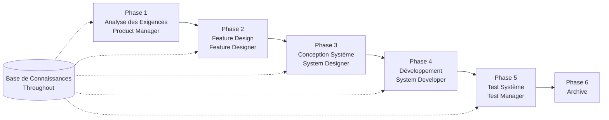

# Guide de Démarrage Rapide SpecCrew

<p align="center">
  <a href="./GETTING-STARTED.md">简体中文</a> |
  <a href="./GETTING-STARTED.zh-TW.md">繁體中文</a> |
  <a href="./GETTING-STARTED.en.md">English</a> |
  <a href="./GETTING-STARTED.ko.md">한국어</a> |
  <a href="./GETTING-STARTED.de.md">Deutsch</a> |
  <a href="./GETTING-STARTED.es.md">Español</a> |
  <a href="./GETTING-STARTED.fr.md">Français</a> |
  <a href="./GETTING-STARTED.it.md">Italiano</a> |
  <a href="./GETTING-STARTED.da.md">Dansk</a> |
  <a href="./GETTING-STARTED.ja.md">日本語</a> |
  <a href="./GETTING-STARTED.ar.md">العربية</a>
</p>

Ce document vous aide à comprendre rapidement comment utiliser l'équipe Agent de SpecCrew pour compléter le cycle de développement complet des exigences à la livraison selon des processus d'ingénierie standard.

---

## 1. Préparation

### Installer SpecCrew

```bash
npm install -g speccrew
```

### Initialiser le Projet

```bash
speccrew init --ide qoder
```

IDEs supportés : `qoder`, `cursor`, `claude`, `codex`

### Structure de Répertoire Après Initialisation

```
.
├── .qoder/
│   ├── agents/          # Fichiers de définition Agent
│   └── skills/          # Fichiers de définition Skill
├── speccrew-workspace/  # Espace de travail
│   ├── docs/            # Configurations, règles, modèles, solutions
│   ├── iterations/      # Itérations en cours
│   ├── iteration-archives/  # Itérations archivées
│   └── knowledges/      # Base de connaissances
│       ├── base/        # Informations de base (rapports de diagnostic, dettes techniques)
│       ├── bizs/        # Base de connaissances métier
│       └── techs/       # Base de connaissances techniques
```

### Référence Rapide des Commandes CLI

| Commande | Description |
|---------|-------------|
| `speccrew list` | Lister tous les Agents et Skills disponibles |
| `speccrew doctor` | Vérifier l'intégrité de l'installation |
| `speccrew update` | Mettre à jour la configuration du projet vers la dernière version |
| `speccrew uninstall` | Désinstaller SpecCrew |

---

## 2. Aperçu du Flux de Travail

### Diagramme de Flux Complet



### Principes Principaux

1. **Dépendances de Phase** : Les livrables de chaque phase sont l'entrée de la phase suivante
2. **Confirmation de Point de Contrôle** : Chaque phase a un point de confirmation qui nécessite l'approbation de l'utilisateur avant de passer à la phase suivante
3. **Piloté par la Base de Connaissances** : La base de connaissances parcourt tout le processus, fournissant le contexte pour toutes les phases

---

## 3. Étape Zéro : Diagnostic de Projet et Initialisation de la Base de Connaissances

Avant de commencer le processus d'ingénierie formel, vous devez initialiser la base de connaissances du projet.

### 3.1 Diagnostic de Projet

**Exemple de Conversation** :
```
@speccrew-team-leader diagnostiquer le projet
```

**Ce que l'Agent fera** :
- Scanner la structure du projet
- Détecter la pile technologique
- Identifier les modules métier

**Livrable** :
```
speccrew-workspace/knowledges/base/diagnosis-reports/diagnosis-report-{date}.md
```

### 3.2 Initialisation de la Base de Connaissances Techniques

**Exemple de Conversation** :
```
@speccrew-team-leader initialiser la base de connaissances techniques
```

**Processus en Trois Phases** :
1. Détection de Plateforme — Identifier les plateformes technologiques dans le projet
2. Génération de Documentation Technique — Générer des documents de spécification technique pour chaque plateforme
3. Génération d'Index — Établir l'index de la base de connaissances

**Livrable** :
```
speccrew-workspace/knowledges/techs/{platform-id}/
├── tech-stack.md          # Définition de la pile technologique
├── architecture.md        # Conventions d'architecture
├── dev-spec.md            # Spécifications de développement
├── test-spec.md           # Spécifications de test
└── INDEX.md               # Fichier d'index
```

### 3.3 Initialisation de la Base de Connaissances Métier

**Exemple de Conversation** :
```
@speccrew-team-leader initialiser la base de connaissances métier
```

**Processus en Quatre Phases** :
1. Inventaire des Fonctionnalités — Scanner le code pour identifier toutes les fonctionnalités
2. Analyse des Fonctionnalités — Analyser la logique métier pour chaque fonctionnalité
3. Résumé des Modules — Résumer les fonctionnalités par module
4. Résumé Système — Générer un aperçu métier au niveau système

**Livrable** :
```
speccrew-workspace/knowledges/bizs/
├── {platform-type}/
│   └── {module-name}/
│       └── feature-spec.md
└── system-overview.md
```

---

## 4. Guide de Conversation Phase par Phase

### 4.1 Phase 1 : Analyse des Exigences (Product Manager)

**Comment Démarrer** :
```
@speccrew-product-manager J'ai une nouvelle exigence : [décrivez votre exigence]
```

**Flux de Travail Agent** :
1. Lire l'aperçu du système pour comprendre les modules existants
2. Analyser les exigences utilisateur
3. Générer un document PRD structuré

**Livrable** :
```
iterations/{numéro}-{type}-{nom}/01.product-requirement/
├── [feature-name]-prd.md           # Document d'Exigences Produit
└── [feature-name]-bizs-modeling.md # Modélisation métier (pour les exigences complexes)
```

**Liste de Contrôle de Confirmation** :
- [ ] La description des exigences reflète-t-elle fidèlement l'intention de l'utilisateur ?
- [ ] Les règles métier sont-elles complètes ?
- [ ] Les points d'intégration avec les systèmes existants sont-ils clairs ?
- [ ] Les critères d'acceptation sont-ils mesurables ?

---

### 4.2 Phase 2 : Feature Design (Feature Designer)

**Comment Démarrer** :
```
@speccrew-feature-designer démarrer la conception de fonctionnalité
```

**Flux de Travail Agent** :
1. Localiser automatiquement le document PRD confirmé
2. Charger la base de connaissances métier
3. Générer la conception de fonctionnalité (y compris les wireframes UI, les flux d'interaction, les définitions de données, les contrats API)
4. Pour plusieurs PRDs, utiliser Task Worker pour la conception parallèle

**Livrable** :
```
iterations/{iter}/02.feature-design/
└── [feature-name]-feature-spec.md  # Document de conception de fonctionnalité
```

**Liste de Contrôle de Confirmation** :
- [ ] Tous les scénarios utilisateur sont-ils couverts ?
- [ ] Les flux d'interaction sont-ils clairs ?
- [ ] Les définitions de champs de données sont-elles complètes ?
- [ ] La gestion des exceptions est-elle complète ?

---

### 4.3 Phase 3 : Conception Système (System Designer)

**Comment Démarrer** :
```
@speccrew-system-designer démarrer la conception système
```

**Flux de Travail Agent** :
1. Localiser le Feature Spec et le Contrat API
2. Charger la base de connaissances techniques (pile tech, architecture, spécifications pour chaque plateforme)
3. **Point de Contrôle A** : Évaluation du Framework — Analyser les écarts techniques, recommander de nouveaux frameworks (si nécessaire), attendre la confirmation de l'utilisateur
4. Générer DESIGN-OVERVIEW.md
5. Utiliser Task Worker pour répartir la conception pour chaque plateforme en parallèle (frontend/backend/mobile/desktop)
6. **Point de Contrôle B** : Confirmation Conjointe — Afficher le résumé de toutes les conceptions de plateforme, attendre la confirmation de l'utilisateur

**Livrable** :
```
iterations/{iter}/03.system-design/
├── DESIGN-OVERVIEW.md              # Aperçu de la conception
├── {platform-id}/
│   ├── INDEX.md                    # Index de conception de plateforme
│   └── {module}-design.md          # Conception de module au niveau pseudocode
```

**Liste de Contrôle de Confirmation** :
- [ ] Le pseudocode utilise-t-il la syntaxe réelle du framework ?
- [ ] Les contrats API inter-plateformes sont-ils cohérents ?
- [ ] La stratégie de gestion des erreurs est-elle unifiée ?

---

### 4.4 Phase 4 : Implémentation du Développement (System Developer)

**Comment Démarrer** :
```
@speccrew-system-developer démarrer le développement
```

**Flux de Travail Agent** :
1. Lire les documents de conception système
2. Charger les connaissances techniques pour chaque plateforme
3. **Point de Contrôle A** : Pré-vérification de l'Environnement — Vérifier les versions de runtime, les dépendances, la disponibilité des services ; attendre la résolution de l'utilisateur en cas d'échec
4. Utiliser Task Worker pour répartir le développement pour chaque plateforme en parallèle
5. Vérification d'intégration : alignement du contrat API, cohérence des données
6. Sortir le rapport de livraison

**Livrable** :
```
# Code source écrit dans le répertoire source réel du projet
iterations/{iter}/04.development/
├── {platform-id}/
│   └── tasks/                      # Enregistrements des tâches de développement
└── delivery-report.md
```

**Liste de Contrôle de Confirmation** :
- [ ] L'environnement est-il prêt ?
- [ ] Les problèmes d'intégration sont-ils dans une plage acceptable ?
- [ ] Le code est-il conforme aux spécifications de développement ?

---

### 4.5 Phase 5 : Test Système (Test Manager)

**Comment Démarrer** :
```
@speccrew-test-manager démarrer les tests
```

**Processus de Test en Trois Phases** :

| Phase | Description | Point de Contrôle |
|-------|-------------|-------------------|
| Conception des Cas de Test | Générer des cas de test basés sur le PRD et le Feature Spec | A : Afficher les statistiques de couverture des cas et la matrice de traçabilité, attendre la confirmation de l'utilisateur d'une couverture suffisante |
| Génération du Code de Test | Générer du code de test exécutable | B : Afficher les fichiers de test générés et le mappage des cas, attendre la confirmation de l'utilisateur |
| Exécution des Tests et Rapport de Bugs | Exécuter automatiquement les tests et générer des rapports | Aucun (exécution automatique) |

**Livrable** :
```
iterations/{iter}/05.system-test/
├── cases/
│   └── {platform-id}/              # Documents des cas de test
├── code/
│   └── {platform-id}/              # Plan de code de test
├── reports/
│   └── test-report-{date}.md       # Rapport de test
└── bugs/
    └── BUG-{id}-{title}.md         # Rapports de bugs (un fichier par bug)
```

**Liste de Contrôle de Confirmation** :
- [ ] La couverture des cas est-elle complète ?
- [ ] Le code de test est-il exécutable ?
- [ ] L'évaluation de la gravité des bugs est-elle précise ?

---

### 4.6 Phase 6 : Archive

Les itérations sont automatiquement archivées à l'achèvement :

```
speccrew-workspace/iteration-archives/
└── {numéro}-{type}-{nom}-{date}/
    ├── 01.product-requirement/
    ├── 02.feature-design/
    ├── 03.system-design/
    ├── 04.development/
    └── 05.system-test/
```

---

## 5. Aperçu de la Base de Connaissances

### 5.1 Base de Connaissances Métier (bizs)

**Objectif** : Stocker les descriptions des fonctionnalités métier du projet, les divisions de modules, les caractéristiques API

**Structure de Répertoire** :
```
knowledges/bizs/
├── {platform-type}/
│   └── {module-name}/
│       └── feature-spec.md
└── system-overview.md
```

**Scénarios d'Utilisation** : Product Manager, Feature Designer

### 5.2 Base de Connaissances Techniques (techs)

**Objectif** : Stocker la pile technologique du projet, les conventions d'architecture, les spécifications de développement, les spécifications de test

**Structure de Répertoire** :
```
knowledges/techs/{platform-id}/
├── tech-stack.md
├── architecture.md
├── dev-spec.md
├── test-spec.md
└── INDEX.md
```

**Scénarios d'Utilisation** : System Designer, System Developer, Test Manager

---

## 6. Questions Fréquemment Posées (FAQ)

### Q1 : Que faire si l'Agent ne fonctionne pas comme prévu ?

1. Exécuter `speccrew doctor` pour vérifier l'intégrité de l'installation
2. Confirmer que la base de connaissances a été initialisée
3. Confirmer que les livrables de la phase précédente existent dans le répertoire d'itération actuel

### Q2 : Comment sauter une phase ?

**Non recommandé** — La sortie de chaque phase est l'entrée de la phase suivante.

Si vous devez absolument sauter, préparez manuellement le document d'entrée de la phase correspondante et assurez-vous qu'il respecte les spécifications de format.

### Q3 : Comment gérer plusieurs exigences parallèles ?

Créer des répertoires d'itération indépendants pour chaque exigence :
```
iterations/
├── 001-feature-xxx/
├── 002-feature-yyy/
└── 003-feature-zzz/
```

Chaque itération est complètement isolée et n'affecte pas les autres.

### Q4 : Comment mettre à jour la version de SpecCrew ?

- **Mise à jour Globale** : `npm update -g speccrew`
- **Mise à jour du Projet** : Exécuter `speccrew update` dans le répertoire du projet

### Q5 : Comment consulter les itérations historiques ?

Après archivage, consultez dans `speccrew-workspace/iteration-archives/`, organisé par le format `{numéro}-{type}-{nom}-{date}/`.

### Q6 : La base de connaissances a-t-elle besoin de mises à jour régulières ?

La réinitialisation est nécessaire dans les situations suivantes :
- Changements majeurs dans la structure du projet
- Mise à niveau ou remplacement de la pile technologique
- Ajout/suppression de modules métier

---

## 7. Référence Rapide

### Référence Rapide de Démarrage Agent

| Phase | Agent | Conversation de Démarrage |
|-------|-------|---------------------------|
| Diagnostic | Team Leader | `@speccrew-team-leader diagnostiquer le projet` |
| Initialisation | Team Leader | `@speccrew-team-leader initialiser la base de connaissances techniques` |
| Analyse des Exigences | Product Manager | `@speccrew-product-manager J'ai une nouvelle exigence : [description]` |
| Feature Design | Feature Designer | `@speccrew-feature-designer démarrer la conception de fonctionnalité` |
| Conception Système | System Designer | `@speccrew-system-designer démarrer la conception système` |
| Développement | System Developer | `@speccrew-system-developer démarrer le développement` |
| Test Système | Test Manager | `@speccrew-test-manager démarrer les tests` |

### Liste de Contrôle des Points de Contrôle

| Phase | Nombre de Points de Contrôle | Éléments de Contrôle Clés |
|-------|------------------------------|---------------------------|
| Analyse des Exigences | 1 | Précision des exigences, complétude des règles métier, mesurabilité des critères d'acceptation |
| Feature Design | 1 | Couverture des scénarios, clarté des interactions, complétude des données, gestion des exceptions |
| Conception Système | 2 | A : Évaluation du framework ; B : Syntaxe du pseudocode, cohérence inter-plateformes, gestion des erreurs |
| Développement | 1 | A : Préparation de l'environnement, problèmes d'intégration, spécifications de code |
| Test Système | 2 | A : Couverture des cas ; B : Exécutabilité du code de test |

### Référence Rapide des Chemins de Livrables

| Phase | Répertoire de Sortie | Format de Fichier |
|-------|---------------------|-------------------|
| Analyse des Exigences | `iterations/{iter}/01.product-requirement/` | `[name]-prd.md`, `[name]-bizs-modeling.md` |
| Feature Design | `iterations/{iter}/02.feature-design/` | `[name]-feature-spec.md` |
| Conception Système | `iterations/{iter}/03.system-design/` | `DESIGN-OVERVIEW.md`, `{platform}/INDEX.md`, `{platform}/{module}-design.md` |
| Développement | `iterations/{iter}/04.development/` | Code source + `delivery-report.md` |
| Test Système | `iterations/{iter}/05.system-test/` | `cases/`, `code/`, `reports/`, `bugs/` |
| Archive | `iteration-archives/{iter}-{date}/` | Copie complète de l'itération |

---

## Prochaines Étapes

1. Exécuter `speccrew init --ide qoder` pour initialiser votre projet
2. Exécuter l'Étape Zéro : Diagnostic de Projet et Initialisation de la Base de Connaissances
3. Progresser à travers chaque phase en suivant le flux de travail, en profitant de l'expérience de développement piloté par les spécifications !
