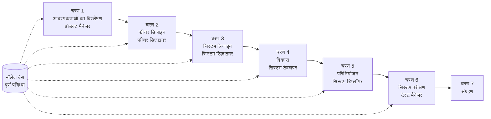

# SpecCrew क्विक स्टार्ट गाइड

<p align="center">
  <a href="./GETTING-STARTED.md">简体中文</a> |
  <a href="./GETTING-STARTED.en.md">English</a> |
  <a href="./GETTING-STARTED.ja.md">日本語</a> |
  <a href="./GETTING-STARTED.ru.md">Русский</a> |
  <a href="./GETTING-STARTED.es.md">Español</a> |
  <a href="./GETTING-STARTED.de.md">Deutsch</a> |
  <a href="./GETTING-STARTED.fr.md">Français</a> |
  <a href="./GETTING-STARTED.pt-BR.md">Português (Brasil)</a> |
  <a href="./GETTING-STARTED.ar.md">العربية</a> |
  <a href="./GETTING-STARTED.hi.md">हिन्दी</a>
</p>

यह दस्तावेज़ आपको यह समझने में मदद करता है कि SpecCrew की Agent टीम का उपयोग मानक इंजीनियरिंग प्रक्रियाओं का पालन करते हुए आवश्यकताओं से वितरण तक पूर्ण विकास चक्र को कैसे पूरा करें।

---

## 1. पूर्वापेक्षाएँ

### SpecCrew इंस्टॉल करें

```bash
npm install -g speccrew
```

### परियोजना प्रारंभ करें

```bash
speccrew init --ide qoder
```

समर्थित IDE: `qoder`, `cursor`, `claude`, `codex`

### प्रारंभिकरण के बाद निर्देशिका संरचना

```
.
├── .qoder/
│   ├── agents/          # Agent परिभाषा फ़ाइलें
│   └── skills/          # Skill परिभाषा फ़ाइलें
├── speccrew-workspace/  # वर्कस्पेस
│   ├── docs/            # कॉन्फ़िगरेशन, नियम, टेम्पलेट, समाधान
│   ├── iterations/      # वर्तमान चल रही पुनरावृत्तियाँ
│   ├── iteration-archives/  # संग्रहीत पुनरावृत्तियाँ
│   └── knowledges/      # नॉलेज बेस
│       ├── base/        # मूल जानकारी (निदान रिपोर्ट, तकनीकी ऋण)
│       ├── bizs/        # व्यावसायिक नॉलेज बेस
│       └── techs/       # तकनीकी नॉलेज बेस
```

### CLI कमांड क्विक रेफरेंस

| कमांड | विवरण |
|---------|-------------|
| `speccrew list` | सभी उपलब्ध Agents और Skills सूचीबद्ध करें |
| `speccrew doctor` | इंस्टॉलेशन अखंडता की जाँच करें |
| `speccrew update` | परियोजना कॉन्फ़िगरेशन को नवीनतम संस्करण पर अपडेट करें |
| `speccrew uninstall` | SpecCrew अनइंस्टॉल करें |

---

## 2. आपके पहले 5 मिनट

`speccrew init` चलाने के बाद, तुरंत उत्पादक होने के लिए इन चरणों का पालन करें:

### चरण 1: अपना IDE चुनें

| IDE | Init कमांड | सबसे अच्छा है |
|-----|-------------|----------|
| **Qoder** (अनुशंसित) | `speccrew init --ide qoder` | पूर्ण Agent ऑर्केस्ट्रेशन, समानांतर workers |
| **Cursor** | `speccrew init --ide cursor` | Composer-आधारित वर्कफ्लो |
| **Claude Code** | `speccrew init --ide claude` | CLI-प्रथम विकास |
| **Codex** | `speccrew init --ide codex` | OpenAI पारिस्थितिकी तंत्र एकीकरण |

### चरण 2: नॉलेज बेस प्रारंभ करें (अनुशंसित)

मौजूदा परियोजनाओं के लिए, पहले नॉलेज बेस प्रारंभ करें ताकि Agents आपके कोडबेस को समझ सकें:

```
/speccrew-team-leader Initialize technical knowledge base
```

फिर:

```
/speccrew-team-leader Initialize business knowledge base
```

### चरण 3: अपना पहला कार्य प्रारंभ करें

```
/speccrew-product-manager I have a new requirement: [अपनी सुविधा का वर्णन करें]
```

> **टिप**: अगर निश्चित नहीं हैं कि क्या करना है, तो बस `/speccrew-team-leader Help me get started` कहें — टीम लीडर आपकी परियोजना की स्थिति का स्वचालित रूप से पता लगाएगा और मार्गदर्शन करेगा।

---

## 3. क्विक निर्णय वृक्ष

निश्चित नहीं हैं कि क्या करना है? नीचे अपना परिदृश्य खोजें:

- **मेरी एक नई सुविधा आवश्यकता है**
  → `/speccrew-product-manager I have a new requirement: [अपनी सुविधा का वर्णन करें]`

- **मैं मौजूदा परियोजना ज्ञान स्कैन करना चाहता हूँ**
  → `/speccrew-team-leader initialize technical knowledge base`
  → फिर: `/speccrew-team-leader initialize business knowledge base`

- **मैं पिछले काम को जारी रखना चाहता हूँ**
  → `/speccrew-team-leader what is the current progress?`

- **मैं सिस्टम स्वास्थ्य की जाँच करना चाहता हूँ**
  → टर्मिनल में चलाएँ: `speccrew doctor`

- **मैं निश्चित नहीं हूँ कि क्या करना है**
  → `/speccrew-team-leader help me get started`
  → टीम लीडर आपकी परियोजना की स्थिति का स्वचालित रूप से पता लगाएगा और मार्गदर्शन करेगा

---

## 4. Agent क्विक रेफरेंस

| भूमिका | Agent | जिम्मेदारियाँ | उदाहरण कमांड |
|------|-------|-----------------|-----------------|
| टीम लीडर | `/speccrew-team-leader` | परियोजना नेविगेशन, ज्ञान प्रारंभ, स्थिति जाँच | "Help me get started" |
| प्रोडक्ट मैनेजर | `/speccrew-product-manager` | आवश्यकताओं का विश्लेषण, PRD जनरेशन | "I have a new requirement: ..." |
| फीचर डिज़ाइनर | `/speccrew-feature-designer` | सुविधा विश्लेषण, स्पेस डिज़ाइन, API अनुबंध | "Start feature design for iteration X" |
| सिस्टम डिज़ाइनर | `/speccrew-system-designer` | आर्किटेक्चर डिज़ाइन, प्लेटफॉर्म-विशिष्ट डिज़ाइन | "Start system design for iteration X" |
| सिस्टम डेवलपर | `/speccrew-system-developer` | विकास समन्वय, कोड जनरेशन | "Start development for iteration X" |
| टेस्ट मैनेजर | `/speccrew-test-manager` | टेस्ट योजना, केस डिज़ाइन, निष्पादन | "Start testing for iteration X" |

> **नोट**: आपको सभी Agents को याद रखने की आवश्यकता नहीं है। बस `/speccrew-team-leader` से बात करें और यह आपके अनुरोध को सही Agent पर रूट करेगा।

---

## 5. वर्कफ्लो अवलोकन

### पूर्ण फ्लोचार्ट



### कोर सिद्धांत

1. **चरण निर्भरता**: प्रत्येक चरण का वितरित योग्य अगले चरण के लिए इनपुट है
2. **चेकपॉइंट पुष्टि**: प्रत्येक चरण में एक पुष्टि बिंदु होता है जो अगले चरण में जाने से पहले उपयोगकर्ता की स्वीकृति की आवश्यकता होती है
3. **नॉलेज बेस संचालित**: नॉलेज बेस पूरी प्रक्रिया में चलता है, सभी चरणों के लिए संदर्भ प्रदान करता है

---

## 6. चरण शून्य: नॉलेज बेस प्रारंभिकरण

औपचारिक इंजीनियरिंग प्रक्रिया प्रारंभ करने से पहले, आपको परियोजना नॉलेज बेस प्रारंभ करने की आवश्यकता है।

### 6.1 तकनीकी नॉलेज बेस प्रारंभिकरण

**संवाद उदाहरण**:
```
/speccrew-team-leader initialize technical knowledge base
```

**तीन-चरणीय प्रक्रिया**:
1. प्लेटफॉर्म पहचान — परियोजना में तकनीकी प्लेटफॉर्म की पहचान करें
2. तकनीकी दस्तावेज़ जनरेशन — प्रत्येक प्लेटफॉर्म के लिए तकनीकी विनिर्देश दस्तावेज़ उत्पन्न करें
3. इंडेक्स जनरेशन — नॉलेज बेस इंडेक्स स्थापित करें

**वितरित योग्य**:
```
speccrew-workspace/knowledges/techs/{platform-id}/
├── tech-stack.md          # तकनीकी स्टैक परिभाषा
├── architecture.md        # आर्किटेक्चर कन्वेंशन
├── dev-spec.md            # विकास विनिर्देश
├── test-spec.md           # परीक्षण विनिर्देश
└── INDEX.md               # इंडेक्स फ़ाइल
```

### 6.2 व्यावसायिक नॉलेज बेस प्रारंभिकरण

**संवाद उदाहरण**:
```
/speccrew-team-leader initialize business knowledge base
```

**चार-चरणीय प्रक्रिया**:
1. सुविधा सूची — सभी कार्यात्मक सुविधाओं की पहचान के लिए कोड स्कैन करें
2. सुविधा विश्लेषण — प्रत्येक सुविधा के लिए व्यावसायिक लॉजिक का विश्लेषण करें
3. मॉड्यूल सारांश — मॉड्यूल के अनुसार सुविधाओं का सारांश
4. सिस्टम सारांश — सिस्टम-स्तरीय व्यावसायिक अवलोकन उत्पन्न करें

**वितरित योग्य**:
```
speccrew-workspace/knowledges/bizs/
├── {platform-type}/
│   └── {module-name}/
│       └── feature-spec.md
└── system-overview.md
```

---

## 7. चरण-दर-चरण संवाद मार्गदर्शिका

### 7.1 चरण 1: आवश्यकताओं का विश्लेषण (प्रोडक्ट मैनेजर)

**कैसे प्रारंभ करें**:
```
/speccrew-product-manager I have a new requirement: [अपनी आवश्यकता का वर्णन करें]
```

**Agent वर्कफ्लो**:
1. मौजूदा मॉड्यूल को समझने के लिए सिस्टम अवलोकन पढ़ें
2. उपयोगकर्ता आवश्यकताओं का विश्लेषण करें
3. संरचित PRD दस्तावेज़ उत्पन्न करें

**वितरित योग्य**:
```
iterations/{number}-{type}-{name}/01.product-requirement/
├── [feature-name]-prd.md           # उत्पाद आवश्यकता दस्तावेज़
└── [feature-name]-bizs-modeling.md # व्यावसायिक मॉडलिंग (जटिल आवश्यकताओं के लिए)
```

**पुष्टि चेकलिस्ट**:
- [ ] क्या आवश्यकता विवरण उपयोगकर्ता के इरादे को सटीक रूप से दर्शाता है?
- [ ] क्या व्यावसायिक नियम पूर्ण हैं?
- [ ] क्या मौजूदा सिस्टम के साथ एकीकरण बिंदु स्पष्ट हैं?
- [ ] क्या स्वीकृति मानदंड मापने योग्य हैं?

---

### 7.2 चरण 2: फीचर डिज़ाइन (फीचर डिज़ाइनर)

**कैसे प्रारंभ करें**:
```
/speccrew-feature-designer start feature design
```

**Agent वर्कफ्लो**:
1. पुष्टि किए गए PRD दस्तावेज़ का स्वचालित रूप से पता लगाएँ
2. व्यावसायिक नॉलेज बेस लोड करें
3. फीचर डिज़ाइन उत्पन्न करें (UI वायरफ्रेम, इंटरैक्शन प्रवाह, डेटा परिभाषाएँ, API अनुबंध सहित)
4. एकाधिक PRDs के लिए, समानांतर डिज़ाइन के लिए टास्क वर्कर का उपयोग करें

**वितरित योग्य**:
```
iterations/{iter}/02.feature-design/
└── [feature-name]-feature-spec.md  # फीचर डिज़ाइन दस्तावेज़
```

**पुष्टि चेकलिस्ट**:
- [ ] क्या सभी उपयोगकर्ता परिदृश्य कवर किए गए हैं?
- [ ] क्या इंटरैक्शन प्रवाह स्पष्ट हैं?
- [ ] क्या डेटा फ़ील्ड परिभाषाएँ पूर्ण हैं?
- [ ] क्या अपवाद हैंडलिंग व्यापक है?

---

### 7.3 चरण 3: सिस्टम डिज़ाइन (सिस्टम डिज़ाइनर)

**कैसे प्रारंभ करें**:
```
/speccrew-system-designer start system design
```

**Agent वर्कफ्लो**:
1. फीचर स्पेस और API अनुबंध का पता लगाएँ
2. तकनीकी नॉलेज बेस लोड करें (प्रत्येक प्लेटफॉर्म के लिए टेक स्टैक, आर्किटेक्चर, विनिर्देश)
3. **चेकपॉइंट A**: फ्रेमवर्क मूल्यांकन — तकनीकी अंतराल का विश्लेषण करें, नए फ्रेमवर्क की सिफारिश करें (यदि आवश्यक हो), उपयोगकर्ता की पुष्टि की प्रतीक्षा करें
4. DESIGN-OVERVIEW.md उत्पन्न करें
5. टास्क वर्कर का उपयोग करके प्रत्येक प्लेटफॉर्म (फ्रंटएंड/बैकएंड/मोबाइल/डेस्कटॉप) के लिए समानांतर डिज़ाइन डिस्पैच करें
6. **चेकपॉइंट B**: संयुक्त पुष्टि — सभी प्लेटफॉर्म डिज़ाइन का सारांश प्रदर्शित करें, उपयोगकर्ता की पुष्टि की प्रतीक्षा करें

**वितरित योग्य**:
```
iterations/{iter}/03.system-design/
├── DESIGN-OVERVIEW.md              # डिज़ाइन अवलोकन
├── {platform-id}/
│   ├── INDEX.md                    # प्लेटफॉर्म डिज़ाइन इंडेक्स
│   └── {module}-design.md          # स्यूडोकोड-स्तरीय मॉड्यूल डिज़ाइन
```

**पुष्टि चेकलिस्ट**:
- [ ] क्या स्यूडोकोड वास्तविक फ्रेमवर्क सिंटैक्स का उपयोग करता है?
- [ ] क्या क्रॉस-प्लेटफॉर्म API अनुबंध सुसंगत हैं?
- [ ] क्या त्रुटि हैंडलिंग रणनीति एकीकृत है?

---

### 7.4 चरण 4: विकास कार्यान्वयन (सिस्टम डेवलपर)

**कैसे प्रारंभ करें**:
```
/speccrew-system-developer start development
```

**Agent वर्कफ्लो**:
1. सिस्टम डिज़ाइन दस्तावेज़ पढ़ें
2. प्रत्येक प्लेटफॉर्म के लिए तकनीकी ज्ञान लोड करें
3. **चेकपॉइंट A**: पर्यावरण पूर्व-जाँच — रनटाइम संस्करण, निर्भरता, सेवा उपलब्धता की जाँच करें; विफल होने पर उपयोगकर्ता के समाधान की प्रतीक्षा करें
4. टास्क वर्कर का उपयोग करके प्रत्येक प्लेटफॉर्म के लिए समानांतर विकास डिस्पैच करें
5. एकीकरण जाँच: API अनुबंध संरेखण, डेटा संगतता
6. वितरण रिपोर्ट आउटपुट करें

**वितरित योग्य**:
```
# स्रोत कोड वास्तविक परियोजना स्रोत निर्देशिका में लिखा गया
iterations/{iter}/04.development/
├── {platform-id}/
│   └── tasks/                      # विकास कार्य रिकॉर्ड
└── delivery-report.md
```

**पुष्टि चेकलिस्ट**:
- [ ] क्या पर्यावरण तैयार है?
- [ ] क्या एकीकरण समस्याएँ स्वीकार्य सीमा के भीतर हैं?
- [ ] क्या कोड विकास विनिर्देशों का अनुपालन करता है?

---

### 7.5 चरण 5: परिनियोजन (सिस्टम डिप्लॉयर)

**कैसे प्रारंभ करें**:
```
/speccrew-system-deployer start deployment
```

**Agent वर्कफ्लो**:
1. सत्यापित करें कि विकास चरण पूर्ण है (स्टेज गेट)
2. तकनीकी नॉलेज बेस लोड करें (बिल्ड कॉन्फ़िगरेशन, डेटाबेस माइग्रेशन कॉन्फ़िगरेशन, सेवा प्रारंभ कमांड)
3. **चेकपॉइंट**: पर्यावरण पूर्व-जाँच — बिल्ड टूल, रनटाइम संस्करण, निर्भरता उपलब्धता सत्यापित करें
4. क्रम में परिनियोजन skills निष्पादित करें: बिल्ड → माइग्रेट → प्रारंभ → स्मोक टेस्ट
5. परिनियोजन रिपोर्ट आउटपुट करें

> 💡 **टिप**: डेटाबेस के बिना परियोजनाओं के लिए, माइग्रेशन चरण स्वचालित रूप से छोड़ दिया जाता है; क्लाइंट एप्लिकेशन (डेस्कटॉप/मोबाइल) के लिए, HTTP स्वास्थ्य जाँच के बजाय प्रक्रिया सत्यापन मोड का उपयोग किया जाता है।

**वितरित योग्य**:
```
iterations/{iter}/05.deployment/
├── {platform-id}/
│   ├── deployment-plan.md          # परिनियोजन योजना
│   └── deployment-log.md           # परिनियोजन निष्पादन लॉग
└── deployment-report.md            # परिनियोजन पूर्णता रिपोर्ट
```

**पुष्टि चेकलिस्ट**:
- [ ] क्या बिल्ड सफलतापूर्वक पूर्ण हुआ है?
- [ ] क्या सभी डेटाबेस माइग्रेशन स्क्रिप्ट सफलतापूर्वक निष्पादित हुई हैं (यदि लागू हो)?
- [ ] क्या एप्लिकेशन सामान्य रूप से प्रारंभ होता है और स्वास्थ्य जाँच पास करता है?
- [ ] क्या सभी स्मोक टेस्ट पास हुए हैं?

---

### 7.6 चरण 6: सिस्टम परीक्षण (टेस्ट मैनेजर)

**कैसे प्रारंभ करें**:
```
/speccrew-test-manager start testing
```

**तीन-चरणीय परीक्षण प्रक्रिया**:

| चरण | विवरण | चेकपॉइंट |
|-------|-------------|------------|
| टेस्ट केस डिज़ाइन | PRD और फीचर स्पेस के आधार पर टेस्ट केस उत्पन्न करें | A: केस कवरेज आंकड़े और ट्रेसेबिलिटी मैट्रिक्स प्रदर्शित करें, पर्याप्त कवरेज की उपयोगकर्ता पुष्टि की प्रतीक्षा करें |
| टेस्ट कोड जनरेशन | निष्पादन योग्य टेस्ट कोड उत्पन्न करें | B: उत्पन्न टेस्ट फ़ाइलें और केस मैपिंग प्रदर्शित करें, उपयोगकर्ता की पुष्टि की प्रतीक्षा करें |
| टेस्ट निष्पादन और बग रिपोर्टिंग | स्वचालित रूप से परीक्षण निष्पादित करें और रिपोर्ट उत्पन्न करें | कोई नहीं (स्वचालित निष्पादन) |

**वितरित योग्य**:
```
iterations/{iter}/06.system-test/
├── cases/
│   └── {platform-id}/              # टेस्ट केस दस्तावेज़
├── code/
│   └── {platform-id}/              # टेस्ट कोड योजना
├── reports/
│   └── test-report-{date}.md       # टेस्ट रिपोर्ट
└── bugs/
    └── BUG-{id}-{title}.md         # बग रिपोर्ट (प्रति बग एक फ़ाइल)
```

**पुष्टि चेकलिस्ट**:
- [ ] क्या केस कवरेज पूर्ण है?
- [ ] क्या टेस्ट कोड चलाने योग्य है?
- [ ] क्या बग गंभीरता मूल्यांकन सटीक है?

---

### 7.7 चरण 7: संग्रहण

पुनरावृत्तियाँ पूर्ण होने पर स्वचालित रूप से संग्रहीत हो जाती हैं:

```
speccrew-workspace/iteration-archives/
└── {number}-{type}-{name}-{date}/
    ├── 01.product-requirement/
    ├── 02.feature-design/
    ├── 03.system-design/
    ├── 04.development/
    ├── 05.deployment/
    └── 06.system-test/
```

---

## 8. नॉलेज बेस अवलोकन

### 8.1 व्यावसायिक नॉलेज बेस (bizs)

**उद्देश्य**: परियोजना व्यावसायिक कार्य विवरण, मॉड्यूल विभाजन, API विशेषताएँ संग्रहीत करें

**निर्देशिका संरचना**:
```
knowledges/bizs/
├── {platform-type}/
│   └── {module-name}/
│       └── feature-spec.md
└── system-overview.md
```

**उपयोग परिदृश्य**: प्रोडक्ट मैनेजर, फीचर डिज़ाइनर

### 8.2 तकनीकी नॉलेज बेस (techs)

**उद्देश्य**: परियोजना तकनीकी स्टैक, आर्किटेक्चर कन्वेंशन, विकास विनिर्देश, परीक्षण विनिर्देश संग्रहीत करें

**निर्देशिका संरचना**:
```
knowledges/techs/{platform-id}/
├── tech-stack.md
├── architecture.md
├── dev-spec.md
├── test-spec.md
└── INDEX.md
```

**उपयोग परिदृश्य**: सिस्टम डिज़ाइनर, सिस्टम डेवलपर, टेस्ट मैनेजर

---

## 9. वर्कफ्लो प्रगति प्रबंधन

SpecCrew आभासी टीम एक कठोर स्टेज-गेटिंग तंत्र का पालन करती है जहाँ प्रत्येक चरण को अगले में जाने से पहले उपयोगकर्ता द्वारा पुष्टि की जानी चाहिए। यह पुनरारंभ योग्य निष्पादन का भी समर्थन करता है — रुकावट के बाद पुनरारंभ होने पर, यह स्वचालित रूप से वहाँ से जारी रखता है जहाँ यह छोड़ा गया था।

### 9.1 तीन-स्तरीय प्रगति फ़ाइलें

वर्कफ्लो स्वचालित रूप से तीन प्रकार की JSON प्रगति फ़ाइलें बनाए रखता है, जो पुनरावृत्ति निर्देशिका में स्थित हैं:

| फ़ाइल | स्थान | उद्देश्य |
|------|----------|---------|
| `WORKFLOW-PROGRESS.json` | `iterations/{iter}/` | प्रत्येक पाइपलाइन चरण की स्थिति रिकॉर्ड करता है |
| `.checkpoints.json` | प्रत्येक चरण निर्देशिका के तहत | उपयोगकर्ता चेकपॉइंट पुष्टि स्थिति रिकॉर्ड करता है |
| `DISPATCH-PROGRESS.json` | प्रत्येक चरण निर्देशिका के तहत | समानांतर कार्यों (मल्टी-प्लेटफॉर्म/मल्टी-मॉड्यूल) के लिए आइटम-दर-आइटम प्रगति रिकॉर्ड करता है |

### 9.2 चरण स्थिति प्रवाह

प्रत्येक चरण इस स्थिति प्रवाह का पालन करता है:

```
pending → in_progress → completed → confirmed
```

- **pending**: अभी तक प्रारंभ नहीं हुआ
- **in_progress**: वर्तमान में निष्पादित हो रहा है
- **completed**: Agent निष्पादन पूर्ण, उपयोगकर्ता की पुष्टि की प्रतीक्षा
- **confirmed**: उपयोगकर्ता ने अंतिम चेकपॉइंट के माध्यम से पुष्टि की, अगला चरण प्रारंभ हो सकता है

### 9.3 पुनरारंभ योग्य निष्पादन

जब किसी चरण के लिए Agent को पुनरारंभ किया जाता है:

1. **स्वचालित अपस्ट्रीम जाँच**: सत्यापित करता है कि पिछला चरण पुष्टि किया गया है, यदि नहीं तो ब्लॉक करता है और संकेत देता है
2. **चेकपॉइंट पुनर्प्राप्ति**: `.checkpoints.json` पढ़ता है, पारित चेकपॉइंट छोड़ता है, अंतिम रुकावट बिंदु से जारी रखता है
3. **समानांतर कार्य पुनर्प्राप्ति**: `DISPATCH-PROGRESS.json` पढ़ता है, केवल `pending` या `failed` स्थिति वाले कार्यों को पुन: निष्पादित करता है, `completed` कार्यों को छोड़ता है

### 9.4 वर्तमान प्रगति देखना

टीम लीडर Agent के माध्यम से पाइपलाइन पैनोरमा स्थिति देखें:

```
/speccrew-team-leader view current iteration progress
```

टीम लीडर प्रगति फ़ाइलें पढ़ेगा और इसी तरह की स्थिति अवलोकन प्रदर्शित करेगा:

```
Pipeline Status: i001-user-management
  01 PRD:            ✅ Confirmed
  02 Feature Design: 🔄 In Progress (Checkpoint A passed)
  03 System Design:  ⏳ Pending
  04 Development:    ⏳ Pending
  05 Deployment:     ⏳ Pending
  06 System Test:    ⏳ Pending
```

### 9.5 पिछड़ा संगतता

प्रगति फ़ाइल तंत्र पूरी तरह से पिछड़ा संगत है — यदि प्रगति फ़ाइलें मौजूद नहीं हैं (उदाहरण के लिए, विरासत परियोजनाओं या नई पुनरावृत्तियों में), सभी Agents मूल तर्क के अनुसार सामान्य रूप से निष्पादित होंगे।

---

## 10. अक्सर पूछे जाने वाले प्रश्न (FAQ)

### Q1: यदि Agent अपेक्षा के अनुसार काम नहीं करता तो क्या होगा?

1. इंस्टॉलेशन अखंडता की जाँच करने के लिए `speccrew doctor` चलाएँ
2. सत्यापित करें कि नॉलेज बेस प्रारंभ किया गया है
3. सत्यापित करें कि पिछले चरण का वितरित योग्य वर्तमान पुनरावृत्ति निर्देशिका में मौजूद है

### Q2: एक चरण को कैसे छोड़ें?

**अनुशंसित नहीं** — प्रत्येक चरण का आउटपुट अगले चरण के लिए इनपुट है।

यदि आपको छोड़ना ही है, तो संबंधित चरण का इनपुट दस्तावेज़ मैन्युअल रूप से तैयार करें और सुनिश्चित करें कि यह प्रारूप विनिर्देशों का पालन करता है।

### Q3: एकाधिक समानांतर आवश्यकताओं को कैसे संभालें?

प्रत्येक आवश्यकता के लिए स्वतंत्र पुनरावृत्ति निर्देशिकाएँ बनाएँ:
```
iterations/
├── 001-feature-xxx/
├── 002-feature-yyy/
└── 003-feature-zzz/
```

प्रत्येक पुनरावृत्ति पूरी तरह से पृथक है और दूसरों को प्रभावित नहीं करती है।

### Q4: SpecCrew संस्करण कैसे अपडेट करें?

अपडेट के लिए दो चरण आवश्यक हैं:

```bash
# चरण 1: वैश्विक CLI टूल अपडेट करें
npm install -g speccrew@latest

# चरण 2: अपनी परियोजना निर्देशिका में Agents और Skills सिंक्रनाइज़ करें
cd /path/to/your-project
speccrew update
```

- `npm install -g speccrew@latest`: CLI टूल को स्वयं अपडेट करता है (नए संस्करणों में नए Agent/Skill परिभाषाएँ, बग फिक्स आदि शामिल हो सकते हैं)
- `speccrew update`: आपकी परियोजना में Agent और Skill परिभाषा फ़ाइलों को नवीनतम संस्करण पर सिंक्रनाइज़ करता है
- `speccrew update --ide cursor`: केवल एक विशिष्ट IDE के लिए कॉन्फ़िगरेशन अपडेट करता है

> **नोट**: दोनों चरण आवश्यक हैं। केवल `speccrew update` चलाने से CLI टूल स्वयं अपडेट नहीं होगा; केवल `npm install` चलाने से परियोजना फ़ाइलें अपडेट नहीं होंगी।

### Q5: `speccrew update` नया संस्करण उपलब्ध दिखाता है लेकिन `npm install -g speccrew@latest` अभी भी पुराना संस्करण इंस्टॉल करता है?

यह आमतौर पर npm कैश के कारण होता है। समाधान:

```bash
# npm कैश साफ़ करें और पुनः इंस्टॉल करें
npm cache clean --force
npm install -g speccrew@latest

# संस्करण सत्यापित करें
npm list -g speccrew
```

यदि अभी भी काम नहीं करता है, तो विशिष्ट संस्करण संख्या के साथ इंस्टॉल करने का प्रयास करें:
```bash
npm install -g speccrew@0.5.6
```

### Q6: ऐतिहासिक पुनरावृत्तियाँ कैसे देखें?

संग्रहण के बाद, `speccrew-workspace/iteration-archives/` में देखें, `{number}-{type}-{name}-{date}/` प्रारूप द्वारा व्यवस्थित।

### Q7: क्या नॉलेज बेस को नियमित अपडेट की आवश्यकता होती है?

निम्नलिखित स्थितियों में पुनः प्रारंभिकरण आवश्यक है:
- परियोजना संरचना में प्रमुख परिवर्तन
- तकनीकी स्टैक उन्नयन या प्रतिस्थापन
- व्यावसायिक मॉड्यूल की जोड़ना/हटाना

---

## 11. क्विक रेफरेंस

### Agent प्रारंभ क्विक रेफरेंस

| चरण | Agent | संवाद प्रारंभ करें |
|-------|-------|-------------------|
| प्रारंभिकरण | टीम लीडर | `/speccrew-team-leader initialize technical knowledge base` |
| आवश्यकताओं का विश्लेषण | प्रोडक्ट मैनेजर | `/speccrew-product-manager I have a new requirement: [विवरण]` |
| फीचर डिज़ाइन | फीचर डिज़ाइनर | `/speccrew-feature-designer start feature design` |
| सिस्टम डिज़ाइन | सिस्टम डिज़ाइनर | `/speccrew-system-designer start system design` |
| विकास | सिस्टम डेवलपर | `/speccrew-system-developer start development` |
| परिनियोजन | सिस्टम डिप्लॉयर | `/speccrew-system-deployer start deployment` |
| सिस्टम परीक्षण | टेस्ट मैनेजर | `/speccrew-test-manager start testing` |

### चेकपॉइंट चेकलिस्ट

| चरण | चेकपॉइंट की संख्या | प्रमुख जाँच आइटम |
|-------|----------------------|-----------------|
| आवश्यकताओं का विश्लेषण | 1 | आवश्यकता सटीकता, व्यावसायिक नियम पूर्णता, स्वीकृति मानदंड मापनीयता |
| फीचर डिज़ाइन | 1 | परिदृश्य कवरेज, इंटरैक्शन स्पष्टता, डेटा पूर्णता, अपवाद हैंडलिंग |
| सिस्टम डिज़ाइन | 2 | A: फ्रेमवर्क मूल्यांकन; B: स्यूडोकोड सिंटैक्स, क्रॉस-प्लेटफॉर्म संगतता, त्रुटि हैंडलिंग |
| विकास | 1 | A: पर्यावरण तत्परता, एकीकरण समस्याएँ, कोड विनिर्देश |
| परिनियोजन | 1 | बिल्ड सफलता, माइग्रेशन पूर्ण, सेवा प्रारंभ, स्मोक टेस्ट पास |
| सिस्टम परीक्षण | 2 | A: केस कवरेज; B: टेस्ट कोड चलाने योग्यता |

### वितरित योग्य पथ क्विक रेफरेंस

| चरण | आउटपुट निर्देशिका | फ़ाइल प्रारूप |
|-------|-----------------|-------------|
| आवश्यकताओं का विश्लेषण | `iterations/{iter}/01.product-requirement/` | `[name]-prd.md`, `[name]-bizs-modeling.md` |
| फीचर डिज़ाइन | `iterations/{iter}/02.feature-design/` | `[name]-feature-spec.md` |
| सिस्टम डिज़ाइन | `iterations/{iter}/03.system-design/` | `DESIGN-OVERVIEW.md`, `{platform}/INDEX.md`, `{platform}/{module}-design.md` |
| विकास | `iterations/{iter}/04.development/` | स्रोत कोड + `delivery-report.md` |
| परिनियोजन | `iterations/{iter}/05.deployment/` | `deployment-plan.md`, `deployment-log.md`, `deployment-report.md` |
| सिस्टम परीक्षण | `iterations/{iter}/06.system-test/` | `cases/`, `code/`, `reports/`, `bugs/` |
| संग्रहण | `iteration-archives/{iter}-{date}/` | पूर्ण पुनरावृत्ति प्रति |

---

## अगले चरण

1. अपनी परियोजना प्रारंभ करने के लिए `speccrew init --ide qoder` चलाएँ
2. चरण शून्य निष्पादित करें: नॉलेज बेस प्रारंभिकरण
3. वर्कफ्लो का पालन करते हुए प्रत्येक चरण के माध्यम से प्रगति करें, स्पेसिफिकेशन-ड्रिवन विकास अनुभव का आनंद लें!
