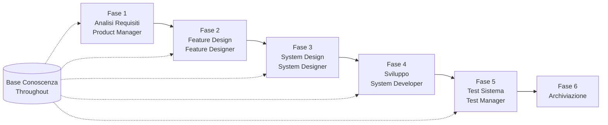

# Guida Introduttiva SpecCrew

<p align="center">
  <a href="./GETTING-STARTED.md">简体中文</a> |
  <a href="./GETTING-STARTED.zh-TW.md">繁體中文</a> |
  <a href="./GETTING-STARTED.en.md">English</a> |
  <a href="./GETTING-STARTED.ko.md">한국어</a> |
  <a href="./GETTING-STARTED.de.md">Deutsch</a> |
  <a href="./GETTING-STARTED.es.md">Español</a> |
  <a href="./GETTING-STARTED.fr.md">Français</a> |
  <a href="./GETTING-STARTED.it.md">Italiano</a> |
  <a href="./GETTING-STARTED.da.md">Dansk</a> |
  <a href="./GETTING-STARTED.ja.md">日本語</a> |
  <a href="./GETTING-STARTED.ar.md">العربية</a>
</p>

Questo documento ti aiuta a comprendere rapidamente come utilizzare il team Agent di SpecCrew per completare l'intero ciclo di sviluppo dai requisiti alla consegna seguendo i processi di ingegneria standard.

---

## 1. Preparazione

### Installare SpecCrew

```bash
npm install -g speccrew
```

### Inizializzare il Progetto

```bash
speccrew init --ide qoder
```

IDE supportati: `qoder`, `cursor`, `claude`, `codex`

### Struttura Directory Dopo l'Inizializzazione

```
.
├── .qoder/
│   ├── agents/          # File di definizione Agent
│   └── skills/          # File di definizione Skill
├── speccrew-workspace/  # Workspace
│   ├── docs/            # Configurazioni, regole, template, soluzioni
│   ├── iterations/      # Iterazioni in corso
│   ├── iteration-archives/  # Iterazioni archiviate
│   └── knowledges/      # Base di conoscenza
│       ├── base/        # Informazioni base (rapporti diagnostica, debito tecnico)
│       ├── bizs/        # Base conoscenza business
│       └── techs/       # Base conoscenza tecnica
```

### Riferimento Rapido Comandi CLI

| Comando | Descrizione |
|---------|-------------|
| `speccrew list` | Elenca tutti gli Agent e Skill disponibili |
| `speccrew doctor` | Verifica l'integrità dell'installazione |
| `speccrew update` | Aggiorna la configurazione del progetto all'ultima versione |
| `speccrew uninstall` | Disinstalla SpecCrew |

---

## 2. Panoramica Workflow

### Diagramma di Flusso Completo



### Principi Fondamentali

1. **Dipendenze di Fase**: I deliverable di ogni fase sono l'input per la fase successiva
2. **Conferma Checkpoint**: Ogni fase ha un punto di conferma che richiede l'approvazione dell'utente prima di procedere alla fase successiva
3. **Guidato da Base Conoscenza**: La base di conoscenza percorre l'intero processo, fornendo contesto per tutte le fasi

---

## 3. Fase Zero: Diagnostica Progetto e Inizializzazione Base Conoscenza

Prima di iniziare il processo di ingegneria formale, devi inizializzare la base di conoscenza del progetto.

### 3.1 Diagnostica Progetto

**Esempio Conversazione**:
```
@speccrew-team-leader diagnosticare il progetto
```

**Cosa farà l'Agent**:
- Scansionare la struttura del progetto
- Rilevare lo stack tecnologico
- Identificare i moduli business

**Deliverable**:
```
speccrew-workspace/knowledges/base/diagnosis-reports/diagnosis-report-{date}.md
```

### 3.2 Inizializzazione Base Conoscenza Tecnica

**Esempio Conversazione**:
```
@speccrew-team-leader inizializzare la base conoscenza tecnica
```

**Processo in Tre Fasi**:
1. Rilevamento Piattaforma — Identificare le piattaforme tecnologiche nel progetto
2. Generazione Documentazione Tecnica — Generare documenti di specifica tecnica per ogni piattaforma
3. Generazione Indice — Stabilire l'indice della base di conoscenza

**Deliverable**:
```
speccrew-workspace/knowledges/techs/{platform-id}/
├── tech-stack.md          # Definizione stack tecnologico
├── architecture.md        # Convenzioni architetturali
├── dev-spec.md            # Specifiche di sviluppo
├── test-spec.md           # Specifiche di test
└── INDEX.md               # File indice
```

### 3.3 Inizializzazione Base Conoscenza Business

**Esempio Conversazione**:
```
@speccrew-team-leader inizializzare la base conoscenza business
```

**Processo in Quattro Fasi**:
1. Inventario Funzionalità — Scansionare il codice per identificare tutte le funzionalità
2. Analisi Funzionalità — Analizzare la logica business per ogni funzionalità
3. Riepilogo Moduli — Riassumere le funzionalità per modulo
4. Riepilogo Sistema — Generare una panoramica business a livello di sistema

**Deliverable**:
```
speccrew-workspace/knowledges/bizs/
├── {platform-type}/
│   └── {module-name}/
│       └── feature-spec.md
└── system-overview.md
```

---

## 4. Guida Conversazione Fase per Fase

### 4.1 Fase 1: Analisi Requisiti (Product Manager)

**Come Iniziare**:
```
@speccrew-product-manager Ho un nuovo requisito: [descrivi il tuo requisito]
```

**Workflow Agent**:
1. Leggere la panoramica del sistema per comprendere i moduli esistenti
2. Analizzare i requisiti utente
3. Generare documento PRD strutturato

**Deliverable**:
```
iterations/{numero}-{tipo}-{nome}/01.product-requirement/
├── [feature-name]-prd.md           # Documento Requisiti Prodotto
└── [feature-name]-bizs-modeling.md # Modellazione business (per requisiti complessi)
```

**Checklist di Conferma**:
- [ ] La descrizione del requisito riflette accuratamente l'intento dell'utente?
- [ ] Le regole business sono complete?
- [ ] I punti di integrazione con i sistemi esistenti sono chiari?
- [ ] I criteri di accettazione sono misurabili?

---

### 4.2 Fase 2: Feature Design (Feature Designer)

**Come Iniziare**:
```
@speccrew-feature-designer iniziare il feature design
```

**Workflow Agent**:
1. Localizzare automaticamente il documento PRD confermato
2. Caricare la base conoscenza business
3. Generare feature design (inclusi wireframe UI, flussi di interazione, definizioni dati, contratti API)
4. Per PRD multipli, usare Task Worker per design parallelo

**Deliverable**:
```
iterations/{iter}/02.feature-design/
└── [feature-name]-feature-spec.md  # Documento feature design
```

**Checklist di Conferma**:
- [ ] Tutti gli scenari utente sono coperti?
- [ ] I flussi di interazione sono chiari?
- [ ] Le definizioni dei campi dati sono complete?
- [ ] La gestione delle eccezioni è completa?

---

### 4.3 Fase 3: System Design (System Designer)

**Come Iniziare**:
```
@speccrew-system-designer iniziare il system design
```

**Workflow Agent**:
1. Localizzare Feature Spec e Contratto API
2. Caricare la base conoscenza tecnica (stack tech, architettura, specifiche per ogni piattaforma)
3. **Checkpoint A**: Valutazione Framework — Analizzare i gap tecnici, raccomandare nuovi framework (se necessario), attendere conferma utente
4. Generare DESIGN-OVERVIEW.md
5. Usare Task Worker per distribuire il design per ogni piattaforma in parallelo (frontend/backend/mobile/desktop)
6. **Checkpoint B**: Conferma Congiunta — Mostrare il riepilogo di tutti i design delle piattaforme, attendere conferma utente

**Deliverable**:
```
iterations/{iter}/03.system-design/
├── DESIGN-OVERVIEW.md              # Panoramica design
├── {platform-id}/
│   ├── INDEX.md                    # Indice design piattaforma
│   └── {module}-design.md          # Design modulo a livello pseudocodice
```

**Checklist di Conferma**:
- [ ] Il pseudocodice usa la sintassi del framework effettivo?
- [ ] I contratti API multipiattaforma sono coerenti?
- [ ] La strategia di gestione errori è unificata?

---

### 4.4 Fase 4: Implementazione Sviluppo (System Developer)

**Come Iniziare**:
```
@speccrew-system-developer iniziare lo sviluppo
```

**Workflow Agent**:
1. Leggere i documenti di system design
2. Caricare le conoscenze tecniche per ogni piattaforma
3. **Checkpoint A**: Pre-controllo Ambiente — Verificare versioni runtime, dipendenze, disponibilità servizi; attendere risoluzione utente se fallito
4. Usare Task Worker per distribuire lo sviluppo per ogni piattaforma in parallelo
5. Controllo integrazione: allineamento contratto API, coerenza dati
6. Emettere rapporto di consegna

**Deliverable**:
```
# Codice sorgente scritto nella directory sorgente effettiva del progetto
iterations/{iter}/04.development/
├── {platform-id}/
│   └── tasks/                      # Registrazioni attività di sviluppo
└── delivery-report.md
```

**Checklist di Conferma**:
- [ ] L'ambiente è pronto?
- [ ] I problemi di integrazione sono entro un range accettabile?
- [ ] Il codice è conforme alle specifiche di sviluppo?

---

### 4.5 Fase 5: Test Sistema (Test Manager)

**Come Iniziare**:
```
@speccrew-test-manager iniziare i test
```

**Processo di Test in Tre Fasi**:

| Fase | Descrizione | Checkpoint |
|------|-------------|------------|
| Design Casi di Test | Generare casi di test basati su PRD e Feature Spec | A: Mostrare statistiche di copertura casi e matrice di tracciabilità, attendere conferma utente di copertura sufficiente |
| Generazione Codice Test | Generare codice di test eseguibile | B: Mostrare file di test generati e mappatura casi, attendere conferma utente |
| Esecuzione Test e Reporting Bug | Eseguire automaticamente i test e generare rapporti | Nessuno (esecuzione automatica) |

**Deliverable**:
```
iterations/{iter}/05.system-test/
├── cases/
│   └── {platform-id}/              # Documenti casi di test
├── code/
│   └── {platform-id}/              # Piano codice test
├── reports/
│   └── test-report-{date}.md       # Rapporto test
└── bugs/
    └── BUG-{id}-{title}.md         # Rapporti bug (un file per bug)
```

**Checklist di Conferma**:
- [ ] La copertura dei casi è completa?
- [ ] Il codice di test è eseguibile?
- [ ] La valutazione della gravità dei bug è accurata?

---

### 4.6 Fase 6: Archiviazione

Le iterazioni vengono automaticamente archiviate al completamento:

```
speccrew-workspace/iteration-archives/
└── {numero}-{tipo}-{nome}-{date}/
    ├── 01.product-requirement/
    ├── 02.feature-design/
    ├── 03.system-design/
    ├── 04.development/
    └── 05.system-test/
```

---

## 5. Panoramica Base Conoscenza

### 5.1 Base Conoscenza Business (bizs)

**Scopo**: Memorizzare descrizioni funzionali business del progetto, divisioni moduli, caratteristiche API

**Struttura Directory**:
```
knowledges/bizs/
├── {platform-type}/
│   └── {module-name}/
│       └── feature-spec.md
└── system-overview.md
```

**Scenari d'Uso**: Product Manager, Feature Designer

### 5.2 Base Conoscenza Tecnica (techs)

**Scopo**: Memorizzare stack tecnologico del progetto, convenzioni architetturali, specifiche di sviluppo, specifiche di test

**Struttura Directory**:
```
knowledges/techs/{platform-id}/
├── tech-stack.md
├── architecture.md
├── dev-spec.md
├── test-spec.md
└── INDEX.md
```

**Scenari d'Uso**: System Designer, System Developer, Test Manager

---

## 6. Domande Frequenti (FAQ)

### Q1: Cosa fare se l'Agent non funziona come previsto?

1. Eseguire `speccrew doctor` per verificare l'integrità dell'installazione
2. Confermare che la base di conoscenza è stata inizializzata
3. Confermare che i deliverable della fase precedente esistono nella directory di iterazione corrente

### Q2: Come saltare una fase?

**Non raccomandato** — L'output di ogni fase è l'input per la fase successiva.

Se devi assolutamente saltare, prepara manualmente il documento di input della fase corrispondente e assicurati che rispetti le specifiche di formato.

### Q3: Come gestire requisiti paralleli multipli?

Creare directory di iterazione indipendenti per ogni requisito:
```
iterations/
├── 001-feature-xxx/
├── 002-feature-yyy/
└── 003-feature-zzz/
```

Ogni iterazione è completamente isolata e non influenza le altre.

### Q4: Come aggiornare la versione di SpecCrew?

- **Aggiornamento Globale**: `npm update -g speccrew`
- **Aggiornamento Progetto**: Eseguire `speccrew update` nella directory del progetto

### Q5: Come visualizzare le iterazioni storiche?

Dopo l'archiviazione, visualizzare in `speccrew-workspace/iteration-archives/`, organizzate per formato `{numero}-{tipo}-{nome}-{date}/`.

### Q6: La base di conoscenza necessita di aggiornamenti regolari?

La re-inizializzazione è necessaria nelle seguenti situazioni:
- Cambiamenti importanti nella struttura del progetto
- Aggiornamento o sostituzione dello stack tecnologico
- Aggiunta/rimozione di moduli business

---

## 7. Riferimento Rapido

### Riferimento Rapido Avvio Agent

| Fase | Agent | Conversazione di Avvio |
|------|-------|------------------------|
| Diagnostica | Team Leader | `@speccrew-team-leader diagnosticare il progetto` |
| Inizializzazione | Team Leader | `@speccrew-team-leader inizializzare la base conoscenza tecnica` |
| Analisi Requisiti | Product Manager | `@speccrew-product-manager Ho un nuovo requisito: [descrizione]` |
| Feature Design | Feature Designer | `@speccrew-feature-designer iniziare il feature design` |
| System Design | System Designer | `@speccrew-system-designer iniziare il system design` |
| Sviluppo | System Developer | `@speccrew-system-developer iniziare lo sviluppo` |
| Test Sistema | Test Manager | `@speccrew-test-manager iniziare i test` |

### Checklist Checkpoint

| Fase | Numero Checkpoint | Elementi di Controllo Chiave |
|------|-------------------|------------------------------|
| Analisi Requisiti | 1 | Accuratezza requisiti, completezza regole business, misurabilità criteri di accettazione |
| Feature Design | 1 | Copertura scenari, chiarezza interazioni, completezza dati, gestione eccezioni |
| System Design | 2 | A: Valutazione framework; B: Sintassi pseudocodice, coerenza multipiattaforma, gestione errori |
| Sviluppo | 1 | A: Prontezza ambiente, problemi integrazione, specifiche codice |
| Test Sistema | 2 | A: Copertura casi; B: Eseguibilità codice test |

### Riferimento Rapido Percorsi Deliverable

| Fase | Directory Output | Formato File |
|------|------------------|--------------|
| Analisi Requisiti | `iterations/{iter}/01.product-requirement/` | `[name]-prd.md`, `[name]-bizs-modeling.md` |
| Feature Design | `iterations/{iter}/02.feature-design/` | `[name]-feature-spec.md` |
| System Design | `iterations/{iter}/03.system-design/` | `DESIGN-OVERVIEW.md`, `{platform}/INDEX.md`, `{platform}/{module}-design.md` |
| Sviluppo | `iterations/{iter}/04.development/` | Codice sorgente + `delivery-report.md` |
| Test Sistema | `iterations/{iter}/05.system-test/` | `cases/`, `code/`, `reports/`, `bugs/` |
| Archiviazione | `iteration-archives/{iter}-{date}/` | Copia iterazione completa |

---

## Prossimi Passi

1. Eseguire `speccrew init --ide qoder` per inizializzare il tuo progetto
2. Eseguire la Fase Zero: Diagnostica Progetto e Inizializzazione Base Conoscenza
3. Procedere attraverso ogni fase seguendo il workflow, godendoti l'esperienza di sviluppo specification-driven!
