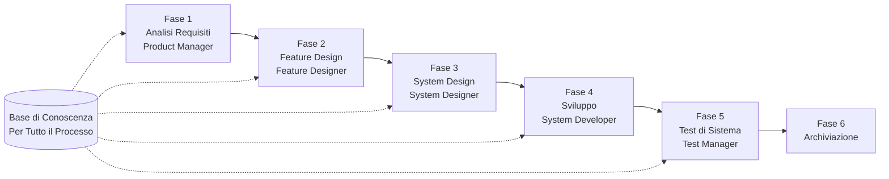

# Guida Rapida all'Avvio di SpecCrew

<p align="center">
  <a href="./GETTING-STARTED.md">简体中文</a> |
  <a href="./GETTING-STARTED.zh-TW.md">繁體中文</a> |
  <a href="./GETTING-STARTED.en.md">English</a> |
  <a href="./GETTING-STARTED.ko.md">한국어</a> |
  <a href="./GETTING-STARTED.de.md">Deutsch</a> |
  <a href="./GETTING-STARTED.es.md">Español</a> |
  <a href="./GETTING-STARTED.fr.md">Français</a> |
  <a href="./GETTING-STARTED.it.md">Italiano</a> |
  <a href="./GETTING-STARTED.da.md">Dansk</a> |
  <a href="./GETTING-STARTED.ja.md">日本語</a> |
  <a href="./GETTING-STARTED.ar.md">العربية</a>
</p>

Questo documento ti aiuta a comprendere rapidamente come utilizzare il team di Agenti di SpecCrew per completare lo sviluppo completo dai requisiti alla consegna seguendo processi di ingegneria standard.

---

## 1. Prerequisiti

### Installare SpecCrew

```bash
npm install -g speccrew
```

### Inizializzare il Progetto

```bash
speccrew init --ide qoder
```

IDE supportati: `qoder`, `cursor`, `claude`, `codex`

### Struttura delle Directory Dopo l'Inizializzazione

```
.
├── .qoder/
│   ├── agents/          # File di definizione degli Agenti
│   └── skills/          # File di definizione degli Skills
├── speccrew-workspace/  # Workspace
│   ├── docs/            # Configurazioni, regole, template, soluzioni
│   ├── iterations/      # Iterazioni in corso
│   ├── iteration-archives/  # Iterazioni archiviate
│   └── knowledges/      # Base di conoscenza
│       ├── base/        # Informazioni di base (rapporti di diagnosi, debiti tecnici)
│       ├── bizs/        # Base di conoscenza di business
│       └── techs/       # Base di conoscenza tecnica
```

### Riferimento Rapido dei Comandi CLI

| Comando | Descrizione |
|------|------|
| `speccrew list` | Elenca tutti gli Agenti e Skills disponibili |
| `speccrew doctor` | Verifica l'integrità dell'installazione |
| `speccrew update` | Aggiorna la configurazione del progetto all'ultima versione |
| `speccrew uninstall` | Disinstalla SpecCrew |

---

## 2. Avvio Rapido in 5 Minuti Dopo l'Installazione

Dopo aver eseguito `speccrew init`, segui questi passaggi per entrare rapidamente in stato di lavoro:

### Passaggio 1: Scegli il Tuo IDE

| IDE | Comando di Inizializzazione | Scenario di Applicazione |
|-----|-----------|----------|
| **Qoder** (Consigliato) | `speccrew init --ide qoder` | Orchestrazione completa degli agenti, worker paralleli |
| **Cursor** | `speccrew init --ide cursor` | Workflow basati su Composer |
| **Claude Code** | `speccrew init --ide claude` | Sviluppo CLI-first |
| **Codex** | `speccrew init --ide codex` | Integrazione ecosistema OpenAI |

### Passaggio 2: Inizializzare la Base di Conoscenza (Consigliato)

Per progetti con codice sorgente esistente, si consiglia di inizializzare prima la base di conoscenza in modo che gli agenti comprendano il tuo codebase:

```
@speccrew-team-leader inizializza base di conoscenza tecnica
```

Poi:

```
@speccrew-team-leader inizializza base di conoscenza di business
```

### Passaggio 3: Inizia il Tuo Primo Compito

```
@speccrew-product-manager Ho un nuovo requisito: [descrivi il tuo requisito funzionale]
```

> **Suggerimento**: Se non sei sicuro di cosa fare, dì semplicemente `@speccrew-team-leader aiutami a iniziare` — il Team Leader rileverà automaticamente lo stato del tuo progetto e ti guiderà.

---

## 3. Albero di Decisione Rapido

Non sei sicuro di cosa fare? Trova il tuo scenario qui sotto:

- **Ho un nuovo requisito funzionale**
  → `@speccrew-product-manager Ho un nuovo requisito: [descrivi il tuo requisito funzionale]`

- **Voglio scansionare la conoscenza del progetto esistente**
  → `@speccrew-team-leader inizializza base di conoscenza tecnica`
  → Poi: `@speccrew-team-leader inizializza base di conoscenza di business`

- **Voglio continuare il lavoro precedente**
  → `@speccrew-team-leader qual è lo stato di avanzamento attuale?`

- **Voglio verificare lo stato di salute del sistema**
  → Esegui nel terminale: `speccrew doctor`

- **Non sono sicuro di cosa fare**
  → `@speccrew-team-leader aiutami a iniziare`
  → Il Team Leader rileverà automaticamente lo stato del tuo progetto e ti guiderà

---

## 4. Riferimento Rapido degli Agenti

| Ruolo | Agente | Responsabilità | Esempio di Comando |
|------|-------|-----------------|-----------------|
| Capo Team | `@speccrew-team-leader` | Navigazione progetto, inizializzazione base di conoscenza, verifica stato | "Aiutami a iniziare" |
| Product Manager | `@speccrew-product-manager` | Analisi dei requisiti, generazione PRD | "Ho un nuovo requisito: ..." |
| Designer Funzionalità | `@speccrew-feature-designer` | Analisi funzionale, progettazione specifiche, contratti API | "Avvia progettazione funzionalità per iterazione X" |
| Designer di Sistema | `@speccrew-system-designer` | Progettazione architettura, progettazione dettagliata per piattaforma | "Avvia progettazione sistema per iterazione X" |
| Sviluppatore di Sistema | `@speccrew-system-developer` | Coordinamento sviluppo, generazione codice | "Avvia sviluppo per iterazione X" |
| Responsabile Test | `@speccrew-test-manager` | Pianificazione test, progettazione casi, esecuzione | "Avvia test per iterazione X" |

> **Nota**: Non devi ricordare tutti gli agenti. Basta parlare con `@speccrew-team-leader` e instraderà la tua richiesta all'agente giusto.

---

## 5. Panoramica del Workflow

### Diagramma di Flusso Completo



### Principi Fondamentali

1. **Dipendenze tra Fasi**: Il deliverable di ogni fase è l'input per la fase successiva
2. **Conferma Checkpoint**: Ogni fase ha un punto di conferma che richiede l'approvazione dell'utente prima di procedere alla fase successiva
3. **Guidato dalla Base di Conoscenza**: La base di conoscenza attraversa l'intero processo, fornendo contesto per tutte le fasi

---

## 6. Passaggio Zero: Inizializzazione della Base di Conoscenza

Prima di avviare il processo di ingegneria formale, è necessario inizializzare la base di conoscenza del progetto.

### 6.1 Inizializzazione della Base di Conoscenza Tecnica

**Esempio di Conversazione**:
```
@speccrew-team-leader inizializza base di conoscenza tecnica
```

**Processo in Tre Fasi**:
1. Rilevamento Piattaforma — Identificare le piattaforme tecniche nel progetto
2. Generazione Documentazione Tecnica — Generare documenti di specifica tecnica per ogni piattaforma
3. Generazione Indice — Stabilire l'indice della base di conoscenza

**Deliverable**:
```
speccrew-workspace/knowledges/techs/{platform-id}/
├── tech-stack.md          # Definizione dello stack tecnologico
├── architecture.md        # Convenzioni architetturali
├── dev-spec.md            # Specifiche di sviluppo
├── test-spec.md           # Specifiche di test
└── INDEX.md               # File indice
```

### 6.2 Inizializzazione della Base di Conoscenza di Business

**Esempio di Conversazione**:
```
@speccrew-team-leader inizializza base di conoscenza di business
```

**Processo in Quattro Fasi**:
1. Inventario Funzionalità — Scansionare il codice per identificare tutte le funzionalità
2. Analisi Funzionalità — Analizzare la logica di business per ogni funzionalità
3. Riepilogo per Modulo — Riepilogare le funzionalità per modulo
4. Riepilogo di Sistema — Generare panoramica di business a livello di sistema

**Deliverable**:
```
speccrew-workspace/knowledges/bizs/
├── {platform-type}/
│   └── {module-name}/
│       └── feature-spec.md
└── system-overview.md
```

---

## 7. Guida alla Conversazione Fase per Fase

### 7.1 Fase 1: Analisi dei Requisiti (Product Manager)

**Come Avviare**:
```
@speccrew-product-manager Ho un nuovo requisito: [descrivi il tuo requisito]
```

**Workflow dell'Agente**:
1. Leggere la panoramica del sistema per comprendere i moduli esistenti
2. Analizzare i requisiti dell'utente
3. Generare documento PRD strutturato

**Deliverable**:
```
iterations/{numero}-{tipo}-{nome}/01.product-requirement/
├── [feature-name]-prd.md           # Documento Product Requirements
└── [feature-name]-bizs-modeling.md # Modellazione business (per requisiti complessi)
```

**Checklist di Conferma**:
- [ ] La descrizione del requisito riflette accuratamente l'intento dell'utente?
- [ ] Le regole di business sono complete?
- [ ] I punti di integrazione con i sistemi esistenti sono chiari?
- [ ] I criteri di accettazione sono misurabili?

---

### 7.2 Fase 2: Feature Design (Feature Designer)

**Come Avviare**:
```
@speccrew-feature-designer avvia feature design
```

**Workflow dell'Agente**:
1. Individuare automaticamente il documento PRD confermato
2. Caricare la base di conoscenza di business
3. Generare feature design (inclusi wireframe UI, flussi di interazione, definizioni dati, contratti API)
4. Per più PRD, usare Task Worker per progettazione parallela

**Deliverable**:
```
iterations/{iter}/02.feature-design/
└── [feature-name]-feature-spec.md  # Documento feature design
```

**Checklist di Conferma**:
- [ ] Tutti gli scenari utente sono coperti?
- [ ] I flussi di interazione sono chiari?
- [ ] Le definizioni dei campi dati sono complete?
- [ ] La gestione delle eccezioni è completa?

---

### 7.3 Fase 3: System Design (System Designer)

**Come Avviare**:
```
@speccrew-system-designer avvia system design
```

**Workflow dell'Agente**:
1. Individuare Feature Spec e API Contract
2. Caricare la base di conoscenza tecnica (stack tecnologico, architettura, specifiche per ogni piattaforma)
3. **Checkpoint A**: Valutazione Framework — Analizzare gap tecnici, raccomandare nuovi framework (se necessario), attendere conferma utente
4. Generare DESIGN-OVERVIEW.md
5. Usare Task Worker per distribuire parallelamente il design per ogni piattaforma (frontend/backend/mobile/desktop)
6. **Checkpoint B**: Conferma Congiunta — Mostrare riepilogo di tutti i design di piattaforma, attendere conferma utente

**Deliverable**:
```
iterations/{iter}/03.system-design/
├── DESIGN-OVERVIEW.md              # Panoramica del design
├── {platform-id}/
│   ├── INDEX.md                    # Indice design per piattaforma
│   └── {module}-design.md          # Design modulo livello pseudocodice
```

**Checklist di Conferma**:
- [ ] Lo pseudocodice usa la sintassi effettiva del framework?
- [ ] I contratti API cross-piattaforma sono consistenti?
- [ ] La strategia di gestione errori è unificata?

---

### 7.4 Fase 4: Sviluppo (System Developer)

**Come Avviare**:
```
@speccrew-system-developer avvia sviluppo
```

**Workflow dell'Agente**:
1. Leggere i documenti di system design
2. Caricare conoscenze tecniche per ogni piattaforma
3. **Checkpoint A**: Pre-verifica Ambiente — Verificare versioni runtime, dipendenze, disponibilità servizi; attendere risoluzione utente se fallisce
4. Usare Task Worker per distribuire parallelamente lo sviluppo per ogni piattaforma
5. Verifica integrazione: allineamento contratti API, consistenza dati
6. Produrre report di consegna

**Deliverable**:
```
# Il codice sorgente viene scritto nella directory sorgente effettiva del progetto
iterations/{iter}/04.development/
├── {platform-id}/
│   └── tasks/                      # Registrazioni attività di sviluppo
└── delivery-report.md
```

**Checklist di Conferma**:
- [ ] L'ambiente è pronto?
- [ ] I problemi di integrazione sono in un intervallo accettabile?
- [ ] Il codice è conforme alle specifiche di sviluppo?

---

### 7.5 Fase 5: Test di Sistema (Test Manager)

**Come Avviare**:
```
@speccrew-test-manager avvia test
```

**Processo di Test in Tre Fasi**:

| Fase | Descrizione | Checkpoint |
|-------|-------------|------------|
| Progettazione Casi di Test | Generare casi di test basati su PRD e Feature Spec | A: Mostrare statistiche copertura casi e matrice di tracciabilità, attendere conferma utente di copertura sufficiente |
| Generazione Codice di Test | Generare codice di test eseguibile | B: Mostrare file di test generati e mappatura casi, attendere conferma utente |
| Esecuzione Test e Report Bug | Eseguire automaticamente test e generare report | Nessuno (esecuzione automatica) |

**Deliverable**:
```
iterations/{iter}/05.system-test/
├── cases/
│   └── {platform-id}/              # Documenti casi di test
├── code/
│   └── {platform-id}/              # Piano codice di test
├── reports/
│   └── test-report-{date}.md       # Report di test
└── bugs/
    └── BUG-{id}-{title}.md         # Report bug (un file per bug)
```

**Checklist di Conferma**:
- [ ] La copertura dei casi è completa?
- [ ] Il codice di test è eseguibile?
- [ ] La valutazione della gravità dei bug è accurata?

---

### 7.6 Fase 6: Archiviazione

Le iterazioni vengono archiviate automaticamente dopo il completamento:

```
speccrew-workspace/iteration-archives/
└── {numero}-{tipo}-{nome}-{data}/
    ├── 01.product-requirement/
    ├── 02.feature-design/
    ├── 03.system-design/
    ├── 04.development/
    └── 05.system-test/
```

---

## 8. Panoramica della Base di Conoscenza

### 8.1 Base di Conoscenza di Business (bizs)

**Scopo**: Memorizzare descrizioni funzionalità business del progetto, divisioni modulari, caratteristiche API

**Struttura Directory**:
```
knowledges/bizs/
├── {platform-type}/
│   └── {module-name}/
│       └── feature-spec.md
└── system-overview.md
```

**Scenari d'Uso**: Product Manager, Feature Designer

### 8.2 Base di Conoscenza Tecnica (techs)

**Scopo**: Memorizzare stack tecnologico del progetto, convenzioni architetturali, specifiche di sviluppo, specifiche di test

**Struttura Directory**:
```
knowledges/techs/{platform-id}/
├── tech-stack.md
├── architecture.md
├── dev-spec.md
├── test-spec.md
└── INDEX.md
```

**Scenari d'Uso**: System Designer, System Developer, Test Manager

---

## 9. Gestione Avanzamento Workflow

Il team virtuale SpecCrew segue un rigoroso meccanismo di stage-gating in cui ogni fase deve essere confermata dall'utente prima di procedere alla successiva. Supporta anche l'esecuzione riprendibile — quando riavviato dopo un'interruzione, continua automaticamente da dove si era fermato.

### 9.1 Tre Livelli di File di Avanzamento

Il workflow mantiene automaticamente tre tipi di file JSON di avanzamento, situati nella directory di iterazione:

| File | Posizione | Scopo |
|------|----------|---------|
| `WORKFLOW-PROGRESS.json` | `iterations/{iter}/` | Registra lo stato di ogni fase della pipeline |
| `.checkpoints.json` | Sotto ogni directory di fase | Registra lo stato di conferma dei checkpoint utente |
| `DISPATCH-PROGRESS.json` | Sotto ogni directory di fase | Registra l'avanzamento item per item per attività parallele (multi-piattaforma/multi-modulo) |

### 9.2 Flusso di Stato della Fase

Ogni fase segue questo flusso di stato:

```
pending → in_progress → completed → confirmed
```

- **pending**: Non ancora avviato
- **in_progress**: In esecuzione
- **completed**: Esecuzione agente completata, in attesa di conferma utente
- **confirmed**: Utente confermato tramite checkpoint finale, la fase successiva può iniziare

### 9.3 Esecuzione Riprendibile

Quando si riavvia un Agente per una fase:

1. **Verifica automatica upstream**: Verifica se la fase precedente è confermata, blocca e richiede se non
2. **Recupero Checkpoint**: Legge `.checkpoints.json`, salta i checkpoint passati, continua dall'ultimo punto di interruzione
3. **Recupero Attività Parallele**: Legge `DISPATCH-PROGRESS.json`, ri-esegue solo attività con stato `pending` o `failed`, salta attività `completed`

### 9.4 Visualizzare Avanzamento Attuale

Visualizzare lo stato panoramico della pipeline tramite l'Agente Team Leader:

```
@speccrew-team-leader visualizza avanzamento iterazione corrente
```

Il Team Leader leggerà i file di avanzamento e mostrerà una panoramica dello stato simile a:

```
Pipeline Status: i001-user-management
  01 PRD:            ✅ Confirmed
  02 Feature Design: 🔄 In Progress (Checkpoint A passed)
  03 System Design:  ⏳ Pending
  04 Development:    ⏳ Pending
  05 System Test:    ⏳ Pending
```

### 9.5 Compatibilità all'Indietro

Il meccanismo dei file di avanzamento è completamente compatibile all'indietro — se i file di avanzamento non esistono (ad es. in progetti legacy o nuove iterazioni), tutti gli Agenti eseguiranno normalmente secondo la logica originale.

---

## 10. Domande Frequenti (FAQ)

### D1: Cosa fare se l'Agente non funziona come previsto?

1. Eseguire `speccrew doctor` per verificare l'integrità dell'installazione
2. Confermare che la base di conoscenza è stata inizializzata
3. Confermare che il deliverable della fase precedente esiste nella directory di iterazione corrente

### D2: Come saltare una fase?

**Non consigliato** — L'output di ogni fase è l'input per la fase successiva.

Se devi saltare, prepara manualmente il documento di input della fase corrispondente e assicurati che sia conforme alle specifiche di formato.

### D3: Come gestire più requisiti paralleli?

Crea directory di iterazione indipendenti per ogni requisito:
```
iterations/
├── 001-feature-xxx/
├── 002-feature-yyy/
└── 003-feature-zzz/
```

Ogni iterazione è completamente isolata e non influisce sulle altre.

### D4: Come aggiornare la versione di SpecCrew?

L'aggiornamento richiede due passaggi:

```bash
# Passaggio 1: Aggiornare lo strumento CLI globale
npm install -g speccrew@latest

# Passaggio 2: Sincronizzare Agents e Skills nella directory del progetto
cd /path/to/your-project
speccrew update
```

- `npm install -g speccrew@latest`: Aggiorna lo strumento CLI stesso (le nuove versioni possono includere nuove definizioni Agent/Skill, correzioni bug, ecc.)
- `speccrew update`: Sincronizza i file di definizione Agent e Skill del tuo progetto all'ultima versione
- `speccrew update --ide cursor`: Aggiorna la configurazione per un IDE specifico soltanto

> **Nota**: Entrambi i passaggi sono necessari. Eseguire solo `speccrew update` non aggiornerà lo strumento CLI stesso; eseguire solo `npm install` non aggiornerà i file del progetto.

### D5: `speccrew update` indica che è disponibile una nuova versione ma `npm install -g speccrew@latest` continua a installare la vecchia versione?

Questo è solitamente causato dalla cache npm. Soluzione:

```bash
# Pulire cache npm e reinstallare
npm cache clean --force
npm install -g speccrew@latest

# Verificare versione
npm list -g speccrew
```

Se ancora non funziona, prova a installare con un numero di versione specifico:
```bash
npm install -g speccrew@0.5.6
```

### D6: Come visualizzare le iterazioni storiche?

Dopo l'archiviazione, visualizzare in `speccrew-workspace/iteration-archives/`, organizzato per formato `{numero}-{tipo}-{nome}-{data}/`.

### D7: La base di conoscenza necessita di aggiornamenti regolari?

È richiesta la reinizializzazione nelle seguenti situazioni:
- Modifiche importanti alla struttura del progetto
- Aggiornamento o sostituzione dello stack tecnologico
- Aggiunta/rimozione di moduli business

---

## 11. Riferimento Rapido

### Riferimento Rapido Avvio Agenti

| Fase | Agente | Conversazione di Avvio |
|-------|-------|-------------------|
| Inizializzazione | Team Leader | `@speccrew-team-leader inizializza base di conoscenza tecnica` |
| Analisi Requisiti | Product Manager | `@speccrew-product-manager Ho un nuovo requisito: [descrizione]` |
| Feature Design | Feature Designer | `@speccrew-feature-designer avvia feature design` |
| System Design | System Designer | `@speccrew-system-designer avvia system design` |
| Sviluppo | System Developer | `@speccrew-system-developer avvia sviluppo` |
| Test di Sistema | Test Manager | `@speccrew-test-manager avvia test` |

### Checklist Checkpoint

| Fase | Numero Checkpoint | Elementi di Verifica Chiave |
|-------|----------------------|-----------------|
| Analisi Requisiti | 1 | Accuratezza requisiti, completezza regole business, misurabilità criteri accettazione |
| Feature Design | 1 | Copertura scenari, chiarezza interazione, completezza dati, gestione eccezioni |
| System Design | 2 | A: Valutazione framework; B: Sintassi pseudocodice, consistenza cross-piattaforma, gestione errori |
| Sviluppo | 1 | A: Pronto ambiente, problemi integrazione, specifiche codice |
| Test di Sistema | 2 | A: Copertura casi; B: Eseguibilità codice test |

### Riferimento Rapido Percorsi Deliverable

| Fase | Directory Output | Formato File |
|-------|-----------------|-------------|
| Analisi Requisiti | `iterations/{iter}/01.product-requirement/` | `[name]-prd.md`, `[name]-bizs-modeling.md` |
| Feature Design | `iterations/{iter}/02.feature-design/` | `[name]-feature-spec.md` |
| System Design | `iterations/{iter}/03.system-design/` | `DESIGN-OVERVIEW.md`, `{platform}/INDEX.md`, `{platform}/{module}-design.md` |
| Sviluppo | `iterations/{iter}/04.development/` | Codice sorgente + `delivery-report.md` |
| Test di Sistema | `iterations/{iter}/05.system-test/` | `cases/`, `code/`, `reports/`, `bugs/` |
| Archiviazione | `iteration-archives/{iter}-{date}/` | Copia completa dell'iterazione |

---

## Prossimi Passaggi

1. Esegui `speccrew init --ide qoder` per inizializzare il tuo progetto
2. Esegui Passaggio Zero: Inizializzazione della Base di Conoscenza
3. Progredisci fase per fase secondo il workflow, goditi l'esperienza di sviluppo guidato dalle specifiche!
