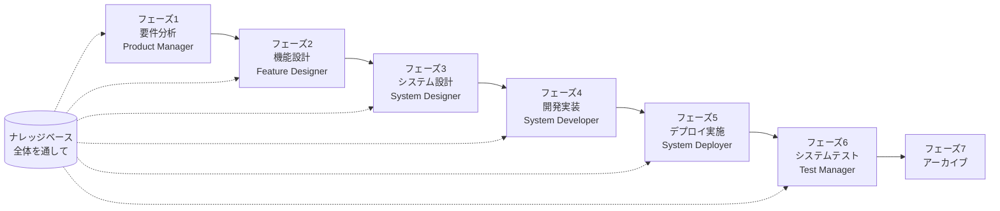

# SpecCrew クイックスタートガイド

<p align="center">
  <a href="./GETTING-STARTED.md">简体中文</a> |
  <a href="./GETTING-STARTED.en.md">English</a> |
  <a href="./GETTING-STARTED.ja.md">日本語</a> |
  <a href="./GETTING-STARTED.ru.md">Русский</a> |
  <a href="./GETTING-STARTED.es.md">Español</a> |
  <a href="./GETTING-STARTED.de.md">Deutsch</a> |
  <a href="./GETTING-STARTED.fr.md">Français</a> |
  <a href="./GETTING-STARTED.pt-BR.md">Português (Brasil)</a> |
  <a href="./GETTING-STARTED.ar.md">العربية</a> |
  <a href="./GETTING-STARTED.hi.md">हिन्दी</a>
</p>

このドキュメントは、SpecCrewのエージェントチームを使用して、標準的なエンジニアリングワークフローに従って要件からデリバリーまでの完全な開発を段階的に完了する方法を素早く理解するのに役立ちます。

---

## 1. 事前準備

### SpecCrewのインストール

```bash
npm install -g speccrew
```

### プロジェクトの初期化

```bash
speccrew init --ide qoder
```

サポートされているIDE:`qoder`、`cursor`、`claude`、`codex`

### 初期化後のディレクトリ構造

```
.
├── .qoder/
│   ├── agents/          # エージェント定義ファイル
│   └── skills/          # スキル定義ファイル
├── speccrew-workspace/  # ワークスペース
│   ├── docs/            # 設定、ルール、テンプレート、ソリューション
│   ├── iterations/      # 進行中のイテレーション
│   ├── iteration-archives/  # アーカイブされたイテレーション
│   └── knowledges/      # ナレッジベース
│       ├── base/        # 基本情報(診断レポート、技術的負債)
│       ├── bizs/        # ビジネスナレッジベース
│       └── techs/       # テクニカルナレッジベース
```

### CLIコマンドクイックリファレンス

| コマンド | 説明 |
|------|------|
| `speccrew list` | 利用可能なすべてのエージェントとスキルを一覧表示 |
| `speccrew doctor` | インストールの完全性をチェック |
| `speccrew update` | プロジェクト設定を最新バージョンに更新 |
| `speccrew uninstall` | SpecCrewをアンインストール |

---

## 2. インストール後5分でクイックスタート

`speccrew init` を実行した後、以下の手順で迅速に作業状態に入ることができます:

### ステップ1: IDEを選択

| IDE | 初期化コマンド | 適用シーン |
|-----|-----------|----------|
| **Qoder**(推奨) | `speccrew init --ide qoder` | 完全なエージェントオーケストレーション、並列ワーカー |
| **Cursor** | `speccrew init --ide cursor` | Composerベースのワークフロー |
| **Claude Code** | `speccrew init --ide claude` | CLIファースト開発 |
| **Codex** | `speccrew init --ide codex` | OpenAIエコシステム統合 |

### ステップ2: ナレッジベースの初期化(推奨)

既存のソースコードがあるプロジェクトの場合、まずナレッジベースを初期化して、エージェントがコードベースを理解できるようにすることを推奨します:

```
/speccrew-team-leader テクニカルナレッジベースを初期化
```

次に:

```
/speccrew-team-leader ビジネスナレッジベースを初期化
```

### ステップ3: 最初のタスクを開始

```
/speccrew-product-manager 新しい要件があります:[機能要件を説明]
```

> **ヒント**:何をすべきか不明な場合は、直接 `/speccrew-team-leader 開始を支援して` と言ってください — Team Leaderが自動的にプロジェクト状態を検出してガイドします。

---

## 3. クイック決定ツリー

何をすべきか不明ですか?あなたのシナリオを見つけてください:

- **新しい機能要件がある**
  → `/speccrew-product-manager 新しい要件があります:[機能要件を説明]`

- **既存プロジェクトの知識をスキャンしたい**
  → `/speccrew-team-leader テクニカルナレッジベースを初期化`
  → 次に:`/speccrew-team-leader ビジネスナレッジベースを初期化`

- **以前の作業を継続したい**
  → `/speccrew-team-leader 現在の進捗は何ですか?`

- **システムの健康状態をチェックしたい**
  → ターミナルで実行:`speccrew doctor`

- **何をすべきか不明**
  → `/speccrew-team-leader 開始を支援して`
  → Team Leaderが自動的にプロジェクト状態を検出してガイドします

---

## 4. エージェントクイックリファレンス

| 役割 | エージェント | 責任 | コマンド例 |
|------|-------|------|----------|
| チームリーダー | `/speccrew-team-leader` | プロジェクトナビゲーション、ナレッジベース初期化、状態確認 | "開始を支援して" |
| プロダクトマネージャー | `/speccrew-product-manager` | 要件分析、PRD生成 | "新しい要件があります:..." |
| 機能デザイナー | `/speccrew-feature-designer` | 機能分析、仕様設計、API契約 | "イテレーションXの機能設計を開始" |
| システムデザイナー | `/speccrew-system-designer` | アーキテクチャ設計、プラットフォーム詳細設計 | "イテレーションXのシステム設計を開始" |
| システム開発者 | `/speccrew-system-developer` | 開発調整、コード生成 | "イテレーションXの開発を開始" |
| テストマネージャー | `/speccrew-test-manager` | テスト計画、ケース設計、実行 | "イテレーションXのテストを開始" |

> **ヒント**:すべてのエージェントを覚える必要はありません。`/speccrew-team-leader` と話すだけで、リクエストを適切なエージェントにルーティングします。

---

## 5. ワークフロー概要

### 完全フロー図



### 核心原則

1. **フェーズ依存関係**:各フェーズの成果物は次のフェーズの入力
2. **チェックポイント確認**:各フェーズに確認ポイントがあり、ユーザー確認後に次のフェーズに進む
3. **ナレッジベース駆動**:ナレッジベースは全体を通して各フェーズにコンテキストを提供

---

## 6. ステップ0:ナレッジベース初期化

正式なエンジニアリングフローを開始する前に、プロジェクトナレッジベースを初期化する必要があります。

### 6.1 テクニカルナレッジベース初期化

**会話例**:
```
/speccrew-team-leader テクニカルナレッジベースを初期化
```

**3段階プロセス**:
1. プラットフォーム検出 — プロジェクト内の技術プラットフォームを識別
2. 技術ドキュメント生成 — 各プラットフォームの技術仕様ドキュメントを生成
3. インデックス生成 — ナレッジベースインデックスを構築

**成果物**:
```
speccrew-workspace/knowledges/techs/{platform-id}/
├── tech-stack.md          # 技術スタック定義
├── architecture.md        # アーキテクチャ規約
├── dev-spec.md            # 開発規約
├── test-spec.md           # テスト規約
└── INDEX.md               # インデックスファイル
```

### 6.2 ビジネスナレッジベース初期化

**会話例**:
```
/speccrew-team-leader ビジネスナレッジベースを初期化
```

**4段階プロセス**:
1. 機能インベントリ — コードをスキャンしてすべての機能特性を識別
2. 機能分析 — 各機能のビジネスロジックを分析
3. モジュール要約 — モジュール別に機能を集約
4. システム要約 — システムレベルのビジネス概要を生成

**成果物**:
```
speccrew-workspace/knowledges/bizs/
├── {platform-type}/
│   └── {module-name}/
│       └── feature-spec.md
└── system-overview.md
```

---

## 7. フェーズ別会話ガイド

### 7.1 フェーズ1:要件分析(Product Manager)

**開始方法**:
```
/speccrew-product-manager 新しい要件があります:[要件を説明]
```

**エージェントワークフロー**:
1. システム概要を読み込んで既存モジュールを理解
2. ユーザー要件を分析
3. 構造化されたPRDドキュメントを生成

**成果物**:
```
iterations/{番号}-{タイプ}-{名前}/01.product-requirement/
├── [feature-name]-prd.md           # 製品要件ドキュメント
└── [feature-name]-bizs-modeling.md # ビジネスモデリング(複雑な要件の場合)
```

**確認ポイント**:
- [ ] 要件説明はユーザーの意図を正確に反映しているか
- [ ] ビジネスルールは完全か
- [ ] 既存システムとの統合ポイントは明確か
- [ ] 受け入れ基準は測定可能か

---

### 7.2 フェーズ2:機能設計(Feature Designer)

**開始方法**:
```
/speccrew-feature-designer 機能設計を開始
```

**エージェントワークフロー**:
1. 確認済みのPRDドキュメントを自動配置
2. ビジネスナレッジベースをロード
3. 機能設計を生成(UIワイヤーフレーム、インタラクションフロー、データ定義、API契約を含む)
4. 複数のPRDがある場合、Task Workerを使用して並列設計

**成果物**:
```
iterations/{iter}/02.feature-design/
└── [feature-name]-feature-spec.md  # 機能設計ドキュメント
```

**確認ポイント**:
- [ ] すべてのユーザシナリオがカバーされているか
- [ ] インタラクションフローは明確か
- [ ] データフィールド定義は完全か
- [ ] 例外処理は完善か

---

### 7.3 フェーズ3:システム設計(System Designer)

**開始方法**:
```
/speccrew-system-designer システム設計を開始
```

**エージェントワークフロー**:
1. Feature SpecとAPI Contractを配置
2. テクニカルナレッジベースをロード(各プラットフォームの技術スタック、アーキテクチャ、規約)
3. **チェックポイントA**:フレームワーク評価 — 技術ギャップを分析、新しいフレームワークを推奨(必要に応じて)、ユーザー確認を待機
4. DESIGN-OVERVIEW.mdを生成
5. Task Workerを使用して各プラットフォームの設計を並列配信(フロントエンド/バックエンド/モバイル/デスクトップ)
6. **チェックポイントB**:合同確認 — すべてのプラットフォーム設計の概要を表示、ユーザー確認を待機

**成果物**:
```
iterations/{iter}/03.system-design/
├── DESIGN-OVERVIEW.md              # 設計概要
├── {platform-id}/
│   ├── INDEX.md                    # 各プラットフォーム設計インデックス
│   └── {module}-design.md          # 擬似コードレベルモジュール設計
```

**確認ポイント**:
- [ ] 擬似コードは実際のフレームワーク構文を使用しているか
- [ ] クロスプラットフォームAPI契約は一貫しているか
- [ ] エラー処理戦略は統一されているか

---

### 7.4 フェーズ4:開発実装(System Developer)

**開始方法**:
```
/speccrew-system-developer 開発を開始
```

**エージェントワークフロー**:
1. システム設計ドキュメントを読み込む
2. 各プラットフォームの技術知識をロード
3. **チェックポイントA**:環境プレチェック — ランタイムバージョン、依存関係、サービスの可用性をチェック、失敗した場合ユーザーの解決を待機
4. Task Workerを使用して各プラットフォームの開発を並列配信
5. 統合チェック:API契約の整合、データ一貫性
6. 納品レポートを出力

**成果物**:
```
# ソースコードはプロジェクトの実際のソースディレクトリに書き込まれる
iterations/{iter}/04.development/
├── {platform-id}/
│   └── tasks/                      # 開発タスク記録
└── delivery-report.md
```

**確認ポイント**:
- [ ] 環境は準備完了か
- [ ] 統合問題は許容範囲内か
- [ ] コードは開発規約に準拠しているか

---

### 7.5 フェーズ5:デプロイ実施(System Deployer)

**開始方法**:

```
/speccrew-system-deployer デプロイを開始
```

**エージェントワークフロー**:
1. 開発フェーズが完了したことを検証(Stage Gate)
2. テクニカルナレッジベースをロード(ビルド構成、データベースマイグレーション構成、サービス起動コマンド)
3. **チェックポイント**:環境プレチェック — ビルドツール、ランタイムバージョン、依存関係の可用性を検証
4. 順番にデプロイスキルを実行:ビルド(Build)→ データベースマイグレーション(Migrate)→ サービス起動(Startup)→ スモークテスト(Smoke Test)
5. デプロイレポートを出力

> 💡 **ヒント**:データベースのないプロジェクトの場合、マイグレーションステップは自動的にスキップされます。クライアントアプリケーション(デスクトップ/モバイル)の場合、HTTPヘルスチェックの代わりにプロセス検証モードが使用されます。

**成果物**:

```
iterations/{iter}/05.deployment/
├── {platform-id}/
│   ├── deployment-plan.md          # デプロイ計画
│   └── deployment-log.md           # デプロイ実行ログ
└── deployment-report.md            # デプロイ完了レポート
```

**確認ポイント**:
- [ ] ビルドが正常に完了したか
- [ ] データベースマイグレーションスクリプトがすべて正常に実行されたか(該当する場合)
- [ ] アプリケーションが正常に起動しヘルスチェックに合格したか
- [ ] スモークテストがすべて合格したか

---

### 7.6 フェーズ6:システムテスト(Test Manager)

**開始方法**:
```
/speccrew-test-manager テストを開始
```

**3段階テストプロセス**:

| フェーズ | 説明 | チェックポイント |
|------|------|------------|
| テストケース設計 | PRDとFeature Specに基づいてテストケースを生成 | A:ケースカバレッジ統計とトレースビリティマトリックスを表示、ユーザーがカバレッジ十分を確認するのを待機 |
| テストコード生成 | 実行可能なテストコードを生成 | B:生成されたテストファイルとケースマッピングを表示、ユーザー確認を待機 |
| テスト実行とバグレポート | テストを自動実行、レポートを生成 | なし(自動実行) |

**成果物**:
```
iterations/{iter}/06.system-test/
├── cases/
│   └── {platform-id}/              # テストケースドキュメント
├── code/
│   └── {platform-id}/              # テストコード計画
├── reports/
│   └── test-report-{date}.md       # テストレポート
└── bugs/
    └── BUG-{id}-{title}.md         # バグレポート(バグごとに1ファイル)
```

**確認ポイント**:
- [ ] ケースカバレッジは完全か
- [ ] テストコードは実行可能か
- [ ] バグの深刻度判定は正確か

---

### 7.7 フェーズ7:アーカイブ

イテレーション完了後自動的にアーカイブ:

```
speccrew-workspace/iteration-archives/
└── {番号}-{タイプ}-{名前}-{日付}/
    ├── 01.product-requirement/
    ├── 02.feature-design/
    ├── 03.system-design/
    ├── 04.development/
    ├── 05.deployment/
    └── 06.system-test/
```

---

## 8. ナレッジベース概要

### 8.1 ビジネスナレッジベース(bizs)

**目的**:プロジェクトのビジネス機能説明、モジュール分割、API特性を保存

**ディレクトリ構造**:
```
knowledges/bizs/
├── {platform-type}/
│   └── {module-name}/
│       └── feature-spec.md
└── system-overview.md
```

**使用シーン**:Product Manager、Feature Designer

### 8.2 テクニカルナレッジベース(techs)

**目的**:プロジェクトの技術スタック、アーキテクチャ規約、開発規約、テスト規約を保存

**ディレクトリ構造**:
```
knowledges/techs/{platform-id}/
├── tech-stack.md
├── architecture.md
├── dev-spec.md
├── test-spec.md
└── INDEX.md
```

**使用シーン**:System Designer、System Developer、Test Manager

---

## 9. パイプライン進捗管理

SpecCrewバーチャルチームは厳格なステージゲーティングメカニズムに従い、各フェーズはユーザー確認後に次のフェーズに進むことができます。また、レジューム実行もサポート — 中断後再開時、前回の停止位置から自動的に続行します。

### 9.1 3層進捗ファイル

ワークフローは自動的に3種類のJSON進捗ファイルを維持し、イテレーションディレクトリに配置:

| ファイル | 位置 | 目的 |
|------|------|------|
| `WORKFLOW-PROGRESS.json` | `iterations/{iter}/` | パイプライン全体の各フェーズの状態を記録 |
| `.checkpoints.json` | 各フェーズディレクトリ下 | ユーザー確認ポイント(Checkpoint)通過状態を記録 |
| `DISPATCH-PROGRESS.json` | 各フェーズディレクトリ下 | 並列タスク(マルチプラットフォーム/マルチモジュール)の項目別進捗を記録 |

### 9.2 フェーズ状態フロー

各フェーズは以下の状態フローに従います:

```
pending → in_progress → completed → confirmed
```

- **pending**:まだ開始されていない
- **in_progress**:実行中
- **completed**:エージェント実行完了、ユーザー確認待ち
- **confirmed**:ユーザーが最終Checkpointで確認、次のフェーズ開始可能

### 9.3 レジューム実行

フェーズのエージェントを再起動する場合:

1. **上流自動チェック**:前のフェーズがconfirmedか検証、未確認の場合ブロックしてプロンプト
2. **Checkpoint回復**:`.checkpoints.json`を読み込み、通過済みの確認ポイントをスキップ、前回の中断場所から続行
3. **並列タスク回復**:`DISPATCH-PROGRESS.json`を読み込み、`pending`または`failed`状態のタスクのみ再実行、`completed`タスクをスキップ

### 9.4 現在の進捗 viewing

Team Leaderエージェントを通じてパイプラインパノラマ状態を表示:

```
/speccrew-team-leader 現在のイテレーション進捗を表示
```

Team Leaderは進捗ファイルを読み込み、以下のような状態概要を表示:

```
Pipeline Status: i001-user-management
  01 PRD:            ✅ Confirmed
  02 Feature Design: 🔄 In Progress (Checkpoint A passed)
  03 System Design:  ⏳ Pending
  04 Development:    ⏳ Pending
  05 Deployment:     ⏳ Pending
  06 System Test:    ⏳ Pending
```

### 9.5 下位互換性

進捗ファイルメカニズムは完全に下位互換性があります — 進捗ファイルが存在しない場合(旧プロジェクトや新しいイテレーションなど)、すべてのエージェントは元のロジックに従って正常に実行します。

---

## 10. よくある質問(FAQ)

### Q1: エージェントが期待通りに動作しない場合は?

1. `speccrew doctor` を実行してインストールの完全性をチェック
2. ナレッジベースが初期化されていることを確認
3. 現在のイテレーションディレクトリに前のフェーズの成果物が存在することを確認

### Q2: フェーズをスキップするには?

**スキップ非推奨** — 各フェーズの出力は次のフェーズの入力です。

スキップが必要な場合は、対応するフェーズの入力ドキュメントを手動で準備し、フォーマット仕様に従っていることを確認してください。

### Q3: 複数の並列要件を処理するには?

各要件に対して独立したイテレーションディレクトリを作成:
```
iterations/
├── 001-feature-xxx/
├── 002-feature-yyy/
└── 003-feature-zzz/
```

各イテレーションは完全に分離され、相互に影響しません。

### Q4: SpecCrewバージョンを更新するには?

更新は2つのステップが必要です:

```bash
# ステップ1: グローバルCLIツールを更新
npm install -g speccrew@latest

# ステップ2: プロジェクトディレクトリでエージェントとスキルを同期
cd /path/to/your-project
speccrew update
```

- `npm install -g speccrew@latest`:CLIツール自体を更新(新バージョンには新しいエージェント/スキル定義、バグ修正などが含まれる場合があります)
- `speccrew update`:プロジェクト内のエージェントとスキル定義ファイルを最新バージョンに同期
- `speccrew update --ide cursor`:指定されたIDEの構成のみを更新

> **注意**:両方のステップが必要です。`speccrew update` のみを実行してもCLIツール自体は更新されません;`npm install` のみを実行してもプロジェクトファイルは更新されません。

### Q5: `speccrew update` は新バージョンが利用可能と表示されるが、`npm install -g speccrew@latest` は古いバージョンをインストールする?

これは通常npmキャッシュが原因です。解決方法:

```bash
# npmキャッシュをクリアして再インストール
npm cache clean --force
npm install -g speccrew@latest

# バージョンを検証
npm list -g speccrew
```

それでもうまくいかない場合は、特定のバージョン番号を指定してインストールしてみてください:
```bash
npm install -g speccrew@0.5.6
```

### Q6: 履歴イテレーションを表示するには?

アーカイブ後、`speccrew-workspace/iteration-archives/` で表示、`{番号}-{タイプ}-{名前}-{日付}/` 形式で整理。

### Q7: ナレッジベースは定期的に更新する必要がありますか?

以下の状況で再初期化が必要です:
- プロジェクト構造の重大な変更
- 技術スタックのアップグレードまたは交換
- ビジネスモジュールの追加/削除

---

## 11. クイックリファレンス

### エージェント起動クイックリファレンス

| フェーズ | エージェント | 開始会話 |
|-------|-------|-------------------|
| 初期化 | Team Leader | `/speccrew-team-leader テクニカルナレッジベースを初期化` |
| 要件分析 | Product Manager | `/speccrew-product-manager 新しい要件があります:[説明]` |
| 機能設計 | Feature Designer | `/speccrew-feature-designer 機能設計を開始` |
| システム設計 | System Designer | `/speccrew-system-designer システム設計を開始` |
| 開発 | System Developer | `/speccrew-system-developer 開発を開始` |
| デプロイ | System Deployer | `/speccrew-system-deployer デプロイを開始` |
| システムテスト | Test Manager | `/speccrew-test-manager テストを開始` |

### チェックポイントチェックリスト

| フェーズ | チェックポイント数 | 主要チェック項目 |
|-------|----------------------|-----------------|
| 要件分析 | 1 | 要件の正確性、ビジネスルールの完全性、受け入れ基準の測定可能性 |
| 機能設計 | 1 | シナリオカバレッジ、インタラクションの明確さ、データの完全性、例外処理 |
| システム設計 | 2 | A: フレームワーク評価; B: 擬似コード構文、クロスプラットフォーム一貫性、エラー処理 |
| 開発 | 1 | A: 環境の準備、統合問題、コード規約 |
| デプロイ | 1 | ビルド成功、マイグレーション完了、サービス起動、スモークテスト合格 |
| システムテスト | 2 | A: ケースカバレッジ; B: テストコードの実行可能性 |

### 成果物パスクイックリファレンス

| フェーズ | 出力ディレクトリ | ファイル形式 |
|-------|-----------------|-------------|
| 要件分析 | `iterations/{iter}/01.product-requirement/` | `[name]-prd.md`, `[name]-bizs-modeling.md` |
| 機能設計 | `iterations/{iter}/02.feature-design/` | `[name]-feature-spec.md` |
| システム設計 | `iterations/{iter}/03.system-design/` | `DESIGN-OVERVIEW.md`, `{platform}/INDEX.md`, `{platform}/{module}-design.md` |
| 開発 | `iterations/{iter}/04.development/` | ソースコード + `delivery-report.md` |
| デプロイ | `iterations/{iter}/05.deployment/` | `deployment-plan.md`, `deployment-log.md`, `deployment-report.md` |
| システムテスト | `iterations/{iter}/06.system-test/` | `cases/`, `code/`, `reports/`, `bugs/` |
| アーカイブ | `iteration-archives/{iter}-{date}/` | 完全なイテレーションコピー |

---

## 次のステップ

1. `speccrew init --ide qoder` を実行してプロジェクトを初期化
2. ステップ0を実行: ナレッジベース初期化
3. ワークフローに従って各フェーズを進め、仕様駆動の開発体験をお楽しみください!
