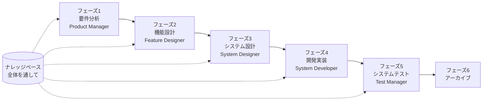

# SpecCrew クイックスタートガイド

<p align="center">
  <a href="./GETTING-STARTED.md">简体中文</a> |
  <a href="./GETTING-STARTED.zh-TW.md">繁體中文</a> |
  <a href="./GETTING-STARTED.en.md">English</a> |
  <a href="./GETTING-STARTED.ko.md">한국어</a> |
  <a href="./GETTING-STARTED.de.md">Deutsch</a> |
  <a href="./GETTING-STARTED.es.md">Español</a> |
  <a href="./GETTING-STARTED.fr.md">Français</a> |
  <a href="./GETTING-STARTED.it.md">Italiano</a> |
  <a href="./GETTING-STARTED.da.md">Dansk</a> |
  <a href="./GETTING-STARTED.ja.md">日本語</a> |
  <a href="./GETTING-STARTED.ar.md">العربية</a>
</p>

このドキュメントは、SpecCrewのエージェントチームを使用して、標準的なエンジニアリングワークフローに従って要件からデリバリーまでの完全な開発を段階的に完了する方法を素早く理解するのに役立ちます。

---

## 1. 事前準備

### SpecCrewのインストール

```bash
npm install -g speccrew
```

### プロジェクトの初期化

```bash
speccrew init --ide qoder
```

サポートされているIDE：`qoder`、`cursor`、`claude`、`codex`

### 初期化後のディレクトリ構造

```
.
├── .qoder/
│   ├── agents/          # エージェント定義ファイル
│   └── skills/          # スキル定義ファイル
├── speccrew-workspace/  # ワークスペース
│   ├── docs/            # 設定、ルール、テンプレート、ソリューション
│   ├── iterations/      # 進行中のイテレーション
│   ├── iteration-archives/  # アーカイブされたイテレーション
│   └── knowledges/      # ナレッジベース
│       ├── base/        # 基本情報（診断レポート、技術的負債）
│       ├── bizs/        # ビジネスナレッジベース
│       └── techs/       # テクニカルナレッジベース
```

### CLIコマンドクイックリファレンス

| コマンド | 説明 |
|------|------|
| `speccrew list` | 利用可能なすべてのエージェントとスキルを一覧表示 |
| `speccrew doctor` | インストールの完全性をチェック |
| `speccrew update` | プロジェクト設定を最新バージョンに更新 |
| `speccrew uninstall` | SpecCrewをアンインストール |

---

## 2. ワークフロー概要

### 完全フロー図



### 核心原則

1. **フェーズ依存関係**：各フェーズの成果物は次のフェーズの入力
2. **チェックポイント確認**：各フェーズに確認ポイントがあり、ユーザー確認後に次のフェーズに進む
3. **ナレッジベース駆動**：ナレッジベースは全体を通して各フェーズにコンテキストを提供

---

## 3. ステップ0：プロジェクト診断とナレッジベース初期化

正式なエンジニアリングフローを開始する前に、プロジェクトナレッジベースを初期化する必要があります。

### 3.1 プロジェクト診断

**会話例**：
```
@speccrew-team-leader プロジェクトを診断
```

**エージェントの動作**：
- プロジェクト構造をスキャン
- テクノロジースタックを検出
- ビジネスモジュールを識別

**成果物**：
```
speccrew-workspace/knowledges/base/diagnosis-reports/diagnosis-report-{date}.md
```

### 3.2 テクニカルナレッジベース初期化

**会話例**：
```
@speccrew-team-leader テクニカルナレッジベースを初期化
```

**3段階フロー**：
1. プラットフォーム検出 — プロジェクト内の技術プラットフォームを識別
2. 技術文書生成 — 各プラットフォームの技術仕様文書を生成
3. インデックス生成 — ナレッジベースインデックスを構築

**成果物**：
```
speccrew-workspace/knowledges/techs/{platform-id}/
├── tech-stack.md          # テクノロジースタック定義
├── architecture.md        # アーキテクチャ規約
├── dev-spec.md            # 開発規約
├── test-spec.md           # テスト規約
└── INDEX.md               # インデックスファイル
```

### 3.3 ビジネスナレッジベース初期化

**会話例**：
```
@speccrew-team-leader ビジネスナレッジベースを初期化
```

**4段階フロー**：
1. 機能リスト — コードをスキャンしてすべての機能を識別
2. 機能分析 — 各機能のビジネスロジックを分析
3. モジュール要約 — モジュール別に機能を要約
4. システム要約 — システムレベルのビジネス概要を生成

**成果物**：
```
speccrew-workspace/knowledges/bizs/
├── {platform-type}/
│   └── {module-name}/
│       └── feature-spec.md
└── system-overview.md
```

---

## 4. フェーズ別会話ガイド

### 4.1 フェーズ1：要件分析（Product Manager）

**起動方法**：
```
@speccrew-product-manager 新しい要件があります：[要件を説明]
```

**エージェントワークフロー**：
1. システム概要を読み込んで既存モジュールを理解
2. ユーザー要件を分析
3. 構造化されたPRD文書を生成

**成果物**：
```
iterations/{シーケンス}-{タイプ}-{名前}/01.product-requirement/
├── [feature-name]-prd.md           # 製品要件文書
└── [feature-name]-bizs-modeling.md # ビジネスモデリング（複雑な要件の場合）
```

**確認ポイント**：
- [ ] 要件の説明がユーザーの意図を正確に反映しているか
- [ ] ビジネスルールが完全か
- [ ] 既存システムとの統合ポイントが明確か
- [ ] 受け入れ基準が測定可能か

---

### 4.2 フェーズ2：機能設計（Feature Designer）

**起動方法**：
```
@speccrew-feature-designer 機能設計を開始
```

**エージェントワークフロー**：
1. 確認済みのPRD文書を自動検出
2. ビジネスナレッジベースをロード
3. 機能設計を生成（UIワイヤーフレーム、インタラクションフロー、データ定義、API契約を含む）
4. 複数のPRDがある場合、タスクワーカーで並列設計

**成果物**：
```
iterations/{iter}/02.feature-design/
└── [feature-name]-feature-spec.md  # 機能設計文書
```

**確認ポイント**：
- [ ] すべてのユーザシナリオがカバーされているか
- [ ] インタラクションフローが明確か
- [ ] データフィールド定義が完全か
- [ ] 例外処理が適切か

---

### 4.3 フェーズ3：システム設計（System Designer）

**起動方法**：
```
@speccrew-system-designer システム設計を開始
```

**エージェントワークフロー**：
1. Feature SpecとAPI契約を検出
2. テクニカルナレッジベース（各エンドのテクノロジースタック、アーキテクチャ、規約）をロード
3. **チェックポイントA**：フレームワーク評価 — 技術ギャップを分析、新しいフレームワークを推奨（必要に応じて）、ユーザー確認を待機
4. DESIGN-OVERVIEW.mdを生成
5. タスクワーカーで各エンド設計を並列ディスパッチ（フロントエンド/バックエンド/モバイル/デスクトップ）
6. **チェックポイントB**：共同確認 — すべてのプラットフォーム設計の要約を表示、ユーザー確認を待機

**成果物**：
```
iterations/{iter}/03.system-design/
├── DESIGN-OVERVIEW.md              # 設計概要
├── {platform-id}/
│   ├── INDEX.md                    # 各プラットフォーム設計インデックス
│   └── {module}-design.md          # 擬似コードレベルモジュール設計
```

**確認ポイント**：
- [ ] 擬似コードが実際のフレームワーク構文を使用しているか
- [ ] クロスエンドAPI契約が一貫しているか
- [ ] エラー処理戦略が統一されているか

---

### 4.4 フェーズ4：開発実装（System Developer）

**起動方法**：
```
@speccrew-system-developer 開発を開始
```

**エージェントワークフロー**：
1. システム設計文書を読み込む
2. 各エンドの技術知識をロード
3. **チェックポイントA**：環境プレチェック — ランタイムバージョン、依存関係、サービス可用性をチェック、失敗時はユーザー解決を待機
4. タスクワーカーで各エンド開発を並列ディスパッチ
5. 統合チェック：API契約の整合性、データ一貫性
6. デリバリレポートを出力

**成果物**：
```
# ソースコードはプロジェクトの実際のソースディレクトリに書き込まれる
iterations/{iter}/04.development/
├── {platform-id}/
│   └── tasks/                      # 開発タスク記録
└── delivery-report.md
```

**確認ポイント**：
- [ ] 環境が準備完了か
- [ ] 統合問題が許容範囲内か
- [ ] コードが開発規約に準拠しているか

---

### 4.5 フェーズ5：システムテスト（Test Manager）

**起動方法**：
```
@speccrew-test-manager テストを開始
```

**3段階テストフロー**：

| フェーズ | 説明 | チェックポイント |
|------|------|------------|
| テストケース設計 | PRDとFeature Specに基づいてテストケースを生成 | A：カバレッジ統計とトレースマトリックスを表示、ユーザー確認を待機 |
| テストコード生成 | 実行可能なテストコードを生成 | B：生成されたテストファイルとケースマッピングを表示、ユーザー確認を待機 |
| テスト実行とバグレポート | テストを自動実行、レポートを生成 | なし（自動実行） |

**成果物**：
```
iterations/{iter}/05.system-test/
├── cases/
│   └── {platform-id}/              # テストケース文書
├── code/
│   └── {platform-id}/              # テストコード計画
├── reports/
│   └── test-report-{date}.md       # テストレポート
└── bugs/
    └── BUG-{id}-{title}.md         # バグレポート（バグごとに1ファイル）
```

**確認ポイント**：
- [ ] ケースカバレッジが完全か
- [ ] テストコードが実行可能か
- [ ] バグの重大度判定が正確か

---

### 4.6 フェーズ6：アーカイブ

イテレーション完了後に自動アーカイブ：

```
speccrew-workspace/iteration-archives/
└── {シーケンス}-{タイプ}-{名前}-{日付}/
    ├── 01.product-requirement/
    ├── 02.feature-design/
    ├── 03.system-design/
    ├── 04.development/
    └── 05.system-test/
```

---

## 5. ナレッジベースの説明

### 5.1 ビジネスナレッジベース（bizs）

**目的**：プロジェクトのビジネス機能の説明、モジュール分割、API特性を保存

**ディレクトリ構造**：
```
knowledges/bizs/
├── {platform-type}/
│   └── {module-name}/
│       └── feature-spec.md
└── system-overview.md
```

**使用シーン**：Product Manager、Feature Designer

### 5.2 テクニカルナレッジベース（techs）

**目的**：プロジェクトのテクノロジースタック、アーキテクチャ規約、開発規約、テスト規約を保存

**ディレクトリ構造**：
```
knowledges/techs/{platform-id}/
├── tech-stack.md
├── architecture.md
├── dev-spec.md
├── test-spec.md
└── INDEX.md
```

**使用シーン**：System Designer、System Developer、Test Manager

---

## 6. よくある質問（FAQ）

### Q1: エージェントが期待通りに動作しない場合は？

1. `speccrew doctor`を実行してインストールの完全性をチェック
2. ナレッジベースが初期化されていることを確認
3. 現在のイテレーションディレクトリに前フェーズの成果物があることを確認

### Q2: フェーズをスキップするには？

**スキップは推奨されません**。各フェーズの成果物は次のフェーズの入力です。

スキップが必須の場合は、対応するフェーズの入力文書を手動で準備し、形式が仕様に準拠していることを確認してください。

### Q3: 複数の要件を並列処理するには？

各要件に独立したイテレーションディレクトリを作成：
```
iterations/
├── 001-feature-xxx/
├── 002-feature-yyy/
└── 003-feature-zzz/
```

各イテレーションは完全に隔離され、相互に影響しません。

### Q4: SpecCrewのバージョンを更新するには？

更新は2つのステップで行います：

```bash
# ステップ1：グローバルCLIツールを更新
npm install -g speccrew@latest

# ステップ2：プロジェクトディレクトリでAgentsとSkillsを同期
cd /path/to/your-project
speccrew update
```

- `npm install -g speccrew@latest`：CLIツール自体を更新（新バージョンには新しいAgent/Skill定義、バグ修正などが含まれる場合があります）
- `speccrew update`：プロジェクトのAgentおよびSkill定義ファイルを最新バージョンに同期
- `speccrew update --ide cursor`：指定したIDEの設定のみを更新

> **注意**：両方のステップを実行する必要があります。`speccrew update`のみを実行してもCLIツール自体は更新されません；`npm install`のみを実行してもプロジェクト内のファイルは更新されません。

### Q5: 過去のイテレーションを表示するには？

アーカイブ後、`speccrew-workspace/iteration-archives/`で表示、`{シーケンス}-{タイプ}-{名前}-{日付}/`形式で整理。

### Q6: ナレッジベースは定期的に更新が必要ですか？

以下の場合は再初期化が必要です：
- プロジェクト構造が大幅に変更
- テクノロジースタックのアップグレードまたは変更
- ビジネスモジュールの追加/削除

---

## 7. クイックリファレンス

### エージェント起動クイックリファレンス表

| フェーズ | エージェント | 起動会話 |
|------|-------|----------|
| 診断 | Team Leader | `@speccrew-team-leader プロジェクトを診断` |
| 初期化 | Team Leader | `@speccrew-team-leader テクニカルナレッジベースを初期化` |
| 要件分析 | Product Manager | `@speccrew-product-manager 新しい要件があります：[説明]` |
| 機能設計 | Feature Designer | `@speccrew-feature-designer 機能設計を開始` |
| システム設計 | System Designer | `@speccrew-system-designer システム設計を開始` |
| 開発実装 | System Developer | `@speccrew-system-developer 開発を開始` |
| システムテスト | Test Manager | `@speccrew-test-manager テストを開始` |

### チェックポイントチェックリスト

| フェーズ | チェックポイント数 | 主要チェック項目 |
|------|-----------------|------------|
| 要件分析 | 1 | 要件の正確性、ビジネスルールの完全性、受け入れ基準の測定可能性 |
| 機能設計 | 1 | シナリオカバレッジ、インタラクションの明確さ、データの完全性、例外処理 |
| システム設計 | 2 | A: フレームワーク評価；B: 擬似コード構文、クロスエンドの一貫性、エラー処理 |
| 開発実装 | 1 | A: 環境準備完了、統合問題、コード規約 |
| システムテスト | 2 | A: ケースカバレッジ；B: テストコードの実行可能性 |

### 成果物パスクイックリファレンス

| フェーズ | 出力ディレクトリ | ファイル形式 |
|------|----------|----------|
| 要件分析 | `iterations/{iter}/01.product-requirement/` | `[name]-prd.md`, `[name]-bizs-modeling.md` |
| 機能設計 | `iterations/{iter}/02.feature-design/` | `[name]-feature-spec.md` |
| システム設計 | `iterations/{iter}/03.system-design/` | `DESIGN-OVERVIEW.md`, `{platform}/INDEX.md`, `{platform}/{module}-design.md` |
| 開発実装 | `iterations/{iter}/04.development/` | ソースコード + `delivery-report.md` |
| システムテスト | `iterations/{iter}/05.system-test/` | `cases/`, `code/`, `reports/`, `bugs/` |
| アーカイブ | `iteration-archives/{iter}-{date}/` | 完全なイテレーションコピー |

---

## 次のステップ

1. `speccrew init --ide qoder`を実行してプロジェクトを初期化
2. ステップ0を実行：プロジェクト診断とナレッジベース初期化
3. ワークフローに従ってフェーズごとに進め、仕様駆動の開発体験を楽しんでください！
