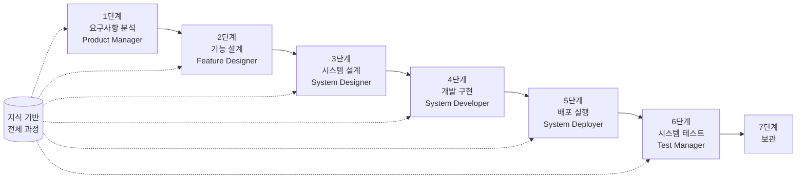

# SpecCrew 빠른 시작 가이드

<p align="center">
  <a href="./GETTING-STARTED.md">简体中文</a> |
  <a href="./GETTING-STARTED.zh-TW.md">繁體中文</a> |
  <a href="./GETTING-STARTED.en.md">English</a> |
  <a href="./GETTING-STARTED.ko.md">한국어</a> |
  <a href="./GETTING-STARTED.de.md">Deutsch</a> |
  <a href="./GETTING-STARTED.es.md">Español</a> |
  <a href="./GETTING-STARTED.fr.md">Français</a> |
  <a href="./GETTING-STARTED.it.md">Italiano</a> |
  <a href="./GETTING-STARTED.da.md">Dansk</a> |
  <a href="./GETTING-STARTED.ja.md">日本語</a> |
  <a href="./GETTING-STARTED.ar.md">العربية</a>
</p>

이 문서는 SpecCrew의 Agent 팀을 사용하여 표준 엔지니어링 프로세스에 따라 요구사항에서 전달까지 전체 개발을 단계별로 완료하는 방법을 빠르게 이해하는 데 도움을 줍니다.

---

## 1. 사전 준비

### SpecCrew 설치

```bash
npm install -g speccrew
```

### 프로젝트 초기화

```bash
speccrew init --ide qoder
```

지원되는 IDE: `qoder`, `cursor`, `claude`, `codex`

### 초기화 후 디렉토리 구조

```
.
├── .qoder/
│   ├── agents/          # Agent 정의 파일
│   └── skills/          # Skill 정의 파일
├── speccrew-workspace/  # 작업 공간
│   ├── docs/            # 구성, 규칙, 템플릿, 솔루션
│   ├── iterations/      # 현재 진행 중인 반복
│   ├── iteration-archives/  # 보관된 반복
│   └── knowledges/      # 지식 기반
│       ├── base/        # 기본 정보 (진단 보고서, 기술 부채)
│       ├── bizs/        # 비즈니스 지식 기반
│       └── techs/       # 기술 지식 기반
```

### CLI 명령 빠른 참조

| 명령 | 설명 |
|------|------|
| `speccrew list` | 사용 가능한 모든 Agent와 Skill 나열 |
| `speccrew doctor` | 설치 무결성 확인 |
| `speccrew update` | 프로젝트 구성을 최신 버전으로 업데이트 |
| `speccrew uninstall` | SpecCrew 제거 |

---

## 2. 설치 후 5분 빠른 시작

`speccrew init` 실행 후, 다음 단계에 따라 빠르게 작업 상태로 진입하세요:

### 1단계: IDE 선택

| IDE | 초기화 명령 | 적용 시나리오 |
|-----|-----------|----------|
| **Qoder** (권장) | `speccrew init --ide qoder` | 전체 Agent 오케스트레이션, 병렬 Worker |
| **Cursor** | `speccrew init --ide cursor` | Composer 기반 워크플로우 |
| **Claude Code** | `speccrew init --ide claude` | CLI 우선 개발 |
| **Codex** | `speccrew init --ide codex` | OpenAI 생태계 통합 |

### 2단계: 지식 기반 초기화 (권장)

기존 소스 코드가 있는 프로젝트의 경우, 먼저 지식 기반을 초기화하여 Agent가 코드베이스를 이해하도록 하는 것을 권장합니다:

```
@speccrew-team-leader 기술 지식 기반 초기화
```

그런 다음:

```
@speccrew-team-leader 비즈니스 지식 기반 초기화
```

### 3단계: 첫 번째 작업 시작

```
@speccrew-product-manager 새 요구사항이 있습니다: [기능 요구사항 설명]
```

> **팁**: 무엇을 해야 할지 불확실한 경우, 그냥 `@speccrew-team-leader 시작을 도와주세요`라고 말하세요 — Team Leader가 자동으로 프로젝트 상태를 감지하고 안내합니다.

---

## 3. 빠른 결정 트리

무엇을 해야 할지 불확신하십니까? 아래에서 시나리오를 찾으세요:

- **새 기능 요구사항이 있습니다**
  → `@speccrew-product-manager 새 요구사항이 있습니다: [기능 요구사항 설명]`

- **기존 프로젝트의 지식을 스캔하고 싶습니다**
  → `@speccrew-team-leader 기술 지식 기반 초기화`
  → 그런 다음: `@speccrew-team-leader 비즈니스 지식 기반 초기화`

- **이전 작업을 계속하고 싶습니다**
  → `@speccrew-team-leader 현재 진행 상황은 무엇입니까?`

- **시스템 건강 상태를 확인하고 싶습니다**
  → 터미널에서 실행: `speccrew doctor`

- **무엇을 해야 할지 모르겠습니다**
  → `@speccrew-team-leader 시작을 도와주세요`
  → Team Leader가 자동으로 프로젝트 상태를 감지하고 안내합니다

---

## 4. Agent 빠른 참조

| 역할 | Agent | 책임 | 명령 예시 |
|------|-------|------|----------|
| 팀 리더 | `@speccrew-team-leader` | 프로젝트 탐색, 지식 기반 초기화, 상태 확인 | "시작을 도와주세요" |
| 제품 관리자 | `@speccrew-product-manager` | 요구사항 분석, PRD 생성 | "새 요구사항이 있습니다: ..." |
| 기능 디자이너 | `@speccrew-feature-designer` | 기능 분석, 사양 설계, API 계약 | "반복 X의 기능 설계 시작" |
| 시스템 디자이너 | `@speccrew-system-designer` | 아키텍처 설계, 플랫폼 상세 설계 | "반복 X의 시스템 설계 시작" |
| 시스템 개발자 | `@speccrew-system-developer` | 개발 조정, 코드 생성 | "반복 X의 개발 시작" |
| 테스트 관리자 | `@speccrew-test-manager` | 테스트 계획, 케이스 설계, 실행 | "반복 X의 테스트 시작" |

> **참고**: 모든 Agent를 기억할 필요가 없습니다. `@speccrew-team-leader`와 대화하기만 하면 적절한 Agent로 요청을 라우팅합니다.

---

## 5. 워크플로우 개요

### 전체 흐름도



### 핵심 원칙

1. **단계 의존성**: 각 단계의 산출물은 다음 단계의 입력
2. **체크포인트 확인**: 각 단계에는 확인점이 있으며, 사용자가 확인한 후에야 다음 단계로 진행 가능
3. **지식 기반 주도**: 지식 기반이 전체 과정을 관통하며 각 단계에 컨텍스트 제공

---

## 6. 0단계: 지식 기반 초기화

정식 엔지니어링 프로세스를 시작하기 전에 프로젝트 지식 기반을 초기화해야 합니다.

### 6.1 기술 지식 기반 초기화

**대화 예시**:
```
@speccrew-team-leader 기술 지식 기반 초기화
```

**3단계 프로세스**:
1. 플랫폼 감지 — 프로젝트의 기술 플랫폼 식별
2. 기술 문서 생성 — 각 플랫폼의 기술 사양 문서 생성
3. 인덱스 생성 — 지식 기반 인덱스 구축

**산출물**:
```
speccrew-workspace/knowledges/techs/{platform-id}/
├── tech-stack.md          # 기술 스택 정의
├── architecture.md        # 아키텍처 규칙
├── dev-spec.md            # 개발 규약
├── test-spec.md           # 테스트 규약
└── INDEX.md               # 인덱스 파일
```

### 6.2 비즈니스 지식 기반 초기화

**대화 예시**:
```
@speccrew-team-leader 비즈니스 지식 기반 초기화
```

**4단계 프로세스**:
1. 기능 목록 — 코드 스캔하여 모든 기능 특성 식별
2. 기능 분석 — 각 기능의 비즈니스 로직 분석
3. 모듈 요약 — 모듈별 기능汇总
4. 시스템 요약 — 시스템 레벨 비즈니스 개요 생성

**산출물**:
```
speccrew-workspace/knowledges/bizs/
├── {platform-type}/
│   └── {module-name}/
│       └── feature-spec.md
└── system-overview.md
```

---

## 7. 단계별 대화 가이드

### 7.1 1단계: 요구사항 분석 (Product Manager)

**시작 방법**:
```
@speccrew-product-manager 새 요구사항이 있습니다: [요구사항 설명]
```

**Agent 워크플로우**:
1. 시스템 개요 읽기하여 기존 모듈 이해
2. 사용자 요구사항 분석
3. 구조화된 PRD 문서 생성

**산출물**:
```
iterations/{번호}-{유형}-{이름}/01.product-requirement/
├── [feature-name]-prd.md           # 제품 요구사항 문서
└── [feature-name]-bizs-modeling.md # 비즈니스 모델링 (복잡한 요구사항 시)
```

**확인 체크리스트**:
- [ ] 요구사항 설명이 사용자 의도를 정확하게 반영하는가
- [ ] 비즈니스 규칙이 완전한가
- [ ] 기존 시스템과의 통합점이 명확한가
- [ ] 수용 기준이 측정 가능한가

---

### 7.2 2단계: 기능 설계 (Feature Designer)

**시작 방법**:
```
@speccrew-feature-designer 기능 설계 시작
```

**Agent 워크플로우**:
1. 확인된 PRD 문서 자동 위치
2. 비즈니스 지식 기반 로드
3. 기능 설계 생성 (UI 와이어프레임, 상호작용 흐름, 데이터 정의, API 계약 포함)
4. 여러 PRD인 경우 Task Worker를 통해 병렬 설계

**산출물**:
```
iterations/{iter}/02.feature-design/
└── [feature-name]-feature-spec.md  # 기능 설계 문서
```

**확인 체크리스트**:
- [ ] 모든 사용자 시나리오가 커버되는가
- [ ] 상호작용 흐름이 명확한가
- [ ] 데이터 필드 정의가 완전한가
- [ ] 예외 처리가完善的인가

---

### 7.3 3단계: 시스템 설계 (System Designer)

**시작 방법**:
```
@speccrew-system-designer 시스템 설계 시작
```

**Agent 워크플로우**:
1. Feature Spec과 API Contract 위치
2. 기술 지식 기반 로드 (각 플랫폼 기술 스택, 아키텍처, 규약)
3. **체크포인트 A**: 프레임워크 평가 — 기술 격차 분석, 새 프레임워크 권장 (필요 시), 사용자 확인 대기
4. DESIGN-OVERVIEW.md 생성
5. Task Worker를 통해 각 플랫폼 설계 병렬 분배 (프론트엔드/백엔드/모바일/데스크톱)
6. **체크포인트 B**: 공동 확인 — 모든 플랫폼 설계 요약 표시, 사용자 확인 대기

**산출물**:
```
iterations/{iter}/03.system-design/
├── DESIGN-OVERVIEW.md              # 설계 개요
├── {platform-id}/
│   ├── INDEX.md                    # 각 플랫폼 설계 인덱스
│   └── {module}-design.md          # 의사코드 레벨 모듈 설계
```

**확인 체크리스트**:
- [ ] 의사코드가 실제 프레임워크 구문을 사용하는가
- [ ] 크로스플랫폼 API 계약이 일관되는가
- [ ] 오류 처리 전략이 통일되는가

---

### 7.4 4단계: 개발 구현 (System Developer)

**시작 방법**:
```
@speccrew-system-developer 개발 시작
```

**Agent 워크플로우**:
1. 시스템 설계 문서 읽기
2. 각 플랫폼 기술 지식 로드
3. **체크포인트 A**: 환경 사전 검사 — 런타임 버전, 종속성, 서비스 가용성 확인, 실패 시 사용자 해결 대기
4. Task Worker를 통해 각 플랫폼 개발 병렬 분배
5. 통합 검사: API 계약 정렬, 데이터 일관성
6. 납품 보고서 출력

**산출물**:
```
# 소스 코드는 프로젝트 실제 소스 디렉토리에 기록됨
iterations/{iter}/04.development/
├── {platform-id}/
│   └── tasks/                      # 개발 작업 기록
└── delivery-report.md
```

**확인 체크리스트**:
- [ ] 환경이 준비되었는가
- [ ] 통합 문제가 허용 범위 내인가
- [ ] 코드가 개발 규약을 준수하는가

---

### 7.5 5단계: 배포 실행 (System Deployer)

**시작 방법**:

```
@speccrew-system-deployer 배포 시작
```

**Agent 워크플로우**:
1. 개발 단계 완료 검증 (Stage Gate)
2. 기술 지식 기반 로드 (빌드 구성, 데이터베이스 마이그레이션 구성, 서비스 시작 명령)
3. **체크포인트**: 환경 사전 검사 — 빌드 도구, 런타임 버전, 종속성 가용성 검증
4. 순차적으로 배포 스킬 실행: 빌드(Build) → 데이터베이스 마이그레이션(Migrate) → 서비스 시작(Startup) → 스모크 테스트(Smoke Test)
5. 배포 보고서 출력

> 💡 **팁**: 데이터베이스가 없는 프로젝트의 경우 마이그레이션 단계는 자동으로 건너뜁니다. 클라이언트 애플리케이션(데스크톱/모바일)의 경우 HTTP 헬스 체크 대신 프로세스 검증 모드를 사용합니다.

**산출물**:

```
iterations/{iter}/05.deployment/
├── {platform-id}/
│   ├── deployment-plan.md          # 배포 계획
│   └── deployment-log.md           # 배포 실행 로그
└── deployment-report.md            # 배포 완료 보고서
```

**확인 체크리스트**:
- [ ] 빌드가 정상적으로 완료되었는가
- [ ] 데이터베이스 마이그레이션 스크립트가 모두 정상 실행되었는가 (해당하는 경우)
- [ ] 애플리케이션이 정상적으로 시작되고 헬스 체크를 통과했는가
- [ ] 스모크 테스트가 모두 통과했는가

---

### 7.6 6단계: 시스템 테스트 (Test Manager)

**시작 방법**:
```
@speccrew-test-manager 테스트 시작
```

**3단계 테스트 프로세스**:

| 단계 | 설명 | 체크포인트 |
|------|------|------------|
| 테스트 케이스 설계 | PRD와 Feature Spec 기반 테스트 케이스 생성 | A: 케이스 커버리지 통계와 추적 가능성 매트릭스 표시, 사용자가 커버리지 충분 확인 대기 |
| 테스트 코드 생성 | 실행 가능한 테스트 코드 생성 | B: 생성된 테스트 파일과 케이스 매핑 표시, 사용자 확인 대기 |
| 테스트 실행 및 버그 보고서 | 테스트 자동 실행, 보고서 생성 | 없음 (자동 실행) |

**산출물**:
```
iterations/{iter}/06.system-test/
├── cases/
│   └── {platform-id}/              # 테스트 케이스 문서
├── code/
│   └── {platform-id}/              # 테스트 코드 계획
├── reports/
│   └── test-report-{date}.md       # 테스트 보고서
└── bugs/
    └── BUG-{id}-{title}.md         # 버그 보고서 (버그당 하나의 파일)
```

**확인 체크리스트**:
- [ ] 케이스 커버리지가 완전한가
- [ ] 테스트 코드가 실행 가능한가
- [ ] 버그 심각도 판정이 정확한가

---

### 7.7 7단계: 보관

반복 완료 후 자동 보관:

```
speccrew-workspace/iteration-archives/
└── {번호}-{유형}-{이름}-{날짜}/
    ├── 01.product-requirement/
    ├── 02.feature-design/
    ├── 03.system-design/
    ├── 04.development/
    ├── 05.deployment/
    └── 06.system-test/
```

---

## 8. 지식 기반 개요

### 8.1 비즈니스 지식 기반 (bizs)

**목적**: 프로젝트 비즈니스 기능 설명, 모듈 분할, API 특성 저장

**디렉토리 구조**:
```
knowledges/bizs/
├── {platform-type}/
│   └── {module-name}/
│       └── feature-spec.md
└── system-overview.md
```

**사용 시나리오**: Product Manager, Feature Designer

### 8.2 기술 지식 기반 (techs)

**목적**: 프로젝트 기술 스택, 아키텍처 규칙, 개발 규약, 테스트 규약 저장

**디렉토리 구조**:
```
knowledges/techs/{platform-id}/
├── tech-stack.md
├── architecture.md
├── dev-spec.md
├── test-spec.md
└── INDEX.md
```

**사용 시나리오**: System Designer, System Developer, Test Manager

---

## 9. 파이프라인 진행 관리

SpecCrew 가상 팀은 엄격한 단계 게이트 메커니즘을 따르며, 각 단계는 사용자 확인 후에야 다음 단계로 진행할 수 있습니다. 또한 재개 실행을 지원합니다 — 중단 후 재시작 시 자동으로 마지막으로 중지한 위치에서 계속합니다.

### 9.1 3계층 진행 파일

워크플로우는 반복 디렉토리에 위치한 세 가지 유형의 JSON 진행 파일을 자동으로 유지 관리합니다:

| 파일 | 위치 | 목적 |
|------|------|------|
| `WORKFLOW-PROGRESS.json` | `iterations/{iter}/` | 파이프라인 각 단계 상태 기록 |
| `.checkpoints.json` | 각 단계 디렉토리 하위 | 사용자 확인점(Checkpoint) 통과 상태 기록 |
| `DISPATCH-PROGRESS.json` | 각 단계 디렉토리 하위 | 병렬 작업(다중 플랫폼/다중 모듈)의 항목별 진행 기록 |

### 9.2 단계 상태 흐름

각 단계는 다음 상태 흐름을 따릅니다:

```
pending → in_progress → completed → confirmed
```

- **pending**: 아직 시작되지 않음
- **in_progress**: 실행 중
- **completed**: Agent 실행 완료, 사용자 확인 대기
- **confirmed**: 사용자가 최종 Checkpoint 확인, 다음 단계 시작 가능

### 9.3 재개 실행

단계의 Agent를 다시 시작할 때:

1. **상류 자동 검사**: 이전 단계가 confirmed인지 검증, 미확인 시 차단 및 프롬프트
2. **Checkpoint 복구**: `.checkpoints.json` 읽기, 통과한 확인점 건너뛰고 마지막으로 중단된 곳에서 계속
3. **병렬 작업 복구**: `DISPATCH-PROGRESS.json` 읽기, `pending` 또는 `failed` 상태 작업만 다시 실행, `completed` 작업 건너뛰기

### 9.4 현재 진행 보기

Team Leader Agent를 통해 파이프라인 파노라마 상태 보기:

```
@speccrew-team-leader 현재 반복 진행 보기
```

Team Leader는 진행 파일을 읽고 다음과 유사한 상태 개요를 표시합니다:

```
Pipeline Status: i001-user-management
  01 PRD:            ✅ Confirmed
  02 Feature Design: 🔄 In Progress (Checkpoint A passed)
  03 System Design:  ⏳ Pending
  04 Development:    ⏳ Pending
  05 Deployment:     ⏳ Pending
  06 System Test:    ⏳ Pending
```

### 9.5 하위 호환성

진행 파일 메커니즘은 완전히 하위 호환됩니다 — 진행 파일이 존재하지 않는 경우 (예: 레거시 프로젝트 또는 새 반복), 모든 Agent는 원래 로직에 따라 정상적으로 실행됩니다.

---

## 10. 자주 묻는 질문 (FAQ)

### Q1: Agent가 예상대로 작동하지 않으면 어떻게 합니까?

1. `speccrew doctor` 실행하여 설치 무결성 확인
2. 지식 기반이 초기화되었는지 확인
3. 현재 반복 디렉토리에 이전 단계의 산출물이 있는지 확인

### Q2: 단계를 건너뛰는 방법은?

**건너뛰기 권장 안 함** — 각 단계의 출력은 다음 단계의 입력입니다.

반드시 건너뛰어야 하는 경우, 해당 단계의 입력 문서를 수동으로 준비하고 형식 사양을 준수하는지 확인하세요.

### Q3: 여러 병렬 요구사항을 처리하는 방법은?

각 요구사항에 대해 독립적인 반복 디렉토리 생성:
```
iterations/
├── 001-feature-xxx/
├── 002-feature-yyy/
└── 003-feature-zzz/
```

각 반복은 완전히 격리되어 서로 영향을 주지 않습니다.

### Q4: SpecCrew 버전을 업데이트하는 방법은?

업데이트는 두 단계가 필요합니다:

```bash
# 1단계: 전역 CLI 도구 업데이트
npm install -g speccrew@latest

# 2단계: 프로젝트 디렉토리에서 Agents와 Skills 동기화
cd /path/to/your-project
speccrew update
```

- `npm install -g speccrew@latest`: CLI 도구 자체 업데이트 (새 버전에는 새로운 Agent/Skill 정의, 버그 수정 등이 포함될 수 있음)
- `speccrew update`: 프로젝트의 Agent와 Skill 정의 파일을 최신 버전으로 동기화
- `speccrew update --ide cursor`: 특정 IDE 구성만 업데이트

> **참고**: 두 단계 모두 필요합니다. `speccrew update`만 실행하면 CLI 도구 자체가 업데이트되지 않습니다; `npm install`만 실행하면 프로젝트 파일이 업데이트되지 않습니다.

### Q5: `speccrew update`가 새 버전 사용 가능을 표시하지만 `npm install -g speccrew@latest` 설치 후에도 여전히 구버전입니까?

이는 일반적으로 npm 캐시 문제입니다. 해결 방법:

```bash
# npm 캐시 클리어 후 재설치
npm cache clean --force
npm install -g speccrew@latest

# 버전 검증
npm list -g speccrew
```

그래도 안 되면 특정 버전 번호를 지정하여 설치해 보세요:
```bash
npm install -g speccrew@0.5.6
```

### Q6: 기록 반복을 보는 방법은?

보관 후 `speccrew-workspace/iteration-archives/`에서 보기, `{번호}-{유형}-{이름}-{날짜}/` 형식으로 구성.

### Q7: 지식 기반을 정기적으로 업데이트해야 합니까?

다음 상황에서 재초기화가 필요합니다:
- 프로젝트 구조의 중대한 변경
- 기술 스택 업그레이드 또는 교체
- 비즈니스 모듈 추가/삭제

---

## 11. 빠른 참조

### Agent 시작 빠른 참조

| 단계 | Agent | 시작 대화 |
|-------|-------|-------------------|
| 초기화 | Team Leader | `@speccrew-team-leader 기술 지식 기반 초기화` |
| 요구사항 분석 | Product Manager | `@speccrew-product-manager 새 요구사항이 있습니다: [설명]` |
| 기능 설계 | Feature Designer | `@speccrew-feature-designer 기능 설계 시작` |
| 시스템 설계 | System Designer | `@speccrew-system-designer 시스템 설계 시작` |
| 개발 | System Developer | `@speccrew-system-developer 개발 시작` |
| 배포 | System Deployer | `@speccrew-system-deployer 배포 시작` |
| 시스템 테스트 | Test Manager | `@speccrew-test-manager 테스트 시작` |

### 체크포인트 체크리스트

| 단계 | 체크포인트 수 | 주요 검사 항목 |
|-------|----------------------|-----------------|
| 요구사항 분석 | 1 | 요구사항 정확성, 비즈니스 규칙 완전성, 수용 기준 측정 가능성 |
| 기능 설계 | 1 | 시나리오 커버리지, 상호작용 명확성, 데이터 완전성, 예외 처리 |
| 시스템 설계 | 2 | A: 프레임워크 평가; B: 의사코드 구문, 크로스플랫폼 일관성, 오류 처리 |
| 개발 | 1 | A: 환경 준비, 통합 문제, 코드 규약 |
| 배포 | 1 | 빌드 성공, 마이그레이션 완료, 서비스 시작, 스모크 테스트 통과 |
| 시스템 테스트 | 2 | A: 케이스 커버리지; B: 테스트 코드 실행 가능성 |

### 산출물 경로 빠른 참조

| 단계 | 출력 디렉토리 | 파일 형식 |
|-------|-----------------|-------------|
| 요구사항 분석 | `iterations/{iter}/01.product-requirement/` | `[name]-prd.md`, `[name]-bizs-modeling.md` |
| 기능 설계 | `iterations/{iter}/02.feature-design/` | `[name]-feature-spec.md` |
| 시스템 설계 | `iterations/{iter}/03.system-design/` | `DESIGN-OVERVIEW.md`, `{platform}/INDEX.md`, `{platform}/{module}-design.md` |
| 개발 | `iterations/{iter}/04.development/` | 소스 코드 + `delivery-report.md` |
| 배포 | `iterations/{iter}/05.deployment/` | `deployment-plan.md`, `deployment-log.md`, `deployment-report.md` |
| 시스템 테스트 | `iterations/{iter}/06.system-test/` | `cases/`, `code/`, `reports/`, `bugs/` |
| 보관 | `iteration-archives/{iter}-{date}/` | 전체 반복 복사본 |

---

## 다음 단계

1. `speccrew init --ide qoder` 실행하여 프로젝트 초기화
2. 0단계 실행: 지식 기반 초기화
3. 워크플로우에 따라 단계별로 진행하여 사양 기반 개발 경험을 즐기세요!
