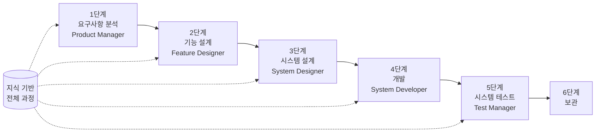

# SpecCrew 빠른 시작 가이드

<p align="center">
  <a href="./GETTING-STARTED.md">简体中文</a> |
  <a href="./GETTING-STARTED.zh-TW.md">繁體中文</a> |
  <a href="./GETTING-STARTED.en.md">English</a> |
  <a href="./GETTING-STARTED.ko.md">한국어</a> |
  <a href="./GETTING-STARTED.de.md">Deutsch</a> |
  <a href="./GETTING-STARTED.es.md">Español</a> |
  <a href="./GETTING-STARTED.fr.md">Français</a> |
  <a href="./GETTING-STARTED.it.md">Italiano</a> |
  <a href="./GETTING-STARTED.da.md">Dansk</a> |
  <a href="./GETTING-STARTED.ja.md">日本語</a> |
  <a href="./GETTING-STARTED.ar.md">العربية</a>
</p>

이 문서는 SpecCrew의 Agent 팀을 사용하여 표준 엔지니어링 프로세스에 따라 요구사항에서 전달까지 전체 개발 주기를 완료하는 방법을 빠르게 이해하는 데 도움을 줍니다.

---

## 1. 사전 준비

### SpecCrew 설치

```bash
npm install -g speccrew
```

### 프로젝트 초기화

```bash
speccrew init --ide qoder
```

지원되는 IDE: `qoder`, `cursor`, `claude`, `codex`

### 초기화 후 디렉토리 구조

```
.
├── .qoder/
│   ├── agents/          # Agent 정의 파일
│   └── skills/          # Skill 정의 파일
├── speccrew-workspace/  # 작업 공간
│   ├── docs/            # 구성, 규칙, 템플릿, 솔루션
│   ├── iterations/      # 현재 진행 중인 반복
│   ├── iteration-archives/  # 보관된 반복
│   └── knowledges/      # 지식 기반
│       ├── base/        # 기본 정보 (진단 보고서, 기술 부채)
│       ├── bizs/        # 비즈니스 지식 기반
│       └── techs/       # 기술 지식 기반
```

### CLI 명령 빠른 참조

| 명령 | 설명 |
|---------|-------------|
| `speccrew list` | 사용 가능한 모든 Agent와 Skill 나열 |
| `speccrew doctor` | 설치 무결성 확인 |
| `speccrew update` | 프로젝트 구성을 최신 버전으로 업데이트 |
| `speccrew uninstall` | SpecCrew 제거 |

---

## 2. 워크플로우 개요

### 전체 흐름도



### 핵심 원칙

1. **단계 의존성**: 각 단계의 산출물은 다음 단계의 입력
2. **체크포인트 확인**: 각 단계에는 다음 단계로 진행하기 전 사용자 승인이 필요한 확인점이 있음
3. **지식 기반 주도**: 지식 기반이 전체 과정에 걸쳐 모든 단계에 컨텍스트 제공

---

## 3. 0단계: 프로젝트 진단 및 지식 기반 초기화

공식 엔지니어링 프로세스를 시작하기 전에 프로젝트 지식 기반을 초기화해야 합니다.

### 3.1 프로젝트 진단

**대화 예시**:
```
@speccrew-team-leader 프로젝트 진단
```

**Agent가 수행할 작업**:
- 프로젝트 구조 스캔
- 기술 스택 감지
- 비즈니스 모듈 식별

**산출물**:
```
speccrew-workspace/knowledges/base/diagnosis-reports/diagnosis-report-{date}.md
```

### 3.2 기술 지식 기반 초기화

**대화 예시**:
```
@speccrew-team-leader 기술 지식 기반 초기화
```

**3단계 프로세스**:
1. 플랫폼 감지 — 프로젝트의 기술 플랫폼 식별
2. 기술 문서 생성 — 각 플랫폼에 대한 기술 명세 문서 생성
3. 인덱스 생성 — 지식 기반 인덱스 구축

**산출물**:
```
speccrew-workspace/knowledges/techs/{platform-id}/
├── tech-stack.md          # 기술 스택 정의
├── architecture.md        # 아키텍처 규약
├── dev-spec.md            # 개발 명세
├── test-spec.md           # 테스트 명세
└── INDEX.md               # 인덱스 파일
```

### 3.3 비즈니스 지식 기반 초기화

**대화 예시**:
```
@speccrew-team-leader 비즈니스 지식 기반 초기화
```

**4단계 프로세스**:
1. 기능 목록 — 코드를 스캔하여 모든 기능적 특성 식별
2. 기능 분석 — 각 기능의 비즈니스 로직 분석
3. 모듈 요약 — 모듈별로 기능 요약
4. 시스템 요약 — 시스템 수준의 비즈니스 개요 생성

**산출물**:
```
speccrew-workspace/knowledges/bizs/
├── {platform-type}/
│   └── {module-name}/
│       └── feature-spec.md
└── system-overview.md
```

---

## 4. 단계별 대화 가이드

### 4.1 1단계: 요구사항 분석 (Product Manager)

**시작 방법**:
```
@speccrew-product-manager 새로운 요구사항이 있습니다: [요구사항 설명]
```

**Agent 워크플로우**:
1. 시스템 개요를 읽고 기존 모듈 이해
2. 사용자 요구사항 분석
3. 구조화된 PRD 문서 생성

**산출물**:
```
iterations/{번호}-{유형}-{이름}/01.product-requirement/
├── [feature-name]-prd.md           # 제품 요구사항 문서
└── [feature-name]-bizs-modeling.md # 비즈니스 모델링 (복잡한 요구사항용)
```

**확인 체크리스트**:
- [ ] 요구사항 설명이 사용자 의도를 정확히 반영하는가?
- [ ] 비즈니스 규칙이 완전한가?
- [ ] 기존 시스템과의 통합 지점이 명확한가?
- [ ] 수용 기준이 측정 가능한가?

---

### 4.2 2단계: 기능 설계 (Feature Designer)

**시작 방법**:
```
@speccrew-feature-designer 기능 설계 시작
```

**Agent 워크플로우**:
1. 확인된 PRD 문서 자동 찾기
2. 비즈니스 지식 기반 로드
3. 기능 설계 생성 (UI 와이어프레임, 상호작용 흐름, 데이터 정의, API 계약 포함)
4. 여러 PRD의 경우 Task Worker를 사용한 병렬 설계

**산출물**:
```
iterations/{iter}/02.feature-design/
└── [feature-name]-feature-spec.md  # 기능 설계 문서
```

**확인 체크리스트**:
- [ ] 모든 사용자 시나리오가 커버되었는가?
- [ ] 상호작용 흐름이 명확한가?
- [ ] 데이터 필드 정의가 완전한가?
- [ ] 예외 처리가 포괄적인가?

---

### 4.3 3단계: 시스템 설계 (System Designer)

**시작 방법**:
```
@speccrew-system-designer 시스템 설계 시작
```

**Agent 워크플로우**:
1. Feature Spec과 API Contract 찾기
2. 기술 지식 기반 로드 (각 플랫폼의 기술 스택, 아키텍처, 명세)
3. **체크포인트 A**: 프레임워크 평가 — 기술 격차 분석, 새 프레임워크 권장 (필요한 경우), 사용자 확인 대기
4. DESIGN-OVERVIEW.md 생성
5. Task Worker를 사용하여 각 플랫폼별 설계 병렬 디스패치 (프론트엔드/백엔드/모바일/데스크톱)
6. **체크포인트 B**: 공동 확인 — 모든 플랫폼 설계 요약 표시, 사용자 확인 대기

**산출물**:
```
iterations/{iter}/03.system-design/
├── DESIGN-OVERVIEW.md              # 설계 개요
├── {platform-id}/
│   ├── INDEX.md                    # 플랫폼 설계 인덱스
│   └── {module}-design.md          # 의사코드 수준 모듈 설계
```

**확인 체크리스트**:
- [ ] 의사코드가 실제 프레임워크 문법을 사용하는가?
- [ ] 크로스 플랫폼 API 계약이 일관적인가?
- [ ] 오류 처리 전략이 통일되었는가?

---

### 4.4 4단계: 개발 구현 (System Developer)

**시작 방법**:
```
@speccrew-system-developer 개발 시작
```

**Agent 워크플로우**:
1. 시스템 설계 문서 읽기
2. 각 플랫폼의 기술 지식 로드
3. **체크포인트 A**: 환경 사전 점검 — 런타임 버전, 의존성, 서비스 가용성 확인; 실패 시 사용자 해결 대기
4. Task Worker를 사용하여 각 플랫폼별 개발 병렬 디스패치
5. 통합 확인: API 계약 정렬, 데이터 일관성
6. 전달 보고서 출력

**산출물**:
```
# 소스 코드는 실제 프로젝트 소스 디렉토리에 기록
iterations/{iter}/04.development/
├── {platform-id}/
│   └── tasks/                      # 개발 작업 기록
└── delivery-report.md
```

**확인 체크리스트**:
- [ ] 환경이 준비되었는가?
- [ ] 통합 문제가 수용 가능한 범위 내인가?
- [ ] 코드가 개발 명세를 준수하는가?

---

### 4.5 5단계: 시스템 테스트 (Test Manager)

**시작 방법**:
```
@speccrew-test-manager 테스트 시작
```

**3단계 테스트 프로세스**:

| 단계 | 설명 | 체크포인트 |
|-------|-------------|------------|
| 테스트 케이스 설계 | PRD와 Feature Spec을 기반으로 테스트 케이스 생성 | A: 케이스 커버리지 통계 및 추적 매트릭스 표시, 충분한 커버리지에 대한 사용자 확인 대기 |
| 테스트 코드 생성 | 실행 가능한 테스트 코드 생성 | B: 생성된 테스트 파일 및 케이스 매핑 표시, 사용자 확인 대기 |
| 테스트 실행 및 버그 보고 | 자동으로 테스트 실행 및 보고서 생성 | 없음 (자동 실행) |

**산출물**:
```
iterations/{iter}/05.system-test/
├── cases/
│   └── {platform-id}/              # 테스트 케이스 문서
├── code/
│   └── {platform-id}/              # 테스트 코드 계획
├── reports/
│   └── test-report-{date}.md       # 테스트 보고서
└── bugs/
    └── BUG-{id}-{title}.md         # 버그 보고서 (버그당 하나의 파일)
```

**확인 체크리스트**:
- [ ] 케이스 커버리지가 완전한가?
- [ ] 테스트 코드가 실행 가능한가?
- [ ] 버그 심각도 평가가 정확한가?

---

### 4.6 6단계: 보관

반복은 완료 시 자동으로 보관됩니다:

```
speccrew-workspace/iteration-archives/
└── {번호}-{유형}-{이름}-{날짜}/
    ├── 01.product-requirement/
    ├── 02.feature-design/
    ├── 03.system-design/
    ├── 04.development/
    └── 05.system-test/
```

---

## 5. 지식 기반 개요

### 5.1 비즈니스 지식 기반 (bizs)

**목적**: 프로젝트 비즈니스 기능 설명, 모듈 구분, API 특성 저장

**디렉토리 구조**:
```
knowledges/bizs/
├── {platform-type}/
│   └── {module-name}/
│       └── feature-spec.md
└── system-overview.md
```

**사용 시나리오**: Product Manager, Feature Designer

### 5.2 기술 지식 기반 (techs)

**목적**: 프로젝트 기술 스택, 아키텍처 규약, 개발 명세, 테스트 명세 저장

**디렉토리 구조**:
```
knowledges/techs/{platform-id}/
├── tech-stack.md
├── architecture.md
├── dev-spec.md
├── test-spec.md
└── INDEX.md
```

**사용 시나리오**: System Designer, System Developer, Test Manager

---

## 6. 자주 묻는 질문 (FAQ)

### Q1: Agent가 예상대로 작동하지 않으면 어떻게 하나요?

1. `speccrew doctor`를 실행하여 설치 무결성 확인
2. 지식 기반이 초기화되었는지 확인
3. 현재 반복 디렉토리에 이전 단계의 산출물이 있는지 확인

### Q2: 단계를 건너뛰려면 어떻게 하나요?

**권장하지 않음** — 각 단계의 출력은 다음 단계의 입력입니다.

반드시 건너뛰어야 한다면 해당 단계의 입력 문서를 수동으로 준비하고 형식 명세를 준수하는지 확인하세요.

### Q3: 여러 병렬 요구사항을 처리하려면 어떻게 하나요?

각 요구사항에 대한 독립적인 반복 디렉토리를 생성:
```
iterations/
├── 001-feature-xxx/
├── 002-feature-yyy/
└── 003-feature-zzz/
```

각 반복은 완전히 격리되어 서로 영향을 주지 않습니다.

### Q4: SpecCrew 버전을 업데이트하려면 어떻게 하나요?

- **전역 업데이트**: `npm update -g speccrew`
- **프로젝트 업데이트**: 프로젝트 디렉토리에서 `speccrew update` 실행

### Q5: 과거 반복을 보려면 어떻게 하나요?

보관 후 `speccrew-workspace/iteration-archives/`에서 `{번호}-{유형}-{이름}-{날짜}/` 형식으로 확인할 수 있습니다.

### Q6: 지식 기반을 정기적으로 업데이트해야 하나요?

다음 상황에서 재초기화가 필요합니다:
- 프로젝트 구조의 주요 변경
- 기술 스택 업그레이드 또는 교체
- 비즈니스 모듈 추가/제거

---

## 7. 빠른 참조

### Agent 시작 빠른 참조

| 단계 | Agent | 시작 대화 |
|-------|-------|-------------------|
| 진단 | Team Leader | `@speccrew-team-leader 프로젝트 진단` |
| 초기화 | Team Leader | `@speccrew-team-leader 기술 지식 기반 초기화` |
| 요구사항 분석 | Product Manager | `@speccrew-product-manager 새로운 요구사항이 있습니다: [설명]` |
| 기능 설계 | Feature Designer | `@speccrew-feature-designer 기능 설계 시작` |
| 시스템 설계 | System Designer | `@speccrew-system-designer 시스템 설계 시작` |
| 개발 | System Developer | `@speccrew-system-developer 개발 시작` |
| 시스템 테스트 | Test Manager | `@speccrew-test-manager 테스트 시작` |

### 체크포인트 체크리스트

| 단계 | 체크포인트 수 | 주요 확인 항목 |
|-------|----------------------|-----------------|
| 요구사항 분석 | 1 | 요구사항 정확성, 비즈니스 규칙 완전성, 수용 기준 측정 가능성 |
| 기능 설계 | 1 | 시나리오 커버리지, 상호작용 명확성, 데이터 완전성, 예외 처리 |
| 시스템 설계 | 2 | A: 프레임워크 평가; B: 의사코드 문법, 크로스 플랫폼 일관성, 오류 처리 |
| 개발 | 1 | A: 환경 준비, 통합 문제, 코드 명세 |
| 시스템 테스트 | 2 | A: 케이스 커버리지; B: 테스트 코드 실행 가능성 |

### 산출물 경로 빠른 참조

| 단계 | 출력 디렉토리 | 파일 형식 |
|-------|-----------------|-------------|
| 요구사항 분석 | `iterations/{iter}/01.product-requirement/` | `[name]-prd.md`, `[name]-bizs-modeling.md` |
| 기능 설계 | `iterations/{iter}/02.feature-design/` | `[name]-feature-spec.md` |
| 시스템 설계 | `iterations/{iter}/03.system-design/` | `DESIGN-OVERVIEW.md`, `{platform}/INDEX.md`, `{platform}/{module}-design.md` |
| 개발 | `iterations/{iter}/04.development/` | 소스 코드 + `delivery-report.md` |
| 시스템 테스트 | `iterations/{iter}/05.system-test/` | `cases/`, `code/`, `reports/`, `bugs/` |
| 보관 | `iteration-archives/{iter}-{date}/` | 완전한 반복 복사본 |

---

## 다음 단계

1. `speccrew init --ide qoder`를 실행하여 프로젝트 초기화
2. 0단계 실행: 프로젝트 진단 및 지식 기반 초기화
3. 워크플로우에 따라 각 단계를 진행하며 명세 기반 개발 경험을 즐기세요!
