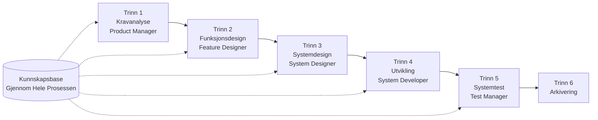

# SpecCrew Rask Start Guide

<p align="center">
  <a href="./GETTING-STARTED.md">简体中文</a> |
  <a href="./GETTING-STARTED.zh-TW.md">繁體中文</a> |
  <a href="./GETTING-STARTED.en.md">English</a> |
  <a href="./GETTING-STARTED.ko.md">한국어</a> |
  <a href="./GETTING-STARTED.de.md">Deutsch</a> |
  <a href="./GETTING-STARTED.es.md">Español</a> |
  <a href="./GETTING-STARTED.fr.md">Français</a> |
  <a href="./GETTING-STARTED.it.md">Italiano</a> |
  <a href="./GETTING-STARTED.da.md">Dansk</a> |
  <a href="./GETTING-STARTED.ja.md">日本語</a> |
  <a href="./GETTING-STARTED.ar.md">العربية</a>
</p>

Dette dokumentet hjelper deg med raskt å forstå hvordan du bruker SpecCrews Agent-team for å fullføre den komplette utviklingen fra krav til levering etter standard engineering-prosesser.

---

## 1. Forutsetninger

### Installer SpecCrew

```bash
npm install -g speccrew
```

### Initialiser Prosjekt

```bash
speccrew init --ide qoder
```

Støttede IDEer: `qoder`, `cursor`, `claude`, `codex`

### Katalogstruktur Etter Initialisering

```
.
├── .qoder/
│   ├── agents/          # Agent definisjonsfiler
│   └── skills/          # Skill definisjonsfiler
├── speccrew-workspace/  # Workspace
│   ├── docs/            # Konfigurasjoner, regler, maler, løsninger
│   ├── iterations/      # Nåværende kjørende iterasjoner
│   ├── iteration-archives/  # Arkiverte iterasjoner
│   └── knowledges/      # Kunnskapsbase
│       ├── base/        # Basisinformasjon (diagnoserapporter, teknisk gjeld)
│       ├── bizs/        # Forretningskunnskapsbase
│       └── techs/       # Teknisk kunnskapsbase
```

### CLI Kommando Rask Referanse

| Kommando | Beskrivelse |
|------|------|
| `speccrew list` | List alle tilgjengelige Agenter og Skills |
| `speccrew doctor` | Sjekk installasjonsintegritet |
| `speccrew update` | Oppdater prosjektkonfigurasjon til nyeste versjon |
| `speccrew uninstall` | Avinstaller SpecCrew |

---

## 2. Rask Start på 5 Minutter Etter Installasjon

Etter kjøring av `speccrew init`, følg disse trinnene for raskt å komme i arbeidstilstand:

### Trinn 1: Velg Din IDE

| IDE | Initialiseringskommando | Anvendelsesscenario |
|-----|-----------|----------|
| **Qoder** (Anbefalt) | `speccrew init --ide qoder` | Full agent-orkestrering, parallelle workers |
| **Cursor** | `speccrew init --ide cursor` | Composer-baserte arbeidsflyter |
| **Claude Code** | `speccrew init --ide claude` | CLI-først utvikling |
| **Codex** | `speccrew init --ide codex` | OpenAI økosystemintegrasjon |

### Trinn 2: Initialiser Kunnskapsbase (Anbefalt)

For prosjekter med eksisterende kildekode anbefales det å initialisere kunnskapsbasen først, slik at agenter forstår din kodebase:

```
@speccrew-team-leader initialiser teknisk kunnskapsbase
```

Deretter:

```
@speccrew-team-leader initialiser forretningskunnskapsbase
```

### Trinn 3: Start Din Første Oppgave

```
@speccrew-product-manager Jeg har et nytt krav: [beskriv ditt funksjonskrav]
```

> **Tips**: Hvis du er usikker på hva du skal gjøre, si bare `@speccrew-team-leader hjelp meg med å komme i gang` — Team Leader vil automatisk oppdage prosjektstatusen din og veilede deg.

---

## 3. Raskt Beslutningstre

Usikker på hva du skal gjøre? Finn scenarioet ditt nedenfor:

- **Jeg har et nytt funksjonskrav**
  → `@speccrew-product-manager Jeg har et nytt krav: [beskriv ditt funksjonskrav]`

- **Jeg vil skanne eksisterende prosjektviten**
  → `@speccrew-team-leader initialiser teknisk kunnskapsbase`
  → Deretter: `@speccrew-team-leader initialiser forretningskunnskapsbase`

- **Jeg vil fortsette tidligere arbeid**
  → `@speccrew-team-leader hva er den nåværende fremgangen?`

- **Jeg vil sjekke systemets helsetilstand**
  → Kjør i terminal: `speccrew doctor`

- **Jeg er usikker på hva jeg skal gjøre**
  → `@speccrew-team-leader hjelp meg med å komme i gang`
  → Team Leader vil automatisk oppdage prosjektstatusen din og veilede deg

---

## 4. Agent Rask Referanse

| Rolle | Agent | Ansvarsområder | Kommandoeksempel |
|------|-------|-----------------|-----------------|
| Teamleder | `@speccrew-team-leader` | Prosjektnavigasjon, kunnskapsbaseinitialisering, statuskontroll | "Hjelp meg med å komme i gang" |
| Produktleder | `@speccrew-product-manager` | Kravanalyse, PRD-generering | "Jeg har et nytt krav: ..." |
| Funksjonsdesigner | `@speccrew-feature-designer` | Funksjonsanalyse, spesifikasjonsdesign, API-kontrakter | "Start funksjonsdesign for iterasjon X" |
| Systemdesigner | `@speccrew-system-designer` | Arkitekturdesign, plattformdetaljert design | "Start systemdesign for iterasjon X" |
| Systemutvikler | `@speccrew-system-developer` | Utviklingskoordinering, kodegenerering | "Start utvikling for iterasjon X" |
| Testleder | `@speccrew-test-manager` | Testplanlegging, casestudier, utførelse | "Start test for iterasjon X" |

> **Merk**: Du trenger ikke huske alle agenter. Bare snakk med `@speccrew-team-leader`, og den vil rute forespørselen din til riktig agent.

---

## 5. Arbeidsflyt Oversikt

### Komplett Flytdiagram



### Kjerneprinsipper

1. **Trinnavhengigheter**: Hvert trinns resultat er input til neste trinn
2. **Checkpoint-bekreftelse**: Hvert trinn har et bekreftelsespunkt som krever brukergodkjenning før fortsettelse til neste trinn
3. **Kunnskapsbase-drevet**: Kunnskapsbasen kjører gjennom hele prosessen og gir kontekst for alle trinn

---

## 6. Trinn Null: Kunnskapsbaseinitialisering

Før du starter den formelle engineering-prosessen, må du initialisere prosjektets kunnskapsbase.

### 6.1 Teknisk Kunnskapsbaseinitialisering

**Samtaleeksempel**:
```
@speccrew-team-leader initialiser teknisk kunnskapsbase
```

**Tre-fase prosess**:
1. Plattformdeteksjon — Identifiser tekniske plattformer i prosjektet
2. Teknisk dokumentgenerering — Generer tekniske spesifikasjonsdokumenter for hver plattform
3. Indeksgenerering — Etabler kunnskapsbaseindeks

**Resultat**:
```
speccrew-workspace/knowledges/techs/{platform-id}/
├── tech-stack.md          # Teknologi-stack-definisjon
├── architecture.md        # Arkitekturkonvensjoner
├── dev-spec.md            # Utviklingsspesifikasjoner
├── test-spec.md           # Testspesifikasjoner
└── INDEX.md               # Indeksf