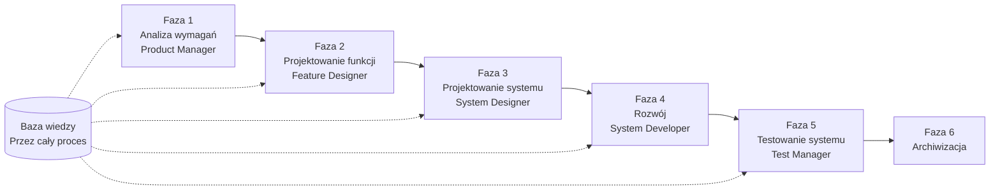

# SpecCrew - Przewodnik Szybkiego Startu

<p align="center">
  <a href="./GETTING-STARTED.md">简体中文</a> |
  <a href="./GETTING-STARTED.zh-TW.md">繁體中文</a> |
  <a href="./GETTING-STARTED.en.md">English</a> |
  <a href="./GETTING-STARTED.ko.md">한국어</a> |
  <a href="./GETTING-STARTED.de.md">Deutsch</a> |
  <a href="./GETTING-STARTED.es.md">Español</a> |
  <a href="./GETTING-STARTED.fr.md">Français</a> |
  <a href="./GETTING-STARTED.it.md">Italiano</a> |
  <a href="./GETTING-STARTED.da.md">Dansk</a> |
  <a href="./GETTING-STARTED.ja.md">日本語</a> |
  <a href="./GETTING-STARTED.ar.md">العربية</a> |
  <a href="./GETTING-STARTED.pl.md">Polski</a>
</p>

Ten dokument pomaga szybko zrozumieć, jak korzystać z zespołu Agentów SpecCrew, aby ukończyć pełny cykl rozwoju od wymagań do dostarczenia, zgodnie ze standardowymi procesami inżynieryjnymi.

---

## 1. Wymagania wstępne

### Instalacja SpecCrew

```bash
npm install -g speccrew
```

### Inicjalizacja projektu

```bash
speccrew init --ide qoder
```

Obsługiwane IDE: `qoder`, `cursor`, `claude`, `codex`

### Struktura katalogów po inicjalizacji

```
.
├── .qoder/
│   ├── agents/          # Pliki definicji Agentów
│   └── skills/          # Pliki definicji Umiejętności
├── speccrew-workspace/  # Przestrzeń robocza
│   ├── docs/            # Konfiguracje, zasady, szablony, rozwiązania
│   ├── iterations/      # Bieżące iteracje
│   ├── iteration-archives/  # Zarchiwizowane iteracje
│   └── knowledges/      # Baza wiedzy
│       ├── base/        # Podstawowe informacje (raporty diagnostyczne, długi techniczne)
│       ├── bizs/        # Baza wiedzy biznesowej
│       └── techs/       # Baza wiedzy technicznej
```

### Podręczna lista poleceń CLI

| Polecenie | Opis |
|---------|-------------|
| `speccrew list` | Lista wszystkich dostępnych Agentów i Umiejętności |
| `speccrew doctor` | Sprawdź integralność instalacji |
| `speccrew update` | Aktualizuj konfigurację projektu do najnowszej wersji |
| `speccrew uninstall` | Odinstaluj SpecCrew |

---

## 2. Przegląd przepływu pracy

### Pełny diagram przepływu



### Podstawowe zasady

1. **Zależności faz**: Wynik każdej fazy jest wejściem dla następnej fazy
2. **Potwierdzenie punktu kontrolnego**: Każda faza ma punkt potwierdzenia wymagający zatwierdzenia użytkownika przed przejściem dalej
3. **Sterowanie bazą wiedzy**: Baza wiedzy przechodzi przez cały proces, zapewniając kontekst dla wszystkich faz

---

## 3. Krok zerowy: Inicjalizacja bazy wiedzy

Przed rozpoczęciem formalnego procesu inżynieryjnego musisz zainicjować bazę wiedzy projektu.

### 3.1 Inicjalizacja bazy wiedzy technicznej

**Przykład rozmowy**:
```
@speccrew-team-leader zainicjuj bazę wiedzy technicznej
```

**Trzyetapowy proces**:
1. Wykrywanie platformy — Identyfikacja platform technologicznych w projekcie
2. Generowanie dokumentacji technicznej — Generowanie dokumentów specyfikacji technicznej dla każdej platformy
3. Generowanie indeksu — Ustanowienie indeksu bazy wiedzy

**Dostarczalny**:
```
speccrew-workspace/knowledges/techs/{platform-id}/
├── tech-stack.md          # Definicja stosu technologicznego
├── architecture.md        # Konwencje architektoniczne
├── dev-spec.md            # Specyfikacje rozwoju
├── test-spec.md           # Specyfikacje testów
└── INDEX.md               # Plik indeksu
```

### 3.2 Inicjalizacja bazy wiedzy biznesowej

**Przykład rozmowy**:
```
@speccrew-team-leader zainicjuj bazę wiedzy biznesowej
```

**Czteroetapowy proces**:
1. Inwentaryzacja funkcji — Skanowanie kodu w celu identyfikacji wszystkich funkcji
2. Analiza funkcji — Analiza logiki biznesowej każdej funkcji
3. Podsumowanie modułu — Podsumowanie funkcji według modułów
4. Podsumowanie systemu — Generowanie przeglądu biznesowego na poziomie systemu

**Dostarczalny**:
```
speccrew-workspace/knowledges/bizs/
├── {platform-type}/
│   └── {module-name}/
│       └── feature-spec.md
└── system-overview.md
```

---

## 4. Przewodnik rozmowy faza po fazie

### 4.1 Faza 1: Analiza wymagań (Product Manager)

**Jak zacząć**:
```
@speccrew-product-manager mam nowe wymaganie: [opisz swoje wymaganie]
```

**Przepływ pracy Agenta**:
1. Przeczytaj przegląd systemu, aby zrozumieć istniejące moduły
2. Analizuj wymagania użytkownika
3. Generuj ustrukturyzowany dokument PRD

**Dostarczalny**:
```
iterations/{numer}-{typ}-{nazwa}/01.product-requirement/
├── [feature-name]-prd.md           # Dokument wymagań produktu
└── [feature-name]-bizs-modeling.md # Modelowanie biznesowe (dla złożonych wymagań)
```

**Lista kontrolna potwierdzenia**:
- [ ] Czy opis wymagania dokładnie odzwierciedla intencję użytkownika?
- [ ] Czy reguły biznesowe są kompletne?
- [ ] Czy punkty integracji z istniejącymi systemami są jasne?
- [ ] Czy kryteria akceptacji są mierzalne?

---

### 4.2 Faza 2: Projektowanie funkcji (Feature Designer)

**Jak zacząć**:
```
@speccrew-feature-designer rozpocznij projektowanie funkcji
```

**Przepływ pracy Agenta**:
1. Automatycznie zlokalizuj potwierdzony dokument PRD
2. Załaduj bazę wiedzy biznesowej
3. Generuj projektowanie funkcji (w tym wireframes UI, przepływy interakcji, definicje danych, kontrakty API)
4. Dla wielu PRD użyj Task Worker do równoległego projektowania

**Dostarczalny**:
```
iterations/{iter}/02.feature-design/
└── [feature-name]-feature-spec.md  # Dokument projektowania funkcji
```

**Lista kontrolna potwierdzenia**:
- [ ] Czy wszystkie scenariusze użytkownika są objęte?
- [ ] Czy przepływy interakcji są jasne?
- [ ] Czy definicje pól danych są kompletne?
- [ ] Czy obsługa wyjątków jest wszechstronna?

---

### 4.3 Faza 3: Projektowanie systemu (System Designer)

**Jak zacząć**:
```
@speccrew-system-designer rozpocznij projektowanie systemu
```

**Przepływ pracy Agenta**:
1. Zlokalizuj Feature Spec i API Contract
2. Załaduj bazę wiedzy technicznej (stos technologiczny, architektura, specyfikacje dla każdej platformy)
3. **Punkt kontrolny A**: Ocena frameworka — Analiza luk technicznych, rekomendacja nowych frameworków (jeśli potrzeba), oczekiwanie na potwierdzenie użytkownika
4. Generuj DESIGN-OVERVIEW.md
5. Użyj Task Worker do równoległego wysyłania projektowania dla każdej platformy (frontend/backend/mobile/desktop)
6. **Punkt kontrolny B**: Wspólne potwierdzenie — Pokaż podsumowanie wszystkich projektów platform, oczekiwanie na potwierdzenie użytkownika

**Dostarczalny**:
```
iterations/{iter}/03.system-design/
├── DESIGN-OVERVIEW.md              # Przegląd projektu
├── {platform-id}/
│   ├── INDEX.md                    # Indeks projektu platformy
│   └── {module}-design.md          # Projektowanie modułu na poziomie pseudokodu
```

**Lista kontrolna potwierdzenia**:
- [ ] Czy pseudokod używa rzeczywistej składni frameworka?
- [ ] Czy kontrakty API między platformami są spójne?
- [ ] Czy strategia obsługi błędów jest ujednolicona?

---

### 4.4 Faza 4: Implementacja rozwoju (System Developer)

**Jak zacząć**:
```
@speccrew-system-developer rozpocznij rozwój
```

**Przepływ pracy Agenta**:
1. Przeczytaj dokumenty projektowania systemu
2. Załaduj wiedzę techniczną dla każdej platformy
3. **Punkt kontrolny A**: Wstępna weryfikacja środowiska — Weryfikacja wersji runtime, zależności, dostępności usług; jeśli nie powiedzie się, oczekiwanie na rozwiązanie użytkownika
4. Użyj Task Worker do równoległego wysyłania rozwoju dla każdej platformy
5. Weryfikacja integracji: Wyrównanie kontraktów API, spójność danych
6. Wygeneruj raport dostawy

**Dostarczalny**:
```
# Kod źródłowy zapisany w rzeczywistym katalogu kodu źródłowego projektu
iterations/{iter}/04.development/
├── {platform-id}/
│   └── tasks/                      # Rekordy zadań rozwoju
└── delivery-report.md
```

**Lista kontrolna potwierdzenia**:
- [ ] Czy środowisko jest gotowe?
- [ ] Czy problemy integracji są w akceptowalnym zakresie?
- [ ] Czy kod jest zgodny ze specyfikacjami rozwoju?

---

### 4.5 Faza 5: Testowanie systemu (Test Manager)

**Jak zacząć**:
```
@speccrew-test-manager rozpocznij testowanie
```

**Trzyetapowy proces testowania**:

| Faza | Opis | Punkt kontrolny |
|------|------|-------------------|
| Projektowanie przypadków testowych | Generowanie przypadków testowych na podstawie PRD i Feature Spec | A: Pokaż statystyki pokrycia przypadków i macierz śledzenia, oczekiwanie na potwierdzenie użytkownika wystarczającego pokrycia |
| Generowanie kodu testowego | Generowanie wykonywalnego kodu testowego | B: Pokaż wygenerowane pliki testowe i mapowanie przypadków, oczekiwanie na potwierdzenie użytkownika |
| Wykonanie testu i raport błędów | Automatyczne wykonanie testów i generowanie raportów | Brak (wykonanie automatyczne) |

**Dostarczalny**:
```
iterations/{iter}/05.system-test/
├── cases/
│   └── {platform-id}/              # Dokumenty przypadków testowych
├── code/
│   └── {platform-id}/              # Plan kodu testowego
├── reports/
│   └── test-report-{date}.md       # Raport testu
└── bugs/
    └── BUG-{id}-{title}.md         # Raporty błędów (jeden plik na błąd)
```

**Lista kontrolna potwierdzenia**:
- [ ] Czy pokrycie przypadków jest kompletne?
- [ ] Czy kod testowy jest wykonywalny?
- [ ] Czy ocena ważności błędów jest dokładna?

---

### 4.6 Faza 6: Archiwizacja

Iteracje są automatycznie archiwizowane po ukończeniu:

```
speccrew-workspace/iteration-archives/
└── {numer}-{typ}-{nazwa}-{data}/
    ├── 01.product-requirement/
    ├── 02.feature-design/
    ├── 03.system-design/
    ├── 04.development/
    └── 05.system-test/
```

---

## 5. Przegląd bazy wiedzy

### 5.1 Baza wiedzy biznesowej (bizs)

**Cel**: Przechowywanie opisów funkcji biznesowych projektu, podziałów modułów, charakterystyk API

**Struktura katalogów**:
```
knowledges/bizs/
├── {platform-type}/
│   └── {module-name}/
│       └── feature-spec.md
└── system-overview.md
```

**Scenariusze użycia**: Product Manager, Feature Designer

### 5.2 Baza wiedzy technicznej (techs)

**Cel**: Przechowywanie stosu technologicznego projektu, konwencji architektonicznych, specyfikacji rozwoju, specyfikacji testów

**Struktura katalogów**:
```
knowledges/techs/{platform-id}/
├── tech-stack.md
├── architecture.md
├── dev-spec.md
├── test-spec.md
└── INDEX.md
```

**Scenariusze użycia**: System Designer, System Developer, Test Manager

---

## 6. Zarządzanie Postępem Przepływu Pracy

Wirtualny zespół SpecCrew stosuje ścisły mechanizm bramek fazowych, gdzie każda faza musi zostać potwierdzona przez użytkownika przed przejściem do następnej. Obsługuje również wznawialne wykonywanie — po ponownym uruchomieniu po przerwaniu, automatycznie kontynuuje od miejsca przerwania.

### 6.1 Trójwarstwowe Pliki Postępu

Przepływ pracy automatycznie utrzymuje trzy typy plików postępu JSON, zlokalizowanych w katalogu iteracji:

| Plik | Lokalizacja | Cel |
|------|----------|---------|
| `WORKFLOW-PROGRESS.json` | `iterations/{iter}/` | Rejestruje status każdego etapu pipeline |
| `.checkpoints.json` | Pod każdym katalogiem fazy | Rejestruje status potwierdzenia punktów kontrolnych użytkownika |
| `DISPATCH-PROGRESS.json` | Pod każdym katalogiem fazy | Rejestruje postęp punkt po punkcie dla zadań równoległych (wieloplatformowych/wielomodułowych) |

### 6.2 Przebieg Statusu Fazy

Każda faza podąża za tym przebiegiem statusu:

```
pending → in_progress → completed → confirmed
```

- **pending**: Jeszcze nie rozpoczęte
- **in_progress**: Obecnie wykonywane
- **completed**: Wykonanie Agenta zakończone, oczekiwanie na potwierdzenie użytkownika
- **confirmed**: Użytkownik potwierdził przez końcowy punkt kontrolny, następna faza może się rozpocząć

### 6.3 Wznawialne Wykonywanie

Podczas ponownego uruchamiania Agenta dla fazy:

1. **Automatyczna kontrola upstream**: Weryfikuje czy poprzednia faza jest potwierdzona, blokuje i informuje jeśli nie
2. **Odzyskiwanie punktów kontrolnych**: Odczytuje `.checkpoints.json`, pomija przekroczone punkty kontrolne, kontynuuje od ostatniego punktu przerwania
3. **Odzyskiwanie zadań równoległych**: Odczytuje `DISPATCH-PROGRESS.json`, ponownie wykonuje tylko zadania ze statusem `pending` lub `failed`, pomija zadania `completed`

### 6.4 Wyświetlanie Bieżącego Postępu

Wyświetl status panoramy pipeline przez Agenta Team Leader:

```
@speccrew-team-leader wyświetl bieżący postęp iteracji
```

Team Leader odczyta pliki postępu i wyświetli podsumowanie statusu podobne do:

```
Pipeline Status: i001-user-management
  01 PRD:            ✅ Potwierdzone
  02 Feature Design: 🔄 W toku (Punkt kontrolny A przekroczony)
  03 System Design:  ⏳ Oczekujące
  04 Development:    ⏳ Oczekujące
  05 System Test:    ⏳ Oczekujące
```

### 6.5 Wsteczna Kompatybilność

Mechanizm plików postępu jest w pełni wstecznie kompatybilny — jeśli pliki postępu nie istnieją (np. w starszych projektach lub nowych iteracjach), wszyscy Agenci będą wykonywać normalnie zgodnie z oryginalną logiką.

---

## 7. Często zadawane pytania (FAQ)

### P1: Co zrobić, jeśli Agent nie działa zgodnie z oczekiwaniami?

1. Uruchom `speccrew doctor`, aby sprawdzić integralność instalacji
2. Potwierdź, że baza wiedzy została zainicjowana
3. Potwierdź, że dostarczalny poprzedniej fazy istnieje w bieżącym katalogu iteracji

### P2: Jak pominąć fazę?

**Nie zalecane** — Wynik każdej fazy jest wejściem dla następnej fazy.

Jeśli musisz pominąć, ręcznie przygotuj dokument wejściowy odpowiedniej fazy i upewnij się, że jest zgodny ze specyfikacjami formatu.

### P3: Jak obsługiwać wiele równoległych wymagań?

Utwórz niezależne katalogi iteracji dla każdego wymagania:
```
iterations/
├── 001-feature-xxx/
├── 002-feature-yyy/
└── 003-feature-zzz/
```

Każda iteracja jest całkowicie izolowana i nie wpływa na inne.

### P4: Jak zaktualizować wersję SpecCrew?

Aktualizacja wymaga dwóch kroków:

```bash
# Krok 1: Zaktualizuj globalne narzędzie CLI
npm install -g speccrew@latest

# Krok 2: Zsynchronizuj Agentów i Skille w katalogu projektu
cd /path/to/your-project
speccrew update
```

- `npm install -g speccrew@latest`: Aktualizuje samo narzędzie CLI (nowe wersje mogą zawierać nowe definicje Agentów/Skilli, poprawki błędów itp.)
- `speccrew update`: Synchronizuje pliki definicji Agentów i Skilli w projekcie do najnowszej wersji
- `speccrew update --ide cursor`: Aktualizuje konfigurację tylko dla konkretnego IDE

> **Uwaga**: Oba kroki są wymagane. Uruchomienie tylko `speccrew update` nie zaktualizuje samego narzędzia CLI; uruchomienie tylko `npm install` nie zaktualizuje plików projektu.

### P5: `speccrew update` pokazuje nową wersję, ale po instalacji nadal jest stara?

Zazwyczaj jest to spowodowane pamięcią podręczną npm. Rozwiązanie:
```bash
npm cache clean --force
npm install -g speccrew@latest
npm list -g speccrew
```
Jeśli nadal nie działa, zainstaluj określoną wersję:
```bash
npm install -g speccrew@0.5.6
```

### P6: Jak wyświetlić historyczne iteracje?

Po zarchiwizowaniu przejrzyj w `speccrew-workspace/iteration-archives/`, zorganizowane w formacie `{numer}-{typ}-{nazwa}-{data}/`.

### P7: Czy baza wiedzy wymaga regularnej aktualizacji?

Ponowna inicjalizacja jest wymagana w następujących sytuacjach:
- Znaczne zmiany w strukturze projektu
- Aktualizacja lub wymiana stosu technologicznego
- Dodanie/usunięcie modułów biznesowych

---

## 8. Szybka referencja

### Szybka referencja uruchamiania Agentów

| Faza | Agent | Rozmowa początkowa |
|------|-------|-------------------|

| Inicjalizacja | Team Leader | `@speccrew-team-leader zainicjuj bazę wiedzy technicznej` |
| Analiza wymagań | Product Manager | `@speccrew-product-manager mam nowe wymaganie: [opis]` |
| Projektowanie funkcji | Feature Designer | `@speccrew-feature-designer rozpocznij projektowanie funkcji` |
| Projektowanie systemu | System Designer | `@speccrew-system-designer rozpocznij projektowanie systemu` |
| Rozwój | System Developer | `@speccrew-system-developer rozpocznij rozwój` |
| Testowanie systemu | Test Manager | `@speccrew-test-manager rozpocznij testowanie` |

### Lista kontrolna punktów kontrolnych

| Faza | Liczba punktów kontrolnych | Kluczowe elementy weryfikacji |
|------|---------------------------|------------------------------|
| Analiza wymagań | 1 | Dokładność wymagań, kompletność reguł biznesowych, mierzalność kryteriów akceptacji |
| Projektowanie funkcji | 1 | Pokrycie scenariuszy, jasność interakcji, kompletność danych, obsługa wyjątków |
| Projektowanie systemu | 2 | A: Ocena frameworka; B: Składnia pseudokodu, spójność międzyplatformowa, obsługa błędów |
| Rozwój | 1 | A: Gotowość środowiska, problemy integracji, specyfikacje kodu |
| Testowanie systemu | 2 | A: Pokrycie przypadków; B: Wykonywalność kodu testowego |

### Szybka referencja ścieżek dostarczalnych

| Faza | Katalog wyjściowy | Format pliku |
|------|------------------|-------------|
| Analiza wymagań | `iterations/{iter}/01.product-requirement/` | `[name]-prd.md`, `[name]-bizs-modeling.md` |
| Projektowanie funkcji | `iterations/{iter}/02.feature-design/` | `[name]-feature-spec.md` |
| Projektowanie systemu | `iterations/{iter}/03.system-design/` | `DESIGN-OVERVIEW.md`, `{platform}/INDEX.md`, `{platform}/{module}-design.md` |
| Rozwój | `iterations/{iter}/04.development/` | Kod źródłowy + `delivery-report.md` |
| Testowanie systemu | `iterations/{iter}/05.system-test/` | `cases/`, `code/`, `reports/`, `bugs/` |
| Archiwizacja | `iteration-archives/{iter}-{data}/` | Pełna kopia iteracji |

---

## Następne kroki

1. Uruchom `speccrew init --ide qoder`, aby zainicjować swój projekt
2. Wykonaj Krok zerowy: Inicjalizacja bazy wiedzy
3. Przechodź przez każdą fazę zgodnie z przepływem pracy, ciesząc się doświadczeniem rozwoju opartego na specyfikacjach!
