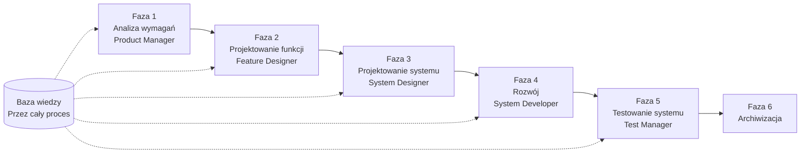

# SpecCrew - Przewodnik Szybkiego Startu

<p align="center">
  <a href="./GETTING-STARTED.md">简体中文</a> |
  <a href="./GETTING-STARTED.zh-TW.md">繁體中文</a> |
  <a href="./GETTING-STARTED.en.md">English</a> |
  <a href="./GETTING-STARTED.ko.md">한국어</a> |
  <a href="./GETTING-STARTED.de.md">Deutsch</a> |
  <a href="./GETTING-STARTED.es.md">Español</a> |
  <a href="./GETTING-STARTED.fr.md">Français</a> |
  <a href="./GETTING-STARTED.it.md">Italiano</a> |
  <a href="./GETTING-STARTED.da.md">Dansk</a> |
  <a href="./GETTING-STARTED.ja.md">日本語</a> |
  <a href="./GETTING-STARTED.ar.md">العربية</a>
</p>

Ten dokument pomaga szybko zrozumieć, jak korzystać z zespołu Agentów SpecCrew do ukończenia kompletnego rozwoju od wymagań do dostarczenia zgodnie ze standardowymi procesami inżynieryjnymi.

---

## 1. Wymagania wstępne

### Instalacja SpecCrew

```bash
npm install -g speccrew
```

### Inicjalizacja projektu

```bash
speccrew init --ide qoder
```

Obsługiwane IDE: `qoder`, `cursor`, `claude`, `codex`

### Struktura katalogów po inicjalizacji

```
.
├── .qoder/
│   ├── agents/          # Pliki definicji Agentów
│   └── skills/          # Pliki definicji Skills
├── speccrew-workspace/  # Przestrzeń robocza
│   ├── docs/            # Konfiguracje, zasady, szablony, rozwiązania
│   ├── iterations/      # Bieżące iteracje
│   ├── iteration-archives/  # Zarchiwizowane iteracje
│   └── knowledges/      # Baza wiedzy
│       ├── base/        # Podstawowe informacje (raporty diagnostyczne, długi techniczne)
│       ├── bizs/        # Baza wiedzy biznesowej
│       └── techs/       # Baza wiedzy technicznej
```

### Szybki podgląd poleceń CLI

| Polecenie | Opis |
|------|------|
| `speccrew list` | Wyświetl wszystkich dostępnych Agentów i Skills |
| `speccrew doctor` | Sprawdź integralność instalacji |
| `speccrew update` | Aktualizuj konfigurację projektu do najnowszej wersji |
| `speccrew uninstall` | Odinstaluj SpecCrew |

---

## 2. Szybki start w 5 minut po instalacji

Po wykonaniu `speccrew init`, postępuj zgodnie z tymi krokami, aby szybko przejść do stanu pracy:

### Krok 1: Wybierz swoje IDE

| IDE | Polecenie inicjalizacji | Scenariusz zastosowania |
|-----|-----------|----------|
| **Qoder** (Zalecane) | `speccrew init --ide qoder` | Pełna orkiestracja agentów, równoległe workery |
| **Cursor** | `speccrew init --ide cursor` | Workflows oparte na Composer |
| **Claude Code** | `speccrew init --ide claude` | Rozwój CLI-first |
| **Codex** | `speccrew init --ide codex` | Integracja ekosystemu OpenAI |

### Krok 2: Inicjalizacja bazy wiedzy (Zalecane)

W przypadku projektów z istniejącym kodem źródłowym zaleca się najpierw zainicjowanie bazy wiedzy, aby agenci zrozumieli Twoją bazę kodu:

```
@speccrew-team-leader zainicjuj techniczną bazę wiedzy
```

Następnie:

```
@speccrew-team-leader zainicjuj biznesową bazę wiedzy
```

### Krok 3: Rozpocznij swoje pierwsze zadanie

```
@speccrew-product-manager Mam nowe wymaganie: [opisz swoje wymaganie funkcjonalne]
```

> **Wskazówka**: Jeśli nie jesteś pewien, co zrobić, po prostu powiedz `@speccrew-team-leader pomóż mi rozpocząć` — Team Leader automatycznie wykryje status projektu i Cię poprowadzi.

---

## 3. Szybkie drzewo decyzyjne

Nie jesteś pewien, co zrobić? Znajdź swój scenariusz poniżej:

- **Mam nowe wymaganie funkcjonalne**
  → `@speccrew-product-manager Mam nowe wymaganie: [opisz swoje wymaganie funkcjonalne]`

- **Chcę zeskanować wiedzę istniejącego projektu**
  → `@speccrew-team-leader zainicjuj techniczną bazę wiedzy`
  → Następnie: `@speccrew-team-leader zainicjuj biznesową bazę wiedzy`

- **Chcę kontynuować poprzednią pracę**
  → `@speccrew-team-leader jaki jest obecny postęp?`

- **Chcę sprawdzić stan zdrowia systemu**
  → Uruchom w terminalu: `speccrew doctor`

- **Nie jestem pewien, co zrobić**
  → `@speccrew-team-leader pomóż mi rozpocząć`
  → Team Leader automatycznie wykryje status projektu i Cię poprowadzi

---

## 4. Szybki podgląd Agentów

| Rola | Agent | Odpowiedzialności | Przykład polecenia |
|------|-------|-----------------|-----------------|
| Lider zespołu | `@speccrew-team-leader` | Nawigacja projektu, inicjalizacja bazy wiedzy, sprawdzanie statusu | "Pomóż mi rozpocząć" |
| Kierownik produktu | `@speccrew-product-manager` | Analiza wymagań, generowanie PRD | "Mam nowe wymaganie: ..." |
| Projektant funkcji | `@speccrew-feature-designer` | Analiza funkcji, projektowanie specyfikacji, kontrakty API | "Rozpocznij projektowanie funkcji dla iteracji X" |
| Projektant systemu | `@speccrew-system-designer` | Projektowanie architektury, szczegółowe projektowanie platformy | "Rozpocznij projektowanie systemu dla iteracji X" |
| Deweloper systemu | `@speccrew-system-developer` | Koordynacja rozwoju, generowanie kodu | "Rozpocznij rozwój dla iteracji X" |
| Kierownik testów | `@speccrew-test-manager` | Planowanie testów, projektowanie przypadków, wykonanie | "Rozpocznij testy dla iteracji X" |

> **Uwaga**: Nie musisz pamiętać wszystkich agentów. Po prostu porozmawiaj z `@speccrew-team-leader`, a on skieruje Twoje żądanie do odpowiedniego agenta.

---

## 5. Przegląd przepływu pracy

### Pełny diagram przepływu



### Podstawowe zasady

1. **Zależności faz**: Wynik każdej fazy jest wejściem dla następnej fazy
2. **Potwierdzenie punktu kontrolnego**: Każda faza ma punkt potwierdzenia wymagający zatwierdzenia użytkownika przed przejściem dalej
3. **Sterowanie bazą wiedzy**: Baza wiedzy przechodzi przez cały proces, zapewniając kontekst dla wszystkich faz

---

## 6. Krok zerowy: Inicjalizacja bazy wiedzy

Przed rozpoczęciem formalnego procesu inżynieryjnego musisz zainicjować bazę wiedzy projektu.

### 6.1 Inicjalizacja technicznej bazy wiedzy

**Przykład rozmowy**:
```
@speccrew-team-leader zainicjuj techniczną bazę wiedzy
```

**Trójfazowy proces**:
1. Wykrywanie platformy — Zidentyfikuj platformy technologiczne w projekcie
2. Generowanie dokumentacji technicznej — Generuj dokumenty specyfikacji technicznej dla każdej platformy
3. Generowanie indeksu — Utwórz indeks bazy wiedzy

**Produkt**:
```
speccrew-workspace/knowledges/techs/{platform-id}/
├── tech-stack.md          # Definicja stosu technologicznego
├── architecture.md        # Konwencje architektoniczne
├── dev-spec.md            # Specyfikacje rozwoju
├── test-spec.md           # Specyfikacje testów
└── INDEX.md               # Plik indeksu
```

### 6.2 Inicjalizacja biznesowej bazy wiedzy

**Przykład rozmowy**:
```
@speccrew-team-leader zainicjuj biznesową bazę wiedzy
```

**Czterofazowy proces**:
1. Inwentaryzacja funkcji — Skanuj kod, aby zidentyfikować wszystkie funkcje
2. Analiza funkcji — Analizuj logikę biznesową dla każdej funkcji
3. Podsumowanie modułu — Podsumuj funkcje według modułu
4. Podsumowanie systemu — Generuj przegląd biznesowy na poziomie systemu

**Produkt**:
```
speccrew-workspace/knowledges/bizs/
├── {platform-type}/
│   └── {module-name}/
│       └── feature-spec.md
└── system-overview.md
```

---

## 7. Przewodnik rozmowy fazowej

### 7.1 Faza 1: Analiza wymagań (Product Manager)

**Jak rozpocząć**:
```
@speccrew-product-manager Mam nowe wymaganie: [opisz swoje wymaganie]
```

**Workflow Agenta**:
1. Przeczytaj przegląd systemu, aby zrozumieć istniejące moduły
2. Analizuj wymagania użytkownika
3. Generuj strukturyzowany dokument PRD

**Produkt**:
```
iterations/{numer}-{typ}-{nazwa}/01.product-requirement/
├── [feature-name]-prd.md           # Dokument wymagań produktu
└── [feature-name]-bizs-modeling.md # Modelowanie biznesowe (dla złożonych wymagań)
```

**Lista kontrolna potwierdzenia**:
- [ ] Czy opis wymagania dokładnie odzwierciedla intencję użytkownika?
- [ ] Czy reguły biznesowe są kompletne?
- [ ] Czy punkty integracji z istniejącymi systemami są jasne?
- [ ] Czy kryteria akceptacji są mierzalne?

---

### 7.2 Faza 2: Projektowanie funkcji (Feature Designer)

**Jak rozpocząć**:
```
@speccrew-feature-designer rozpocznij projektowanie funkcji
```

**Workflow Agenta**:
1. Automatycznie zlokalizuj potwierdzony dokument PRD
2. Załaduj biznesową bazę wiedzy
3. Generuj projekt funkcji (w tym wireframe'y UI, przepływy interakcji, definicje danych, kontrakty API)
4. Dla wielu PRD użyj Task Worker do równoległego projektowania

**Produkt**:
```
iterations/{iter}/02.feature-design/
└── [feature-name]-feature-spec.md  # Dokument projektowania funkcji
```

**Lista kontrolna potwierdzenia**:
- [ ] Czy wszystkie scenariusze użytkownika są objęte?
- [ ] Czy przepływy interakcji są jasne?
- [ ] Czy definicje pól danych są kompletne?
- [ ] Czy obsługa wyjątków jest kompleksowa?

---

### 7.3 Faza 3: Projektowanie systemu (System Designer)

**Jak rozpocząć**:
```
@speccrew-system-designer rozpocznij projektowanie systemu
```

**Workflow Agenta**:
1. Zlokalizuj Feature Spec i API Contract
2. Załaduj techniczną bazę wiedzy (stos technologiczny, architektura, specyfikacje dla każdej platformy)
3. **Checkpoint A**: Ewaluacja frameworka — Analizuj luki techniczne, rekomenduj nowe frameworki (jeśli potrzeba), czekaj na potwierdzenie użytkownika
4. Generuj DESIGN-OVERVIEW.md
5. Użyj Task Worker do równoległego rozprowadzania projektowania dla każdej platformy (frontend/backend/mobile/desktop)
6. **Checkpoint B**: Wspólne potwierdzenie — Wyświetl podsumowanie wszystkich projektów platform, czekaj na potwierdzenie użytkownika

**Produkt**:
```
iterations/{iter}/03.system-design/
├── DESIGN-OVERVIEW.md              # Przegląd projektowania
├── {platform-id}/
│   ├── INDEX.md                    # Indeks projektowania platformy
│   └── {module}-design.md          # Projektowanie modułu na poziomie pseudokodu
```

**Lista kontrolna potwierdzenia**:
- [ ] Czy pseudokod używa rzeczywistej składni frameworka?
- [ ] Czy kontrakty API między platformami są spójne?
- [ ] Czy strategia obsługi błędów jest ujednolicona?

---

### 7.4 Faza 4: Rozwój (System Developer)

**Jak rozpocząć**:
```
@speccrew-system-developer rozpocznij rozwój
```

**Workflow Agenta**:
1. Przeczytaj dokumenty projektowania systemu
2. Załaduj wiedzę techniczną dla każdej platformy
3. **Checkpoint A**: Wstępna kontrola środowiska — Sprawdź wersje runtime, zależności, dostępność usług; czekaj na rozwiązanie użytkownika jeśli nie powiedzie się
4. Użyj Task Worker do równoległego rozprowadzania rozwoju dla każdej platformy
5. Kontrola integracji: wyrównanie kontraktów API, spójność danych
6. Wygeneruj raport dostawy

**Produkt**:
```
# Kod źródłowy zapisywany w rzeczywistym katalogu źródłowym projektu
iterations/{iter}/04.development/
├── {platform-id}/
│   └── tasks/                      # Rejestry zadań rozwoju
└── delivery-report.md
```

**Lista kontrolna potwierdzenia**:
- [ ] Czy środowisko jest gotowe?
- [ ] Czy problemy integracyjne są w akceptowalnym zakresie?
- [ ] Czy kod jest zgodny ze specyfikacjami rozwoju?

---

### 7.5 Faza 5: Testowanie systemu (Test Manager)

**Jak rozpocząć**:
```
@speccrew-test-manager rozpocznij testy
```

**Trójfazowy proces testowania**:

| Faza | Opis | Checkpoint |
|-------|-------------|------------|
| Projektowanie przypadków testowych | Generuj przypadki testowe na podstawie PRD i Feature Spec | A: Wyświetl statystyki pokrycia przypadków i macierz śledzenia, czekaj na potwierdzenie użytkownika wystarczającego pokrycia |
| Generowanie kodu testowego | Generuj wykonywalny kod testowy | B: Wyświetl wygenerowane pliki testowe i mapowanie przypadków, czekaj na potwierdzenie użytkownika |
| Wykonanie testów i raportowanie błędów | Automatycznie wykonuj testy i generuj raporty | Brak (automatyczne wykonanie) |

**Produkt**:
```
iterations/{iter}/05.system-test/
├── cases/
│   └── {platform-id}/              # Dokumenty przypadków testowych
├── code/
│   └── {platform-id}/              # Plan kodu testowego
├── reports/
│   └── test-report-{date}.md       # Raport testu
└── bugs/
    └── BUG-{id}-{title}.md         # Raporty błędów (jeden plik na błąd)
```

**Lista kontrolna potwierdzenia**:
- [ ] Czy pokrycie przypadków jest kompletne?
- [ ] Czy kod testowy jest wykonywalny?
- [ ] Czy ocena poważności błędów jest dokładna?

---

### 7.6 Faza 6: Archiwizacja

Iteracje są automatycznie archiwizowane po ukończeniu:

```
speccrew-workspace/iteration-archives/
└── {numer}-{typ}-{nazwa}-{data}/
    ├── 01.product-requirement/
    ├── 02.feature-design/
    ├── 03.system-design/
    ├── 04.development/
    └── 05.system-test/
```

---

## 8. Przegląd bazy wiedzy

### 8.1 Biznesowa baza wiedzy (bizs)

**Cel**: Przechowuj opisy funkcji biznesowych projektu, podziały modułów, cechy API

**Struktura katalogów**:
```
knowledges/bizs/
├── {platform-type}/
│   └── {module-name}/
│       └── feature-spec.md
└── system-overview.md
```

**Scenariusze użycia**: Product Manager, Feature Designer

### 8.2 Techniczna baza wiedzy (techs)

**Cel**: Przechowuj stos technologiczny projektu, konwencje architektoniczne, specyfikacje rozwoju, specyfikacje testów

**Struktura katalogów**:
```
knowledges/techs/{platform-id}/
├── tech-stack.md
├── architecture.md
├── dev-spec.md
├── test-spec.md
└── INDEX.md
```

**Scenariusze użycia**: System Designer, System Developer, Test Manager

---

## 9. Zarządzanie postępem przepływu pracy

Wirtualny zespół SpecCrew przestrzega ścisłego mechanizmu bramowania etapów, gdzie każda faza musi zostać potwierdzona przez użytkownika przed przejściem do następnej. Obsługuje również wznawialne wykonanie — po ponownym uruchomieniu po przerwaniu automatycznie kontynuuje od miejsca, w którym przerwał.

### 9.1 Trzywarstwowe pliki postępu

Workflow automatycznie utrzymuje trzy typy plików postępu JSON, zlokalizowane w katalogu iteracji:

| Plik | Lokalizacja | Cel |
|------|----------|---------|
| `WORKFLOW-PROGRESS.json` | `iterations/{iter}/` | Rejestruje status każdej fazy pipeline'u |
| `.checkpoints.json` | Pod każdym katalogiem fazy | Rejestruje status potwierdzenia checkpointów użytkownika |
| `DISPATCH-PROGRESS.json` | Pod każdym katalogiem fazy | Rejestruje postęp element po elemencie dla równoległych zadań (multi-platforma/multi-moduł) |

### 9.2 Przepływ statusu fazy

Każda faza następuje po tym przepływie statusu:

```
pending → in_progress → completed → confirmed
```

- **pending**: Jeszcze nie rozpoczęte
- **in_progress**: W trakcie wykonania
- **completed**: Wykonanie agenta zakończone, oczekiwanie na potwierdzenie użytkownika
- **confirmed**: Użytkownik potwierdził przez końcowy checkpoint, następna faza może się rozpocząć

### 9.3 Wznawialne wykonanie

Podczas ponownego uruchamiania Agenta dla fazy:

1. **Automatyczne sprawdzanie upstream**: Weryfikuje czy poprzednia faza jest potwierdzona, blokuje i monituje jeśli nie
2. **Odzyskiwanie Checkpoint**: Odczytuje `.checkpoints.json`, pomija przejście checkpoints, kontynuuje od ostatniego punktu przerwania
3. **Odzyskiwanie równoległych zadań**: Odczytuje `DISPATCH-PROGRESS.json`, ponownie wykonuje tylko zadania ze statusem `pending` lub `failed`, pomija zadania `completed`

### 9.4 Wyświetlanie bieżącego postępu

Wyświetl panoramiczny status pipeline'u przez Agenta Team Leader:

```
@speccrew-team-leader wyświetl bieżący postęp iteracji
```

Team Leader odczyta pliki postępu i wyświetli przegląd statusu podobny do:

```
Pipeline Status: i001-user-management
  01 PRD:            ✅ Confirmed
  02 Feature Design: 🔄 In Progress (Checkpoint A passed)
  03 System Design:  ⏳ Pending
  04 Development:    ⏳ Pending
  05 System Test:    ⏳ Pending
```

### 9.5 Wsteczna kompatybilność

Mechanizm plików postępu jest w pełni wstecznie kompatybilny — jeśli pliki postępu nie istnieją (np. w starszych projektach lub nowych iteracjach), wszyscy Agenci będą wykonywać normalnie zgodnie z oryginalną logiką.

---

## 10. Często zadawane pytania (FAQ)

### P1: Co zrobić jeśli Agent nie działa zgodnie z oczekiwaniami?

1. Uruchom `speccrew doctor` aby sprawdzić integralność instalacji
2. Potwierdź że baza wiedzy została zainicjowana
3. Potwierdź że produkt poprzedniej fazy istnieje w bieżącym katalogu iteracji

### P2: Jak pominąć fazę?

**Nie zalecane** — Wynik każdej fazy jest wejściem dla następnej fazy.

Jeśli musisz pominąć, ręcznie przygotuj dokument wejściowy odpowiedniej fazy i upewnij się, że jest zgodny ze specyfikacjami formatu.

### P3: Jak obsługiwać wiele równoległych wymagań?

Utwórz niezależne katalogi iteracji dla każdego wymagania:
```
iterations/
├── 001-feature-xxx/
├── 002-feature-yyy/
└── 003-feature-zzz/
```

Każda iteracja jest całkowicie izolowana i nie wpływa na inne.

### P4: Jak zaktualizować wersję SpecCrew?

Aktualizacja wymaga dwóch kroków:

```bash
# Krok 1: Zaktualizuj globalne narzędzie CLI
npm install -g speccrew@latest

# Krok 2: Synchronizuj Agents i Skills w katalogu projektu
cd /path/to/your-project
speccrew update
```

- `npm install -g speccrew@latest`: Aktualizuje samo narzędzie CLI (nowe wersje mogą zawierać nowe definicje Agent/Skill, poprawki błędów itp.)
- `speccrew update`: Synchronizuje pliki definicji Agent i Skill w Twoim projekcie do najnowszej wersji
- `speccrew update --ide cursor`: Aktualizuje konfigurację tylko dla określonego IDE

> **Uwaga**: Oba kroki są wymagane. Uruchomienie samego `speccrew update` nie zaktualizuje samego narzędzia CLI; uruchomienie samego `npm install` nie zaktualizuje plików projektu.

### P5: `speccrew update` pokazuje nową wersję dostępną ale `npm install -g speccrew@latest` nadal instaluje starą wersję?

Jest to zwykle spowodowane pamięcią podręczną npm. Rozwiązanie:

```bash
# Wyczyść pamięć podręczną npm i zainstaluj ponownie
npm cache clean --force
npm install -g speccrew@latest

# Zweryfikuj wersję
npm list -g speccrew
```

Jeśli nadal nie działa, spróbuj zainstalować z określonym numerem wersji:
```bash
npm install -g speccrew@0.5.6
```

### P6: Jak wyświetlić historyczne iteracje?

Po archiwizacji wyświetl w `speccrew-workspace/iteration-archives/`, zorganizowane według formatu `{numer}-{typ}-{nazwa}-{data}/`.

### P7: Czy baza wiedzy wymaga regularnych aktualizacji?

Ponowna inicjalizacja jest wymagana w następujących sytuacjach:
- Znaczące zmiany w strukturze projektu
- Aktualizacja lub wymiana stosu technologicznego
- Dodanie/usunięcie modułów biznesowych

---

## 11. Szybki podgląd

### Szybki podgląd uruchamiania Agentów

| Faza | Agent | Rozpocznij rozmowę |
|-------|-------|-------------------|
| Inicjalizacja | Team Leader | `@speccrew-team-leader zainicjuj techniczną bazę wiedzy` |
| Analiza wymagań | Product Manager | `@speccrew-product-manager Mam nowe wymaganie: [opis]` |
| Projektowanie funkcji | Feature Designer | `@speccrew-feature-designer rozpocznij projektowanie funkcji` |
| Projektowanie systemu | System Designer | `@speccrew-system-designer rozpocznij projektowanie systemu` |
| Rozwój | System Developer | `@speccrew-system-developer rozpocznij rozwój` |
| Testowanie systemu | Test Manager | `@speccrew-test-manager rozpocznij testy` |

### Lista kontrolna Checkpointów

| Faza | Liczba Checkpointów | Kluczowe elementy kontrolne |
|-------|----------------------|-----------------|
| Analiza wymagań | 1 | Dokładność wymagań, kompletność reguł biznesowych, mierzalność kryteriów akceptacji |
| Projektowanie funkcji | 1 | Pokrycie scenariuszy, jasność interakcji, kompletność danych, obsługa wyjątków |
| Projektowanie systemu | 2 | A: Ewaluacja frameworka; B: Składnia pseudokodu, spójność między platformami, obsługa błędów |
| Rozwój | 1 | A: Gotowość środowiska, problemy integracyjne, specyfikacje kodu |
| Testowanie systemu | 2 | A: Pokrycie przypadków; B: Wykonywalność kodu testowego |

### Szybki podgląd ścieżek produktów

| Faza | Katalog wyjściowy | Format pliku |
|-------|-----------------|-------------|
| Analiza wymagań | `iterations/{iter}/01.product-requirement/` | `[name]-prd.md`, `[name]-bizs-modeling.md` |
| Projektowanie funkcji | `iterations/{iter}/02.feature-design/` | `[name]-feature-spec.md` |
| Projektowanie systemu | `iterations/{iter}/03.system-design/` | `DESIGN-OVERVIEW.md`, `{platform}/INDEX.md`, `{platform}/{module}-design.md` |
| Rozwój | `iterations/{iter}/04.development/` | Kod źródłowy + `delivery-report.md` |
| Testowanie systemu | `iterations/{iter}/05.system-test/` | `cases/`, `code/`, `reports/`, `bugs/` |
| Archiwizacja | `iteration-archives/{iter}-{date}/` | Kompletna kopia iteracji |

---

## Następne kroki

1. Uruchom `speccrew init --ide qoder` aby zainicjować swój projekt
2. Wykonaj Krok Zerowy: Inicjalizacja bazy wiedzy
3. Postępuj zgodnie z workflowem faza po fazie, ciesz się rozwojem opartym na specyfikacjach!
