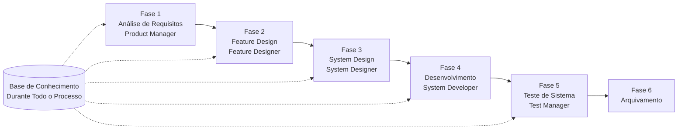

# Guia de Início Rápido do SpecCrew

<p align="center">
  <a href="./GETTING-STARTED.md">简体中文</a> |
  <a href="./GETTING-STARTED.en.md">English</a> |
  <a href="./GETTING-STARTED.ja.md">日本語</a> |
  <a href="./GETTING-STARTED.ru.md">Русский</a> |
  <a href="./GETTING-STARTED.es.md">Español</a> |
  <a href="./GETTING-STARTED.de.md">Deutsch</a> |
  <a href="./GETTING-STARTED.fr.md">Français</a> |
  <a href="./GETTING-STARTED.pt-BR.md">Português (Brasil)</a> |
  <a href="./GETTING-STARTED.ar.md">العربية</a> |
  <a href="./GETTING-STARTED.hi.md">हिन्दी</a>
</p>

Este documento ajuda você a entender rapidamente como usar a equipe de Agentes do SpecCrew para completar o desenvolvimento completo dos requisitos à entrega seguindo processos de engenharia padrão.

---

## 1. Pré-requisitos

### Instalar SpecCrew

```bash
npm install -g speccrew
```

### Inicializar Projeto

```bash
speccrew init --ide qoder
```

IDEs suportados: `qoder`, `cursor`, `claude`, `codex`

### Estrutura de Diretórios Após Inicialização

```
.
├── .qoder/
│   ├── agents/          # Arquivos de definição de Agentes
│   └── skills/          # Arquivos de definição de Skills
├── speccrew-workspace/  # Workspace
│   ├── docs/            # Configurações, regras, templates, soluções
│   ├── iterations/      # Iterações em andamento
│   ├── iteration-archives/  # Iterações arquivadas
│   └── knowledges/      # Base de conhecimento
│       ├── base/        # Informações básicas (relatórios de diagnóstico, dívidas técnicas)
│       ├── bizs/        # Base de conhecimento de negócio
│       └── techs/       # Base de conhecimento técnica
```

### Referência Rápida de Comandos CLI

| Comando | Descrição |
|------|------|
| `speccrew list` | Listar todos os Agentes e Skills disponíveis |
| `speccrew doctor` | Verificar integridade da instalação |
| `speccrew update` | Atualizar configuração do projeto para a versão mais recente |
| `speccrew uninstall` | Desinstalar SpecCrew |

---

## 2. Início Rápido em 5 Minutos Após Instalação

Após executar `speccrew init`, siga estas etapas para entrar rapidamente em estado de trabalho:

### Etapa 1: Escolha Seu IDE

| IDE | Comando de Inicialização | Cenário de Aplicação |
|-----|-----------|----------|
| **Qoder** (Recomendado) | `speccrew init --ide qoder` | Orquestração completa de agentes, workers paralelos |
| **Cursor** | `speccrew init --ide cursor` | Workflows baseados em Composer |
| **Claude Code** | `speccrew init --ide claude` | Desenvolvimento CLI-first |
| **Codex** | `speccrew init --ide codex` | Integração ecossistema OpenAI |

### Etapa 2: Inicializar Base de Conhecimento (Recomendado)

Para projetos com código fonte existente, recomenda-se inicializar primeiro a base de conhecimento para que os agentes compreendam seu codebase:

```
/speccrew-team-leader inicializar base de conhecimento técnica
```

Depois:

```
/speccrew-team-leader inicializar base de conhecimento de negócio
```

### Etapa 3: Comece Sua Primeira Tarefa

```
/speccrew-product-manager Tenho um novo requisito: [descreva seu requisito funcional]
```

> **Dica**: Se não tiver certeza do que fazer, basta dizer `/speccrew-team-leader me ajude a começar` — o Team Leader detectará automaticamente o status do seu projeto e o guiará.

---

## 3. Árvore de Decisão Rápida

Não tem certeza do que fazer? Encontre seu cenário abaixo:

- **Tenho um novo requisito funcional**
  → `/speccrew-product-manager Tenho um novo requisito: [descreva seu requisito funcional]`

- **Quero escanear o conhecimento do projeto existente**
  → `/speccrew-team-leader inicializar base de conhecimento técnica`
  → Depois: `/speccrew-team-leader inicializar base de conhecimento de negócio`

- **Quero continuar o trabalho anterior**
  → `/speccrew-team-leader qual é o progresso atual?`

- **Quero verificar o status de saúde do sistema**
  → Executar no terminal: `speccrew doctor`

- **Não tenho certeza do que fazer**
  → `/speccrew-team-leader me ajude a começar`
  → O Team Leader detectará automaticamente o status do seu projeto e o guiará

---

## 4. Referência Rápida de Agentes

| Função | Agente | Responsabilidades | Exemplo de Comando |
|------|-------|-----------------|-----------------|
| Líder de Equipe | `/speccrew-team-leader` | Navegação do projeto, inicialização da base de conhecimento, verificação de status | "Me ajude a começar" |
| Gerente de Produto | `/speccrew-product-manager` | Análise de requisitos, geração de PRD | "Tenho um novo requisito: ..." |
| Designer de Funcionalidades | `/speccrew-feature-designer` | Análise funcional, design de especificações, contratos API | "Iniciar design de funcionalidades para iteração X" |
| Designer de Sistema | `/speccrew-system-designer` | Design de arquitetura, design detalhado por plataforma | "Iniciar design de sistema para iteração X" |
| Desenvolvedor de Sistema | `/speccrew-system-developer` | Coordenação de desenvolvimento, geração de código | "Iniciar desenvolvimento para iteração X" |
| Gerente de Testes | `/speccrew-test-manager` | Planejamento de testes, design de casos, execução | "Iniciar testes para iteração X" |

> **Nota**: Você não precisa lembrar todos os agentes. Basta conversar com `/speccrew-team-leader` e ele roteará sua solicitação para o agente certo.

---

## 5. Visão Geral do Workflow

### Diagrama de Fluxo Completo



### Princípios Fundamentais

1. **Dependências de Fases**: O entregável de cada fase é a entrada para a próxima fase
2. **Confirmação de Checkpoint**: Cada fase tem um ponto de confirmação que requer aprovação do usuário antes de prosseguir para a próxima fase
3. **Orientado pela Base de Conhecimento**: A base de conhecimento percorre todo o processo, fornecendo contexto para todas as fases

---

## 6. Etapa Zero: Inicialização da Base de Conhecimento

Antes de iniciar o processo formal de engenharia, você precisa inicializar a base de conhecimento do projeto.

### 6.1 Inicialização da Base de Conhecimento Técnica

**Exemplo de Conversa**:
```
/speccrew-team-leader inicializar base de conhecimento técnica
```

**Processo de Três Fases**:
1. Detecção de Plataforma — Identificar plataformas técnicas no projeto
2. Geração de Documentação Técnica — Gerar documentos de especificação técnica para cada plataforma
3. Geração de Índice — Estabelecer índice da base de conhecimento

**Entregável**:
```
speccrew-workspace/knowledges/techs/{platform-id}/
├── tech-stack.md          # Definição do stack tecnológico
├── architecture.md        # Convenções de arquitetura
├── dev-spec.md            # Especificações de desenvolvimento
├── test-spec.md           # Especificações de teste
└── INDEX.md               # Arquivo de índice
```

### 6.2 Inicialização da Base de Conhecimento de Negócio

**Exemplo de Conversa**:
```
/speccrew-team-leader inicializar base de conhecimento de negócio
```

**Processo de Quatro Fases**:
1. Inventário de Funcionalidades — Escanear código para identificar todas as funcionalidades
2. Análise de Funcionalidades — Analisar lógica de negócio para cada funcionalidade
3. Resumo por Módulo — Resumir funcionalidades por módulo
4. Resumo do Sistema — Gerar visão geral de negócio em nível de sistema

**Entregável**:
```
speccrew-workspace/knowledges/bizs/
├── {platform-type}/
│   └── {module-name}/
│       └── feature-spec.md
└── system-overview.md
```

---

[Continuação do documento com as seções 7-11...]
