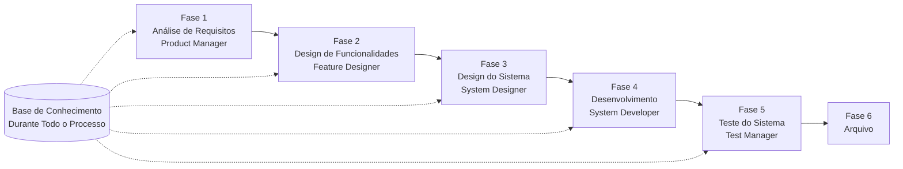

# Guia de Início Rápido do SpecCrew

<p align="center">
  <a href="./GETTING-STARTED.md">简体中文</a> |
  <a href="./GETTING-STARTED.zh-TW.md">繁體中文</a> |
  <a href="./GETTING-STARTED.en.md">English</a> |
  <a href="./GETTING-STARTED.ko.md">한국어</a> |
  <a href="./GETTING-STARTED.de.md">Deutsch</a> |
  <a href="./GETTING-STARTED.es.md">Español</a> |
  <a href="./GETTING-STARTED.fr.md">Français</a> |
  <a href="./GETTING-STARTED.it.md">Italiano</a> |
  <a href="./GETTING-STARTED.da.md">Dansk</a> |
  <a href="./GETTING-STARTED.ja.md">日本語</a> |
  <a href="./GETTING-STARTED.ar.md">العربية</a> |
  <a href="./GETTING-STARTED.pt-BR.md">Português (Brasil)</a>
</p>

Este documento ajuda você a entender rapidamente como usar a equipe de Agentes do SpecCrew para completar o ciclo completo de desenvolvimento desde os requisitos até a entrega, seguindo processos de engenharia padrão.

---

## 1. Pré-requisitos

### Instalar o SpecCrew

```bash
npm install -g speccrew
```

### Inicializar Projeto

```bash
speccrew init --ide qoder
```

IDEs suportados: `qoder`, `cursor`, `claude`, `codex`

### Estrutura de Diretórios Após Inicialização

```
.
├── .qoder/
│   ├── agents/          # Arquivos de definição de Agentes
│   └── skills/          # Arquivos de definição de Skills
├── speccrew-workspace/  # Espaço de trabalho
│   ├── docs/            # Configurações, regras, modelos, soluções
│   ├── iterations/      # Iterações em andamento
│   ├── iteration-archives/  # Iterações arquivadas
│   └── knowledges/      # Base de conhecimento
│       ├── base/        # Informações básicas (relatórios de diagnóstico, dívidas técnicas)
│       ├── bizs/        # Base de conhecimento de negócios
│       └── techs/       # Base de conhecimento técnica
```

### Referência Rápida de Comandos CLI

| Comando | Descrição |
|---------|-------------|
| `speccrew list` | Listar todos os Agentes e Skills disponíveis |
| `speccrew doctor` | Verificar integridade da instalação |
| `speccrew update` | Atualizar configuração do projeto para a versão mais recente |
| `speccrew uninstall` | Desinstalar SpecCrew |

---

## 2. Visão Geral do Fluxo de Trabalho

### Diagrama de Fluxo Completo



### Princípios Fundamentais

1. **Dependências de Fases**: A entrega de cada fase é a entrada para a próxima fase
2. **Confirmação de Checkpoint**: Cada fase tem um ponto de confirmação que requer aprovação do usuário antes de prosseguir
3. **Orientado por Base de Conhecimento**: A base de conhecimento percorre todo o processo, fornecendo contexto para todas as fases

---

## 3. Passo Zero: Inicialização da Base de Conhecimento

Antes de iniciar o processo formal de engenharia, você precisa inicializar a base de conhecimento do projeto.

### 3.1 Inicialização da Base de Conhecimento Técnica

**Exemplo de Conversa**:
```
@speccrew-team-leader inicializar base de conhecimento técnica
```

**Processo de Três Fases**:
1. Detecção de Plataforma — Identificar plataformas tecnológicas no projeto
2. Geração de Documentação Técnica — Gerar documentos de especificação técnica para cada plataforma
3. Geração de Índice — Estabelecer índice da base de conhecimento

**Entregável**:
```
speccrew-workspace/knowledges/techs/{platform-id}/
├── tech-stack.md          # Definição do stack tecnológico
├── architecture.md        # Convenções de arquitetura
├── dev-spec.md            # Especificações de desenvolvimento
├── test-spec.md           # Especificações de teste
└── INDEX.md               # Arquivo de índice
```

### 3.2 Inicialização da Base de Conhecimento de Negócio

**Exemplo de Conversa**:
```
@speccrew-team-leader inicializar base de conhecimento de negócio
```

**Processo de Quatro Fases**:
1. Inventário de Funcionalidades — Escanear código para identificar todas as funcionalidades
2. Análise de Funcionalidades — Analisar lógica de negócio de cada funcionalidade
3. Resumo por Módulo — Resumir funcionalidades por módulo
4. Resumo do Sistema — Gerar visão geral de negócios em nível de sistema

**Entregável**:
```
speccrew-workspace/knowledges/bizs/
├── {platform-type}/
│   └── {module-name}/
│       └── feature-spec.md
└── system-overview.md
```

---

## 4. Guia de Conversa Fase a Fase

### 4.1 Fase 1: Análise de Requisitos (Product Manager)

**Como Iniciar**:
```
@speccrew-product-manager tenho um novo requisito: [descreva seu requisito]
```

**Fluxo de Trabalho do Agente**:
1. Ler visão geral do sistema para entender módulos existentes
2. Analisar requisitos do usuário
3. Gerar documento PRD estruturado

**Entregável**:
```
iterations/{número}-{tipo}-{nome}/01.product-requirement/
├── [feature-name]-prd.md           # Documento de Requisitos do Produto
└── [feature-name]-bizs-modeling.md # Modelagem de negócio (para requisitos complexos)
```

**Lista de Verificação de Confirmação**:
- [ ] A descrição do requisito reflete precisamente a intenção do usuário?
- [ ] As regras de negócio estão completas?
- [ ] Os pontos de integração com sistemas existentes estão claros?
- [ ] Os critérios de aceitação são mensuráveis?

---

### 4.2 Fase 2: Design de Funcionalidades (Feature Designer)

**Como Iniciar**:
```
@speccrew-feature-designer iniciar design de funcionalidades
```

**Fluxo de Trabalho do Agente**:
1. Localizar automaticamente o documento PRD confirmado
2. Carregar base de conhecimento de negócio
3. Gerar design de funcionalidades (incluindo wireframes UI, fluxos de interação, definições de dados, contratos API)
4. Para múltiplos PRDs, usar Task Worker para design paralelo

**Entregável**:
```
iterations/{iter}/02.feature-design/
└── [feature-name]-feature-spec.md  # Documento de design de funcionalidades
```

**Lista de Verificação de Confirmação**:
- [ ] Todos os cenários de usuário estão cobertos?
- [ ] Os fluxos de interação estão claros?
- [ ] As definições de campos de dados estão completas?
- [ ] O tratamento de exceções é abrangente?

---

### 4.3 Fase 3: Design do Sistema (System Designer)

**Como Iniciar**:
```
@speccrew-system-designer iniciar design do sistema
```

**Fluxo de Trabalho do Agente**:
1. Localizar Feature Spec e API Contract
2. Carregar base de conhecimento técnica (stack tecnológico, arquitetura, especificações para cada plataforma)
3. **Checkpoint A**: Avaliação de Framework — Analisar lacunas técnicas, recomendar novos frameworks (se necessário), aguardar confirmação do usuário
4. Gerar DESIGN-OVERVIEW.md
5. Usar Task Worker para despacho paralelo de design para cada plataforma (frontend/backend/móvel/desktop)
6. **Checkpoint B**: Confirmação Conjunta — Mostrar resumo de todos os designs de plataforma, aguardar confirmação do usuário

**Entregável**:
```
iterations/{iter}/03.system-design/
├── DESIGN-OVERVIEW.md              # Visão geral do design
├── {platform-id}/
│   ├── INDEX.md                    # Índice de design de plataforma
│   └── {module}-design.md          # Design de módulo em nível de pseudocódigo
```

**Lista de Verificação de Confirmação**:
- [ ] O pseudocódigo usa sintaxe de framework real?
- [ ] Os contratos API multiplataforma são consistentes?
- [ ] A estratégia de tratamento de erros é unificada?

---

### 4.4 Fase 4: Implementação de Desenvolvimento (System Developer)

**Como Iniciar**:
```
@speccrew-system-developer iniciar desenvolvimento
```

**Fluxo de Trabalho do Agente**:
1. Ler documentos de design do sistema
2. Carregar conhecimento técnico para cada plataforma
3. **Checkpoint A**: Pré-verificação de Ambiente — Verificar versões de runtime, dependências, disponibilidade de serviços; aguardar resolução do usuário se falhar
4. Usar Task Worker para despacho paralelo de desenvolvimento para cada plataforma
5. Verificação de integração: Alinhamento de contratos API, consistência de dados
6. Gerar relatório de entrega

**Entregável**:
```
# Código fonte escrito no diretório de código fonte real do projeto
iterations/{iter}/04.development/
├── {platform-id}/
│   └── tasks/                      # Registros de tarefas de desenvolvimento
└── delivery-report.md
```

**Lista de Verificação de Confirmação**:
- [ ] O ambiente está pronto?
- [ ] Os problemas de integração estão dentro do range aceitável?
- [ ] O código está em conformidade com as especificações de desenvolvimento?

---

### 4.5 Fase 5: Teste do Sistema (Test Manager)

**Como Iniciar**:
```
@speccrew-test-manager iniciar teste
```

**Processo de Teste de Três Fases**:

| Fase | Descrição | Checkpoint |
|------|-----------|------------|
| Design de Casos de Teste | Gerar casos de teste baseados em PRD e Feature Spec | A: Mostrar estatísticas de cobertura de casos e matriz de rastreabilidade, aguardar confirmação do usuário de cobertura suficiente |
| Geração de Código de Teste | Gerar código de teste executável | B: Mostrar arquivos de teste gerados e mapeamento de casos, aguardar confirmação do usuário |
| Execução de Teste e Relatório de Bugs | Executar testes automaticamente e gerar relatórios | Nenhum (execução automática) |

**Entregável**:
```
iterations/{iter}/05.system-test/
├── cases/
│   └── {platform-id}/              # Documentos de casos de teste
├── code/
│   └── {platform-id}/              # Plano de código de teste
├── reports/
│   └── test-report-{date}.md       # Relatório de teste
└── bugs/
    └── BUG-{id}-{title}.md         # Relatórios de bugs (um arquivo por bug)
```

**Lista de Verificação de Confirmação**:
- [ ] A cobertura de casos está completa?
- [ ] O código de teste é executável?
- [ ] A avaliação de severidade de bugs é precisa?

---

### 4.6 Fase 6: Arquivo

Iterações são arquivadas automaticamente ao serem concluídas:

```
speccrew-workspace/iteration-archives/
└── {número}-{tipo}-{nome}-{data}/
    ├── 01.product-requirement/
    ├── 02.feature-design/
    ├── 03.system-design/
    ├── 04.development/
    └── 05.system-test/
```

---

## 5. Visão Geral da Base de Conhecimento

### 5.1 Base de Conhecimento de Negócio (bizs)

**Propósito**: Armazenar descrições de funções de negócio do projeto, divisões de módulos, características API

**Estrutura de Diretórios**:
```
knowledges/bizs/
├── {platform-type}/
│   └── {module-name}/
│       └── feature-spec.md
└── system-overview.md
```

**Cenários de Uso**: Product Manager, Feature Designer

### 5.2 Base de Conhecimento Técnica (techs)

**Propósito**: Armazenar stack tecnológico do projeto, convenções de arquitetura, especificações de desenvolvimento, especificações de teste

**Estrutura de Diretórios**:
```
knowledges/techs/{platform-id}/
├── tech-stack.md
├── architecture.md
├── dev-spec.md
├── test-spec.md
└── INDEX.md
```

**Cenários de Uso**: System Designer, System Developer, Test Manager

---

## 6. Gestão do Progresso do Workflow

A equipe virtual SpecCrew segue um rigoroso mecanismo de validação por estágios onde cada fase deve ser confirmada pelo usuário antes de prosseguir para a próxima. Também suporta execução retomável — ao reiniciar após interrupção, continua automaticamente de onde parou.

### 6.1 Arquivos de Progresso de Três Níveis

O workflow mantém automaticamente três tipos de arquivos de progresso JSON, localizados no diretório de iteração:

| Arquivo | Localização | Propósito |
|---------|-------------|----------|
| `WORKFLOW-PROGRESS.json` | `iterations/{iter}/` | Registra o status de cada estágio do pipeline |
| `.checkpoints.json` | Sob cada diretório de fase | Registra o status de confirmação dos checkpoints do usuário |
| `DISPATCH-PROGRESS.json` | Sob cada diretório de fase | Registra o progresso item por item para tarefas paralelas (multiplataforma/multimódulo) |

### 6.2 Fluxo de Status dos Estágios

Cada fase segue este fluxo de status:

```
pending → in_progress → completed → confirmed
```

- **pending**: Ainda não iniciado
- **in_progress**: Atualmente em execução
- **completed**: Execução do Agent concluída, aguardando confirmação do usuário
- **confirmed**: Confirmado pelo usuário através do checkpoint final, a próxima fase pode iniciar

### 6.3 Execução Retomável

Ao reiniciar um Agent para uma fase:

1. **Verificação automática ascendente**: Verifica se a fase anterior está confirmada, bloqueia e notifica se não estiver
2. **Recuperação de checkpoints**: Lê `.checkpoints.json`, ignora checkpoints passados, continua do último ponto de interrupção
3. **Recuperação de tarefas paralelas**: Lê `DISPATCH-PROGRESS.json`, reexecuta apenas tarefas com status `pending` ou `failed`, ignora tarefas `completed`

### 6.4 Visualizar o Progresso Atual

Visualizar o status panorâmico do pipeline através do Agent Team Leader:

```
@speccrew-team-leader visualizar progresso da iteração atual
```

O Team Leader lerá os arquivos de progresso e exibirá um resumo do status similar a:

```
Pipeline Status: i001-user-management
  01 PRD:            ✅ Confirmed
  02 Feature Design: 🔄 In Progress (Checkpoint A passed)
  03 System Design:  ⏳ Pending
  04 Development:    ⏳ Pending
  05 System Test:    ⏳ Pending
```

### 6.5 Compatibilidade com Versões Anteriores

O mecanismo de arquivos de progresso é totalmente retrocompatível — se os arquivos de progresso não existirem (por exemplo, em projetos legados ou novas iterações), todos os Agents serão executados normalmente de acordo com a lógica original.

---

## 7. Perguntas Frequentes (FAQ)

### P1: O que fazer se o Agente não funcionar como esperado?

1. Execute `speccrew doctor` para verificar integridade da instalação
2. Confirme que a base de conhecimento foi inicializada
3. Confirme que o entregável da fase anterior existe no diretório de iteração atual

### P2: Como pular uma fase?

**Não recomendado** — A saída de cada fase é a entrada para a próxima fase.

Se precisar pular, prepare manualmente o documento de entrada da fase correspondente e certifique-se de que siga as especificações de formato.

### P3: Como lidar com múltiplos requisitos em paralelo?

Crie diretórios de iteração independentes para cada requisito:
```
iterations/
├── 001-feature-xxx/
├── 002-feature-yyy/
└── 003-feature-zzz/
```

Cada iteração está completamente isolada e não afeta as outras.

### P4: Como atualizar a versão do SpecCrew?

A atualização requer duas etapas:

```bash
# Etapa 1: Atualizar a ferramenta CLI global
npm install -g speccrew@latest

# Etapa 2: Sincronizar Agentes e Skills no diretório do projeto
cd /path/to/your-project
speccrew update
```

- `npm install -g speccrew@latest`: Atualiza a própria ferramenta CLI (novas versões podem incluir novas definições de Agent/Skill, correções de bugs, etc.)
- `speccrew update`: Sincroniza os arquivos de definição de Agent e Skill no seu projeto para a versão mais recente
- `speccrew update --ide cursor`: Atualiza a configuração apenas para um IDE específico

> **Nota**: Ambas as etapas são necessárias. Executar apenas `speccrew update` não atualizará a própria ferramenta CLI; executar apenas `npm install` não atualizará os arquivos do projeto.

### P5: `speccrew update` mostra nova versão mas após instalação ainda é a antiga?

Geralmente é causado pelo cache do npm. Solução:
```bash
npm cache clean --force
npm install -g speccrew@latest
npm list -g speccrew
```
Se ainda não funcionar, instale uma versão específica:
```bash
npm install -g speccrew@0.5.6
```

### P6: Como ver iterações históricas?

Após arquivar, consulte em `speccrew-workspace/iteration-archives/`, organizado no formato `{número}-{tipo}-{nome}-{data}/`.

### P7: A base de conhecimento precisa de atualizações regulares?

Reinicialização é necessária nas seguintes situações:
- Mudanças significativas na estrutura do projeto
- Upgrade ou substituição do stack tecnológico
- Adição/remoção de módulos de negócio

---

## 8. Referência Rápida

### Referência Rápida de Início de Agentes

| Fase | Agente | Conversa de Início |
|------|--------|-------------------|

| Inicialização | Team Leader | `@speccrew-team-leader inicializar base de conhecimento técnica` |
| Análise de Requisitos | Product Manager | `@speccrew-product-manager tenho um novo requisito: [descrição]` |
| Design de Funcionalidades | Feature Designer | `@speccrew-feature-designer iniciar design de funcionalidades` |
| Design do Sistema | System Designer | `@speccrew-system-designer iniciar design do sistema` |
| Desenvolvimento | System Developer | `@speccrew-system-developer iniciar desenvolvimento` |
| Teste do Sistema | Test Manager | `@speccrew-test-manager iniciar teste` |

### Lista de Verificação de Checkpoints

| Fase | Número de Checkpoints | Elementos Chave de Verificação |
|------|----------------------|--------------------------------|
| Análise de Requisitos | 1 | Precisão de requisitos, completude de regras de negócio, mensurabilidade de critérios de aceitação |
| Design de Funcionalidades | 1 | Cobertura de cenários, clareza de interação, completude de dados, tratamento de exceções |
| Design do Sistema | 2 | A: Avaliação de framework; B: Sintaxe de pseudocódigo, consistência multiplataforma, tratamento de erros |
| Desenvolvimento | 1 | A: Preparação do ambiente, problemas de integração, especificações de código |
| Teste do Sistema | 2 | A: Cobertura de casos; B: Executabilidade do código de teste |

### Referência Rápida de Caminhos de Entregáveis

| Fase | Diretório de Saída | Formato de Arquivo |
|------|-------------------|-------------------|
| Análise de Requisitos | `iterations/{iter}/01.product-requirement/` | `[name]-prd.md`, `[name]-bizs-modeling.md` |
| Design de Funcionalidades | `iterations/{iter}/02.feature-design/` | `[name]-feature-spec.md` |
| Design do Sistema | `iterations/{iter}/03.system-design/` | `DESIGN-OVERVIEW.md`, `{platform}/INDEX.md`, `{platform}/{module}-design.md` |
| Desenvolvimento | `iterations/{iter}/04.development/` | Código fonte + `delivery-report.md` |
| Teste do Sistema | `iterations/{iter}/05.system-test/` | `cases/`, `code/`, `reports/`, `bugs/` |
| Arquivo | `iteration-archives/{iter}-{data}/` | Cópia completa da iteração |

---

## Próximos Passos

1. Execute `speccrew init --ide qoder` para inicializar seu projeto
2. Execute o Passo Zero: Inicialização da Base de Conhecimento
3. Avance através de cada fase seguindo o fluxo de trabalho, aproveitando a experiência de desenvolvimento orientada por especificações!
