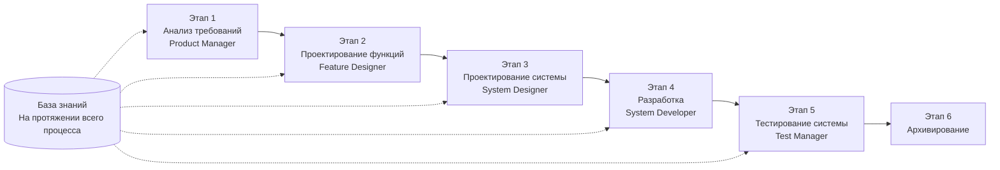

# SpecCrew - Руководство по быстрому запуску

<p align="center">
  <a href="./GETTING-STARTED.md">简体中文</a> |
  <a href="./GETTING-STARTED.zh-TW.md">繁體中文</a> |
  <a href="./GETTING-STARTED.en.md">English</a> |
  <a href="./GETTING-STARTED.ko.md">한국어</a> |
  <a href="./GETTING-STARTED.de.md">Deutsch</a> |
  <a href="./GETTING-STARTED.es.md">Español</a> |
  <a href="./GETTING-STARTED.fr.md">Français</a> |
  <a href="./GETTING-STARTED.it.md">Italiano</a> |
  <a href="./GETTING-STARTED.da.md">Dansk</a> |
  <a href="./GETTING-STARTED.ja.md">日本語</a> |
  <a href="./GETTING-STARTED.ar.md">العربية</a> |
  <a href="./GETTING-STARTED.ru.md">Русский</a>
</p>

Этот документ поможет вам быстро понять, как использовать команду Агент SpecCrew для завершения полного цикла разработки от требований до доставки в соответствии со стандартными инженерными процессами.

---

## 1. Предварительные требования

### Установка SpecCrew

```bash
npm install -g speccrew
```

### Инициализация проекта

```bash
speccrew init --ide qoder
```

Поддерживаемые IDE: `qoder`, `cursor`, `claude`, `codex`

### Структура каталогов после инициализации

```
.
├── .qoder/
│   ├── agents/          # Файлы определения Агентов
│   └── skills/          # Файлы определения Навыков
├── speccrew-workspace/  # Рабочее пространство
│   ├── docs/            # Конфигурации, правила, шаблоны, решения
│   ├── iterations/      # Текущие итерации
│   ├── iteration-archives/  # Архивированные итерации
│   └── knowledges/      # База знаний
│       ├── base/        # Базовая информация (диагностические отчеты, технический долг)
│       ├── bizs/        # Бизнес-база знаний
│       └── techs/       # Техническая база знаний
```

### Справочник команд CLI

| Команда | Описание |
|---------|-------------|
| `speccrew list` | Список всех доступных Агентов и Навыков |
| `speccrew doctor` | Проверка целостности установки |
| `speccrew update` | Обновление конфигурации проекта до последней версии |
| `speccrew uninstall` | Удаление SpecCrew |

---

## 2. Обзор рабочего процесса

### Полная диаграмма потока



### Основные принципы

1. **Зависимости этапов**: Результаты каждого этапа являются входными данными для следующего этапа
2. **Подтверждение контрольных точек**: Каждый этап имеет точку подтверждения, требующую одобрения пользователя перед переходом к следующему этапу
3. **Управление базой знаний**: База знаний проходит через весь процесс, предоставляя контекст для всех этапов

---

## 3. Нулевой шаг: Инициализация базы знаний

Перед началом формального инженерного процесса необходимо инициализировать базу знаний проекта.

### 3.1 Инициализация технической базы знаний

**Пример диалога**:
```
@speccrew-team-leader инициализировать техническую базу знаний
```

**Трехэтапный процесс**:
1. Обнаружение платформы — Идентификация технологических платформ в проекте
2. Генерация технической документации — Создание документов технических спецификаций для каждой платформы
3. Генерация индекса — Создание индекса базы знаний

**Результат**:
```
speccrew-workspace/knowledges/techs/{platform-id}/
├── tech-stack.md          # Определение технологического стека
├── architecture.md        # Архитектурные соглашения
├── dev-spec.md            # Спецификации разработки
├── test-spec.md           # Спецификации тестирования
└── INDEX.md               # Файл индекса
```

### 3.2 Инициализация бизнес-базы знаний

**Пример диалога**:
```
@speccrew-team-leader инициализировать бизнес-базу знаний
```

**Четырехэтапный процесс**:
1. Инвентаризация функций — Сканирование кода для идентификации всех функциональных возможностей
2. Анализ функций — Анализ бизнес-логики каждой функции
3. Сводка по модулям — Суммаризация функций по модулям
4. Сводка системы — Создание бизнес-обзора на уровне системы

**Результат**:
```
speccrew-workspace/knowledges/bizs/
├── {platform-type}/
│   └── {module-name}/
│       └── feature-spec.md
└── system-overview.md
```

---

## 4. Руководство по диалогу этап за этапом

### 4.1 Этап 1: Анализ требований (Product Manager)

**Как начать**:
```
@speccrew-product-manager у меня новое требование: [опишите ваше требование]
```

**Рабочий процесс Агента**:
1. Чтение обзора системы для понимания существующих модулей
2. Анализ требований пользователя
3. Генерация структурированного документа PRD

**Результат**:
```
iterations/{номер}-{тип}-{имя}/01.product-requirement/
├── [feature-name]-prd.md           # Документ требований продукта
└── [feature-name]-bizs-modeling.md # Бизнес-моделирование (для сложных требований)
```

**Контрольный список подтверждения**:
- [ ] Описание требования точно отражает намерение пользователя?
- [ ] Бизнес-правила полны?
- [ ] Точки интеграции с существующими системами ясны?
- [ ] Критерии приемки измеримы?

---

### 4.2 Этап 2: Проектирование функций (Feature Designer)

**Как начать**:
```
@speccrew-feature-designer начать проектирование функций
```

**Рабочий процесс Агента**:
1. Автоматическое обнаружение подтвержденного документа PRD
2. Загрузка бизнес-базы знаний
3. Генерация проектирования функций (включая UI-вейрфреймы, потоки взаимодействия, определения данных, API-контракты)
4. Для нескольких PRD использовать Task Worker для параллельного проектирования

**Результат**:
```
iterations/{iter}/02.feature-design/
└── [feature-name]-feature-spec.md  # Документ проектирования функций
```

**Контрольный список подтверждения**:
- [ ] Все пользовательские сценарии покрыты?
- [ ] Потоки взаимодействия ясны?
- [ ] Определения полей данных полны?
- [ ] Обработка исключений всесторонняя?

---

### 4.3 Этап 3: Проектирование системы (System Designer)

**Как начать**:
```
@speccrew-system-designer начать проектирование системы
```

**Рабочий процесс Агента**:
1. Обнаружение Feature Spec и API Contract
2. Загрузка технической базы знаний (технологический стек, архитектура, спецификации для каждой платформы)
3. **Контрольная точка A**: Оценка фреймворка — Анализ технических пробелов, рекомендация новых фреймворков (при необходимости), ожидание подтверждения пользователя
4. Генерация DESIGN-OVERVIEW.md
5. Использование Task Worker для параллельной рассылки проектирования для каждой платформы (frontend/backend/мобильный/настольный)
6. **Контрольная точка B**: Совместное подтверждение — Показ сводки всех дизайнов платформ, ожидание подтверждения пользователя

**Результат**:
```
iterations/{iter}/03.system-design/
├── DESIGN-OVERVIEW.md              # Обзор дизайна
├── {platform-id}/
│   ├── INDEX.md                    # Индекс дизайна платформы
│   └── {module}-design.md          # Проектирование модуля на уровне псевдокода
```

**Контрольный список подтверждения**:
- [ ] Псевдокод использует реальный синтаксис фреймворка?
- [ ] Кросс-платформенные API-контракты согласованы?
- [ ] Стратегия обработки ошибок унифицирована?

---

### 4.4 Этап 4: Реализация разработки (System Developer)

**Как начать**:
```
@speccrew-system-developer начать разработку
```

**Рабочий процесс Агента**:
1. Чтение документов проектирования системы
2. Загрузка технических знаний для каждой платформы
3. **Контрольная точка A**: Предварительная проверка среды — Проверка версий runtime, зависимостей, доступности сервисов; при сбое ожидание решения пользователя
4. Использование Task Worker для параллельной рассылки разработки для каждой платформы
5. Проверка интеграции: Выравнивание API-контрактов, согласованность данных
6. Вывод отчета о доставке

**Результат**:
```
# Исходный код записан в фактический каталог исходного кода проекта
iterations/{iter}/04.development/
├── {platform-id}/
│   └── tasks/                      # Записи задач разработки
└── delivery-report.md
```

**Контрольный список подтверждения**:
- [ ] Среда готова?
- [ ] Проблемы интеграции в приемлемых пределах?
- [ ] Код соответствует спецификациям разработки?

---

### 4.5 Этап 5: Тестирование системы (Test Manager)

**Как начать**:
```
@speccrew-test-manager начать тестирование
```

**Трехэтапный процесс тестирования**:

| Этап | Описание | Контрольная точка |
|------|----------|-------------------|
| Проектирование тест-кейсов | Генерация тест-кейсов на основе PRD и Feature Spec | A: Показать статистику покрытия кейсов и матрицу трассировки, ожидание подтверждения пользователем достаточного покрытия |
| Генерация тестового кода | Генерация исполняемого тестового кода | B: Показать сгенерированные тестовые файлы и маппинг кейсов, ожидание подтверждения пользователя |
| Выполнение тестов и отчет о багах | Автоматическое выполнение тестов и генерация отчетов | Нет (автоматическое выполнение) |

**Результат**:
```
iterations/{iter}/05.system-test/
├── cases/
│   └── {platform-id}/              # Документы тест-кейсов
├── code/
│   └── {platform-id}/              # План тестового кода
├── reports/
│   └── test-report-{date}.md       # Отчет о тестировании
└── bugs/
    └── BUG-{id}-{title}.md         # Отчеты о багах (один файл на баг)
```

**Контрольный список подтверждения**:
- [ ] Покрытие кейсов полное?
- [ ] Тестовый код исполняемый?
- [ ] Оценка серьезности багов точна?

---

### 4.6 Этап 6: Архивирование

Итерации архивируются автоматически при завершении:

```
speccrew-workspace/iteration-archives/
└── {номер}-{тип}-{имя}-{дата}/
    ├── 01.product-requirement/
    ├── 02.feature-design/
    ├── 03.system-design/
    ├── 04.development/
    └── 05.system-test/
```

---

## 5. Обзор базы знаний

### 5.1 Бизнес-база знаний (bizs)

**Назначение**: Хранение описаний бизнес-функций проекта, разделений модулей, характеристик API

**Структура каталогов**:
```
knowledges/bizs/
├── {platform-type}/
│   └── {module-name}/
│       └── feature-spec.md
└── system-overview.md
```

**Сценарии использования**: Product Manager, Feature Designer

### 5.2 Техническая база знаний (techs)

**Назначение**: Хранение технологического стека проекта, архитектурных соглашений, спецификаций разработки, спецификаций тестирования

**Структура каталогов**:
```
knowledges/techs/{platform-id}/
├── tech-stack.md
├── architecture.md
├── dev-spec.md
├── test-spec.md
└── INDEX.md
```

**Сценарии использования**: System Designer, System Developer, Test Manager

---

## 6. Управление прогрессом рабочего процесса

Виртуальная команда SpecCrew следует строгому механизму фазовых ворот, где каждая фаза должна быть подтверждена пользователем перед переходом к следующей. Также поддерживает возобновляемое выполнение — при перезапуске после прерывания автоматически продолжает с места остановки.

### 6.1 Трёхуровневые файлы прогресса

Рабочий процесс автоматически поддерживает три типа JSON файлов прогресса, расположенных в каталоге итерации:

| Файл | Расположение | Назначение |
|------|----------|---------|
| `WORKFLOW-PROGRESS.json` | `iterations/{iter}/` | Записывает статус каждого этапа пайплайна |
| `.checkpoints.json` | В каждом каталоге фазы | Записывает статус подтверждения контрольных точек пользователем |
| `DISPATCH-PROGRESS.json` | В каждом каталоге фазы | Записывает поэтапный прогресс для параллельных задач (мультиплатформенных/мультимодульных) |

### 6.2 Поток статуса фазы

Каждая фаза следует этому потоку статуса:

```
pending → in_progress → completed → confirmed
```

- **pending**: Ещё не начато
- **in_progress**: В данный момент выполняется
- **completed**: Выполнение Агента завершено, ожидание подтверждения пользователя
- **confirmed**: Пользователь подтвердил через финальную контрольную точку, следующая фаза может начаться

### 6.3 Возобновляемое выполнение

При перезапуске Агента для фазы:

1. **Автоматическая проверка вверх по потоку**: Проверяет, подтверждена ли предыдущая фаза, блокирует и уведомляет, если нет
2. **Восстановление контрольных точек**: Читает `.checkpoints.json`, пропускает пройденные контрольные точки, продолжает с последней точки прерывания
3. **Восстановление параллельных задач**: Читает `DISPATCH-PROGRESS.json`, повторно выполняет только задачи со статусом `pending` или `failed`, пропускает задачи `completed`

### 6.4 Просмотр текущего прогресса

Просмотр панорамного статуса пайплайна через Агента Team Leader:

```
@speccrew-team-leader просмотр текущего прогресса итерации
```

Team Leader прочитает файлы прогресса и отобразит обзор статуса, подобный:

```
Pipeline Status: i001-user-management
  01 PRD:            ✅ Подтверждено
  02 Feature Design: 🔄 В процессе (Контрольная точка A пройдена)
  03 System Design:  ⏳ Ожидание
  04 Development:    ⏳ Ожидание
  05 System Test:    ⏳ Ожидание
```

### 6.5 Обратная совместимость

Механизм файлов прогресса полностью обратно совместим — если файлы прогресса не существуют (например, в устаревших проектах или новых итерациях), все Агенты будут выполняться нормально в соответствии с исходной логикой.

---

## 7. Часто задаваемые вопросы (FAQ)

### В1: Что делать, если Агент не работает как ожидается?

1. Выполните `speccrew doctor` для проверки целостности установки
2. Подтвердите, что база знаний инициализирована
3. Подтвердите, что результаты предыдущего этапа существуют в текущем каталоге итерации

### В2: Как пропустить этап?

**Не рекомендуется** — Вывод каждого этапа является вводом для следующего этапа.

Если необходимо пропустить, подготовьте вручную входной документ соответствующего этапа и убедитесь, что он соответствует спецификациям формата.

### В3: Как обрабатывать несколько параллельных требований?

Создайте независимые каталоги итераций для каждого требования:
```
iterations/
├── 001-feature-xxx/
├── 002-feature-yyy/
└── 003-feature-zzz/
```

Каждая итерация полностью изолирована и не влияет на другие.

### В4: Как обновить версию SpecCrew?

Обновление требует два этапа:

```bash
# Этап 1: Обновить глобальный CLI-инструмент
npm install -g speccrew@latest

# Этап 2: Синхронизировать Агентов и Навыки в директории проекта
cd /path/to/your-project
speccrew update
```

- `npm install -g speccrew@latest`: Обновляет сам CLI-инструмент (новые версии могут включать новые определения Агентов/Навыков, исправления ошибок и т.д.)
- `speccrew update`: Синхронизирует файлы определений Агентов и Навыков в вашем проекте до последней версии
- `speccrew update --ide cursor`: Обновляет конфигурацию только для конкретной IDE

> **Примечание**: Оба этапа обязательны. Выполнение только `speccrew update` не обновит сам CLI-инструмент; выполнение только `npm install` не обновит файлы проекта.

### В5: `speccrew update` показывает новую версию, но после установки всё ещё старая?

Обычно это вызвано кэшем npm. Решение:
```bash
npm cache clean --force
npm install -g speccrew@latest
npm list -g speccrew
```
Если всё ещё не работает, установите конкретную версию:
```bash
npm install -g speccrew@0.5.6
```

### В6: Как посмотреть исторические итерации?

После архивирования смотрите в `speccrew-workspace/iteration-archives/`, организовано в формате `{номер}-{тип}-{имя}-{дата}/`.

### В7: Нужна ли базе знаний регулярная актуализация?

Реинициализация требуется в следующих ситуациях:
- Значительные изменения структуры проекта
- Обновление или замена технологического стека
- Добавление/удаление бизнес-модулей

---

## 8. Быстрая справка

### Быстрая справка по запуску Агентов

| Этап | Агент | Начальный диалог |
|------|-------|-------------------|
| Инициализация | Team Leader | `@speccrew-team-leader инициализировать техническую базу знаний` |
| Анализ требований | Product Manager | `@speccrew-product-manager у меня новое требование: [описание]` |
| Проектирование функций | Feature Designer | `@speccrew-feature-designer начать проектирование функций` |
| Проектирование системы | System Designer | `@speccrew-system-designer начать проектирование системы` |
| Разработка | System Developer | `@speccrew-system-developer начать разработку` |
| Тестирование системы | Test Manager | `@speccrew-test-manager начать тестирование` |

### Контрольный список контрольных точек

| Этап | Количество контрольных точек | Ключевые элементы проверки |
|------|-----------------------------|---------------------------|
| Анализ требований | 1 | Точность требований, полнота бизнес-правил, измеримость критериев приемки |
| Проектирование функций | 1 | Покрытие сценариев, ясность взаимодействия, полнота данных, обработка исключений |
| Проектирование системы | 2 | A: Оценка фреймворка; B: Синтаксис псевдокода, кросс-платформенная согласованность, обработка ошибок |
| Разработка | 1 | A: Готовность среды, проблемы интеграции, спецификации кода |
| Тестирование системы | 2 | A: Покрытие кейсов; B: Исполняемость тестового кода |

### Быстрая справка по путям результатов

| Этап | Выходной каталог | Формат файла |
|------|-----------------|-------------|
| Анализ требований | `iterations/{iter}/01.product-requirement/` | `[name]-prd.md`, `[name]-bizs-modeling.md` |
| Проектирование функций | `iterations/{iter}/02.feature-design/` | `[name]-feature-spec.md` |
| Проектирование системы | `iterations/{iter}/03.system-design/` | `DESIGN-OVERVIEW.md`, `{platform}/INDEX.md`, `{platform}/{module}-design.md` |
| Разработка | `iterations/{iter}/04.development/` | Исходный код + `delivery-report.md` |
| Тестирование системы | `iterations/{iter}/05.system-test/` | `cases/`, `code/`, `reports/`, `bugs/` |
| Архивирование | `iteration-archives/{iter}-{дата}/` | Полная копия итерации |

---

## Следующие шаги

1. Выполните `speccrew init --ide qoder` для инициализации вашего проекта
2. Выполните Нулевой шаг: Инициализация базы знаний
3. Продвигайтесь через каждый этап следуя рабочему процессу, наслаждаясь опытом разработки на основе спецификаций!
