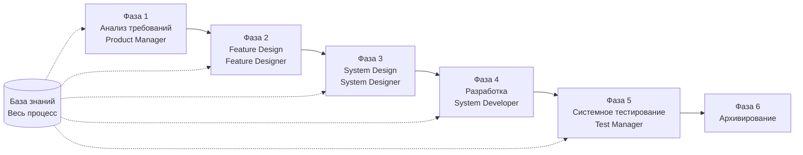

# SpecCrew - Руководство по быстрому запуску

<p align="center">
  <a href="./GETTING-STARTED.md">简体中文</a> |
  <a href="./GETTING-STARTED.en.md">English</a> |
  <a href="./GETTING-STARTED.ja.md">日本語</a> |
  <a href="./GETTING-STARTED.ru.md">Русский</a> |
  <a href="./GETTING-STARTED.es.md">Español</a> |
  <a href="./GETTING-STARTED.de.md">Deutsch</a> |
  <a href="./GETTING-STARTED.fr.md">Français</a> |
  <a href="./GETTING-STARTED.pt-BR.md">Português (Brasil)</a> |
  <a href="./GETTING-STARTED.ar.md">العربية</a> |
  <a href="./GETTING-STARTED.hi.md">हिन्दी</a>
</p>

Этот документ поможет вам быстро понять, как использовать команду Agent SpecCrew для завершения полной разработки от требований до поставки в соответствии со стандартными инженерными процессами.

---

## 1. Предварительные требования

### Установка SpecCrew

```bash
npm install -g speccrew
```

### Инициализация проекта

```bash
speccrew init --ide qoder
```

Поддерживаемые IDE: `qoder`, `cursor`, `claude`, `codex`

### Структура каталогов после инициализации

```
.
├── .qoder/
│   ├── agents/          # Файлы определения Agents
│   └── skills/          # Файлы определения Skills
├── speccrew-workspace/  # Workspace
│   ├── docs/            # Конфигурации, правила, шаблоны, решения
│   ├── iterations/      # Текущие итерации
│   ├── iteration-archives/  # Архивированные итерации
│   └── knowledges/      # База знаний
│       ├── base/        # Базовая информация (отчеты диагностики, технический долг)
│       ├── bizs/        # База знаний бизнеса
│       └── techs/       # База технических знаний
```

### Краткая справка по командам CLI

| Команда | Описание |
|------|------|
| `speccrew list` | Список всех доступных Agents и Skills |
| `speccrew doctor` | Проверка целостности установки |
| `speccrew update` | Обновление конфигурации проекта до последней версии |
| `speccrew uninstall` | Удаление SpecCrew |

---

## 2. Быстрый старт за 5 минут после установки

После выполнения `speccrew init` выполните следующие шаги для быстрого перехода в рабочее состояние:

### Шаг 1: Выберите вашу IDE

| IDE | Команда инициализации | Сценарий применения |
|-----|-----------|----------|
| **Qoder** (Рекомендуется) | `speccrew init --ide qoder` | Полная оркестрация агентов, параллельные workers |
| **Cursor** | `speccrew init --ide cursor` | Рабочие процессы на основе Composer |
| **Claude Code** | `speccrew init --ide claude` | Разработка CLI-first |
| **Codex** | `speccrew init --ide codex` | Интеграция экосистемы OpenAI |

### Шаг 2: Инициализация базы знаний (Рекомендуется)

Для проектов с существующим исходным кодом рекомендуется сначала инициализировать базу знаний, чтобы агенты понимали вашу кодовую базу:

```
/speccrew-team-leader инициализировать техническую базу знаний
```

Затем:

```
/speccrew-team-leader инициализировать бизнес-базу знаний
```

### Шаг 3: Начните вашу первую задачу

```
/speccrew-product-manager У меня новое требование: [опишите ваше функциональное требование]
```

> **Совет**: Если вы не уверены, что делать, просто скажите `/speccrew-team-leader помогите мне начать` — Team Leader автоматически определит статус вашего проекта и направит вас.

---

## 3. Быстрое дерево решений

Не уверены, что делать? Найдите ваш сценарий ниже:

- **У меня новое функциональное требование**
  → `/speccrew-product-manager У меня новое требование: [опишите ваше функциональное требование]`

- **Я хочу сканировать знания существующего проекта**
  → `/speccrew-team-leader инициализировать техническую базу знаний`
  → Затем: `/speccrew-team-leader инициализировать бизнес-базу знаний`

- **Я хочу продолжить предыдущую работу**
  → `/speccrew-team-leader каков текущий прогресс?`

- **Я хочу проверить состояние здоровья системы**
  → Выполнить в терминале: `speccrew doctor`

- **Я не уверен, что делать**
  → `/speccrew-team-leader помогите мне начать`
  → Team Leader автоматически определит статус вашего проекта и направит вас

---

## 4. Краткая справка по Agents

| Роль | Agent | Обязанности | Пример команды |
|------|-------|-----------------|-----------------|
| Лидер команды | `/speccrew-team-leader` | Навигация по проекту, инициализация базы знаний, проверка статуса | "Помогите мне начать" |
| Менеджер продукта | `/speccrew-product-manager` | Анализ требований, генерация PRD | "У меня новое требование: ..." |
| Дизайнер функций | `/speccrew-feature-designer` | Анализ функций, проектирование спецификаций, API контракты | "Начать проектирование функций для итерации X" |
| Системный дизайнер | `/speccrew-system-designer` | Проектирование архитектуры, детальное проектирование платформы | "Начать системное проектирование для итерации X" |
| Системный разработчик | `/speccrew-system-developer` | Координация разработки, генерация кода | "Начать разработку для итерации X" |
| Менеджер тестирования | `/speccrew-test-manager` | Планирование тестирования, проектирование случаев, выполнение | "Начать тестирование для итерации X" |

> **Примечание**: Вам не нужно запоминать всех агентов. Просто поговорите с `/speccrew-team-leader`, и он направит ваш запрос к правильному агенту.

---

## 5. Обзор рабочего процесса

### Полная диаграмма потока



### Основные принципы

1. **Зависимости фаз**: Результат каждой фазы является входом для следующей фазы
2. **Подтверждение checkpoint**: Каждая фаза имеет точку подтверждения, требующую одобрения пользователя перед переходом к следующей фазе
3. **Управляемо базой знаний**: База знаний проходит через весь процесс, предоставляя контекст для всех фаз

---

## 6. Шаг ноль: Инициализация базы знаний

Перед началом формального инженерного процесса необходимо инициализировать базу знаний проекта.

### 6.1 Инициализация технической базы знаний

**Пример разговора**:
```
/speccrew-team-leader инициализировать техническую базу знаний
```

**Трехфазный процесс**:
1. Обнаружение платформы — Идентификация технических платформ в проекте
2. Генерация технической документации — Генерация документов технических спецификаций для каждой платформы
3. Генерация индекса — Создание индекса базы знаний

**Результат**:
```
speccrew-workspace/knowledges/techs/{platform-id}/
├── tech-stack.md          # Определение технологического стека
├── architecture.md        # Архитектурные соглашения
├── dev-spec.md            # Спецификации разработки
├── test-spec.md           # Спецификации тестирования
└── INDEX.md               # Файл индекса
```

### 6.2 Инициализация бизнес-базы знаний

**Пример разговора**:
```
/speccrew-team-leader инициализировать бизнес-базу знаний
```

**Четырехфазный процесс**:
1. Инвентаризация функций — Сканирование кода для идентификации всех функций
2. Анализ функций — Анализ бизнес-логики для каждой функции
3. Сводка по модулю — Сводка функций по модулю
4. Системная сводка — Генерация бизнес-обзора на уровне системы

**Результат**:
```
speccrew-workspace/knowledges/bizs/
├── {platform-type}/
│   └── {module-name}/
│       └── feature-spec.md
└── system-overview.md
```

---

## 7. Пошаговое руководство по разговору

### 7.1 Фаза 1: Анализ требований (Product Manager)

**Как начать**:
```
/speccrew-product-manager У меня новое требование: [опишите ваше требование]
```

**Рабочий процесс Agent**:
1. Прочитать обзор системы для понимания существующих модулей
2. Анализировать требования пользователя
3. Сгенерировать структурированный документ PRD

**Результат**:
```
iterations/{номер}-{тип}-{имя}/01.product-requirement/
├── [feature-name]-prd.md           # Документ требований продукта
└── [feature-name]-bizs-modeling.md # Бизнес-моделирование (для сложных требований)
```

**Контрольный список подтверждения**:
- [ ] Описание требования точно отражает намерение пользователя?
- [ ] Бизнес-правила полны?
- [ ] Точки интеграции с существующими системами ясны?
- [ ] Критерии приемки измеримы?

---

### 7.2 Фаза 2: Feature Design (Feature Designer)

**Как начать**:
```
/speccrew-feature-designer начать feature design
```

**Рабочий процесс Agent**:
1. Автоматически найти подтвержденный документ PRD
2. Загрузить бизнес-базу знаний
3. Сгенерировать feature design (включая UI wireframes, потоки взаимодействия, определения данных, API контракты)
4. Для нескольких PRD использовать Task Worker для параллельного проектирования

**Результат**:
```
iterations/{iter}/02.feature-design/
└── [feature-name]-feature-spec.md  # Документ feature design
```

**Контрольный список подтверждения**:
- [ ] Все пользовательские сценарии охвачены?
- [ ] Потоки взаимодействия ясны?
- [ ] Определения полей данных полны?
- [ ] Обработка исключений комплексна?

---

### 7.3 Фаза 3: System Design (System Designer)

**Как начать**:
```
/speccrew-system-designer начать system design
```

**Рабочий процесс Agent**:
1. Найти Feature Spec и API Contract
2. Загрузить техническую базу знаний (технологический стек, архитектура, спецификации для каждой платформы)
3. **Checkpoint A**: Оценка framework — Анализ технических пробелов, рекомендация новых frameworks (если необходимо), ожидание подтверждения пользователя
4. Сгенерировать DESIGN-OVERVIEW.md
5. Использовать Task Worker для параллельного распределения проектирования для каждой платформы (frontend/backend/mobile/desktop)
6. **Checkpoint B**: Совместное подтверждение — Показать сводку всех дизайнов платформ, ожидание подтверждения пользователя

**Результат**:
```
iterations/{iter}/03.system-design/
├── DESIGN-OVERVIEW.md              # Обзор дизайна
├── {platform-id}/
│   ├── INDEX.md                    # Индекс дизайна платформы
│   └── {module}-design.md          # Проектирование модуля уровня pseudocode
```

**Контрольный список подтверждения**:
- [ ] Pseudocode использует фактический синтаксис framework?
- [ ] Кросс-платформенные API контракты согласованы?
- [ ] Стратегия обработки ошибок едина?

---

### 7.4 Фаза 4: Разработка (System Developer)

**Как начать**:
```
/speccrew-system-developer начать разработку
```

**Рабочий процесс Agent**:
1. Прочитать документы системного дизайна
2. Загрузить технические знания для каждой платформы
3. **Checkpoint A**: Предварительная проверка среды — Проверить версии runtime, зависимости, доступность сервисов; ожидать решения пользователя при сбое
4. Использовать Task Worker для параллельного распределения разработки для каждой платформы
5. Проверка интеграции: выравнивание API контрактов, согласованность данных
6. Сформировать отчет о поставке

**Результат**:
```
# Исходный код записывается в фактический каталог исходного кода проекта
iterations/{iter}/04.development/
├── {platform-id}/
│   └── tasks/                      # Записи задач разработки
└── delivery-report.md
```

**Контрольный список подтверждения**:
- [ ] Среда готова?
- [ ] Проблемы интеграции в приемлемом диапазоне?
- [ ] Код соответствует спецификациям разработки?

---

### 7.5 Фаза 5: Системное тестирование (Test Manager)

**Как начать**:
```
/speccrew-test-manager начать тестирование
```

**Трехфазный процесс тестирования**:

| Фаза | Описание | Checkpoint |
|-------|-------------|------------|
| Проектирование тестовых случаев | Генерация тестовых случаев на основе PRD и Feature Spec | A: Показать статистику покрытия случаев и матрицу трассировки, ожидание подтверждения пользователем достаточного покрытия |
| Генерация тестового кода | Генерация исполняемого тестового кода | B: Показать сгенерированные тестовые файлы и отображение случаев, ожидание подтверждения пользователя |
| Выполнение тестов и отчеты об ошибках | Автоматическое выполнение тестов и генерация отчетов | Нет (автоматическое выполнение) |

**Результат**:
```
iterations/{iter}/05.system-test/
├── cases/
│   └── {platform-id}/              # Документы тестовых случаев
├── code/
│   └── {platform-id}/              # План тестового кода
├── reports/
│   └── test-report-{date}.md       # Отчет о тестировании
└── bugs/
    └── BUG-{id}-{title}.md         # Отчеты об ошибках (один файл на ошибку)
```

**Контрольный список подтверждения**:
- [ ] Покрытие случаев полное?
- [ ] Тестовый код исполняемый?
- [ ] Оценка серьезности ошибок точна?

---

### 7.6 Фаза 6: Архивирование

Итерации автоматически архивируются после завершения:

```
speccrew-workspace/iteration-archives/
└── {номер}-{тип}-{имя}-{дата}/
    ├── 01.product-requirement/
    ├── 02.feature-design/
    ├── 03.system-design/
    ├── 04.development/
    └── 05.system-test/
```

---

## 8. Обзор базы знаний

### 8.1 Бизнес-база знаний (bizs)

**Назначение**: Хранение описаний бизнес-функций проекта, деления на модули, характеристик API

**Структура каталогов**:
```
knowledges/bizs/
├── {platform-type}/
│   └── {module-name}/
│       └── feature-spec.md
└── system-overview.md
```

**Сценарии использования**: Product Manager, Feature Designer

### 8.2 Техническая база знаний (techs)

**Назначение**: Хранение технологического стека проекта, архитектурных соглашений, спецификаций разработки, спецификаций тестирования

**Структура каталогов**:
```
knowledges/techs/{platform-id}/
├── tech-stack.md
├── architecture.md
├── dev-spec.md
├── test-spec.md
└── INDEX.md
```

**Сценарии использования**: System Designer, System Developer, Test Manager

---

## 9. Управление прогрессом рабочего процесса

Виртуальная команда SpecCrew следует строгому механизму stage-gating, где каждая фаза должна быть подтверждена пользователем перед переходом к следующей. Также поддерживает возобновляемое выполнение — при перезапуске после прерывания автоматически продолжается с места остановки.

### 9.1 Трехуровневые файлы прогресса

Рабочий процесс автоматически поддерживает три типа JSON файлов прогресса, расположенных в каталоге итерации:

| Файл | Расположение | Назначение |
|------|----------|---------|
| `WORKFLOW-PROGRESS.json` | `iterations/{iter}/` | Записывает статус каждой фазы pipeline |
| `.checkpoints.json` | Под каждым каталогом фазы | Записывает статус подтверждения checkpoint пользователя |
| `DISPATCH-PROGRESS.json` | Под каждым каталогом фазы | Записывает поэтапный прогресс для параллельных задач (multi-platform/multi-module) |

### 9.2 Поток статуса фазы

Каждая фаза следует этому потоку статуса:

```
pending → in_progress → completed → confirmed
```

- **pending**: Еще не начато
- **in_progress**: Выполняется
- **completed**: Выполнение агента завершено, ожидание подтверждения пользователя
- **confirmed**: Пользователь подтвердил через финальный checkpoint, следующая фаза может начаться

### 9.3 Возобновляемое выполнение

При перезапуске Agent для фазы:

1. **Автоматическая проверка upstream**: Проверяет, подтверждена ли предыдущая фаза, блокирует и запрашивает, если нет
2. **Восстановление Checkpoint**: Читает `.checkpoints.json`, пропускает пройденные checkpoints, продолжает с последней точки прерывания
3. **Восстановление параллельных задач**: Читает `DISPATCH-PROGRESS.json`, повторно выполняет только задачи со статусом `pending` или `failed`, пропускает задачи `completed`

### 9.4 Просмотр текущего прогресса

Просмотр статуса panorama pipeline через Agent Team Leader:

```
/speccrew-team-leader просмотреть текущий прогресс итерации
```

Team Leader прочитает файлы прогресса и покажет обзор статуса, подобный:

```
Pipeline Status: i001-user-management
  01 PRD:            ✅ Confirmed
  02 Feature Design: 🔄 In Progress (Checkpoint A passed)
  03 System Design:  ⏳ Pending
  04 Development:    ⏳ Pending
  05 System Test:    ⏳ Pending
```

### 9.5 Обратная совместимость

Механизм файлов прогресса полностью обратно совместим — если файлы прогресса не существуют (например, в legacy проектах или новых итерациях), все Agents будут выполняться нормально согласно оригинальной логике.

---

## 10. Часто задаваемые вопросы (FAQ)

### В1: Что делать, если Agent не работает как ожидалось?

1. Выполнить `speccrew doctor` для проверки целостности установки
2. Подтвердить, что база знаний инициализирована
3. Подтвердить, что результат предыдущей фазы существует в текущем каталоге итерации

### В2: Как пропустить фазу?

**Не рекомендуется** — Выход каждой фазы является входом для следующей фазы.

Если необходимо пропустить, вручную подготовьте входной документ соответствующей фазы и убедитесь, что он соответствует спецификациям формата.

### В3: Как обрабатывать несколько параллельных требований?

Создайте независимые каталоги итераций для каждого требования:
```
iterations/
├── 001-feature-xxx/
├── 002-feature-yyy/
└── 003-feature-zzz/
```

Каждая итерация полностью изолирована и не влияет на другие.

### В4: Как обновить версию SpecCrew?

Обновление требует двух шагов:

```bash
# Шаг 1: Обновить глобальный инструмент CLI
npm install -g speccrew@latest

# Шаг 2: Синхронизировать Agents и Skills в каталоге проекта
cd /path/to/your-project
speccrew update
```

- `npm install -g speccrew@latest`: Обновляет сам инструмент CLI (новые версии могут включать новые определения Agent/Skill, исправления ошибок и т.д.)
- `speccrew update`: Синхронизирует файлы определения Agent и Skill в вашем проекте до последней версии
- `speccrew update --ide cursor`: Обновляет конфигурацию только для конкретной IDE

> **Примечание**: Оба шага требуются. Выполнение только `speccrew update` не обновит сам инструмент CLI; выполнение только `npm install` не обновит файлы проекта.

### В5: `speccrew update` показывает доступную новую версию, но `npm install -g speccrew@latest` все еще устанавливает старую версию?

Это обычно вызвано кэшем npm. Решение:

```bash
# Очистить кэш npm и переустановить
npm cache clean --force
npm install -g speccrew@latest

# Проверить версию
npm list -g speccrew
```

Если все еще не работает, попробуйте установить с конкретным номером версии:
```bash
npm install -g speccrew@0.5.6
```

### В6: Как просмотреть исторические итерации?

После архивирования просмотреть в `speccrew-workspace/iteration-archives/`, организовано по формату `{номер}-{тип}-{имя}-{дата}/`.

### В7: Требуется ли регулярное обновление базы знаний?

Повторная инициализация требуется в следующих ситуациях:
- Значительные изменения в структуре проекта
- Обновление или замена технологического стека
- Добавление/удаление бизнес-модулей

---

## 11. Краткая справка

### Краткая справка по запуску Agents

| Фаза | Agent | Начальный разговор |
|-------|-------|-------------------|
| Инициализация | Team Leader | `/speccrew-team-leader инициализировать техническую базу знаний` |
| Анализ требований | Product Manager | `/speccrew-product-manager У меня новое требование: [описание]` |
| Feature Design | Feature Designer | `/speccrew-feature-designer начать feature design` |
| System Design | System Designer | `/speccrew-system-designer начать system design` |
| Разработка | System Developer | `/speccrew-system-developer начать разработку` |
| Системное тестирование | Test Manager | `/speccrew-test-manager начать тестирование` |

### Контрольный список Checkpoint

| Фаза | Количество Checkpoint | Ключевые элементы проверки |
|-------|----------------------|-----------------|
| Анализ требований | 1 | Точность требований, полнота бизнес-правил, измеримость критериев приемки |
| Feature Design | 1 | Покрытие сценариев, ясность взаимодействия, полнота данных, обработка исключений |
| System Design | 2 | A: Оценка framework; B: Синтаксис pseudocode, кросс-платформенная согласованность, обработка ошибок |
| Разработка | 1 | A: Готовность среды, проблемы интеграции, спецификации кода |
| Системное тестирование | 2 | A: Покрытие случаев; B: Исполняемость тестового кода |

### Краткая справка по путям результатов

| Фаза | Выходной каталог | Формат файла |
|-------|-----------------|-------------|
| Анализ требований | `iterations/{iter}/01.product-requirement/` | `[name]-prd.md`, `[name]-bizs-modeling.md` |
| Feature Design | `iterations/{iter}/02.feature-design/` | `[name]-feature-spec.md` |
| System Design | `iterations/{iter}/03.system-design/` | `DESIGN-OVERVIEW.md`, `{platform}/INDEX.md`, `{platform}/{module}-design.md` |
| Разработка | `iterations/{iter}/04.development/` | Исходный код + `delivery-report.md` |
| Системное тестирование | `iterations/{iter}/05.system-test/` | `cases/`, `code/`, `reports/`, `bugs/` |
| Архивирование | `iteration-archives/{iter}-{date}/` | Полная копия итерации |

---

## Следующие шаги

1. Выполните `speccrew init --ide qoder` для инициализации вашего проекта
2. Выполните Шаг Ноль: Инициализация базы знаний
3. Продвигайтесь фаза за фазой согласно рабочему процессу, наслаждайтесь опытом разработки на основе спецификаций!
