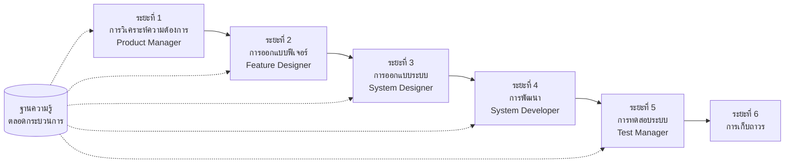

# SpecCrew - คู่มือเริ่มต้นอย่างรวดเร็ว

<p align="center">
  <a href="./GETTING-STARTED.md">简体中文</a> |
  <a href="./GETTING-STARTED.zh-TW.md">繁體中文</a> |
  <a href="./GETTING-STARTED.en.md">English</a> |
  <a href="./GETTING-STARTED.ko.md">한국어</a> |
  <a href="./GETTING-STARTED.de.md">Deutsch</a> |
  <a href="./GETTING-STARTED.es.md">Español</a> |
  <a href="./GETTING-STARTED.fr.md">Français</a> |
  <a href="./GETTING-STARTED.it.md">Italiano</a> |
  <a href="./GETTING-STARTED.da.md">Dansk</a> |
  <a href="./GETTING-STARTED.ja.md">日本語</a> |
  <a href="./GETTING-STARTED.ar.md">العربية</a> |
  <a href="./GETTING-STARTED.th.md">ไทย</a>
</p>

เอกสารนี้ช่วยให้คุณเข้าใจวิธีการใช้ทีมเอเจนต์ SpecCrew เพื่อทำวงจรการพัฒนาแบบเต็มตั้งแต่ความต้องการจนถึงการส่งมอบ ตามกระบวนการวิศวกรรมมาตรฐาน

---

## 1. ข้อกำหนดเบื้องต้น

### ติดตั้ง SpecCrew

```bash
npm install -g speccrew
```

### เริ่มต้นโปรเจกต์

```bash
speccrew init --ide qoder
```

IDE ที่รองรับ: `qoder`, `cursor`, `claude`, `codex`

### โครงสร้างไดเรกทอรีหลังจากเริ่มต้น

```
.
├── .qoder/
│   ├── agents/          # ไฟล์กำหนดเอเจนต์
│   └── skills/          # ไฟล์กำหนดทักษะ
├── speccrew-workspace/  # พื้นที่ทำงาน
│   ├── docs/            # การกำหนดค่า กฎ เทมเพลต วิธีแก้ปัญหา
│   ├── iterations/      # การทำซ้ำปัจจุบัน
│   ├── iteration-archives/  # การทำซ้ำที่เก็บถาวร
│   └── knowledges/      # ฐานความรู้
│       ├── base/        # ข้อมูลพื้นฐาน (รายงานการวินิจฉัย หนี้เทคนิค)
│       ├── bizs/        # ฐานความรู้ธุรกิจ
│       └── techs/       # ฐานความรู้เทคนิค
```

### ข้อมูลอ้างอิงคำสั่ง CLI

| คำสั่ง | คำอธิบาย |
|---------|-------------|
| `speccrew list` | แสดงรายการเอเจนต์และทักษะทั้งหมดที่มี |
| `speccrew doctor` | ตรวจสอบความสมบูรณ์ของการติดตั้ง |
| `speccrew update` | อัปเดตการกำหนดค่าโปรเจกต์เป็นเวอร์ชันล่าสุด |
| `speccrew uninstall` | ถอนการติดตั้ง SpecCrew |

---

## 2. ภาพรวมเวิร์กโฟลว์

### แผนภาพโฟลว์แบบเต็ม



### หลักการพื้นฐาน

1. **การขึ้นต่อกันของระยะ**: ผลผลิตของแต่ละระยะเป็นอินพุตของระยะถัดไป
2. **การยืนยันจุดตรวจสอบ**: แต่ละระยะมีจุดยืนยันที่ต้องได้รับการอนุมัติจากผู้ใช้ก่อนจะไปต่อ
3. **ขับเคลื่อนด้วยฐานความรู้**: ฐานความรู้ไหลผ่านกระบวนการทั้งหมด ให้บริบทสำหรับทุกระยะ

---

## 3. ขั้นตอนที่ศูนย์: การเริ่มต้นฐานความรู้

ก่อนเริ่มกระบวนการวิศวกรรมทางการ คุณต้องเริ่มต้นฐานความรู้ของโปรเจกต์

### 3.1 การเริ่มต้นฐานความรู้เทคนิค

**ตัวอย่างบทสนทนา**:
```
@speccrew-team-leader เริ่มต้นฐานความรู้เทคนิค
```

**กระบวนการสามระยะ**:
1. การตรวจจับแพลตฟอร์ม — ระบุแพลตฟอร์มเทคโนโลยีในโปรเจกต์
2. การสร้างเอกสารเทคนิค — สร้างเอกสารข้อมูลจำเพาะเทคนิคสำหรับแต่ละแพลตฟอร์ม
3. การสร้างดัชนี — สร้างดัชนีฐานความรู้

**ผลลัพธ์**:
```
speccrew-workspace/knowledges/techs/{platform-id}/
├── tech-stack.md          # คำจำกัดความสแต็กเทคโนโลยี
├── architecture.md        # ข้อตกลงสถาปัตยกรรม
├── dev-spec.md            # ข้อมูลจำเพาะการพัฒนา
├── test-spec.md           # ข้อมูลจำเพาะการทดสอบ
└── INDEX.md               # ไฟล์ดัชนี
```

### 3.2 การเริ่มต้นฐานความรู้ธุรกิจ

**ตัวอย่างบทสนทนา**:
```
@speccrew-team-leader เริ่มต้นฐานความรู้ธุรกิจ
```

**กระบวนการสี่ระยะ**:
1. การสำรวจฟีเจอร์ — สแกนโค้ดเพื่อระบุฟีเจอร์ทั้งหมด
2. การวิเคราะห์ฟีเจอร์ — วิเคราะห์ลอจิกธุรกิจของแต่ละฟีเจอร์
3. การสรุปโมดูล — สรุปฟีเจอร์ตามโมดูล
4. การสรุประบบ — สร้างภาพรวมธุรกิจระดับระบบ

**ผลลัพธ์**:
```
speccrew-workspace/knowledges/bizs/
├── {platform-type}/
│   └── {module-name}/
│       └── feature-spec.md
└── system-overview.md
```

---

## 4. คู่มือบทสนทนาระยะต่อระยะ

### 4.1 ระยะที่ 1: การวิเคราะห์ความต้องการ (Product Manager)

**วิธีการเริ่ม**:
```
@speccrew-product-manager ฉันมีความต้องการใหม่: [อธิบายความต้องการของคุณ]
```

**เวิร์กโฟลว์เอเจนต์**:
1. อ่านภาพรวมระบบเพื่อเข้าใจโมดูลที่มีอยู่
2. วิเคราะห์ความต้องการของผู้ใช้
3. สร้างเอกสาร PRD แบบมีโครงสร้าง

**ผลลัพธ์**:
```
iterations/{หมายเลข}-{ประเภท}-{ชื่อ}/01.product-requirement/
├── [feature-name]-prd.md           # เอกสารความต้องการผลิตภัณฑ์
└── [feature-name]-bizs-modeling.md # การสร้างแบบจำลองธุรกิจ (สำหรับความต้องการที่ซับซ้อน)
```

**รายการตรวจสอบการยืนยัน**:
- [ ] คำอธิบายความต้องการสะท้อนความตั้งใจของผู้ใช้อย่างแม่นยำหรือไม่?
- [ ] กฎธุรกิจครบถ้วนหรือไม่?
- [ ] จุดบูรณาการกับระบบที่มีอยู่ชัดเจนหรือไม่?
- [ ] เกณฑ์การยอมรับวัดผลได้หรือไม่?

---

### 4.2 ระยะที่ 2: การออกแบบฟีเจอร์ (Feature Designer)

**วิธีการเริ่ม**:
```
@speccrew-feature-designer เริ่มการออกแบบฟีเจอร์
```

**เวิร์กโฟลว์เอเจนต์**:
1. ระบุเอกสาร PRD ที่ยืนยันอัตโนมัติ
2. โหลดฐานความรู้ธุรกิจ
3. สร้างการออกแบบฟีเจอร์ (รวมถึง UI wireframes, โฟลว์การโต้ตอบ, คำจำกัดความข้อมูล, API contracts)
4. สำหรับหลาย PRD ใช้ Task Worker สำหรับการออกแบบแบบขนาน

**ผลลัพธ์**:
```
iterations/{iter}/02.feature-design/
└── [feature-name]-feature-spec.md  # เอกสารการออกแบบฟีเจอร์
```

**รายการตรวจสอบการยืนยัน**:
- [ ] สถานการณ์ผู้ใช้ทั้งหมดครอบคลุมหรือไม่?
- [ ] โฟลว์การโต้ตอบชัดเจนหรือไม่?
- [ ] คำจำกัดความฟิลด์ข้อมูลครบถ้วนหรือไม่?
- [ ] การจัดการข้อยกเว้นครอบคลุมหรือไม่?

---

### 4.3 ระยะที่ 3: การออกแบบระบบ (System Designer)

**วิธีการเริ่ม**:
```
@speccrew-system-designer เริ่มการออกแบบระบบ
```

**เวิร์กโฟลว์เอเจนต์**:
1. ระบุ Feature Spec และ API Contract
2. โหลดฐานความรู้เทคนิค (สแต็กเทคโนโลยี สถาปัตยกรรม ข้อมูลจำเพาะสำหรับแต่ละแพลตฟอร์ม)
3. **จุดตรวจสอบ A**: การประเมินเฟรมเวิร์ก — วิเคราะห์ช่องว่างเทคนิค แนะนำเฟรมเวิร์กใหม่ (หากจำเป็น) รอการยืนยันจากผู้ใช้
4. สร้าง DESIGN-OVERVIEW.md
5. ใช้ Task Worker สำหรับการส่งการออกแบบแบบขนานสำหรับแต่ละแพลตฟอร์ม (frontend/backend/mobile/desktop)
6. **จุดตรวจสอบ B**: การยืนยันร่วมกัน — แสดงสรุปการออกแบบแพลตฟอร์มทั้งหมด รอการยืนยันจากผู้ใช้

**ผลลัพธ์**:
```
iterations/{iter}/03.system-design/
├── DESIGN-OVERVIEW.md              # ภาพรวมการออกแบบ
├── {platform-id}/
│   ├── INDEX.md                    # ดัชนีการออกแบบแพลตฟอร์ม
│   └── {module}-design.md          # การออกแบบโมดูลระดับโค้ดเทียม
```

**รายการตรวจสอบการยืนยัน**:
- [ ] โค้ดเทียมใช้ไวยากรณ์เฟรมเวิร์กจริงหรือไม่?
- [ ] API contracts ข้ามแพลตฟอร์มสอดคล้องกันหรือไม่?
- [ ] กลยุทธ์การจัดการข้อผิดพลาดเป็นหนึ่งเดียวหรือไม่?

---

### 4.4 ระยะที่ 4: การนำไปใช้การพัฒนา (System Developer)

**วิธีการเริ่ม**:
```
@speccrew-system-developer เริ่มการพัฒนา
```

**เวิร์กโฟลว์เอเจนต์**:
1. อ่านเอกสารการออกแบบระบบ
2. โหลดความรู้เทคนิคสำหรับแต่ละแพลตฟอร์ม
3. **จุดตรวจสอบ A**: การตรวจสอบสภาพแวดล้อมล่วงหน้า — ตรวจสอบเวอร์ชัน runtime การพึ่งพา ความพร้อมใช้งานของบริการ; หากไม่สำเร็จรอการแก้ไขจากผู้ใช้
4. ใช้ Task Worker สำหรับการส่งการพัฒนาแบบขนานสำหรับแต่ละแพลตฟอร์ม
5. การตรวจสอบการบูรณาการ: การจัดแนว API contracts ความสอดคล้องของข้อมูล
6. สร้างรายงานการส่งมอบ

**ผลลัพธ์**:
```
# ซอร์สโค้ดเขียนในไดเรกทอรีซอร์สโค้ดจริงของโปรเจกต์
iterations/{iter}/04.development/
├── {platform-id}/
│   └── tasks/                      # บันทึกงานการพัฒนา
└── delivery-report.md
```

**รายการตรวจสอบการยืนยัน**:
- [ ] สภาพแวดล้อมพร้อมหรือไม่?
- [ ] ปัญหาด้านการบูรณาการอยู่ในขอบเขตที่ยอมรับได้หรือไม่?
- [ ] โค้ดเป็นไปตามข้อมูลจำเพาะการพัฒนาหรือไม่?

---

### 4.5 ระยะที่ 5: การทดสอบระบบ (Test Manager)

**วิธีการเริ่ม**:
```
@speccrew-test-manager เริ่มการทดสอบ
```

**กระบวนการทดสอบสามระยะ**:

| ระยะ | คำอธิบาย | จุดตรวจสอบ |
|------|----------|-------------------|
| การออกแบบกรณีทดสอบ | สร้างกรณีทดสอบตาม PRD และ Feature Spec | A: แสดงสถิติความครอบคลุมของกรณีและเมทริกซ์การติดตาม รอการยืนยันจากผู้ใช้ว่าครอบคลุมเพียงพอ |
| การสร้างโค้ดทดสอบ | สร้างโค้ดทดสอบที่เรียกใช้ได้ | B: แสดงไฟล์ทดสอบที่สร้างและการแมปกรณี รอการยืนยันจากผู้ใช้ |
| การดำเนินการทดสอบและรายงานข้อบกพร่อง | ดำเนินการทดสอบอัตโนมัติและสร้างรายงาน | ไม่มี (ดำเนินการอัตโนมัติ) |

**ผลลัพธ์**:
```
iterations/{iter}/05.system-test/
├── cases/
│   └── {platform-id}/              # เอกสารกรณีทดสอบ
├── code/
│   └── {platform-id}/              # แผนโค้ดทดสอบ
├── reports/
│   └── test-report-{date}.md       # รายงานการทดสอบ
└── bugs/
    └── BUG-{id}-{title}.md         # รายงานข้อบกพร่อง (หนึ่งไฟล์ต่อข้อบกพร่อง)
```

**รายการตรวจสอบการยืนยัน**:
- [ ] ความครอบคลุมของกรณีครบถ้วนหรือไม่?
- [ ] โค้ดทดสอบเรียกใช้ได้หรือไม่?
- [ ] การประเมินความรุนแรงของข้อบกพร่องถูกต้องหรือไม่?

---

### 4.6 ระยะที่ 6: การเก็บถาวร

การทำซ้ำจะถูกเก็บถาวรอัตโนมัติเมื่อเสร็จสมบูรณ์:

```
speccrew-workspace/iteration-archives/
└── {หมายเลข}-{ประเภท}-{ชื่อ}-{วันที่}/
    ├── 01.product-requirement/
    ├── 02.feature-design/
    ├── 03.system-design/
    ├── 04.development/
    └── 05.system-test/
```

---

## 5. ภาพรวมฐานความรู้

### 5.1 ฐานความรู้ธุรกิจ (bizs)

**วัตถุประสงค์**: เก็บคำอธิบายฟังก์ชันธุรกิจของโปรเจกต์ การแบ่งโมดูล ลักษณะ API

**โครงสร้างไดเรกทอรี**:
```
knowledges/bizs/
├── {platform-type}/
│   └── {module-name}/
│       └── feature-spec.md
└── system-overview.md
```

**สถานการณ์การใช้งาน**: Product Manager, Feature Designer

### 5.2 ฐานความรู้เทคนิค (techs)

**วัตถุประสงค์**: เก็บสแต็กเทคโนโลยีของโปรเจกต์ ข้อตกลงสถาปัตยกรรม ข้อมูลจำเพาะการพัฒนา ข้อมูลจำเพาะการทดสอบ

**โครงสร้างไดเรกทอรี**:
```
knowledges/techs/{platform-id}/
├── tech-stack.md
├── architecture.md
├── dev-spec.md
├── test-spec.md
└── INDEX.md
```

**สถานการณ์การใช้งาน**: System Designer, System Developer, Test Manager

---

## 6. การจัดการความคืบหน้าของ Pipeline

ทีมเสมือน SpecCrew ปฏิบัติตามกลไกการควบคุมขั้นตอนที่เข้มงวด แต่ละขั้นตอนต้องได้รับการยืนยันจากผู้ใช้ก่อนจึงจะสามารถดำเนินการต่อไปยังขั้นตอนถัดไป นอกจากนี้ยังรองรับการดำเนินการต่อจากจุดที่หยุด —— เมื่อรีสตาร์ทหลังจากหยุดชะงัก ระบบจะดำเนินการต่อโดยอัตโนมัติจากตำแหน่งที่หยุดไว้ครั้งล่าสุด

### 6.1 ไฟล์ความคืบหน้าสามระดับ

เวิร์กโฟลว์จะบำรุงรักษาไฟล์ความคืบหน้า JSON สามประเภทโดยอัตโนมัติ ตั้งอยู่ในไดเรกทอรีการทำซ้ำ:

| ไฟล์ | ตำแหน่ง | หน้าที่ |
|------|----------|--------|
| `WORKFLOW-PROGRESS.json` | `iterations/{iter}/` | บันทึกสถานะของแต่ละขั้นตอนใน Pipeline ทั้งหมด |
| `.checkpoints.json` | ภายใต้ไดเรกทอรีของแต่ละขั้นตอน | บันทึกสถานะการผ่านจุดยืนยัน (Checkpoint) ของผู้ใช้ |
| `DISPATCH-PROGRESS.json` | ภายใต้ไดเรกทอรีของแต่ละขั้นตอน | บันทึกความคืบหน้ารายการของงานขนาน (หลายแพลตฟอร์ม/โมดูล) |

### 6.2 การเปลี่ยนสถานะของขั้นตอน

แต่ละขั้นตอนปฏิบัติตามการเปลี่ยนสถานะดังต่อไปนี้:

```
pending → in_progress → completed → confirmed
```

- **pending**: ยังไม่เริ่มต้น
- **in_progress**: กำลังดำเนินการ
- **completed**: Agent ดำเนินการเสร็จสิ้น รอการยืนยันจากผู้ใช้
- **confirmed**: ผู้ใช้ยืนยัน Checkpoint สุดท้าย สามารถเริ่มขั้นตอนถัดไปได้

### 6.3 การดำเนินการต่อจากจุดที่หยุด

เมื่อรีสตาร์ท Agent ของขั้นตอนใดขั้นตอนหนึ่ง:

1. **ตรวจสอบ upstream โดยอัตโนมัติ**: ตรวจสอบว่าขั้นตอนก่อนหน้าได้รับการยืนยันแล้วหรือไม่ หากไม่ได้รับการยืนยันจะถูกบล็อกและแจ้งเตือน
2. **กู้คืน Checkpoint**: อ่าน `.checkpoints.json` ข้ามจุดยืนยันที่ผ่านไปแล้ว และดำเนินการต่อจากจุดที่หยุดครั้งล่าสุด
3. **กู้คืนงานขนาน**: อ่าน `DISPATCH-PROGRESS.json` รีเอ็กซ์คิวต์เฉพาะงานที่มีสถานะ `pending` หรือ `failed` ข้ามงานที่มีสถานะ `completed` แล้ว

### 6.4 ดูความคืบหน้าปัจจุบัน

ดูสถานะภาพรวมของ Pipeline ผ่าน Team Leader Agent:

```
@speccrew-team-leader ดูความคืบหน้าของการทำซ้ำปัจจุบัน
```

Team Leader จะอ่านไฟล์ความคืบหน้าและแสดงสรุปสถานะที่คล้ายกับต่อไปนี้:

```
Pipeline Status: i001-user-management
  01 PRD:            ✅ Confirmed
  02 Feature Design: 🔄 In Progress (Checkpoint A passed)
  03 System Design:  ⏳ Pending
  04 Development:    ⏳ Pending
  05 System Test:    ⏳ Pending
```

### 6.5 ความเข้ากันได้ย้อนหลัง

กลไกไฟล์ความคืบหน้ามีความเข้ากันได้ย้อนหลังอย่างสมบูรณ์ —— หากไฟล์ความคืบหน้าไม่มีอยู่ (เช่น โครงการเก่าหรือการทำซ้ำใหม่) Agent ทั้งหมดจะดำเนินการตามตรรกะเดิมตามปกติ

---

## 7. คำถามที่พบบ่อย (FAQ)

### ค1: จะทำอย่างไรหากเอเจนต์ไม่ทำงานตามที่คาดไว้?

1. รัน `speccrew doctor` เพื่อตรวจสอบความสมบูรณ์ของการติดตั้ง
2. ยืนยันว่าฐานความรู้ถูกเริ่มต้นแล้ว
3. ยืนยันว่าผลผลิตของระยะก่อนหน้ามีอยู่ในไดเรกทอรีการทำซ้ำปัจจุบัน

### ค2: วิธีข้ามระยะ?

**ไม่แนะนำ** — ผลผลิตของแต่ละระยะเป็นอินพุตของระยะถัดไป

หากจำเป็นต้องข้าม ให้เตรียมเอกสารอินพุตของระยะที่สอดคล้องกันด้วยตนเอง และตรวจสอบว่าเป็นไปตามข้อกำหนดรูปแบบ

### ค3: วิธีจัดการหลายความต้องการแบบขนาน?

สร้างไดเรกทอรีการทำซ้ำอิสระสำหรับแต่ละความต้องการ:
```
iterations/
├── 001-feature-xxx/
├── 002-feature-yyy/
└── 003-feature-zzz/
```

แต่ละการทำซ้ำถูกแยกอย่างสมบูรณ์และไม่ส่งผลกระทบต่อกัน

### ค4: วิธีอัปเดตเวอร์ชัน SpecCrew?

การอัปเดตต้องทำสองขั้นตอน:

```bash
# ขั้นตอนที่ 1: อัปเดตเครื่องมือ CLI ระดับโลก
npm install -g speccrew@latest

# ขั้นตอนที่ 2: ซิงค์ Agent และ Skill ในไดเรกทอรีโปรเจกต์ของคุณ
cd /path/to/your-project
speccrew update
```

- `npm install -g speccrew@latest`: อัปเดตเครื่องมือ CLI เอง (เวอร์ชันใหม่อาจมีคำจำกัดความ Agent/Skill ใหม่ การแก้ไขบั๊ก ฯลฯ)
- `speccrew update`: ซิงค์ไฟล์คำจำกัดความ Agent และ Skill ในโปรเจกต์ของคุณเป็นเวอร์ชันล่าสุด
- `speccrew update --ide cursor`: อัปเดตการกำหนดค่าสำหรับ IDE เฉพาะเท่านั้น

> **หมายเหตุ**: จำเป็นต้องทำทั้งสองขั้นตอน การรันเฉพาะ `speccrew update` จะไม่อัปเดตเครื่องมือ CLI เอง การรันเฉพาะ `npm install` จะไม่อัปเดตไฟล์โปรเจกต์

### ค5: `speccrew update` แสดงเวอร์ชันใหม่ แต่หลังติดตั้งยังเป็นเวอร์ชันเก่า?

มักเกิดจากแคช npm วิธีแก้ไข:
```bash
npm cache clean --force
npm install -g speccrew@latest
npm list -g speccrew
```
ถ้ายังไม่ได้ ให้ติดตั้งเวอร์ชันที่ระบุ:
```bash
npm install -g speccrew@0.5.6
```

### ค6: วิธีดูการทำซ้ำในอดีต?

หลังจากเก็บถาวร ดูใน `speccrew-workspace/iteration-archives/` จัดรูปแบบเป็น `{หมายเลข}-{ประเภท}-{ชื่อ}-{วันที่}/`

### ค7: ฐานความรู้ต้องอัปเดตเป็นประจำหรือไม่?

ต้องเริ่มต้นใหม่ในสถานการณ์ต่อไปนี้:
- การเปลี่ยนแปลงโครงสร้างโปรเจกต์อย่างมีนัยสำคัญ
- การอัปเดตหรือเปลี่ยนสแต็กเทคโนโลยี
- การเพิ่ม/ลบโมดูลธุรกิจ

---

## 8. ข้อมูลอ้างอิงด่วน

### ข้อมูลอ้างอิงด่วนการเริ่มเอเจนต์

| ระยะ | เอเจนต์ | บทสนทนาเริ่มต้น |
|------|-------|-------------------|
| การเริ่มต้น | Team Leader | `@speccrew-team-leader เริ่มต้นฐานความรู้เทคนิค` |
| การวิเคราะห์ความต้องการ | Product Manager | `@speccrew-product-manager ฉันมีความต้องการใหม่: [คำอธิบาย]` |
| การออกแบบฟีเจอร์ | Feature Designer | `@speccrew-feature-designer เริ่มการออกแบบฟีเจอร์` |
| การออกแบบระบบ | System Designer | `@speccrew-system-designer เริ่มการออกแบบระบบ` |
| การพัฒนา | System Developer | `@speccrew-system-developer เริ่มการพัฒนา` |
| การทดสอบระบบ | Test Manager | `@speccrew-test-manager เริ่มการทดสอบ` |

### รายการตรวจสอบจุดตรวจสอบ

| ระยะ | จำนวนจุดตรวจสอบ | องค์ประกอบสำคัญของการตรวจสอบ |
|------|-----------------------------|------------------------------|
| การวิเคราะห์ความต้องการ | 1 | ความแม่นยำของข้อกำหนด ความสมบูรณ์ของกฎธุรกิจ การวัดผลได้ของเกณฑ์การยอมรับ |
| การออกแบบฟีเจอร์ | 1 | ความครอบคลุมของสถานการณ์ ความชัดเจนของการโต้ตอบ ความสมบูรณ์ของข้อมูล การจัดการข้อยกเว้น |
| การออกแบบระบบ | 2 | A: การประเมินเฟรมเวิร์ก; B: ไวยากรณ์โค้ดเทียม ความสอดคล้องข้ามแพลตฟอร์ม การจัดการข้อผิดพลาด |
| การพัฒนา | 1 | A: ความพร้อมของสภาพแวดล้อม ปัญหาด้านการบูรณาการ ข้อมูลจำเพาะโค้ด |
| การทดสอบระบบ | 2 | A: ความครอบคลุมของกรณี; B: การเรียกใช้ได้ของโค้ดทดสอบ |

### ข้อมูลอ้างอิงด่วนเส้นทางผลผลิต

| ระยะ | ไดเรกทอรีเอาต์พุต | รูปแบบไฟล์ |
|------|------------------|-------------|
| การวิเคราะห์ความต้องการ | `iterations/{iter}/01.product-requirement/` | `[name]-prd.md`, `[name]-bizs-modeling.md` |
| การออกแบบฟีเจอร์ | `iterations/{iter}/02.feature-design/` | `[name]-feature-spec.md` |
| การออกแบบระบบ | `iterations/{iter}/03.system-design/` | `DESIGN-OVERVIEW.md`, `{platform}/INDEX.md`, `{platform}/{module}-design.md` |
| การพัฒนา | `iterations/{iter}/04.development/` | ซอร์สโค้ด + `delivery-report.md` |
| การทดสอบระบบ | `iterations/{iter}/05.system-test/` | `cases/`, `code/`, `reports/`, `bugs/` |
| การเก็บถาวร | `iteration-archives/{iter}-{วันที่}/` | สำเนาเต็มของการทำซ้ำ |

---

## 9. ขั้นตอนถัดไป

1. รัน `speccrew init --ide qoder` เพื่อเริ่มต้นโปรเจกต์ของคุณ
2. ทำขั้นตอนที่ศูนย์: การเริ่มต้นฐานความรู้
3. ดำเนินการผ่านแต่ละระยะตามเวิร์กโฟลว์ สนุกกับประสบการณ์การพัฒนาแบบขับเคลื่อนด้วยข้อมูลจำเพาะ!
