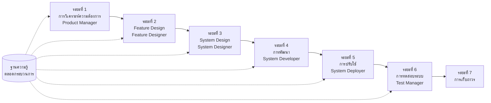

# SpecCrew คู่มือเริ่มต้นอย่างรวดเร็ว

<p align="center">
  <a href="./GETTING-STARTED.md">简体中文</a> |
  <a href="./GETTING-STARTED.zh-TW.md">繁體中文</a> |
  <a href="./GETTING-STARTED.en.md">English</a> |
  <a href="./GETTING-STARTED.ko.md">한국어</a> |
  <a href="./GETTING-STARTED.de.md">Deutsch</a> |
  <a href="./GETTING-STARTED.es.md">Español</a> |
  <a href="./GETTING-STARTED.fr.md">Français</a> |
  <a href="./GETTING-STARTED.it.md">Italiano</a> |
  <a href="./GETTING-STARTED.da.md">Dansk</a> |
  <a href="./GETTING-STARTED.ja.md">日本語</a> |
  <a href="./GETTING-STARTED.ar.md">العربية</a>
</p>

เอกสารนี้ช่วยให้คุณเข้าใจอย่างรวดเร็วว่าจะใช้ทีม Agent ของ SpecCrew เพื่อทำการพัฒนาที่สมบูรณ์จากความต้องการไปจนถึงการส่งมอบตามกระบวนการทางวิศวกรรมมาตรฐานได้อย่างไร

---

## 1. ข้อกำหนดเบื้องต้น

### ติดตั้ง SpecCrew

```bash
npm install -g speccrew
```

### เริ่มต้นโปรเจกต์

```bash
speccrew init --ide qoder
```

IDE ที่รองรับ: `qoder`, `cursor`, `claude`, `codex`

### โครงสร้างไดเรกทอรีหลังการเริ่มต้น

```
.
├── .qoder/
│   ├── agents/          # ไฟล์นิยาม Agents
│   └── skills/          # ไฟล์นิยาม Skills
├── speccrew-workspace/  # Workspace
│   ├── docs/            # การกำหนดค่า กฎ เทมเพลต โซลูชัน
│   ├── iterations/      # การทำซ้ำที่กำลังดำเนินอยู่
│   ├── iteration-archives/  # การทำซ้ำที่เก็บถาวรแล้ว
│   └── knowledges/      # ฐานความรู้
│       ├── base/        # ข้อมูลพื้นฐาน (รายงานการวินิจฉัย หนี้ทางเทคนิค)
│       ├── bizs/        # ฐานความรู้ธุรกิจ
│       └── techs/       # ฐานความรู้ทางเทคนิค
```

### ข้อมูลอ้างอิงด่วนคำสั่ง CLI

| คำสั่ง | คำอธิบาย |
|------|------|
| `speccrew list` | แสดงรายการ Agents และ Skills ทั้งหมดที่มี |
| `speccrew doctor` | ตรวจสอบความสมบูรณ์ของการติดตั้ง |
| `speccrew update` | อัพเดตการกำหนดค่าโปรเจกต์เป็นเวอร์ชันล่าสุด |
| `speccrew uninstall` | ถอนการติดตั้ง SpecCrew |

---

## 2. เริ่มต้นอย่างรวดเร็วใน 5 นาทีหลังการติดตั้ง

หลังจากเรียกใช้ `speccrew init` ให้ทำตามขั้นตอนเหล่านี้เพื่อเข้าสู่สถานะการทำงานอย่างรวดเร็ว:

### ขั้นตอนที่ 1: เลือก IDE ของคุณ

| IDE | คำสั่งเริ่มต้น | สถานการณ์การใช้งาน |
|-----|-----------|----------|
| **Qoder** (แนะนำ) | `speccrew init --ide qoder` | การประสานงาน agent แบบเต็ม พนักงานคู่ขนาน |
| **Cursor** | `speccrew init --ide cursor` | โฟลว์งานที่ใช้ Composer |
| **Claude Code** | `speccrew init --ide claude` | การพัฒนา CLI-first |
| **Codex** | `speccrew init --ide codex` | การบูรณาการระบบนิเวศ OpenAI |

### ขั้นตอนที่ 2: เริ่มต้นฐานความรู้ (แนะนำ)

สำหรับโปรเจกต์ที่มีซอร์สโค้ดอยู่แล้ว แนะนำให้เริ่มต้นฐานความรู้ก่อนเพื่อให้ agent เข้าใจ codebase ของคุณ:

```
@speccrew-team-leader เริ่มต้นฐานความรู้ทางเทคนิค
```

จากนั้น:

```
@speccrew-team-leader เริ่มต้นฐานความรู้ธุรกิจ
```

### ขั้นตอนที่ 3: เริ่มงานแรกของคุณ

```
@speccrew-product-manager ฉันมีความต้องการใหม่: [อธิบายความต้องการฟังก์ชันของคุณ]
```

> **เคล็ดลับ**: ถ้าไม่แน่ใจว่าจะทำอะไร แค่พูดว่า `@speccrew-team-leader ช่วยฉันเริ่มต้น` — Team Leader จะตรวจจับสถานะโปรเจกต์ของคุณโดยอัตโนมัติและแนะนำคุณ

---

## 3. ต้นไม้การตัดสินใจอย่างรวดเร็ว

ไม่แน่ใจว่าจะทำอะไร? หาสถานการณ์ของคุณด้านล่าง:

- **ฉันมีความต้องการฟังก์ชันใหม่**
  → `@speccrew-product-manager ฉันมีความต้องการใหม่: [อธิบายความต้องการฟังก์ชันของคุณ]`

- **ฉันต้องการสแกนความรู้ของโปรเจกต์ที่มีอยู่**
  → `@speccrew-team-leader เริ่มต้นฐานความรู้ทางเทคนิค`
  → จากนั้น: `@speccrew-team-leader เริ่มต้นฐานความรู้ธุรกิจ`

- **ฉันต้องการทำงานก่อนหน้าต่อ**
  → `@speccrew-team-leader ความคืบหน้าปัจจุบันคืออะไร?`

- **ฉันต้องการตรวจสอบสถานะสุขภาพของระบบ**
  → เรียกใช้ในเทอร์มินัล: `speccrew doctor`

- **ฉันไม่แน่ใจว่าจะทำอะไร**
  → `@speccrew-team-leader ช่วยฉันเริ่มต้น`
  → Team Leader จะตรวจจับสถานะโปรเจกต์ของคุณโดยอัตโนมัติและแนะนำคุณ

---

## 4. ข้อมูลอ้างอิงด่วน Agents

| บทบาท | Agent | ความรับผิดชอบ | ตัวอย่างคำสั่ง |
|------|-------|-----------------|-----------------|
| หัวหน้าทีม | `@speccrew-team-leader` | การนำทางโปรเจกต์ การเริ่มต้นฐานความรู้ การตรวจสอบสถานะ | "ช่วยฉันเริ่มต้น" |
| ผู้จัดการผลิตภัณฑ์ | `@speccrew-product-manager` | การวิเคราะห์ความต้องการ การสร้าง PRD | "ฉันมีความต้องการใหม่: ..." |
| นักออกแบบฟังก์ชัน | `@speccrew-feature-designer` | การวิเคราะห์ฟังก์ชัน การออกแบบข้อกำหนด สัญญา API | "เริ่มการออกแบบฟังก์ชันสำหรับการทำซ้ำ X" |
| นักออกแบบระบบ | `@speccrew-system-designer` | การออกแบบสถาปัตยกรรม การออกแบบแพลตฟอร์มโดยละเอียด | "เริ่มการออกแบบระบบสำหรับการทำซ้ำ X" |
| นักพัฒนาระบบ | `@speccrew-system-developer` | การประสานการพัฒนา การสร้างโค้ด | "เริ่มการพัฒนาสำหรับการทำซ้ำ X" |
| ผู้จัดการการทดสอบ | `@speccrew-test-manager` | การวางแผนการทดสอบ การออกแบบเคส การดำเนินการ | "เริ่มการทดสอบสำหรับการทำซ้ำ X" |

> **หมายเหตุ**: คุณไม่จำเป็นต้องจำ agents ทั้งหมด แค่คุยกับ `@speccrew-team-leader` และมันจะกำหนดเส้นทางคำขอของคุณไปยัง agent ที่ถูกต้อง

---

## 5. ภาพรวมโฟลว์งาน

### แผนภาพโฟลว์แบบเต็ม



### หลักการสำคัญ

1. **การพึ่งพาระยะ**: ผลผลิตของแต่ละระยะคืออินพุตสำหรับระยะถัดไป
2. **การยืนยัน Checkpoint**: แต่ละระยะมีจุดยืนยันที่ต้องได้รับการอนุมัติจากผู้ใช้ก่อนจึงจะไปต่อไประยะถัดไป
3. **ขับเคลื่อนด้วยฐานความรู้**: ฐานความรู้ดำเนินการตลอดกระบวนการ ให้บริบทสำหรับทุกระยะ

---

## 6. ขั้นตอนที่ศูนย์: การเริ่มต้นฐานความรู้

ก่อนเริ่มกระบวนการทางวิศวกรรมอย่างเป็นทางการ คุณต้องเริ่มต้นฐานความรู้ของโปรเจกต์

### 6.1 การเริ่มต้นฐานความรู้ทางเทคนิค

**ตัวอย่างบทสนทนา**:
```
@speccrew-team-leader เริ่มต้นฐานความรู้ทางเทคนิค
```

**กระบวนการสามระยะ**:
1. การตรวจจับแพลตฟอร์ม — ระบุแพลตฟอร์มทางเทคนิคในโปรเจกต์
2. การสร้างเอกสารทางเทคนิค — สร้างเอกสารข้อกำหนดทางเทคนิคสำหรับแต่ละแพลตฟอร์ม
3. การสร้างดัชนี — สร้างดัชนีฐานความรู้

**ผลลัพธ์**:
```
speccrew-workspace/knowledges/techs/{platform-id}/
├── tech-stack.md          # นิยามสแต็กเทคโนโลยี
├── architecture.md        # ข้อตกลงสถาปัตยกรรม
├── dev-spec.md            # ข้อกำหนดการพัฒนา
├── test-spec.md           # ข้อกำหนดการทดสอบ
└── INDEX.md               # ไฟล์ดัชนี
```

### 6.2 การเริ่มต้นฐานความรู้ธุรกิจ

**ตัวอย่างบทสนทนา**:
```
@speccrew-team-leader เริ่มต้นฐานความรู้ธุรกิจ
```

**กระบวนการสี่ระยะ**:
1. สินค้าคงคลังฟังก์ชัน — สแกนโค้ดเพื่อระบุฟังก์ชันทั้งหมด
2. การวิเคราะห์ฟังก์ชัน — วิเคราะห์ลอจิกธุรกิจสำหรับแต่ละฟังก์ชัน
3. สรุปโมดูล — สรุปฟังก์ชันตามโมดูล
4._summary ระบบ — สร้างภาพรวมธุรกิจระดับระบบ

**ผลลัพธ์**:
```
speccrew-workspace/knowledges/bizs/
├── {platform-type}/
│   └── {module-name}/
│       └── feature-spec.md
└── system-overview.md
```

---

[ต่อด้วยส่วนที่ 7-11 ทั้งหมด...]
