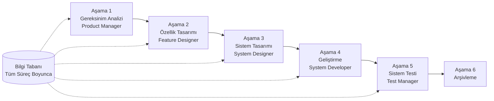

# SpecCrew - Hızlı Başlangıç Kılavuzu

<p align="center">
  <a href="./GETTING-STARTED.md">简体中文</a> |
  <a href="./GETTING-STARTED.zh-TW.md">繁體中文</a> |
  <a href="./GETTING-STARTED.en.md">English</a> |
  <a href="./GETTING-STARTED.ko.md">한국어</a> |
  <a href="./GETTING-STARTED.de.md">Deutsch</a> |
  <a href="./GETTING-STARTED.es.md">Español</a> |
  <a href="./GETTING-STARTED.fr.md">Français</a> |
  <a href="./GETTING-STARTED.it.md">Italiano</a> |
  <a href="./GETTING-STARTED.da.md">Dansk</a> |
  <a href="./GETTING-STARTED.ja.md">日本語</a> |
  <a href="./GETTING-STARTED.ar.md">العربية</a> |
  <a href="./GETTING-STARTED.tr.md">Türkçe</a>
</p>

Bu belge, standart mühendislik süreçlerini takip ederek gereksinimlerden teslimata kadar tam geliştirme döngüsünü tamamlamak için SpecCrew Ajan ekibini nasıl kullanacağınızı hızlıca anlamanıza yardımcı olur.

---

## 1. Ön Koşullar

### SpecCrew Kurulumu

```bash
npm install -g speccrew
```

### Projeyi Başlatma

```bash
speccrew init --ide qoder
```

Desteklenen IDE'ler: `qoder`, `cursor`, `claude`, `codex`

### Başlatma Sonrası Dizin Yapısı

```
.
├── .qoder/
│   ├── agents/          # Ajan tanım dosyaları
│   └── skills/          # Beceri tanım dosyaları
├── speccrew-workspace/  # Çalışma alanı
│   ├── docs/            # Yapılandırmalar, kurallar, şablonlar, çözümler
│   ├── iterations/      # Mevcut iterasyonlar
│   ├── iteration-archives/  # Arşivlenmiş iterasyonlar
│   └── knowledges/      # Bilgi tabanı
│       ├── base/        # Temel bilgiler (teşhis raporları, teknik borçlar)
│       ├── bizs/        # İş bilgi tabanı
│       └── techs/       # Teknik bilgi tabanı
```

### CLI Komut Hızlı Başvurusu

| Komut | Açıklama |
|---------|-------------|
| `speccrew list` | Mevcut tüm Ajanları ve Becerileri listele |
| `speccrew doctor` | Kurulum bütünlüğünü kontrol et |
| `speccrew update` | Proje yapılandırmasını en son sürüme güncelle |
| `speccrew uninstall` | SpecCrew'ı kaldır |

---

## 2. İş Akışı Genel Bakış

### Tam Akış Diyagramı



### Temel İlkeler

1. **Aşama Bağımlılıkları**: Her aşamanın çıktısı bir sonraki aşamanın girdisidir
2. **Kontrol Noktası Onayı**: Her aşama, devam etmeden önce kullanıcı onayı gerektiren bir onay noktasına sahiptir
3. **Bilgi Tabanı Güdümlü**: Bilgi tabanı tüm süreç boyunca ilerler, tüm aşamalar için bağlam sağlar

---

## 3. Sıfırıncı Adım: Bilgi Tabanı Başlatma

Resmi mühendislik sürecini başlatmadan önce proje bilgi tabanını başlatmanız gerekir.

### 3.1 Teknik Bilgi Tabanı Başlatma

**Örnek Konuşma**:
```
@speccrew-team-leader teknik bilgi tabanını başlat
```

**Üç Aşamalı Süreç**:
1. Platform Tespiti — Projedeki teknoloji platformlarını tanımla
2. Teknik Dokümantasyon Üretimi — Her platform için teknik özellik belgeleri oluştur
3. İndeks Üretimi — Bilgi tabanı indeksini oluştur

**Çıktı**:
```
speccrew-workspace/knowledges/techs/{platform-id}/
├── tech-stack.md          # Teknoloji yığını tanımı
├── architecture.md        # Mimari kurallar
├── dev-spec.md            # Geliştirme özellikleri
├── test-spec.md           # Test özellikleri
└── INDEX.md               # İndeks dosyası
```

### 3.2 İş Bilgi Tabanı Başlatma

**Örnek Konuşma**:
```
@speccrew-team-leader iş bilgi tabanını başlat
```

**Dört Aşamalı Süreç**:
1. Özellik Envanteri — Tüm özellikleri tanımlamak için kodu tara
2. Özellik Analizi — Her özelliğin iş mantığını analiz et
3. Modül Özeti — Özellikleri modüllere göre özetle
4. Sistem Özeti — Sistem seviyesinde iş genel görünümü oluştur

**Çıktı**:
```
speccrew-workspace/knowledges/bizs/
├── {platform-type}/
│   └── {module-name}/
│       └── feature-spec.md
└── system-overview.md
```

---

## 4. Aşama Aşama Konuşma Kılavuzu

### 4.1 Aşama 1: Gereksinim Analizi (Product Manager)

**Nasıl Başlatılır**:
```
@speccrew-product-manager yeni bir gereksinimim var: [gereksiniminizi açıklayın]
```

**Ajan İş Akışı**:
1. Mevcut modülleri anlamak için sistem genel görünümünü oku
2. Kullanıcı gereksinimlerini analiz et
3. Yapılandırılmış PRD belgesi oluştur

**Çıktı**:
```
iterations/{numara}-{tip}-{isim}/01.product-requirement/
├── [feature-name]-prd.md           # Ürün Gereksinim Belgesi
└── [feature-name]-bizs-modeling.md # İş modelleme (karmaşık gereksinimler için)
```

**Onay Kontrol Listesi**:
- [ ] Gereksinim açıklaması kullanıcı niyetini doğru şekilde yansıtıyor mu?
- [ ] İş kuralları eksiksiz mi?
- [ ] Mevcut sistemlerle entegrasyon noktaları net mi?
- [ ] Kabul kriterleri ölçülebilir mi?

---

### 4.2 Aşama 2: Özellik Tasarımı (Feature Designer)

**Nasıl Başlatılır**:
```
@speccrew-feature-designer özellik tasarımına başla
```

**Ajan İş Akışı**:
1. Onaylanmış PRD belgesini otomatik olarak bul
2. İş bilgi tabanını yükle
3. Özellik tasarımı oluştur (UI wireframe'leri, etkileşim akışları, veri tanımları, API sözleşmeleri dahil)
4. Birden fazla PRD için paralel tasarım için Task Worker kullan

**Çıktı**:
```
iterations/{iter}/02.feature-design/
└── [feature-name]-feature-spec.md  # Özellik tasarım belgesi
```

**Onay Kontrol Listesi**:
- [ ] Tüm kullanıcı senaryoları kapsanıyor mu?
- [ ] Etkileşim akışları net mi?
- [ ] Veri alanı tanımları eksiksiz mi?
- [ ] İstisna yönetimi kapsamlı mı?

---

### 4.3 Aşama 3: Sistem Tasarımı (System Designer)

**Nasıl Başlatılır**:
```
@speccrew-system-designer sistem tasarımına başla
```

**Ajan İş Akışı**:
1. Feature Spec ve API Contract'ı bul
2. Teknik bilgi tabanını yükle (teknoloji yığını, mimari, her platform için özellikler)
3. **Kontrol Noktası A**: Çerçeve Değerlendirmesi — Teknik boşlukları analiz et, yeni çerçeveler öner (gerekirse), kullanıcı onayını bekle
4. DESIGN-OVERVIEW.md oluştur
5. Her platform için paralel tasarım dağıtımı için Task Worker kullan (frontend/backend/mobil/masaüstü)
6. **Kontrol Noktası B**: Ortak Onay — Tüm platform tasarımlarının özetini göster, kullanıcı onayını bekle

**Çıktı**:
```
iterations/{iter}/03.system-design/
├── DESIGN-OVERVIEW.md              # Tasarım genel görünümü
├── {platform-id}/
│   ├── INDEX.md                    # Platform tasarım indeksi
│   └── {module}-design.md          # Sözde kod seviyesinde modül tasarımı
```

**Onay Kontrol Listesi**:
- [ ] Sözde kod gerçek çerçeve sözdizimi kullanıyor mu?
- [ ] Platformlar arası API sözleşmeleri tutarlı mı?
- [ ] Hata işleme stratejisi birleşik mi?

---

### 4.4 Aşama 4: Geliştirme Uygulaması (System Developer)

**Nasıl Başlatılır**:
```
@speccrew-system-developer geliştirmeye başla
```

**Ajan İş Akışı**:
1. Sistem tasarım belgelerini oku
2. Her platform için teknik bilgiyi yükle
3. **Kontrol Noktası A**: Ortam Ön Doğrulaması — Runtime sürümlerini, bağımlılıkları, hizmet kullanılabilirliğini doğrula; başarısız olursa kullanıcı çözümünü bekle
4. Her platform için paralel geliştirme dağıtımı için Task Worker kullan
5. Entegrasyon doğrulaması: API sözleşme hizalaması, veri tutarlılığı
6. Teslim raporu oluştur

**Çıktı**:
```
# Kaynak kodu projenin gerçek kaynak kodu dizinine yazılır
iterations/{iter}/04.development/
├── {platform-id}/
│   └── tasks/                      # Geliştirme görev kayıtları
└── delivery-report.md
```

**Onay Kontrol Listesi**:
- [ ] Ortam hazır mı?
- [ ] Entegrasyon sorunları kabul edilebilir aralıkta mı?
- [ ] Kod geliştirme özelliklerine uygun mu?

---

### 4.5 Aşama 5: Sistem Testi (Test Manager)

**Nasıl Başlatılır**:
```
@speccrew-test-manager teste başla
```

**Üç Aşamalı Test Süreci**:

| Aşama | Açıklama | Kontrol Noktası |
|------|----------|-------------------|
| Test Senaryosu Tasarımı | PRD ve Feature Spec'e dayalı test senaryoları oluştur | A: Senaryo kapsam istatistiklerini ve izlenebilirlik matrisini göster, yeterli kapsam için kullanıcı onayını bekle |
| Test Kodu Üretimi | Yürütülebilir test kodu oluştur | B: Oluşturulan test dosyalarını ve senaryo eşlemesini göster, kullanıcı onayını bekle |
| Test Yürütme ve Hata Raporu | Testleri otomatik olarak yürüt ve raporlar oluştur | Yok (otomatik yürütme) |

**Çıktı**:
```
iterations/{iter}/05.system-test/
├── cases/
│   └── {platform-id}/              # Test senaryosu belgeleri
├── code/
│   └── {platform-id}/              # Test kodu planı
├── reports/
│   └── test-report-{date}.md       # Test raporu
└── bugs/
    └── BUG-{id}-{title}.md         # Hata raporları (hata başına bir dosya)
```

**Onay Kontrol Listesi**:
- [ ] Senaryo kapsamı eksiksiz mi?
- [ ] Test kodu yürütülebilir mi?
- [ ] Hata önem değerlendirmesi doğru mu?

---

### 4.6 Aşama 6: Arşivleme

İterasyonlar tamamlandığında otomatik olarak arşivlenir:

```
speccrew-workspace/iteration-archives/
└── {numara}-{tip}-{isim}-{tarih}/
    ├── 01.product-requirement/
    ├── 02.feature-design/
    ├── 03.system-design/
    ├── 04.development/
    └── 05.system-test/
```

---

## 5. Bilgi Tabanı Genel Bakış

### 5.1 İş Bilgi Tabanı (bizs)

**Amaç**: Projenin iş fonksiyon açıklamalarını, modül bölümlerini, API özelliklerini saklamak

**Dizin Yapısı**:
```
knowledges/bizs/
├── {platform-type}/
│   └── {module-name}/
│       └── feature-spec.md
└── system-overview.md
```

**Kullanım Senaryoları**: Product Manager, Feature Designer

### 5.2 Teknik Bilgi Tabanı (techs)

**Amaç**: Projenin teknoloji yığınını, mimari kurallarını, geliştirme özelliklerini, test özelliklerini saklamak

**Dizin Yapısı**:
```
knowledges/techs/{platform-id}/
├── tech-stack.md
├── architecture.md
├── dev-spec.md
├── test-spec.md
└── INDEX.md
```

**Kullanım Senaryoları**: System Designer, System Developer, Test Manager

---

## 6. İş Akışı İlerleme Yönetimi

SpecCrew sanal ekibi, bir sonraki aşamaya geçmeden önce her aşamanın kullanıcı tarafından onaylanması gereken katı bir aşama-geçit mekanizması izler. Ayrıca devam ettirilebilir yürütme desteği sunar — kesinti sonrası yeniden başlatıldığında, kaldığı yerden otomatik olarak devam eder.

### 6.1 Üç Katmanlı İlerleme Dosyaları

İş akışı, iterasyon dizininde bulunan üç tür JSON ilerleme dosyasını otomatik olarak yönetir:

| Dosya | Konum | Amaç |
|-------|-------|------|
| `WORKFLOW-PROGRESS.json` | `iterations/{iter}/` | Her boru hattı aşamasının durumunu kaydeder |
| `.checkpoints.json` | Her aşama dizini altında | Kullanıcı kontrol noktası onay durumunu kaydeder |
| `DISPATCH-PROGRESS.json` | Her aşama dizini altında | Paralel görevler için öğe bazında ilerlemeyi kaydeder (çoklu platform/çoklu modül) |

### 6.2 Aşama Durum Akışı

Her aşama bu durum akışını izler:

```
pending → in_progress → completed → confirmed
```

- **pending**: Henüz başlamadı
- **in_progress**: Şu anda yürütülüyor
- **completed**: Ajan yürütmesi tamamlandı, kullanıcı onayı bekleniyor
- **confirmed**: Kullanıcı son kontrol noktası üzerinden onayladı, bir sonraki aşama başlayabilir

### 6.3 Devam Ettirilebilir Yürütme

Bir aşama için Ajan yeniden başlatıldığında:

1. **Otomatik yukarı akış kontrolü**: Önceki aşamanın onaylanıp onaylanmadığını doğrular, değilse engeller ve uyarır
2. **Kontrol noktası kurtarma**: `.checkpoints.json` dosyasını okur, geçilen kontrol noktalarını atlar, son kesinti noktasından devam eder
3. **Paralel görev kurtarma**: `DISPATCH-PROGRESS.json` dosyasını okur, yalnızca `pending` veya `failed` durumundaki görevleri yeniden yürütür, `completed` görevleri atlar

### 6.4 Mevcut İlerlemeyi Görüntüleme

Takım Lideri Ajanı üzerinden boru hattı panoramik durumunu görüntüleyin:

```
@speccrew-team-leader mevcut iterasyon ilerlemesini görüntüle
```

Takım Lideri ilerleme dosyalarını okuyacak ve aşağıdakine benzer bir durum özeti görüntüleyecektir:

```
Pipeline Status: i001-user-management
  01 PRD:            ✅ Confirmed
  02 Feature Design: 🔄 In Progress (Checkpoint A passed)
  03 System Design:  ⏳ Pending
  04 Development:    ⏳ Pending
  05 System Test:    ⏳ Pending
```

### 6.5 Geriye Dönük Uyumluluk

İlerleme dosyası mekanizması tamamen geriye dönük uyumludur — ilerleme dosyaları mevcut değilse (örneğin, eski projelerde veya yeni iterasyonlarda), tüm Ajanlar orijinal mantığa göre normal şekilde yürütülecektir.

---

## 7. Sıkça Sorulan Sorular (SSS)

### S1: Ajan beklendiği gibi çalışmazsa ne yapmalıyım?

1. Kurulum bütünlüğünü kontrol etmek için `speccrew doctor` çalıştırın
2. Bilgi tabanının başlatıldığını onaylayın
3. Önceki aşamanın çıktısının mevcut iterasyon dizininde olduğunu onaylayın

### S2: Bir aşamayı nasıl atlarım?

**Önerilmez** — Her aşamanın çıktısı bir sonraki aşamanın girdisidir.

Atlamanız gerekirse, ilgili aşamanın giriş belgesini manuel olarak hazırlayın ve format özelliklerine uygun olduğundan emin olun.

### S3: Birden fazla paralel gereksinimi nasıl yönetirim?

Her gereksinim için bağımsız iterasyon dizinleri oluşturun:
```
iterations/
├── 001-feature-xxx/
├── 002-feature-yyy/
└── 003-feature-zzz/
```

Her iterasyon tamamen izole edilmiştir ve diğerlerini etkilemez.

### S4: SpecCrew sürümünü nasıl güncellerim?

Güncelleme iki adım gerektirir:

```bash
# Adım 1: Global CLI aracını güncelle
npm install -g speccrew@latest

# Adım 2: Proje dizininizdeki Ajan ve Becerileri senkronize et
cd /path/to/your-project
speccrew update
```

- `npm install -g speccrew@latest`: CLI aracının kendisini günceller (yeni sürümler yeni Ajan/Beceri tanımları, hata düzeltmeleri vb. içerebilir)
- `speccrew update`: Projenizdeki Ajan ve Beceri tanım dosyalarını en son sürüme senkronize eder
- `speccrew update --ide cursor`: Yalnızca belirli bir IDE için yapılandırmayı günceller

> **Not**: Her iki adım da gereklidir. Yalnızca `speccrew update` çalıştırmak CLI aracının kendisini güncellemez; yalnızca `npm install` çalıştırmak proje dosyalarını güncellemez.

### S5: `speccrew update` yeni sürüm gösteriyor ancak kurulumdan sonra hala eski sürüm?

Genellikle npm önbelleğinden kaynaklanır. Çözüm:
```bash
npm cache clean --force
npm install -g speccrew@latest
npm list -g speccrew
```
Hala çalışmazsa, belirli bir sürüm yükleyin:
```bash
npm install -g speccrew@0.5.6
```

### S6: Geçmiş iterasyonları nasıl görüntülerim?

Arşivledikten sonra `speccrew-workspace/iteration-archives/` içinde inceleyin, `{numara}-{tip}-{isim}-{tarih}/` formatında düzenlenmiştir.

### S7: Bilgi tabanının düzenli olarak güncellenmesi gerekiyor mu?

Aşağıdaki durumlarda yeniden başlatma gerekir:
- Proje yapısında önemli değişiklikler
- Teknoloji yığını güncellemesi veya değişimi
- İş modülü ekleme/kaldırma

---

## 8. Hızlı Referans

### Ajan Başlatma Hızlı Referansı

| Aşama | Ajan | Başlangıç Konuşması |
|------|-------|-------------------|
| Başlatma | Team Leader | `@speccrew-team-leader teknik bilgi tabanını başlat` |
| Gereksinim Analizi | Product Manager | `@speccrew-product-manager yeni bir gereksinimim var: [açıklama]` |
| Özellik Tasarımı | Feature Designer | `@speccrew-feature-designer özellik tasarımına başla` |
| Sistem Tasarımı | System Designer | `@speccrew-system-designer sistem tasarımına başla` |
| Geliştirme | System Developer | `@speccrew-system-developer geliştirmeye başla` |
| Sistem Testi | Test Manager | `@speccrew-test-manager teste başla` |

### Kontrol Noktaları Kontrol Listesi

| Aşama | Kontrol Noktası Sayısı | Temel Doğrulama Öğeleri |
|------|------------------------|------------------------|
| Gereksinim Analizi | 1 | Gereksinim doğruluğu, iş kuralları eksiksizliği, kabul kriterleri ölçülebilirliği |
| Özellik Tasarımı | 1 | Senaryo kapsamı, etkileşim netliği, veri eksiksizliği, istisna yönetimi |
| Sistem Tasarımı | 2 | A: Çerçeve değerlendirmesi; B: Sözde kod sözdizimi, platformlar arası tutarlılık, hata işleme |
| Geliştirme | 1 | A: Ortam hazırlığı, entegrasyon sorunları, kod özellikleri |
| Sistem Testi | 2 | A: Senaryo kapsamı; B: Test kodu yürütülebilirliği |

### Çıktı Yolları Hızlı Referansı

| Aşama | Çıktı Dizini | Dosya Formatı |
|------|------------------|-------------|
| Gereksinim Analizi | `iterations/{iter}/01.product-requirement/` | `[name]-prd.md`, `[name]-bizs-modeling.md` |
| Özellik Tasarımı | `iterations/{iter}/02.feature-design/` | `[name]-feature-spec.md` |
| Sistem Tasarımı | `iterations/{iter}/03.system-design/` | `DESIGN-OVERVIEW.md`, `{platform}/INDEX.md`, `{platform}/{module}-design.md` |
| Geliştirme | `iterations/{iter}/04.development/` | Kaynak kod + `delivery-report.md` |
| Sistem Testi | `iterations/{iter}/05.system-test/` | `cases/`, `code/`, `reports/`, `bugs/` |
| Arşivleme | `iteration-archives/{iter}-{tarih}/` | İterasyonun tam kopyası |

---

## Sonraki Adımlar

1. Projenizi başlatmak için `speccrew init --ide qoder` çalıştırın
2. Sıfırıncı Adımı uygulayın: Bilgi Tabanı Başlatma
3. İş akışını takip ederek her aşamada ilerleyin, şart odaklı geliştirme deneyiminin keyfini çıkarın!
