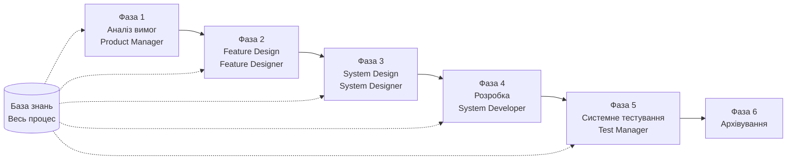

# Посібник швидкого запуску SpecCrew

<p align="center">
  <a href="./GETTING-STARTED.md">简体中文</a> |
  <a href="./GETTING-STARTED.zh-TW.md">繁體中文</a> |
  <a href="./GETTING-STARTED.en.md">English</a> |
  <a href="./GETTING-STARTED.ko.md">한국어</a> |
  <a href="./GETTING-STARTED.de.md">Deutsch</a> |
  <a href="./GETTING-STARTED.es.md">Español</a> |
  <a href="./GETTING-STARTED.fr.md">Français</a> |
  <a href="./GETTING-STARTED.it.md">Italiano</a> |
  <a href="./GETTING-STARTED.da.md">Dansk</a> |
  <a href="./GETTING-STARTED.ja.md">日本語</a> |
  <a href="./GETTING-STARTED.ar.md">العربية</a>
</p>

Цей документ допоможе вам швидко зрозуміти, як використовувати команду Agent SpecCrew для завершення повної розробки від вимог до поставки відповідно до стандартних інженерних процесів.

---

## 1. Передумови

### Встановлення SpecCrew

```bash
npm install -g speccrew
```

### Ініціалізація проекту

```bash
speccrew init --ide qoder
```

Підтримувані IDE: `qoder`, `cursor`, `claude`, `codex`

### Структура каталогів після ініціалізації

```
.
├── .qoder/
│   ├── agents/          # Файли визначення Agents
│   └── skills/          # Файли визначення Skills
├── speccrew-workspace/  # Workspace
│   ├── docs/            # Конфігурації, правила, шаблони, рішення
│   ├── iterations/      # Поточні ітерації
│   ├── iteration-archives/  # Архівовані ітерації
│   └── knowledges/      # База знань
│       ├── base/        # Базова інформація (звіти діагностики, технічний борг)
│       ├── bizs/        # Бізнес-база знань
│       └── techs/       # Технічна база знань
```

### Коротка довідка командам CLI

| Команда | Опис |
|------|------|
| `speccrew list` | Список всіх доступних Agents та Skills |
| `speccrew doctor` | Перевірка цілісності встановлення |
| `speccrew update` | Оновлення конфігурації проекту до останньої версії |
| `speccrew uninstall` | Видалення SpecCrew |

---

## 2. Швидкий старт за 5 хвилин після встановлення

Після виконання `speccrew init` виконайте наступні кроки для швидкого переходу в робочий стан:

### Крок 1: Оберіть вашу IDE

| IDE | Команда ініціалізації | Сценарій застосування |
|-----|-----------|----------|
| **Qoder** (Рекомендується) | `speccrew init --ide qoder` | Повна оркестрація агентів, паралельні workers |
| **Cursor** | `speccrew init --ide cursor` | Робочі процеси на основі Composer |
| **Claude Code** | `speccrew init --ide claude` | Розробка CLI-first |
| **Codex** | `speccrew init --ide codex` | Інтеграція екосистеми OpenAI |

### Крок 2: Ініціалізація бази знань (Рекомендується)

Для проектів з існуючим вихідним кодом рекомендується спочатку ініціалізувати базу знань, щоб агенти розуміли вашу кодову базу:

```
@speccrew-team-leader ініціалізувати технічну базу знань
```

Потім:

```
@speccrew-team-leader ініціалізувати бізнес-базу знань
```

### Крок 3: Почніть ваше перше завдання

```
@speccrew-product-manager У мене нова вимога: [опишіть вашу функціональну вимогу]
```

> **Порада**: Якщо ви не впевнені, що робити, просто скажіть `@speccrew-team-leader допоможіть мені почати` — Team Leader автоматично визначить статус вашого проекту і направить вас.

---

## 3. Швидке дерево рішень

Не впевнені, що робити? Знайдіть ваш сценарій нижче:

- **У мене нова функціональна вимога**
  → `@speccrew-product-manager У мене нова вимога: [опишіть вашу функціональну вимогу]`

- **Я хочу сканувати знання існуючого проекту**
  → `@speccrew-team-leader ініціалізувати технічну базу знань`
  → Потім: `@speccrew-team-leader ініціалізувати бізнес-базу знань`

- **Я хочу продовжити попередню роботу**
  → `@speccrew-team-leader який поточний прогрес?`

- **Я хочу перевірити стан здоров'я системи**
  → Виконати в терміналі: `speccrew doctor`

- **Я не впевнений, що робити**
  → `@speccrew-team-leader допоможіть мені почати`
  → Team Leader автоматично визначить статус вашого проекту і направить вас

---

## 4. Коротка довідка по Agents

| Роль | Agent | Обов'язки | Приклад команди |
|------|-------|-----------------|-----------------|
| Лідер команди | `@speccrew-team-leader` | Навігація по проекту, ініціалізація бази знань, перевірка статусу | "Допоможіть мені почати" |
| Менеджер продукту | `@speccrew-product-manager` | Аналіз вимог, генерація PRD | "У мене нова вимога: ..." |
| Дизайнер функцій | `@speccrew-feature-designer` | Аналіз функцій, проектування специфікацій, API контракти | "Почати проектування функцій для ітерації X" |
| Системний дизайнер | `@speccrew-system-designer` | Проектування архітектури, детальне проектування платформи | "Почати системне проектування для ітерації X" |
| Системний розробник | `@speccrew-system-developer` | Координація розробки, генерація коду | "Почати розробку для ітерації X" |
| Менеджер тестування | `@speccrew-test-manager` | Планування тестування, проектування випадків, виконання | "Почати тестування для ітерації X" |

> **Примітка**: Вам не потрібно запам'ятовувати всіх агентів. Просто поговоріть з `@speccrew-team-leader`, і він направить ваш запит до правильного агента.

---

## 5. Огляд робочого процесу

### Повна діаграма потоку



### Основні принципи

1. **Залежності фаз**: Результат кожної фази є входом для наступної фази
2. **Підтвердження checkpoint**: Кожна фаза має точку підтвердження, що вимагає затвердження користувача перед переходом до наступної фази
3. **Керовано базою знань**: База знань проходить через весь процес, надаючи контекст для всіх фаз

---

## 6. Крок нуль: Ініціалізація бази знань

Перед початком формального інженерного процесу необхідно ініціалізувати базу знань проекту.

### 6.1 Ініціалізація технічної бази знань

**Приклад розмови**:
```
@speccrew-team-leader ініціалізувати технічну базу знань
```

**Трьофазний процес**:
1. Виявлення платформи — Ідентифікація технічних платформ в проекті
2. Генерація технічної документації — Генерація документів технічних специфікацій для кожної платформи
3. Генерація індексу — Створення індексу бази знань

**Результат**:
```
speccrew-workspace/knowledges/techs/{platform-id}/
├── tech-stack.md          # Визначення технологічного стеку
├── architecture.md        # Архітектурні угоди
├── dev-spec.md            # Специфікації розробки
├── test-spec.md           # Специфікації тестування
└── INDEX.md               # Файл індексу
```

### 6.2 Ініціалізація бізнес-бази знань

**Приклад розмови**:
```
@speccrew-team-leader ініціалізувати бізнес-базу знань
```

**Чотирьохфазний процес**:
1. Інвентаризація функцій — Сканування коду для ідентифікації всіх функцій
2. Аналіз функцій — Аналіз бізнес-логіки для кожної функції
3. Зведення по модулю — Зведення функцій по модулю
4. Системне зведення — Генерація бізнес-огляду на рівні системи

**Результат**:
```
speccrew-workspace/knowledges/bizs/
├── {platform-type}/
│   └── {module-name}/
│       └── feature-spec.md
└── system-overview.md
```

---

## 7. Покроковий посібник по розмові

### 7.1 Фаза 1: Аналіз вимог (Product Manager)

**Як почати**:
```
@speccrew-product-manager У мене нова вимога: [опишіть вашу вимогу]
```

**Робочий процес Agent**:
1. Прочитати огляд системи для розуміння існуючих модулів
2. Аналізувати вимоги користувача
3. Згенерувати структурований документ PRD

**Результат**:
```
iterations/{номер}-{тип}-{ім'я}/01.product-requirement/
├── [feature-name]-prd.md           # Документ вимог продукту
└── [feature-name]-bizs-modeling.md # Бізнес-моделювання (для складних вимог)
```

**Контрольний список підтвердження**:
- [ ] Опис вимоги точно відображає намір користувача?
- [ ] Бізнес-правила повні?
- [ ] Точки інтеграції з існуючими системами ясні?
- [ ] Критерії прийнятності вимірювані?

---

### 7.2 Фаза 2: Feature Design (Feature Designer)

**Як почати**:
```
@speccrew-feature-designer почати feature design
```

**Робочий процес Agent**:
1. Автоматично знайти підтверджений документ PRD
2. Завантажити бізнес-базу знань
3. Згенерувати feature design (включаючи UI wireframes, потоки взаємодії, визначення даних, API контракти)
4. Для кількох PRD використовувати Task Worker для паралельного проектування

**Результат**:
```
iterations/{iter}/02.feature-design/
└── [feature-name]-feature-spec.md  # Документ feature design
```

**Контрольний список підтвердження**:
- [ ] Всі користувацькі сценарії покриті?
- [ ] Потоки взаємодії ясні?
- [ ] Визначення полів даних повні?
- [ ] Обробка винятків комплексна?

---

### 7.3 Фаза 3: System Design (System Designer)

**Як почати**:
```
@speccrew-system-designer почати system design
```

**Робочий процес Agent**:
1. Знайти Feature Spec та API Contract
2. Завантажити технічну базу знань (технологічний стек, архітектура, специфікації для кожної платформи)
3. **Checkpoint A**: Оцінка framework — Аналіз технічних прогалин, рекомендація нових frameworks (якщо необхідно), очікування підтвердження користувача
4. Згенерувати DESIGN-OVERVIEW.md
5. Використовувати Task Worker для паралельного розподілу проектування для кожної платформи (frontend/backend/mobile/desktop)
6. **Checkpoint B**: Спільне підтвердження — Показати зведення всіх дизайнів платформ, очікування підтвердження користувача

**Результат**:
```
iterations/{iter}/03.system-design/
├── DESIGN-OVERVIEW.md              # Огляд дизайну
├── {platform-id}/
│   ├── INDEX.md                    # Індекс дизайну платформи
│   └── {module}-design.md          # Проектування модуля рівня pseudocode
```

**Контрольний список підтвердження**:
- [ ] Pseudocode використовує фактичний синтаксис framework?
- [ ] Крос-платформні API контракти узгоджені?
- [ ] Стратегія обробки помилок єдина?

---

### 7.4 Фаза 4: Розробка (System Developer)

**Як почати**:
```
@speccrew-system-developer почати розробку
```

**Робочий процес Agent**:
1. Прочитати документи системного дизайну
2. Завантажити технічні знання для кожної платформи
3. **Checkpoint A**: Попередня перевірка середовища — Перевірити версії runtime, залежності, доступність сервісів; очікувати рішення користувача при збої
4. Використовувати Task Worker для паралельного розподілу розробки для кожної платформи
5. Перевірка інтеграції: вирівнювання API контрактів, узгодженість даних
6. Сформувати звіт про поставку

**Результат**:
```
# Вихідний код записується в фактичний каталог вихідного коду проекту
iterations/{iter}/04.development/
├── {platform-id}/
│   └── tasks/                      # Записи задач розробки
└── delivery-report.md
```

**Контрольний список підтвердження**:
- [ ] Середовище готове?
- [ ] Проблеми інтеграції в прийнятному діапазоні?
- [ ] Код відповідає специфікаціям розробки?

---

### 7.5 Фаза 5: Системне тестування (Test Manager)

**Як почати**:
```
@speccrew-test-manager почати тестування
```

**Трьофазний процес тестування**:

| Фаза | Опис | Checkpoint |
|-------|-------------|------------|
| Проектування тестових випадків | Генерація тестових випадків на основі PRD та Feature Spec | A: Показати статистику покриття випадків та матрицю трасування, очікування підтвердження користувачем достатнього покриття |
| Генерація тестового коду | Генерація виконуваного тестового коду | B: Показати згенеровані тестові файли та відображення випадків, очікування підтвердження користувача |
| Виконання тестів та звіти про помилки | Автоматичне виконання тестів та генерація звітів | Немає (автоматичне виконання) |

**Результат**:
```
iterations/{iter}/05.system-test/
├── cases/
│   └── {platform-id}/              # Документи тестових випадків
├── code/
│   └── {platform-id}/              # План тестового коду
├── reports/
│   └── test-report-{date}.md       # Звіт про тестування
└── bugs/
    └── BUG-{id}-{title}.md         # Звіти про помилки (один файл на помилку)
```

**Контрольний список підтвердження**:
- [ ] Покриття випадків повне?
- [ ] Тестовий код виконуваний?
- [ ] Оцінка серйозності помилок точна?

---

### 7.6 Фаза 6: Архівування

Ітерації автоматично архівуються після завершення:

```
speccrew-workspace/iteration-archives/
└── {номер}-{тип}-{ім'я}-{дата}/
    ├── 01.product-requirement/
    ├── 02.feature-design/
    ├── 03.system-design/
    ├── 04.development/
    └── 05.system-test/
```

---

## 8. Огляд бази знань

### 8.1 Бізнес-база знань (bizs)

**Призначення**: Зберігання описів бізнес-функцій проекту, поділу на модулі, характеристик API

**Структура каталогів**:
```
knowledges/bizs/
├── {platform-type}/
│   └── {module-name}/
│       └── feature-spec.md
└── system-overview.md
```

**Сценарії використання**: Product Manager, Feature Designer

### 8.2 Технічна база знань (techs)

**Призначення**: Зберігання технологічного стеку проекту, архітектурних угод, специфікацій розробки, специфікацій тестування

**Структура каталогів**:
```
knowledges/techs/{platform-id}/
├── tech-stack.md
├── architecture.md
├── dev-spec.md
├── test-spec.md
└── INDEX.md
```

**Сценарії використання**: System Designer, System Developer, Test Manager

---

## 9. Управління прогресом робочого процесу

Віртуальна команда SpecCrew дотримується строгого механізму stage-gating, де кожна фаза має бути підтверджена користувачем перед переходом до наступної. Також підтримується відновлюване виконання — при перезапуску після перерви автоматично продовжується з місця зупинки.

### 9.1 Трирівневі файли прогресу

Робочий процес автоматично підтримує три типи JSON файлів прогресу, розташованих в каталозі ітерації:

| Файл | Розташування | Призначення |
|------|----------|---------|
| `WORKFLOW-PROGRESS.json` | `iterations/{iter}/` | Записує статус кожної фази pipeline |
| `.checkpoints.json` | Під кожним каталогом фази | Записує статус підтвердження checkpoint користувача |
| `DISPATCH-PROGRESS.json` | Під кожним каталогом фази | Записує покроковий прогрес для паралельних задач (multi-platform/multi-module) |

### 9.2 Потік статусу фази

Кожна фаза слідує цьому потоку статусу:

```
pending → in_progress → completed → confirmed
```

- **pending**: Ще не розпочато
- **in_progress**: Виконується
- **completed**: Виконання агента завершено, очікування підтвердження користувача
- **confirmed**: Користувач підтвердив через фінальний checkpoint, наступна фаза може початися

### 9.3 Відновлюване виконання

При перезапуску Agent для фази:

1. **Автоматична перевірка upstream**: Перевіряє, чи підтверджена попередня фаза, блокує та запитує, якщо ні
2. **Відновлення Checkpoint**: Читає `.checkpoints.json`, пропускає пройдені checkpoints, продовжує з останньої точки перерви
3. **Відновлення паралельних задач**: Читає `DISPATCH-PROGRESS.json`, повторно виконує тільки задачі зі статусом `pending` або `failed`, пропускає задачі `completed`

### 9.4 Перегляд поточного прогресу

Перегляд статусу panorama pipeline через Agent Team Leader:

```
@speccrew-team-leader переглянути поточний прогрес ітерації
```

Team Leader прочитає файли прогресу і покаже огляд статусу, подібний до:

```
Pipeline Status: i001-user-management
  01 PRD:            ✅ Confirmed
  02 Feature Design: 🔄 In Progress (Checkpoint A passed)
  03 System Design:  ⏳ Pending
  04 Development:    ⏳ Pending
  05 System Test:    ⏳ Pending
```

### 9.5 Зворотна сумісність

Механізм файлів прогресу повністю зворотно сумісний — якщо файли прогресу не існують (наприклад, в legacy проектах або нових ітераціях), всі Agents будуть виконуватися нормально згідно оригінальній логіці.

---

## 10. Часті запитання (FAQ)

### П1: Що робити, якщо Agent не працює як очікувалося?

1. Виконати `speccrew doctor` для перевірки цілісності встановлення
2. Підтвердити, що база знань ініціалізована
3. Підтвердити, що результат попередньої фази існує в поточному каталозі ітерації

### П2: Як пропустити фазу?

**Не рекомендується** — Вихід кожної фази є входом для наступної фази.

Якщо необхідно пропустити, вручну підготуйте вхідний документ відповідної фази і переконайтеся, що він відповідає специфікаціям формату.

### П3: Як обробляти кілька паралельних вимог?

Створіть незалежні каталоги ітерацій для кожної вимоги:
```
iterations/
├── 001-feature-xxx/
├── 002-feature-yyy/
└── 003-feature-zzz/
```

Кожна ітерація повністю ізольована і не впливає на інші.

### П4: Як оновити версію SpecCrew?

Оновлення вимагає двох кроків:

```bash
# Крок 1: Оновити глобальний інструмент CLI
npm install -g speccrew@latest

# Крок 2: Синхронізувати Agents та Skills в каталозі проекту
cd /path/to/your-project
speccrew update
```

- `npm install -g speccrew@latest`: Оновлює сам інструмент CLI (нові версії можуть включати нові визначення Agent/Skill, виправлення помилок тощо)
- `speccrew update`: Синхронізує файли визначення Agent та Skill в вашому проекті до останньої версії
- `speccrew update --ide cursor`: Оновлює конфігурацію тільки для конкретної IDE

> **Примітка**: Обидва кроки вимагаються. Виконання тільки `speccrew update` не оновить сам інструмент CLI; виконання тільки `npm install` не оновить файли проекту.

### П5: `speccrew update` показує доступну нову версію, але `npm install -g speccrew@latest` все ще встановлює стару версію?

Це зазвичай викликано кешем npm. Рішення:

```bash
# Очистити кеш npm та перевстановити
npm cache clean --force
npm install -g speccrew@latest

# Перевірити версію
npm list -g speccrew
```

Якщо все ще не працює, спробуйте встановити з конкретним номером версії:
```bash
npm install -g speccrew@0.5.6
```

### П6: Як переглянути історичні ітерації?

Після архівування переглянути в `speccrew-workspace/iteration-archives/`, організовано за форматом `{номер}-{тип}-{ім'я}-{дата}/`.

### П7: Чи потрібне регулярне оновлення бази знань?

Повторна ініціалізація вимагається в наступних ситуаціях:
- Значні зміни в структурі проекту
- Оновлення або заміна технологічного стеку
- Додавання/видалення бізнес-модулів

---

## 11. Коротка довідка

### Коротка довідка по запуску Agents

| Фаза | Agent | Початкова розмова |
|-------|-------|-------------------|
| Ініціалізація | Team Leader | `@speccrew-team-leader ініціалізувати технічну базу знань` |
| Аналіз вимог | Product Manager | `@speccrew-product-manager У мене нова вимога: [опис]` |
| Feature Design | Feature Designer | `@speccrew-feature-designer почати feature design` |
| System Design | System Designer | `@speccrew-system-designer почати system design` |
| Розробка | System Developer | `@speccrew-system-developer почати розробку` |
| Системне тестування | Test Manager | `@speccrew-test-manager почати тестування` |

### Контрольний список Checkpoint

| Фаза | Кількість Checkpoint | Ключові елементи перевірки |
|-------|----------------------|-----------------|
| Аналіз вимог | 1 | Точність вимог, повнота бізнес-правил, вимірюваність критеріїв прийнятності |
| Feature Design | 1 | Покриття сценаріїв, ясність взаємодії, повнота даних, обробка винятків |
| System Design | 2 | A: Оцінка framework; B: Синтаксис pseudocode, крос-платформна узгодженість, обробка помилок |
| Розробка | 1 | A: Готовність середовища, проблеми інтеграції, специфікації коду |
| Системне тестування | 2 | A: Покриття випадків; B: Виконуваність тестового коду |

### Коротка довідка по шляхам результатів

| Фаза | Вихідний каталог | Формат файлу |
|-------|-----------------|-------------|
| Аналіз вимог | `iterations/{iter}/01.product-requirement/` | `[name]-prd.md`, `[name]-bizs-modeling.md` |
| Feature Design | `iterations/{iter}/02.feature-design/` | `[name]-feature-spec.md` |
| System Design | `iterations/{iter}/03.system-design/` | `DESIGN-OVERVIEW.md`, `{platform}/INDEX.md`, `{platform}/{module}-design.md` |
| Розробка | `iterations/{iter}/04.development/` | Вихідний код + `delivery-report.md` |
| Системне тестування | `iterations/{iter}/05.system-test/` | `cases/`, `code/`, `reports/`, `bugs/` |
| Архівування | `iteration-archives/{iter}-{date}/` | Повна копія ітерації |

---

## Наступні кроки

1. Виконайте `speccrew init --ide qoder` для ініціалізації вашого проекту
2. Виконайте Крок Нуль: Ініціалізація бази знань
3. Просувайтеся фаза за фазою згідно робочому процесу, насолоджуйтесь досвідом розробки на основі специфікацій!
