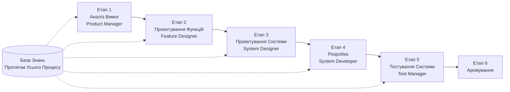

# SpecCrew - Посібник Швидкого Запуску

<p align="center">
  <a href="./GETTING-STARTED.md">简体中文</a> |
  <a href="./GETTING-STARTED.zh-TW.md">繁體中文</a> |
  <a href="./GETTING-STARTED.en.md">English</a> |
  <a href="./GETTING-STARTED.ko.md">한국어</a> |
  <a href="./GETTING-STARTED.de.md">Deutsch</a> |
  <a href="./GETTING-STARTED.es.md">Español</a> |
  <a href="./GETTING-STARTED.fr.md">Français</a> |
  <a href="./GETTING-STARTED.it.md">Italiano</a> |
  <a href="./GETTING-STARTED.da.md">Dansk</a> |
  <a href="./GETTING-STARTED.ja.md">日本語</a> |
  <a href="./GETTING-STARTED.ar.md">العربية</a> |
  <a href="./GETTING-STARTED.uk.md">Українська</a>
</p>

Цей документ допоможе вам швидко зрозуміти, як використовувати команду Агентів SpecCrew для завершення повного циклу розробки від вимог до доставки, дотримуючись стандартних інженерних процесів.

---

## 1. Передумови

### Встановлення SpecCrew

```bash
npm install -g speccrew
```

### Ініціалізація Проекту

```bash
speccrew init --ide qoder
```

Підтримувані IDE: `qoder`, `cursor`, `claude`, `codex`

### Структура Каталогів Після Ініціалізації

```
.
├── .qoder/
│   ├── agents/          # Файли визначення Агентів
│   └── skills/          # Файли визначення Навичок
├── speccrew-workspace/  # Робочий простір
│   ├── docs/            # Конфігурації, правила, шаблони, рішення
│   ├── iterations/      # Поточні ітерації
│   ├── iteration-archives/  # Архівовані ітерації
│   └── knowledges/      # База знань
│       ├── base/        # Базова інформація (діагностичні звіти, технічні борги)
│       ├── bizs/        # Бізнес-база знань
│       └── techs/       # Технічна база знань
```

### Довідник Команд CLI

| Команда | Опис |
|---------|-------------|
| `speccrew list` | Список усіх доступних Агентів та Навичок |
| `speccrew doctor` | Перевірка цілісності встановлення |
| `speccrew update` | Оновлення конфігурації проекту до останньої версії |
| `speccrew uninstall` | Видалення SpecCrew |

---

## 2. Огляд Робочого Процесу

### Повна Діаграма Потоку



### Базові Принципи

1. **Залежності Етапів**: Результат кожного етапу є вхідними даними для наступного етапу
2. **Підтвердження Контрольної Точки**: Кожен етап має точку підтвердження, яка вимагає затвердження користувача перед продовженням
3. **Керування Базою Знань**: База знань проходить через весь процес, надаючи контекст для всіх етапів

---

## 3. Нульовий Крок: Діагностика Проекту та Ініціалізація Бази Знань

Перед початком формального інженерного процесу необхідно ініціалізувати базу знань проекту.

### 3.1 Діагностика Проекту

**Приклад Діалогу**:
```
@speccrew-team-leader діагностувати проект
```

**Що Зробить Агент**:
- Сканування структури проекту
- Виявлення технологічного стеку
- Ідентифікація бізнес-модулів

**Результат**:
```
speccrew-workspace/knowledges/base/diagnosis-reports/diagnosis-report-{date}.md
```

### 3.2 Ініціалізація Технічної Бази Знань

**Приклад Діалогу**:
```
@speccrew-team-leader ініціалізувати технічну базу знань
```

**Триетапний Процес**:
1. Виявлення Платформи — Ідентифікація технологічних платформ у проекті
2. Генерація Технічної Документації — Створення документів технічних специфікацій для кожної платформи
3. Генерація Індексу — Створення індексу бази знань

**Результат**:
```
speccrew-workspace/knowledges/techs/{platform-id}/
├── tech-stack.md          # Визначення технологічного стеку
├── architecture.md        # Архітектурні угоди
├── dev-spec.md            # Специфікації розробки
├── test-spec.md           # Специфікації тестування
└── INDEX.md               # Файл індексу
```

### 3.3 Ініціалізація Бізнес-Бази Знань

**Приклад Діалогу**:
```
@speccrew-team-leader ініціалізувати бізнес-базу знань
```

**Чотириетапний Процес**:
1. Інвентаризація Функцій — Сканування коду для ідентифікації всіх функцій
2. Аналіз Функцій — Аналіз бізнес-логіки кожної функції
3. Підсумок Модуля — Підсумовування функцій за модулями
4. Підсумок Системи — Створення бізнес-огляду на рівні системи

**Результат**:
```
speccrew-workspace/knowledges/bizs/
├── {platform-type}/
│   └── {module-name}/
│       └── feature-spec.md
└── system-overview.md
```

---

## 4. Посібник Діалогу Етап за Етапом

### 4.1 Етап 1: Аналіз Вимог (Product Manager)

**Як Почати**:
```
@speccrew-product-manager у мене нова вимога: [опишіть вашу вимогу]
```

**Робочий Процес Агента**:
1. Читання огляду системи для розуміння існуючих модулів
2. Аналіз вимог користувача
3. Генерація структурованого документа PRD

**Результат**:
```
iterations/{номер}-{тип}-{ім'я}/01.product-requirement/
├── [feature-name]-prd.md           # Документ Вимог Продукту
└── [feature-name]-bizs-modeling.md # Бізнес-моделювання (для складних вимог)
```

**Контрольний Список Підтвердження**:
- [ ] Чи опис вимоги точно відображає намір користувача?
- [ ] Чи бізнес-правила повні?
- [ ] Чи точки інтеграції з існуючими системами зрозумілі?
- [ ] Чи критерії прийнятності вимірювані?

---

### 4.2 Етап 2: Проектування Функцій (Feature Designer)

**Як Почати**:
```
@speccrew-feature-designer розпочати проектування функцій
```

**Робочий Процес Агента**:
1. Автоматичне виявлення підтвердженого документа PRD
2. Завантаження бізнес-бази знань
3. Генерація проектування функцій (включаючи UI wireframes, потоки взаємодії, визначення даних, API контракти)
4. Для кількох PRD використовувати Task Worker для паралельного проектування

**Результат**:
```
iterations/{iter}/02.feature-design/
└── [feature-name]-feature-spec.md  # Документ проектування функцій
```

**Контрольний Список Підтвердження**:
- [ ] Чи всі користувацькі сценарії покриті?
- [ ] Чи потоки взаємодії зрозумілі?
- [ ] Чи визначення полів даних повні?
- [ ] Чи обробка винятків всебічна?

---

### 4.3 Етап 3: Проектування Системи (System Designer)

**Як Почати**:
```
@speccrew-system-designer розпочати проектування системи
```

**Робочий Процес Агента**:
1. Виявлення Feature Spec та API Contract
2. Завантаження технічної бази знань (технологічний стек, архітектура, специфікації для кожної платформи)
3. **Контрольна Точка A**: Оцінка Фреймворку — Аналіз технічних прогалин, рекомендація нових фреймворків (якщо потрібно), очікування підтвердження користувача
4. Генерація DESIGN-OVERVIEW.md
5. Використання Task Worker для паралельної розсилки проектування для кожної платформи (frontend/backend/мобільний/настільний)
6. **Контрольна Точка B**: Спільне Підтвердження — Показ підсумку всіх дизайнів платформ, очікування підтвердження користувача

**Результат**:
```
iterations/{iter}/03.system-design/
├── DESIGN-OVERVIEW.md              # Огляд дизайну
├── {platform-id}/
│   ├── INDEX.md                    # Індекс дизайну платформи
│   └── {module}-design.md          # Проектування модуля на рівні псевдокоду
```

**Контрольний Список Підтвердження**:
- [ ] Чи псевдокод використовує реальний синтаксис фреймворку?
- [ ] Чи крос-платформенні API контракти узгоджені?
- [ ] Чи стратегія обробки помилок уніфікована?

---

### 4.4 Етап 4: Реалізація Розробки (System Developer)

**Як Почати**:
```
@speccrew-system-developer розпочати розробку
```

**Робочий Процес Агента**:
1. Читання документів проектування системи
2. Завантаження технічних знань для кожної платформи
3. **Контрольна Точка A**: Попередня Перевірка Середовища — Перевірка версій runtime, залежностей, доступності сервісів; при невдачі очікування рішення користувача
4. Використання Task Worker для паралельної розсилки розробки для кожної платформи
5. Перевірка інтеграції: Узгодження API контрактів, узгодженість даних
6. Виведення звіту про доставку

**Результат**:
```
# Вихідний код записаний у фактичний каталог вихідного коду проекту
iterations/{iter}/04.development/
├── {platform-id}/
│   └── tasks/                      # Записи задач розробки
└── delivery-report.md
```

**Контрольний Список Підтвердження**:
- [ ] Чи середовище готове?
- [ ] Чи проблеми інтеграції в прийнятних межах?
- [ ] Чи код відповідає специфікаціям розробки?

---

### 4.5 Етап 5: Тестування Системи (Test Manager)

**Як Почати**:
```
@speccrew-test-manager розпочати тестування
```

**Триетапний Процес Тестування**:

| Етап | Опис | Контрольна Точка |
|------|------|-------------------|
| Проектування Тест-Кейсів | Генерація тест-кейсів на основі PRD та Feature Spec | A: Показати статистику покриття кейсів та матрицю трасування, очікування підтвердження користувачем достатнього покриття |
| Генерація Тестового Коду | Генерація виконуваного тестового коду | B: Показати згенеровані тестові файли та мапінг кейсів, очікування підтвердження користувача |
| Виконання Тесту та Звіт про Баги | Автоматичне виконання тестів та генерація звітів | Немає (автоматичне виконання) |

**Результат**:
```
iterations/{iter}/05.system-test/
├── cases/
│   └── {platform-id}/              # Документи тест-кейсів
├── code/
│   └── {platform-id}/              # План тестового коду
├── reports/
│   └── test-report-{date}.md       # Звіт про тестування
└── bugs/
    └── BUG-{id}-{title}.md         # Звіти про баги (один файл на баг)
```

**Контрольний Список Підтвердження**:
- [ ] Чи покриття кейсів повне?
- [ ] Чи тестовий код виконуваний?
- [ ] Чи оцінка серйозності багів точна?

---

### 4.6 Етап 6: Архівування

Ітерації автоматично архівуються після завершення:

```
speccrew-workspace/iteration-archives/
└── {номер}-{тип}-{ім'я}-{дата}/
    ├── 01.product-requirement/
    ├── 02.feature-design/
    ├── 03.system-design/
    ├── 04.development/
    └── 05.system-test/
```

---

## 5. Огляд Бази Знань

### 5.1 Бізнес-База Знань (bizs)

**Мета**: Зберігання описів бізнес-функцій проекту, поділів модулів, характеристик API

**Структура Каталогів**:
```
knowledges/bizs/
├── {platform-type}/
│   └── {module-name}/
│       └── feature-spec.md
└── system-overview.md
```

**Сценарії Використання**: Product Manager, Feature Designer

### 5.2 Технічна База Знань (techs)

**Мета**: Зберігання технологічного стеку проекту, архітектурних угод, специфікацій розробки, специфікацій тестування

**Структура Каталогів**:
```
knowledges/techs/{platform-id}/
├── tech-stack.md
├── architecture.md
├── dev-spec.md
├── test-spec.md
└── INDEX.md
```

**Сценарії Використання**: System Designer, System Developer, Test Manager

---

## 6. Часті Запитання (FAQ)

### П1: Що робити, якщо Агент не працює як очікується?

1. Виконайте `speccrew doctor` для перевірки цілісності встановлення
2. Підтвердьте, що база знань ініціалізована
3. Підтвердьте, що результат попереднього етапу існує в поточному каталозі ітерації

### П2: Як пропустити етап?

**Не рекомендується** — Результат кожного етапу є вхідними даними для наступного етапу.

Якщо потрібно пропустити, підготуйте вручну вхідний документ відповідного етапу та переконайтеся, що він відповідає специфікаціям формату.

### П3: Як обробляти кілька паралельних вимог?

Створіть незалежні каталоги ітерацій для кожної вимоги:
```
iterations/
├── 001-feature-xxx/
├── 002-feature-yyy/
└── 003-feature-zzz/
```

Кожна ітерація повністю ізольована і не впливає на інші.

### П4: Як оновити версію SpecCrew?

- **Глобальне Оновлення**: `npm update -g speccrew`
- **Оновлення Проекту**: Виконайте `speccrew update` в каталозі проекту

### П5: Як переглянути історичні ітерації?

Після архівування перегляньте в `speccrew-workspace/iteration-archives/`, організовано у форматі `{номер}-{тип}-{ім'я}-{дата}/`.

### П6: Чи база знань потребує регулярного оновлення?

Реініціалізація потрібна в наступних ситуаціях:
- Значні зміни структури проекту
- Оновлення або заміна технологічного стеку
- Додавання/видалення бізнес-модулів

---

## 7. Швидка Довідка

### Швидка Довідка Запуску Агентів

| Етап | Агент | Початковий Діалог |
|------|-------|-------------------|
| Діагностика | Team Leader | `@speccrew-team-leader діагностувати проект` |
| Ініціалізація | Team Leader | `@speccrew-team-leader ініціалізувати технічну базу знань` |
| Аналіз Вимог | Product Manager | `@speccrew-product-manager у мене нова вимога: [опис]` |
| Проектування Функцій | Feature Designer | `@speccrew-feature-designer розпочати проектування функцій` |
| Проектування Системи | System Designer | `@speccrew-system-designer розпочати проектування системи` |
| Розробка | System Developer | `@speccrew-system-developer розпочати розробку` |
| Тестування Системи | Test Manager | `@speccrew-test-manager розпочати тестування` |

### Контрольний Список Контрольних Точок

| Етап | Кількість Контрольних Точок | Ключові Елементи Перевірки |
|------|-----------------------------|---------------------------|
| Аналіз Вимог | 1 | Точність вимог, повнота бізнес-правил, вимірюваність критеріїв прийнятності |
| Проектування Функцій | 1 | Покриття сценаріїв, ясність взаємодії, повнота даних, обробка винятків |
| Проектування Системи | 2 | A: Оцінка фреймворку; B: Синтаксис псевдокоду, крос-платформенна узгодженість, обробка помилок |
| Розробка | 1 | A: Готовність середовища, проблеми інтеграції, специфікації коду |
| Тестування Системи | 2 | A: Покриття кейсів; B: Виконуваність тестового коду |

### Швидка Довідка Шляхів Результатів

| Етап | Вихідний Каталог | Формат Файлу |
|------|------------------|-------------|
| Аналіз Вимог | `iterations/{iter}/01.product-requirement/` | `[name]-prd.md`, `[name]-bizs-modeling.md` |
| Проектування Функцій | `iterations/{iter}/02.feature-design/` | `[name]-feature-spec.md` |
| Проектування Системи | `iterations/{iter}/03.system-design/` | `DESIGN-OVERVIEW.md`, `{platform}/INDEX.md`, `{platform}/{module}-design.md` |
| Розробка | `iterations/{iter}/04.development/` | Вихідний код + `delivery-report.md` |
| Тестування Системи | `iterations/{iter}/05.system-test/` | `cases/`, `code/`, `reports/`, `bugs/` |
| Архівування | `iteration-archives/{iter}-{дата}/` | Повна копія ітерації |

---

## Наступні Кроки

1. Виконайте `speccrew init --ide qoder` для ініціалізації вашого проекту
2. Виконайте Нульовий Крок: Діагностика Проекту та Ініціалізація Бази Знань
3. Просувайтесь через кожен етап слідуючи робочому процесу, насолоджуйтесь досвідом розробки на основі специфікацій!
