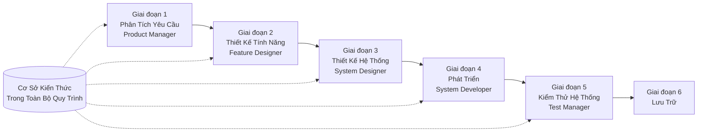

# SpecCrew - Hướng Dẫn Bắt Đầu Nhanh

<p align="center">
  <a href="./GETTING-STARTED.md">简体中文</a> |
  <a href="./GETTING-STARTED.zh-TW.md">繁體中文</a> |
  <a href="./GETTING-STARTED.en.md">English</a> |
  <a href="./GETTING-STARTED.ko.md">한국어</a> |
  <a href="./GETTING-STARTED.de.md">Deutsch</a> |
  <a href="./GETTING-STARTED.es.md">Español</a> |
  <a href="./GETTING-STARTED.fr.md">Français</a> |
  <a href="./GETTING-STARTED.it.md">Italiano</a> |
  <a href="./GETTING-STARTED.da.md">Dansk</a> |
  <a href="./GETTING-STARTED.ja.md">日本語</a> |
  <a href="./GETTING-STARTED.ar.md">العربية</a> |
  <a href="./GETTING-STARTED.vi.md">Tiếng Việt</a>
</p>

Tài liệu này giúp bạn nhanh chóng hiểu cách sử dụng nhóm Agent SpecCrew để hoàn thành chu kỳ phát triển đầy đủ từ yêu cầu đến bàn giao, tuân theo quy trình kỹ thuật tiêu chuẩn.

---

## 1. Điều Kiện Tiên Quyết

### Cài Đặt SpecCrew

```bash
npm install -g speccrew
```

### Khởi Tạo Dự Án

```bash
speccrew init --ide qoder
```

IDE được hỗ trợ: `qoder`, `cursor`, `claude`, `codex`

### Cấu Trúc Thư Mục Sau Khi Khởi Tạo

```
.
├── .qoder/
│   ├── agents/          # Tệp định nghĩa Agent
│   └── skills/          # Tệp định nghĩa Skill
├── speccrew-workspace/  # Không gian làm việc
│   ├── docs/            # Cấu hình, quy tắc, mẫu, giải pháp
│   ├── iterations/      # Iteration hiện tại
│   ├── iteration-archives/  # Iteration đã lưu trữ
│   └── knowledges/      # Cơ sở kiến thức
│       ├── base/        # Thông tin cơ bản (báo cáo chẩn đoán, nợ kỹ thuật)
│       ├── bizs/        # Cơ sở kiến thức nghiệp vụ
│       └── techs/       # Cơ sở kiến thức kỹ thuật
```

### Tham Khảo Lệnh CLI

| Lệnh | Mô tả |
|---------|-------------|
| `speccrew list` | Liệt kê tất cả Agent và Skill có sẵn |
| `speccrew doctor` | Kiểm tra tính toàn vẹn của cài đặt |
| `speccrew update` | Cập nhật cấu hình dự án lên phiên bản mới nhất |
| `speccrew uninstall` | Gỡ cài đặt SpecCrew |

---

## 2. Tổng Quan Quy Trình Làm Việc

### Sơ Đồ Luồng Đầy Đủ



### Nguyên Tắc Cơ Bản

1. **Phụ Thuộc Giai Đoạn**: Đầu ra của mỗi giai đoạn là đầu vào cho giai đoạn tiếp theo
2. **Xác Nhận Điểm Kiểm Tra**: Mỗi giai đoạn có một điểm xác nhận yêu cầu phê duyệt của người dùng trước khi tiếp tục
3. **Điều Khiển Bởi Cơ Sở Kiến Thức**: Cơ sở kiến thức xuyên suốt toàn bộ quy trình, cung cấp ngữ cảnh cho tất cả các giai đoạn

---

## 3. Bước Không: Chẩn Đoán Dự Án và Khởi Tạo Cơ Sở Kiến Thức

Trước khi bắt đầu quy trình kỹ thuật chính thức, bạn cần khởi tạo cơ sở kiến thức của dự án.

### 3.1 Chẩn Đoán Dự Án

**Ví Dụ Hội Thoại**:
```
@speccrew-team-leader chẩn đoán dự án
```

**Agent Sẽ Làm Gì**:
- Quét cấu trúc dự án
- Phát hiện công nghệ stack
- Xác định các module nghiệp vụ

**Kết Quả**:
```
speccrew-workspace/knowledges/base/diagnosis-reports/diagnosis-report-{date}.md
```

### 3.2 Khởi Tạo Cơ Sở Kiến Thức Kỹ Thuật

**Ví Dụ Hội Thoại**:
```
@speccrew-team-leader khởi tạo cơ sở kiến thức kỹ thuật
```

**Quy Trình Ba Giai Đoạn**:
1. Phát Hiện Nền Tảng — Xác định các nền tảng công nghệ trong dự án
2. Tạo Tài Liệu Kỹ Thuật — Tạo tài liệu đặc tả kỹ thuật cho mỗi nền tảng
3. Tạo Chỉ Mục — Thiết lập chỉ mục cơ sở kiến thức

**Kết Quả**:
```
speccrew-workspace/knowledges/techs/{platform-id}/
├── tech-stack.md          # Định nghĩa công nghệ stack
├── architecture.md        # Quy ước kiến trúc
├── dev-spec.md            # Đặc tả phát triển
├── test-spec.md           # Đặc tả kiểm thử
└── INDEX.md               # Tệp chỉ mục
```

### 3.3 Khởi Tạo Cơ Sở Kiến Thức Nghiệp Vụ

**Ví Dụ Hội Thoại**:
```
@speccrew-team-leader khởi tạo cơ sở kiến thức nghiệp vụ
```

**Quy Trình Bốn Giai Đoạn**:
1. Kiểm Kê Tính Năng — Quét code để xác định tất cả tính năng
2. Phân Tích Tính Năng — Phân tích logic nghiệp vụ của mỗi tính năng
3. Tổng Kết Module — Tóm tắt tính năng theo module
4. Tổng Kết Hệ Thống — Tạo tổng quan nghiệp vụ cấp hệ thống

**Kết Quả**:
```
speccrew-workspace/knowledges/bizs/
├── {platform-type}/
│   └── {module-name}/
│       └── feature-spec.md
└── system-overview.md
```

---

## 4. Hướng Dẫn Hội Thoại Từng Giai Đoạn

### 4.1 Giai Đoạn 1: Phân Tích Yêu Cầu (Product Manager)

**Cách Bắt Đầu**:
```
@speccrew-product-manager tôi có yêu cầu mới: [mô tả yêu cầu của bạn]
```

**Quy Trình Làm Việc Của Agent**:
1. Đọc tổng quan hệ thống để hiểu các module hiện có
2. Phân tích yêu cầu người dùng
3. Tạo tài liệu PRD có cấu trúc

**Kết Quả**:
```
iterations/{số}-{loại}-{tên}/01.product-requirement/
├── [feature-name]-prd.md           # Tài Liệu Yêu Cầu Sản Phẩm
└── [feature-name]-bizs-modeling.md # Mô hình nghiệp vụ (cho yêu cầu phức tạp)
```

**Danh Sách Xác Nhận**:
- [ ] Mô tả yêu cầu có phản ánh chính xác ý định người dùng không?
- [ ] Quy tắc nghiệp vụ có đầy đủ không?
- [ ] Các điểm tích hợp với hệ thống hiện có có rõ ràng không?
- [ ] Tiêu chí chấp nhận có thể đo lường được không?

---

### 4.2 Giai Đoạn 2: Thiết Kế Tính Năng (Feature Designer)

**Cách Bắt Đầu**:
```
@speccrew-feature-designer bắt đầu thiết kế tính năng
```

**Quy Trình Làm Việc Của Agent**:
1. Tự động định vị tài liệu PRD đã xác nhận
2. Tải cơ sở kiến thức nghiệp vụ
3. Tạo thiết kế tính năng (bao gồm UI wireframes, luồng tương tác, định nghĩa dữ liệu, API contracts)
4. Cho nhiều PRD, sử dụng Task Worker để thiết kế song song

**Kết Quả**:
```
iterations/{iter}/02.feature-design/
└── [feature-name]-feature-spec.md  # Tài liệu thiết kế tính năng
```

**Danh Sách Xác Nhận**:
- [ ] Tất cả kịch bản người dùng có được bao phủ không?
- [ ] Luồng tương tác có rõ ràng không?
- [ ] Định nghĩa trường dữ liệu có đầy đủ không?
- [ ] Xử lý ngoại lệ có toàn diện không?

---

### 4.3 Giai Đoạn 3: Thiết Kế Hệ Thống (System Designer)

**Cách Bắt Đầu**:
```
@speccrew-system-designer bắt đầu thiết kế hệ thống
```

**Quy Trình Làm Việc Của Agent**:
1. Định vị Feature Spec và API Contract
2. Tải cơ sở kiến thức kỹ thuật (công nghệ stack, kiến trúc, đặc tả cho mỗi nền tảng)
3. **Điểm Kiểm Tra A**: Đánh Giá Framework — Phân tích khoảng trống kỹ thuật, đề xuất framework mới (nếu cần), chờ xác nhận người dùng
4. Tạo DESIGN-OVERVIEW.md
5. Sử dụng Task Worker để phân phối thiết kế song song cho mỗi nền tảng (frontend/backend/mobile/desktop)
6. **Điểm Kiểm Tra B**: Xác Nhận Chung — Hiển thị tóm tắt tất cả thiết kế nền tảng, chờ xác nhận người dùng

**Kết Quả**:
```
iterations/{iter}/03.system-design/
├── DESIGN-OVERVIEW.md              # Tổng quan thiết kế
├── {platform-id}/
│   ├── INDEX.md                    # Chỉ mục thiết kế nền tảng
│   └── {module}-design.md          # Thiết kế module cấp pseudocode
```

**Danh Sách Xác Nhận**:
- [ ] Pseudocode có sử dụng cú pháp framework thực tế không?
- [ ] API contracts đa nền tảng có nhất quán không?
- [ ] Chiến lược xử lý lỗi có thống nhất không?

---

### 4.4 Giai Đoạn 4: Triển Khai Phát Triển (System Developer)

**Cách Bắt Đầu**:
```
@speccrew-system-developer bắt đầu phát triển
```

**Quy Trình Làm Việc Của Agent**:
1. Đọc tài liệu thiết kế hệ thống
2. Tải kiến thức kỹ thuật cho mỗi nền tảng
3. **Điểm Kiểm Tra A**: Xác Minh Môi Trường Trước — Xác minh phiên bản runtime, dependencies, khả năng sẵn sàng của dịch vụ; nếu thất bại chờ giải pháp của người dùng
4. Sử dụng Task Worker để phân phối phát triển song song cho mỗi nền tảng
5. Xác minh tích hợp: Căn chỉnh API contracts, nhất quán dữ liệu
6. Xuất báo cáo bàn giao

**Kết Quả**:
```
# Source code được viết vào thư mục source code thực tế của dự án
iterations/{iter}/04.development/
├── {platform-id}/
│   └── tasks/                      # Bản ghi task phát triển
└── delivery-report.md
```

**Danh Sách Xác Nhận**:
- [ ] Môi trường đã sẵn sàng chưa?
- [ ] Vấn đề tích hợp có trong phạm vi chấp nhận được không?
- [ ] Code có tuân thủ đặc tả phát triển không?

---

### 4.5 Giai Đoạn 5: Kiểm Thử Hệ Thống (Test Manager)

**Cách Bắt Đầu**:
```
@speccrew-test-manager bắt đầu kiểm thử
```

**Quy Trình Kiểm Thử Ba Giai Đoạn**:

| Giai Đoạn | Mô Tả | Điểm Kiểm Tra |
|------|----------|-------------------|
| Thiết Kế Ca Kiểm Thử | Tạo ca kiểm thử dựa trên PRD và Feature Spec | A: Hiển thị thống kê coverage ca và ma trận traceability, chờ xác nhận coverage đầy đủ của người dùng |
| Tạo Code Kiểm Thử | Tạo code kiểm thử có thể thực thi | B: Hiển thị tệp kiểm thử đã tạo và ánh xạ ca, chờ xác nhận người dùng |
| Thực Thi Kiểm Thử và Báo Cáo Lỗi | Tự động thực thi kiểm thử và tạo báo cáo | Không có (tự động thực thi) |

**Kết Quả**:
```
iterations/{iter}/05.system-test/
├── cases/
│   └── {platform-id}/              # Tài liệu ca kiểm thử
├── code/
│   └── {platform-id}/              # Kế hoạch code kiểm thử
├── reports/
│   └── test-report-{date}.md       # Báo cáo kiểm thử
└── bugs/
    └── BUG-{id}-{title}.md         # Báo cáo lỗi (một tệp mỗi lỗi)
```

**Danh Sách Xác Nhận**:
- [ ] Coverage ca có đầy đủ không?
- [ ] Code kiểm thử có thể thực thi được không?
- [ ] Đánh giá mức độ nghiêm trọng của lỗi có chính xác không?

---

### 4.6 Giai Đoạn 6: Lưu Trữ

Iteration được tự động lưu trữ khi hoàn thành:

```
speccrew-workspace/iteration-archives/
└── {số}-{loại}-{tên}-{ngày}/
    ├── 01.product-requirement/
    ├── 02.feature-design/
    ├── 03.system-design/
    ├── 04.development/
    └── 05.system-test/
```

---

## 5. Tổng Quan Cơ Sở Kiến Thức

### 5.1 Cơ Sở Kiến Thức Nghiệp Vụ (bizs)

**Mục Đích**: Lưu trữ mô tả chức năng nghiệp vụ của dự án, phân chia module, đặc điểm API

**Cấu Trúc Thư Mục**:
```
knowledges/bizs/
├── {platform-type}/
│   └── {module-name}/
│       └── feature-spec.md
└── system-overview.md
```

**Kịch Bản Sử Dụng**: Product Manager, Feature Designer

### 5.2 Cơ Sở Kiến Thức Kỹ Thuật (techs)

**Mục Đích**: Lưu trữ công nghệ stack của dự án, quy ước kiến trúc, đặc tả phát triển, đặc tả kiểm thử

**Cấu Trúc Thư Mục**:
```
knowledges/techs/{platform-id}/
├── tech-stack.md
├── architecture.md
├── dev-spec.md
├── test-spec.md
└── INDEX.md
```

**Kịch Bản Sử Dụng**: System Designer, System Developer, Test Manager

---

## 6. Câu Hỏi Thường Gặp (FAQ)

### H1: Phải làm gì nếu Agent không hoạt động như mong đợi?

1. Chạy `speccrew doctor` để kiểm tra tính toàn vẹn của cài đặt
2. Xác nhận cơ sở kiến thức đã được khởi tạo
3. Xác nhận kết quả của giai đoạn trước tồn tại trong thư mục iteration hiện tại

### H2: Làm thế nào để bỏ qua một giai đoạn?

**Không khuyến nghị** — Đầu ra của mỗi giai đoạn là đầu vào cho giai đoạn tiếp theo.

Nếu cần bỏ qua, hãy chuẩn bị thủ công tài liệu đầu vào của giai đoạn tương ứng và đảm bảo nó tuân thủ đặc tả định dạng.

### H3: Làm thế nào để xử lý nhiều yêu cầu song song?

Tạo các thư mục iteration độc lập cho mỗi yêu cầu:
```
iterations/
├── 001-feature-xxx/
├── 002-feature-yyy/
└── 003-feature-zzz/
```

Mỗi iteration được cô lập hoàn toàn và không ảnh hưởng đến nhau.

### H4: Làm thế nào để cập nhật phiên bản SpecCrew?

Cập nhật yêu cầu hai bước:

```bash
# Bước 1: Cập nhật công cụ CLI toàn cục
npm install -g speccrew@latest

# Bước 2: Đồng bộ Agent và Skill trong thư mục dự án của bạn
cd /path/to/your-project
speccrew update
```

- `npm install -g speccrew@latest`: Cập nhật chính công cụ CLI (phiên bản mới có thể bao gồm định nghĩa Agent/Skill mới, sửa lỗi, v.v.)
- `speccrew update`: Đồng bộ các tệp định nghĩa Agent và Skill trong dự án của bạn lên phiên bản mới nhất
- `speccrew update --ide cursor`: Cập nhật cấu hình chỉ cho một IDE cụ thể

> **Lưu ý**: Cả hai bước đều cần thiết. Chỉ chạy `speccrew update` sẽ không cập nhật chính công cụ CLI; chỉ chạy `npm install` sẽ không cập nhật các tệp dự án.

### H5: Làm thế nào để xem các iteration lịch sử?

Sau khi lưu trữ, xem trong `speccrew-workspace/iteration-archives/`, được tổ chức theo định dạng `{số}-{loại}-{tên}-{ngày}/`.

### H6: Cơ sở kiến thức có cần cập nhật thường xuyên không?

Cần khởi tạo lại trong các tình huống sau:
- Thay đổi đáng kể về cấu trúc dự án
- Cập nhật hoặc thay thế công nghệ stack
- Thêm/xóa module nghiệp vụ

---

## 7. Tham Khảo Nhanh

### Tham Khảo Nhanh Khởi Động Agent

| Giai Đoạn | Agent | Hội Thoại Bắt Đầu |
|------|-------|-------------------|
| Chẩn Đoán | Team Leader | `@speccrew-team-leader chẩn đoán dự án` |
| Khởi Tạo | Team Leader | `@speccrew-team-leader khởi tạo cơ sở kiến thức kỹ thuật` |
| Phân Tích Yêu Cầu | Product Manager | `@speccrew-product-manager tôi có yêu cầu mới: [mô tả]` |
| Thiết Kế Tính Năng | Feature Designer | `@speccrew-feature-designer bắt đầu thiết kế tính năng` |
| Thiết Kế Hệ Thống | System Designer | `@speccrew-system-designer bắt đầu thiết kế hệ thống` |
| Phát Triển | System Developer | `@speccrew-system-developer bắt đầu phát triển` |
| Kiểm Thử Hệ Thống | Test Manager | `@speccrew-test-manager bắt đầu kiểm thử` |

### Danh Sách Điểm Kiểm Tra

| Giai Đoạn | Số Lượng Điểm Kiểm Tra | Yếu Tố Xác Minh Chính |
|------|------------------------|------------------------|
| Phân Tích Yêu Cầu | 1 | Độ chính xác yêu cầu, đầy đủ quy tắc nghiệp vụ, khả năng đo lường tiêu chí chấp nhận |
| Thiết Kế Tính Năng | 1 | Coverage kịch bản, rõ ràng tương tác, đầy đủ dữ liệu, xử lý ngoại lệ |
| Thiết Kế Hệ Thống | 2 | A: Đánh giá framework; B: Cú pháp pseudocode, nhất quán đa nền tảng, xử lý lỗi |
| Phát Triển | 1 | A: Sẵn sàng môi trường, vấn đề tích hợp, đặc tả code |
| Kiểm Thử Hệ Thống | 2 | A: Coverage ca; B: Khả năng thực thi code kiểm thử |

### Tham Khảo Nhanh Đường Dẫn Kết Quả

| Giai Đoạn | Thư Mục Đầu Ra | Định Dạng Tệp |
|------|------------------|-------------|
| Phân Tích Yêu Cầu | `iterations/{iter}/01.product-requirement/` | `[name]-prd.md`, `[name]-bizs-modeling.md` |
| Thiết Kế Tính Năng | `iterations/{iter}/02.feature-design/` | `[name]-feature-spec.md` |
| Thiết Kế Hệ Thống | `iterations/{iter}/03.system-design/` | `DESIGN-OVERVIEW.md`, `{platform}/INDEX.md`, `{platform}/{module}-design.md` |
| Phát Triển | `iterations/{iter}/04.development/` | Source code + `delivery-report.md` |
| Kiểm Thử Hệ Thống | `iterations/{iter}/05.system-test/` | `cases/`, `code/`, `reports/`, `bugs/` |
| Lưu Trữ | `iteration-archives/{iter}-{ngày}/` | Bản sao đầy đủ của iteration |

---

## Bước Tiếp Theo

1. Chạy `speccrew init --ide qoder` để khởi tạo dự án của bạn
2. Thực hiện Bước Không: Chẩn Đoán Dự Án và Khởi Tạo Cơ Sở Kiến Thức
3. Tiến bộ qua từng giai đoạn theo quy trình làm việc, tận hưởng trải nghiệm phát triển dựa trên đặc tả!
