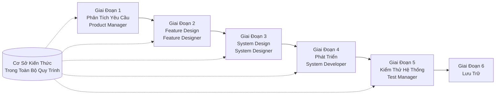

# Hướng Dẫn Bắt Đầu Nhanh SpecCrew

<p align="center">
  <a href="./GETTING-STARTED.md">简体中文</a> |
  <a href="./GETTING-STARTED.zh-TW.md">繁體中文</a> |
  <a href="./GETTING-STARTED.en.md">English</a> |
  <a href="./GETTING-STARTED.ko.md">한국어</a> |
  <a href="./GETTING-STARTED.de.md">Deutsch</a> |
  <a href="./GETTING-STARTED.es.md">Español</a> |
  <a href="./GETTING-STARTED.fr.md">Français</a> |
  <a href="./GETTING-STARTED.it.md">Italiano</a> |
  <a href="./GETTING-STARTED.da.md">Dansk</a> |
  <a href="./GETTING-STARTED.ja.md">日本語</a> |
  <a href="./GETTING-STARTED.ar.md">العربية</a>
</p>

Tài liệu này giúp bạn nhanh chóng hiểu cách sử dụng nhóm Agent của SpecCrew để hoàn thành phát triển đầy đủ từ yêu cầu đến giao nộp theo quy trình kỹ thuật tiêu chuẩn.

---

## 1. Điều Kiện Tiên Quyết

### Cài Đặt SpecCrew

```bash
npm install -g speccrew
```

### Khởi Tạo Dự Án

```bash
speccrew init --ide qoder
```

IDE được hỗ trợ: `qoder`, `cursor`, `claude`, `codex`

### Cấu Trúc Thư Mục Sau Khi Khởi Tạo

```
.
├── .qoder/
│   ├── agents/          # Tệp định nghĩa Agents
│   └── skills/          # Tệp định nghĩa Skills
├── speccrew-workspace/  # Workspace
│   ├── docs/            # Cấu hình, quy tắc, mẫu, giải pháp
│   ├── iterations/      # Các iteration đang diễn ra
│   ├── iteration-archives/  # Các iteration đã lưu trữ
│   └── knowledges/      # Cơ sở kiến thức
│       ├── base/        # Thông tin cơ bản (báo cáo chẩn đoán, nợ kỹ thuật)
│       ├── bizs/        # Cơ sở kiến thức nghiệp vụ
│       └── techs/       # Cơ sở kiến thức kỹ thuật
```

### Tham Khảo Nhanh Lệnh CLI

| Lệnh | Mô tả |
|------|------|
| `speccrew list` | Liệt kê tất cả Agents và Skills có sẵn |
| `speccrew doctor` | Kiểm tra tính toàn vẹn của cài đặt |
| `speccrew update` | Cập nhật cấu hình dự án lên phiên bản mới nhất |
| `speccrew uninstall` | Gỡ cài đặt SpecCrew |

---

## 2. Bắt Đầu Nhanh Trong 5 Phút Sau Khi Cài Đặt

Sau khi chạy `speccrew init`, làm theo các bước này để nhanh chóng vào trạng thái làm việc:

### Bước 1: Chọn IDE Của Bạn

| IDE | Lệnh Khởi Tạo | Kịch Bản Ứng Dụng |
|-----|-----------|----------|
| **Qoder** (Được khuyến nghị) | `speccrew init --ide qoder` | Điều phối agent đầy đủ, workers song song |
| **Cursor** | `speccrew init --ide cursor` | Workflow dựa trên Composer |
| **Claude Code** | `speccrew init --ide claude` | Phát triển CLI-first |
| **Codex** | `speccrew init --ide codex` | Tích hợp hệ sinh thái OpenAI |

### Bước 2: Khởi Tạo Cơ Sở Kiến Thức (Được Khuyến Nghị)

Đối với các dự án có mã nguồn hiện có, khuyến nghị khởi tạo cơ sở kiến thức trước để các agent hiểu codebase của bạn:

```
@speccrew-team-leader khởi tạo cơ sở kiến thức kỹ thuật
```

Sau đó:

```
@speccrew-team-leader khởi tạo cơ sở kiến thức nghiệp vụ
```

### Bước 3: Bắt Đầu Tác Vụ Đầu Tiên Của Bạn

```
@speccrew-product-manager Tôi có một yêu cầu mới: [mô tả yêu cầu chức năng của bạn]
```

> **Mẹo**: Nếu không chắc chắn phải làm gì, chỉ cần nói `@speccrew-team-leader giúp tôi bắt đầu` — Team Leader sẽ tự động phát hiện trạng thái dự án của bạn và hướng dẫn bạn.

---

## 3. Cây Quyết Định Nhanh

Không chắc chắn phải làm gì? Tìm kịch bản của bạn bên dưới:

- **Tôi có một yêu cầu chức năng mới**
  → `@speccrew-product-manager Tôi có một yêu cầu mới: [mô tả yêu cầu chức năng của bạn]`

- **Tôi muốn quét kiến thức dự án hiện có**
  → `@speccrew-team-leader khởi tạo cơ sở kiến thức kỹ thuật`
  → Sau đó: `@speccrew-team-leader khởi tạo cơ sở kiến thức nghiệp vụ`

- **Tôi muốn tiếp tục công việc trước đó**
  → `@speccrew-team-leader tiến độ hiện tại là gì?`

- **Tôi muốn kiểm tra trạng thái sức khỏe hệ thống**
  → Chạy trong terminal: `speccrew doctor`

- **Tôi không chắc chắn phải làm gì**
  → `@speccrew-team-leader giúp tôi bắt đầu`
  → Team Leader sẽ tự động phát hiện trạng thái dự án của bạn và hướng dẫn bạn

---

## 4. Tham Khảo Nhanh Agents

| Vai Trò | Agent | Trách Nhiệm | Ví Dụ Lệnh |
|------|-------|-----------------|-----------------|
| Trưởng Nhóm | `@speccrew-team-leader` | Điều hướng dự án, khởi tạo cơ sở kiến thức, kiểm tra trạng thái | "Giúp tôi bắt đầu" |
| Quản Lý Sản Phẩm | `@speccrew-product-manager` | Phân tích yêu cầu, tạo PRD | "Tôi có một yêu cầu mới: ..." |
| Nhà Thiết Kế Chức Năng | `@speccrew-feature-designer` | Phân tích chức năng, thiết kế đặc tả, hợp đồng API | "Bắt đầu thiết kế chức năng cho iteration X" |
| Nhà Thiết Kế Hệ Thống | `@speccrew-system-designer` | Thiết kế kiến trúc, thiết kế chi tiết nền tảng | "Bắt đầu thiết kế hệ thống cho iteration X" |
| Nhà Phát Triển Hệ Thống | `@speccrew-system-developer` | Phối hợp phát triển, tạo mã | "Bắt đầu phát triển cho iteration X" |
| Quản Lý Kiểm Thử | `@speccrew-test-manager` | Lập kế hoạch kiểm thử, thiết kế ca, thực thi | "Bắt đầu kiểm thử cho iteration X" |

> **Lưu ý**: Bạn không cần nhớ tất cả agents. Chỉ cần nói chuyện với `@speccrew-team-leader` và nó sẽ định tuyến yêu cầu của bạn đến agent phù hợp.

---

## 5. Tổng Quan Workflow

### Sơ Đồ Luồng Đầy Đủ



### Nguyên Tắc Cốt Lõi

1. **Phụ Thuộc Giai Đoạn**: Đầu ra của mỗi giai đoạn là đầu vào cho giai đoạn tiếp theo
2. **Xác Nhận Checkpoint**: Mỗi giai đoạn có một điểm xác nhận yêu cầu phê duyệt của người dùng trước khi chuyển sang giai đoạn tiếp theo
3. **Điều Khiển Bởi Cơ Sở Kiến Thức**: Cơ sở kiến thức chạy trong toàn bộ quy trình, cung cấp ngữ cảnh cho tất cả các giai đoạn

---

## 6. Bước Không: Khởi Tạo Cơ Sở Kiến Thức

Trước khi bắt đầu quy trình kỹ thuật chính thức, bạn cần khởi tạo cơ sở kiến thức của dự án.

### 6.1 Khởi Tạo Cơ Sở Kiến Thức Kỹ Thuật

**Ví Dụ Hội Thoại**:
```
@speccrew-team-leader khởi tạo cơ sở kiến thức kỹ thuật
```

**Quy Trình Ba Giai Đoạn**:
1. Phát Hiện Nền Tảng — Xác định các nền tảng kỹ thuật trong dự án
2. Tạo Tài Liệu Kỹ Thuật — Tạo tài liệu đặc tả kỹ thuật cho mỗi nền tảng
3. Tạo Chỉ Mục — Thiết lập chỉ mục cơ sở kiến thức

**Kết Quả**:
```
speccrew-workspace/knowledges/techs/{platform-id}/
├── tech-stack.md          # Định nghĩa stack công nghệ
├── architecture.md        # Quy ước kiến trúc
├── dev-spec.md            # Đặc tả phát triển
├── test-spec.md           # Đặc tả kiểm thử
└── INDEX.md               # Tệp chỉ mục
```

### 6.2 Khởi Tạo Cơ Sở Kiến Thức Nghiệp Vụ

**Ví Dụ Hội Thoại**:
```
@speccrew-team-leader khởi tạo cơ sở kiến thức nghiệp vụ
```

**Quy Trình Bốn Giai Đoạn**:
1. Kiểm Kê Chức Năng — Quét mã để xác định tất cả các chức năng
2. Phân Tích Chức Năng — Phân tích logic nghiệp vụ cho mỗi chức năng
3. Tóm Tắt Module — Tóm tắt các chức năng theo module
4. Tóm Tắt Hệ Thống — Tạo tổng quan nghiệp vụ cấp hệ thống

**Kết Quả**:
```
speccrew-workspace/knowledges/bizs/
├── {platform-type}/
│   └── {module-name}/
│       └── feature-spec.md
└── system-overview.md
```

---

[Tiếp tục với tất cả các phần 7-11...]
