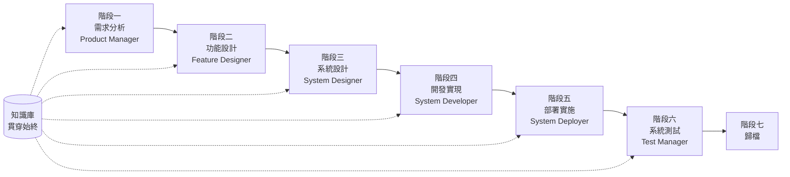

# SpecCrew 快速開始指南

<p align="center">
  <a href="./GETTING-STARTED.md">简体中文</a> |
  <a href="./GETTING-STARTED.zh-TW.md">繁體中文</a> |
  <a href="./GETTING-STARTED.en.md">English</a> |
  <a href="./GETTING-STARTED.ko.md">한국어</a> |
  <a href="./GETTING-STARTED.de.md">Deutsch</a> |
  <a href="./GETTING-STARTED.es.md">Español</a> |
  <a href="./GETTING-STARTED.fr.md">Français</a> |
  <a href="./GETTING-STARTED.it.md">Italiano</a> |
  <a href="./GETTING-STARTED.da.md">Dansk</a> |
  <a href="./GETTING-STARTED.ja.md">日本語</a> |
  <a href="./GETTING-STARTED.ar.md">العربية</a>
</p>

本文檔幫助您快速了解如何使用 SpecCrew 的 Agent 團隊,按照標準工程流程逐步完成從需求到交付的完整開發。

---

## 1. 前置準備

### 安裝 SpecCrew

```bash
npm install -g speccrew
```

### 初始化專案

```bash
speccrew init --ide qoder
```

支援的 IDE:`qoder`、`cursor`、`claude`、`codex`

### 初始化後的目錄結構

```
.
├── .qoder/
│   ├── agents/          # Agent 定義檔案
│   └── skills/          # Skill 定義檔案
├── speccrew-workspace/  # 工作空間
│   ├── docs/            # 配置、規則、模板、解決方案
│   ├── iterations/      # 當前進行中的迭代
│   ├── iteration-archives/  # 歸檔的迭代
│   └── knowledges/      # 知識庫
│       ├── base/        # 基礎資訊(診斷報告、技術債務)
│       ├── bizs/        # 業務知識庫
│       └── techs/       # 技術知識庫
```

### CLI 命令速查

| 命令 | 說明 |
|------|------|
| `speccrew list` | 列出所有可用的 Agent 和 Skill |
| `speccrew doctor` | 檢查安裝完整性 |
| `speccrew update` | 更新專案配置到最新版本 |
| `speccrew uninstall` | 解除安裝 SpecCrew |

---

## 2. 安裝後5分鐘快速開始

執行 `speccrew init` 後,按以下步驟快速進入工作狀態:

### 第1步:選擇你的 IDE

| IDE | 初始化命令 | 適用場景 |
|-----|-----------|----------|
| **Qoder**(推薦) | `speccrew init --ide qoder` | 完整Agent編排、並行Worker |
| **Cursor** | `speccrew init --ide cursor` | 基於Composer的工作流 |
| **Claude Code** | `speccrew init --ide claude` | CLI優先開發 |
| **Codex** | `speccrew init --ide codex` | OpenAI生態集成 |

### 第2步:初始化知識庫(推薦)

對於已有源碼的專案,建議先初始化知識庫,讓Agent理解你的程式碼庫:

```
@speccrew-team-leader 初始化技術知識庫
```

然後:

```
@speccrew-team-leader 初始化業務知識庫
```

### 第3步:開始你的第一個任務

```
@speccrew-product-manager 我有一個新需求:[描述你的功能需求]
```

> **提示**:如果不確定該做什麼,直接說 `@speccrew-team-leader 幫我開始` — Team Leader 會自動檢測專案狀態並引導你。

---

## 3. 快速決策樹

不確定該做什麼?找到你的場景:

- **我有新的功能需求**
  → `@speccrew-product-manager 我有一個新需求:[描述你的功能需求]`

- **我想掃描現有專案的知識**
  → `@speccrew-team-leader 初始化技術知識庫`
  → 然後:`@speccrew-team-leader 初始化業務知識庫`

- **我想繼續之前的工作**
  → `@speccrew-team-leader 當前進度是什麼?`

- **我想檢查系統健康狀態**
  → 在終端運行:`speccrew doctor`

- **我不確定該做什麼**
  → `@speccrew-team-leader 幫我開始`
  → Team Leader 會自動檢測專案狀態並引導你

---

## 4. Agent 快速參考

| 角色 | Agent | 職責 | 示例指令 |
|------|-------|------|----------|
| 團隊負責人 | `@speccrew-team-leader` | 專案導航、知識庫初始化、狀態查看 | "幫我開始" |
| 產品經理 | `@speccrew-product-manager` | 需求分析、PRD 生成 | "我有一個新需求:..." |
| 功能設計師 | `@speccrew-feature-designer` | 功能分析、規格設計、API 契約 | "開始迭代X的功能設計" |
| 系統設計師 | `@speccrew-system-designer` | 架構設計、平台詳細設計 | "開始迭代X的系統設計" |
| 系統開發者 | `@speccrew-system-developer` | 開發協調、程式碼生成 | "開始迭代X的開發" |
| 測試經理 | `@speccrew-test-manager` | 測試規劃、用例設計、執行 | "開始迭代X的測試" |

> **提示**:你不需要記住所有 Agent。只需與 `@speccrew-team-leader` 對話,它會將你的請求路由到合適的 Agent。

---

## 5. 工作流程總覽

### 完整流程圖



### 核心原則

1. **階段依賴**:每階段產出物是下一階段的輸入
2. **Checkpoint 確認**:每個階段都有確認點,需使用者確認後才能進入下一階段
3. **知識庫驅動**:知識庫貫穿始終,為各階段提供上下文

---

## 6. 第零步:知識庫初始化

在開始正式工程流程前,需要先初始化專案知識庫。

### 6.1 技術知識庫初始化

**對話範例**:
```
@speccrew-team-leader 初始化技術知識庫
```

**三階段流程**:
1. 平台檢測 — 識別專案中的技術平台
2. 技術文檔生成 — 為每個平台生成技術規約文檔
3. 索引生成 — 建立知識庫索引

**產出物**:
```
speccrew-workspace/knowledges/techs/{platform-id}/
├── tech-stack.md          # 技術棧定義
├── architecture.md        # 架構約定
├── dev-spec.md            # 開發規約
├── test-spec.md           # 測試規約
└── INDEX.md               # 索引檔案
```

### 6.2 業務知識庫初始化

**對話範例**:
```
@speccrew-team-leader 初始化業務知識庫
```

**四階段流程**:
1. 特性清單 — 掃描程式碼識別所有功能特性
2. 特性分析 — 分析每個特性的業務邏輯
3. 模組總結 — 按模組匯總特性
4. 系統總結 — 生成系統級業務概覽

**產出物**:
```
speccrew-workspace/knowledges/bizs/
├── {platform-type}/
│   └── {module-name}/
│       └── feature-spec.md
└── system-overview.md
```

---

## 7. 逐階段對話指南

### 7.1 階段一:需求分析(Product Manager)

**如何啟動**:
```
@speccrew-product-manager 我有一個新需求:[描述你的需求]
```

**Agent 工作流程**:
1. 讀取系統概覽了解現有模組
2. 分析使用者需求
3. 生成結構化 PRD 文檔

**產出物**:
```
iterations/{序號}-{類型}-{名稱}/01.product-requirement/
├── [feature-name]-prd.md           # 產品需求文檔
└── [feature-name]-bizs-modeling.md # 業務建模(複雜需求時)
```

**確認要點**:
- [ ] 需求描述是否準確反映使用者意圖
- [ ] 業務規則是否完整
- [ ] 與現有系統的集成點是否明確
- [ ] 驗收標準是否可度量

---

### 7.2 階段二:功能設計(Feature Designer)

**如何啟動**:
```
@speccrew-feature-designer 開始功能設計
```

**Agent 工作流程**:
1. 自動定位已確認的 PRD 文檔
2. 加載業務知識庫
3. 生成功能設計(含 UI 線框圖、交互流、資料定義、API 契約)
4. 多 PRD 時通過 Task Worker 並行設計

**產出物**:
```
iterations/{iter}/02.feature-design/
└── [feature-name]-feature-spec.md  # 功能設計文檔
```

**確認要點**:
- [ ] 所有使用者場景是否都被覆蓋
- [ ] 交互流程是否清晰
- [ ] 資料欄位定義是否完整
- [ ] 異常處理是否完善

---

### 7.3 階段三:系統設計(System Designer)

**如何啟動**:
```
@speccrew-system-designer 開始系統設計
```

**Agent 工作流程**:
1. 定位 Feature Spec 和 API Contract
2. 加載技術知識庫(各端技術棧、架構、規約)
3. **Checkpoint A**:框架評估 — 分析技術差距,推薦新框架(如需要),等待使用者確認
4. 生成 DESIGN-OVERVIEW.md
5. 通過 Task Worker 並行分派各端設計(前端/後端/移動端/桌面端)
6. **Checkpoint B**:聯合確認 — 展示所有平台設計匯總,等待使用者確認

**產出物**:
```
iterations/{iter}/03.system-design/
├── DESIGN-OVERVIEW.md              # 設計概覽
├── {platform-id}/
│   ├── INDEX.md                    # 各平台設計索引
│   └── {module}-design.md          # 偽程式碼級模組設計
```

**確認要點**:
- [ ] 偽程式碼是否使用了實際框架語法
- [ ] 跨端 API 契約是否一致
- [ ] 錯誤處理策略是否統一

---

### 7.4 階段四:開發實現(System Developer)

**如何啟動**:
```
@speccrew-system-developer 開始開發
```

**Agent 工作流程**:
1. 讀取系統設計文檔
2. 加載各端技術知識
3. **Checkpoint A**:環境預檢 — 檢查運行時版本、依賴、服務可用性,失敗時等待使用者解決
4. 通過 Task Worker 並行分派各端開發
5. 集成檢查:API 契約對齊、資料一致性
6. 輸付交付報告

**產出物**:
```
# 源程式碼寫入專案實際源碼目錄
iterations/{iter}/04.development/
├── {platform-id}/
│   └── tasks/                      # 開發任務記錄
└── delivery-report.md
```

**確認要點**:
- [ ] 環境是否就緒
- [ ] 集成問題是否在可接受範圍
- [ ] 程式碼是否符合開發規約

---

### 7.5 階段五：部署實施（System Deployer）

**如何啟動**：

```
@speccrew-system-deployer 開始部署
```

**Agent 工作流程**：
1. 驗證開發階段已完成（Stage Gate）
2. 加載技術知識庫（構建配置、資料庫遷移配置、服務啟動命令）
3. **Checkpoint**：環境預檢 — 驗證構建工具、運行時版本、依賴可用性
4. 按順序執行部署技能：構建（Build）→ 資料庫遷移（Migrate）→ 服務啟動（Startup）→ 煙霧測試（Smoke Test）
5. 輸出部署報告

> 💡 **提示**：對於無資料庫的專案，遷移步驟會自動跳過；對於客戶端應用（桌面/行動端），會使用程序驗證模式替代 HTTP 健康檢查。

**產出物**：

```
iterations/{iter}/05.deployment/
├── {platform-id}/
│   ├── deployment-plan.md          # 部署計劃
│   └── deployment-log.md           # 部署執行日誌
└── deployment-report.md            # 部署完成報告
```

**確認要點**：
- [ ] 構建是否成功完成
- [ ] 資料庫遷移腳本是否全部執行成功（如適用）
- [ ] 應用是否正常啟動並通過健康檢查
- [ ] 煙霧測試是否全部通過

---

### 7.6 階段六：系統測試（Test Manager）

**如何啟動**：
```
@speccrew-test-manager 開始測試
```

**三階段測試流程**：

| 階段 | 說明 | Checkpoint |
|------|------|------------|
| 測試用例設計 | 基於 PRD 和 Feature Spec 生成測試用例 | A:展示用例覆蓋統計和追溯矩陣,等待使用者確認覆蓋足夠 |
| 測試程式碼生成 | 生成可執行的測試程式碼 | B:展示生成的測試檔案和用例映射,等待使用者確認 |
| 測試執行與 Bug 報告 | 自動執行測試,生成報告 | 無(自動執行) |

**產出物**：
```
iterations/{iter}/06.system-test/
├── cases/
│   └── {platform-id}/              # 測試用例文檔
├── code/
│   └── {platform-id}/              # 測試程式碼計劃
├── reports/
│   └── test-report-{date}.md       # 測試報告
└── bugs/
    └── BUG-{id}-{title}.md         # Bug 報告(每個 Bug 一個檔案)
```

**確認要點**：
- [ ] 用例覆蓋是否完整
- [ ] 測試程式碼是否可運行
- [ ] Bug 嚴重程度判定是否準確

---

### 7.7 階段七：歸檔

迭代完成後自動歸檔:

```
speccrew-workspace/iteration-archives/
└── {序號}-{類型}-{名稱}-{日期}/
    ├── 01.product-requirement/
    ├── 02.feature-design/
    ├── 03.system-design/
    ├── 04.development/
    ├── 05.deployment/
    └── 06.system-test/
```

---

## 8. 知識庫說明

### 8.1 業務知識庫(bizs)

**作用**:存儲專案的業務功能描述、模組劃分、API 特徵

**目錄結構**:
```
knowledges/bizs/
├── {platform-type}/
│   └── {module-name}/
│       └── feature-spec.md
└── system-overview.md
```

**使用場景**:Product Manager、Feature Designer

### 8.2 技術知識庫(techs)

**作用**:存儲專案的技術棧、架構約定、開發規約、測試規約

**目錄結構**:
```
knowledges/techs/{platform-id}/
├── tech-stack.md
├── architecture.md
├── dev-spec.md
├── test-spec.md
└── INDEX.md
```

**使用場景**:System Designer、System Developer、Test Manager

---

## 9. 流水線進度管理

SpecCrew 虛擬團隊遵循嚴格的階段門控機制,每個階段必須經過使用者確認後才能推進到下一階段。同時支援斷點續傳 —— 中斷後重新啟動時,自動從上次停止的位置繼續。

### 9.1 三層進度檔案

工作流自動維護三類 JSON 進度檔案,位於迭代目錄下:

| 檔案 | 位置 | 作用 |
|------|------|------|
| `WORKFLOW-PROGRESS.json` | `iterations/{iter}/` | 記錄整條流水線各階段狀態 |
| `.checkpoints.json` | 各階段目錄下 | 記錄使用者確認點(Checkpoint)通過狀態 |
| `DISPATCH-PROGRESS.json` | 各階段目錄下 | 記錄並行任務(多平台/多模組)的逐項進度 |

### 9.2 階段狀態流轉

每個階段遵循以下狀態流轉:

```
pending → in_progress → completed → confirmed
```

- **pending**:尚未開始
- **in_progress**:正在執行中
- **completed**:Agent 執行完成,等待使用者確認
- **confirmed**:使用者通過最終 Checkpoint 確認,下一階段可以啟動

### 9.3 斷點續傳

當重新啟動某個階段的 Agent 時:

1. **自動檢查上游**:驗證前一階段是否已 confirmed,未確認則阻塞並提示
2. **恢復 Checkpoint**:讀取 `.checkpoints.json`,跳過已通過的確認點,從上次中斷處繼續
3. **恢復並行任務**:讀取 `DISPATCH-PROGRESS.json`,只重新執行 `pending` 或 `failed` 狀態的任務,跳過已 `completed` 的任務

### 9.4 查看當前進度

通過 Team Leader Agent 查看流水線全景狀態:

```
@speccrew-team-leader 查看當前迭代進度
```

Team Leader 會讀取進度檔案並展示類似以下的狀態概覽:

```
Pipeline Status: i001-user-management
  01 PRD:            ✅ Confirmed
  02 Feature Design: 🔄 In Progress (Checkpoint A passed)
  03 System Design:  ⏳ Pending
  04 Development:    ⏳ Pending
  05 Deployment:     ⏳ Pending
  06 System Test:    ⏳ Pending
```

### 9.5 向下相容

進度檔案機制完全向下相容 —— 如果進度檔案不存在(如舊專案或全新迭代),所有 Agent 將按照原有邏輯正常執行。

---

## 10. 常見問題(FAQ)

### Q1: Agent 不按預期工作怎麼辦?

1. 運行 `speccrew doctor` 檢查安裝完整性
2. 確認知識庫已初始化
3. 確認當前迭代目錄中有上一階段的產出物

### Q2: 如何跳過某個階段?

**不建議跳過**,每階段產出是下階段輸入。

如必須跳過,需手動準備對應階段的輸入文檔,並確保格式符合規範。

### Q3: 如何處理多個需求並行?

每個需求創建獨立迭代目錄:
```
iterations/
├── 001-feature-xxx/
├── 002-feature-yyy/
└── 003-feature-zzz/
```

各迭代完全隔離,互不影響。

### Q4: 如何更新 SpecCrew 版本?

更新分為兩步:

```bash
# Step 1: 更新全域 CLI 工具
npm install -g speccrew@latest

# Step 2: 在專案目錄中同步 Agents 和 Skills
cd /path/to/your-project
speccrew update
```

- `npm install -g speccrew@latest`:更新 CLI 工具本身(新版本可能包含新的 Agent/Skill 定義、Bug 修復等)
- `speccrew update`:將專案中的 Agent 和 Skill 定義檔案同步到最新版本
- `speccrew update --ide cursor`:僅更新指定 IDE 的配置

> **注意**:兩步都需要執行。僅執行 `speccrew update` 不會更新 CLI 工具本身;僅執行 `npm install` 不會更新專案中的檔案。

### Q5: `speccrew update` 提示有新版本但 `npm install -g speccrew@latest` 安裝後仍是舊版本?

這通常是 npm 緩存問題。解決方法:

```bash
# 清除 npm 緩存後重新安裝
npm cache clean --force
npm install -g speccrew@latest

# 驗證版本
npm list -g speccrew
```

如果仍然不行,嘗試指定具體版本號安裝:
```bash
npm install -g speccrew@0.5.6
```

### Q6: 如何查看歷史迭代?

歸檔後在 `speccrew-workspace/iteration-archives/` 中查看,按 `{序號}-{類型}-{名稱}-{日期}/` 格式組織。

### Q7: 知識庫需要定期更新嗎?

以下情況需要重新初始化:
- 專案結構發生重大變化
- 技術棧升級或更換
- 新增/刪除業務模組

---

## 11. 快速參考

### Agent 啟動速查表

| 階段 | Agent | 啟動對話 |
|------|-------|----------|
| 初始化 | Team Leader | `@speccrew-team-leader 初始化技術知識庫` |
| 需求分析 | Product Manager | `@speccrew-product-manager 我有一個新需求:[描述]` |
| 功能設計 | Feature Designer | `@speccrew-feature-designer 開始功能設計` |
| 系統設計 | System Designer | `@speccrew-system-designer 開始系統設計` |
| 開發實現 | System Developer | `@speccrew-system-developer 開始開發` |
| 部署實施 | System Deployer | `@speccrew-system-deployer 開始部署` |
| 系統測試 | Test Manager | `@speccrew-test-manager 開始測試` |

### Checkpoint 檢查清單

| 階段 | Checkpoint 數量 | 關鍵檢查項 |
|------|-----------------|------------|
| 需求分析 | 1 | 需求準確性、業務規則完整性、驗收標準可度量性 |
| 功能設計 | 1 | 場景覆蓋、交互清晰度、資料完整性、異常處理 |
| 系統設計 | 2 | A: 框架評估;B: 偽程式碼語法、跨端一致性、錯誤處理 |
| 開發實現 | 1 | A: 環境就緒、集成問題、程式碼規約 |
| 部署實施 | 1 | 構建成功、遷移完成、服務啟動、煙霧測試通過 |
| 系統測試 | 2 | A: 用例覆蓋;B: 測試程式碼可運行性 |

### 產出物路徑速查

| 階段 | 產出目錄 | 檔案格式 |
|------|----------|----------|
| 需求分析 | `iterations/{iter}/01.product-requirement/` | `[name]-prd.md`, `[name]-bizs-modeling.md` |
| 功能設計 | `iterations/{iter}/02.feature-design/` | `[name]-feature-spec.md` |
| 系統設計 | `iterations/{iter}/03.system-design/` | `DESIGN-OVERVIEW.md`, `{platform}/INDEX.md`, `{platform}/{module}-design.md` |
| 開發實現 | `iterations/{iter}/04.development/` | 源程式碼 + `delivery-report.md` |
| 部署實施 | `iterations/{iter}/05.deployment/` | `deployment-plan.md`, `deployment-log.md`, `deployment-report.md` |
| 系統測試 | `iterations/{iter}/06.system-test/` | `cases/`, `code/`, `reports/`, `bugs/` |
| 歸檔 | `iteration-archives/{iter}-{date}/` | 完整迭代副本 |

---

## 下一步

1. 運行 `speccrew init --ide qoder` 初始化您的專案
2. 執行第零步:知識庫初始化
3. 按照工作流程逐階段推進,享受規範驅動的開發體驗!
