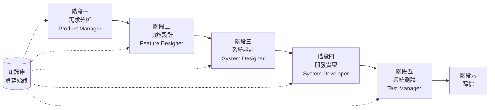

# SpecCrew 快速開始指南

<p align="center">
  <a href="./GETTING-STARTED.md">简体中文</a> |
  <a href="./GETTING-STARTED.zh-TW.md">繁體中文</a> |
  <a href="./GETTING-STARTED.en.md">English</a> |
  <a href="./GETTING-STARTED.ko.md">한국어</a> |
  <a href="./GETTING-STARTED.de.md">Deutsch</a> |
  <a href="./GETTING-STARTED.es.md">Español</a> |
  <a href="./GETTING-STARTED.fr.md">Français</a> |
  <a href="./GETTING-STARTED.it.md">Italiano</a> |
  <a href="./GETTING-STARTED.da.md">Dansk</a> |
  <a href="./GETTING-STARTED.ja.md">日本語</a> |
  <a href="./GETTING-STARTED.ar.md">العربية</a>
</p>

本文檔幫助您快速了解如何使用 SpecCrew 的 Agent 團隊，按照標準工程流程逐步完成從需求到交付的完整開發。

---

## 1. 前置準備

### 安裝 SpecCrew

```bash
npm install -g speccrew
```

### 初始化專案

```bash
speccrew init --ide qoder
```

支援的 IDE：`qoder`、`cursor`、`claude`、`codex`

### 初始化後的目錄結構

```
.
├── .qoder/
│   ├── agents/          # Agent 定義檔案
│   └── skills/          # Skill 定義檔案
├── speccrew-workspace/  # 工作空間
│   ├── docs/            # 配置、規則、模板、解決方案
│   ├── iterations/      # 當前進行中的迭代
│   ├── iteration-archives/  # 歸檔的迭代
│   └── knowledges/      # 知識庫
│       ├── base/        # 基礎資訊（診斷報告、技術債務）
│       ├── bizs/        # 業務知識庫
│       └── techs/       # 技術知識庫
```

### CLI 命令速查

| 命令 | 說明 |
|------|------|
| `speccrew list` | 列出所有可用的 Agent 和 Skill |
| `speccrew doctor` | 檢查安裝完整性 |
| `speccrew update` | 更新專案配置到最新版本 |
| `speccrew uninstall` | 解除安裝 SpecCrew |

---

## 2. 工作流程總覽

### 完整流程圖



### 核心原則

1. **階段依賴**：每階段產出物是下一階段的輸入
2. **Checkpoint 確認**：每個階段都有確認點，需使用者確認後才能進入下一階段
3. **知識庫驅動**：知識庫貫穿始終，為各階段提供上下文

---

## 3. 第零步：專案診斷與知識庫初始化

在開始正式工程流程前，需要先初始化專案知識庫。

### 3.1 專案診斷

**對話範例**：
```
@speccrew-team-leader 診斷專案
```

**Agent 會做什麼**：
- 掃描專案結構
- 偵測技術棧
- 識別業務模組

**產出物**：
```
speccrew-workspace/knowledges/base/diagnosis-reports/diagnosis-report-{date}.md
```

### 3.2 技術知識庫初始化

**對話範例**：
```
@speccrew-team-leader 初始化技術知識庫
```

**三階段流程**：
1. 平台偵測 — 識別專案中的技術平台
2. 技術文檔生成 — 為每個平台生成技術規約文檔
3. 索引生成 — 建立知識庫索引

**產出物**：
```
speccrew-workspace/knowledges/techs/{platform-id}/
├── tech-stack.md          # 技術棧定義
├── architecture.md        # 架構約定
├── dev-spec.md            # 開發規約
├── test-spec.md           # 測試規約
└── INDEX.md               # 索引檔案
```

### 3.3 業務知識庫初始化

**對話範例**：
```
@speccrew-team-leader 初始化業務知識庫
```

**四階段流程**：
1. 特性清單 — 掃描程式碼識別所有功能特性
2. 特性分析 — 分析每個特性的業務邏輯
3. 模組總結 — 按模組彙總特性
4. 系統總結 — 生成系統級業務概覽

**產出物**：
```
speccrew-workspace/knowledges/bizs/
├── {platform-type}/
│   └── {module-name}/
│       └── feature-spec.md
└── system-overview.md
```

---

## 4. 逐階段對話指南

### 4.1 階段一：需求分析（Product Manager）

**如何啟動**：
```
@speccrew-product-manager 我有一個新需求：[描述你的需求]
```

**Agent 工作流程**：
1. 讀取系統概覽了解現有模組
2. 分析使用者需求
3. 生成結構化 PRD 文檔

**產出物**：
```
iterations/{序號}-{類型}-{名稱}/01.product-requirement/
├── [feature-name]-prd.md           # 產品需求文檔
└── [feature-name]-bizs-modeling.md # 業務建模（複雜需求時）
```

**確認要點**：
- [ ] 需求描述是否準確反映使用者意圖
- [ ] 業務規則是否完整
- [ ] 與現有系統的整合點是否明確
- [ ] 驗收標準是否可度量

---

### 4.2 階段二：功能設計（Feature Designer）

**如何啟動**：
```
@speccrew-feature-designer 開始功能設計
```

**Agent 工作流程**：
1. 自動定位已確認的 PRD 文檔
2. 載入業務知識庫
3. 生成功能設計（含 UI 線框圖、交互流、資料定義、API 契約）
4. 多 PRD 時透過 Task Worker 並行設計

**產出物**：
```
iterations/{iter}/02.feature-design/
└── [feature-name]-feature-spec.md  # 功能設計文檔
```

**確認要點**：
- [ ] 所有使用者場景是否都被覆蓋
- [ ] 交互流程是否清晰
- [ ] 資料欄位定義是否完整
- [ ] 異常處理是否完善

---

### 4.3 階段三：系統設計（System Designer）

**如何啟動**：
```
@speccrew-system-designer 開始系統設計
```

**Agent 工作流程**：
1. 定位 Feature Spec 和 API Contract
2. 載入技術知識庫（各端技術棧、架構、規約）
3. **Checkpoint A**：框架評估 — 分析技術差距，推薦新框架（如需要），等待使用者確認
4. 生成 DESIGN-OVERVIEW.md
5. 透過 Task Worker 並行分派各端設計（前端/後端/移動端/桌面端）
6. **Checkpoint B**：聯合確認 — 展示所有平台設計彙總，等待使用者確認

**產出物**：
```
iterations/{iter}/03.system-design/
├── DESIGN-OVERVIEW.md              # 設計概覽
├── {platform-id}/
│   ├── INDEX.md                    # 各平台設計索引
│   └── {module}-design.md          # 偽程式碼級模組設計
```

**確認要點**：
- [ ] 偽程式碼是否使用了實際框架語法
- [ ] 跨端 API 契約是否一致
- [ ] 錯誤處理策略是否統一

---

### 4.4 階段四：開發實現（System Developer）

**如何啟動**：
```
@speccrew-system-developer 開始開發
```

**Agent 工作流程**：
1. 讀取系統設計文檔
2. 載入各端技術知識
3. **Checkpoint A**：環境預檢 — 檢查執行時版本、依賴、服務可用性，失敗時等待使用者解決
4. 透過 Task Worker 並行分派各端開發
5. 整合檢查：API 契約對齊、資料一致性
6. 輸出交付報告

**產出物**：
```
# 原始碼寫入專案實際源碼目錄
iterations/{iter}/04.development/
├── {platform-id}/
│   └── tasks/                      # 開發任務記錄
└── delivery-report.md
```

**確認要點**：
- [ ] 環境是否就緒
- [ ] 整合問題是否在可接受範圍
- [ ] 程式碼是否符合開發規約

---

### 4.5 階段五：系統測試（Test Manager）

**如何啟動**：
```
@speccrew-test-manager 開始測試
```

**三階段測試流程**：

| 階段 | 說明 | Checkpoint |
|------|------|------------|
| 測試案例設計 | 基於 PRD 和 Feature Spec 生成測試案例 | A：展示案例覆蓋統計和追溯矩陣，等待使用者確認覆蓋足夠 |
| 測試程式碼生成 | 生成可執行的測試程式碼 | B：展示生成的測試檔案和案例映射，等待使用者確認 |
| 測試執行與 Bug 報告 | 自動執行測試，生成報告 | 無（自動執行） |

**產出物**：
```
iterations/{iter}/05.system-test/
├── cases/
│   └── {platform-id}/              # 測試案例文檔
├── code/
│   └── {platform-id}/              # 測試程式碼計劃
├── reports/
│   └── test-report-{date}.md       # 測試報告
└── bugs/
    └── BUG-{id}-{title}.md         # Bug 報告（每個 Bug 一個檔案）
```

**確認要點**：
- [ ] 案例覆蓋是否完整
- [ ] 測試程式碼是否可執行
- [ ] Bug 嚴重程度判定是否準確

---

### 4.6 階段六：歸檔

迭代完成後自動歸檔：

```
speccrew-workspace/iteration-archives/
└── {序號}-{類型}-{名稱}-{日期}/
    ├── 01.product-requirement/
    ├── 02.feature-design/
    ├── 03.system-design/
    ├── 04.development/
    └── 05.system-test/
```

---

## 5. 知識庫說明

### 5.1 業務知識庫（bizs）

**作用**：儲存專案的業務功能描述、模組劃分、API 特徵

**目錄結構**：
```
knowledges/bizs/
├── {platform-type}/
│   └── {module-name}/
│       └── feature-spec.md
└── system-overview.md
```

**使用場景**：Product Manager、Feature Designer

### 5.2 技術知識庫（techs）

**作用**：儲存專案的技術棧、架構約定、開發規約、測試規約

**目錄結構**：
```
knowledges/techs/{platform-id}/
├── tech-stack.md
├── architecture.md
├── dev-spec.md
├── test-spec.md
└── INDEX.md
```

**使用場景**：System Designer、System Developer、Test Manager

---

## 6. 常見問題（FAQ）

### Q1: Agent 不按預期工作怎麼辦？

1. 執行 `speccrew doctor` 檢查安裝完整性
2. 確認知識庫已初始化
3. 確認當前迭代目錄中有上一階段的產出物

### Q2: 如何跳過某個階段？

**不建議跳過**，每階段產出是下階段輸入。

如必須跳過，需手動準備對應階段的輸入文檔，並確保格式符合規範。

### Q3: 如何處理多個需求並行？

每個需求建立獨立迭代目錄：
```
iterations/
├── 001-feature-xxx/
├── 002-feature-yyy/
└── 003-feature-zzz/
```

各迭代完全隔離，互不影響。

### Q4: 如何更新 SpecCrew 版本？

- **全局更新**：`npm update -g speccrew`
- **專案更新**：在專案目錄執行 `speccrew update`

### Q5: 如何查看歷史迭代？

歸檔後在 `speccrew-workspace/iteration-archives/` 中查看，按 `{序號}-{類型}-{名稱}-{日期}/` 格式組織。

### Q6: 知識庫需要定期更新嗎？

以下情況需要重新初始化：
- 專案結構發生重大變化
- 技術棧升級或更換
- 新增/刪除業務模組

---

## 7. 快速參考

### Agent 啟動速查表

| 階段 | Agent | 啟動對話 |
|------|-------|----------|
| 診斷 | Team Leader | `@speccrew-team-leader 診斷專案` |
| 初始化 | Team Leader | `@speccrew-team-leader 初始化技術知識庫` |
| 需求分析 | Product Manager | `@speccrew-product-manager 我有一個新需求：[描述]` |
| 功能設計 | Feature Designer | `@speccrew-feature-designer 開始功能設計` |
| 系統設計 | System Designer | `@speccrew-system-designer 開始系統設計` |
| 開發實現 | System Developer | `@speccrew-system-developer 開始開發` |
| 系統測試 | Test Manager | `@speccrew-test-manager 開始測試` |

### Checkpoint 檢查清單

| 階段 | Checkpoint 數量 | 關鍵檢查項 |
|------|-----------------|------------|
| 需求分析 | 1 | 需求準確性、業務規則完整性、驗收標準可度量性 |
| 功能設計 | 1 | 場景覆蓋、交互清晰度、資料完整性、異常處理 |
| 系統設計 | 2 | A：框架評估；B：偽程式碼語法、跨端一致性、錯誤處理 |
| 開發實現 | 1 | A：環境就緒、整合問題、程式碼規約 |
| 系統測試 | 2 | A：案例覆蓋；B：測試程式碼可執行性 |

### 產出物路徑速查

| 階段 | 產出目錄 | 檔案格式 |
|------|----------|----------|
| 需求分析 | `iterations/{iter}/01.product-requirement/` | `[name]-prd.md`, `[name]-bizs-modeling.md` |
| 功能設計 | `iterations/{iter}/02.feature-design/` | `[name]-feature-spec.md` |
| 系統設計 | `iterations/{iter}/03.system-design/` | `DESIGN-OVERVIEW.md`, `{platform}/INDEX.md`, `{platform}/{module}-design.md` |
| 開發實現 | `iterations/{iter}/04.development/` | 原始碼 + `delivery-report.md` |
| 系統測試 | `iterations/{iter}/05.system-test/` | `cases/`, `code/`, `reports/`, `bugs/` |
| 歸檔 | `iteration-archives/{iter}-{date}/` | 完整迭代副本 |

---

## 下一步

1. 執行 `speccrew init --ide qoder` 初始化您的專案
2. 執行第零步：專案診斷與知識庫初始化
3. 按照工作流程逐階段推進，享受規範驅動的開發體驗！
